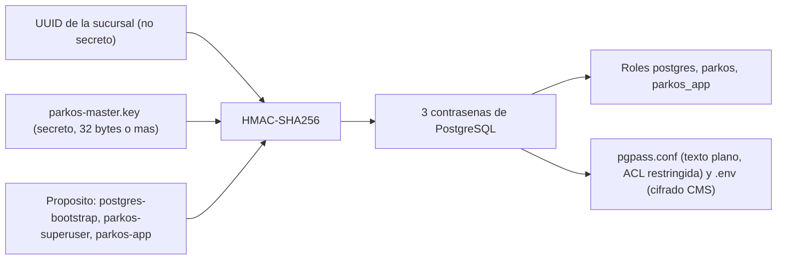
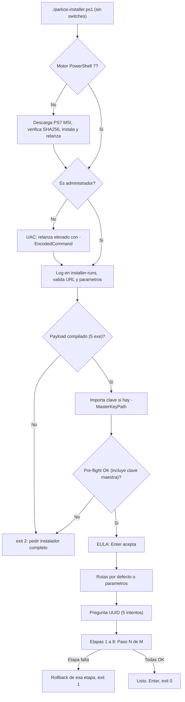
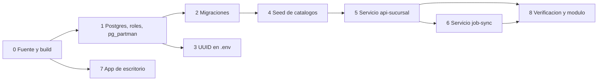

# Manual del instalador Parkos (sucursal)

Manual completo de la instalación de una sucursal Parkos en Windows, sin Docker: qué debe existir, dónde y en qué momento. Describe, con fidelidad al código de `origin/dev`, `installer/parkos-installer.ps1`, el módulo de gestión `installer/payload/management/Parkos.psm1`, el orquestador `installer/build-release.ps1`, los puntos de entrada `installer/bootstrap/*.py`, la herramienta de soporte `installer/tools/Get-ParkosSupportPassword.ps1`, las pruebas `installer/tests/*` y el workflow `.github/workflows/e2e-unattended-vm.yml`.

**Convenciones de este documento**

- Los bloques de código con mensajes de error son **copias literales** del texto que lanza el código (las interpolaciones, como `$Port`, se muestran tal cual aparecen en la fuente). El código no usa tildes en sus mensajes; el resto del manual sí.
- Las referencias `DEC-INST-NN` citan decisiones documentadas en `plan.md`, sección "0.2 Decisiones de arquitectura del instalador". Aquí solo se resume la decisión relevante.
- Los valores sensibles se muestran siempre como marcadores: `<UUID_SUCURSAL>`, `<RUTA_CLAVE>`, `<URL_CLOUD>`. Nunca se documenta una clave, contraseña o UUID real.
- Lo que no se pudo confirmar leyendo el código se marca como **no verificado** y se concentra en la sección [16](#16-limitaciones-conocidas--no-verificado).

**A quién va dirigido cada parte**

| Parte | Lectores | Secciones |
|---|---|---|
| **I. Operador de sucursal** | Persona no técnica que ejecuta la instalación: solo pasos, qué escribir, qué verá y qué hacer si falla | 1 a 4 |
| **II. Técnico / soporte** | Quien prepara el payload, compila, entrega la clave maestra, diagnostica y mantiene | 5 a 17 |

---

## Índice

**Parte I — Operador de sucursal**

1. [Resumen: qué instala y qué no hace](#1-resumen-qué-instala-y-qué-no-hace)
2. [Antes de empezar: checklist de prerrequisitos](#2-antes-de-empezar-checklist-de-prerrequisitos)
3. [Instalación guiada paso a paso (operador)](#3-instalación-guiada-paso-a-paso-operador)
4. [Si algo falla (operador)](#4-si-algo-falla-operador)

**Parte II — Técnico / soporte**

5. [El payload: qué debe existir en `installer/payload/`](#5-el-payload-qué-debe-existir-en-installerpayload)
6. [La clave maestra a fondo](#6-la-clave-maestra-a-fondo)
7. [Línea de tiempo y etapas 0 a 8](#7-línea-de-tiempo-y-etapas-0-a-8)
8. [Modos de ejecución y referencia de parámetros](#8-modos-de-ejecución-y-referencia-de-parámetros)
9. [Mapa de directorios, archivos, permisos y secretos](#9-mapa-de-directorios-archivos-permisos-y-secretos)
10. [Variables de entorno y configuración](#10-variables-de-entorno-y-configuración)
11. [Verificación post-instalación](#11-verificación-post-instalación)
12. [Operación y mantenimiento](#12-operación-y-mantenimiento)
13. [Preparar un release, pruebas y CI](#13-preparar-un-release-pruebas-y-ci)
14. [Solución de problemas: catálogo de mensajes](#14-solución-de-problemas-catálogo-de-mensajes)
15. [Seguridad y cumplimiento](#15-seguridad-y-cumplimiento)
16. [Limitaciones conocidas / no verificado](#16-limitaciones-conocidas--no-verificado)
17. [Glosario](#17-glosario)

---

# Parte I — Operador de sucursal

## 1. Resumen: qué instala y qué no hace

### 1.1 Para quién es y qué hace

El instalador despliega, en un equipo Windows de una sucursal y sin Docker, todo lo necesario para operar Parkos en esa sucursal. Está pensado para que el operador solo ejecute pasos y escriba **un único dato**: el código (UUID) de la sucursal, que se obtiene en el panel de administración.

### 1.2 Qué instala exactamente

| Componente | Detalle |
|---|---|
| **PostgreSQL 16** | Siempre desde el ZIP de binarios de EDB (**ya no se usa `winget`**): si el payload trae `postgres\postgresql-16-windows-x64-binaries.zip` se usa ese; si no, el instalador lo **descarga solo** (necesita Internet) a `<DataPath>\downloads`. Se inicializa con `initdb`, se registra como **servicio de Windows `postgresql-parkos` de inicio automático** (arranca con el equipo) y se espera a que acepte conexiones antes de seguir. Se crean los roles `postgres` (bootstrap), `parkos` (superusuario de migración) y `parkos_app` (runtime, sin privilegios de superusuario) y la base `parkos` |
| **`pg_partman`** | Extensión SQL-only (sin background worker). El mantenimiento de particiones lo dispara la tarea programada `ParkosPgPartmanMaintenance` (diaria, 02:00) |
| **`api-sucursal`** | Servicio de Windows `ParkosApiSucursal` (binario Python congelado con PyInstaller, registrado con NSSM) |
| **`job-sync-sucursal`** | Servicio de Windows `ParkosJobSyncSucursal` (mismo mecanismo) |
| **App de escritorio `web_sucursal`** | Aplicación Electron instalada con un MSI en modo silencioso |
| **Módulo de gestión `Parkos`** | Módulo PowerShell para diagnóstico, reparación, actualización, backups y desinstalación (instalado en la etapa 8) |
| **Cuenta local `svc-parkos`** | Cuenta de Windows sin sesión interactiva, usada como identidad de las tareas programadas |
| **Certificado `CN=ParkosEnvProtection`** | Certificado de máquina que cifra el archivo `.env` en reposo |
| **Tareas programadas** | `ParkosPgPartmanMaintenance` (siempre) y `ParkosBackupDiario` (solo si se configura con la opción `M` del menú) |

### 1.3 Qué NO hace

- **No empareja la sucursal con la nube (pairing).** Ningún código del instalador escribe `sync-agent.jwt` ni `pairing.json` (verificado: la ruta `$DataPath\secrets\sync-agent.jwt` solo se escribe en el `.env` como `PARKOS_SYNC_JWT_PATH`; el archivo lo crearía el comando `parkos_core.cli.pair` del backend, que **no** está congelado ni incluido en el payload). Tras la instalación, el servicio de sincronización queda activo pero registrará `cycle_error ... branch must pair first` hasta que la sucursal se empareje por otra vía (ver [16](#16-limitaciones-conocidas--no-verificado)).
- **No crea la sucursal.** La sucursal se crea en el panel de administración; el instalador solo recibe su UUID y lo escribe en la configuración (DEC-INST-22). La fila llega a la base local por el ciclo de sincronización, nunca por un `INSERT` del instalador.
- **No genera la clave maestra** ni la descarga: usa la que se le indique o, si nadie entrega otra, la **copia versionada en el repositorio** (solo pruebas; ver [6](#6-la-clave-maestra-a-fondo)).
- **No compila nada en el equipo de la sucursal** (salvo `-IncludeBuild`, uso técnico): el payload debe llegar ya compilado.
- **No configura el backup automático** durante la instalación (es la opción `M` del menú o el cmdlet `Register-ParkosBackupTask`).
- **No instala herramientas de desarrollo** (git, pnpm, uv) ni las exige en el equipo de la sucursal.

### 1.4 Qué queda corriendo al terminar

- Servicios de Windows: `ParkosApiSucursal`, `ParkosJobSyncSucursal` y `postgresql-parkos` (PostgreSQL), todos de inicio automático.
- Tarea programada `ParkosPgPartmanMaintenance`.
- La app de escritorio instalada.
- El módulo PowerShell `Parkos` disponible (`C:\Program Files\PowerShell\Modules\Parkos\1.0.0\`).

---

## 2. Antes de empezar: checklist de prerrequisitos

### 2.1 Checklist con responsable y momento

| # | Requisito | Detalle | Quién lo aporta | Cuándo se necesita | Si falta |
|---|---|---|---|---|---|
| 1 | Windows 10 21H2 o superior | Build `>= 19044` | Sucursal / TI | Pre-flight (`Windows >= 10 21H2`) | `[FALLO] Windows >= 10 21H2` y la instalación no empieza |
| 2 | Espacio libre | Más de **5 GB** en la unidad donde se instala (por defecto `C:`) | Sucursal / TI | Pre-flight (`Espacio en disco (>=5GB)`) | `[FALLO]` y no empieza |
| 3 | Permisos de administrador | Usuario administrador local; se acepta el aviso UAC | Sucursal / TI | Al arrancar (elevación automática) | `Se requieren permisos de administrador para instalar Parkos.` (termina, sin cambios) |
| 4 | PowerShell 7 | Si el equipo solo tiene Windows PowerShell 5.1, el instalador **descarga e instala PowerShell 7.4.6** (verifica su SHA256) y se relanza solo. Requiere internet en ese momento (`github.com`) | Automático | Al arrancar, antes de la elevación | `Hash de PowerShell 7 no coincide; instalacion abortada por seguridad.` o error de descarga |
| 5 | Ejecución de scripts permitida | Si Windows bloquea la ejecución del `.ps1`, abrir PowerShell y ejecutar con `-ExecutionPolicy Bypass` (ver 3.1). **No verificado**: depende de la política del equipo | Soporte / TI | Al arrancar | Mensaje de Windows sobre la política de ejecución |
| 6 | Instalador y payload completos | Carpeta `installer\` con `parkos-installer.ps1` **y** `payload\` ya preparado (`-Command Prepare`, ver [13.2b](#132b-modo-prepare-un-solo-comando-del-técnico)). Si NO está preparado pero el equipo tiene el toolchain (git, uv, node, pnpm), el instalador **compila lo que falte solo** (etapa 0 automática, sin tocar git). En un PC de sucursal no se instalan herramientas de desarrollo (DEC-INST-20) | Soporte | Antes de empezar / pre-flight | Pre-flight: `[FALLO] Programas de Parkos` con **un solo** mensaje (qué instalar, o "pida un instalador completo al equipo de soporte"); exit 2 sin cambios |
| 7 | **Clave maestra** `parkos-master.key` | Archivo de 32 bytes o más. Ya viene versionado en `payload\security\` (solo pruebas); para producción se entrega la propia con `-MasterKeyPath` (ver 3.2) | Repositorio (copia de pruebas) / Soporte (clave propia) | Pre-flight de la instalación guiada | `[FALLO] Clave maestra de Parkos` (paquete dañado, o `-Produccion` con la clave del repositorio) y no empieza |
| 8 | **UUID de la sucursal** | Código `8-4-4-4-12` (letras y números separados por guiones). Está en la ficha de la sucursal del panel de administración | Administrador del panel admin | Cuando el instalador lo pide (es lo único que se escribe) | Hasta 5 intentos; luego `Demasiados intentos con un codigo de sucursal invalido ...` |
| 9 | Dirección del servidor (nube) | Variable `PARKOS_CLOUD_API_URL` (`http://` o `https://`). **Opcional**: si no existe se usa `http://localhost:8000`. Se prueba la conexión a su `host:puerto` | Soporte / TI | Pre-flight | Servidor remoto sin respuesta: `[FALLO] Conexion con el servidor Parkos`. En `localhost`: solo `[AVISO]` y continúa |
| 10 | Binarios de PostgreSQL | **Vienen en el repositorio** como partes (`payload\parts\postgres\*.zip.part01..NN` + `.sha256`, ver [5.4](#54-payload-en-partes-payloadparts)): la etapa 1 las rearma en `<DataPath>\downloads\` y verifica el SHA-256; **no hace falta Internet ni bajar nada a mano**. Orden de búsqueda: ZIP completo en `payload\postgres\` → partes (`payload\parts\postgres\`) → cache → descarga desde `get.enterprisedb.com` (último recurso, ~330 MB, 3 intentos) | Soporte (ya versionado) | Etapa 1 | Partes con un hueco o hash distinto: error claro con el comando `git checkout -- installer/payload/parts` (no cae en silencio a una descarga). Sin partes ni Internet: `No se pudo obtener los binarios de Postgres 16.15-1 ...` |
| 11 | Puertos libres | Uno de `5432`–`5439` (Postgres) y uno de `8000`–`8009` (API). Se eligen consultando los **listeners TCP reales** del sistema (`GetActiveTcpListeners`): un connect/bind de prueba informaba como libres puertos retenidos por Docker/WSL (error del lite) | Sucursal / TI | Etapa 1 | `Los puertos 5432 a 5439 estan todos ocupados; ...` / `Puertos 8000, ... todos ocupados; ...` |
| 12 | Sin instalación previa de Parkos | Que no exista `C:\ProgramData\Parkos\pairing.json` | — | Pre-flight (`Sin instalacion previa`) | `[FALLO]` y el aviso `Ya existe una instalacion de Parkos en este equipo.` |

### 2.2 Qué debe existir y cuándo (resumen cronológico)

| Momento | Debe existir |
|---|---|
| Antes de ejecutar nada | Carpeta `installer\` con `parkos-installer.ps1` y `payload\` compilado; archivo `parkos-master.key` (en `payload\security\` o en otra ruta para `-MasterKeyPath`); el UUID de la sucursal a mano |
| Al arrancar | Internet a `github.com` solo si falta PowerShell 7; usuario administrador |
| Pre-flight | Windows 10 21H2+, 5 GB libres, administrador, conexión al servidor (`host:puerto`), clave maestra válida, sin `pairing.json` |
| EULA | `payload\README-EULA.txt` (salvo `-EulaAccepted`) |
| Etapa 1 (Paso 1 de 8) | Las partes de Postgres versionadas en `payload\parts\postgres\` (sin Internet; la descarga solo es el último recurso); puertos libres; `ParkosPostgresDownload.ps1` junto al instalador; clave maestra. `payload\pg_partman\extension\` (si falta, se descarga y ensambla) |
| Etapa 2 | `payload\services\migrate\migrate\migrate.exe` |
| Etapa 4 | `payload\services\api-sucursal\...` y `payload\services\seed\seed\seed.exe` |
| Etapas 5 y 6 | `payload\nssm.exe`, bundles `api-sucursal` y `job-sync-sucursal` |
| Etapa 7 | Un `.msi` en `payload\apps\` |
| Etapa 8 | `payload\services\doctor\doctor\doctor.exe`, `payload\nssm.exe`, `payload\management\*` |

---

## 3. Instalación guiada paso a paso (operador)

### 3.1 Abrir el instalador

1. Abre PowerShell (mejor como administrador) y ve a la carpeta del instalador (la que contiene `parkos-installer.ps1` y `payload\`).
2. Ejecuta, **sin ninguna opción**:

   ```powershell
   ./parkos-installer.ps1
   ```

   Si Windows bloquea la ejecución de scripts, usa:

   ```powershell
   powershell -ExecutionPolicy Bypass -File .\parkos-installer.ps1
   ```

3. Si no eres administrador, Windows mostrará el aviso de permisos (UAC): **acéptalo**. Se abrirá una ventana nueva con permisos elevados y la ventana original esperará. En esa ventana nueva ocurre todo lo demás. Si el equipo solo tiene PowerShell 5.1, primero verás `Instalando PowerShell 7 (requerido)...`.
4. Si entregaste la clave con una ruta propia, agrégala: `./parkos-installer.ps1 -MasterKeyPath "<RUTA_CLAVE>"` (ver 3.2).
5. **Instalación sin escribir nada (cero intervención):** el UUID puede venir de `-SucursalUuid <UUID_SUCURSAL>`, de la variable de entorno `PARKOS_SUCURSAL_UUID` o de un archivo `parkos-install.json` junto al instalador (o `-AnswersPath <ruta>`), en ese orden de prioridad:

   ```json
   { "sucursalUuid": "<UUID_SUCURSAL>", "cloudApiUrl": "<URL_CLOUD>", "eulaAccepted": true }
   ```

   Con el UUID y el EULA ya indicados (`-EulaAccepted` o `eulaAccepted: true`) el asistente no pregunta nada y tampoco espera la tecla final. La clave maestra ya no hay que pedirla (se usa la versionada en el repositorio si no se indica otra) y lo único estrictamente obligatorio es la aceptación de UAC.

### 3.2 Clave maestra: guía para quien instala o prueba

**Qué es.** Un archivo llamado `parkos-master.key` (32 bytes aleatorios). El instalador lo usa para calcular las contraseñas de la base de datos de cada sucursal; con él, soporte puede volver a calcularlas si hace falta.

**Para probar o hacer QA: no tienes que hacer nada.** El repositorio incluye una copia en `installer\payload\security\parkos-master.key` y el instalador la usa solo. Verás en amarillo: `[AVISO] Usando la clave maestra versionada en el repositorio (solo pruebas/QA). Cualquiera con acceso al repositorio puede derivar las contrasenas de Postgres. Para produccion entregue su propia clave con -MasterKeyPath o PARKOS_MASTER_KEY_FILE.` (y se repite en el resumen final). No es un error.

**Para producción: entrega tu propia clave (elige una) y añade `-Produccion`.**

- **Opción A:** `./parkos-installer.ps1 -Produccion -MasterKeyPath "<RUTA_CLAVE>"`. El instalador valida el tamaño y la **usa tal cual** (no la copia sobre el archivo versionado).
- **Opción B:** define la variable `PARKOS_MASTER_KEY_FILE` con la ruta y ejecuta `./parkos-installer.ps1 -Produccion`.
- Con `-Produccion` el pre-flight **rechaza** la clave del repositorio (`[FALLO] Clave maestra de Parkos` / `-Produccion no admite la clave maestra versionada en el repositorio ...`).

**Cómo comprobar que está bien.** Debe pesar **32 bytes o más**. En PowerShell: `(Get-Item "<RUTA_CLAVE>").Length`. Si es menor de 32, está truncado o es incorrecto.

**Reglas.**

- Usa la **misma clave** para todas las instalaciones de una flota; si generas otra por tu cuenta, soporte no podrá reconstruir esas contraseñas.
- La clave real de producción **no** se sube a git, ni a tickets ni a chat.
- Si el mensaje dice que falta la clave, el paquete está dañado: restaura con `git checkout -- installer/payload/security` o entrega una con `-MasterKeyPath`.
- El pre-flight muestra `[OK] Clave maestra de Parkos`; el registro de la instalación anota el **origen** (`param`, `env` o `repo`), nunca la clave.

Más detalle técnico (derivación, seguridad, qué hacer después): sección [6](#6-la-clave-maestra-a-fondo).

### 3.3 Qué verás, en orden

| Orden | Qué verás en pantalla | Qué debes hacer |
|---|---|---|
| 1 | `=== Instalacion de Parkos ===` y la frase "Solo se le pedira un dato: el codigo (UUID) de la sucursal." | Nada. No cierres la ventana |
| 2 | `Revisando que este equipo este listo para instalar Parkos...` y una lista de verificaciones: `[OK] Windows >= 10 21H2`, `[OK] PowerShell >= 7`, `[OK] Permisos de administrador`, `[OK] Espacio en disco (>=5GB)`, `[OK] Sin instalacion previa`, `[OK] Conexion con el servidor Parkos`, `[OK] Clave maestra de Parkos` | Si alguna dice `[FALLO]`, la instalación se detiene sin cambios: ve a la sección 4 |
| 3 | El texto del acuerdo de licencia (EULA) y: `Presione Enter para ACEPTAR los terminos y continuar (o escriba N y Enter para cancelar)` | Lee y pulsa **Enter** para aceptar. Si escribes `N`, se cancela sin cambios |
| 4 | `Este es el unico dato que debe escribir: el codigo (UUID) de esta sucursal.` y `Codigo (UUID) de la sucursal:` | Pega el UUID de la ficha de la sucursal en el panel de administración, con el aspecto `11111111-2222-3333-4444-555555555555`. Se aceptan mayúsculas y espacios alrededor. Tienes **5 intentos** |
| 5 | `Paso 1 de 8: Instalando la base de datos... (puede tardar unos minutos, no cierre esta ventana)`, y así sucesivamente | Espera. Cada paso termina con `Paso N de 8 terminado.` |
| 6 | `Listo: Parkos quedo instalado y funcionando en este equipo.` | Pulsa Enter para cerrar la ventana |

### 3.4 Los 8 pasos que verás

> Si el paquete no venía preparado y el equipo tiene el toolchain, aparece un paso previo **"Preparando los archivos de instalación"** (la numeración pasa a "N de 9") que compila lo que falte. Si una etapa ya estaba hecha de una corrida anterior (base de datos funcionando para **esta** sucursal, app de escritorio instalada), se informa `ya estaba hecho ...; se omite` y sigue; las etapas baratas e idempotentes (2, 3, 4, 5, 6 y 8) se vuelven a correr siempre.

| Paso | Mensaje | Qué está haciendo |
|---|---|---|
| 1 de 8 | Instalando la base de datos | Descarga PostgreSQL (necesita Internet, ~330 MB, solo la primera vez), lo instala como servicio de Windows que arranca con el equipo y crea usuarios y datos de acceso |
| 2 de 8 | Preparando las tablas de la base de datos | Crea la estructura de tablas |
| 3 de 8 | Configurando esta sucursal | Guarda el código de la sucursal en la configuración |
| 4 de 8 | Cargando los datos iniciales | Siembra catálogos (p. ej. tipos de vehículo) |
| 5 de 8 | Instalando el servicio principal de Parkos | Instala y arranca el servicio de la API |
| 6 de 8 | Instalando el servicio de sincronización | Instala y arranca el servicio de sincronización |
| 7 de 8 | Instalando la aplicación de escritorio | Instala la aplicación que usa el personal |
| 8 de 8 | Verificando que todo funcione | Comprueba todo e instala las herramientas de gestión |

El tiempo total depende del equipo y de la descarga de PostgreSQL (si falla por falta de Internet, el instalador muestra la dirección y la carpeta donde dejar el archivo y se puede volver a ejecutar sin perder lo ya hecho); el código no fija una duración (los pasos 5, 6 y 4 esperan hasta 30 segundos a que el servicio responda). Los mensajes dicen "puede tardar unos minutos".

### 3.5 Al terminar

- Verás `Listo: Parkos quedo instalado y funcionando en este equipo.`
- La ventana pide `Presione Enter para cerrar esta ventana`.
- Se guardó un registro en `C:\ProgramData\Parkos\installer-runs\<fecha-hora>.log`.
- El paso de **emparejamiento con la nube no forma parte de este instalador** (sección 1.3): avisa a soporte para completarlo.

---

## 4. Si algo falla (operador)

**Regla general.** Si el instalador falla en un paso, **se detiene**, deshace los cambios de ese paso y te lo explica. No lo repitas una y otra vez: toma una **foto o copia de los mensajes de la ventana** y envíala a soporte **junto con el archivo de registro** (`C:\ProgramData\Parkos\installer-runs\<fecha-hora>.log`). Si el mensaje dice "No fue posible deshacer automaticamente los cambios de ese paso", avísalo a soporte y no sigas.

| Qué ves | Qué significa | Qué hacer |
|---|---|---|
| `Este instalador no trae los programas ya preparados ...` | El paquete está incompleto (falta la carpeta `payload` compilada) | Pide a soporte un instalador completo |
| `[FALLO] Clave maestra de Parkos` | La copia del repositorio falta o pesa menos de 32 bytes (paquete dañado), o se usó `-Produccion` sin entregar clave propia | Restaura con `git checkout -- installer/payload/security` o entrega una clave con `-MasterKeyPath` (3.2) |
| `[FALLO] Conexion con el servidor Parkos` | El servidor remoto no responde | Revisa red e internet; confirma con soporte la dirección `PARKOS_CLOUD_API_URL`; vuelve a ejecutar |
| `[AVISO] No se pudo contactar al servidor Parkos en localhost:8000 ...` | El servidor es este mismo equipo y aún no está encendido | No bloquea. Si el servidor está en otro equipo, pide a soporte definir `PARKOS_CLOUD_API_URL` |
| `[FALLO] Permisos de administrador` o `Se requieren permisos de administrador para instalar Parkos.` | No se aceptó el aviso UAC o la cuenta no es administradora | Vuelve a ejecutar y acepta el aviso con una cuenta administradora |
| `[FALLO] Espacio en disco (>=5GB)` | Hay 5 GB o menos libres | Libera espacio y repite |
| `[FALLO] Windows >= 10 21H2` | Windows demasiado antiguo | Actualiza Windows o usa otro equipo |
| `[FALLO] Sin instalacion previa` + `Ya existe una instalacion de Parkos en este equipo.` | Existe `pairing.json` de una instalación previa | No reinstales: consulta a soporte (se usa actualización o reparación) |
| `Demasiados intentos con un codigo de sucursal invalido` | El UUID se escribió mal 5 veces | Copia el UUID desde el panel de administración y vuelve a ejecutar |
| `La direccion del servidor Parkos (...) no es valida` | `PARKOS_CLOUD_API_URL` mal escrita | Pide a soporte corregirla (debe empezar con `http://` o `https://`) |
| `Puertos 5432 y 5433 ambos ocupados ...` | Otro programa usa los puertos de la base de datos | Avisa a soporte |
| `No se pudo completar el paso N de M ...` | Falló una etapa; ya se deshizo | Envía foto de la ventana y el archivo de registro a soporte |
| La ventana se cierra sola al inicio | La elevación (UAC) se rechazó o el equipo reinició PowerShell | Vuelve a abrir PowerShell como administrador y ejecuta de nuevo |

Los mensajes técnicos completos están en la sección [14](#14-solución-de-problemas-catálogo-de-mensajes).

---

# Parte II — Técnico / soporte

## 5. El payload: qué debe existir en `installer/payload/`

El instalador resuelve el payload como `<carpeta de parkos-installer.ps1>\payload` (`$script:PayloadRoot`). **Entregar al equipo de la sucursal la carpeta `installer\` con `parkos-installer.ps1` y `payload\`** (la carpeta `tools\`, `tests\` y `bootstrap\` no se usan en la instalación).

### 5.1 Qué va en git y qué no

Regla del repositorio: **GitHub rechaza cualquier archivo de más de 100 MB** (no se usa LFS), así que todo instalador/artefacto que lo supere se **comprime y se corta en partes de ≤ 90 MiB** que se versionan, y el instalador las **rearma igual** al usarlas. El peso del repositorio no es un problema; sí lo es que falte algo para una instalación LITE o COMPLETA.

`installer/.gitignore` ignora todo `payload/*` **salvo** `payload/management/`, `payload/README-EULA.txt` y `payload/parts/`. En git hay: `README-EULA.txt`, `management/*` y **`parts/`** (las partes de los artefactos de terceros: Postgres, PowerShell 7, nssm, pg_partman, y —solo al publicar una versión— MSI de web_sucursal y servicios congelados, más `parts/payload-parts.json`). Las formas **crudas/desempaquetadas** (`services\`, `apps\`, `*.msi` y `nssm.exe` en la raíz del payload, `pg_partman\`, `postgres\*.zip`, los marcadores `*.parts-sha256`) siguen ignoradas: lo versionado es lo empaquetado. La clave maestra `payload\security\parkos-master.key` **nunca** va en git (ni se genera). También se ignoran `.pyinstaller-work/`, `__pycache__/` y `*.spec`.
### 5.2 Tabla del payload

| Ruta bajo `installer/payload/` | Qué es | Quién lo produce | En git | Se consume en | Si falta |
|---|---|---|---|---|---|
| `README-EULA.txt` | Texto del acuerdo de licencia | Repo (documento legal) | **Sí** | EULA (guiado y menú; no se lee con `-EulaAccepted` ni en `-Unattended`) | `EULA file not found at $EulaPath - a real EULA (...) must be staged there before this installer ships.` |
| `management\Parkos.psd1`, `Parkos.psm1`, `about_Parkos.help.txt` | Módulo de gestión `Parkos` | Repo | **Sí** | Etapa 8 (`Install-ManagementModule`); opciones `A/R/U/V/X/D/M/C` del menú (importa desde aquí); `build-release.ps1` etapa Payload valida su existencia | `Falta $src en el payload - no se puede instalar el modulo de gestion Parkos.` / en build: `Falta $manifestPath - el modulo Parkos.psd1 debe existir versionado en el repo (no se descarga).` |
| `security\parkos-master.key` | Clave maestra (≥ 32 bytes; copia versionada en el repo, solo pruebas) | **Repositorio** (o la clave propia por `-MasterKeyPath`/`PARKOS_MASTER_KEY_FILE`) | No | Pre-flight guiado (bloquea) y etapa 1 (`New-ParkosDerivedPassword`) | Ver mensajes en la sección [6.5](#65-validación-y-mensajes) |
| `parts\postgres\postgresql-16.15-1-windows-x64-binaries.zip.part01..NN` + `.sha256` | ZIP de PostgreSQL 16 (EDB) **partido** (GitHub rechaza archivos > 100 MB) y SHA-256 del ZIP completo | Repo (ver [5.4](#54-payload-en-partes-payloadparts)) | **Sí** | Etapa 1: rearma el ZIP en `<DataPath>\downloads\` (nunca dentro de `payload\`), verifica el hash y lo usa | Hueco / hash distinto / falta el `.sha256`: error claro con `git checkout -- installer/payload/parts`; sin partes: descarga desde EDB |
| `postgres\postgresql-16-windows-x64-binaries.zip` (ZIP completo) | Alternativa manual a las partes; gitignored (también vale en `parts\postgres\`) | Soporte (opcional) | No | Etapa 1 (tiene prioridad sobre las partes) | Se usan las partes |
| `ParkosPostgresDownload.ps1` (junto a `parkos-installer.exe`; en el repo: `installer\shared\`) | Código compartido de descarga/instalación de Postgres y `pg_partman` (lo carga el instalador con dot-source) | `build-release.ps1` (lo copia a `payload\` en la etapa del instalador y lo incluye en `manifest.sha256.json`) | **Sí** (en `installer\shared\`) | Etapa 1 | `Falta ParkosPostgresDownload.ps1 junto al instalador ...` |
| `ParkosPayloadParts.ps1` (junto a `parkos-installer.exe`; en el repo: `installer\shared\`) | Código compartido de empaquetar/restaurar el payload en partes (lo carga el instalador con dot-source; también lo usa el instalador lite) | `build-release.ps1` (lo copia a `payload\` y lo incluye en `manifest.sha256.json`) | **Sí** (en `installer\shared\`) | Restauración de partes (etapa 0 guiada, `Assert-PayloadPath`, `-Command Prepare`) | Sin él no se restaura de partes (los terceros se descargan como antes); `Prepare` lo exige |
| `parts\payload-parts.json` + `parts\<id>\<archivo>.partNN` | Manifest y partes de cada artefacto empaquetado (ver [5.4](#54-payload-en-partes-payloadparts)) | `tools\Pack-ParkosPayload.ps1` / `build-release.ps1 -Pack` | **Sí** | Restauración (`Restore-ParkosPayloadAll`), CI y `-Command Prepare` (`Test-ParkosPayloadParts`) | `No se puede restaurar '<id>': falta la parte ...` / `... esta danada: hash ...` |
| `nssm.exe` | NSSM 2.24 (x64) | Se **restaura** de `parts\nssm\` (id `nssm`); si no está, `build-release.ps1` lo descarga de `nssm.cc` | Solo como parte (`parts\nssm\`) | Etapas 5 y 6 (registro de servicios); etapa 8 lo copia a `InstallPath\nssm.exe` | Se restaura de `parts\` antes de fallar; etapas 5/6: error crudo de PowerShell al invocar `nssm.exe`; etapa 8: `Falta $nssmSrc en el payload - no se puede instalar nssm.exe para el modulo de gestion Parkos.` |
| `pg_partman\extension\pg_partman--5.1.0.sql` y `pg_partman.control` | Extensión `pg_partman` 5.1.0 SQL-only | Se **restaura** de `parts\pg_partman-extension\` (id `pg_partman-extension`); si no, `build-release.ps1` descarga el fuente v5.1.0 y concatena `types`+`tables`+`functions`+`procedures` | Solo como parte (`parts\pg_partman-extension\`) | Etapa 1 (`Install-PgPartman`: copia a `share\extension\` de Postgres) | Se restaura de `parts\`; si no hay partes, se descarga y ensambla |
| `services\api-sucursal\api-sucursal\` (`api-sucursal.exe` + onedir + `migrations\` + `alembic.ini`) | Servicio API congelado (PyInstaller `--onedir`) | `build-release.ps1 -ApiSucursal` | No | `Test-ParkosPayloadReady`; etapa 4 (arranque temporal); etapa 5 (copia a `InstallPath\api-sucursal\`) | Guiado: `Este instalador no trae los programas ya preparados ...`. Menú/etapa: `Falta el bundle del servicio 'api-sucursal' en el payload (...). Ejecute la opcion 0 ...` |
| `services\job-sync-sucursal\job-sync-sucursal\` | Worker de sincronización congelado | `build-release.ps1 -JobSync` | No | `Test-ParkosPayloadReady`; etapa 6 | Igual que el anterior (`el bundle del servicio 'job-sync-sucursal'`) |
| `services\migrate\migrate\migrate.exe` (+ `migrations\`, `alembic.ini`) | Alembic congelado (`entry_migrate.py`) | `build-release.ps1 -Migrate` | No | `Test-ParkosPayloadReady`; etapa 2; `-Command Update` (usa el de **payload nuevo**) | `Falta el bundle del servicio 'migrate' en el payload (...)` |
| `services\seed\seed\seed.exe` | Siembra de catálogos vía API (`entry_seed.py`) | `build-release.ps1 -Seed` | No | `Test-ParkosPayloadReady`; etapa 4 | Error al invocar `seed.exe` / `Build termino sin error pero falta el artefacto esperado: ...` (solo etapa 0) |
| `services\doctor\doctor\doctor.exe` | Diagnóstico (`parkos_core.cli.doctor`) | `build-release.ps1 -Doctor` | No | `Test-ParkosPayloadReady`; etapa 8 (`Test-PostInstallation` y copia a `InstallPath\doctor\`) | `Falta $doctorSrc en el payload - no se puede instalar doctor.exe para el modulo de gestion Parkos.` |
| `apps\web_sucursal-<version>-x64.msi` | Instalador de la app Electron | `build-release.ps1 -WebSucursal` (electron-builder) | No | Etapa 7 (se usa el **primer** `*.msi` de la carpeta) | `Falta el MSI de web_sucursal en el payload ($appsDir). Ejecute la opcion 0 ...` |
| `manifest.sha256.json` | Hashes SHA256 (clave = ruta relativa) de los 4 `.exe`, el `.msi`, `ParkosPostgresDownload.ps1`, `ParkosPayloadParts.ps1` y **todas las partes de `parts\` (incluido `payload-parts.json`)** | `build-release.ps1` (con `-Manifest`, con `-All`, o si se construyen `-ApiSucursal -JobSync -Migrate -Doctor -WebSucursal` en la misma corrida) | No | **Solo** `-Command Update` (paso VERIFY BINARIES sobre el payload **nuevo**). La instalación limpia no lo lee | `Falta el manifest de integridad del payload en $manifestPath - no se puede verificar el payload nuevo.` |
| `PowerShell-7.4.6-win-x64.msi` | MSI de PowerShell 7 (104 MB: **supera el límite**, va en 2 partes) con SHA256 verificado | `build-release.ps1` (restaura de `parts\powershell7-msi\` o descarga y verifica) | Solo como partes (`parts\powershell7-msi\`) | **No lo consume el instalador completo**: `Ensure-PowerShell7` descarga su propia copia a `%TEMP%` desde GitHub. Queda en git para poder armar el instalador LITE sin Internet | — |
| `parkos-installer.exe` | Instalador compilado con `ps2exe` (`-requireAdmin`) | `build-release.ps1 -Installer` (se omite con aviso si no existe el módulo `ps2exe`) | No | Opcional (distribución alternativa al `.ps1`). **No verificado** su comportamiento | — |

### 5.3 Qué comprueba el instalador antes de empezar

En el flujo guiado, **antes de decidir construir** se restaura de `payload\parts\` lo que falte en el payload crudo (log `Restaurando <id> n de m`): terceros siempre; servicios y MSI solo si no hay git o ningún archivo bajo `backend/` ni `installer\bootstrap\` cambió desde el `builtFromCommit` del manifest (`Get-ParkosPartsArtifactDecision`); si cambió, se construye. Lo restaurable cuenta como presente. Luego `Get-ParkosPayloadBuildPlan` decide si hay que (re)construir el resto: **no** hace falta cuando existen los 5 exe, el MSI, `nssm.exe` y `pg_partman`, y **ningún archivo bajo `backend/` ni `installer\bootstrap\` es más nuevo que el exe más viejo** (se listan con `git ls-files -co --exclude-standard`, incluye cambios sin commit; si git falla se compila por seguridad). Si hay que construir y falta el toolchain, el pre-flight lo informa junto con el resto de problemas. Además, `Test-ParkosPayloadReady` verifica la existencia de **5 ejecutables**: `api-sucursal`, `job-sync-sucursal`, `migrate`, `seed` y `doctor`. No comprueba el `.msi`, `nssm.exe`, `pg_partman`, la clave ni `management\`; esos faltantes aparecen más tarde, en la etapa que los consume. Por eso conviene validar el payload completo con la checklist de la sección [13.4](#134-checklist-de-entrega-antes-de-enviar-a-la-sucursal).

### 5.4 Payload en partes (`payload\parts`)

**Diseño.** Todo artefacto del payload que no deba rehacerse en cada instalación viaja en git como *partes*: un archivo (o un `.zip` de una carpeta) cortado en trozos de **≤ 90 MiB** (`<archivo>.part01..NN`), más un manifest con hashes. El código es `installer\shared\ParkosPayloadParts.ps1` (compartido por el instalador completo, `build-release.ps1`, `tools\Pack-ParkosPayload.ps1` y el lite).

**Disposición:**

```
installer/payload/parts/
  payload-parts.json                          manifest (version, generator, artifacts[])
  postgres/postgresql-16.15-1-windows-x64-binaries.zip.part01..04  + .sha256 (sidecar)
  powershell7-msi/PowerShell-7.4.6-win-x64.msi.part01..02
  nssm/nssm.exe                               (<= 90 MiB: se guarda tal cual, una sola parte)
  pg_partman-extension/pg_partman-extension.zip
  [web-sucursal-msi/, api-sucursal/, job-sync-sucursal/, migrate/, seed/, doctor/   solo al publicar]
```

**Campos del manifest** (por artefacto): `id`, `kind` (`file`|`dir`), `target` (ruta relativa bajo `payload\` donde se restaura), `archive` (nombre del archivo o `<id>.zip`), `uncompressedSize`, `archiveSize`, `sha256` (del archivo final), `partCount`, `parts[]` (`name`, `size`, `sha256`), `builtFromCommit` (commit del repo al empaquetar), `packedAtUtc`, `source` (p. ej. `third-party download (...)` o `built from backend (PyInstaller onedir) @ <commit>`), `note`, `sourceDependent` (su contenido sale de `backend/` o `installer\bootstrap\`) y `restoreToPayload` (`false` para Postgres: se rearma en la cache al instalar, no en `payload\`).

**Artefactos y tabla** (`Get-ParkosPayloadArtifactTable`): `postgres`, `powershell7-msi`, `nssm`, `pg_partman-extension` se empaquetan por defecto; `web-sucursal-msi`, `api-sucursal`, `job-sync-sucursal`, `migrate`, `seed` y `doctor` están definidos y **ya van versionados** (empaquetados con `-Ids` desde una compilación fresca de `eed68026`; `builtFromCommit` de cada entrada = ese commit). Así la instalación LITE y la COMPLETA funcionan solo con lo que hay en el repositorio.

**Empaquetar** (desde el repo, con el payload crudo presente):

```powershell
# terceros estables (los que haya crudos en installer\payload)
pwsh -File installer\tools\Pack-ParkosPayload.ps1
# equivalente desde el orquestador
pwsh -File installer\build-release.ps1 -Pack
# servicios / MSI: SOLO al publicar una version (ver politica de peso)
pwsh -File installer\tools\Pack-ParkosPayload.ps1 -Ids api-sucursal,job-sync-sucursal,migrate,seed,doctor,web-sucursal-msi
```

Si el contenido no cambió (mismo sha256 del archivo final) las partes existentes **no se reescriben** (sin ruido en git); `-Force` las reescribe. El empaquetador **rechaza escribir cualquier archivo de más de 95 MiB** en `parts\` y falla si `-MaxPartBytes` supera ese límite. Las carpetas se comprimen con zip determinista (orden ordinal, fecha fija 2020-01-01, `Optimal`).

**Restaurar** (rearma por streaming, verifica tamaño y hash de cada parte y el sha256 final, y expande con comprobación anti zip-slip):

```powershell
pwsh -File installer\build-release.ps1 -Restore                 # todo lo que va a payload\
pwsh -File installer\build-release.ps1 -Restore -Ids nssm       # solo uno
```

La restauración es **idempotente**: deja `<destino>.parts-sha256` y una segunda llamada no hace nada si coincide. El instalador restaura solo, sin comandos: etapa 0 guiada (`Restaurando <id> n de m`), `Assert-PayloadPath` (antes de fallar por un archivo faltante) y `build-release.ps1 -Payload` (antes de descargar). Una parte faltante o con hash distinto es un **error claro** (`git checkout -- installer/payload/parts`), nunca un salto silencioso a otra fuente. Los archivos restaurados llevan la fecha de la restauración (no la del zip), para que no parezcan "viejos" frente al código.

**Verificar** (`Test-ParkosPayloadParts`, usado por CI y `-Command Prepare`): todas las partes presentes, tamaños y hashes, ninguna > 90 MiB y ningún archivo desconocido en `parts\`. El workflow `installer-tests.yml` además falla si algún archivo versionado pesa más de 95 MiB.

**Postgres.** `Get-ParkosPostgresZip` (en `installer\shared\ParkosPostgresDownload.ps1`) busca en este orden: (1) ZIP completo válido en el payload, (2) partes de `payload\parts\postgres\`: concatena por streaming **en la cache** (`<DataPath>\downloads`), verifica contra el `.sha256` y valida con `Test-ParkosPostgresZip`; reutiliza el ZIP ya rearmado, (3) cache de descargas, (4) descarga desde EDB. Con partes defectuosas falla con mensaje claro. Prepare nunca crea el ZIP completo dentro del payload. Para refrescar Postgres (nueva versión fijada en `Get-ParkosPostgresDownloadInfo`): borrar `parts\postgres\`, dejar el ZIP nuevo en `payload\postgres\`, actualizar el nombre en la tabla (`Get-ParkosPayloadArtifactTable`) y correr `Pack-ParkosPayload.ps1 -Ids postgres -Force`; escribir además `parts\postgres\<zip>.sha256` si se quiere conservar el sidecar.

**Refrescar cada artefacto:**

| Artefacto | Cuándo | Comando |
|---|---|---|
| `powershell7-msi`, `nssm`, `pg_partman-extension` | Al cambiar la versión fijada en `build-release.ps1` | Dejar el crudo en `payload\` (`build-release.ps1 -Payload` lo descarga) y `Pack-ParkosPayload.ps1 -Ids <id> -Force` |
| `postgres` | Al cambiar la versión de EDB | Ver arriba |
| `web-sucursal-msi`, servicios | **Solo al publicar una versión**, o cuando cambió `backend\`, `installer\bootstrap\` o `apps\electron-sucursal` desde su `builtFromCommit` | `pwsh -NoProfile -File installer\build-release.ps1 -ApiSucursal -JobSync -Migrate -Seed -Doctor -WebSucursal` y luego `pwsh -NoProfile -File installer\tools\Pack-ParkosPayload.ps1 -Ids api-sucursal,job-sync-sucursal,migrate,seed,doctor,web-sucursal-msi` (empaquetar **una sola vez** por compilación; `-Force` solo para reescribir). El MSI requiere `pnpm install` en `apps\` antes de compilar |

**Política de tamaño / historial.** La salida de PyInstaller **no es reproducible byte a byte** (cambian marcas de tiempo y orden), así que cada reempaquetado de servicios o MSI genera partes nuevas y **suma su tamaño al historial de git para siempre** (cientos de MB por juego completo). Empaquételos solo al publicar una versión, no en cada cambio. Los terceros (versión fijada) no cambian y no generan ruido. El peso del repositorio no es una restricción; el límite duro es el archivo de 100 MB.

**Tamaños observados (primer empaquetado de servicios y MSI, `eed68026`).** Crudo -> archivo: `api-sucursal` 84,3 -> 41,5 MiB; `job-sync-sucursal` 82,1 -> 40,0; `migrate` 81,7 -> 39,6; `seed` 81,7 -> 39,5; `doctor` 76,1 -> 35,1 (1 parte cada uno); `web-sucursal-msi` 91,3 MiB en 2 partes (90 + 1,3). **Costo en historial: ~287 MiB por juego completo**, permanente en cada reempaquetado. `builtFromCommit` es el `HEAD` al empaquetar: la decisión restaurar-vs-construir (`Get-ParkosPartsArtifactDecision`) reconstruye si desde ese commit cambió algo bajo `backend/` o `installer\bootstrap\`; los cambios en `apps\electron-sucursal` **no** se detectan automáticamente (reempaquetar el MSI a mano al publicar).

**Limitaciones.** (1) Los servicios y el MSI **ya están en git**; si cambia su código fuente hay que reempaquetarlos (los servicios se reconstruyen solos con toolchain al detectar cambios). (2) La decisión restaurar-vs-construir de servicios compara `builtFromCommit` con el árbol de trabajo (`git diff` + no rastreados bajo `backend/` e `installer\bootstrap\`); si git no responde se restaura. (3) El manifest se serializa con `ConvertTo-Json`: Windows PowerShell 5.1 y pwsh 7 formatean distinto, solo cambia el espaciado. (4) La clave maestra **nunca** va en partes ni en git.
---

## 6. La clave maestra a fondo

### 6.1 Qué es

`installer/payload/security/parkos-master.key` es la clave de la **empresa**, no de cada instalación. **Decisión del proyecto: está versionada en el repositorio** (32 bytes aleatorios generados con un RNG criptográfico) para que cualquier tester instale sin pedir nada; soporte puede sobrescribir ese archivo con la clave real y hacer commit. El instalador **nunca la genera** ni imprime sus bytes. **Riesgo, dicho sin rodeos:** cualquiera con acceso al repositorio puede derivar las contraseñas de PostgreSQL de **toda instalación que use la clave del repositorio**, y si la clave se rota el historial de git conserva las anteriores para siempre. Por eso es solo para pruebas/QA y existe `-Produccion` (6.3). Existe porque el UUID de la sucursal **no es secreto** (se teclea a mano, aparece sin redactar en el diagnóstico `env-redacted.txt` y en el panel admin): derivar las contraseñas solo del UUID permitiría reconstruirlas a quien lo vea (DEC-INST-42).

### 6.2 Cómo se usa

Las 3 contraseñas de PostgreSQL se derivan de forma determinista (`New-ParkosDerivedPassword`):

```
password = Base64( HMAC-SHA256( bytes_de_la_clave_maestra, UTF8("<UUID_SUCURSAL>:<propósito>") ) )   con '+', '/', '=' reemplazados por 'x'
```

| Propósito (`Purpose`) | Rol de PostgreSQL | Uso |
|---|---|---|
| `postgres-bootstrap` | `postgres` | Contraseña del superusuario nativo al instalar (`initdb --pwfile`) |
| `parkos-superuser` | `parkos` | Superusuario de migración (`CREATE ROLE ... SUPERUSER`); lo usan `migrate.exe` y `seed.exe` |
| `parkos-app` | `parkos_app` | Rol de runtime (lo fija la migración `0021` desde `PARKOS_APP_DB_PASSWORD`); va en `PARKOS_DB_URL`/`DATABASE_URL` del `.env` |

El propósito distinto garantiza que las 3 nunca coincidan. El UUID usado es el normalizado por `Read-SucursalUuid` (minúsculas). La contraseña de la cuenta de Windows `svc-parkos` **no** deriva de la clave maestra (es aleatoria de 32 caracteres, se usa solo en el momento de crear la cuenta y no se guarda).



### 6.3 Dónde debe estar y cómo obtenerla/entregarla

| Aspecto | Regla |
|---|---|
| Orden de resolución (`Resolve-ParkosMasterKey`, origen entre paréntesis) | 1. `-MasterKeyPath` (`param`) → 2. variable `PARKOS_MASTER_KEY_FILE` (`env`) → 3. `<carpeta del instalador>\payload\security\parkos-master.key`, la copia **versionada en el repositorio** (`repo`) |
| Clave propia (`param`/`env`) | `Set-ParkosMasterKeyOverride` valida existencia y tamaño y la **usa tal cual** durante esa ejecución (guiado, desatendido, menú, Prepare). **No** se copia a `payload\security\` (ahí vive el archivo versionado). Consecuencia: una etapa que derive contraseñas en otra ejecución debe recibir otra vez la misma clave |
| Clave del repositorio (`repo`) | Pre-flight: `[AVISO] Usando la clave maestra versionada en el repositorio (solo pruebas/QA). Cualquiera con acceso al repositorio puede derivar las contrasenas de Postgres. Para produccion entregue su propia clave con -MasterKeyPath o PARKOS_MASTER_KEY_FILE.` (amarillo, no bloquea); se repite en el resumen final y el registro anota `Origen de la clave maestra: repo` |
| `-Produccion` | Interruptor del instalador: con origen `repo` el pre-flight **falla** (`[FALLO] Clave maestra de Parkos` + `-Produccion no admite la clave maestra versionada en el repositorio ...`); con `param` o `env` continúa. Úsalo en todo despliegue real |
| Para compilar (`build-release.ps1`) | `Get-MasterKeyPayload` usa la misma resolución: valida la clave de `param`/`env` (no la copia) o la del repo; `throw` solo si falta el archivo del repo (paquete dañado) y no se indicó otra |

### 6.4 Validación

Solo se valida que el archivo exista y mida **≥ 32 bytes** (`$script:MasterKeyMinBytes`); no se valida contenido ni entropía. La validación se repite sobre los bytes realmente leídos.

### 6.5 Validación y mensajes

| Situación | Dónde | Mensaje |
|---|---|---|
| Falta el archivo (paquete dañado) | Pre-flight guiado (bloquea) / menú y desatendido (solo avisa) / etapa 1 (falla) | `No se encontro la clave maestra de Parkos en $MasterKeyPath - el paquete de instalacion esta incompleto o danado (la clave versionada payload\security\parkos-master.key debe venir con el repositorio). Restaurela con git (git checkout -- installer/payload/security) o indique una clave propia con -MasterKeyPath <archivo>.` |
| Demasiado corta (también la del repo) | Idem | `La clave maestra de Parkos en $MasterKeyPath es demasiado corta ($length bytes; minimo 32) - parece truncada o incorrecta. Restaure la copia del repositorio (git checkout -- installer/payload/security) o indique una clave valida con -MasterKeyPath <archivo>.` |
| `-MasterKeyPath` / `PARKOS_MASTER_KEY_FILE` apunta a un archivo inexistente | Antes del pre-flight | `No se encontro el archivo de clave maestra indicado ($SourcePath, origen: param\|env) - revise -MasterKeyPath o la variable PARKOS_MASTER_KEY_FILE.` |
| Correcta | Pre-flight | `[OK]    Clave maestra de Parkos` (+ el `[AVISO]` de arriba si el origen es `repo`) |
| `-Produccion` con la clave del repo | Pre-flight | `[FALLO] Clave maestra de Parkos` y `-Produccion no admite la clave maestra versionada en el repositorio (cualquiera con acceso al repositorio puede derivar las contrasenas de Postgres). Entregue su propia clave con -MasterKeyPath <archivo> o la variable PARKOS_MASTER_KEY_FILE.` |
| Falta al compilar | `build-release.ps1` | `Falta <ruta> - la clave maestra versionada debe venir con el repositorio; restaurela con git (git checkout -- installer/payload/security) o indique una con -MasterKeyPath.` |

### 6.6 Reglas de seguridad y qué NO hacer

- **No** subir una clave **real de producción** a git, tickets, chat ni correo (la del repositorio es de pruebas y ya es pública para quien tenga acceso). **No** generar una distinta por equipo: soporte no podría reconstruir las contraseñas.
- **Una sola clave por release/flota**; si se cambia, las contraseñas de las instalaciones existentes ya no son reproducibles (no existe rotación automática; ver 6.8 y [16](#16-limitaciones-conocidas--no-verificado)).
- **Después de instalar**: el instalador **no borra** `payload\security\parkos-master.key`. **Recomendación operativa** (no implementada): en producción usa `-Produccion` con clave propia y no dejes esa clave en el equipo de la sucursal ni en el medio de entrega.
- La clave no aparece en logs ni en `Export-ParkosDiagnostics`; los mensajes solo muestran la ruta y la longitud.

### 6.8 Rotar la clave versionada en el repositorio

Para generar una clave nueva (32 bytes de un RNG criptográfico; no imprime nada) desde la raíz del repositorio:

```powershell
$b = [byte[]]::new(32); $r = [Security.Cryptography.RandomNumberGenerator]::Create(); $r.GetBytes($b); $r.Dispose(); [IO.File]::WriteAllBytes("$PWD\installer\payload\security\parkos-master.key", $b)
```

Qué implica: las instalaciones que usaron la clave anterior **conservan** sus contraseñas ya derivadas, pero dejan de ser reproducibles con la clave nueva; para esas máquinas soporte debe seguir usando la clave **antigua** (recupérala del historial de git: `git show <commit>:installer/payload/security/parkos-master.key`) y cualquier reinstalación/etapa que derive contraseñas debe recibirla con `-MasterKeyPath`. Además, el historial de git conserva **para siempre** las claves anteriores: rotar no vuelve secreta una clave que ya estuvo en el repositorio. No hagas commit de una clave de producción: úsala con `-Produccion -MasterKeyPath`.

### 6.7 Cómo reconstruye soporte las contraseñas

`installer/tools/Get-ParkosSupportPassword.ps1`, **solo en la máquina propia de soporte** (nunca en la de un cliente):

```powershell
.\Get-ParkosSupportPassword.ps1 -SucursalUuid <UUID_SUCURSAL> -MasterKeyPath <RUTA_CLAVE> [-Purpose postgres-bootstrap|parkos-superuser|parkos-app|all] [-Reveal]
```

- `-MasterKeyPath` es obligatorio y no tiene valor por defecto (a propósito). Para una instalación que usó la clave del repositorio, apúntalo a `installer\payload\security\parkos-master.key` (en la versión de git con la que se instaló).
- Sin `-Reveal`: cada contraseña se copia al portapapeles y **no se imprime**. Con `-Purpose all` (default) pide Enter entre cada una (excepto la última).
- Con `-Reveal`: imprime `Purpose | Password` en texto plano (advierte que queda en el historial de la consola); para sesiones sin portapapeles (p. ej. SSH).
- Ninguna contraseña se escribe a disco. Reutiliza `New-ParkosDerivedPassword` por *dot-source* de `parkos-installer.ps1` (el guard `$MyInvocation.InvocationName -ne '.'` evita que arranque el instalador).
- Valida el UUID (`[guid]::TryParse`) y que exista el archivo de clave (mensajes en [14.12](#1412-get-parkossupportpasswordps1)).

---

## 7. Línea de tiempo y etapas 0 a 8

### 7.1 Línea de tiempo de la instalación guiada

Orden exacto desde `./parkos-installer.ps1` (sin switches, modo `Guided`):

| # | Momento | Qué ocurre |
|---|---|---|
| 1 | Despacho | El bloque final del script reconstruye `$script:OriginalArgs` desde `$PSBoundParameters` y resuelve el modo (`Resolve-ParkosInstallMode`: `Guided` por defecto; `-Menu` + `-Unattended` → error, `exit 2`) |
| 2 | `Invoke-ParkosGuidedInstall` → `Ensure-PowerShell7` | Si el motor es 5.1: descarga `PowerShell-7.4.6-win-x64.msi` a `%TEMP%` desde GitHub, verifica SHA256, `msiexec /i ... /qn` y relanza con `pwsh -ExecutionPolicy Bypass -EncodedCommand ...` (el proceso original termina con el código del hijo). Se usa `-EncodedCommand` porque con `-File` los arreglos como `-SkipStage 2,7` se aplanaban a `27` |
| 3 | `Request-Elevation` | Si no es administrador: `Se requieren permisos de administrador; solicitando elevacion (UAC)...` y `Start-Process pwsh -Verb RunAs -Wait` con los mismos parámetros (`-MasterKeyPath` y `-PayloadPath` se convierten a rutas absolutas). Si se rechaza: `Se requieren permisos de administrador para instalar Parkos.` y `exit 2` |
| 4 | Banner | `=== Instalacion de Parkos ===` (el script ya está elevado y en PowerShell 7) |
| 5 | `Invoke-ParkosUnattendedCascade -Guided` arranca | Crea `$DataPath\installer-runs\<yyyyMMdd-HHmmss>.log` (aunque el pre-flight falle después) y escribe `[INIT] parkos-installer iniciando (modo=Guided)` |
| 6 | URL y parámetros | `Resolve-ParkosCloudApiUrl` y `Assert-ParkosCascadeParamsValid`. Un error aquí: log `[FAIL] Configuracion invalida: ...`, `Exit code: 2` |
| 7 | Payload listo | Sin `-IncludeBuild`, comprueba los 5 `.exe` (`Test-ParkosPayloadReady`); si faltan, error "Este instalador no trae los programas ya preparados..." **antes de pedir nada** (`exit 2`) |
| 8 | Clave maestra por parámetro/variable | Si hay `-MasterKeyPath` o `PARKOS_MASTER_KEY_FILE`, `Set-ParkosMasterKeyOverride` (valida y usa tal cual); si no, rige la copia del repositorio |
| 9 | Pre-flight | `Revisando que este equipo este listo para instalar Parkos...` y `Test-Preflight -RequireMasterKey`. Si falla: `El equipo todavia no cumple los requisitos para instalar ...` (`exit 2`, sin cambios en el sistema) |
| 10 | EULA | `Show-Eula`: muestra `README-EULA.txt` y espera **Enter** (`-EulaAccepted` lo omite). Otra respuesta distinta de Enter/`ACEPTO`/`s`/`si`: `EULA no aceptada. Saliendo sin cambios.` y `exit 0` |
| 11 | Rutas | `Read-InstallPaths`: nunca pregunta; usa `-InstallPath`/`-DataPath` o los defaults, y rechaza `C:\Windows`, `Program Files (x86)` y rutas UNC |
| 12 | UUID | `Read-SucursalUuid`: único dato tipeado (hasta 5 intentos). Normaliza a minúsculas |
| 13 | Etapas | Prepara el estado y las definiciones (`Get-ParkosStageDefinitions`) y ejecuta las etapas **1 a 8** con `Paso N de M: <descripción>... (puede tardar unos minutos, no cierre esta ventana)` y `Paso N de M terminado.` (M = 8, o 9 con `-IncludeBuild`). La etapa 0 se omite; cuenta como `Ok` porque el payload ya está compilado |
| 14 | Falla de una etapa | Se detiene, ejecuta el `Rollback` de esa etapa (si existe), informa el motivo técnico y la ruta del log, `Exit code: 1` |
| 15 | Fin | `Listo: Parkos quedo instalado y funcionando en este equipo.` o `La instalacion NO se completo.` + qué hacer; luego `Presione Enter para cerrar esta ventana`; `exit` con el código resultante |



### 7.2 Dependencias entre etapas

Hay **dos** mecanismos distintos:

1. **Prerrequisitos del menú** (`Get-ParkosStagePrerequisites`): muestran `[BLOQ]` y rechazan la etapa en `-Menu`. En la cascada (`-Unattended`/guiado) **no** se evalúan: las etapas corren 0 → 8 en orden.
2. **Gates internos** (dentro de cada `Action`): se aplican **siempre** (menú, guiado y desatendido).



| Etapa | Prerrequisito del menú (`[BLOQ]`) | Gate interno (todos los modos) |
|---|---|---|
| 0 | Ninguno | Requiere `git`, `pnpm` y `uv` en el PATH |
| 1 | 0 en `Ok` (en campo, el payload compilado cuenta como 0 `Ok`) | Clave maestra válida (la lanza `New-ParkosDerivedPassword`) |
| 2 | 1 | `$script:roles` en memoria: `Corre primero "Instalar base de datos" (opcion 1).` |
| 3 | 1 | `StageStatus.db -eq Ok`: `Corre primero "Instalar base de datos" (opcion 1).` |
| 4 | 2 | `StageStatus.migrate -eq Ok`: `Corre primero "Ejecutar migraciones" (opcion 2).` |
| 5 | 4 | (ninguno explícito) |
| 6 | 5 | (ninguno explícito) |
| 7 | 0 | (ninguno explícito) |
| 8 | 5 y 6 | (ninguno explícito) |

> El estado de las etapas y las contraseñas derivadas viven **solo en memoria** de la sesión. Consecuencia: `-SkipStage 1 -Force` o `-SkipStage 2` hacen fallar las etapas 2/3/4 por sus gates internos, y reanudar tras una falla en una sesión nueva exige repetir desde la etapa 1 (ver [16](#16-limitaciones-conocidas--no-verificado)).

### 7.3 Etapa 0 — Descargar el fuente y compilar (solo técnico)

| Aspecto | Detalle |
|---|---|
| Qué hace | `Invoke-SourceUpdateAndBuild`: verifica `git`, `pnpm`, `uv` (`Test-BuildToolchain`); en la raíz del repo (carpeta padre de `installer\`) ejecuta `git fetch origin <rama>`, `git checkout <rama>`, `git pull --ff-only origin <rama>`; corre `build-release.ps1` sin switches (build completo) y comprueba los 5 `.exe` y el `.msi` |
| Cuándo corre | Menú: opción 0. Desatendido: **siempre** salvo `-SkipStage 0` (por eso en un equipo sin toolchain `-Unattended` requiere `-SkipStage 0`). **Guiado (nuevo):** corre **sola y solo si hace falta** (`Invoke-ParkosEnsurePayload`: faltan exe/MSI/terceros o el fuente es más nuevo que el exe más viejo); NO hace `git fetch/checkout/pull`; cierra antes los procesos propios que bloquean archivos del payload (PyInstaller falla con "Acceso denegado" sobre un `.pyd` en uso) y compila por pasos con `Preparando n de m` + manifest. Con `-IncludeBuild` en guiado se usa el comportamiento clásico (descarga de rama + build completo) |
| Rama | `-SourceBranch` (default `dev`; para un release, `release/vX.Y.Z` o `main`). Se valida con `^[A-Za-z0-9][A-Za-z0-9._/-]*$` |
| Prerrequisitos | `git`, `pnpm`, `uv` en PATH; **la clave maestra ya en `payload\security\`** (`build-release.ps1` falla sin ella); dependencias de `apps\` instaladas (`pnpm install`; el script no lo hace) |
| Crea / modifica | El árbol del repo (cambia de rama y hace pull); `installer\payload\` (artefactos), `installer\.pyinstaller-work\`. **Nada** en el sistema (sin servicios, sin registro) |
| Duración | No fija el código; el workflow de CI la estima en "~10+ min" |
| Rollback | Ninguno (`$null`) |
| Verificar | Que existan los 5 `.exe`, el `.msi`, `nssm.exe` y `manifest.sha256.json` (13.4) |

> **Advertencia:** la etapa 0 hace `checkout` y `pull --ff-only` en el repositorio donde está el instalador. No ejecutarla con trabajo sin confirmar.

### 7.4 Etapa 1 — Postgres, roles, secretos y `pg_partman`

| Aspecto | Detalle |
|---|---|
| Orden interno | (1) si ya existe el servicio `postgresql-parkos` se detiene (re-ejecución); `Test-PostgresPorts` (5432, si no 5433) y `Test-ApiPort` (8000, 8001, 8002); (2) contraseña `postgres-bootstrap`; (3) `Install-Postgres` (ZIP → `initdb` → registrar servicio → arrancar y esperar `pg_isready`); (4) `Initialize-DatabaseRoles`; (5) `Ensure-ServiceAccount`; (6) `New-JwtSigningKey` + `Test-JwtSecretGate`; (7) `Get-OrCreateParkosEnvCert`; (8) `Write-RuntimeEnvFile`; (9) `Set-MachineApiOrigin`; (10) `Install-PgPartman`; (11) `Register-PgPartmanMaintenance` |
| Obtención del ZIP | `Get-ParkosPostgresZipForInstall`: (1) `payload\postgres\` si trae un ZIP válido; (2) cache `<DataPath>\downloads\` (se verifica el SHA-256 registrado en `<zip>.sha256`); (3) descarga desde `https://get.enterprisedb.com/postgresql/postgresql-16.15-1-windows-x64-binaries.zip` a `.part` (3 intentos, espera 5/10 s, reanuda con `Range`), se valida (`pg_ctl`, `initdb`, `psql`) y se registra su hash. Si falla: error en español con la URL y la carpeta donde dejar el archivo; **la etapa se puede reintentar** desde el menú o volviendo a ejecutar el instalador guiado |
| Instalación y servicio | `Expand-ParkosPostgresZip` extrae a `C:\Program Files\PostgreSQL\16` (si ya está extraído no repite); `initdb -D $DataPath\pg-data --locale=es-CO --encoding=UTF8 -U postgres --pwfile=<tmp> --auth=scram-sha-256` solo si el data directory no tiene `PG_VERSION` (si existe se **reutiliza**; uno a medias se rehace); fija `port` y `logging_collector = on` en `postgresql.conf` (reemplaza, no duplica); da control total del data directory a `NT AUTHORITY\NetworkService` (`icacls`); `pg_ctl register -N postgresql-parkos -D <data> -S auto` (si el servicio ya existe se detiene y se re-registra: nunca se duplica); borra un `postmaster.pid` obsoleto (PID inexistente o que no es `postgres`); inicia el servicio y espera hasta 60 s a que `pg_isready` responda **antes** de crear roles y base. El servicio corre como `NetworkService` (Postgres no puede correr como Administrador/LocalSystem) |
| Roles y base | Por `psql` (contraseña vía `.pgpass`, SQL por stdin): rol `parkos` `LOGIN SUPERUSER` (crea o altera) y `CREATE DATABASE parkos OWNER parkos` |
| Cuenta local | `svc-parkos` (`New-LocalUser`; contraseña aleatoria de 32 caracteres, no se guarda; no expira; no puede cambiarla); se agrega a `SeBatchLogonRight` con `secedit`. Idempotente |
| Certificado | `CN=ParkosEnvProtection` en `Cert:\LocalMachine\My` (`New-SelfSignedCertificate -Type DocumentEncryptionCert`), idempotente por *Subject*. Thumbprint en `secrets\env-cert-thumbprint.txt`. Lectura de la clave privada para `svc-parkos` (best-effort, solo avisa si falla) |
| `.env` | Cifrado CMS (`Protect-CmsMessage`) en `secrets\.env`; claves en la sección [10](#10-variables-de-entorno-y-configuración) |
| Variables de máquina | `PGPASSFILE` (ruta de `pgpass.conf`) y `PARKOS_API_ORIGIN=http://127.0.0.1:<puerto API>` |
| `pg_partman` | `Get-ParkosPgPartmanExtension` usa `payload\pg_partman\extension\` o, si falta, descarga el fuente v5.1.0 y ensambla el SQL-only en `<DataPath>\downloads\pg_partman-extension`; `Install-ParkosPgPartmanExtension` lo copia a `C:\Program Files\PostgreSQL\16\share\extension\`; `CREATE SCHEMA IF NOT EXISTS partman` y `CREATE EXTENSION IF NOT EXISTS pg_partman WITH SCHEMA partman`; verifica en `pg_extension` |
| Tarea programada | `ParkosPgPartmanMaintenance`: diaria 02:00, ejecuta `psql.exe -w -p <puerto> -h 127.0.0.1 -U parkos_app -d parkos -c "CALL partman.run_maintenance_proc();"` como `svc-parkos` (`LogonType ServiceAccount`) |
| Puertos | Postgres `5432` o `5433` (probados contra `127.0.0.1`); el puerto de la API se decide aquí (8000–8002) |
| Rollback (cascada) | Solo revierte lo que **esa corrida** creó: detiene y desregistra el servicio `postgresql-parkos` (si lo registró), borra `C:\Program Files\PostgreSQL\16` y borra `$DataPath\pg-data` **solo si esa corrida lo creó con `initdb`** (un cluster existente que se reutilizó nunca se borra). **No** revierte la cuenta `svc-parkos`, el certificado, `secrets\` (`.env`, `jwt.key`, `pgpass.conf`), `PGPASSFILE`, `PARKOS_API_ORIGIN`, los archivos de `share\extension`, la cache `<DataPath>\downloads` (a propósito, para no volver a descargar) ni la tarea programada |
| Verificar | `Get-Service postgresql-parkos` (`Running`, inicio `Automatic`); `pg_isready -h 127.0.0.1 -p <puerto>`; conexión `psql -w -h 127.0.0.1 -p <puerto> -U parkos -d parkos -c "SELECT 1"`; `Get-ScheduledTask ParkosPgPartmanMaintenance` |

> Las contraseñas **no** viajan por argumentos: `initdb` usa `--pwfile`, `psql` recibe el SQL por stdin, `migrate.exe` y `seed.exe` reciben la conexión por variable de entorno de proceso (evita Event ID 4688/Sysmon/EDR).

### 7.5 Etapa 2 — Migraciones

| Aspecto | Detalle |
|---|---|
| Qué hace | `Invoke-MigrationsAndSeed`: desde `payload\services\migrate\migrate\` (porque `alembic.ini` usa rutas relativas al directorio actual) ejecuta `migrate.exe -c alembic.ini upgrade head` con `DATABASE_URL=postgresql://parkos:<pw>@127.0.0.1:<puerto>/parkos` y `PARKOS_APP_DB_PASSWORD=<pw app>` (variables de proceso, se eliminan en `finally`) |
| Después | Agrega `parkos_app` a `pgpass.conf` (`Set-PgPassFile`) |
| Gate / prerrequisito | Ver 7.2 |
| Crea | Esquema `prod` y tablas; rol `parkos_app` (migración `0021`) |
| Rollback (cascada) | `migrate.exe -c alembic.ini downgrade base`; si falla, solo `WARN` |
| Verificar | `alembic upgrade head` terminó sin error; `psql -U parkos_app` conecta |

### 7.6 Etapa 3 — UUID de sucursal

| Aspecto | Detalle |
|---|---|
| Qué hace | `Update-SucursalUuidInEnvFile`: descifra `.env`, elimina la línea `PARKOS_SUCURSAL_UUID=` (la reescribe al final) y vuelve a cifrar. En el flujo guiado el UUID es el mismo ya escrito en la etapa 1; la etapa sirve para **corregir** un UUID mal tipeado en el menú sin reinstalar Postgres |
| Mensajes | `UUID de sucursal confirmado: <UUID>` y la advertencia de que la fila de la sucursal llega por el sync (el instalador nunca la crea) |
| Rollback | Ninguno |

### 7.7 Etapa 4 — Seed de catálogos

| Aspecto | Detalle |
|---|---|
| Qué hace | `Invoke-CatalogSeed`: carga el `.env` en variables de proceso del instalador; arranca `api-sucursal.exe` **del payload** como proceso oculto temporal (`logs\seed-api.out.log`, `logs\seed-api.err.log`); espera `GET /health` 200 (30 intentos × 1 s); ejecuta `seed.exe --api-base-url http://127.0.0.1:<puerto> --jwt-key-path <jwt.key> --sucursal-uuid <UUID>` con `DATABASE_URL` de proceso; detiene el temporal |
| Qué siembra | Usuario administrador técnico `installer-seed@parkos.local` (rol `admin`, sin contraseña, con permiso `config_catalogo`) y los tipos de vehículo `carro`, `moto`, `bicicleta`, `patineta` (vía API, idempotente por consulta previa). `tipo_arqueo` e `impuestos` ya los siembran las migraciones |
| Gate | Ver 7.2 |
| Rollback | Ninguno (limitación documentada: no hay tracking de las filas creadas) |

### 7.8 Etapa 5 — Servicio `ParkosApiSucursal`

| Aspecto | Detalle |
|---|---|
| Qué hace | Copia `payload\services\api-sucursal\api-sucursal\*` a `InstallPath\api-sucursal\`; con `nssm.exe` del payload: `install`, `AppDirectory`, `AppStdout`/`AppStderr` (`logs\api-sucursal.out.log` / `.err.log`), rotación (`AppRotateFiles 1`, `AppRotateBytes 10485760`, `AppRotateOnline 1`), `Start SERVICE_AUTO_START`, `AppRestartDelay 1000`, `AppEnvironmentExtra` = líneas del `.env` descifrado; `Start-Service`; espera `/health` 200 hasta 30 s |
| Cuenta del servicio | No se configura `ObjectName`: el servicio corre con la cuenta por defecto de NSSM (LocalSystem). `svc-parkos` **no** es la cuenta de los servicios |
| Puerto | `PORT` del `.env` (8000, 8001 u 8002) |
| Rollback (cascada) | `nssm stop ParkosApiSucursal` + `nssm remove ParkosApiSucursal confirm` |
| Verificar | `Get-Service ParkosApiSucursal`; `Invoke-WebRequest http://127.0.0.1:<PORT>/health` → 200 |

### 7.9 Etapa 6 — Servicio `ParkosJobSyncSucursal`

| Aspecto | Detalle |
|---|---|
| Qué hace | Igual que la 5 para `job-sync-sucursal` (sin `AppRotateOnline`); **solo** `AppStdout` (`logs\job-sync.out.log`), sin `AppStderr`; agrega a `AppEnvironmentExtra` `PARKOS_SYNC_POLL_INTERVAL_S=10` y `PARKOS_SYNC_BATCH_SIZE=100`; espera hasta 30 s que el log contenga `sync_sucursal.`, `cycle_error` o `worker_started` |
| Nota | `cycle_error` es **esperado** en una instalación sin emparejar (`PARKOS_SYNC_JWT_PATH ... missing - branch must pair first`): el chequeo solo confirma que el worker está vivo y en bucle |
| Rollback (cascada) | `nssm stop` + `nssm remove ParkosJobSyncSucursal confirm` |

### 7.10 Etapa 7 — App de escritorio

| Aspecto | Detalle |
|---|---|
| Qué hace | Toma el primer `*.msi` de `payload\apps\` y ejecuta `msiexec /i "<msi>" /qn /l*v "<DataPath>\logs\electron-install.log"`. Si el código de salida no es 0, desinstala (`msiexec /x`) y falla; después verifica que exista en `HKLM:\Software\Microsoft\Windows\CurrentVersion\Uninstall\*` un `DisplayName` que contenga `Parkos` |
| Variables | La app lee `PARKOS_API_ORIGIN` de la variable de **máquina** (definida en la etapa 1) |
| Rollback (cascada) | `msiexec /x "<msi>" /qn` |
| No verificado | Carpeta de instalación y nombre exacto del acceso directo (los define el MSI) |

### 7.11 Etapa 8 — Verificación final y módulo de gestión

| Aspecto | Detalle |
|---|---|
| Qué hace | `Test-PostInstallation` (4 comprobaciones, ver [11](#11-verificación-post-instalación)) e `Install-ManagementModule`: copia `Parkos.psd1`, `Parkos.psm1` y `about_Parkos.help.txt` a `C:\Program Files\PowerShell\Modules\Parkos\1.0.0\`; copia `payload\services\doctor\doctor\*` a `InstallPath\doctor\` y `payload\nssm.exe` a `InstallPath\nssm.exe`; genera `$DataPath\manifest.sha256.json` (SHA256 de `api-sucursal.exe`, `job-sync-sucursal.exe`, `doctor.exe` instalados) |
| Idempotencia | Si ya existe la versión `1.0.0` con el mismo `Parkos.psm1` (hash), no reinstala; si difiere, falla (sin versionado automático) |
| Rollback | Ninguno (solo lectura salvo la copia del módulo) |

### 7.12 Resumen de efectos del sistema por etapa

| Etapa | Servicios | Cuentas | Variables de máquina | Tareas | Certificados | Logs |
|---|---|---|---|---|---|---|
| 1 | Postgres (nativo) | `svc-parkos` (local) | `PGPASSFILE`, `PARKOS_API_ORIGIN` | `ParkosPgPartmanMaintenance` | `CN=ParkosEnvProtection` | `installer-runs\*.log` |
| 4 | (proceso temporal) | — | — | — | — | `seed-api.out.log`, `seed-api.err.log` |
| 5 | `ParkosApiSucursal` | LocalSystem (default NSSM) | — | — | — | `api-sucursal.out.log`, `api-sucursal.err.log` |
| 6 | `ParkosJobSyncSucursal` | LocalSystem | — | — | — | `job-sync.out.log` |
| 7 | — | — | — | — | — | `electron-install.log` |
| 8 | — | — | — | — | — | — |

---

## 8. Modos de ejecución y referencia de parámetros

### 8.1 Modos

| Modo | Cómo se activa | Qué hace |
|---|---|---|
| **Guiado** (default) | Sin switches | Flujo para el operador: pide solo el UUID; etapas 1–8 con "Paso N de M" |
| **Menú** | `-Menu` | Menú de 9 etapas (0–8) más opciones `A/R/U/V/X/D/M/C/Q`; uso técnico. Sin rollback automático (el operador decide). Incompatible con `-Unattended` (`exit 2`) |
| **Desatendido** | `-Unattended` | Cascada 0→8 sin ningún `Read-Host`, con rollback automático por etapa y log estructurado |
| **Actualización** | `-Command Update` | `Invoke-ParkosUpdate` (sección [12.2](#122-actualización--command-update)) |
| **Restauración** | `-Command Restore` | `Invoke-ParkosRestore` (sección [12.3](#123-restauración--command-restore)) |
| **Preparar payload** | `-Command Prepare` | Modo del técnico (sin elevación): construye todo el payload y lo verifica (sección [13.2b](#132b-modo-prepare-un-solo-comando-del-técnico)) |

> `-Command Update` y `-Command Restore` **no** elevan ni relanzan en PowerShell 7: ejecútalos desde una consola de PowerShell 7 **ya elevada**.

### 8.2 Parámetros (bloque `param` real de `parkos-installer.ps1`)

El script usa `[CmdletBinding(SupportsShouldProcess)]`: aceptan también `-WhatIf` y `-Confirm` (solo `Update` y `Restore` consultan `-WhatIf`).

| Parámetro | Tipo / default | Aplica a | Efecto |
|---|---|---|---|
| `-Command` | `Install` (default), `Update`, `Restore`, `Prepare` | Todos | Selecciona el flujo |
| `-InstallPath` | `C:\Program Files\Parkos` | Todos | Binarios, `releases\`, `nssm.exe`, `doctor\`. Se rechazan `C:\Windows`, `Program Files (x86)` y rutas UNC. **El módulo `Parkos` ignora este valor** (usa siempre los defaults) |
| `-DataPath` | `C:\ProgramData\Parkos` | Todos | Secretos, logs, backups, `pg-data`, logs del instalador (mismas restricciones) |
| `-SucursalUuid` | vacío → `PARKOS_SUCURSAL_UUID` → `parkos-install.json` | Install | UUID `8-4-4-4-12`. En guiado/menú, si ninguna fuente lo trae (o es inválido) se pregunta; en `-Unattended` es **obligatorio** |
| `-CloudApiUrl` | vacío → `PARKOS_CLOUD_API_URL` → `http://localhost:8000` | Install | URL del servidor cloud. Debe ser `http://` o `https://`; se quita la barra final. Nunca se pregunta |
| `-Unattended` | switch | Install, Restore | Cascada sin prompts; en Restore exige `-UnattendedRestoreConfirmed` |
| `-EulaAccepted` | switch | Install | Omite el prompt del EULA (guiado/menú); **obligatorio** con `-Unattended` |
| `-MasterKeyPath` | vacío → variable `PARKOS_MASTER_KEY_FILE` → copia del repo | Install, Prepare | Archivo de la clave maestra: se valida y se usa tal cual (no se copia a `payload\security\`). Nunca se genera |
| `-Produccion` | desactivado | Install | Rechaza la clave maestra versionada en el repositorio (exige `-MasterKeyPath` o `PARKOS_MASTER_KEY_FILE`); ver 6.3 |
| `-AnswersPath` | vacío → `parkos-install.json` junto al instalador | Install | JSON con `sucursalUuid`, `cloudApiUrl`, `eulaAccepted` para instalar sin escribir nada |
| `-Menu` | switch | Install | Abre el menú de etapas |
| `-IncludeBuild` | switch | Guiado | Fuerza la etapa 0 clásica (descarga la rama y compila todo). Sin él, el guiado compila solo lo que falte (sin git) |
| `-SourceBranch` | `dev` | Etapa 0 | Rama de la que se descarga el fuente |
| `-SkipStage` | `int[]`, vacío | Cascada (`-Unattended` y guiado) | Etapas 0–8 a omitir. Incluir `1` exige `-Force` |
| `-StopAfterStage` | `int`, `-1` | Cascada | `-1` = todas; 0–8 corta después de esa etapa con `exit 0` |
| `-Force` | switch | Update; cascada | En Update: omite solo el pre-check de salud. En cascada: permite `-SkipStage 1` |
| `-PayloadPath` | vacío | Update | Carpeta con el payload **nuevo** (misma forma que `installer\payload\`) |
| `-RollbackOnly` | switch | Update | Revierte a la release más reciente de `releases\` sin backup nuevo |
| `-Version` | vacío | Restore | Nombre de carpeta bajo `$InstallPath\releases\` |
| `-UnattendedRestoreConfirmed` | switch | Restore | Confirmación explícita de un restore desatendido |
| `-RestoreDatabase` | switch | Restore | Además restaura la base desde `pre-update-<Version>-*.dump` |

Nota: `-InstallPath`, `-DataPath`, `-SucursalUuid`, `-CloudApiUrl`, `-MasterKeyPath`, `-PayloadPath` se conservan en la elevación/relanzo en PowerShell 7 (se reconstruyen desde `$PSBoundParameters`).

### 8.3 Parámetros obligatorios por modo

| Modo | Obligatorios |
|---|---|
| Guiado | Ninguno (la clave maestra debe existir; el UUID se pregunta) |
| Menú | Ninguno |
| `-Unattended` | `-EulaAccepted`, `-SucursalUuid <UUID_SUCURSAL>`; clave maestra en su lugar (o `-MasterKeyPath`); en equipo sin toolchain, `-SkipStage 0`. `-CloudApiUrl` es opcional |
| Update | `-PayloadPath` (salvo `-RollbackOnly`) |
| Restore | `-Version`; con `-Unattended`, `-UnattendedRestoreConfirmed` |

Ejemplo de instalación desatendida:

```powershell
pwsh -File .\parkos-installer.ps1 -Command Install -Unattended -EulaAccepted `
    -SucursalUuid <UUID_SUCURSAL> -CloudApiUrl <URL_CLOUD> -MasterKeyPath <RUTA_CLAVE> -SkipStage 0
```

### 8.4 Códigos de salida

| Flujo | Código | Significado |
|---|---|---|
| Guiado / `-Unattended` | `0` | Todas las etapas corrieron (u omitidas con `-SkipStage`), o corte deliberado con `-StopAfterStage` |
| | `1` | Falló una etapa (rollback intentado); las siguientes no corren |
| | `2` | Parámetros, URL o pre-flight inválidos: no se ejecutó nada |
| Cualquier flujo | `2` | Elevación rechazada; `-Menu` con `-Unattended`; pre-flight fallido en menú |
| EULA | `0` | Respuesta distinta de aceptar: `EULA no aceptada. Saliendo sin cambios.` |
| `-Command Update` / `Restore` | `0` / `1` | `exit $result.ExitCode`. Un `throw` no capturado (p. ej. `-PayloadPath` inexistente) termina el proceso con el código de error por defecto de PowerShell (no definido por el instalador) |

`Invoke-ParkosUnattendedCascade` nunca llama `exit`: devuelve el objeto y el bloque final del script lo traduce (para poder probarla con Pester).

### 8.5 Formato del log de la cascada

`$DataPath\installer-runs\<yyyyMMdd-HHmmss>.log` (uno por corrida), cada línea también a consola: `[yyyy-MM-ddTHH:mm:ss] [Nivel] Mensaje`. Niveles: `INIT`, `STAGE <n>`, `ROLLBACK`, `INSTALL`, `FAIL`. Secuencia típica: `[STAGE 1] Iniciando` → `[STAGE 1] [OK] <nombre>` → `[STAGE 1] Estado: Ok (Ns)`; falla: `[STAGE 2] [FAIL] <mensaje>` → `[ROLLBACK] [OK]` / `[FAIL]` → `[INSTALL] Exit code: 1`. El log no contiene contraseñas.

---

## 9. Mapa de directorios, archivos, permisos y secretos

### 9.1 Árbol resultante (rutas por defecto)

```
<carpeta del instalador>\                          (medio de entrega; NO se instala)
├── parkos-installer.ps1
└── payload\                                       (ver sección 5)
    └── security\parkos-master.key                 (el instalador no la borra)

C:\Program Files\Parkos\                           (InstallPath)
├── api-sucursal\                                  (bundle onedir + api-sucursal.exe)      [etapa 5]
├── job-sync-sucursal\                             (bundle onedir + job-sync-sucursal.exe) [etapa 6]
├── doctor\                                        (bundle onedir + doctor.exe)            [etapa 8]
├── nssm.exe                                       (copia de payload\nssm.exe)             [etapa 8]
└── releases\<yyyyMMdd-HHmmss>\                    (solo tras -Command Update)
    ├── api-sucursal\   job-sync-sucursal\
    └── apps\<nombre-original>.msi                 (MSI de la versión que arranca en esa actualización)

C:\Program Files\PostgreSQL\16\                    (ruta fija; independiente de -InstallPath)
├── bin\ (psql.exe, pg_dump.exe, pg_restore.exe, initdb.exe)
├── share\extension\                               (pg_partman--5.1.0.sql + pg_partman.control)
└── data\ ...                                      (`pg-data\`: lo crea `initdb`; el servicio `postgresql-parkos` apunta aquí)

C:\Program Files\PowerShell\Modules\Parkos\1.0.0\  (Parkos.psd1, Parkos.psm1, about_Parkos.help.txt)  [etapa 8]

C:\ProgramData\Parkos\                             (DataPath)
├── pg-data\                                       (solo si Postgres se instaló por ZIP)
├── secrets\
│   ├── .env                                       (cifrado CMS, certificado CN=ParkosEnvProtection)
│   ├── jwt.key                                    (64 bytes aleatorios; firma JWT)
│   ├── pgpass.conf                                (formato .pgpass, 127.0.0.1:<puerto>:*:<rol>:<contraseña>, texto plano)
│   ├── env-cert-thumbprint.txt                    (thumbprint del certificado; solo diagnóstico)
│   └── sync-agent.jwt                             (NO lo crea el instalador; lo escribiría el pairing)
├── logs\
│   ├── api-sucursal.out.log / api-sucursal.err.log
│   ├── job-sync.out.log                           (job-sync no tiene .err.log)
│   ├── seed-api.out.log / seed-api.err.log        (proceso temporal de la etapa 4)
│   ├── electron-install.log                       (log de msiexec)
│   ├── module.log                                 (log del módulo Parkos, best-effort)
│   └── backup.log                                 (backup diario)
├── backups\
│   ├── pre-update-<versionSaliente>-<versionNueva>.dump
│   ├── pre-restore-<Version>-<timestamp>.dump
│   └── daily\backup-<timestamp>.dump              (retención abuelo-padre-hijo 7+4+1)
├── scripts\Invoke-DailyBackup.ps1                 (generado por Register-ParkosBackupTask)
├── installer-runs\<yyyyMMdd-HHmmss>.log          (log de la cascada guiada/desatendida)
├── manifest.sha256.json                           (hashes de los binarios instalados; lo regenera Update/Restore)
├── current-version.txt                            (SOLO tras el primer Update/Restore; la instalación no lo escribe)
├── auto-update-paused.flag                        (informativo; lo escribe Restore, nadie lo lee)
└── pairing.json                                   (no lo escribe ningún código de este repo; el pre-flight lo busca)
```

### 9.2 Otros efectos fuera de las carpetas

| Elemento | Detalle |
|---|---|
| Servicios | `ParkosApiSucursal`, `ParkosJobSyncSucursal` (NSSM, auto-inicio); `postgresql-parkos` (`pg_ctl register -S auto`, cuenta `NetworkService`) |
| Parámetros NSSM | Bajo `HKLM\SYSTEM\CurrentControlSet\Services\<servicio>\Parameters`, incluido `AppEnvironmentExtra` (el contenido del `.env` en texto plano; ver [15](#15-seguridad-y-cumplimiento)) |
| Tareas programadas | `ParkosPgPartmanMaintenance` (02:00), `ParkosBackupDiario` (por defecto 03:00, opcional) |
| Cuenta local | `svc-parkos` |
| Certificado | `Cert:\LocalMachine\My`, `CN=ParkosEnvProtection` |
| Variables de máquina | `PGPASSFILE`, `PARKOS_API_ORIGIN` |
| Derecho de inicio de sesión | `SeBatchLogonRight` para `svc-parkos` (vía `secedit`) |
| Registro de desinstalación | Entrada del MSI de `web_sucursal` (`DisplayName` contiene `Parkos`) |
| Event Log | Origen `ParkosInstaller` en `Application` (EventId 9001, solo tras un `Update` exitoso, best-effort) |
| Temporales | `%TEMP%\PowerShell-7.4.6-win-x64.msi` (no se elimina), `svc-parkos-rights.inf/.sdb` (se eliminan) |

### 9.3 Puertos

| Puerto | Uso | Origen |
|---|---|---|
| `5432` o `5433` | PostgreSQL. El instalador no define `listen_addresses` (queda el valor por defecto del paquete; no verificado) | `Test-PostgresPorts`: el primero libre (probado en `127.0.0.1`) |
| `8000`, `8001` o `8002` | `api-sucursal`. El código del servicio hace `uvicorn.run(host="0.0.0.0")` (`api_sucursal_main/app.py`): escucha en todas las interfaces; el instalador no configura el enlace ni el firewall | `Test-ApiPort`: el primero libre (probado en `127.0.0.1`) |
| `<host>:<puerto>` de `PARKOS_CLOUD_API_URL` | Conexión saliente al servidor (pre-flight y sync) | Configuración |

### 9.4 Permisos y manejo de secretos

| Archivo / objeto | ACL aplicada **por el instalador** | Notas |
|---|---|---|
| `secrets\pgpass.conf` | `icacls /inheritance:r /grant:r Administrators:F SYSTEM:F` | Contiene las contraseñas de `postgres`, `parkos` y `parkos_app` en texto plano |
| `secrets\` (directorio), `.env`, `jwt.key` | **Ninguna explícita**: heredan la ACL de `C:\ProgramData` | El endurecimiento del directorio (`Set-ParkosSecretsAcl`) solo lo aplica `Repair-ParkosInstall` (E4) y únicamente cuando el diagnóstico de salud no es 0. Verificar con `Test-ParkosSecretsAcl`. Ver [16](#16-limitaciones-conocidas--no-verificado) |
| `.env` | Cifrado CMS contra `CN=ParkosEnvProtection` | Se detecta por contenido (`-----BEGIN CMS-----`), no por nombre |
| Clave privada del certificado | `icacls <clave> /grant svc-parkos:(R)` (best-effort) | Permite al backup diario descifrar el `.env` |
| `scripts\Invoke-DailyBackup.ps1` | `Administrators:F SYSTEM:F svc-parkos:RX` | Lo genera `Register-ParkosBackupTask` |

`Test-ParkosSecretsAcl` considera correcta la ACL de `secrets\` cuando solo `BUILTIN\Administrators` y principales `NT AUTHORITY\*` tienen acceso.

---

## 10. Variables de entorno y configuración

### 10.1 Cómo se resuelve la URL del servidor

Orden (`Resolve-ParkosCloudApiUrl`): `-CloudApiUrl` > `PARKOS_CLOUD_API_URL` (se lee del proceso, luego de la máquina y luego del usuario) > `http://localhost:8000`. Debe ser `http://` o `https://`. Nunca se pregunta.

### 10.2 Contenido del `.env` (`Write-RuntimeEnvFile`, orden exacto)

Lo crea la **etapa 1** (cifrado CMS); la etapa 3 reescribe solo la línea del UUID.

| Línea | Origen del valor |
|---|---|
| `PARKOS_DEPLOY=branch` | Fijo |
| `PARKOS_SYNC_ENGINE=catalog_branch` | Fijo. Obligatorio (sin default en `engine_flag.py::_parse()`; DEC-INST-43); único valor ratificado para workers de sucursal (D22/ADR-001) |
| `PARKOS_SUCURSAL_UUID=<UUID_SUCURSAL>` | Lo escrito por el operador (o `-SucursalUuid`), en minúsculas |
| `PARKOS_DB_URL=postgresql+psycopg://parkos_app:<pw>@127.0.0.1:<puerto>/parkos` | Contraseña derivada `parkos-app` + puerto detectado |
| `DATABASE_URL=postgresql+asyncpg://parkos_app:<pw>@127.0.0.1:<puerto>/parkos` | Igual, con driver asíncrono (lo lee `db/engine.py`; `PARKOS_DB_URL` solo lo valida el gate de `runtime/env.py`). Ambas deben mantenerse sincronizadas y nunca apuntar al superusuario |
| `PARKOS_CLOUD_API_URL=<URL_CLOUD>` | Resolución de 10.1 |
| `PARKOS_JWT_KEY_PATH=<DataPath>\secrets\jwt.key` | Ruta fija; contenido generado por `New-JwtSigningKey` (64 bytes) |
| `PARKOS_SYNC_JWT_PATH=<DataPath>\secrets\sync-agent.jwt` | Ruta fija; el **archivo** no lo crea el instalador |
| `PORT=<puerto API>` | `Test-ApiPort` (8000, 8001 u 8002) |
| `PARKOS_API_ORIGIN=http://127.0.0.1:<puerto API>` | Derivado del mismo puerto (referencia de diagnóstico; ver 10.3) |

Se agregan solo a `AppEnvironmentExtra` del servicio de sync (no al `.env`): `PARKOS_SYNC_POLL_INTERVAL_S=10`, `PARKOS_SYNC_BATCH_SIZE=100`.

### 10.3 Otras variables

| Variable | Alcance | Quién la crea / cuándo | Quién la consume |
|---|---|---|---|
| `PARKOS_CLOUD_API_URL` | Proceso/máquina/usuario (aporte previo opcional) | Soporte/TI antes de instalar | Instalador (pre-flight y `.env`) |
| `PGPASSFILE` | **Máquina** | Etapa 1 (`Set-PgPassFile`) | Todo `psql`/`pg_dump` (incluidas las tareas programadas) |
| `PARKOS_API_ORIGIN` | **Máquina** (y proceso) | Etapa 1 (`Set-MachineApiOrigin`) | App Electron (puente de preload); `api-sucursal.exe` solo lee `PORT` |
| `DATABASE_URL` (`postgresql://parkos:...`) | Solo proceso, temporal | Etapas 2 y 4 | `migrate.exe` / `seed.exe`; se elimina en `finally` |
| `PARKOS_APP_DB_PASSWORD` | Solo proceso, temporal | Etapa 2 | Migración `0021`; se elimina en `finally` |
| Variables del `.env` | Solo proceso del instalador | Etapas 4 y 8 | `api-sucursal.exe` temporal y `doctor.exe` |
| `PARKOS_PAIRING_TOKEN` | Proceso | Pairing (fuera del instalador) | `parkos_core.cli.pair` |

---

## 11. Verificación post-instalación

### 11.1 Etapa 8 (automática)

`Test-PostInstallation` carga el `.env` en el proceso, ejecuta `doctor.exe` del payload y evalúa 4 comprobaciones; imprime una tabla (`Format-Table`) con `True`/`False`:

| Comprobación | Criterio |
|---|---|
| `Diagnostico general (doctor)` | `env_status = ok`, `db_connectivity` empieza con `ok` y `jwt_key_path_exists` verdadero |
| `Runtime conecta como parkos_app` | `SELECT current_user` devuelve `parkos_app` **y** el intento de `CREATE ROLE` es denegado |
| `parkos_app no puede CREATE ROLE` | El `CREATE ROLE test_should_fail_<n> LOGIN` falla |
| `Secreto JWT pasa el gate (longitud + denylist)` | `jwt.key` ≥ 32 bytes y su SHA256 fuera de la denylist de 6 secretos de desarrollo |

Salida esperada: las 4 en `True`. Si alguna es `False`: `Verificacion post-instalacion fallo; ver detalle arriba. La instalacion NO se considera exitosa.` Después `Install-ManagementModule` imprime `Modulo de gestion Parkos <versión> instalado en: ...`, `doctor.exe instalado en: ...`, `nssm.exe instalado en: ...` y `Manifest de binarios generado en: ...`.

`doctor.exe` también informa `sync_jwt_path_readable` y `cloud_api_url_reachable`; **no** forman parte del criterio: `sync_jwt_path_readable=false` es esperado hasta emparejar la sucursal.

### 11.2 Verificación manual (técnico)

```powershell
Import-Module Parkos                       # PowerShell 7, como administrador
Get-ParkosHealth -Detailed                 # equivale a la opción A del menú
```

Salida esperada en una instalación sana (6 comprobaciones):

```
[OK] Postgres alcanzable
[OK] Servicio api-sucursal
[OK] Servicio job-sync-sucursal
[OK] API /health
[OK] Doctor
[OK] Espacio en disco
```

Reglas: `ExitCode 0` todo OK; `1` si hay algún `WARN` y ningún `FAIL`; `2` si hay algún `FAIL` (también se asigna a `$LASTEXITCODE`). El servicio de sync detenido es `WARN`, no `FAIL`. Espacio: `FAIL` si quedan ≤ 5 GB; `WARN` si ≤ 10 % libre. Sin instalación ni `.env`: una sola línea `[FAIL] Parkos no esta instalado` (`ExitCode 2`, `NotInstalled=$true`).

Comprobaciones puntuales:

| Qué | Comando |
|---|---|
| API | `Invoke-WebRequest http://127.0.0.1:<PORT>/health -UseBasicParsing` (200). `<PORT>` está en el `.env` (8000 por defecto) |
| Servicios | `Get-Service ParkosApiSucursal, ParkosJobSyncSucursal` (ambos `Running`) |
| Log de sync | `Get-Content C:\ProgramData\Parkos\logs\job-sync.out.log -Tail 20` (esperable `cycle_error` hasta el pairing) |
| Tarea | `Get-ScheduledTask ParkosPgPartmanMaintenance` |
| ACL de secretos | `Test-ParkosSecretsAcl` |

---

## 12. Operación y mantenimiento

### 12.1 Menú (`-Menu`): opciones de letra

El módulo `Parkos` se importa de forma perezosa la primera vez que se usa una letra, **siempre desde el payload local** (`payload\management\Parkos.psd1`). Si no están las 9 etapas en `Ok` se pregunta `La instalacion no esta completa. Continuar? (s/N)` antes de ejecutar, **excepto** `A`, `D` y `X`. Salir con `Q` con la instalación incompleta pide confirmación (`Salir de todos modos? (s/N)`).

| Letra | Etiqueta del menú | Acción real | Confirmación |
|---|---|---|---|
| `A` | Diagnosticar estado actual | `Get-ParkosHealth -Detailed` | — |
| `R` | Reparar instalación rota | `Repair-ParkosInstall` (o `-Force`) | `Forzar sin confirmacion interactiva? (s/N)` |
| `U` | Actualizar stack completo | `Invoke-ParkosUpdate` (ruta de payload nuevo) | `Ruta del nuevo payload (-PayloadPath)`; vacío cancela |
| `V` | Restaurar versión anterior | `Invoke-ParkosRestore` (lista versiones y pide una) | `Version a restaurar`; vacío cancela |
| `X` | Desinstalar Parkos | `Uninstall-Parkos` (con o sin `-PurgeData`) | `Purgar tambien los datos? (s/N)` y la palabra de doble paso |
| `D` | Exportar diagnóstico para soporte | `Export-ParkosDiagnostics` | — |
| `M` | Configurar backup automático | `Register-ParkosBackupTask -DailyAt <hora>` | `Hora diaria del backup [03:00]` |
| `C` | Verificar recuperación ante corte | `Test-CrashRecovery` | `Esto reinicia Postgres a la fuerza. Continuar? (s/N)` |
| `Q` | Salir | — | Ver arriba |

En el menú las etapas se pueden correr y re-correr de forma independiente (DEC-INST-17): un `throw` se captura, la etapa queda `Failed` (`[FAIL] ... (re-ejecutable)`) y no hay rollback automático. Estados mostrados: `[ OK ]`, `[FAIL]`, `[ROLL]`, `[BLOQ] (requiere que N este OK)`, `[....]`. El estado es solo de la sesión.

### 12.2 Actualización (`-Command Update`)

`Invoke-ParkosUpdate` reemplaza los binarios `api-sucursal` y `job-sync-sucursal` por los de un payload nuevo (compilado en otra máquina), con backup obligatorio y rollback automático.

| Paso | Qué hace | Se puede omitir |
|---|---|---|
| **PRE-CHECK** | Valida `-PayloadPath`; sin `-Force`, importa el módulo instalado y corre `Get-ParkosHealth`: si `ExitCode -eq 2`, aborta | `-Force` omite solo este paso |
| **BACKUP** | `pg_dump -Fc -U parkos_app` a `$DataPath\backups\pre-update-<versionSaliente>-<versionNueva>.dump`; verifica con `pg_restore --list` | Nunca |
| **STOP** | Detiene `ParkosJobSyncSucursal` y luego `ParkosApiSucursal` | No |
| **VERIFY BINARIES** | Valida cada archivo del payload nuevo contra su `manifest.sha256.json` (claves = rutas relativas, DEC-INST-26) | No |
| **REPLACE** | Mueve los bundles actuales a `releases\<versionSaliente>\`, copia los nuevos, conserva solo las 2 releases más recientes, regenera `manifest.sha256.json` y archiva el MSI nuevo en `releases\<versionNueva>\apps\` (solo copia; **no reinstala** la app) | No |
| **MIGRATE** | `migrate.exe upgrade head` del payload **nuevo** con la contraseña de `parkos` leída de `pgpass.conf` (DEC-INST-25) | No |
| **RESTART** | Arranca API y luego sync, esperando `/health` y un ciclo de sondeo | No |
| **SMOKE TEST** | `GET /health` y `GET /api/v1/sync/hello`, ambos 200 (DEC-INST-27) | No |
| **SUCCESS** | Event Log (best-effort) y escribe `current-version.txt` | — |

- **Rollback tier-1** (falla VERIFY BINARIES): nada cambió; solo se reinician los servicios detenidos.
- **Rollback tier-2** (falla MIGRATE, RESTART o SMOKE TEST): `pg_restore --clean --if-exists` del backup, devuelve los binarios desde `releases\<versionSaliente>\`, regenera el manifest y reinicia.
- `-WhatIf`: imprime los 9 pasos con `[WHATIF]` y no toca nada. `-RollbackOnly`: restaura la release más reciente sin backup nuevo.
- Versión: `<versionNueva>` es un timestamp `yyyyMMdd-HHmmss`; la primera vez (sin `current-version.txt`) la saliente se llama `unknown-<timestamp>`.
- La actualización **no** actualiza `doctor\`, `nssm.exe`, la app de escritorio ni el módulo `Parkos`.
- Ejemplo: `pwsh -File .\parkos-installer.ps1 -Command Update -PayloadPath <RUTA_PAYLOAD_NUEVO>`.

### 12.3 Restauración (`-Command Restore`)

`Invoke-ParkosRestore` revierte a una versión archivada en `$InstallPath\releases\<Version>\` (DEC-INST-30).

1. `-Version` obligatorio y la carpeta debe existir.
2. Confirmación: interactiva, escribir `RESTAURAR`; con `-Unattended`, `-UnattendedRestoreConfirmed`. Una cancelación devuelve `ExitCode 0`.
3. `-WhatIf` retorna sin cambios.
4. Escribe `auto-update-paused.flag` (informativo).
5. **STOP**, **BACKUP** (`pre-restore-<Version>-<timestamp>.dump`), **REPLACE BINARIES** (siempre; regenera manifest y `current-version.txt`), **RESTORE DATABASE** (solo `-RestoreDatabase`: dump `pre-update-<Version>-*.dump` exacto, el más reciente por nombre; si no hay, advierte y sigue sin tocar la base), **REINSTALL MSI** (best-effort si existe `releases\<Version>\apps\*.msi`), **RESTART**.

Ejemplo: `pwsh -File .\parkos-installer.ps1 -Command Restore -Version <yyyyMMdd-HHmmss> -RestoreDatabase`.

### 12.4 Módulo `Parkos` (8 funciones exportadas, versión `1.0.0`, requiere PowerShell 7)

El módulo usa **siempre** las rutas por defecto (`C:\Program Files\Parkos`, `C:\ProgramData\Parkos`): ignora `-InstallPath`/`-DataPath` personalizados.

| Cmdlet | Qué hace | ¿Admin? |
|---|---|---|
| `Get-ParkosHealth [-Detailed]` | 6 comprobaciones (ver 11.2) | No |
| `Repair-ParkosInstall [-Force] [-WhatIf]` | Si la salud es 0: "nada que reparar". Si no, detecta y corrige E1–E7 (ver tabla) | Sí |
| `Uninstall-Parkos [-PurgeData] [-UnattendedPurgeConfirmed] [-Unattended]` | Desinstala (ver 12.6) | Sí |
| `Export-ParkosDiagnostics [-OutputPath]` | ZIP de diagnóstico con secretos redactados | No |
| `Register-ParkosBackupTask [-DailyAt '03:00']` | Registra `ParkosBackupDiario` (ver 12.5) | Sí |
| `Test-CrashRecovery [-TimeoutSeconds 30]` | Mata Postgres y verifica recuperación WAL | Sí |
| `Test-ParkosSecretsAcl` | Verifica la ACL de `secrets\` | No |
| `Get-ParkosVersion` | **Placeholder**: imprime que no está implementado | No |

| Escenario de `Repair-ParkosInstall` | Detecta | Auto-fix |
|---|---|---|
| **E1** | Registro NSSM ausente (`ParkosApiSucursal`/`ParkosJobSyncSucursal`) | Re-registra con `nssm.exe` de `InstallPath` |
| **E2** | Servicio registrado y no `Running` | `Start-Service` con 3 reintentos (1/5/30 s); si se agotan → E7 |
| **E3** | Hash de un binario ≠ `manifest.sha256.json` | Restaura desde `releases\` (la más reciente primero) |
| **E4** | ACL de `secrets\` expone principales no permitidos | `icacls /inheritance:r /grant:r Administrators:F SYSTEM:F /T` |
| **E5** | `.env` ausente o ilegible | Restaura el backup `*.env*` más reciente de `backups\` |
| **E6** | Falla la verificación SQL de integridad | Ninguno; aborta, `ExitCode=3`, exporta diagnóstico |
| **E7** | Se agotaron los reintentos de E2 | Ninguno; aborta, `ExitCode=3`, exporta diagnóstico |

`Repair-ParkosInstall` **solo** acepta `-Force` (y `-WhatIf`); no tiene `-Version`.

### 12.5 Copias de seguridad

- **Diario:** opción `M` o `Register-ParkosBackupTask -DailyAt HH:mm`. Precondiciones (cualquiera incumplida = `throw`): Postgres corriendo y `parkos_app` conecta; espacio libre > 2× el tamaño de la base; existe el usuario `svc-parkos`. Genera `scripts\Invoke-DailyBackup.ps1`, registra `ParkosBackupDiario` (`svc-parkos`, `LogonType ServiceAccount`) y ejecuta un **backup de prueba**: si falla, desregistra la tarea y lanza error. Los dumps van a `backups\daily\backup-<timestamp>.dump` con retención 7+4+1 y log en `logs\backup.log`.
- **Antes de actualizar/restaurar:** `pre-update-*.dump` y `pre-restore-*.dump` en `backups\`.
- **Diagnóstico (D):** `Export-ParkosDiagnostics` genera `<Escritorio>\parkos-diag-<fecha>.zip` con `versions.txt`, `health.txt`, `doctor.json`, `services.txt`, `postgres-config.txt`, `pgsql-roles.txt`, `pgsql-databases.txt`, `logs\`, `nssm-dump-api.txt`, `nssm-dump-job.txt`, `env-redacted.txt` y `eventlog.csv`. Si algún archivo ya "redactado" aún contiene un posible secreto, aborta **sin** crear el ZIP.

### 12.6 Desinstalación y purga

`Uninstall-Parkos` exige administrador siempre. Confirmación de doble palabra: `DESINSTALAR` (sin purga) o `CONFIRMAR` (con `-PurgeData`); en `-Unattended` con `-PurgeData` exige además `-UnattendedPurgeConfirmed`.

| Siempre borra | Solo con `-PurgeData` |
|---|---|
| Servicios NSSM `ParkosApiSucursal`/`ParkosJobSyncSucursal`; tarea `ParkosPgPartmanMaintenance`; MSI de `web_sucursal`; `InstallPath` completo (incluye `releases\`); carpeta del módulo | `logs\`, `pg-data\`, `backups\`, `secrets\`, `installer-runs\`; tarea `ParkosBackupDiario`; usuario `svc-parkos`; detiene y desregistra el servicio `postgresql-parkos` (si hay otro `postgresql-*` ajeno lo detiene pero no lo desregistra) y borra `C:\Program Files\PostgreSQL\16` |

Cada paso va en su propio `try/catch`: un fallo suma una advertencia y no frena el resto (`ExitCode 1` si hubo alguna). **No** elimina: el certificado `CN=ParkosEnvProtection`, las variables de máquina `PGPASSFILE` y `PARKOS_API_ORIGIN`, ni la cache `<DataPath>\downloads` sin `-PurgeData`; tampoco `current-version.txt`, `manifest.sha256.json` ni `auto-update-paused.flag` si no se usa `-PurgeData` (los datos permanecen en `DataPath`).

---

## 13. Preparar un release, pruebas y CI

### 13.1 Qué debe tener el técnico

`git`, `pnpm` (el CI lo activa con Corepack), `uv`, Node (LTS), y opcionalmente el módulo `ps2exe` (`Install-Module ps2exe -Scope CurrentUser`). Las dependencias de la app se instalan antes con `pnpm install` en `apps\` (el único `pnpm-workspace.yaml` está allí); `build-release.ps1` no lo hace.

### 13.2 `build-release.ps1`

```powershell
pwsh -File installer/build-release.ps1                 # sin switches = -All
pwsh -File installer/build-release.ps1 -Payload        # solo terceros (PS7 MSI, Postgres ZIP, NSSM, pg_partman, valida módulo y clave)
pwsh -File installer/build-release.ps1 -ApiSucursal -JobSync -Migrate -Seed -Doctor
```

| Switch | Etapa | Resultado en `installer\payload\` |
|---|---|---|
| `-All` (o ninguno) | Todas | Todo lo siguiente + manifest |
| `-Payload` | Terceros | `PowerShell-7.4.6-win-x64.msi` (SHA256 verificado), `postgres\...zip` (solo aviso si falta), `nssm.exe`, `pg_partman\extension\*`; **valida** `management\Parkos.psd1/.psm1` y `security\parkos-master.key` (si faltan: `throw`) |
| `-WebSucursal` | Electron | `pnpm --filter '@parkos/electron-sucursal' build` y `build:packager`; copia el `.msi` a `apps\web_sucursal-<Version>-x64.msi` |
| `-ApiSucursal`, `-JobSync`, `-Migrate`, `-Seed`, `-Doctor` | PyInstaller (`uv run pyinstaller --onedir ...` en `backend\`) | `services\<nombre>\<nombre>\<nombre>.exe` (+ `migrations\` y `alembic.ini` copiados junto al `.exe`) |
| `-Installer` | `ps2exe` | `parkos-installer.exe` (se omite con aviso si falta `ps2exe`) y copia `ParkosPostgresDownload.ps1` al payload |
| `-Manifest` | Integridad | Regenera `manifest.sha256.json` (exe, MSI, shared, partes de Postgres + `.sha256`) sin recompilar |
| `-MasterKeyPath <ruta>` | Clave | Valida la clave indicada (alternativa: `PARKOS_MASTER_KEY_FILE`; ≥ 32 bytes) sin copiarla; sin ninguna usa la versionada en el repo; nunca se genera |
| `-Version <v>` | — | Solo cambia el nombre del `.msi`; default = versión de `apps\electron-sucursal\package.json` |

El **manifest de integridad** (`manifest.sha256.json`) se genera solo si en la misma corrida se construyen `-ApiSucursal -JobSync -Migrate -Doctor -WebSucursal`. La corrida termina con un resumen (`Build summary`) por etapa (`OK` / `FAILED: ...`).

### 13.2b Modo Prepare: un solo comando del técnico

```powershell
pwsh -File installer\parkos-installer.ps1 -Command Prepare -MasterKeyPath <RUTA_CLAVE>
# o con la variable (CI): $env:PARKOS_MASTER_KEY_FILE = "<RUTA_CLAVE>"
```

`Invoke-ParkosPreparePayload`: (1) exige el toolchain completo (git, uv, node, pnpm) y lo informa **una sola vez** si falta algo; (2) importa la clave maestra (`-MasterKeyPath` / `PARKOS_MASTER_KEY_FILE` / ya presente; **nunca se genera**); (3) cierra los procesos propios que bloquean archivos del payload; (4) corre `build-release.ps1` por pasos (terceros: nssm/pg_partman; MSI; los 5 exe; exe del instalador si hay `ps2exe`) con `Paso n de m`, copia `ParkosPostgresDownload.ps1` y regenera `manifest.sha256.json` (`-Manifest`); (5) verifica las partes de Postgres (no descarga ni crea el ZIP completo); (6) comprueba que el payload esté completo (exe, MSI, nssm, pg_partman, shared, manifest, módulo, clave, Postgres). Termina con `exit 0` o `exit 1` con el detalle. Un paquete preparado así **no compila nada en la sucursal**: se copia `installer\` completo (con `payload\`).

### 13.3 Qué debe incluir soporte antes de entregar

1. `payload\security\parkos-master.key` (≥ 32 bytes): ya viene versionada en el repo. Para producción, entrega tu clave aparte y úsala en el equipo con `-Produccion -MasterKeyPath` (no se incluye en el medio).
2. Postgres: ya viene en git como partes (ver [5.4](#54-payload-en-partes-payloadparts)); no hay que descargar ni copiar nada. (Opcional) un ZIP completo en `payload\postgres\` tiene prioridad sobre las partes.
3. El resto lo produce `build-release.ps1`.
4. Rama: `-SourceBranch dev` (default) para integración; para un release certificado, `release/vX.Y.Z` o `main` (gitflow: `main` solo recibe releases).

### 13.4 Checklist de entrega antes de enviar a la sucursal

| ✔ | Ruta bajo `payload\` |
|---|---|
| ☐ | `README-EULA.txt`, `management\Parkos.psd1`, `Parkos.psm1`, `about_Parkos.help.txt` |
| ☐ | `security\parkos-master.key` (o entrega separada acordada) |
| ☐ | `nssm.exe`, `pg_partman\extension\pg_partman--5.1.0.sql`, `pg_partman.control` |
| ☐ | `services\api-sucursal\api-sucursal\api-sucursal.exe`, `services\job-sync-sucursal\job-sync-sucursal\job-sync-sucursal.exe`, `services\migrate\migrate\migrate.exe`, `services\seed\seed\seed.exe`, `services\doctor\doctor\doctor.exe` |
| ☐ | `apps\*.msi` (uno solo, el instalador toma el primero) |
| ☐ | `manifest.sha256.json` (cubre exe, MSI, shared y partes de Postgres; lo regenera `-Command Prepare`) |
| ☐ | `ParkosPostgresDownload.ps1` junto a `parkos-installer.exe` (lo copia `build-release.ps1`); `postgres\*.zip.part01..NN` + `*.zip.sha256` (versionados en git) |

### 13.5 Pruebas

- **Pester 3.4.0, un archivo por corrida** (cada uno hace *dot-source* del instalador; el guard final evita el auto-arranque): `Invoke-Pester -Path installer/tests/<archivo>.Tests.ps1`. Pester 3.4.0 no evalúa `Should Throw` sin texto de mensaje: los tests llevan siempre un fragmento del mensaje.

| Archivo | Cubre |
|---|---|
| `ParkosInstaller.Guided.Tests.ps1` | URL cloud, pre-flight, EULA con Enter, rutas, UUID, relanzo, modos, cascada guiada |
| `ParkosInstaller.Menu.Tests.ps1` | Menú, estados de etapa, prerrequisitos y `[BLOQ]` |
| `ParkosInstaller.Unattended.Tests.ps1` | Validaciones de la cascada, rollback, exit codes |
| `ParkosInstaller.Update.Tests.ps1` | `-Command Update` y `Restore` |
| `ParkosInstaller.Security.Tests.ps1` | CMS del `.env`, derivación de contraseñas, gates de seguridad |
| `ParkosInstaller.StageScope.Tests.ps1` | Que ningún `Action`/`Rollback` falle por variables no establecidas bajo `StrictMode` |
| `ParkosInstaller.PayloadPreflight.Tests.ps1` | Mensajes claros cuando falta el payload (etapas 5/6/7) |
| `ParkosInstaller.BuildToolchain.Tests.ps1`, `ParkosInstaller.SourceBranch.Tests.ps1` | Toolchain de la etapa 0 y `-SourceBranch` |
| `Parkos.Module.Tests.ps1` | Módulo de gestión (12 `Describe`) |
| `Get-ParkosSupportPassword.Tests.ps1` | Herramienta de soporte |

- **Python:** `installer/bootstrap/test_entry_seed.py` (pruebas de `entry_seed.py`).
- Las pruebas de Pester **no** se ejecutan en `ci.yml` (verificado: no menciona `installer`).

### 13.6 CI e2e (`e2e-unattended-vm.yml`)

Solo `workflow_dispatch` (nunca en push/PR), `windows-2022`, `pwsh`: instala Node/pnpm/uv, `pnpm install --frozen-lockfile` en `apps`, ejecuta `build-release.ps1` completo, genera un UUID descartable y corre `installer/tests/e2e/Invoke-UnattendedE2E.ps1` (instalación `-Unattended` → salud → `-Command Update` contra el mismo payload → `-Command Restore` → salud) y sube logs (`installer-runs\*.log`, `logs\*`). Instala Postgres, servicios y cuenta reales: solo para VM desechable.

**Clave maestra en CI:** el secreto `PARKOS_MASTER_KEY_B64` es **opcional**: si existe se escribe (enmascarado) sobre la clave del checkout y se restaura al final; si no existe el job corre con la clave versionada en el repositorio en lugar de omitirse. **No verificado / posible fallo:** la instalación e2e no pasa `-SkipStage 0`. No se pudo ejecutar el workflow para confirmarlo.

---

## 14. Solución de problemas: catálogo de mensajes

Mensajes **literales** (sin tildes, como en el código). `$x` se muestra tal cual.

### 14.1 Arranque, elevación, PowerShell 7, pre-flight, EULA y rutas

| Mensaje | Causa | Acción |
|---|---|---|
| `Se requieren permisos de administrador para instalar Parkos.` (`exit 2`) | UAC rechazado | Reintentar y aceptar |
| `Hash de PowerShell 7 no coincide; instalacion abortada por seguridad.` | MSI descargado alterado/corrupto | Reintentar con buena red; no continuar si persiste |
| `-Menu y -Unattended son incompatibles: ...` (`exit 2`) | Ambos switches | Elegir uno |
| `Pre-flight fallo. Instalacion abortada, sin cambios en el sistema.` (menú, `exit 2`) | Alguna verificación `[FALLO]` | Corregir la línea `[FALLO]` |
| `Pre-flight fallo - instalacion abortada, sin cambios en el sistema.` (desatendido) | Ídem | Ídem |
| `El equipo todavia no cumple los requisitos para instalar (...)` (guiado) | Ídem | Ídem |
| `Este instalador no trae los programas ya preparados ...` | Falta alguno de los 5 `.exe` del payload | Entregar payload completo (o `-IncludeBuild` en máquina técnica) |
| `[FALLO] Conexion con el servidor Parkos` + `No se pudo contactar a <host>:<puerto>. ...` | Servidor remoto inalcanzable | Revisar red/`PARKOS_CLOUD_API_URL` |
| `[AVISO] No se pudo contactar al servidor Parkos en <host>:<puerto> (este mismo equipo). ...` | Servidor local apagado | No bloquea |
| `[AVISO] Clave maestra de Parkos ausente o invalida (la etapa 1 fallara sin ella)` | Menú/desatendido sin clave | Colocar la clave (6.3) |
| `La direccion del servidor Parkos ('$value', tomada de $source) no es valida: ...` | URL sin `http(s)://` | Corregir variable/parámetro |
| `EULA no aceptada explicitamente - modo -Unattended requiere -EulaAccepted.` / `-Unattended requiere -EulaAccepted (ver Show-Eula).` | Falta `-EulaAccepted` | Agregarlo |
| `EULA file not found at $EulaPath - ...` | Falta `README-EULA.txt` | Restaurar el archivo del repo |
| `EULA no aceptada. Saliendo sin cambios.` (`exit 0`) | Respuesta distinta de Enter | Reejecutar |
| `Ruta de instalacion invalida: $installPath (...)` / `Ruta de datos invalida: $dataPath (...)` | Ruta en `C:\Windows`, `Program Files (x86)` o UNC | Usar otra ruta |
| `-SkipStage contiene un valor invalido ($stageNumber) ...` / `-StopAfterStage invalido ($StopAfterStage) ...` | Fuera de 0–8 | Corregir |
| `Saltar la etapa 1 (Postgres) puede dejar el resto de las etapas sin base de datos - si estas seguro, agrega -Force.` | `-SkipStage 1` sin `-Force` | Agregar `-Force` (y ver 7.2) |
| `-SucursalUuid es obligatorio en modo -Unattended (...)` | Falta el UUID | Pasar `-SucursalUuid` |
| `El UUID de sucursal '$Uuid' no tiene formato valido (UUIDv4 esperado). ...` | UUID mal formado | Copiar del panel admin |
| `Demasiados intentos con un codigo de sucursal invalido ($maxAttempts). ...` | 5 intentos fallidos | Verificar el UUID |

### 14.2 Etapa 0 (build en la máquina del técnico)

| Mensaje | Causa | Acción |
|---|---|---|
| `Falta instalar: $($missing -join ', '). Alternativa: corre build-release.ps1 a mano ...` | Falta `git`, `pnpm` o `uv` | Instalar o compilar en otra máquina y copiar `installer\payload\` |
| `nombre de rama invalido: '$Branch'. ...` | `-SourceBranch` con caracteres no permitidos | Corregir |
| `git fetch origin $Branch fallo.` / `git checkout $Branch fallo.` | Red, rama inexistente, cambios locales | Revisar el repo |
| `git pull --ff-only fallo (la rama local diverge de origin/$Branch - ...)` | Rama local divergente | Resolver a mano |
| `build-release.ps1 fallo (exit $LASTEXITCODE).` | Falló una etapa del build | Ver el resumen `Build summary` |
| `Build termino sin error pero falta el artefacto esperado: $rel` / `... no se encontro el MSI de web_sucursal en installer\payload\apps.` | Payload incompleto tras el build | Reconstruir la etapa faltante |
| `Para preparar los programas de Parkos en este equipo falta instalar: ...` (pre-flight, `[FALLO] Programas de Parkos`) | Flujo guiado sin payload preparado y sin toolchain | Instalar lo indicado o pedir un instalador ya preparado (`-Command Prepare` en el equipo del técnico) |
| `Este instalador no trae los programas ya preparados y este equipo no tiene el codigo fuente ...` | Paquete sin payload y sin repo | Pedir un instalador completo |
| `La preparacion de '<paso>' fallo (codigo N). Registro en <DataPath>\logs.` | Falló un paso de la compilación automática | Abrir `build-<n>.log` / `build-<n>.err.log` |
| `Falta instalar: git, uv, ...` (`-Command Prepare`) | Toolchain incompleto | Instalar todo lo listado (se informa de una vez) |

### 14.3 Etapa 1 (Postgres, roles, secretos, `pg_partman`)

| Mensaje | Causa | Acción |
|---|---|---|
| `Puertos 5432 y 5433 ambos ocupados; no se puede instalar Postgres de Parkos.` | Ambos en uso | Liberar uno |
| `Puertos 8000, 8001, 8002 todos ocupados; no se puede instalar el servicio api-sucursal.` | Los 3 en uso | Liberar uno |
| `No se pudo obtener los binarios de Postgres 16.15-1 (se necesita Internet SOLO en este paso). Detalle / URL / Manual ...` | Sin Internet o EDB inaccesible tras 3 intentos | Reintentar la etapa 1 con Internet, o descargar el ZIP desde la URL del mensaje y guardarlo en la carpeta indicada (`<DataPath>\downloads\`) o en `payload\postgres\` |\n| `Falta ParkosPostgresDownload.ps1 junto al instalador ...` | El archivo compartido no viaja con el instalador | Copiar de nuevo `parkos-installer.exe` **con** `ParkosPostgresDownload.ps1` |\n| `No se pudo registrar el servicio de Windows postgresql-parkos` / `Postgres no acepto conexiones en 127.0.0.1:<puerto> tras 60 s.` | Falla de `pg_ctl register`/arranque (permisos, puerto, data directory) | Revisar el Visor de eventos (origen PostgreSQL) y `pg-data\log\`; reintentar la etapa 1 (es re-ejecutable) |
| `initdb fallo al inicializar el data directory de Postgres.` | Falla de `initdb` (el instalador ya probó `--locale=es-CO` con el ZIP de EDB 16.15-1) | Revisar el ZIP y el espacio en disco; reintentar la etapa 1 |
| Mensajes de clave maestra (`No se encontro la clave maestra ...`, `... demasiado corta ...`, `No se encontro el archivo indicado en -MasterKeyPath ...`) | Ver 6.5 | Ver 6.5 |
| `No se pudo configurar el superusuario parkos.` | `psql` como `postgres` falló (contraseña/servicio no iniciado) | Verificar servicio y `pgpass.conf` |
| `No se pudo crear la base de datos parkos.` | Ídem | Ídem |
| `No se encontro el certificado 'CN=ParkosEnvProtection' en Cert:\LocalMachine\My - ...` | No se creó el certificado | Reintentar la etapa 1 |
| `No se pudo crear el schema partman (psql exit $LASTEXITCODE) - revisar .pgpass/autenticacion de 'parkos'.` | Autenticación | Revisar `pgpass.conf` y `PGPASSFILE` |
| `CREATE EXTENSION pg_partman fallo (psql exit $LASTEXITCODE).` / `pg_partman no quedo activo tras CREATE EXTENSION.` | Archivos de extensión ausentes o incompatibles | Verificar `share\extension\` y el payload |
| `No se encontro el archivo de secreto JWT en $Path.` / `Secreto JWT demasiado corto. Regenerar.` / `Secreto JWT es uno de desarrollo conocido. Regenerar.` | `jwt.key` inválido | Reejecutar la etapa 1 |

### 14.4 Etapas 2 a 4

| Mensaje | Causa | Acción |
|---|---|---|
| `Corre primero "Instalar base de datos" (opcion 1).` | Etapa 2/3 sin etapa 1 en la sesión | Correr la etapa 1 |
| `Corre primero "Ejecutar migraciones" (opcion 2).` | Etapa 4 sin etapa 2 `Ok` | Correr la etapa 2 |
| `Falta el bundle del servicio 'migrate' en el payload ($migrateDir). Ejecute la opcion 0 ...` | Falta `migrate` | Completar el payload |
| `alembic upgrade head fallo (exit $LASTEXITCODE).` | Error de migración | Ver la salida de `migrate.exe` |
| `No existe el archivo .env en $EnvFilePath - corre primero 'Instalar base de datos' (opcion 1).` | Etapa 3 sin `.env` | Correr etapa 1 |
| `api-sucursal.exe (temporal, para seed) no respondio /health a tiempo.` | La API temporal no arranca | Ver `logs\seed-api.err.log` |
| `seed.exe fallo (exit $LASTEXITCODE).` | Falló la siembra | Ver la salida |

### 14.5 Etapas 5 a 8

| Mensaje | Causa | Acción |
|---|---|---|
| `Falta $What en el payload ($Path). Ejecute la opcion 0 (descarga y compilacion del payload) o copie el payload completo junto al instalador y reintente.` | Falta un bundle/exe (`Assert-PayloadPath`) | Completar el payload |
| `ParkosApiSucursal no respondio /health a tiempo tras el registro NSSM.` | La API no levanta | `logs\api-sucursal.err.log` |
| `ParkosJobSyncSucursal no mostro un ciclo de sondeo en el log a tiempo.` | El worker no arranca | `logs\job-sync.out.log` |
| `Falta el MSI de web_sucursal en el payload ($appsDir). ...` | Sin `.msi` | Agregarlo |
| `Instalacion de web_sucursal fallo (exit $($proc.ExitCode)); ver $logPath` | Falla de `msiexec` | `logs\electron-install.log` |
| `MSI reporto exito pero web_sucursal no aparece en el registro de desinstalacion.` | El `DisplayName` no contiene `Parkos` | Revisar el MSI |
| `Verificacion post-instalacion fallo; ver detalle arriba. La instalacion NO se considera exitosa.` | Alguna de las 4 comprobaciones en `False` | Ver 11.1 |
| `Falta $src en el payload - no se puede instalar el modulo de gestion Parkos.` / `Falta $doctorSrc en el payload - ...` / `Falta $nssmSrc en el payload - ...` | Faltan `management\`, `doctor` o `nssm.exe` | Completar el payload |
| `Ya existe una version $moduleVersion del modulo Parkos en $destDir con contenido DISTINTO ...` | Módulo `1.0.0` distinto ya instalado | Resolver a mano (borrar la carpeta o igualar contenido) |

### 14.6 Cascada, relanzo y log

| Mensaje | Causa | Acción |
|---|---|---|
| `No se pudo completar el paso N de M (<descripción>).` + `Motivo tecnico (para soporte): ...` + `Registro de esta instalacion: <log>` | Falló una etapa | Enviar log a soporte |
| `El instalador deshizo automaticamente los cambios de ese paso.` / `No fue posible deshacer automaticamente los cambios de ese paso: informelo al equipo de soporte.` | Resultado del rollback | Ver 7.4 sobre lo que el rollback **no** revierte |
| `La instalacion NO se completo.` | Resultado final no exitoso | Idem |

### 14.7 `-Command Update`

| Mensaje | Causa |
|---|---|
| `No se encontro el archivo .env en $EnvFilePath - corre primero una instalacion (Invoke-ParkosInstall) antes de actualizar.` | No hay instalación |
| `No se pudo determinar el puerto de Postgres desde PARKOS_DB_URL ni DATABASE_URL en el .env.` | `.env` ilegible |
| `-PayloadPath vacio o inexistente ('$PayloadPath') - se requiere la carpeta con el payload nuevo (...)` | Ruta inválida |
| `Get-ParkosHealth reporto ExitCode 2 (critico) - corre Repair-ParkosInstall antes de actualizar, o usa -Force ...` | Salud crítica |
| `El backup en $dumpPath quedo vacio o invalido (...) - actualizacion abortada ANTES de detener servicios; nada mas se ejecuto.` | Backup inválido |
| `pg_dump.exe fallo (exit $LASTEXITCODE) generando el backup en $DumpPath.` | `pg_dump` falló |
| `Falta el manifest de integridad del payload en $manifestPath - no se puede verificar el payload nuevo.` / `El payload nuevo no tiene el archivo esperado por el manifest: $relativePath.` / `Hash SHA256 no coincide para $relativePath - el payload puede estar corrupto o alterado.` | VERIFY BINARIES (tier-1: se reinician los servicios) |
| `No se encontro pgpass.conf en $pgpassPath - ...` / `No se encontro una credencial para el usuario '$User' en el puerto $Port dentro de pgpass.conf.` | MIGRATE sin credencial |
| `alembic upgrade head fallo (exit $exitCode) durante la actualizacion.` | MIGRATE (tier-2) |
| `ParkosApiSucursal no respondio /health a tiempo tras el reinicio.` / `ParkosJobSyncSucursal no mostro un ciclo de sondeo en el log tras el reinicio.` | RESTART (tier-2) |
| `/health respondio $($healthResp.StatusCode), se esperaba 200.` / `/api/v1/sync/hello respondio $($helloResp.StatusCode), se esperaba 200.` | SMOKE TEST (tier-2) |
| `pg_restore --clean --if-exists fallo (exit $LASTEXITCODE) restaurando $DumpPath durante el rollback.` | Falló el propio rollback |
| `No hay releases previas en $releasesPath - no hay nada a lo cual revertir.` | `-RollbackOnly` sin releases |

### 14.8 `-Command Restore`

| Mensaje | Causa |
|---|---|
| `-Version es obligatorio para -Command Restore (ejemplo: -Version 20250101-000000).` | Falta `-Version` |
| `No existe la version '$Version' en $releasesPath. Versiones disponibles: $availableText.` | Versión inexistente |
| `-UnattendedRestoreConfirmed es obligatorio junto con -Unattended para -Command Restore (...)` | Falta la confirmación |
| `Falta $releaseBundle - la version '$Version' archivada no tiene este binario disponible.` | Release incompleta |
| `Restore cancelado por el operador. Nada fue modificado.` | Respuesta distinta de `RESTAURAR` (no es fallo) |

### 14.9 Módulo `Parkos` — comunes, salud, reparación, desinstalación

| Mensaje | Función |
|---|---|
| `No se encontro el archivo .env en $Path.` | `Import-ParkosEnvFile` |
| `Falta el binario doctor.exe en $DoctorExePath - la instalacion no incluye el modulo de diagnostico.` | `Invoke-ParkosDoctorExe` |
| `[FAIL] Parkos no esta instalado` | `Get-ParkosHealth` |
| `Repair-ParkosInstall requiere permisos de administrador.` | `Repair-ParkosInstall` |
| `No se encontro nssm.exe en $nssmPath - no se puede re-registrar el servicio NSSM faltante (E1).` | `Repair-ParkosInstall` |
| `[Parkos] Get-ParkosHealth reporto fallas pero ningun escenario E1-E6 conocido aplica; no hay auto-fix disponible.` (`ExitCode=3`) | `Repair-ParkosInstall` |
| `Uninstall-Parkos requiere permisos de administrador.` | `Uninstall-Parkos` |
| `Uninstall-Parkos -PurgeData en modo -Unattended requiere -UnattendedPurgeConfirmed explicito, ...` | `Uninstall-Parkos` |

### 14.10 Diagnóstico, backup y recuperación

| Mensaje | Función |
|---|---|
| `Export-ParkosDiagnostics aborto antes de empaquetar: se detecto redaccion incompleta en: $findingsJoined. No se genero ningun ZIP.` | `Export-ParkosDiagnostics` |
| `Register-ParkosBackupTask requiere permisos de administrador.` | `Register-ParkosBackupTask` |
| `Formato de hora invalido en -DailyAt: '$DailyAt' (use HH:mm, ejemplo: 03:00).` | Ídem |
| `Register-ParkosBackupTask requiere que Postgres este corriendo y que parkos_app tenga acceso (SELECT 1 fallo) - ...` | Ídem |
| `No se pudo estimar el tamano de la base de datos parkos (...)` / `Espacio insuficiente para backup: se necesitan al menos {0} MB, hay {1} MB libres en {2}:.` | Ídem |
| `El usuario de servicio 'svc-parkos' no existe todavia - corre el instalador (parkos-installer.ps1, Ensure-ServiceAccount) antes de registrar la tarea de backup.` | Ídem |
| `El backup de prueba fallo (pwsh.exe exit $($testRun.ExitCode)) al ejecutar $scriptPath - la tarea ParkosBackupDiario NO quedo registrada. Revisar ...\backup.log.` | Ídem |
| `Test-CrashRecovery requiere permisos de administrador.` | `Test-CrashRecovery` |
| `No se encontro postgresql.conf en $confPath - ...` | Ídem (asume `$DataPath\pg-data\postgresql.conf`; ver 16) |
| `Configuracion insegura, abortando: $($detalle -join '; ')` | Ídem (`fsync`/`full_page_writes` deben estar en `on`) |
| `No se encontro el servicio de Windows de Postgres (patron '*postgresql*') - ...` / `No se pudo resolver el PID del servicio '$pgServiceName'.` | Ídem |

### 14.11 `build-release.ps1`

| Mensaje | Causa |
|---|---|
| `Falta $manifestPath - el modulo Parkos.psd1 debe existir versionado en el repo (no se descarga).` / `Falta $modulePath - el modulo Parkos.psm1 ...` | Falta el módulo del repo |
| `Falta <ruta> - la clave maestra versionada debe venir con el repositorio; restaurela con git (git checkout -- installer/payload/security) o indique una con -MasterKeyPath.` | Falta la copia del repo |
| `PowerShell 7 MSI hash mismatch for $msiName. Expected $expectedSha256, got $actual. Aborting - do not ship an unverified binary.` | MSI alterado |
| `pnpm build (electron-sucursal) failed.` / `electron-builder (build:packager) failed.` | Falla del build de la app |
| `No .msi found under $distDir  - check electron-builder.yml's win.target includes 'msi'.` | Sin MSI |
| `PyInstaller failed for $Name.` | Falla de congelado |
| `[payload] Postgres 16 EDB ZIP not staged at $dest ...` (aviso) | Falta el ZIP (no es error) |

### 14.12 `Get-ParkosSupportPassword.ps1`

| Mensaje | Causa |
|---|---|
| `El UUID de sucursal '$SucursalUuid' no tiene formato valido (UUIDv4 esperado). Verificalo en el panel admin antes de reintentar.` | UUID inválido |
| `No se encontro la clave maestra de Parkos en $MasterKeyPath - debe ser la copia propia de soporte, ...` | Falta la clave |
| `No se pudo copiar [<Purpose>] al portapapeles (...). Reintenta con -Reveal ...` | Sin portapapeles |

---

## 15. Seguridad y cumplimiento

| Tema | Implementación / estado |
|---|---|
| **Sin generación de claves de empresa** | El instalador no genera ni descarga la clave maestra; usa la indicada o la versionada en el repo (solo pruebas, `-Produccion` la rechaza); solo se valida su tamaño (6) |
| **Contraseñas de PostgreSQL** | Derivadas con HMAC-SHA256 (DEC-INST-42); las 3 distintas; reproducibles por soporte con UUID + clave |
| **Cifrado del `.env`** | CMS contra `CN=ParkosEnvProtection` (no DPAPI: no hay API DPAPI de alcance de máquina; `ConvertTo-SecureString` es de alcance de usuario, inútil para una cuenta distinta). Detección por contenido |
| **Secreto JWT** | 64 bytes aleatorios (`RandomNumberGenerator`) por instalación; gate de ≥ 32 bytes y denylist de 6 secretos de desarrollo/placeholder (SHA256). No hay allowlist de secretos buenos (incoherente para un secreto aleatorio) |
| **Secretos fuera de la línea de comandos** | `initdb --pwfile`, `psql` por stdin, `migrate.exe`/`seed.exe` por variable de entorno de proceso (evita Event ID 4688/Sysmon/EDR) |
| **Ámbito de cuentas** | `svc-parkos`: cuenta local sin sesión interactiva con `SeBatchLogonRight`, usada por las tareas programadas; lectura de la clave privada del certificado (best-effort). Los servicios NSSM **no** usan `svc-parkos` (cuenta por defecto de NSSM). Rol `parkos_app`: sin `CREATE ROLE` (se comprueba en la etapa 8); el runtime nunca usa el superusuario |
| **Red** | `api-sucursal` escucha en `0.0.0.0` (código de `app.py`) y el instalador no restringe el enlace ni crea reglas de firewall; restringir el acceso externo al puerto de la API queda a cargo de TI. Para PostgreSQL no se define `listen_addresses` (no verificado) |
| **Logs sin secretos** | El log de la cascada no contiene contraseñas; `Export-ParkosDiagnostics` redacta secretos y aborta sin ZIP ante redacción incompleta; los mensajes de la clave muestran solo ruta y longitud |
| **Autenticidad de binarios** | SHA256 del MSI de PowerShell 7; `manifest.sha256.json` para actualizaciones; `Repair` E3 compara contra el manifest. No hay firma Authenticode (no verificado) |
| **Retención y cumplimiento (DIAN)** | El instalador no toca el modelo de datos de cumplimiento: las migraciones del backend crean el esquema (REVOKE/triggers en tablas `[A]`) y `pg_partman` mantiene particiones por `fecha_retencion_hasta`. Un `PurgeData` borra datos locales: es una acción destructiva con doble confirmación |
| **Puntos débiles conocidos** | ACL de `secrets\` no endurecida por el instalador; `AppEnvironmentExtra` de NSSM guarda el `.env` en texto plano en el registro; clave maestra permanece en `payload\security\`. Ver [16](#16-limitaciones-conocidas--no-verificado) |

---

## 16. Limitaciones conocidas / no verificado

### 16.1 Funcionalidad no implementada o con huecos (verificado en el código)

> Los puntos 2 y 3 (camino ZIP incompleto y ruta de datos inconsistente con `winget`) se corrigieron: la etapa 1 siempre usa el ZIP, registra y arranca el servicio. La numeración se conserva.

1. **Pairing/`sync-agent.jwt`/`pairing.json`:** ningún código del instalador ni del módulo los escribe. El comando `parkos_core.cli.pair` (variables `PARKOS_PAIRING_TOKEN`, `PARKOS_CLOUD_API_URL`, `PARKOS_SYNC_JWT_PATH`, `PARKOS_SUCURSAL_UUID`) existe en el backend, pero **no hay un `.exe` congelado ni paso del instalador** que lo ejecute; cómo se empareja una sucursal instalada así **no está verificado**. Además `pairing.json` no lo crea `pair.py` (la búsqueda en el repo solo lo encuentra en el pre-flight y en el módulo), por lo que la verificación `Sin instalacion previa` hoy prácticamente nunca bloquea y **no impide reinstalar sobre una instalación existente** (reinstalar regeneraría `jwt.key`).
4. **Rollback parcial de la etapa 1:** ya detiene/desregistra el servicio `postgresql-parkos`, borra los binarios y el data directory que creó esa corrida, pero no revierte `svc-parkos`, el certificado, `secrets\`, `PGPASSFILE`, `PARKOS_API_ORIGIN`, los archivos de `share\extension`, la cache de descargas ni la tarea programada. La etapa 4 (seed) no tiene rollback.
5. **Estado en memoria (parcialmente resuelto):** en el flujo guiado la etapa 1 se **omite** si el servicio `postgresql-parkos` corre, responde y el `.env` pertenece a la misma sucursal (los puertos se leen del `.env` y las contraseñas se re-derivan de la clave maestra + UUID), y la 7 si la app ya figura instalada; las demás etapas son idempotentes y se re-ejecutan (los servicios NSSM existentes se detienen y se vuelven a registrar). En el menú y en `-Unattended` el estado sigue sin persistir y reejecutar la etapa 1 regenera `jwt.key`.
21. **Datos de negocio que llegan por sincronización, no del instalador:** el instalador (producción) solo siembra, vía migraciones y `seed.exe`, los tipos de vehículo `moto` y `otro`; **no** crea usuarios, tarifas, la fila de `sucursal`, `resolucion_facturacion` ni `configuracion_caja`: la sucursal real los recibe de la nube por `job-sync-sucursal` una vez emparejada (ver punto 1: el emparejamiento sigue sin implementarse en el instalador). `seed.exe` y las migraciones son re-ejecutables sin error (idempotentes). No se agregaron usuarios de demo (eso es del instalador lite).
22. **Particiones:** tras las migraciones la etapa 2 ejecuta `SELECT prod.fn_ensure_partitions();` (idempotente) y falla si no puede; no hay mantenimiento automático (no hay `pg_cron`), la ventana cercana vence en 2028-01.
6. **ACL de `secrets\`:** solo `pgpass.conf` se restringe en la instalación; el directorio, `.env` y `jwt.key` heredan la ACL de `C:\ProgramData` hasta que `Repair-ParkosInstall` (E4, solo si la salud no es 0) o una acción manual la endurece. Si se endurece a Administrators+SYSTEM, **no verificado** si `svc-parkos` (tareas `ParkosBackupDiario` y `ParkosPgPartmanMaintenance`, que dependen de `PGPASSFILE`/`.env`) conserva el acceso necesario.
7. **Secretos en NSSM:** `AppEnvironmentExtra` guarda las variables del `.env` (incluida la URL de la base con la contraseña de `parkos_app`) en texto plano en el registro de cada servicio; la ACL de esas claves no se verificó.
8. **Clave maestra residual y pública:** el instalador no la elimina de `payload\security\`, y la copia versionada en el repositorio es conocida por cualquiera con acceso al repo: toda instalación que la use tiene contraseñas de PostgreSQL derivables por esa gente (solo pruebas; `-Produccion` la rechaza). El historial de git conserva para siempre las claves rotadas (6.8).
9. **Módulo con rutas fijas:** `Parkos.psm1` ignora `-InstallPath`/`-DataPath` personalizados.
10. **Update parcial:** `-Command Update` solo reemplaza los bundles `api-sucursal` y `job-sync-sucursal` (no `doctor\`, `nssm.exe`, la app de escritorio ni el módulo); archiva el MSI nuevo pero no lo instala. El smoke test no usa login autenticado (no existe usuario de solo lectura; DEC-INST-27).
11. **Sin rotación de la clave maestra:** cambiarla impide reconstruir las contraseñas de instalaciones existentes.
12. **`Get-ParkosVersion` es un placeholder** (PR1): no reporta versión pese a estar exportado y ser invocado por `Export-ParkosDiagnostics`.
13. **`auto-update-paused.flag` es informativo:** nadie lo lee.
14. **`releases\` no se puede preservar por separado** al desinstalar sin `-PurgeData` (vive bajo `InstallPath`, DEC-INST-37).
15. **`Uninstall-Parkos` no limpia** el certificado, `PGPASSFILE` ni `PARKOS_API_ORIGIN`.
16. **`current-version.txt` no se crea en la instalación:** la primera actualización sintetiza `unknown-<timestamp>` como versión saliente.
17. **Sin canal piloto/beta:** canal único `latest` (DEC-INST-06); `Repair-ParkosInstall` no admite `-Version`.
18. **Sin tracking de filas del seed**, por lo que no existe un `DELETE` de catálogos sembrados (decisión deliberada).
19. **Certificado:** `New-SelfSignedCertificate` se invoca sin `-NotAfter`; su vigencia por defecto y el efecto de su vencimiento sobre `Protect-CmsMessage` no están verificados. `Grant-ParkosEnvCertKeyAccess` es best-effort (el backup diario podría fallar luego sin que la instalación lo detecte).
20. **`api-sucursal` escucha en `0.0.0.0`** (`uvicorn.run(host="0.0.0.0")` en `api_sucursal_main/app.py`) aunque el instalador solo prueba y usa `127.0.0.1`; no se configura firewall ni enlace restringido.

### 16.2 No verificado en este análisis (solo lectura de código)

- Ejecución real completa de cualquier etapa, del MSI o de `ps2exe`/`parkos-installer.exe`. De la etapa 1 se verificó con el ZIP real de EDB solo la extracción, `initdb --locale=es-CO` y la idempotencia; el registro/arranque del servicio (`pg_ctl register`, `NetworkService`, `pg_isready`) solo está probado con mocks y requiere una prueba en un equipo real con administrador.
- Que `$PSScriptRoot`/`AppContext.BaseDirectory` apunten a la carpeta del `.exe` compilado con `ps2exe` (de ello depende encontrar `ParkosPostgresDownload.ps1`).
- Duración de cada etapa (el código solo fija esperas máximas de 30 s en `/health` y en el ciclo de sondeo).
- Instalación de PowerShell 7 desde un PowerShell 5.1 **no elevado** (el MSI se instala antes de pedir la elevación).
- Políticas de ejecución de scripts del equipo; carpeta de instalación y acceso directo de la app (los define el MSI).
- Que `LogonType ServiceAccount` con la cuenta local `svc-parkos` ejecute las tareas programadas correctamente.
- CI e2e: la clave maestra real es opcional (sin ella usa la del repo) y no pasa `-SkipStage 0` (ver 13.6); su cabecera también afirma que `Update`/`Restore` no propagan el código de salida, pero el despachador actual sí hace `exit $result.ExitCode`.
- Ruta de verificación del firewall, y firma de binarios.

---

## 17. Glosario

| Término | Significado |
|---|---|
| **Payload** | Carpeta `installer\payload\` con todo lo que el instalador consume (binarios, MSI, NSSM, módulo, clave) |
| **Etapa** | Cada uno de los 9 pasos (0–8) definidos una sola vez en `Get-ParkosStageDefinitions`; el menú y la cascada comparten las mismas definiciones |
| **Guiado / Menú / Desatendido** | Los tres modos de instalación (ver 8.1) |
| **Cascada** | Ejecución automática 0→8 con rollback por etapa (`Invoke-ParkosUnattendedCascade`) |
| **Clave maestra** | `parkos-master.key`, secreto de la empresa para derivar contraseñas de PostgreSQL |
| **UUID de sucursal** | Identificador creado en el panel de administración; único dato que se teclea |
| **NSSM** | *Non-Sucking Service Manager*: registra los `.exe` como servicios de Windows |
| **CMS** | *Cryptographic Message Syntax*: formato con el que se cifra el `.env` |
| **pg_partman** | Extensión de PostgreSQL para particionar tablas; aquí sin background worker |
| **Pairing** | Emparejamiento de la sucursal con la nube (genera `sync-agent.jwt`); fuera del alcance del instalador |
| **Pre-flight** | Verificaciones previas bloqueantes de `Test-Preflight` |
| **Tier-1 / Tier-2** | Niveles de rollback de `Update`: antes de reemplazar binarios / después |
| **DEC-INST-NN** | Decisión de arquitectura del instalador documentada en `plan.md` |
| **Release (carpeta)** | `InstallPath\releases\<yyyyMMdd-HHmmss>\`, binarios archivados por `Update` |

---

*Documento escrito a partir del código de `installer/` en `origin/dev`. Si el instalador cambia, revisar este manual junto con el cambio.*
