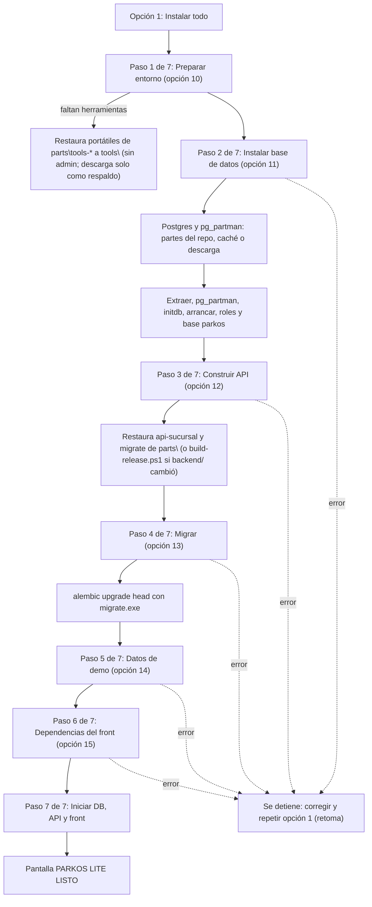
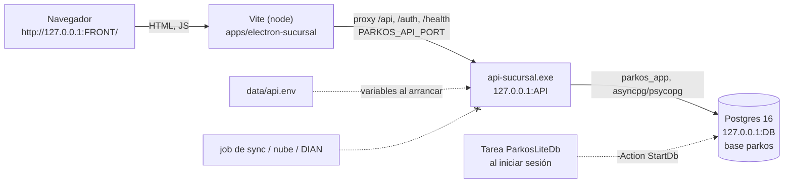

# Manual del instalador Parkos LITE (demo)

Este manual tiene dos partes separadas:

- **Parte I - Tester / usuario de pruebas**: qué presionar, qué verá y qué hacer si algo falla. No requiere conocimientos técnicos.
- **Parte II - Técnico / soporte**: cómo está construido, qué archivos y variables genera, cómo diagnosticar y cómo desinstalar.

Convenciones: `<REPO>` es la carpeta del repositorio donde está `installer\lite\parkos-lite.ps1`; `<LITE>` es la carpeta de trabajo del lite (por defecto `%LOCALAPPDATA%\ParkosLite`). Las claves y contraseñas reales generadas por el instalador se muestran como `<APP_PASSWORD>`, `<SUPERUSER_PASSWORD>`, etc.

## Índice

- [1. Resumen y para qué sirve](#1-resumen-y-para-qué-sirve)
- [2. Qué instala y qué NO instala](#2-qué-instala-y-qué-no-instala)
- [Parte I - Tester / usuario de pruebas](#parte-i---tester--usuario-de-pruebas)
  - [3. Requisitos previos](#3-requisitos-previos)
  - [4. Cómo ejecutarlo](#4-cómo-ejecutarlo)
  - [5. Primera vez, paso a paso](#5-primera-vez-paso-a-paso)
  - [6. El menú: qué hace cada opción](#6-el-menú-qué-hace-cada-opción)
  - [7. Flujo diario](#7-flujo-diario)
  - [8. Bajar cambios de dev (opción 7)](#8-bajar-cambios-de-dev-opción-7)
  - [9. Datos de demo sembrados](#9-datos-de-demo-sembrados)
  - [10. Si algo falla (versión para testers)](#10-si-algo-falla-versión-para-testers)
- [Parte II - Técnico / soporte](#parte-ii---técnico--soporte)
  - [11. Mapa de carpetas](#11-mapa-de-carpetas)
  - [12. Variables de entorno de la API](#12-variables-de-entorno-de-la-api)
  - [13. Puertos](#13-puertos)
  - [14. Arranque automático](#14-arranque-automático)
  - [15. Descarga de Postgres y pg_partman](#15-descarga-de-postgres-y-pg_partman)
  - [16. Arquitectura y flujo (diagramas)](#16-arquitectura-y-flujo-diagramas)
  - [17. Detener y desinstalar limpio](#17-detener-y-desinstalar-limpio)
  - [18. Solución de problemas (mensajes reales)](#18-solución-de-problemas-mensajes-reales)
  - [19. Seguridad](#19-seguridad)
  - [20. Diferencias con el instalador completo](#20-diferencias-con-el-instalador-completo)
  - [21. Limitaciones conocidas](#21-limitaciones-conocidas)
  - [22. Limitaciones / no verificado](#22-limitaciones--no-verificado)
  - [23. Glosario](#23-glosario)

---

## 1. Resumen y para qué sirve

Parkos LITE levanta **una sucursal completa en una sola máquina Windows** para hacer **demos y pruebas con un usuario**:

- una base de datos Postgres 16 local,
- la API de la sucursal (`api-sucursal.exe`),
- la pantalla de la sucursal (el front React) servida en el **navegador**,
- con **datos de demo** ya cargados (sucursal, usuarios, tarifas, resolución, caja).

Características de diseño (verificadas en `parkos-lite.ps1` y `README.md`):

- **Sin conectividad en ejecución**: ya instalado, todo corre sin red. Al instalar, casi todo sale del propio repositorio (`installer\payload\parts`: Postgres, pg_partman, la API y las herramientas portátiles); internet solo se necesita para `pnpm install` del front, `git pull` y recompilar la API si `backend/` cambió.
- **Sin job de sync**: no se envía nada a la nube ni a la DIAN; la cola de sincronización (`sync_queue`) simplemente crece.
- **Sin Electron**: se usa el navegador. La impresión es un no-op (ver [sección 21](#21-limitaciones-conocidas)).
- **Sin Docker, sin servicios de Windows obligatorios y sin permisos de administrador** (el servicio de Windows es opcional y solo si el TUI se abre como administrador).

La herramienta es un menú de texto (TUI) en PowerShell: `installer\lite\parkos-lite.ps1`.

## 2. Qué instala y qué NO instala

| Instala / hace | No instala / no hace |
|---|---|
| Postgres 16.15-1 (binarios ZIP de EnterpriseDB) como **proceso de usuario** en `<LITE>\pgsql` | Docker, contenedores |
| Extensión `pg_partman` 5.1.0 en modo SQL-only | Servicios de Windows (salvo el opcional de la base de datos, con administrador) |
| `api-sucursal.exe` y `migrate.exe` (se construyen con PyInstaller vía `installer\build-release.ps1 -ApiSucursal -Migrate`) | Electron ni su binario (`pnpm install --ignore-scripts`) |
| Dependencias del front (`pnpm install`) y servidor Vite en el navegador | Job de sync (`job-sync-sucursal`) ni conexión a la nube / DIAN |
| Base de datos `parkos`, roles, migraciones (Alembic) y datos de demo | Clave maestra ni cifrado de variables (el `.env` queda en texto plano) |
| Una tarea programada de usuario `ParkosLiteDb` para arrancar la base de datos al iniciar sesión (la activa el paso de base de datos, opciones 1 u 11; se puede quitar con la opción 9) | Certificados, TLS, impresoras |

Nota: los ejecutables y `node_modules` se generan **dentro del repositorio** (`installer\payload\services\...` y `apps\...`), no dentro de `<LITE>`; ambos están fuera del control de git (`installer\.gitignore` ignora `payload/*`).

---

# Parte I - Tester / usuario de pruebas

## 3. Requisitos previos

Necesita **Windows**. No necesita ser administrador ni instalar nada antes. **Internet solo para las dependencias del front** (`pnpm install`, registro npm; 1 a 5 minutos la primera vez): Postgres, pg_partman, la API y las herramientas vienen en el repositorio. Si el equipo no tiene `git`, `uv`, `node` o `pnpm` (o tiene versiones viejas), el paso "Preparar entorno" (opción 10, parte de la opción 1) las toma de las **partes versionadas en el repo** (`installer\payload\parts\tools-*`, verificadas contra el SHA-256 fijado en la tabla de versiones) y deja copias **portátiles** dentro de `<LITE>\tools`, que usa solo el instalador. Si ya hay una versión compatible en el PATH (node 20 o superior, pnpm 10 o superior, uv y git recientes), se usa esa y no se restaura ni se descarga nada. Orden: **PATH compatible → partes del repo → descarga**.

### Herramientas portátiles

| Herramienta | Versión fijada | Origen de respaldo (URL; solo si no están las partes del repo) | Dónde se instala | Verificación de integridad |
|---|---|---|---|---|
| Node.js | 22.23.3 (LTS; se acepta 20 o superior del sistema) | `https://nodejs.org/dist/v22.23.3/node-v22.23.3-win-x64.zip` (~30 MB) | `<LITE>\tools\node` | SHA-256 fijado y contrastado con `SHASUMS256.txt` del mismo `dist` |
| pnpm | 10.0.0 (el `packageManager` de `apps\package.json`; se acepta 10 o superior) | `npm install -g pnpm@10.0.0 --prefix <LITE>\tools\pnpm` con el npm del Node anterior (registro npm) | `<LITE>\tools\pnpm` | Lo verifica npm (integridad del registro) |
| uv | 0.12.23 (se acepta 0.5 o superior) | `https://github.com/astral-sh/uv/releases/download/0.12.23/uv-x86_64-pc-windows-msvc.zip` (~18 MB) | `<LITE>\tools\uv` | SHA-256 fijado y contrastado con el asset `.sha256` del release |
| Git (MinGit) | 2.56.0.2 (se acepta 2.20 o superior) | `https://github.com/git-for-windows/git/releases/download/v2.56.0.windows.2/MinGit-2.56.0.2-64-bit.zip` (~40 MB) | `<LITE>\tools\git` | SHA-256 fijado = digest que publica GitHub para ese asset (Git for Windows no publica un `.sha256` aparte) |

Id de cada una en las partes del repo: `tools-node` (35,6 MB), `tools-pnpm` (carpeta portátil, 5,1 MB), `tools-uv` (18,0 MB) y `tools-mingit` (39,8 MB). Si las partes faltan, son de otra versión, están dañadas o su hash no coincide con el fijado, el instalador lo avisa y descarga. Python 3.13 (que baja uv) **no** está versionado: solo se necesita para compilar los exe. Los zip se guardan en `<LITE>\downloads` (caché). Las cachés de uv (incluido el Python 3.13 que uv baja solo), de npm y el almacén de pnpm viven en `<LITE>\tools\cache`. Todo se define en un solo lugar: la tabla de versiones de `installer\lite\ParkosLite.Tools.ps1`.

- **Qué verá**: por cada herramienta `[YA ESTA]` (ya existía, del sistema o de `tools\`), `[INSTALADO]` (la restauró del repo o la descargó ahora; la línea `... restaurado desde el repositorio (partes), sin descargar.` lo confirma) y al final un resumen con versión y origen (`sistema` o `portatil`). La opción 5 (Estado) muestra lo mismo.
- **Alcance**: las carpetas de `tools\` se anteponen al PATH **solo del proceso del instalador y de sus hijos** (build, uv, pnpm, node/Vite, git). No se modifica el PATH de Máquina ni de Usuario, ni el registro. Por eso `node --version` en su consola puede seguir fallando: es normal, las herramientas no son visibles fuera del lite.
- **Sin internet / descarga fallida**: el mensaje indica la URL, la carpeta exacta (`<LITE>\downloads`) y el nombre del archivo donde dejarlo a mano; luego vuelva a correr la opción 10 (o la 1), que es re-ejecutable y reutiliza el zip si su hash coincide.
- **Verificar**: `& "<LITE>\tools\node\node.exe" --version`, `& "<LITE>\tools\uv\uv.exe" --version`, `& "<LITE>\tools\git\cmd\git.exe" --version`, `& "<LITE>\tools\pnpm\pnpm.cmd" --version`.
- **Quitar / reinstalar**: borre `<LITE>\tools` (y, si quiere forzar nueva descarga, los zip de `<LITE>\downloads`) y corra la opción 10. No afecta a Postgres ni a los datos.
- **Antivirus / proxy corporativo**: un antivirus puede escanear o bloquear las `.exe` recién extraídas (el instalador reintenta y, si falla, lo dice); si hay proxy con inspección TLS, la descarga puede fallar con un error de certificado: descargue los zip desde otra red y déjelos en `<LITE>\downloads`. Para pnpm vía npm use las variables estándar del proxy (`HTTPS_PROXY`).
- **Limitación de git portátil**: MinGit no trae Git Credential Manager; la opción 7 (`git pull`) contra un remoto privado puede pedir credenciales o fallar si el equipo no tiene su propio git configurado.

Otros requisitos:

- **PowerShell**: funciona con Windows PowerShell 5.1 o con `pwsh` 7.
- **Espacio en disco**: el código no declara un mínimo. Solo hay dos referencias: el ZIP de Postgres pesa unos 300 MB (texto del propio instalador) y luego se extrae; además se construyen dos ejecutables y se instalan dependencias de Node. Reserve varios GB libres (estimación, ver [sección 22](#22-limitaciones--no-verificado)).
- **Puertos**: por defecto Postgres 5433, API 8100 y front 5173. Si alguno está ocupado, el instalador toma el siguiente libre solo (ver [sección 13](#13-puertos)).

## 4. Cómo ejecutarlo

Abra una consola en la carpeta del repositorio (`<REPO>`) y ejecute:

```powershell
pwsh installer\lite\parkos-lite.ps1
```

Si no tiene `pwsh`, use Windows PowerShell:

```powershell
powershell -ExecutionPolicy Bypass -File installer\lite\parkos-lite.ps1
```

Parámetros opcionales (todos tienen valor por defecto; normalmente no se usan):

| Parámetro | Para qué | Valor por defecto |
|---|---|---|
| `-LitePath` | Carpeta de trabajo del lite (datos, binarios de Postgres, logs, estado) | `%LOCALAPPDATA%\ParkosLite` |
| `-SourceBranch` | Rama de la que la opción 7 baja cambios | `dev` |
| `-PgPort` | Puerto de Postgres (0 = automático, desde 5433) | `0` |
| `-ApiPort` | Puerto de la API (0 = automático, desde 8100) | `0` |
| `-FrontPort` | Puerto del front (0 = automático, desde 5173) | `0` |
| `-Action` | `Menu` (interactivo), `InstallAll`, `StartDb`, `StartAll`, `StopAll`, `Status` | `Menu` |

Ejemplos:

```powershell
# Menú normal
pwsh installer\lite\parkos-lite.ps1

# Instalación guiada sin menú (sale con código 1 si falla)
pwsh installer\lite\parkos-lite.ps1 -Action InstallAll

# Carpeta y puerto del front personalizados
pwsh installer\lite\parkos-lite.ps1 -LitePath D:\ParkosLite -FrontPort 5200
```

Los puertos pedidos con `-PgPort`, `-ApiPort` o `-FrontPort` se aplican cuando corre el paso "Preparar entorno" (opción 10, que forma parte de la opción 1). Si pide un puerto que está ocupado por otro programa, el paso falla con un mensaje.

`StartDb` y `StartAll` son las acciones que usa el arranque automático; un usuario de pruebas normalmente no las ejecuta a mano.

## 5. Primera vez, paso a paso

1. Ejecute el comando de la [sección 4](#4-cómo-ejecutarlo). Verá el menú:

   ```text
   =============== PARKOS LITE (demo) ===============
    PRIMERA VEZ
          1) Instalar todo (guiado)   <- recomendado: hace los pasos 10 a 15 solo y luego inicia todo
    USO DIARIO
    [....] 2) Iniciar todo (DB + API + front) ...
          3) Detener todo
          ...
    AVANZADO (paso a paso, en este orden)
    [....] 10) Preparar entorno
    ...
             0) Salir
   Opcion (numero):
   ```

2. Escriba `1` y Enter (Instalar todo, guiado). Aparece:

   ```text
   INSTALACION GUIADA: deja esta ventana abierta, no necesitas hacer nada mas.
   Internet solo hace falta para las dependencias del front (pnpm install). Total estimado: 3 a 10 minutos la primera vez (segundos si ya estaba instalado).
   ```

3. **No cierre la ventana.** Verá siete pasos, con este formato `Paso n de 7: <nombre>  (<tiempo>)`:

   | Paso | Qué hace | Tiempo que indica el instalador |
   |---|---|---|
   | Paso 1 de 7: Preparar entorno | Comprueba herramientas (las restaura de las partes del repo si faltan), crea la identidad de la sucursal demo, elige puertos y genera claves descartables | unos segundos a 1 minuto |
   | Paso 2 de 7: Instalar base de datos | Rearma Postgres y pg_partman desde las partes del repo (sin Internet), lo prepara y lo arranca; deja el arranque automático activado | 1 a 3 minutos la primera vez |
   | Paso 3 de 7: Construir API (.exe) | Restaura `api-sucursal.exe` y `migrate.exe` de las partes del repo (`API restaurada desde el repositorio (commit xxxxxxx)`); solo compila si `backend/` cambió desde ese commit | segundos (3 a 10 minutos y necesita Internet solo si hay que compilar) |
   | Paso 4 de 7: Migrar base de datos | Crea las tablas | menos de 1 minuto |
   | Paso 5 de 7: Cargar datos de demo | Carga sucursal, usuarios y tarifas | unos segundos |
   | Paso 6 de 7: Instalar dependencias del front | Descarga las librerías de la pantalla (**único paso que siempre necesita Internet**) | 1 a 5 minutos la primera vez |
   | Paso 7 de 7: Iniciar base de datos, API y front | Enciende todo | 1 a 2 minutos |

   Cada paso termina con una línea verde `[ OK ] <nombre>`. Los pasos de base de datos, API y front que ya estaban hechos se omiten con el texto `ya estaba hecho, se omite.`

   Importante: el nombre de cada paso se muestra con numeración "Paso n de 7"; en el menú esos mismos pasos aparecen como opciones 10 a 15.

   - El paso "Construir API" y el de dependencias del front pueden pasar un buen rato sin mostrar avance continuo: es normal.

4. Al terminar verá la pantalla final:

   ```text
   ==============================================================
     PARKOS LITE LISTO
   ==============================================================
     Abre en el navegador : http://127.0.0.1:5173/
     Usuario demo         : demo.operador@parkos.local
     Clave                : Demo1234
     Segundo usuario      : demo.operador2@parkos.local  (misma clave)
     API (para soporte)   : http://127.0.0.1:8100/health   docs: http://127.0.0.1:8100/docs
     Para detener         : opcion 3 de este menu (o -Action StopAll)
     Para ver el estado   : opcion 5.   Si algo falla: opcion 8 (Ver logs).
     Al reiniciar el PC   : la base de datos arranca sola; para el resto usa la opcion 2 (Iniciar todo).
   ==============================================================
   ```

   Los puertos pueden ser otros si los de por defecto estaban ocupados; use los que muestre su pantalla.

5. Abra esa URL en el navegador (o escriba `6` en el menú) e ingrese con el usuario y la clave de demo.

6. **Si se corta o falla**: lea el mensaje en rojo, corrija lo que dice (internet, herramienta faltante, espacio en disco) y elija otra vez la opción `1`: retoma donde quedó.

## 6. El menú: qué hace cada opción

El menú es una sola lista numerada: escriba el número y Enter. `0` o `Q`/`q` sale. Una entrada inválida muestra `Opcion no valida, elige un numero de la lista` y vuelve a mostrar el menú.

Las opciones 2 y 10 a 15 llevan una etiqueta de estado: `[ OK ]` (hecho), `[FAIL]` (falló, se puede re-ejecutar), `[BLOQ]` (falta un paso previo; el menú indica cuál) o `[....]` (pendiente).

| Opción | Grupo | Nombre | Qué hace | Cuándo usarla |
|---|---|---|---|---|
| 1 | PRIMERA VEZ | Instalar todo (guiado) | Ejecuta los pasos 10 a 15 y luego inicia todo | Primera vez, o para retomar una instalación cortada |
| 2 | USO DIARIO | Iniciar todo (DB + API + front) | Enciende Postgres, la API y el front y muestra la pantalla final | Cada día, o tras reiniciar el PC |
| 3 | USO DIARIO | Detener todo | Apaga front, API y base de datos | Al terminar de probar |
| 4 | USO DIARIO | Reiniciar | Detener todo + Iniciar todo | Si algo quedó colgado |
| 5 | USO DIARIO | Estado | Muestra si Postgres, API y front están arriba, puertos, rama, usuarios demo y estado del arranque automático | Para comprobar qué está corriendo |
| 6 | USO DIARIO | Abrir el navegador | Abre la URL del front en el navegador predeterminado | Después de iniciar |
| 7 | USO DIARIO | Bajar cambios de dev y reiniciar | Actualiza el código desde git y reinicia ([sección 8](#8-bajar-cambios-de-dev-opción-7)) | Cuando le avisen que hay una versión nueva |
| 8 | USO DIARIO | Ver logs | Lista los archivos de log y muestra las últimas 40 líneas del que elija | Cuando algo falla |
| 9 | USO DIARIO | Arranque automático de la base de datos | Submenú para activar o desactivar el arranque automático | Normalmente no hace falta tocarlo |
| 10 | AVANZADO | Preparar entorno | Verifica herramientas, crea UUID de sucursal, puertos, contraseñas y llave JWT descartables y escribe `api.env` | Solo para soporte, paso a paso |
| 11 | AVANZADO | Instalar base de datos | Descarga Postgres, `initdb`, roles, `pg_partman` y activa el arranque automático | Solo soporte |
| 12 | AVANZADO | Construir API (.exe) | Construye `api-sucursal.exe` y `migrate.exe` (varios minutos) | Solo soporte |
| 13 | AVANZADO | Migrar base de datos | Corre `alembic upgrade head` | Solo soporte |
| 14 | AVANZADO | Cargar datos de demo | Ejecuta `seed_demo.sql` (se puede repetir sin riesgo) | Solo soporte |
| 15 | AVANZADO | Instalar dependencias del front | `pnpm install --ignore-scripts` (no baja Electron) | Solo soporte |
| 0 | - | Salir | Cierra el menú (no detiene los servicios que estén corriendo) | - |

Detalles del submenú de la opción 9:

```text
  Arranque automatico: desactivado
  1) Activar: solo base de datos (tarea de usuario, sin admin)
  2) Activar: base de datos + API + front
  3) Desactivar
  4) Activar como servicio de Windows (requiere admin; estas elevado)   <- solo aparece si el TUI corre como administrador
Opcion (Enter = cancelar)
```

Un paso avanzado (10 a 15) no corre si un paso previo no está `[ OK ]`; verá `Bloqueado: corre primero: <n>) <nombre>`. Dependencias: 11 y 12 exigen 10; 13 exige 11 y 12; 14 exige 13; 15 exige 10; "Iniciar todo" exige 14, 12 y 15.

## 7. Flujo diario

1. Abra una consola en `<REPO>` y ejecute `pwsh installer\lite\parkos-lite.ps1`.
2. Opción `2` (Iniciar todo). Si la base de datos ya arrancó sola, solo enciende API y front.
3. Opción `6` para abrir el navegador. Inicie sesión con el usuario demo.
4. Pruebe lo que necesite.
5. Al terminar, opción `3` (Detener todo) y `0` para salir.
6. Cuando le avisen de una versión nueva: opción `7`.

Después de reiniciar el PC solo la base de datos arranca sola (si el arranque automático está activo); para API y front use la opción 2.

## 8. Bajar cambios de dev (opción 7)

Actualiza el código del repositorio donde está el instalador. Pasos (verificados en `Invoke-ParkosLiteRefresh`):

1. **Detiene todo** (front, API y base de datos).
2. **Valida el nombre de la rama** (`-SourceBranch`, por defecto `dev`).
3. **Comprueba el árbol de trabajo**: si hay cambios locales en archivos versionados (`git status --porcelain --untracked-files=no`), se niega. Los archivos nuevos sin versionar no cuentan.
4. `git fetch origin <rama>`; si la rama actual no es esa, `git checkout <rama>`; luego **`git pull --ff-only origin <rama>`**.
5. Calcula qué archivos cambiaron (`git diff --name-only`) y decide:
   - **Reconstruye el `.exe` solo si cambió algo bajo `backend/` o `installer/bootstrap/`** (o si el `.exe` no existe). El paso de la API recalcula antes la decisión de partes (`Get-ParkosPartsArtifactDecision`: `builtFromCommit` de `payload-parts.json` contra el árbol de trabajo): si nada cambió desde ese commit **restaura** las partes del repo (sin uv ni Python); si cambió, dice `No se restaura la API desde el repositorio: ...` y **compila** (necesita uv/Python e Internet; si el pull trajo además partes nuevas empaquetadas con ese código, las restaura). Una carpeta restaurada (marcador `.parts-sha256`) siempre se recompila si hay que construir; una compilada aquí se compara por fechas con los fuentes y se omite si está al día.
   - **Migra siempre** (`alembic upgrade head`).
   - **`pnpm install` solo si cambió** `apps/pnpm-lock.yaml`, `apps/pnpm-workspace.yaml` o algún `package.json` de `apps/`.
   - **Vuelve a sembrar siempre** (idempotente: solo agrega lo que falta).
6. **Inicia todo** de nuevo.
7. Si todo sale bien muestra `Cambios aplicados.`

Casos especiales:

- **Árbol sucio**: mensaje `Hay cambios locales en archivos versionados; el pull no se puede hacer limpio. Guardalos (git stash) o descartalos y reintenta:` seguido de la lista. Si el pull falla, el instalador vuelve a arrancar la versión anterior (`El pull fallo; se reinicia la version anterior.`).
- **Rama `dev` ocupada en otro worktree**: el instalador no detecta este caso de forma especial; el `git checkout dev` lo rechaza git y se muestra como `git checkout dev fallo (<mensaje de git>)`. Soluciones: ejecutar el lite desde un checkout donde `dev` no esté en uso, o usar `-SourceBranch <la rama en que está>` (debe existir en `origin`). Esta explicación del mensaje de git no se probó en este entorno (ver [sección 22](#22-limitaciones--no-verificado)).
- **Rama divergente**: `git pull --ff-only fallo: la rama local diverge de origin/<rama>; resuelvelo manualmente antes de reintentar.` Debe resolverlo con git.

### Aviso de build desactualizado

El estado (`state.json`) guarda `api_built_commit` (commit con el que se construyó o restauró el `.exe`) y `front_built_commit` (commit en el que se instalaron las dependencias del front). Al abrir el menú, en **5) Estado**, y al elegir **1) Instalar todo** o **2) Iniciar todo**, el lite compara esos commits con el `HEAD` del repo y avisa:

```text
AVISO: La API se construyo en <commit> y el repo esta N commits adelante (M tocan backend/): ... Reconstruyelo con la opcion 12 (Construir API (.exe)).
```

- Significa que el `.exe` que corre puede no tener correcciones que ya están en el repo (la opción 1 omite el paso 12 si el `.exe` existe, aunque el repo haya avanzado). Solo avisa si cambió `backend/` o `installer/bootstrap/`; un cambio solo de documentación o tests no avisa. Para el front (corre desde las fuentes con Vite) solo avisa si cambiaron `package.json`/`pnpm-lock` (opción 15).
- Cómo resolverlo: **7) Bajar cambios de dev y reiniciar** (hace pull y reconstruye lo que cambió) o directamente **12) Construir API (.exe)** y luego **13) Migrar base de datos**. En sesión interactiva, 1) y 2) preguntan `Reconstruir ahora? (s/N)` (por defecto No; reconstruye la API, migra y reinstala dependencias si hace falta). En ejecución desatendida (`-Action InstallAll/StartAll`, tarea de arranque) solo avisa: nunca reconstruye sola.
- Sin git, con clon superficial o con un commit que el clon no tiene, no se puede comparar y no se muestra nada. Un estado viejo sin `front_built_commit` se lee sin problema. Si el `.exe` se restauró del repo (opción 12 con partes vigentes) el commit es el de las partes y no avisa mientras `backend/` no cambie.

## 9. Datos de demo sembrados

El seed (`installer\lite\seed_demo.sql`) se ejecuta con el paso "Cargar datos de demo" (opción 14, y dentro de las opciones 1 y 7). **Nunca borra ni pisa**: solo inserta lo que falta (si una tarifa fue editada después, se respeta).

| Elemento | Qué se siembra |
|---|---|
| Sucursal | "Sucursal Demo"; dirección "Calle Demo 123"; teléfono 6010000000; prefijo `DEMO`; ciudad "Ciudad Demo"; horario "Lun-Dom 6:00-22:00"; tipo "Con operador" (el UUID es el generado por el instalador) |
| Usuarios | `demo.operador@parkos.local` (Operador Demo, cédula 1000000001) y `demo.operador2@parkos.local` (Operador Demo Dos, cédula 1000000002); clave **`Demo1234`**; rol `operador`; activos y sin obligación de cambiar la clave |
| Permisos | Todos los permisos vigentes del catálogo, para ambos usuarios (pueden recorrer ingreso, salida, caja y configuración) |
| Pertenencia | Ambos usuarios asignados a la sucursal demo |
| Tipos de vehículo | Se agregan `carro`, `bicicleta` y `patineta` (las migraciones solo crean `moto` y `otro`) |
| Tarifas (COP) | Ver tabla siguiente |
| Resolución de facturación | Número `18760000000001`, prefijo `DEMO`, rango 1 a 5000, vigente desde hoy durante 2 años |
| Configuración de caja | Base inicial sugerida 50 000; redondeo `ninguno`; denominaciones 1000, 2000, 5000, 10000, 20000, 50000, 100000 |
| Tolerancias de caja | Efectivo 0 y datáfono 0 |
| Cupos | carro 30, moto 20, bicicleta 10, patineta 10 |

Tarifas por tipo de vehículo y tipo de tarifa (COP):

| Vehículo | hora | fracción | plena | nocturna |
|---|---|---|---|---|
| carro | 4 000 | 1 000 | 25 000 | 12 000 |
| moto | 2 500 | 600 | 15 000 | 8 000 |
| bicicleta | 1 000 | 300 | 6 000 | 3 000 |
| patineta | 1 500 | 400 | 8 000 | 4 000 |

El tipo `otro` no tiene tarifa sembrada; la API solo cotiza los tipos con tarifa vigente.

**Cómo reiniciar los datos de demo.** No existe una opción del menú que borre datos (el proyecto prohíbe `DELETE`). Para volver a un estado limpio hay que borrar la base y recrearla:

1. Opción `3` (Detener todo).
2. Borre la carpeta `<LITE>\data` y el archivo `<LITE>\state.json`.
3. Ejecute la opción `1`: vuelve a crear la base, genera una sucursal nueva y vuelve a sembrar. Como `<LITE>\pgsql` y `<LITE>\downloads` se conservan, no se vuelve a descargar Postgres.

Este procedimiento se dedujo del código (el estado real se comprueba probando archivos); no se ejecutó de punta a punta (ver [sección 22](#22-limitaciones--no-verificado)). Si solo quiere recuperar los datos sembrados que faltan, repita la opción 14.

## 10. Si algo falla (versión para testers)

1. **No cierre la consola todavía.** Lea el mensaje en rojo: casi siempre dice qué hacer (por ejemplo, "Faltan herramientas" con el comando para instalarlas).
2. Si es un problema de internet o de una herramienta: corríjalo y elija otra vez la opción `1`; **retoma donde quedó**.
3. Si la pantalla no abre o la API no responde: opción `5` (Estado) para ver qué está "abajo" y opción `4` (Reiniciar).
4. Si sigue fallando: opción `8` (Ver logs) y elija `lite.log` (Enter). Envíe a soporte el texto del mensaje rojo y el contenido de la carpeta `<LITE>\logs`. **No envíe** `api.env` ni `secrets.json` (contienen contraseñas).
5. Recuerde que la opción 3 (Detener todo) apaga también la base de datos; use la opción 2 para volver a encender todo.

La tabla de mensajes con su causa y acción está en la [sección 18](#18-solución-de-problemas-mensajes-reales).

---

# Parte II - Técnico / soporte

## 11. Mapa de carpetas

Rutas definidas en `Get-ParkosLitePaths` (`ParkosLite.Core.ps1`). `<LITE>` es `-LitePath` (por defecto `%LOCALAPPDATA%\ParkosLite`, fuera del repositorio).

| Ruta | Contenido |
|---|---|
| `<LITE>\pgsql\` | Binarios de Postgres extraídos (`bin\`, `share\`, `lib\`) |
| `<LITE>\data\pg\` | Directorio de datos de Postgres (`PG_VERSION`, `postgresql.conf`, `postmaster.pid`) |
| `<LITE>\data\api.env` | Variables de entorno de la API, **sin cifrar** (ver [sección 12](#12-variables-de-entorno-de-la-api)) |
| `<LITE>\data\secrets.json` | Contraseñas descartables (`PostgresPassword`, `SuperuserPassword`, `AppPassword`), en texto plano |
| `<LITE>\data\jwt-signing.key` | Llave de firma JWT (64 bytes aleatorios) |
| `<LITE>\data\sync-agent.jwt` | Ruta referenciada por `PARKOS_SYNC_JWT_PATH`; el lite **no crea** este archivo (relleno) |
| `<LITE>\downloads\` | ZIP de Postgres y su `.sha256`; `pg_partman\extension\`; `tmp\` |
| `<LITE>\logs\` | `lite.log`, `api.out.log`, `api.err.log`, `front.out.log`, `front.err.log`, `postgres.log`, `build-api.log`, `pnpm-install.log` |
| `<LITE>\run\` | `api.pid` y `front.pid` (se valida que el PID siga siendo el proceso esperado) |
| `<LITE>\state.json` | Pista de estado: `sucursal_uuid`, `db_port`, `api_port`, `front_port`, `source_branch`, `api_built_commit`, `steps` |
| `<REPO>\installer\payload\services\api-sucursal\api-sucursal\api-sucursal.exe` | API construida (dentro del repo, ignorada por git) |
| `<REPO>\installer\payload\services\migrate\migrate\migrate.exe` | Ejecutable de migraciones (con `migrations\` y `alembic.ini` al lado) |
| `<REPO>\apps\electron-sucursal\node_modules\vite\bin\vite.js` | Vite instalado (comprueba que el front está instalado) |
| `<REPO>\installer\lite\seed_demo.sql` | Seed de demo |

`state.json` es solo una **pista**: el estado real se verifica probando archivos, puertos y consultas (`Get-ParkosLiteFacts`, `Get-ParkosLiteStepStatus`). Si falta un artefacto, el paso vuelve a `[....]` aunque el JSON diga `ok`. Un `state.json` corrupto se descarta y se parte de un estado vacío.

**Por qué `api.env` y `secrets.json` están sin cifrar**: el instalador completo cifra el `.env` con una clave maestra; el lite **no usa clave maestra** y el `.exe` corre como proceso de usuario. Las contraseñas son aleatorias, descartables y solo viven en la carpeta del lite: es un entorno de demo (ver [sección 19](#19-seguridad)).

## 12. Variables de entorno de la API

`Get-ParkosLiteEnvLines` genera `<LITE>\data\api.env` (ASCII). Al arrancar la API (`Start-ParkosLiteApi`) cada línea se carga **solo en el entorno del proceso hijo** y se restaura después.

| Variable | Valor / origen | Por qué |
|---|---|---|
| `PARKOS_DEPLOY` | `branch` | Modo sucursal |
| `PARKOS_SYNC_ENGINE` | `catalog_branch` | Selector del motor de sincronización de sucursal (misma bandera que usa el instalador completo) |
| `PARKOS_SUCURSAL_UUID` | UUID v4 generado la primera vez (guardado en `state.json`) | Identidad de la sucursal; el seed usa el mismo UUID |
| `PARKOS_DB_URL` | `postgresql+psycopg://parkos_app:<APP_PASSWORD>@127.0.0.1:<DbPort>/parkos` | Conexión síncrona de la app con el rol no superusuario `parkos_app` |
| `DATABASE_URL` | `postgresql+asyncpg://parkos_app:<APP_PASSWORD>@127.0.0.1:<DbPort>/parkos` | Conexión asíncrona (SQLAlchemy async) |
| `PARKOS_CLOUD_API_URL` | `http://127.0.0.1:1` | **Relleno**: la configuración exige la variable, pero sin job de sync nunca se contacta (el puerto 1 no atiende) |
| `PARKOS_JWT_KEY_PATH` | `<LITE>\data\jwt-signing.key` | Llave de firma de los tokens |
| `PARKOS_SYNC_JWT_PATH` | `<LITE>\data\sync-agent.jwt` | **Relleno**: ruta del JWT del agente de sync; el archivo no se crea porque no hay sync |
| `PORT` | Puerto de la API (`state.api_port`) | Puerto de escucha |

Para las migraciones y el seed se usa otro entorno (solo para ese proceso): `migrate.exe` recibe `DATABASE_URL=postgresql://parkos:<SUPERUSER_PASSWORD>@127.0.0.1:<DbPort>/parkos` y `PARKOS_APP_DB_PASSWORD=<APP_PASSWORD>`; el seed usa `psql` como superusuario `parkos` con `PGPASSWORD`. Que la migración cree el rol `parkos_app` con esa contraseña es una deducción por el nombre de la variable (no se leyeron las migraciones).

Roles de Postgres creados por el lite: `postgres` (bootstrap con `initdb`, contraseña `PostgresPassword`), `parkos` (superusuario, `SuperuserPassword`, dueño de la base `parkos`).

## 13. Puertos

| Servicio | Inicio de búsqueda | Observaciones |
|---|---|---|
| Postgres | 5433 | Escucha solo en `127.0.0.1` |
| API | 8100 | Excluye el puerto de Postgres |
| Front (Vite) | 5173 | Excluye los de Postgres y la API; Vite corre con `--strictPort` |

`Resolve-ParkosLitePort` decide así: **puerto pedido por parámetro > puerto guardado en `state.json` > primero libre desde el inicio** (hasta 50 intentos; si no hay ninguno: `No se encontro un puerto libre entre...`).

- Un puerto pedido que lo ocupa **otro proceso** es un error (`El puerto N pedido para <servicio> esta ocupado por otro proceso...`).
- Un puerto guardado que lo ocupa un tercero se reemplaza por el siguiente libre; si lo ocupa el propio servicio lite, se conserva.
- La detección usa los listeners TCP activos del sistema (`GetActiveTcpListeners`), no un bind de prueba.

**Por qué el proxy de Vite usa `PARKOS_API_PORT`**: el navegador habla con el front en su propio puerto y el front reenvía `/api`, `/health` y `/auth` a la API (`apps/electron-sucursal/vite.config.ts`). Como el puerto de la API puede no ser 8100, `Start-ParkosLiteFront` lanza Vite con la variable `PARKOS_API_PORT=<api_port>` (solo para ese proceso) y `vite.config.ts` construye `http://localhost:<puerto>` a partir de ella (por defecto 8100). El shim `browserBridge.ts` solo se instala cuando no existe el `window.bridge` de Electron; devuelve origen vacío (mismo origen), la impresión es un no-op y el estado de la API se comprueba con `/health`.

Los puertos solo cambian cuando corre el paso 10 (Preparar entorno). Si cambia el puerto de Postgres después de instalar la base de datos, hay que volver a correr la opción 11 para que `postgresql.conf` lo refleje (deducción del código: la opción 1 omite el paso 11 si ya está hecho).

## 14. Arranque automático

Implementado en `ParkosLite.Autostart.ps1`. Nombre global del mecanismo: **`ParkosLiteDb`**.

| Método | Cómo se crea | Requisitos | Notas |
|---|---|---|---|
| Tarea programada de usuario (por defecto) | `Register-ScheduledTask` con disparador *al iniciar sesión*, oculta, nivel Limited, límite de ejecución 1 h, permite batería | Sin administrador | Ejecuta `-NoProfile -NonInteractive -WindowStyle Hidden -ExecutionPolicy Bypass -File <parkos-lite.ps1> -LitePath <LITE> -Action StartDb` |
| Clave `HKCU\Software\Microsoft\Windows\CurrentVersion\Run` | Fallback si no se puede crear la tarea | Sin administrador | Mismo comando, valor `ParkosLiteDb` |
| Servicio de Windows | `pg_ctl register -N ParkosLiteDb -D <pgdata> -S auto -w` | **Solo si el TUI corre como administrador** (opción 4 del submenú 9) | Solo base de datos |

- Modo "solo base de datos" usa `-Action StartDb`; el modo con API y front usa `-Action StartAll`.
- `StartDb` limpia un `postmaster.pid` huérfano (solo si ningún postgres lo posee), hace `pg_ctl start -w` y espera hasta que acepte conexiones.
- **Es global y no por `LitePath`**: hay un único `ParkosLiteDb` por usuario de Windows. Activarlo de nuevo **reemplaza** el anterior (nunca duplica) y deja apuntando a la `LitePath` desde la que se activó.
- Desactivar (submenú 9, opción 3) quita tarea, clave Run y servicio. El servicio solo se puede quitar con administrador; sin él se muestra: `El servicio de Windows 'ParkosLiteDb' existe pero quitarlo requiere administrador: ejecuta 'pg_ctl unregister -N ParkosLiteDb' desde una consola elevada.`
- La opción 11 (Instalar base de datos) activa automáticamente el arranque por tarea; si falla solo registra `No se pudo activar el arranque automatico (no es critico)`.

Comprobación manual de la tarea (PowerShell): `Get-ScheduledTask -TaskName ParkosLiteDb`.

## 15. Postgres y pg_partman: de dónde salen

Lógica en `installer\shared\ParkosPostgresDownload.ps1` y `installer\shared\ParkosPayloadParts.ps1` (compartidas con el instalador completo). Regla: **primero el repo (`installer\payload\parts`), después la caché, al final la red.**

- **Versión fijada**: Postgres `16.15-1`. Archivo: `postgresql-16.15-1-windows-x64-binaries.zip`.
- **Orden de búsqueda del ZIP**: (1) ZIP completo válido en `<REPO>\installer\payload\parts\postgres\` (acepta el nombre fijado o `postgresql-16-windows-x64-binaries.zip`); (2) **partes versionadas** `postgresql-16.15-1-windows-x64-binaries.zip.part01..04` en esa misma carpeta: se unen por streaming en `<LITE>\downloads`, se verifican contra el `.sha256` versionado y se valida que traiga `pg_ctl/initdb/psql` (un ZIP ya rearmado en la caché se reutiliza); (3) caché de descargas; (4) descarga de `https://get.enterprisedb.com/...` (último recurso). Unas partes defectuosas dan un error claro (`git checkout -- installer/payload/parts/postgres`), no una descarga silenciosa. (Antes de este cambio el lite buscaba en `installer\payload\postgres\`, ruta que ya no existe tras mover las partes a `payload\parts\postgres`: se corrigió `PgPayload` en `Get-ParkosLitePaths`.)
- **Descarga (respaldo)**: a un archivo `.part`, con reanudación por `Range` si existe, TLS 1.2 y barra de progreso; **3 intentos** con espera creciente (5 s y 10 s; máximo 60 s). Valida que el ZIP traiga `pg_ctl`, `initdb` y `psql`; luego renombra al nombre final.
- **Hash**: EnterpriseDB no publica un SHA-256 oficial, así que el del ZIP completo está **fijado en el código** (`ParkosPgPinnedSha256` en `ParkosPostgresDownload.ps1`, igual al `.sha256` y al `payload-parts.json` versionados; un test los cruza). Se exige en las cuatro rutas: ZIP completo del repo y ZIP en caché (si no coincide se ignora o se aparta como `.bad`), partes (contra el `.sha256` versionado) y descarga (si no coincide se borra y cuenta como intento fallido: `... no coincide con el SHA-256 fijado ...`). Ya no se confía en el hash de la primera descarga; el `<zip>.sha256` de la caché solo detecta cambios posteriores. Al subir de versión de Postgres hay que cambiar `Version` y ese hash a la vez.
- **Runtime de Visual C++**: tras extraer, el paso 11 ejecuta `pgsqlin\initdb.exe --version` (tope 20 s, lo mata si se cuelga). Si falla con `0xC0E90002` ("LIBPQ.dll no está diseñado para ejecutarse en Windows", visto en Windows 11 24H2) o no responde, copia desde `System32` a `pgsqlin` solo los DLL que falten (`vcruntime140`, `vcruntime140_1`, `msvcp140`, `msvcp140_1`, `msvcp140_2`; nunca sobrescribe) y reintenta una vez. Si no están en `System32` o sigue fallando, el paso termina con un mensaje que pide instalar *Microsoft Visual C++ Redistributable 2015-2022 x64* (`https://aka.ms/vs/17/release/vc_redist.x64.exe`) y repetir la opción 11. No se empaqueta ningún binario de Microsoft.
- **Extracción**: a `<LITE>\pgsql.extracting` y luego se mueve a `<LITE>\pgsql` (una extracción interrumpida no deja un `pgsql` a medias). Si `bin\pg_ctl.exe` ya existe, se omite.
- **pg_partman `5.1.0`** (SQL-only): (1) se **restaura** del artefacto `pg_partman-extension` de las partes (`parts\pg_partman-extension\pg_partman-extension.zip`, 46 KB) a `<LITE>\downloads\pg_partman\extension`; (2) si ya existe esa carpeta o `<REPO>\installer\payload\pg_partman\extension` con `pg_partman--*.sql` y `pg_partman.control`, se usa; (3) respaldo: se baja de GitHub (`https://github.com/pgpartman/pg_partman/archive/refs/tags/v5.1.0.zip`) y se ensambla SQL-only. Luego se copia a `<LITE>\pgsql\share\extension`.
- **Sin partes y sin red** (clon sin `installer\payload\parts`): el paso falla con este mensaje (con la URL y la carpeta destino):

  ```text
  No se pudo obtener los binarios de Postgres 16.15-1 (se necesita Internet SOLO en este paso).
    Detalle : <error>
    URL     : https://get.enterprisedb.com/postgresql/postgresql-16.15-1-windows-x64-binaries.zip
    Manual  : descarga el archivo desde esa URL y guardalo como
              <LITE>\downloads\postgresql-16.15-1-windows-x64-binaries.zip
              luego vuelve a ejecutar este paso (es re-ejecutable).
  ```

  Restaure las partes con `git checkout -- installer/payload/parts` (o deje el ZIP en `<LITE>\downloads\postgresql-16.15-1-windows-x64-binaries.zip`) y vuelva a ejecutar la opción 1 u 11.

### API y herramientas desde el repo

- **API** (`api-sucursal.exe` + `migrate.exe`): artefactos `api-sucursal` y `migrate` de `payload-parts.json` (zips de PyInstaller onedir, ~42 MB cada uno). Se restauran a `<REPO>\installer\payload\services\` solo si `backend/` e `installer/bootstrap/` no cambiaron desde `builtFromCommit` (`git diff` contra el árbol de trabajo + archivos no versionados). Sin git, sin el commit en el clon o sin partes: se compila como antes. El lite **nunca** restaura `doctor`, `seed`, `job-sync-sucursal`, `powershell7-msi`, `nssm` ni `web-sucursal-msi`.
- **Herramientas**: ver sección 3 (ids `tools-*`).
- **Qué sigue necesitando Internet**: `pnpm install` del front (`node_modules` no se versiona), recompilar la API tras un cambio de `backend/` (uv baja Python 3.13 y las dependencias) y `git pull`.
- **Refrescar las partes del repo** (mantenedor): `pwsh -File installer\build-release.ps1 -ApiSucursal -Migrate` y `pwsh -File installer\tools\Pack-ParkosPayload.ps1 -Ids api-sucursal,migrate`; para herramientas, empaquetar con `Pack-ParkosPayloadArtifact` (ver `installer\MANUAL.md` sección 5.4). Versionar `installer\payload\parts`.

## 16. Arquitectura y flujo (diagramas)

### Flujo de instalación (opción 1)



En el guiado, los pasos 2, 3 y 6 (base de datos, API y front) se omiten si ya están `ok`; los pasos 1, 4 y 5 corren siempre porque son baratos e idempotentes.

### Arquitectura en ejecución



La línea punteada con X indica que no existe sync: `PARKOS_CLOUD_API_URL` apunta a un puerto sin servicio y la cola de sincronización solo crece.

Orden de arranque (`Start-ParkosLiteAll`): Postgres (limpia pid huérfano, `pg_ctl start -w`, espera `pg_isready`), API (espera `GET /health` = 200, hasta 90 s), front (espera 200 en la URL del front, hasta 90 s). Detener es el orden inverso: front, API, Postgres (`pg_ctl stop -m fast -w`). Los procesos se lanzan ocultos con salida a `logs\` y se terminan con `taskkill /T /F`.

## 17. Detener y desinstalar limpio

**Detener**: opción 3 (o `-Action StopAll`).

**Desinstalar** (en este orden):

1. Opción 3 (Detener todo).
2. Opción 9, submenú 3 (Desactivar): quita la tarea `ParkosLiteDb`, la clave Run y, con administrador, el servicio. Sin administrador y con servicio registrado: en una consola elevada, `& "<LITE>\pgsql\bin\pg_ctl.exe" unregister -N ParkosLiteDb`.
3. Verifique que no quedó nada: `Get-ScheduledTask -TaskName ParkosLiteDb` y `Get-Service ParkosLiteDb` deben dar error de no encontrado.
4. Borre la carpeta `<LITE>` (incluye Postgres, datos, logs, la caché de descargas y las herramientas portátiles de `tools\`).
5. Opcional, dentro del repositorio: borre `installer\payload\services\api-sucursal`, `installer\payload\services\migrate`, `installer\.pyinstaller-work` y `apps\**\node_modules` (todo regenerable).

Si borra `<LITE>` sin desactivar el arranque automático, la tarea intentará arrancar al iniciar sesión un script cuyos datos ya no existen.

## 18. Solución de problemas (mensajes reales)

Mensajes extraídos del código. Entre `<...>` van valores variables.

| Mensaje | Causa | Acción |
|---|---|---|
| `Faltan herramientas:` + `- git/uv/node/pnpm: <comando>` + `Instalalas, abre una consola nueva y reintenta.` | Falta una herramienta en el PATH | Instalar con el comando mostrado, abrir consola nueva, repetir opción 1 o 10 |
| `Bloqueado: corre primero: <n>) <paso>` | Un paso previo no está `ok` | Correr el paso indicado (o la opción 1) |
| `AVISO: La API se construyo en <commit> y el repo esta N commits adelante ...` | El `.exe` (o las dependencias del front) son anteriores al código del repo | Ver "Aviso de build desactualizado" (opción 7 o 12) |
| `Los binarios de Postgres no arrancan (...) ... Microsoft Visual C++ Redistributable 2015-2022 x64` | `initdb` falla con `0xC0E90002` y los DLL del runtime no están en `System32` | Instalar el redistribuible de Microsoft y repetir la opción 11 |
| `Opcion no valida, elige un numero de la lista` | Entrada fuera de 0-15/Q | Escribir un número del menú |
| `El puerto N pedido para <servicio> esta ocupado por otro proceso. Elige otro con el parametro correspondiente.` | Puerto explícito ocupado | Usar otro `-PgPort/-ApiPort/-FrontPort` o liberar el puerto |
| `No se encontro un puerto libre entre A y B.` | 50 puertos consecutivos ocupados | Liberar puertos o pasar un puerto explícito |
| `No se pudo obtener los binarios de Postgres 16.15-1 (se necesita Internet SOLO en este paso).` | Sin red, firewall o URL caída | Ver [sección 15](#15-descarga-de-postgres-y-pg_partman): dejar el ZIP a mano y repetir |
| `No se pudo obtener la extension pg_partman 5.1.0 ...` | Falló la descarga desde GitHub | Reintentar con red o dejar la extensión ensamblada (sección 15) |
| `El hash SHA-256 de <zip> (...) no coincide con el registrado (...)` | El ZIP en caché cambió desde que se descargó | Mover o borrar el ZIP y su `.sha256` y repetir |
| `el archivo descargado no es un ZIP de Postgres valido (faltan pg_ctl/initdb/psql).` | Descarga corrupta o página de error | Repetir; si persiste, descargar a mano |
| `El ZIP extraido no contiene bin\pg_ctl.exe (ni pgsql\bin\pg_ctl.exe)...` | ZIP que no es de binarios de Postgres | Reemplazar el ZIP |
| `initdb fallo (exit N): ...` | Permisos, ruta en uso o disco lleno | Revisar la salida, liberar espacio, repetir opción 11 |
| `pg_ctl start fallo (exit N). Revisa <...>\postgres.log` | Postgres no arrancó (puerto, `data` dañado) | Opción 8 -> `postgres.log` |
| `Postgres no acepto conexiones en el puerto N tras 60 s. Revisa ...postgres.log` | Arranque lento o fallido | Opción 8 -> `postgres.log`; reintentar opción 4 |
| `No se pudo configurar el superusuario parkos: ...` / `No se pudo crear la base parkos: ...` | Falló `psql` con el rol `postgres` | Ver el detalle; verificar que `secrets.json` corresponde a la carpeta `data` |
| `pg_partman: '<sql>' fallo: ...` | Extensión no copiada o incompatible | Repetir opción 11; verificar `pgsql\share\extension\pg_partman*` |
| `build-release.ps1 fallo (exit N). Revisa ...\build-api.log` | Falló PyInstaller / `uv` | Opción 8 -> `build-api.log` |
| `El build termino pero faltan api-sucursal.exe o migrate.exe.` | Build incompleto | Repetir opción 12 |
| `alembic upgrade head fallo (exit N): ...` | Migración fallida | Leer las últimas líneas mostradas; verificar base arriba (opción 5) |
| `Aviso: prod.fn_ensure_partitions() no se pudo ejecutar (no bloquea).` | Verificación de particiones falló | Informativo; revisar `lite.log` |
| `seed de demo fallo (exit N): ...` | Error en `seed_demo.sql` o migraciones no aplicadas | Correr opción 13 y luego 14 |
| `uuid de sucursal invalido: '...'` | `state.json` con UUID inválido | Repetir opción 10 |
| `pnpm install fallo (exit N). Revisa ...\pnpm-install.log` | Red, `pnpm` o lockfile | Opción 8 -> `pnpm-install.log` |
| `La API no respondio en http://127.0.0.1:<puerto>/health. Revisa ...api.err.log y api.out.log` | La API no arrancó o no está sana | Opción 8 -> `api.err.log` |
| `El front no respondio en http://127.0.0.1:<puerto>/. Revisa ...front.err.log y front.out.log` | Vite no arrancó (puerto ocupado: usa `--strictPort`) | Opción 8 -> `front.err.log`; liberar el puerto o cambiarlo |
| `Vite no esta instalado: corre el paso 6) Instalar dependencias del front.` | Falta `node_modules` | Correr la **opción 15** (el mensaje cita una numeración antigua) |
| `Falta el archivo de configuracion de la API: corre el paso 1) Preparar entorno.` | No existe `api.env` | Correr la **opción 10** (numeración antigua en el mensaje) |
| `No se encontro node en el PATH (paso 1: Preparar entorno).` | `node` no está en el PATH | Instalar Node y abrir consola nueva; opción 10 |
| `Hay cambios locales en archivos versionados; el pull no se puede hacer limpio. ...` | Árbol sucio | `git stash` o descartar y repetir opción 7 |
| `git pull --ff-only fallo: la rama local diverge de origin/<rama>; ...` | Historia divergente | Resolver con git |
| `git fetch origin <rama> fallo (...)` / `git checkout <rama> fallo (...)` | Sin red, rama inexistente o en uso en otro worktree | Ver el detalle de git; ver [sección 8](#8-bajar-cambios-de-dev-opción-7) |
| `nombre de rama invalido: '...'` | `-SourceBranch` con caracteres no permitidos | Usar letras, números, `.`, `_`, `-` y `/` |
| `El pull fallo; se reinicia la version anterior.` | Falló la actualización | Informativo: se reanuda lo anterior; ver el error que sigue |
| `El servicio de Windows requiere administrador: abre el TUI como administrador o usa el arranque por tarea de usuario (sin admin).` | Opción de servicio sin elevación | Usar tarea de usuario (submenú 9, opciones 1 o 2) |
| `No se pudo activar el arranque automatico (no es critico): ...` | No se pudo crear la tarea ni la clave Run | Activarlo luego con la opción 9 |
| `La instalacion se detuvo en el paso <n>) <nombre>.` | Un paso falló durante la opción 1 | Leer el mensaje rojo previo; corregir; repetir opción 1 |
| `(sin <archivo> todavia)` | El log elegido aún no existe | Elegir otro log |

## 19. Seguridad

- **Credenciales de demo públicas**: `demo.operador@parkos.local` y `demo.operador2@parkos.local` con clave `Demo1234` están escritas en `seed_demo.sql` (hash bcrypt), en `parkos-lite.ps1` y en el README. No son secretas: **no use este entorno con datos reales**.
- **`api.env` y `secrets.json` sin cifrar**: contienen la contraseña de `parkos_app`, la del superusuario `parkos` y la del bootstrap `postgres`, en texto plano en `<LITE>\data`. El instalador completo cifra el `.env`; el lite no.
- **Sin clave maestra** en el lite: no se genera, no se necesita y no debe copiarse aquí la clave maestra del instalador completo.
- **Solo loopback**: Postgres escucha en `127.0.0.1` (`listen_addresses`), Vite se lanza con `--host 127.0.0.1` y las URLs de la API usan `127.0.0.1`; el entorno no está pensado para exposición a la red. El enlace de escucha de la API no se verificó en código (ver [sección 22](#22-limitaciones--no-verificado)).
- **Superusuario**: el rol `parkos` es superusuario y es el que usan migraciones y seed; la API usa `parkos_app`.
- **No usar en producción**: sin cifrado de secretos, sin sync, sin respaldo, con contraseñas descartables.
- No comparta `api.env`, `secrets.json` ni `jwt-signing.key` al reportar un problema.

## 20. Diferencias con el instalador completo

El instalador completo (`installer\parkos-installer.ps1`, ver `installer\MANUAL.md`) es el de producción en sucursal.

| Aspecto | LITE (este manual) | Instalador completo |
|---|---|---|
| Objetivo | Demo y pruebas de usuario | Sucursal en producción |
| Permisos | Sin administrador (servicio de la DB solo opcional con administrador) | Se relanza elevado (`Request-Elevation`) |
| API | `api-sucursal.exe` como proceso de usuario oculto | Servicio de Windows |
| Job de sync | No existe | `job-sync-sucursal` como servicio |
| Pantalla | Front en navegador (Vite) | Aplicación Electron (`web_sucursal`) |
| Postgres | ZIP en `<LITE>\pgsql`, proceso de usuario | Instalado por el instalador completo (binarios en payload, registro con NSSM) |
| Secretos (`.env`) | Sin cifrar, contraseñas descartables | Cifrado con clave maestra |
| Datos | Seed de demo (`seed_demo.sql`) | Siembra de catálogo contra la API real |
| Internet | Solo para `pnpm install` del front, `git pull` y recompilar la API si `backend/` cambió (el resto sale de `installer\payload\parts`) | Se instala desde un payload ya preparado |
| Código fuente | Se ejecuta desde el repositorio (`git pull` con la opción 7) | Se distribuye empaquetado |
| Reutilizado | `installer\shared\ParkosPostgresDownload.ps1`, `installer\shared\ParkosPayloadParts.ps1` (partes) y `build-release.ps1` | Mismos componentes |

Las celdas de la columna "Instalador completo" se basan en el encabezado de `parkos-installer.ps1` y en `Request-Elevation`; no se revisó el instalador completo de punta a punta.

## 21. Limitaciones conocidas

- Sin sync ni conectividad: `sync_queue` crece, nada se envía a la nube ni a la DIAN.
- La impresión es un no-op en el navegador (shim `window.bridge` solo cuando no existe el de Electron; ver `apps/electron-sucursal/src/renderer/lib/browserBridge.ts`).
- Las contraseñas y la llave JWT son descartables y están en texto plano.
- Los UUID de `carro`, `bicicleta` y `patineta` se siembran aquí porque las migraciones solo crean `moto` y `otro`.
- El lockfile de `pnpm` del repositorio puede ir desfasado; el lite instala con `--lockfile=false` para no ensuciar el árbol de git.
- El instalador ejecuta código del **mismo repositorio** donde está el script: la opción 7 modifica ese árbol de trabajo (`git checkout` y `git pull`).
- Tres mensajes de error citan una numeración antigua de pasos (`paso 1`, `paso 6`); la numeración vigente es 10 (Preparar entorno) y 15 (Instalar dependencias del front).
- Si falla la reconstrucción, la migración o `pnpm` **después** de un pull correcto en la opción 7, el error se muestra pero los servicios quedan detenidos (solo el fallo del pull reinicia lo anterior); use la opción 2 tras corregir (deducción del código).
- Las herramientas portátiles (`<LITE>	ools`) solo las ven el instalador y sus procesos hijos, no la consola del usuario.
- El arranque automático es único por usuario de Windows (`ParkosLiteDb`), no por `LitePath`.

## 22. Limitaciones / no verificado

Este manual se escribió leyendo el código y los tests; las secciones de partes (3, 8 y 15) se contrastaron además con una instalación limpia real (PATH sin git/node/pnpm/uv, caché de descargas vacía). Queda sin verificar:

- Que los tiempos indicados correspondan a todas las máquinas: se midieron en una instalación limpia real (ver el informe de verificación del cambio de partes), pero dependen del disco, el antivirus y la red del `pnpm install`.
- Espacio en disco mínimo: el código no lo declara ni lo comprueba; solo aparece "~300 MB" para el ZIP. La recomendación de "varios GB" es una estimación.
- Versión mínima de Node: ningún archivo la fija; "20 o superior" se infiere de que el bundler del proceso principal de Electron apunta a `node20` (comentario de `vite.config.ts`). `pnpm` 10 se infiere de `packageManager: pnpm@10.0.0` en `apps\package.json`.
- Que `api-sucursal.exe` escuche solo en `127.0.0.1`: el lite solo le pasa `PORT`; el enlace lo decide el código del backend (no revisado).
- Que la migración cree el rol `parkos_app` con la contraseña de `PARKOS_APP_DB_PASSWORD` (deducido por el nombre de la variable).
- El comportamiento exacto del mensaje de git cuando `dev` está en uso en otro worktree.
- El procedimiento de reinicio de datos de la [sección 9](#9-datos-de-demo-sembrados) y el cambio de puerto de Postgres tras instalar (sección 13): deducidos del código, no ejecutados.
- Trabajo offline con `pg_partman` (sección 15): deducido del código.
- La comparación con el instalador completo (sección 20) se basa en su encabezado y no en una lectura completa.
- El contenido de los logs (por ejemplo si `postgres.log` registra datos sensibles): no se revisó.
- La ejecución de la suite Pester no formó parte de esta tarea; el comportamiento descrito coincide con lo que fijan `installer\tests\ParkosLite.*.Tests.ps1` (menú secuencial 1..15, `Q`/`q` como salida, plan de refresh, decisión de build, puertos, secretos y arranque automático).

## 23. Glosario

| Término | Significado |
|---|---|
| TUI | Interfaz de texto (el menú de `parkos-lite.ps1`) |
| LITE | Versión ligera para demos: sin Docker, sin Electron, sin sync, sin administrador |
| `<LITE>` / `LitePath` | Carpeta de trabajo del lite (datos, Postgres, logs, estado) |
| Sucursal | Punto de operación del parqueadero; el lite crea una "Sucursal Demo" |
| API de sucursal | `api-sucursal.exe`, servicio HTTP que usa el front |
| Front | Pantalla web React servida por Vite en el navegador |
| Vite | Servidor de desarrollo del front |
| Migración / Alembic | Mecanismo que crea y actualiza las tablas (`alembic upgrade head`) |
| Seed | Carga de datos iniciales de demo (`seed_demo.sql`) |
| `pg_partman` | Extensión de Postgres para particionar tablas |
| `sync_queue` | Cola de sincronización hacia la nube; en el lite solo crece |
| DIAN | Autoridad tributaria de Colombia (facturación electrónica); no interviene en el lite |
| Idempotente | Que puede repetirse sin efectos adicionales ni duplicados |
| Tarea programada | Mecanismo de Windows que ejecuta algo al iniciar sesión (`ParkosLiteDb`) |
| `postmaster.pid` | Archivo que Postgres deja mientras corre; si queda tras un apagado sucio se considera huérfano |
| Árbol sucio | Repositorio con cambios locales en archivos versionados |
| Worktree | Copia de trabajo adicional del mismo repositorio de git |
