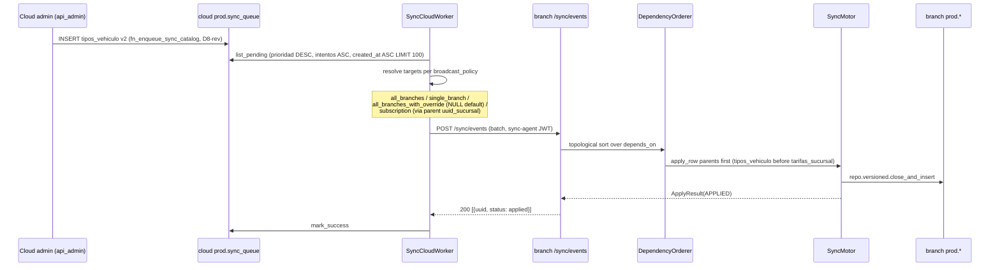
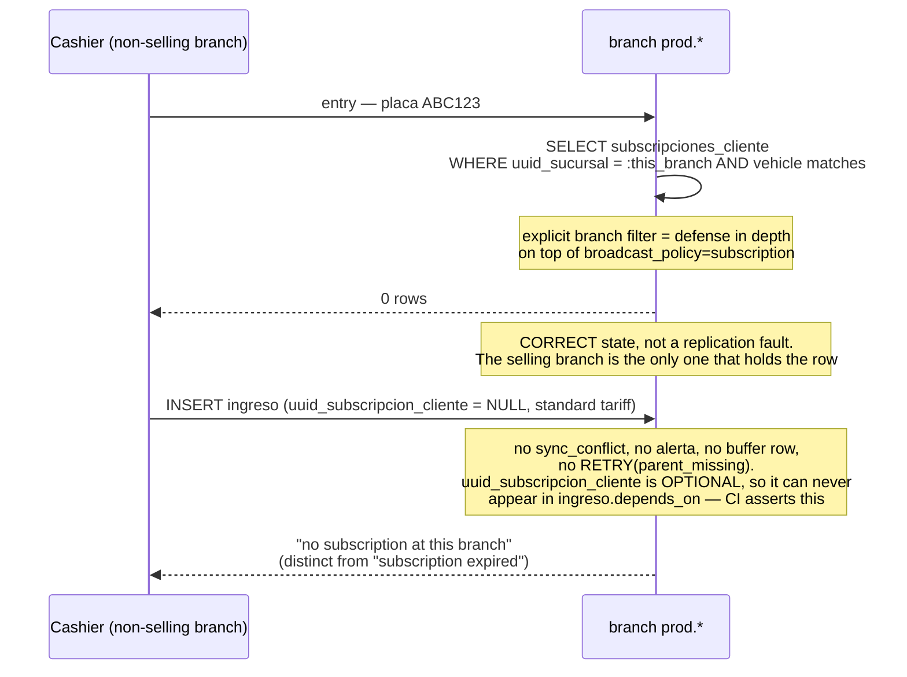

# Design: `sync-overhaul`

> **Phase**: design (sdd-design) — **amended 2026-09-08 (ER-alignment correction pass)**
> **Source of truth**: `proposal.md` as amended. Every direction, scope, count, enum value, and
> dependency declaration in this document is derived from that file; where the two ever disagree,
> the proposal wins and this document is the defect.
> **Amendment rule**: amended **in place**. Reversed decisions keep their original text inside a
> `Superseded` block with the reversal rationale. Nothing is deleted silently.
> **Section numbering shifted**: sequence diagrams were inserted as §7, so the former §7-§16 are now
> §8-§17. The stable cross-reference anchors are the `Issue #N` labels inside §2, which did not move.

## 0. Amendment log — what this correction pass changed

| # | Prior design decision | Amended to | Driver |
|---|---|---|---|
| 1 | `prod.sync_back_events` sibling table + `SyncBackEventEmitter` hook + `_emit_sync_back_events_loop` + migration `0008` | **Dropped in full.** Branch-local numbering; `envio_dian` flowing `cloud_to_branch` is the DIAN return channel | D1-rev |
| 2 | `envio_dian` `branch_to_cloud` | `cloud_to_branch`, `single_branch` | D5-rev, ER `envio_dian` block "CLOUD-ONLY" |
| 3 | `validacion_evento` `branch_to_cloud` | `never_propagated` (structurally present at the branch, never populated) | D5-rev, ER "CLOUD-ONLY: bandeja del admin" |
| 4 | 18 `[V]` tables `never_propagated` via an invented "boot snapshot" | Real `cloud_to_branch` / `bidirectional` directions through the same catalog pipeline | D8-rev |
| 5 | `SyncCatalog` 47 + `LocalOnlyCatalog` 5; ER canon 49 → 50 | **46 + 3 + 5 = 54**; ER canon 49 → **51**; **54** physical prod tables | §6.5 |
| 6 | `PARKOS_SYNC_ENGINE` = `legacy / catalog_read / catalog_dual / catalog_only / catalog_lite` | `legacy / catalog_admin / catalog_dian / catalog / catalog_branch` | D22 |
| 7 | Parent wait covered only the 6 `[L-W]` `uuid_padre` self-chains | Generalized `depends_on` + `RETRY(parent_missing)` for any mandatory-FK parent | D18 |
| 8 | Two uncoordinated escalation paths (`sync_queue` re-enqueue at `intentos>=6`, buffer TTL sweep) | One path: the buffer owns the wait, the sweep owns the timeout | D18 |
| 9 | One uniform backoff curve for every entry | Per-entry `backoff_schedule` override; DIAN curve for `factura_electronica` + `revocacion_factura` | Addendum §3 |
| 10 | `clientes` / `vehiculos` / `subscripcion_vehiculos` not replicated; `PIIRedactor` and `PlateChangeCascade` unreachable | `bidirectional` with natural-key reconciliation; `PIIRedactor` re-scoped to observability; `PlateChangeCascade` re-targeted to `subscripcion_vehiculos` | D17, §8 of the proposal |
| 11 | `reimpresion_ticket.origen` column + migration `0013_add_reimpresion_ticket_origen.py` | **Dropped.** It existed only for the withdrawn auto-reprint-on-sync-back rule | D1-rev |
| 12 | Snapshot values not addressed | `snapshot_columns` persisted verbatim, never recomputed on apply | D20 |
| 13 | Hook lifecycle: pre_insert → repo → validate_parent → post_insert | validate_parent → pre_insert → repo → post_insert → chain_extend | §8 of the proposal |
| 14 | Migrations `0008`-`0013` (6, incl. `0011_extend_sync_queue_columns.py`) | `0009`-`0013` per proposal §9.2, plus design-owned `0014`/`0015`; `0011_extend_sync_queue_columns.py` dropped | §9.2 |
| 15 | No sequence diagrams | §7 adds seven diagrams (`openspec/config.yaml` `rules.design`) | project rule |

## 1. Executive Summary

The `sync-overhaul` change replaces four hardcoded `frozenset` table lists, 30 `fn_enqueue_sync`
triggers, and the `_read_local_seq` stub with a declarative **`SyncCatalog` (46 entries)** +
**`LocalOnlyCatalog` (3 entries)** + **5 explicitly out-of-catalog** infrastructure tables — 54
physical prod tables, each classified exactly once. On top of the catalog sit a stateless
`SyncMotor` (4 public methods) and 8 registry callables. The motor dispatches per `apply_strategy`
to the existing `repo/*` layer and never writes to the DB directly, so audit-first, bi-temporal, and
no-physical-DELETE invariants are preserved at every layer.

Direction and scope are **derived from `modelo_datos_er.mmd`** and asserted against it in CI, not
read off the installed trigger inventory. The user-visible consequence is the one the amendment
exists to deliver: every global catalog and master-data table actually reaches the branch, so a
branch can authenticate, authorize, classify, price, register a client, emit and number an
electronic invoice, and reprint a ticket **with the cloud unreachable**.

DIAN numbering is branch-local: the branch assigns `consecutivo` inside its own
`resolucion_facturacion` range, the cloud validates the range and forwards to the DIAN provider, and
`cufe` / `estado` return to the branch through the ordinary `envio_dian` `cloud_to_branch` catalog
entry. There is no `prod.sync_back_events` table, hook, protocol, or flag anywhere in this design.

FK application order is a first-class mechanism: each entry declares `depends_on`, batches are
applied in topological order within the existing `prioridad DESC, intentos ASC, created_at ASC
LIMIT 100` selection, and any missing declared parent produces `RETRY(parent_missing)` into a single
dependency buffer with a single escalation path.

The cutover is cloud-first and staged **by service** (`PARKOS_SYNC_ENGINE`, 5 values, re-read every
60 s by Python workers — the shell `entrypoint.sh` is owned by `bootstrap-monorepo-foundation` and
only forwards the env). Rollback is one env flip to `legacy`; reverse migration is a dry-runnable
Python script. The change ships four CI gates (catalog drift, `depends_on` ↔ ER FK graph + DAG,
`sync_queue` carve-out, 80 % pytest coverage on `sync/{catalog,motor,hooks}/`) and a Prometheus +
Grafana alert surface per D10.

## 2. Architecture Decisions

### Issue #1 — the DIAN return channel

<details>
<summary><b>Superseded — original decision (kept for history)</b></summary>

> **Chosen (superseded)**: sibling `prod.sync_back_events` table (migration
> `0008_add_sync_back_events.py`), ORM at `models/A/sync_back_events.py`,
> `repo/sync_back_events.py::append`, `SyncBackEventEmitter` hook, and a
> `jobs/sync_cloud.py::SyncCloudWorker._emit_sync_back_events_loop` emit loop.
> **Rationale (superseded)**: "DIAN ack semantics are distinct from replication semantics; forcing
> both into `sync_queue` requires a 5th `estado` value."
>
> **Why it was reversed.** The premise was wrong, not the mechanism. Both options answered "how does
> the cloud send the branch a `numero_oficial` it assigned?", and under D1-rev the cloud never assigns
> a number. The ER already models the return channel: `envio_dian` is the cloud-only record of the
> provider exchange and it carries `cufe` and `estado`. Inventing a second channel also broke offline
> invoicing outright — a branch without connectivity could not number a document, which is the exact
> scenario the offline-first architecture exists to serve.

</details>

| Option | Tradeoff | Decision |
|---|---|---|
| `envio_dian` as an ordinary `cloud_to_branch`, `single_branch` catalog entry | Zero new tables, zero new protocol, zero new hook; the FK `envio_dian → factura_electronica` is always satisfiable at the branch because the branch emitted the parent first | **CHOSEN** |
| Sibling `prod.sync_back_events` table + emitter hook + dispatcher emit loop | A whole parallel channel for a fact the ER already models; grows the canon; a second thing to monitor, drain, and roll back | rejected (superseded above) |
| `sync_queue` row with `operacion='sync_back_event'` | No migration, but conflates replication with DIAN ack and pollutes the operational outbox | rejected |

**Rationale.** `envio_dian` is `[L-W]` and CLOUD-ONLY in the ER ("único punto de salida hacia el
proveedor"). Each provider attempt is already a new row chained through `uuid_envio_padre`, and
`estado ∈ {pendiente, enviado, aceptado, rechazado}` with `cufe` populated by the provider. That is
a complete return channel. `role_required='both'` with `originating_role='cloud'`: the branch never
authors these rows but legitimately holds and reads them.

**No-UPDATE consequence.** Applying an `envio_dian` row at the branch **never UPDATEs**
`factura_electronica`. The ER removed `cufe` and `reportado_dian` from `factura_electronica` in the
4NF pass and declares them derived from `envio_dian` through a view. The branch therefore reads
acknowledgement state through the same derived view (§4, migration `0015`), and the no-UPDATE canon
holds without a special case.

**Deletions this decision requires** (each is a task, not a rewrite): migration
`0008_add_sync_back_events.py`; `models/A/sync_back_events.py`; `repo/sync_back_events.py`;
`hooks/impls/sync_back_event_emitter.py`; the `sync_back_event: bool` field on `SyncCatalogEntry`;
`jobs/sync_cloud.py` loop 2 (`_emit_sync_back_events_loop`, registered at `sync_cloud.py:136`,
declared at `:185`, documented at `:17` and `:125`); the dispatcher's
`operacion='sync_back_event'` insert (`dian/cloud/dispatcher.py:496-502`, with its docstring
promises at `:352-355` and `:467-471`); and the "reprint blocked until sync-back" / `preliminar`
badge rule.

### Issue #2 — the dependency buffer table (amended)

| Option | Tradeoff | Decision |
|---|---|---|
| Dedicated `[A]` table `prod.sync_queue_lw_buffer` | Own indexes, own TTL policy, own `pg_partman` schedule; discoverable through the ER + schema verifier | **CHOSEN** (unchanged) |
| Ephemeral Redis queue | New infra dependency + persistence policy + cluster placement | rejected |
| Reuse `sync_queue` with `kind='lw_buffer'` | Pollutes the outbox; the outbox drains fast, the buffer holds for 24 h | rejected |

**Amended — canon.** The ER canon grows **49 → 51** (this buffer plus `prod.alert_types`), and the
physical prod table count is **54** (51 ER + 3 non-ER operational). The prior design's "49 → 50"
was arithmetically incomplete: it counted the buffer and omitted the registry. See ADR-002 as
amended.

**Amended — scope of the mechanism.** The buffer is no longer `[L-W]`-only. It holds a buffered row
for **any** entry with a missing declared `depends_on` parent, so its columns key on the parent
generically: `(uuid, uuid_sucursal, tabla, uuid_registro, tabla_padre, uuid_padre, datos JSONB,
estado, buffered_at, expires_at)`. Partial index on `(tabla_padre, uuid_padre) WHERE
estado='pendiente'` for the drain; index on `(expires_at)` for the sweep.

**Decision — the physical table name is NOT changed.** The corrective brief allowed a rename. It is
declined.

| Option | Tradeoff | Decision |
|---|---|---|
| Keep `prod.sync_queue_lw_buffer`; generalize only the semantics and the Python module name (`motor/dependency_buffer.py`) | The `lw_` prefix becomes historical and needs a comment; zero migration churn | **CHOSEN** |
| Rename the table to `prod.sync_dependency_buffer` | Reads better, but the name is already ratified in proposal §6.3 and §9.2, in the `check_catalog_drift.py` exemption list that must carry "exactly these five names", and in ADR-002; renaming costs a migration rename plus three artifact edits for zero functional gain | rejected |

### Issue #3 — `PARKOS_SYNC_ENGINE` accepts 5 values (**reversed**)

<details>
<summary><b>Superseded — original decision (kept for history)</b></summary>

> **Chosen (superseded)**: `legacy | catalog_read | catalog_dual | catalog_only | catalog_lite`,
> named by **stage behaviour**, with the note "Tasks-phase must update spec REQ-MOT-011 wording".
> **Rationale (superseded)**: operators want the observable behaviour, not the surface; the motor
> should not import service identity.
>
> **Why it was reversed.** The rationale defended a naming axis the cutover does not use. D13 stages
> the cutover **by service**, and D22 ratifies the service-named enum. A behaviour-named enum needs a
> second mapping table to answer the only question an operator asks during a stage incident — "which
> stage is live?" — and that mapping is exactly the artifact you cannot trust at 03:00.

</details>

| Value | Stage | Service | Behaviour |
|---|---|---|---|
| `legacy` | 0 | all | No catalog consulted; legacy applier. **Kill switch.** |
| `catalog_admin` | 1 | `api_admin` | Reads `SYNC_CATALOG` for row metadata; writes via the legacy applier. Read-side observability only. |
| `catalog_dian` | 2 | `dian/cloud/dispatcher` | Catalog-driven on the DIAN path: range validation on receipt, `envio_dian` emitted `cloud_to_branch`. |
| `catalog` | 3 | `jobs/sync_cloud` | Catalog-driven cloud-side; legacy paths stubbed to `NotImplementedError`. |
| `catalog_branch` | 4-5 | branch workers | Catalog-driven branch-side, gated on `catalog_backfill_complete` (R-D8). |

**Rationale.** The flag value names the stage's service, so the value alone tells an operator which
stage is live — no mapping table between the flag and the cutover plan. This is the same enum the
specs already carry (`sync-motor.md` REQ-MOT-011, `cutover-migration.md` REQ-CUT-001), so the
correction removes an artifact split instead of propagating one: **no spec edit is required by this
design**, and ADR-001 is amended instead.

**Implementation.** `parkos_core/runtime/engine_flag.py::get_engine() -> EngineMode` parses the env
at call time; workers call it at the top of every 60 s sleep tick. Validation against the 5 values
happens on first read; later reads reuse the cached mode. `SyncMotor.__init__` takes the mode as a
constructor arg and dispatches on it — the motor knows its own mode, never its service identity, so
the service-flavoured *names* cost the motor nothing.

### Issue #4 — `_read_local_seq` materialization (preserved; migration renumbered)

| `seq_strategy` | SQL | Cache TTL | Bypass condition |
|---|---|---|---|
| `seq_via_datos` | `SELECT COALESCE(MAX((datos->>'seq')::bigint), 0) FROM prod.sync_queue WHERE tabla = :name AND uuid_registro = :row_uuid AND uuid_sucursal IS NOT DISTINCT FROM :branch_uuid` | 5 s | Conflicts within batch (same `uuid_registro`); force re-read |
| `max_timestamp_evento` | `SELECT MAX(timestamp_evento) FROM {table} WHERE uuid = :row_uuid` | 0 s (no cache) | n/a — fast index hit |
| `max_created_at` | `SELECT MAX(created_at) FROM {table} WHERE uuid = :row_uuid` | 0 s | n/a |
| `none` | `return None` immediately | n/a | n/a |

**Amended — index placement.** The partial index
`CREATE INDEX ix_sync_queue_seq_lookup ON prod.sync_queue (tabla, uuid_registro,
((datos->>'seq')::bigint)) WHERE estado IN ('exitoso','pendiente')` ships in
**`0013_add_seq_lookup_indexes.py`**. The prior design proposed extending
`0001_initial_schema.py`; that migration is applied in production and must not be edited.

**Load profile.** Per-`uuid_registro` lookup, expected cardinality 1-10 rows. P95 target ≤ 5 ms.
Worst case ~100 conflicts/min across all branches (production today ~5/min). Cache hit rate ≥ 95 %.

**Load-test scenario.** testcontainers Postgres, 10 k rows across the 26 `[V]` tables, 1 k concurrent
`_read_local_seq` calls for random `(tabla, uuid_registro)`. Assert P95 ≤ 5 ms and hit rate ≥ 95 %
with the 5 s TTL.

**Implementation.** `parkos_core/sync/motor/read_local_seq.py::ReadLocalSeq`. D4 closes the silent-
APPLY defect for all 26 `[V]` tables — mandatory now rather than opportunistic, because after D8-rev
all 26 carry traffic.

### Issue #5 — the 26 `[V]` entries (**reversed**)

<details>
<summary><b>Superseded — original decision (kept for history)</b></summary>

> **Chosen (superseded)**: 18 `[V]` tables declared `never_propagated` (`permisos`,
> `permisos_usuario`, `empresa`, `usuarios`, `tipo_persona`, `tipos_vehiculo`,
> `tipo_subscripciones`, `tipo_tarifa`, `tipo_sucursal`, `tipo_arqueo`, `impuestos`,
> `otros_cobros`, `costos_servicios`, `sucursal`, `clientes`, `clientes_b2b`, `vehiculos`,
> `subscripcion_vehiculos`), the remaining 8 carrying `direction_proposed: <value>` comments for
> later per-cluster ratification.
> **Rationale (superseded)**: "master data flows cloud → branch; each entry ratified in PR-D14-*."
>
> **Why it was reversed.** The 18 exclusions were derived from the installed `fn_enqueue_sync`
> inventory, and the justification cited a "boot snapshot" mechanism that exists in no requirement,
> task, or module. The ER says the opposite for `usuarios`, `permisos`, and `sucursal`. Three of the
> four `[V]` hooks hung off excluded tables, so a whole hook PR would have shipped as dead code, and
> branch→cloud rows carried FKs to catalog versions the branch never received. Once direction is
> *derived* from the ER by a stated rule and asserted in CI, a per-table human ratification gate adds
> a review queue without adding information — so `direction_proposed` is removed too.

</details>

**Decision.** All 26 `[V]` entries carry a ratified `direction` + `broadcast_policy` exactly as
enumerated in proposal §6.1. `direction_proposed` is deleted from `SyncCatalogEntry`; there are no
`PR-D14-*` follow-up changes. `never_propagated` survives for **`validacion_evento` only**, with a
mandatory `justification` and `role_required='cloud'`; CI asserts no other entry sets it.

The derivation rule the entries must satisfy (asserted by `check_catalog_drift.py`, §11):

| ER signal | `direction` | `broadcast_policy` |
|---|---|---|
| `[V]` without `uuid_sucursal` | `cloud_to_branch` | `all_branches` |
| `[V]` with `uuid_sucursal` | `cloud_to_branch` | `single_branch` |
| `[V]` with nullable `uuid_sucursal` | `cloud_to_branch` | `all_branches_with_override` (D19) |
| `[V]` identity master written on both sides | `bidirectional` | `all_branches`, reconciled by D17 |
| `[V]` scoped to the selling branch, written on both sides | `bidirectional` | `subscription` |
| `[L-E]`, `[L-S]`, `[A]`, `[L-W]` | `branch_to_cloud` | — |
| `[L-W]` marked CLOUD-ONLY in the ER | `cloud_to_branch` or excluded | `single_branch` |

**`all_branches_with_override` (D19).** The branch pull query is
`WHERE uuid_sucursal IS NULL OR uuid_sucursal = :branch_uuid`; the branch **does** store the NULL
default row; read-time precedence is most-specific-wins. Under the prior `single_branch` policy the
NULL-default row resolved to a NULL `branch_uuid` and fell through to a silent broadcast — correct
today by accident, broken the moment the broadcast resolver is tightened.

### Issue #6 — `prod.alert_types` registry (amended: generic identifiers)

**Decision.** Keep the registry table, seeded idempotently on **both** cloud and branch by
`infra/scripts/seed_alert_types.py` (pattern reference: `infra/scripts/seed_catalogs.py`).
`repo/alert_types.py::validate(tipo_alerta)` raises `UnknownAlertTypeError` outside the registry and
is wired into the alert-writing path.

**Why the registry is out of catalog, not replicated.** The discriminator is *who authors the
values*. Operator-editable catalogs (`tipos_vehiculo`, `impuestos`, `tarifas_sucursal`, …) must
replicate, because a new value has to reach the branch without a deploy. `alert_types` members are
referenced **by identifier in Python source**, so adding one is a code change that ships with a
deploy anyway. Seeded on both sides; never enters the pipeline.

**Amended — seed values use generic identifiers only.** Provider-side failure types are named for
the failure, never for the third-party electronic-invoicing vendor. This design, the seed data, the
specs, and every persisted or logged literal use the generic phrasing "DIAN provider" already
established across this change's artifacts.

| `tipo_alerta` | severity | Origin |
|---|---|---|
| `hash_chain_anomaly` | critical | chain verifier |
| `dian_rechazada` | warning | provider rejection (existing identifier, retained) |
| `dian_timeout` | critical | provider timeout (existing identifier, retained) |
| `dian_error` | warning | generic provider error (existing identifier, retained) |
| `branch_offline_reauth_required` | warning | `jwt_manager` |
| `orphan_workflow_chain` | warning | dependency-buffer TTL sweep (D18 single escalation) |
| `fe_provider_error` | critical | **new** — DIAN provider exchange exhausted its retry budget |
| `fe_numbering_exhausted` | critical | **new** — `resolucion_facturacion` authorized range exhausted (R10) |

### Issue #7 (new) — `depends_on` and generalized `RETRY(parent_missing)` (D18)

| Option | Tradeoff | Decision |
|---|---|---|
| Per-entry `depends_on` + topological sort **within** the selected batch, reusing the existing dependency buffer | One ordering mechanism, one wait mechanism, one escalation path; CI-derivable from the ER FK graph | **CHOSEN** |
| Keep `priority` as the cross-table ordering mechanism | Free, and wrong: the legacy values put `factura_pagos` (5) ahead of `facturas` (1) — a child ahead of its parent — because they encode trigger insertion order, not dependency | rejected |
| Replace batch selection with a global topological drain | Would discard the ratified `prioridad DESC, intentos ASC, created_at ASC LIMIT 100` selection, unbound the batch, and starve high-priority rows behind a deep dependency chain | rejected |
| A second buffer table for non-`[L-W]` waits | Two tables, two TTLs, two sweeps, two escalation paths — the defect this decision exists to remove | rejected |

**Composition with batch selection — batch selection is unchanged.** The two concerns are
orthogonal and compose in this exact order:

1. **Select** the batch exactly as `repo/sync_queue.py::list_pending` does today —
   `estado='pendiente' AND (next_retry_at IS NULL OR next_retry_at <= NOW())`, ordered
   `prioridad DESC, intentos ASC, created_at ASC`, `LIMIT 100` (cap 500). Not one line changes.
2. **Order within the selected batch** by topological sort over `depends_on`.
3. **Buffer** any row whose declared parent is neither local nor earlier in the same batch.

`priority` therefore survives **only** as a FIFO tie-break inside one topological level. Using it
for cross-table ordering is forbidden, and CI asserts it is referenced nowhere in the ordering path
(R12).

**`depends_on` is CI-derived, not hand-maintained.** `check_catalog_drift.py` computes the expected
set from the ER relationship block — every **mandatory** (NOT NULL) FK parent that is itself a
`SyncCatalog` entry — and fails the build on drift. This is what stops the FK-ordering fix from
rotting the way the direction values did.

**Self-chains are excluded from the sort.** The seven self-referential FKs
(`reclamos.uuid_reclamo_padre`, `anulaciones.uuid_anulacion_padre`, `alerta.uuid_alerta_padre`,
`reimpresion_ticket.uuid_reimpresion_padre`, `envio_dian.uuid_envio_padre`,
`validacion_evento.uuid_validacion_padre`, `factura_pagos.uuid_pago_revertido`) are marked
`self_chain=True` and resolved by `ValidateParentChain` through `spec.parent_fk_column`. CI asserts
the remaining graph is a **DAG**; a cycle raises at import time, not at apply time — a programming
error, not a runtime condition (R19).

**`parent_fk_column` is per table.** The six `[L-W]` tables each name their parent column
differently. The prior hook contract queried a non-existent `{parent_table}` attribute and would
have failed on every table but one.

**Direction-agnostic.** Ordering matters at least as much `cloud_to_branch`: a freshly paired branch
starts with an empty catalog set, so the initial backfill must apply in topological order or every
child fails (R-D8, §7.1).

### Issue #8 (new) — one escalation path, not two

| Option | Tradeoff | Decision |
|---|---|---|
| A `RETRY(parent_missing)` outcome is **delivered-and-deferred**: the buffer owns the wait, the TTL sweep owns the timeout, `sync_queue` is never re-enqueued and `intentos` is never incremented | One clock per row; the transport failure metric stays honest | **CHOSEN** |
| Keep both (`sync_queue` re-enqueue at `intentos>=6` **and** the buffer TTL sweep) | Two clocks on one row, double-counted alerts, and a delivered row can exhaust its transport retry budget while waiting for a parent | rejected (the prior design) |

**Mechanism.** The receiving side (cloud for `branch_to_cloud`, branch for `cloud_to_branch`) is the
side that buffers, because it is the side that can see whether the parent exists. The wire contract
gains a per-row status so the sender can tell "applied" from "accepted, deferred":

| `ApplyResult.status` | `/sync/events` per-row status | Sender action |
|---|---|---|
| `APPLIED` | `applied` | `repo.sync_queue.mark_success` |
| `CONFLICT` | `conflict` | `mark_success` (delivered; a `sync_conflict` row exists at the receiver) |
| `RETRY` (`parent_missing`) | `retry_parent_missing` | `mark_success` — **delivered**; ownership of the wait transferred to the receiver's buffer |
| transport/HTTP failure | — | `mark_failed` → `next_retry_delay(intentos)` |

**Rationale.** `intentos` and `next_retry_at` carry *transport-failure* semantics. Counting a
dependency wait as a transport failure is the same defect class as D21's
`unknown_table → mark_failed`: it inflates the failure-rate metric and buries real failures. The
row was delivered successfully; what is pending is a parent, which the sender cannot influence.

**Drain.** When a parent applies, `hook_post_insert` drains buffered children keyed on
`(tabla_padre, uuid_padre)` = the just-applied row. Draining a child can unblock its own children,
so the drain runs as a **bounded iterative work queue** (not recursion inside the applying
transaction), capped per cycle at the batch size and per row at the DAG depth. `ApplyResult` for a
drained row is ordinary — the buffer row moves to `estado='aplicado'` and is never mutated
otherwise.

**Escalation.** The sweep marks `expires_at < NOW()` rows and emits
`alerta tipo_alerta='orphan_workflow_chain'`. The `sync_dependency_wait` gauge alerts *before* the
TTL so an operator sees a growing wait rather than a 24 h-old surprise (R13).

### Issue #9 (new) — per-entry backoff override for the DIAN chain

**General curve (unchanged).** `repo/sync_queue.py::BACKOFF_SCHEDULE` = 1 m → 5 m → 30 m → 2 h →
12 h → 24 h (cap), applied by `mark_failed` from the row's own `intentos`.

**DIAN curve (new).** 1 m → 5 m → 15 m → 1 h → 6 h → 24 h, terminal after **6** failed retries with
a loud alert rather than a quiet permanent failure. Declared once in
`parkos_core/dian/backoff.py::DIAN_BACKOFF_SCHEDULE` and referenced from both the catalog entries and
the cloud-side dispatcher, so the two legs of one legal operation cannot drift apart.

**Catalog fields.**

```python
backoff_schedule: tuple[timedelta, ...] | None = None   # None -> general curve
max_retries: int | None = None                          # None -> general cap semantics
on_exhaustion: str | None = None                        # alert_types identifier
```

**The override is passed into `repo/sync_queue.py`, never applied around it.**
`mark_failed(session, sq_uuid, *, error, backoff_schedule=None, max_retries=None)` keeps the
computation inside the one module allowed to UPDATE `SyncQueue`. A motor that computed
`next_retry_at` itself and issued the UPDATE would violate the carve-out and fail the R-D3 AST gate.

**Per-entry assignment, with rationale for each.**

| Entry | Override | Rationale |
|---|---|---|
| `factura_electronica` | **YES** — DIAN curve, `max_retries=6`, `on_exhaustion='fe_provider_error'` | Head of the DIAN critical path with a regulatory clock measured from emission. The general curve spends ~14 h before its 5th attempt, too coarse for that window. Decisive factor: **numbering is strictly sequential with no gaps per branch**, so the document already holds a consumed `consecutivo` — abandoning it quietly creates a numbering gap, which is a compliance defect. Exhaustion must therefore be a critical alert, never a silent `FALLIDO_PERMANENTE`. |
| `revocacion_factura` | **YES** — same override, `on_exhaustion='fe_provider_error'` | Same DIAN evidentiary chain (`hash_chain` + `verify_chain`), same regulatory deadline, and its cloud-side effect is also a provider submission. Divergent clocks on the two legs of one legal operation make an incident timeline unreadable. |
| `envio_dian` | **NO** — general curve on the replication leg | Two clocks exist and must not be conflated. The **provider-facing** retry *is* the `envio_dian` transition chain itself (`uuid_envio_padre`, `estado`), driven by the cloud dispatcher and `PARKOS_DIAN_RETRY_MAX`, and it adopts the DIAN curve from `dian/backoff.py`. The **replication** of an already-terminal `envio_dian` row `cloud_to_branch` has no external dependency; putting it on the DIAN curve would delay `cufe` visibility at the branch by up to 24 h after a transient network blip — precisely the wrong tradeoff. |
| every other entry | NO | No external dependency, no regulatory clock. |

**Numbering assignment must be transactional and idempotent per source event.** The no-gap rule
constrains any retry logic around invoice creation: never generate a `consecutivo`, discard it, and
generate a new one on retry. Assignment happens once, inside the emitting transaction, keyed on the
source event, so a retry re-uses the same number. Range exhaustion raises
`alerta tipo_alerta='fe_numbering_exhausted'`.

### Issue #10 (new) — identity reconciliation for `clientes`, `clientes_b2b`, `vehiculos` (D17)

**Problem.** These three become `bidirectional`, so two offline branches can independently register
the same person or plate. Each mints its own `uuid`, and because the UK includes `vigente_desde`
(`clientes`: `(tipo_identificador, numero_identificacion, vigente_desde)`; `vehiculos`:
`(placa, vigente_desde)`) both rows insert without a UK violation — producing two concurrently-open
versions of one entity and breaking the bi-temporal invariant.

| Option | Tradeoff | Decision |
|---|---|---|
| Natural-key version reconciliation, insert-only | Needs no new table and no FK rewriting; relies only on properties the ER already has (natural key in the UK, insert-only history, per-version surrogate key) | **CHOSEN** |
| Deterministic UUIDv5 derived from the natural key | Would make duplicates collide into one `uuid`, but contradicts the ER's explicit "UUIDv4 generado en el nodo" column contract for these tables | rejected |
| Survivor-election alias/merge table | Requires rewriting existing FKs, which the no-UPDATE / no-DELETE canon forbids outright | rejected |

**`natural_key` per entry.** `clientes` → `(tipo_identificador, numero_identificacion)`;
`clientes_b2b` → `(uuid_cliente,)`; `vehiculos` → `(placa,)`. Every other entry keeps the empty
tuple, and CI asserts `natural_key` is non-empty for exactly these three.

**`IdentityReconciler` (`hook_pre_insert`) classifies the arrival against the currently-open
version:**

| Case | Condition | Action | Result |
|---|---|---|---|
| `noop` | business columns identical to the open version, ignoring `uuid`, `created_at`, `created_by`, `sync_*` | none | `APPLIED` — this is what prevents version-chain inflation |
| `forward` | arriving `vigente_desde` **later** than the open version's | ordinary `close_and_insert`; the arriving `uuid` becomes the current version | `APPLIED` |
| `historical` | arriving `vigente_desde` **earlier** | insert as an already-closed version (`vigente_hasta` = the open version's `vigente_desde`); the current version is untouched | `APPLIED` |
| divergent | `forward` or `historical` **and** a material column differs (`nombre`, `apellido`, `email`, `telefono`, `uuid_tipo_persona`) | also write an **informational** `sync_conflict` | `APPLIED` — never `MANUAL` |

**Never blocking.** A blocking resolution here would stop a client registration, which stops the
invoice on the DIAN critical path. Q3's ratified default is warn, not block.

**Normalization is part of the rule.** `numero_identificacion` trimmed of separators and
whitespace; `placa` uppercased and stripped of separators. Without this, `ABC-123` and `ABC123` are
two entities and the reconciliation silently never fires. The normalizer is declared once as
`natural_key_normalizer` and has an **SQL-equivalent expression** used by the lookup index; a test
asserts the Python and SQL forms agree over a shared fixture set, because a divergence would make
the index miss and reintroduce the duplicate silently.

**Lookup index, not a unique constraint.**

| Option | Tradeoff | Decision |
|---|---|---|
| Non-unique functional partial index for lookup + a CI invariant test asserting at most one open version per normalized natural key | Fast lookup; the invariant is proven in CI without a runtime failure mode on the DIAN path | **CHOSEN** |
| `UNIQUE` functional partial index enforcing the invariant in the DB | Enforcement is attractive, but a constraint violation would raise on the applying transaction and block an invoice at the counter — exactly what D17 case 4 forbids. A reconciler bug must surface as a CI failure, not as a refused sale | rejected |

Index shape (migration `0014`):
`CREATE INDEX ix_clientes_nk_open ON prod.clientes (tipo_identificador,
regexp_replace(numero_identificacion, '[^0-9A-Za-z]', '', 'g')) WHERE vigente_hasta IS NULL`, and
the `upper(regexp_replace(placa, …))` analogue for `vehiculos`. Both expressions are IMMUTABLE, so
they are indexable.

**No FK rewriting, ever.** `factura_electronica.uuid_cliente`,
`subscripcion_vehiculos.uuid_vehiculo`, and every other existing FK keeps pointing at the version
the emitting branch actually saw. That is correct snapshot semantics and it matches the ER's
snapshot rule for `impuestos` / `otros_cobros`. Current-identity resolution happens by natural key
**at read time, in a view** (`prod.v_clientes_actual`, `prod.v_vehiculos_actual`, migration `0015`).

**Rebroadcast.** After a `forward` or `historical` apply, the cloud's own
`fn_enqueue_sync_catalog` trigger fires on the written row, so the reconciled version reaches every
branch through the ordinary `all_branches` path — there is no bespoke rebroadcast code. A `noop`
writes nothing and therefore rebroadcasts nothing, which is the point. Sequence: §7.4.

### Issue #11 (new) — R22: a subscribed vehicle at a non-selling branch

**Decision.** The absent subscription is a **normal, silent, correct** outcome, and the design makes
it correct *by construction* rather than by special case.

1. **`depends_on` contains mandatory FKs only.** `ingreso.uuid_subscripcion_cliente` is optional
   (nullable), so it is structurally excluded from `ingreso`'s `depends_on` by the same rule that
   builds every other entry's list — proposal §6.4 declares `ingreso → (sucursal, tipos_vehiculo)`.
   No optional FK can ever enter a `depends_on` list, and `check_catalog_drift.py` asserts exactly
   that (a nullable FK appearing in any `depends_on` fails the build). Without this, every occasional
   entry at a non-selling branch would buffer against a parent that will never arrive, and the buffer
   would fill with rows whose TTL sweep raises a false `orphan_workflow_chain`.
2. **The lookup is a business query, not a sync operation.** Miss → charge the standard tariff.
   No `sync_conflict`, no `alerta`, no buffer row, no `RETRY(parent_missing)`, no metric labelled as
   an error.
3. **Defense in depth on the validation query.** Branch-scoped sync (`broadcast_policy=subscription`)
   is an *availability* control: a branch that never receives another branch's rows cannot validate
   against them. It is not by itself an *integrity* control, because a stale or manually inserted row
   would still validate. The exit-with-subscription validation query therefore **also** filters
   explicitly on the current branch's `uuid_sucursal`. Belt and suspenders, not a contradiction of
   the scoping decision.
4. **Operator-facing wording** distinguishes "no subscription at this branch" from "subscription
   expired". `sdd-spec` owns the exact copy; the design owns the requirement that the two states are
   distinct.

Sequence: §7.7.

### Issue #12 (new) — snapshot values are never recomputed on apply (D20)

**Decision.** For `factura_impuestos` and `factura_otros_cobros`, the applier persists
`spec.snapshot_columns` **exactly as received**. It MUST NOT re-read the live `impuestos` /
`otros_cobros` catalog to recompute a rate or an amount — on either side, at any time, including
during the initial backfill and during a buffer drain.

**Rationale.** The ER states it as a hard rule ("la factura NUNCA lo lee en vivo"). It became a live
hazard the moment those two catalogs started replicating (D8-rev): a branch that receives a new
tax-rate version between emission and apply would silently recompute the invoice to a rate that was
not in force when the document was issued — a tax-compliance defect, not a data-quality one.

**Enforcement.** `snapshot_columns` is non-`None` for exactly these two entries; the applier passes
those columns through verbatim, and a test applies a row *after* mutating the local catalog and
asserts the persisted values still match the payload.

## 3. Module Structure

**Model layout confirmed — no relocation required.** `models/` is partitioned by audit level as the
project rule requires; the concrete directories are `V/`, `L_E/`, `L_W/`, `L_S/`, `A/` (the rule's
`models/[L]/` is realized as its three `[L-*]` subclasses). `clientes.py`, `vehiculos.py`,
`clientes_b2b.py`, `subscripciones_cliente.py`, and `subscripcion_vehiculos.py` already live in
`models/V/`. Moving them from `never_propagated` to a real direction is a **catalog-policy** change
only — the audit class did not change, so no module moves. `envio_dian.py` and
`validacion_evento.py` stay in `models/L_W/` for the same reason: a direction flip is not a
reclassification.

```
backend/packages/parkos_core/src/parkos_core/sync/
├── catalog/
│   ├── __init__.py
│   ├── sync_catalog.py           # 46 entries — SYNC_CATALOG frozen tuple
│   ├── local_only_catalog.py     # 3 entries — LOCAL_ONLY_CATALOG frozen tuple
│   ├── out_of_catalog.py         # 5 names — the exemption list, single source
│   ├── schema.py                 # SyncCatalogEntry dataclass (frozen=True)
│   ├── dependency_graph.py       # depends_on -> DAG; topological levels (D18)
│   ├── validator.py              # AST-checks entries against models/
│   └── entries/
│       ├── sync_entries_v.py     # 26 [V] — direction ratified, no direction_proposed
│       ├── sync_entries_le.py    # 3 [L-E]
│       ├── sync_entries_lw.py    # 6 [L-W] — envio_dian cloud_to_branch; validacion_evento never_propagated
│       ├── sync_entries_ls.py    # 2 [L-S]
│       ├── sync_entries_a.py     # 9 [A]
│       └── local_only_entries.py # 3
├── motor/
│   ├── __init__.py
│   ├── sync_motor.py             # apply_batch / apply_row / verify_chain / resolve_conflict
│   ├── dependency_orderer.py     # topological sort within the selected batch (D18)
│   ├── dependency_buffer.py      # prod.sync_queue_lw_buffer ops + bounded drain + TTL sweep
│   ├── apply_row.py              # dispatch on apply_strategy
│   ├── verify_chain.py           # hash chain walker
│   ├── resolve_conflict.py       # per-audit-class policy
│   ├── read_local_seq.py         # D4 fix (Issue #4)
│   ├── broadcast_resolver.py     # broadcast_policy dispatch incl. subscription + NULL default
│   └── apply_result.py           # ApplyResult dataclass
├── hooks/
│   ├── __init__.py
│   ├── registry.py               # factory by name -> callable
│   ├── base.py                   # HookContext, HookResult
│   └── impls/
│       ├── identity_reconciler.py        # D17 — clientes, clientes_b2b, vehiculos
│       ├── plate_change_cascade.py       # re-targeted to subscripcion_vehiculos
│       ├── subscription_lifecycle.py
│       ├── bi_temporal_compensation.py
│       ├── log_transaccional_chain.py
│       ├── revocacion_factura_chain.py
│       ├── validate_parent_chain.py      # D18 — any entry with depends_on
│       └── alert_emitter.py              # registry-validated tipo_alerta
├── cutover/
│   ├── __init__.py
│   ├── stage_runner.py           # 6-stage gate evaluator (0-5)
│   ├── dual_protocol.py          # /sync/hello + branch auto-detect
│   ├── backfill.py               # topological, paginated initial backfill (R-D8)
│   └── reverse_migration.py      # D12 dry-runnable
├── observability/
│   ├── __init__.py
│   ├── metrics.py                # prometheus_client counters + gauges
│   ├── logs.py                   # structlog config
│   ├── pii_redaction.py          # re-scoped PIIRedactor — sink-side only
│   └── alerts.py                 # Grafana alert YAMLs
└── guards/
    ├── __init__.py
    ├── role_guard.py             # R-D4 / R6
    ├── catalog_drift_check.py    # R1
    └── sync_queue_carveout_check.py  # R-D3 / R8

parkos_core/runtime/engine_flag.py    # Issue #3 — PARKOS_SYNC_ENGINE parser (5 values)
parkos_core/dian/backoff.py           # Issue #9 — DIAN_BACKOFF_SCHEDULE, single declaration

openspec/scripts/
├── check_catalog_drift.py            # R1 + depends_on/DAG rules
├── check_sync_queue_carveout.py      # R-D3
├── check_drain.py                    # drain gate
└── reverse_sync_overhaul.py          # D12

infra/scripts/seed_alert_types.py     # Issue #6 — idempotent, both cloud and branch
```

**Removed from the prior structure**: `hooks/impls/sync_back_event_emitter.py`,
`hooks/impls/pii_redactor.py` (re-scoped to `observability/pii_redaction.py`),
`motor/direction_aware.py` (renamed `broadcast_resolver.py` — it dispatches `broadcast_policy`, not
`direction`), `cutover/lw_buffer.py` (generalized to `motor/dependency_buffer.py`, since the buffer
is a motor concern that outlives the cutover).

## 4. Data Model Changes

| Migration | Adds | REVOKE + trigger discipline |
|---|---|---|
| `0009_add_sync_queue_lw_buffer.py` | `prod.sync_queue_lw_buffer` `[A]` (uuid, uuid_sucursal, tabla, uuid_registro, **tabla_padre**, uuid_padre, datos JSONB, estado, buffered_at, expires_at) + partial index `(tabla_padre, uuid_padre) WHERE estado='pendiente'` + index `(expires_at)` + `pg_partman.create_parent(p_control := 'buffered_at', p_interval := '1 day', p_premake := 3)` | yes |
| `0010_add_alert_types.py` | `prod.alert_types` (tipo_alerta PK, descripcion, severity CHECK IN ('info','warning','critical'), created_at) + idempotent seed (`ON CONFLICT DO NOTHING`) on **both** cloud and branch | yes |
| `0011_add_catalog_triggers.py` | `fn_enqueue_sync_catalog` coverage for the 18 previously-untriggered `[V]` tables (D8-rev). Reads `priority` only as an intra-level tie-break | n/a — triggers only |
| `0012_drop_infra_triggers.py` | Drops `fn_enqueue_sync` from `sync_log` and `sync_conflict` (D21 guard 1) | n/a |
| `0013_add_seq_lookup_indexes.py` | `ix_sync_queue_seq_lookup` partial index + per-table seq lookup support for D4 | n/a — indexes only |
| `0014_add_identity_nk_indexes.py` | **design-owned (D17)** — non-unique functional partial indexes on the normalized natural key of `clientes`, `clientes_b2b`, `vehiculos`, `WHERE vigente_hasta IS NULL` | n/a — indexes only |
| `0015_add_derived_read_views.py` | **design-owned (D17 step 5 + ER derived-column note)** — `prod.v_clientes_actual`, `prod.v_vehiculos_actual`, and the `factura_electronica` acknowledgement view over `envio_dian` (`cufe`, `estado`) | n/a — views only |

**`0014` / `0015` add no tables.** They are the read side of decisions the proposal ratified but
whose schema objects §9.2 does not enumerate (that table lists objects for the two new operational
tables). Views and indexes are not tables, so **the 51 ER / 54 physical canon is unaffected** and
`check_table_counts.py` / `check_schema_match.py` are not touched by them.

**Dropped from the prior design.**

- `0008_add_sync_back_events.py` — the table does not exist (D1-rev). Any reference is deleted, not
  amended.
- `0013_add_reimpresion_ticket_origen.py` and the `reimpresion_ticket.origen: manual|auto` column —
  it existed only to distinguish an auto-reprint triggered by a sync-back arrival (D1-rev). The
  printer-status state machine described in the business docs is a UI/local-state concern and creates
  no new sync behaviour here.
- `0011_extend_sync_queue_columns.py` (`direction`, `priority_override`, `role_required` on
  `prod.sync_queue`) — **dropped with rationale**: the catalog is the single policy source. Copying
  policy onto every outbox row creates a second drift surface with no CI gate behind it, and it would
  let an in-flight row contradict the catalog after a deploy. The applier reads policy from
  `SYNC_CATALOG` by `tabla`, which is what makes the drift check meaningful.

**ER canon.** `modelo_datos_er.mmd` grows **49 → 51** entities: two new `%% [A]` blocks
(`sync_queue_lw_buffer`, `alert_types`) plus their relationship lines to `sucursal`. Post-edit
assertions: **51** ER entities, **14** `%% [A]` blocks, and `check_schema_match.py` exit 0 against
**54** physical prod tables. A task must actually edit this file — no task did in the prior pass,
which made the gate impassable.

Every migration sets `lock_timeout` on its first statement, is dry-run verified with
`alembic upgrade --sql`, and has its downgrade exercised on staging before merge.

## 5. API Contracts — SyncMotor

```python
class SyncMotor:
    """Stateless. Dispatches per spec to repo/* helpers. Honors audit-first."""

    def __init__(
        self,
        *,
        engine: EngineMode = EngineMode.LEGACY,   # re-read every 60s by workers
        session_grace_hours: int = 24,
        dependency_buffer_ttl_hours: int = 24,
    ) -> None: ...

    async def apply_batch(
        self, rows: Sequence[tuple[SyncCatalogEntry, dict]],
        *, actor_uuid: UUID,
    ) -> BatchResult:
        """Apply an already-selected batch in dependency order (D18).

        The batch arrives selected by repo.sync_queue.list_pending
        (prioridad DESC, intentos ASC, created_at ASC LIMIT 100) — that
        selection is NOT re-done here.

        1. Topologically sort over spec.depends_on, excluding self_chain
           edges. A cycle raises at import time, not here.
        2. Apply each row via apply_row, parents first.
        3. A RETRY(parent_missing) row goes to the dependency buffer keyed
           on (tabla_padre, uuid_padre); its children in the same batch are
           buffered with it rather than attempted and failed.
        """

    async def apply_row(
        self, spec: SyncCatalogEntry, payload: dict,
        *, actor_uuid: UUID, log_tx: bool = True,
    ) -> ApplyResult:
        """Insert one row from a remote push. Dispatches on spec.apply_strategy:

          close_and_insert  -> repo.versioned.close_and_insert
          record_event      -> repo.event.record_event
          append_event      -> repo.append_only.append_event (chain_hash=spec.hash_chain)
          append_transition -> repo.workflow.append_transition
          session_cycle     -> repo.session_cycle.record_login / close_login_with_log

        Lifecycle: validate_parent -> pre_insert -> repo call -> post_insert
        -> chain_extend. spec.snapshot_columns are persisted verbatim (D20).
        Returns ApplyResult(status=APPLIED|CONFLICT|RETRY, row_uuid, ...).
        """

    async def verify_chain(
        self, spec: SyncCatalogEntry, branch_uuid: UUID,
    ) -> list[ChainAnomaly]:
        """Walk spec.model_cls per uuid_sucursal in (timestamp_evento, uuid)
        order. Covers log_transaccional AND revocacion_factura — exactly one
        chain per (tabla, uuid_sucursal), which is what removing the dual
        catalog entry guarantees.
        """

    async def resolve_conflict(
        self, spec: SyncCatalogEntry, *, local: dict, remote: dict,
    ) -> ConflictResolution:
        """APPLIED | MANUAL(seq_tiebreak) | RETRY(parent_missing). Implements
        D4 (replaces the _read_local_seq stub). Policy per audit_class:

          [V] with natural_key -> D17 reconciliation, never blocking
          [V] otherwise        -> remote seq > local -> APPLIED else MANUAL
          [L-E] / [A] / [L-W]  -> every declared parent resolves -> APPLIED
                                  else RETRY(parent_missing)
          [L-S]                -> grace window -> APPLIED else MANUAL
        """
```

**Change from the prior pass.** `[L-E]` and `[A]` were "always APPLIED". That policy has no
`RETRY(parent_missing)` path, so a child arriving before its parent produced a raw FK violation
rather than a resolvable condition — on the invoicing path, which is where children arrive first most
often. Both classes now gate on parent resolution while keeping append-only immutability: the row is
never modified, only deferred.

## 6. Hook Contract — 8 registry callables

```python
HookFn = Callable[[HookContext], Awaitable[HookResult]]
```

`HookContext` is mutable (`payload`, plus `chain_head`, `parent_local`, `open_version` set per hook
kind); `HookResult` is frozen and carries `proceed`, `payload_override`, `chain_extension`,
`parent_valid`, `reconciliation`, and `cascade_rows`.

**Lifecycle in `apply_row` (amended order):**

```
hook_validate_parent -> hook_pre_insert -> repo call -> hook_post_insert -> hook_chain_extend
```

**Parent validation moved ahead of the repo call.** In the prior design it ran *after* persistence,
which cannot prevent an FK violation — it can only observe one.

| Hook | Bound to | Behaviour |
|---|---|---|
| `ValidateParentChain` | every spec with non-empty `depends_on` | Resolve each declared parent locally or earlier in the batch; use `spec.parent_fk_column` for self-chains. Missing → `parent_valid=False` → `RETRY(parent_missing)` |
| `IdentityReconciler` | `clientes`, `clientes_b2b`, `vehiculos` — pre_insert | **D17** — normalize the natural key, classify `noop` / `forward` / `historical`, emit an informational `sync_conflict` on divergent data. Never blocks |
| `SubscriptionLifecycle` | `subscripcion_vehiculos` — pre_insert | Validate the state transition against the current row and the plan's `cantidad_maxima_vehiculos` |
| `PlateChangeCascade` | `vehiculos` — **post_insert** | **Re-targeted.** On a plate change, close the affected `subscripcion_vehiculos` rows and insert replacements pointing at the new `vehiculos` version |
| `BiTemporalCompensation` | `factura_pagos` — post_insert | For `tipo_movimiento='reverso'`, emit a compensating `log_transaccional` row |
| `LogTransaccionalChain` | `log_transaccional` — chain_extend | Every event extends the per-branch chain |
| `RevocacionFacturaChain` | `revocacion_factura` — chain_extend | A DIAN-accepted revocation extends the chain (replaces the manual dispatcher call) |
| `AlertEmitter` | dependency-buffer sweep, dispatcher, verifier | Registry-validated `tipo_alerta` from `prod.alert_types` |
| ~~`SyncBackEventEmitter`~~ | — | **Removed** (D1-rev). No table, no hook, no emit loop |
| ~~`PIIRedactor`~~ | — | **Withdrawn as a payload hook**, re-scoped to observability (below) |

**`PIIRedactor` re-scoped, with the reason.** Its original contract was "redact email, phone, address
before push". Once `clientes` is `bidirectional`, that contract destroys data the DIAN flow requires:
the ER states `clientes.email` receives the graphical representation of the electronic invoice, and
`telefono` / `nombre` / `apellido` are the acquirer identity on the document. A hook that strips them
makes every replicated client unusable as an invoice acquirer. PII redaction therefore moves to the
**sinks** where PII is not required for the business function: `sync_log`, structured logs, and
`sync_conflict.datos_local` / `datos_remoto`. The transport itself is protected by TLS 1.3 plus the
`sync-agent-` JWT, which is the correct control for data that must arrive intact (R20).

**`PlateChangeCascade` re-targeted, with the reason.** The original binding emitted a `reclamos` row
with `uuid_padre=<vehiculos>`, but `reclamos.uuid_reclamo_padre` is a **self**-FK and
`tipo_reclamable ∈ {ingreso, salida, factura, subscripcion}` — there is no vehicle reclamable, so the
row is not storable. The genuine integrity concern is narrower: `vehiculos.uuid` identifies a
*version*, so a plate change mints a new version while existing `subscripcion_vehiculos` rows still
point at the old one — the subscription keeps covering the previous plate. The cascade closes and
re-inserts the junction rows; the audit trail is `log_transaccional`, as for every other bi-temporal
transition. `cascade_rows` are applied **through the motor**, so cascades honor the same invariants
as primary rows.

## 7. Sequence Diagrams

### 7.1 cloud → branch: catalog replication (and first-pairing backfill)



**First pairing (R-D8).** A freshly paired branch starts with an empty catalog set, so
`cutover/backfill.py` walks the `cloud_to_branch` entries in **topological level order**, paginated,
and only sets `catalog_backfill_complete{uuid_sucursal}=1` when every level applied with zero
unresolved parents. A branch may not advance past `catalog_branch` stage 0 until that gauge is 1 —
the direct guard against the failure that motivated this amendment. `usuarios`, `permisos`, and
`permisos_usuario` sit at the root of the order, so offline login is available as early as possible
(R9).

### 7.2 branch → cloud: the invoicing path, applied in dependency order

```mermaid
sequenceDiagram
    participant BD as branch prod.*
    participant BQ as branch prod.sync_queue
    participant SW as SyncSucursalWorker
    participant CL as cloud /sync/events
    participant DO as DependencyOrderer
    participant MO as SyncMotor
    participant CD as cloud prod.*

    BD->>BQ: fn_enqueue_sync_catalog on ingreso, salidas, facturas,<br/>factura_detalle, factura_impuestos, factura_pagos
    SW->>BQ: list_pending (unchanged selection)
    SW->>CL: POST /sync/events (batch)
    CL->>DO: topological sort over depends_on
    Note over DO: ingreso -> salidas -> facturas -><br/>factura_detalle / factura_impuestos / factura_pagos.<br/>priority is only an intra-level FIFO tie-break (R12)
    DO->>MO: apply_row in level order
    MO->>CD: repo.event.record_event / repo.append_only.append_event
    Note over MO,CD: factura_impuestos / factura_otros_cobros:<br/>snapshot_columns persisted verbatim, never<br/>recomputed from the live catalog (D20)
    MO-->>CL: APPLIED per row
    CL-->>SW: 200 [{status: applied}, ...]
    SW->>BQ: mark_success
```



### 7.3 DIAN round trip: branch emits and numbers, cloud forwards, `envio_dian` returns

```mermaid
sequenceDiagram
    participant CJ as Cashier (branch)
    participant BD as branch prod.*
    participant BQ as branch prod.sync_queue
    participant CL as cloud /sync/events
    participant DP as DIAN dispatcher (cloud)
    participant PV as DIAN provider
    participant BR as branch /sync/events

    CJ->>BD: emit factura_electronica with the branch's OWN<br/>resolucion_facturacion; consecutivo inside rango_desde..rango_hasta
    Note over CJ,BD: works with the cloud unreachable.<br/>Sequential, no-gap numbering; assignment is<br/>transactional and idempotent per source event
    CJ->>BD: print / reprint — never gated on a cloud round-trip
    BD->>BQ: fn_enqueue_sync_catalog (branch_to_cloud)
    BQ->>CL: POST /sync/events
    CL->>CL: validate consecutivo within the resolution's authorized range
    alt out of range
        CL-->>BQ: rejected -> alerta fe_numbering_exhausted (R10)
    else in range
        CL->>DP: forward document
        DP->>PV: submit
        PV-->>DP: cufe / estado
        DP->>DP: INSERT envio_dian (cloud-only, chain via uuid_envio_padre)
        Note over DP: retry chain on the DIAN curve<br/>1m/5m/15m/1h/6h/24h, ERROR after 6 -><br/>alerta fe_provider_error (Issue #9)
        DP->>CL: fn_enqueue_sync_catalog (cloud_to_branch, single_branch)
        CL->>BR: envio_dian row (cufe, estado)
        BR->>BD: repo.workflow.append_transition
        Note over BD: factura_electronica is NEVER updated.<br/>cufe / estado are read through the derived<br/>view over envio_dian (migration 0015)
    end
```

### 7.4 `clientes` / `vehiculos`: branch creates → cloud dedups → rebroadcast (D17)

```mermaid
sequenceDiagram
    participant B1 as Branch A (offline)
    participant B2 as Branch B (offline)
    participant CL as cloud applier
    participant IR as IdentityReconciler
    participant CD as cloud prod.clientes

    B1->>B1: INSERT clientes uuid=U1 (CC / "1020", vigente_desde t1)
    B2->>B2: INSERT clientes uuid=U2 (CC / "10-20", vigente_desde t2 > t1)

    B1->>CL: push U1
    CL->>IR: normalize NK -> (CC, "1020")
    IR->>CD: no open version -> plain insert, U1 open
    CL-->>B1: applied

    B2->>CL: push U2
    CL->>IR: normalize NK -> (CC, "1020") == open version U1
    alt business columns identical
        IR-->>CL: noop -> APPLIED (nothing written, no chain inflation)
    else vigente_desde later (forward)
        IR->>CD: close U1 at t2; insert U2 as the open version
        opt material columns diverge
            IR->>CD: INSERT sync_conflict (informational, PII redacted)
        end
    else vigente_desde earlier (historical)
        IR->>CD: insert as an already-closed version; open version untouched
    end
    Note over IR,CD: never MANUAL — blocking a client registration<br/>would block the invoice at the counter (Q3)

    CD->>CL: fn_enqueue_sync_catalog fires on the written row
    CL->>B1: rebroadcast (all_branches)
    CL->>B2: rebroadcast (all_branches)
    Note over B1,B2: FKs already emitted keep pointing at the version<br/>each branch saw — no FK rewriting, ever.<br/>Current identity resolves by NK in v_clientes_actual
```

### 7.5 conflict resolution

```mermaid
sequenceDiagram
    participant RX as Receiver (cloud or branch)
    participant MO as SyncMotor.resolve_conflict
    participant SQ as prod.sync_conflict

    RX->>MO: spec, local, remote
    alt [V] with natural_key (identity master)
        MO->>MO: normalize NK; classify noop | forward | historical (D17)
        MO-->>RX: APPLIED
        opt material divergence
            MO->>SQ: INSERT informational sync_conflict
        end
    else [V] without natural_key
        MO->>MO: _read_local_seq(spec) vs remote seq (D4 — no longer a stub)
        alt remote seq > local
            MO-->>RX: APPLIED
        else
            MO->>SQ: INSERT sync_conflict (both versions retained)
            MO-->>RX: MANUAL
        end
    else [L-E] / [L-W] / [A]
        MO->>MO: resolve every depends_on parent
        alt all present
            MO-->>RX: APPLIED
        else
            MO-->>RX: RETRY(parent_missing)
        end
    else [L-S]
        MO->>MO: 24h grace window check
        MO-->>RX: APPLIED | MANUAL
    end
```

### 7.6 `RETRY(parent_missing)`: buffer, bounded drain, single escalation

```mermaid
sequenceDiagram
    participant TX as Sender prod.sync_queue
    participant RX as Receiver /sync/events
    participant DO as DependencyOrderer
    participant MO as SyncMotor
    participant BF as prod.sync_queue_lw_buffer
    participant SP as TTL sweep

    TX->>RX: batch (selection unchanged)
    RX->>DO: topological sort (self_chain edges excluded)
    DO->>MO: parents first
    MO->>MO: factura_detalle — parent facturas neither local nor in batch
    MO->>BF: INSERT (tabla_padre='facturas', uuid_padre=..., expires_at=now+24h)
    MO-->>RX: RETRY(parent_missing)
    RX-->>TX: 200 [{status: retry_parent_missing}]
    TX->>TX: mark_success — DELIVERED; intentos NOT incremented
    Note over TX,BF: one clock per row: the buffer owns the wait,<br/>sync_queue is never re-enqueued for a dependency wait

    MO->>MO: a later batch applies facturas
    MO->>BF: drain children keyed (tabla_padre, uuid_padre)
    Note over MO,BF: bounded iterative work queue, capped per cycle at the<br/>batch size and per row at the DAG depth — not recursion<br/>inside the applying transaction
    BF->>BF: estado='aplicado'

    SP->>BF: expires_at < NOW()
    SP->>SP: alerta tipo_alerta='orphan_workflow_chain'
    Note over SP: sync_dependency_wait gauge alerts BEFORE the TTL (R13)
```

### 7.7 R22: a subscribed vehicle presents at a non-selling branch



## 8. Cutover Mechanics — 6 stages, D11 grace, D12 rollback

`infra/docker/entrypoint.sh` (owned by `bootstrap-monorepo-foundation`) is a thin pass-through:

```sh
#!/usr/bin/env bash
set -euo pipefail
export PARKOS_SYNC_ENGINE="${PARKOS_SYNC_ENGINE:-legacy}"
export PARKOS_DEPLOY="${PARKOS_DEPLOY:-cloud}"
exec "$@"
```

`parkos_core/runtime/engine_flag.py::get_engine()` re-reads the flag every 60 s at the top of each
worker loop. Validation against the 5 values happens on first read; later reads reuse the cached
mode. Python is the single source of truth.

**Stage gates (all 24 h continuous).**

| Stage | Service | `PARKOS_SYNC_ENGINE` | Gate |
|---|---|---|---|
| 0 — catalog skeleton | all | `legacy` | CI green; catalog drift green; `depends_on` ↔ ER green; DAG assertion green; reverse dry-run OK |
| 1 — api_admin reads catalog | `api_admin` | `catalog_admin` | 0 `ImportError`; 0 5xx on the events endpoint; chain verifier 0 anomalies |
| 2 — DIAN path | `dian/cloud/dispatcher` | `catalog_dian` | Zero rows with `operacion='sync_back_event'` anywhere; a branch-emitted `factura_electronica` is range-validated and forwarded; `envio_dian` (`cufe`, `estado`) applies at the originating branch; **reprint stays available at the branch throughout, including with the cloud unreachable** |
| 3 — job_sync_cloud | `jobs/sync_cloud` | `catalog` | Backlog < 1000; conflict rate < 0.5 %; `sync_dependency_wait` draining (no row past TTL); chain verifier 0 anomalies; `sync_apply_total` emits per table |
| 4 — branch cutover | branch workers | `catalog_branch` | **R-D8**: `catalog_backfill_complete{uuid_sucursal}` = 1 before the branch advances; every `cloud_to_branch` entry applied in topological order with zero unresolved parents; offline login, pricing, and invoice emission verified with the cloud unreachable |
| 5 — cleanup | all | default `catalog` | Legacy `fn_enqueue_sync` dropped from replicated tables; infra triggers dropped (D21); rollback tested; drain check < 60 s |

Branches follow the cloud by 7 days (D3). Dual protocol: `/sync/hello` returns
`{"protocol_version": "catalog", "min_branch_version": "1.5.0", "grace_until": "<+14d>"}`; the branch
selects the legacy or catalog applier from it (D11 + R-D6 = 14 days).

**Reverse migration (D12).** `openspec/scripts/reverse_sync_overhaul.py`, idempotent and
`--dry-run`-able in CI: set `legacy` → wait `sync_queue.pendiente == 0` → **drain the dependency
buffer so buffered rows re-enter the legacy path** → disable the new endpoints → restore the legacy
paths → verify the chain verifier is green.

## 9. Observability (D10)

**Counters.** `sync_apply_total{status, tabla, uuid_sucursal, audit_class}`,
`sync_chain_anomalies_total`, `sync_import_errors_total`, `orphan_workflow_chain_alerts_total`,
`sync_deferred_total{tabla, tabla_padre}` (new — `RETRY(parent_missing)` outcomes, deliberately
*not* counted as failures).

**Gauges.** `sync_queue_pending_rows`, **`sync_dependency_wait{tabla, tabla_padre}`** (new, D18),
**`catalog_backfill_complete{uuid_sucursal}`** (new, R-D8), `catalog_rows_total{tabla,
uuid_sucursal}` (new, R18 — the trigger for the deferred volume-bounded `clientes` broadcast).

**Logs (structlog).** Required keys: `event`, `tabla`, `uuid_sucursal`, `actor_uuid`,
`correlation_id`, `ts`, `level`. `chain_break` at `error`. **PII redaction applies at this sink**
(`observability/pii_redaction.py`) and to `sync_log` and `sync_conflict` payloads — never to the
replicated payload itself.

**Alerts (Grafana).** `infra/grafana/alerts/sync.yaml` — `SyncBacklogHigh`,
`SyncConflictRateHigh`, `HashChainBreak`, `OrphanWorkflowChain`, `BranchImportError`,
**`DependencyWaitGrowing`**, **`CatalogBackfillStalled`**, **`ClientMasterVolumeHigh`**. Each carries
`runbook_url: docs/runbooks/sync/<name>.md`.

## 10. Testing Strategy

| Layer | What | How |
|---|---|---|
| Unit | catalog counts (46/3/5/54); derivation rule per entry; `depends_on` topological levels; DAG rejection; `_read_local_seq` 4 strategies; the four D17 branches (`noop`/`forward`/`historical`/divergent); Python ↔ SQL normalizer agreement; per-entry backoff selection | pytest-asyncio; `conftest.py::make_spec(name, **overrides)`; `@pytest.mark.parametrize("tabla", …)` for trivial hooks |
| Integration | `test_pairing_flow` + topological backfill to `catalog_backfill_complete=1`; `test_branch_offline_flow` (authenticate, price, register a client, emit + number an invoice, reprint — cloud unreachable); `test_dian_round_trip` (`cufe` returns via `envio_dian`, `factura_electronica` never updated); `test_parent_missing_buffer_drain`; `test_snapshot_not_recomputed` (mutate the local catalog, then apply); `test_r22_non_selling_branch` (0 conflicts, 0 alerts, 0 buffer rows); `test_role_guard`; `test_flag_reload` | testcontainers Postgres; per-process env override |
| Invariant | at most one `vigente_hasta IS NULL` row per normalized natural key in `clientes` / `clientes_b2b` / `vehiculos` (R17); exactly one hash chain per `(tabla, uuid_sucursal)`; no optional FK in any `depends_on` | pytest, run in CI — this is where the D17 invariant is enforced, deliberately *not* by a DB unique constraint |
| AST/CI | `check_catalog_drift.py`, `check_sync_queue_carveout.py`, `check_drain.py`, `check_table_counts.py`, `check_schema_match.py` | `python openspec/scripts/<name>.py` in `.github/workflows/ci.yml` |

**Coverage threshold.** `--cov-fail-under=80` measured against
`parkos_core/sync/{catalog,motor,hooks}/` only.

**No real PII in fixtures** (R20) — generated data only.

## 11. AST/CI Guards

`check_sync_queue_carveout.py` (R-D3, R8): AST-walk `backend/packages/parkos_core/src/`, reject any
`UPDATE`/`DELETE` on `SyncQueue` outside `repo/sync_queue.py`. Reads allowed anywhere. This is why
the per-entry backoff override is **passed into** `mark_failed` rather than applied around it
(Issue #9).

`check_catalog_drift.py` (R1) — rules, amended:

1. Every entry `name` resolves to an ORM class in `models/{V,L_E,L_W,L_S,A}/`.
2. **Exactly one catalog per table — now exception-free.** `factura_electronica` and
   `revocacion_factura` left `LocalOnlyCatalog`, so the rule holds with **no** carve-out. This is
   also what removes the guaranteed false `HashChainBreak` from two interleaved chains on the same
   `(tabla, uuid_sucursal)`.
3. Counts: `len(SYNC_CATALOG) == 46`, `len(LOCAL_ONLY_CATALOG) == 3`, `len(OUT_OF_CATALOG) == 5`,
   sum == 54.
4. The exemption list carries **exactly these five names**: `sync_queue`, `sync_log`,
   `sync_conflict`, `sync_queue_lw_buffer`, `alert_types` — and none of them appears in any catalog
   with propagation enabled.
5. `direction` and `broadcast_policy` re-derived from the ER class tag and `uuid_sucursal` presence
   and compared to the declared values (D5-rev).
6. `depends_on` equals the ER's mandatory-FK parent set for that entity; **a nullable FK appearing in
   any `depends_on` fails the build** (this is the R22 guard).
7. The `depends_on` graph is a DAG after removing `self_chain` edges.
8. `never_propagated` is set by `validacion_evento` and nothing else, and it carries a
   `justification`.
9. `direction` and `broadcast_policy` are disjoint enums — a `direction` value in a
   `broadcast_policy` field fails the build (the prior typing defect).
10. `natural_key` is non-empty for exactly `clientes`, `clientes_b2b`, `vehiculos`.
11. `priority` is referenced nowhere in the ordering path (R12).

`role_guard.py::assert_role` (R-D4, R6) raises `ImportError` at module import when a branch process
imports an entry with `role_required='cloud'`. **Scope narrowed**: only `validacion_evento` is
`role_required='cloud'`. `envio_dian` is `role_required='both'` with `originating_role='cloud'` —
the earlier catalog would have crashed branch boot on a table the branch must legitimately read.

**D21 guard 2.** The cloud worker **skips** a row whose table is a known out-of-catalog
infrastructure table instead of `mark_failed(unknown_table)`, so any branch still running the old
trigger set during the grace period does not inflate the failure-rate metric.

CI gate order: `uv sync --frozen` → `check_sync_queue_carveout.py` → `check_catalog_drift.py` →
`check_table_counts.py` → `check_schema_match.py` → `ruff check` → `mypy src/` → `pytest --cov` →
Trivy (on merge to `dev`).

## 12. Rollback (D12)

`PARKOS_SYNC_ENGINE=legacy` is the only kill switch. Workers re-read every 60 s — no restart. Drain
check: `SELECT count(*) FROM prod.sync_queue WHERE estado='pendiente'` must reach 0 within
`2 * poll_interval_s`. The reverse script is idempotent and dry-runnable in CI, and it drains the
dependency buffer so buffered rows re-enter the legacy path.

**Amended.** The new `fn_enqueue_sync_catalog` triggers on the 18 `[V]` tables are **left in place on
rollback**. Removing them would re-open the missing-catalog gap that motivated this amendment; the
legacy applier tolerates the extra `sync_queue` rows. Legacy `fn_enqueue_sync` triggers likewise stay
throughout the 14-day dual-protocol window and are dropped only in stage 5.

## 13. Delivery Plan (14 chained PRs)

Aligned to proposal §10. Feature-branch-chain for the cutover stages; gitflow for pytest and the
reverse migration. Each PR ≤ 800 LOC (per the `create-49-table-apis` precedent recorded in the
preflight).

| PR | Design surface | Gate |
|---|---|---|
| PR1 | `runtime/engine_flag.py`, `guards/role_guard.py`, `check_sync_queue_carveout.py`, pytest scaffold, `.gitignore` fix for `infra/deploy/.env.*` | CI green |
| PR2 | `catalog/{schema,sync_catalog,local_only_catalog,out_of_catalog}.py` + `entries/*` — 46 + 3 declared, direction ratified | 80 % coverage on catalog; counts 46/3/5/54 green |
| PR3 | `catalog/dependency_graph.py` + `motor/dependency_orderer.py` + `check_catalog_drift.py` `depends_on`/DAG rules | Topological order verified against the ER; cycle detection tested |
| PR4 | `motor/{sync_motor,apply_row,apply_result}.py` + `hooks/{registry,base}.py` | Dispatch correct per `apply_strategy`; parent validation precedes persistence |
| PR5 | `hooks/impls/{identity_reconciler,subscription_lifecycle,plate_change_cascade,bi_temporal_compensation}.py` + `0014` + `0015` | All four D17 branches tested; cascade closes junction rows; normalizer parity test green |
| PR6 | `hooks/impls/{log_transaccional_chain,revocacion_factura_chain}.py` + `motor/verify_chain.py` | Verifier covers both tables; one chain per `(tabla, uuid_sucursal)` asserted |
| PR7 | `motor/read_local_seq.py` + `0013` | Every `[V]` table produces a concrete seq; load test green |
| PR8 | `motor/dependency_buffer.py` + `0009` + `0010` + `infra/scripts/seed_alert_types.py` + single escalation path | Orphan alerts within TTL; **no `sync_queue` re-enqueue for dependency waits** |
| PR9 | DIAN path: delete the `sync_back_event` emit path (`sync_cloud.py` loop 2, `dispatcher.py:496-502`); `envio_dian` `cloud_to_branch`; range validation on receipt; `dian/backoff.py` + per-entry override | `cufe`/`estado` return via `envio_dian`; zero `sync_back_event` rows anywhere |
| PR10 | `0011` + `0012` + the `modelo_datos_er.mmd` amendment + count checks | `check_schema_match.py` and `check_table_counts.py` exit 0 at 51/54 |
| PR11 | `jobs/sync_cloud.py` reads the catalog; `cutover/dual_protocol.py` + `/sync/hello` | Dual protocol active; metrics emit |
| PR12 | `jobs/sync_sucursal.py` + `api/v1/sync_router.py` + `cutover/backfill.py` + `catalog_backfill_complete` | A freshly paired branch reaches full coverage with zero unresolved parents |
| PR13 | `observability/*` + Grafana alert rules + runbooks | Metrics exposed; alert rules tested |
| PR14 | `cutover/stage_runner.py` + `reverse_sync_overhaul.py` + the `AGENTS.md` canon corrections (proposal §9.5) | Reverse dry-run OK; repo-wide grep for `consecutivo_actual`, `numero_temporal`, `numero_oficial`, `sync_back_event`, `SyncBackEvent` returns nothing outside superseded-decision text |

**No `PR-D14-*` follow-up changes.** Direction is ratified in this change (D14-rev).

**Task granularity.** Tasks inside each PR must be finer-grained than the prior pass: one file, or
one tightly coupled cluster (a migration plus its own test), with one acceptance check. No task
bundles unrelated work. The corrected scope should end with **more, smaller** tasks.

## 14. Threat Matrix

**N/A — no routing, shell, subprocess, VCS/PR automation, executable-file classification, or
process-integration boundary.** Re-verified for this amendment: `PARKOS_SYNC_ENGINE` is read by
Python at runtime, not parsed from a shell command; `entrypoint.sh` (owned by
`bootstrap-monorepo-foundation`) only forwards the env unchanged; the seed and reverse-migration
scripts are Python modules executed by a deploy step or an operator, with no untrusted input and no
subprocess spawn; migrations are DDL. No git/PR automation is touched.

## 15. Risks & Mitigations

| # | Mitigation in this design |
|---|---|
| R1 | `check_catalog_drift.py` — 11 rules (§11), including ER-derived direction, `depends_on`, and DAG |
| R2 | Drain check + dual protocol; both protocols read `datos->>'seq'` identically during the overlap |
| R3-rev | `cutover/backfill.py` — topological, paginated, with `catalog_backfill_complete` (R-D8) |
| R4 | Only `validacion_evento` keeps `never_propagated`; rule 8 of the drift check |
| ~~R5~~ | **Removed** — no `sync_back_events` table, flag, hook, or emit loop exists to leak; D21 guard 2 covers legacy rows during the grace period |
| R6 | `role_guard.py`; scope narrowed to `validacion_evento` only |
| R7 | `conftest.make_spec` + trivial-`HookResult` mock pattern |
| R8 | `check_sync_queue_carveout.py`; backoff override passed *into* `repo/sync_queue.py` |
| R9 | `usuarios` / `permisos` / `permisos_usuario` at the root of the topological order + the R-D8 gate + an offline authenticate/authorize integration test |
| R10 | Range validation on receipt; `alerta fe_numbering_exhausted`; UK `(uuid_resolucion_facturacion, consecutivo)`; transactional, idempotent, no-gap assignment |
| R11 | Single TX per tenant; walk order `log_transaccional` → `revocacion_factura`; per-tenant chain head cached for the sweep duration in a process-local dict (the sweep is single-process, so Redis is unnecessary) |
| R12 | `depends_on` is the only ordering mechanism; drift-check rule 11 asserts `priority` is absent from the ordering path |
| R13 | Buffer TTL + sweep → `orphan_workflow_chain`; `sync_dependency_wait` gauge alerts before the TTL; one escalation path (Issue #8) |
| R14 | Dependency buffer + degraded UI mode; with D1-rev the degraded surface shrinks to DIAN *acknowledgement visibility* only |
| R15 | `VFixtureFactory` defaults `vigente_hasta=None`; coverage asserts all 26 `[V]` classes are exercised |
| R16 | Coverage threshold applies to `sync/{catalog,motor,hooks}/` combined; parametrized multi-table tests for trivial hooks |
| R17 | D17 reconciliation with normalized comparison + the CI invariant test (§10) — deliberately not a DB unique constraint |
| R18 | `catalog_rows_total{tabla, uuid_sucursal}` gauge + `ClientMasterVolumeHigh` alert; paginated backfill; volume-bounded broadcast deferred |
| R19 | `self_chain=True` edges excluded from the sort; DAG asserted at import time |
| R20 | PII redaction re-scoped to the sinks; TLS 1.3 + `sync-agent-` JWT in transit; generated fixtures only |
| R21 | PR14 applies the `AGENTS.md` corrections and gates on the repo-wide grep |
| R22 | Optional FKs structurally excluded from `depends_on` + drift-check rule 6 + the silent-correct lookup path (§7.7) |

## 16. Open Questions

All six open questions from the prior pass are now **resolved**; none blocks `sdd-tasks`.

| # | Prior question | Resolution |
|---|---|---|
| 1 | Spec ↔ design enum mismatch | **Resolved** — D22 ratifies the spec's enum; design and ADR-001 amended. No spec edit needed. |
| 2 | Is `prod.alert_types` a table or free-form text? | **Resolved** — a table, out of catalog, deploy-seeded on both sides, with the classification rule stated in D6-rev. |
| 3 | ER canon grows to 50? | **Resolved** — 49 → **51** (buffer + registry), 54 physical. ADR-002 amended; a task edits the `.mmd`. |
| 4 | `/sync/hello` in PR9 or PR10? | **Resolved** — PR11, with the cloud worker switch, so the branch switch in PR12 has a live endpoint to detect. |
| 5 | Chain verifier cache: dict or Redis? | **Resolved** — process-local dict for the sweep duration. The sweep is single-process; Redis would add an infra dependency the cutover explicitly avoids. |
| 6 | `session_cycle` entrypoints for `[L-S]` | **Resolved** — `login` → `record_login`, `sesion` → `close_login_with_log`; both covered by the dispatch test in PR4. |

Two business questions remain owned by the proposal (§16 Q2, Q3) with stated defaults: `clientes` is
a single shared master, and a divergent client record warns rather than blocks. Neither changes this
design; reversing either is localized.

## 17. Relevant Files

**Read-only (NOT modified by this design):**

- `openspec/changes/sync-overhaul/{proposal,exploration}.md` + the 5 spec files (inputs)
- `AGENTS.md` (corrected by a PR14 task, not by this design), `modelo_datos_er.mmd`,
  `openspec/config.yaml`
- `backend/packages/parkos_core/migrations/versions/0001_initial_schema.py` — applied in production,
  **not editable**
- `parkos_core/sync/{conflict_resolver,auto_discovery,transport,jwt_manager,router_helpers}.py`
- `parkos_core/repo/{versioned,event,append_only,hash_chain,workflow,session_cycle,sync_queue,sync_outbox,factura_pagos,pairing,revoked_sync_jwt,idempotency}.py`
- `parkos_core/models/base.py`, `parkos_core/models/{V,L_E,L_W,L_S,A}/*.py` (catalog references;
  layout unchanged)
- `parkos_core/dian/cloud/dian_providers/factus.py` — build-time role-guard precedent
- `infra/deploy/docker-compose.{cloud,branch,local}.yml`, `infra/docker/Dockerfile.{cloud,branch}`
- `infra/scripts/seed_catalogs.py` — idempotent-seed **pattern reference** only; it is not the
  catalog distribution mechanism (D8-rev)

**Modified by this design's PRs (54-table canon):**

- `parkos_core/sync/conflict_resolver.py` — 4 frozensets removed; shim delegates to `SyncMotor`
- `parkos_core/jobs/sync_cloud.py` — catalog-driven; **loop 2 `_emit_sync_back_events_loop` deleted**
- `parkos_core/jobs/sync_sucursal.py`, `parkos_core/api/v1/sync_router.py` — catalog applier + the
  `retry_parent_missing` per-row wire status
- `parkos_core/dian/cloud/dispatcher.py` — the `operacion='sync_back_event'` insert and its docstring
  promises deleted; range validation on receipt added
- `parkos_core/repo/sync_queue.py` — `mark_failed` accepts `backoff_schedule` / `max_retries`
- `backend/packages/parkos_core/migrations/versions/0009-0015_*.py` — 7 new migrations
- `modelo_datos_er.mmd` — 49 → 51 entities, 14 `%% [A]` blocks
- `openspec/scripts/{check_table_counts,check_schema_match}.py` — canon 51 / 54
- `.github/workflows/ci.yml` — AST gates + coverage gate
- `.gitignore` — `infra/deploy/.env.*`

**Created by this design's PRs:**

- `parkos_core/sync/{catalog,motor,hooks,cutover,observability,guards}/…`
- `parkos_core/runtime/engine_flag.py`, `parkos_core/dian/backoff.py`
- `openspec/scripts/{check_catalog_drift,check_sync_queue_carveout,check_drain,reverse_sync_overhaul}.py`
- `infra/scripts/seed_alert_types.py`, `infra/grafana/alerts/sync.yaml`
- `docs/runbooks/sync/{sync_backlog,conflict_rate,chain_break,orphan_workflow,import_error,dependency_wait,backfill_stalled,client_volume}.md`

**Explicitly NOT built on (working-tree state, proposal §9.6):**

- `parkos_core/sync/table_registry.py` (untracked) — **discard.** Reflective auto-discovery
  contradicts the declarative-catalog decision, registers the `sync_*` infrastructure tables,
  hardcodes `pk_column="uuid"`, and equates "branch-scopable" with "has `uuid_sucursal`", which breaks
  on the D19 NULL defaults. The catalog module replaces it entirely.
- the uncommitted hunks in `api/v1/sync_router.py` and `jobs/sync_cloud.py` — the trial-and-error
  strategy lookup and ad-hoc `get_table()` routing are exactly what this change exists to delete.
- `backend/scripts/{insert_null_genesis,replicate_catalogs_to_branch,verify_branch_catalogs}.py`
  (untracked) — manual demo workarounds with hardcoded local DSNs; not part of this deliverable.
