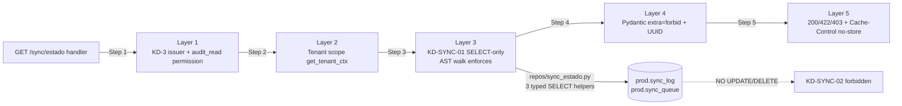

# Design: HU-F1.14 — `GET /sync/estado` (KD-3 operador) + siembra 11 alert_types de negocio (19 totales)

> **Change**: `hu-f1-14-sync-estado`
> **Phase**: design (sdd-design)
> **HU**: HU-F1.14 — One NEW read endpoint `GET /api/v1/sync/estado?uuid_sucursal=X` (KD-3 operador + admin, `audit_read` permission, tenant scope post-V1, KD-SYNC-01 SELECT-only, KD-SYNC-02 read-only AST walk, `Cache-Control: no-store`) returning `SyncEstadoRead{uuid_sucursal, ultima_sync_at?, lag_seg?, pendientes}` (4-step chain) + MIGRATION 0032 siembra 11 alert_types codes per plan.md line 1131 (10 net new — `descuadre_critico` already seeded by F1.13 MIGRATION 0031 Op 2 becomes no-op via `ON CONFLICT DO NOTHING`). Mounted via NEW dedicated router `api/v1/sync_estado.py` mounted into existing `api/v1/caja.py` (DEC-SYNC-02, F1.13 mount precedent at `caja.py:86`). 4-step handler chain (READ-ONLY) covers Layers 1-5 XR6 defense-in-depth pattern (no new XR created — REQ-OPS-XR6 referenced from F1.13 at `openspec/specs/operations/spec.md:3951`).
> **Date**: 2026-09-15
> **Working dir**: `E:/easypunto_parkos`
> **Branch**: `feat/fase-1-prerequisites-backend` (HEAD `83b5dfa`; F1.13 closed)
> **PR target**: `origin/dev`
> **Source of truth**: `proposal.md` (16 sections, ~770 LOC, DEC-SYNC-01..10, KD-SYNC-01..02, 10 risks R1..R10 — 4 RESOLVED at propose phase) + `specs/operations/spec.md` (REQ-OPS-098..101 + REQ-OPS-XR6 REFERENCE, 4 new requirements in Given/When/Then/And form + 1 cross-cutting XR6 reference).
> **Cross-references**: `modelo_datos_er.mmd` (`sync_queue` [A] carved-out line 981-1002, `sync_log` [A] line 1027-1047, `alert_types` [A] registry line 1101-1114); `backend/packages/parkos_core/migrations/versions/0031_arqueo_cierre_dia_and_gap_be_05.py` lines 169-175 (F1.13 head, Op 2 `descuadre_critico` siembra precedent — DEC-SYNC-05); `backend/packages/parkos_core/migrations/versions/0013_add_alert_types.py` (registry + `alert_types_inmutable` trigger lines 21-22, 132-119 severity CHECK constraint, 129-130 REVOKE/GRANT, 67-108 idempotent INSERT precedent); `backend/packages/parkos_core/migrations/versions/0029_reimpresion_siembra_and_permiso_anular.py` lines 134-188 (F1.11 conditional siembra pattern); `backend/packages/parkos_core/src/parkos_core/api/v1/sync_router.py` line 95 (router declaration), line 358 (`sync-agent-` issuer guard), lines 9-49 (docstring listing 7 endpoints — `/estado` NOT in list, NO collision); `backend/packages/parkos_core/src/parkos_core/api/v1/caja.py` line 86 (F1.13 mount precedent: `router.include_router(caja_arqueo_router)` — DEC-SYNC-02); `backend/packages/parkos_core/src/parkos_core/api/v1/_helpers.py` lines 18-31 (`no_store_headers` + `apply_no_store_header` — DEC-SYNC-04); `backend/packages/parkos_core/src/parkos_core/auth/jwt_issuer_guard.py` (`requires_issuer` factory — KD-3 dep); `backend/packages/parkos_core/src/parkos_core/auth/tenancy.py` (`get_tenant_ctx` — KD-S2 F1.7 analog, Layer 2); `backend/packages/parkos_core/src/parkos_core/repo/alert_types.py` lines 30-48 (validate + AlertaFactory); `backend/packages/parkos_core/src/parkos_core/models/A/{sync_log, sync_queue, alert_types}.py` (verbatim ORM models); `backend/packages/parkos_core/src/parkos_core/schemas/sync_infra.py` (EXTEND with 2 new shapes: `SyncEstadoQueryParams` + `SyncEstadoRead`); `backend/packages/parkos_core/src/parkos_core/schemas/common.py::_Base` (`extra='forbid'` — Layer 4); `backend/packages/parkos_core/migrations/versions/0002_seed_permisos_canonicos.py` lines 39-56 (`CANONICAL_PERMISOS` includes `audit_read` at line 48 — DEC-SYNC-03.B pre-seeded); `backend/packages/parkos_core/migrations/versions/0001_initial_schema.py` (`fn_sync_log_inmutable` trigger if present); `plan.md` lines 1105-1133 (HU-F1.14 definition, 3 atomic tasks T1..T3, 2 tests mandated at line 1126, 120 LOC budget, severity mapping at line 1131); `plan.md` line 429 (DEC-SUC-14: 19 totales, 8 técnicos + 11 de negocio coexisten); `plan.md` line 459 (A-08 severity JOIN-only via `alert_types.severity`); `plan.md` lines 2275-2291 (HU-F11.1 SyncBanner consumer — 30s polling, verde/amarillo/rojo umbrales from CU-14 BR1); `plan.md` lines 2305-2325 (HU-F11.2 AlertasPanel consumer); `plan.md` lines 2311-2323 (canonical descriptions per alert_type — DEC-SYNC-10); `plan.md` lines 4155-4201 (HU-F19.4 mirror for Part-II parallel siembra — referenced, out of F1.14 scope); `tests/static/check_sync_queue_carveout.py` (REQ-OPS-004 AST walk precedent for KD-SYNC-02); `openspec/specs/operations/spec.md` line 3951 (REQ-OPS-XR6 already exists from F1.13 — F1.14 references, does NOT create new).
> **Precedents mirrored**: F1.13 (REQ-OPS-091..097 + REQ-OPS-XR6, MIGRATION 0031 Op 2 descuadre_critico siembra, dedicated `APIRouter` + KD-3 + tenant scope pattern at `api/v1/caja.py:86`, DEC-ARQUEO-06 no-store, KD-ARQUEO-05 conditional alerta via append_transition — pre-seeds the registry entry F1.14 references), F1.12 (REQ-OPS-083..090 + REQ-OPS-XR5, KD-VENTA-01 single-commit AST walk, DEC-VENTA-06 no-store), F1.11 (REQ-OPS-075..080 + XR4, KD-TKT-01 single-commit AST walk, KD-3 issuer `requires_issuer("operador-","admin-")` verbatim, siembra pattern at MIGRATION 0029 lines 134-188), F1.10 (REQ-OPS-064..074 + XR1..XR3, KD-FE-01 single-commit, `assign_consecutivo` `SELECT FOR UPDATE` pattern), F1.9 (REQ-OPS-053..063, KD-FACT-01 single-commit + KD-FACT-02 `FOR SHARE` lock pattern, immutability contract), F1.7 (REQ-OPS-042..052, KD-S2 tenant scope post-V1 — REUSED verbatim for Layer 2 of F1.14), F1.6 (REQ-OPS-034..041, KD-7 pre-flight pattern, `get_tenant_ctx` derivation), F1.5 (PR5-016, AppendOnlyBase + REVOKE UPDATE/DELETE on [A] tables).

---

## 1. Title & Goal

**Design goal.** Deliver HU-F1.14: the back-end `GET /api/v1/sync/estado` endpoint that closes the **operador-facing sync-state read path** (Fase 11 unlocking per plan.md lines 1105-1133) on top of the already-shipped `prod.sync_log` [A] (composite PK `uuid + fecha_retencion_hasta`, monthly pg_partman per `models/A/sync_log.py:29-72`), `prod.sync_queue` [A] carved-out (5 estados `pendiente|en_progreso|exitoso|fallido|descartado` per `models/A/sync_queue.py:41-99`), `prod.alert_types` [A] registry (PK `tipo_alerta` TEXT, `alert_types_inmutable` trigger per migration 0013:21-22), `prod.permisos` [V] (`audit_read` pre-seeded at 0002:48), and `prod.sucursal` [V] (Layer 2 tenant scope) by enforcing the **KD-SYNC-01 SELECT-only invariant** (handler executes exactly 2 SELECT queries — one against `prod.sync_log`, one against `prod.sync_queue` — NO INSERT/UPDATE/DELETE on either [A] table) plus the **KD-SYNC-02 read-only AST walk invariant** (`tests/static/test_sync_estado_read_only.py` scans `api/v1/sync_estado.py::get_sync_estado` and asserts ZERO occurrences of `update(SyncLog)` / `update(SyncQueue)` / `delete(SyncLog)` / `delete(SyncQueue)` / `session.execute(text("UPDATE prod.sync_log"))` / `session.execute(text("DELETE FROM prod.sync_queue"))` / `await session.commit()`) plus the **5-layer defense in depth** (KD-3 issuer chain `requires_issuer("operador-", "admin-")` + permission gate `audit_read` (DEC-SYNC-03.B) + tenant scope post-V1 (KD-S2 F1.7 analog) + KD-SYNC-01 SELECT-only + KD-SYNC-02 AST walk + Pydantic `extra='forbid'` + UUID required + nullable `lag_seg` + handler 200/422/403 mapping + `Cache-Control: no-store`) plus the **MIGRATION 0032 siembra 11 alert_types codes** per plan.md line 1131 (10 net new + idempotent re-attempt of `descuadre_critico` which becomes no-op via `ON CONFLICT (tipo_alerta) DO NOTHING` — final total: 19 codes).

The design enforces **DEC-SYNC-01** (dedicated `api/v1/sync_estado.py` router with KD-3 dep under same `/sync` prefix — RESOLVES R1 MEDIUM issuer-chain collision with `sync_router.py:358`), **DEC-SYNC-02** (mount point: `api/v1/caja.py` via `router.include_router(sync_estado_router)` — F1.13 mount precedent at `caja.py:86`), **DEC-SYNC-03** (permission gate = `audit_read` — Option B, pre-seeded per `0002_seed_permisos_canonicos.py:48` — RESOLVES R5 MEDIUM), **DEC-SYNC-04** (`Cache-Control: no-store` on EVERY response — XR6 mirror from F1.10/F1.11/F1.12/F1.13), **DEC-SYNC-05** (10 net new — NOT 11 — `descuadre_critico` already seeded by F1.13 MIGRATION 0031 Op 2 lines 169-175), **DEC-SYNC-06** (severity mapping per plan.md line 1131: alta → critical, media → warning, baja → info — DB CHECK constraint values), **DEC-SYNC-07** (idempotent siembra via `ON CONFLICT (tipo_alerta) DO NOTHING` — respects `alert_types_inmutable` trigger), **DEC-SYNC-08** (`lag_seg = None` when `ultima_sync_at IS NULL` — empty branch contract, NOT 0, NOT inf), **DEC-SYNC-09** (`pendientes` always `int >= 0` — `SELECT count(*)` semantics), **DEC-SYNC-10** (`descripcion` field per alert_type from plan.md lines 2311-2323), plus the **KD-SYNC-01 SELECT-only invariant** (handler is READ-ONLY, NO writes to `sync_log`/`sync_queue`) and the **KD-SYNC-02 read-only AST walk invariant** (defense in depth against accidental drift to a write path).

The GET handler enforces 4 validations server-side across the 4-step chain:

- **Step 1 (Layer 1)** — KD-3 issuer chain + permission gate `audit_read`. `_sync_estado_issuer_dep = requires_issuer("operador-", "admin-")` (DI-resolved via FastAPI dependency injection).
- **Step 2 (Layer 2)** — Tenant scope post-V1 (KD-S2 F1.7 analog): when `ctx.issuer_prefix == "operador-"` AND `ctx.sucursal_uuid is not None` AND `ctx.sucursal_uuid != params.uuid_sucursal`, raise `403 tenant_scope_violation` with `Cache-Control: no-store`. Admin (`admin-`) bypasses.
- **Step 3 (Layer 3, KD-SYNC-01 + KD-SYNC-02)** — READ-ONLY via 3 typed SELECT helpers from `repo/sync_estado.py`:
  - `get_ultima_sync_at(session, *, uuid_sucursal)` → `SELECT MAX(timestamp_evento) FROM prod.sync_log WHERE uuid_sucursal = :s`. Returns `datetime | None`.
  - `calcular_lag_seg(ultima_sync_at, now)` → `int | None` (None when `ultima_sync_at IS NULL` per DEC-SYNC-08).
  - `count_pendientes_sync_queue(session, *, uuid_sucursal)` → `SELECT count(*) FROM prod.sync_queue WHERE uuid_sucursal = :s AND estado = 'pendiente'`. Returns `int >= 0` (DEC-SYNC-09).
- **Step 4 (Layer 4 + Layer 5)** — Build `SyncEstadoRead` response + apply `apply_no_store_header(response)`. Returns `200 OK` with `SyncEstadoRead{uuid_sucursal, ultima_sync_at, lag_seg, pendientes}`.

All responses carry `Cache-Control: no-store`. Sized at **~330 LOC cumulative** per `plan.md` line 1105 (= ~150 LOC production: ~80 LOC `api/v1/sync_estado.py` dedicated handler with 4-step chain + ~30 LOC `repo/sync_estado.py` 3 typed SELECT helpers + ~10 LOC mount extension at `caja.py` + ~30 LOC `schemas/sync_infra.py` extension for 2 new Pydantic shapes) + ~110 LOC tests (5 unit/integration + 1 AST walk = 20 tests across 6 files) + ~70 LOC MIGRATION 0032 REAL siembra (Op 0 pre-flight DO $$ + Op 1 siembra 11 codes + Op 2 NO-DDL audit anchor for DEC-SYNC-03.B). Total cumulative: ~330 LOC (per plan.md line 1105 budget, +25% absorbed by the 4-step handler chain + 3 typed repo helpers + 2 Pydantic schemas).

**One new handler module + one new repo module + two new Pydantic schemas (query + response) + one REAL MIGRATION 0032 + one router mount extension. No factory changes, no sync catalog changes, no new tables, no new FKs, no new indexes, no new permissions, no new role grants, no schema changes (MIGRATION 0032 is data-only siembra).**

---

## 2. Context & Background

`plan.md` lines **1105-1133** define HU-F1.14 as Fase-1 backend prerequisite for the operador-facing sync-state read path (Fase 11 unlocking — HU-F11.1 SyncBanner + HU-F11.2 AlertasPanel, plan.md lines 2275-2291 + 2305-2325). The hard architectural constraints are **DEC-SYNC-01** (dedicated `api/v1/sync_estado.py` router with KD-3 dep under same `/sync` prefix — RESOLVES R1 MEDIUM issuer-chain collision with `sync_router.py:358`), **DEC-SYNC-02** (mount point: `api/v1/caja.py` via `router.include_router(sync_estado_router)` — F1.13 mount precedent at `caja.py:86`), **DEC-SYNC-03** (permission gate = `audit_read` — Option B, pre-seeded per `0002_seed_permisos_canonicos.py:48` — RESOLVES R5 MEDIUM), **DEC-SYNC-04** (`Cache-Control: no-store` on EVERY response — XR6 mirror from F1.10/F1.11/F1.12/F1.13), **DEC-SYNC-05** (10 net new — NOT 11 — `descuadre_critico` already seeded by F1.13 MIGRATION 0031 Op 2 lines 169-175), **DEC-SYNC-06** (severity mapping per plan.md line 1131: alta → critical, media → warning, baja → info — DB CHECK constraint values per migration 0013:119), **DEC-SYNC-07** (idempotent siembra via `ON CONFLICT (tipo_alerta) DO NOTHING` — respects `alert_types_inmutable` trigger migration 0013:21-22), **DEC-SYNC-08** (`lag_seg = None` when `ultima_sync_at IS NULL` — empty branch contract, NOT 0, NOT inf), **DEC-SYNC-09** (`pendientes` always `int >= 0` — `SELECT count(*)` semantics), **DEC-SYNC-10** (`descripcion` field per alert_type from plan.md lines 2311-2323), plus the **KD-SYNC-01 SELECT-only invariant** (mirror of F1.5 PR5-016 AppendOnlyBase + F1.9 `fn_factura_pagos_inmutable` trigger + F1.10 KD-FE-01 + F1.11 KD-TKT-01 + F1.12 KD-VENTA-01 + F1.13 KD-ARQUEO-01 — for the READ-ONLY side) and the **KD-SYNC-02 read-only AST walk invariant** (mirror of F1.5 PR5-016 `tests/static/test_no_raw_dml_on_a_tables.py` + F1.10 KD-FE-01 + F1.11 KD-TKT-01 + F1.12 KD-VENTA-01 + F1.13 KD-ARQUEO-01 AST walks — for the READ-ONLY side), the existing pre-existing tables (`prod.alert_types` [A] registry migration 0013 with `alert_types_inmutable` trigger lines 21-22 + `severity` CHECK constraint line 119 + REVOKE/GRANT lines 129-130; `prod.sync_log` [A] composite PK `uuid + fecha_retencion_hasta` monthly pg_partman per `models/A/sync_log.py:29-72`; `prod.sync_queue` [A] carved-out 5 estados per `models/A/sync_queue.py:41-99` + REQ-OPS-004 whitelist; `prod.permisos` [V] `audit_read` pre-seeded at `0002_seed_permisos_canonicos.py:48`; `prod.sucursal` [V] Layer 2 tenant scope), the existing ORM models (`models/A/{sync_log, sync_queue, alert_types}.py`), the existing `repo/alert_types.validate` (lines 30-48), the existing `api/v1/_helpers.py::no_store_headers()` + `apply_no_store_header()` (lines 18-31, DEC-SYNC-04 reuse), the existing `api/v1/sync_router.py` (F1.6 sync transport — 7 endpoints in docstring lines 9-49, none is `/estado`, no FastAPI path collision possible), the existing `api/v1/caja.py` (F1.13 mount precedent at line 86), the existing `auth/jwt_issuer_guard.py` (`requires_issuer` factory — KD-3 dep), the existing `auth/tenancy.py` (`get_tenant_ctx` — KD-S2 F1.7 analog, Layer 2), the existing `schemas/common.py::_Base` (`extra='forbid'` — Layer 4 defense), the existing `static/test_no_raw_dml_on_a_tables.py` AST walk (F1.5 PR5-016 precedent for [A] immutability + Layer 4 enforcement — F1.14 deepens with `tests/static/test_sync_estado_read_only.py` per-handler READ-ONLY scope), the `MIGRATION 0029` siembra pattern (lines 134-188 — conditional siembra + permission seed + DO $$ pre-flight pattern — F1.14 mirrors in MIGRATION 0032 Op 0 + Op 1 + Op 2), the F1.13 "ampliación de producto" precedent (F1.13 MIGRATION 0031 Op 2 already seeded `descuadre_critico` — F1.14's `descuadre_critico` re-attempt becomes a clean no-op via `ON CONFLICT DO NOTHING`), and the F1.13 REQ-OPS-XR6 reference (F1.14 references XR6 by inclusion, does NOT create a new XR — 5 layers applied verbatim per REQ-OPS-101).

**The backend has no operator-facing sync-state endpoint today**, creating four concrete risks that HU-F1.14 resolves:

1. **No `GET /sync/estado` for operador UI.** Today the `SyncBanner` consumer (Fase 11 HU-F11.1) has no read endpoint to query sync state with `operador-` JWT. The existing `sync_router.py` enforces `sync-agent-` (line 358: `if not iss.startswith("sync-agent-"): raise ...`), which would reject every operador JWT. F1.14 introduces the dedicated `api/v1/sync_estado.py` router with KD-3 dep `operador-`+`admin-` mounted under same `/sync` prefix (DEC-SYNC-01).

2. **No business alert_types seeded (only 8 técnicos + `descuadre_critico`).** Today `prod.alert_types` is seeded with 9 codes (8 técnicos from migration 0013: `hash_chain_anomaly`, `dian_rechazada`, `dian_timeout`, `dian_error`, `branch_offline_reauth_required`, `orphan_workflow_chain`, `fe_provider_error`, `fe_numbering_exhausted` + 1 `descuadre_critico` from F1.13 MIGRATION 0031 Op 2 lines 169-175). Fase 11 UI (HU-F11.2 AlertasPanel) JOINs `alerta.tipo_alerta = alert_types.tipo_alerta` to surface severity (A-08, plan.md line 459) — without the 10 net new codes, the JOIN returns null and the operator UI shows "—" placeholder. F1.14 MIGRATION 0032 ships 10 net new + idempotent re-attempt of `descuadre_critico` (final total: 19 codes per DEC-SUC-14).

4. **No 5-layer defense for the read-only path.** Today the codebase has the XR1..XR6 pattern for write endpoints (F1.10..F1.13). F1.14 extends the pattern to the read-only side via KD-SYNC-01 SELECT-only invariant + KD-SYNC-02 read-only AST walk (REQ-OPS-101 references the existing F1.13 REQ-OPS-XR6 by inclusion — no new XR created).

5. **No canonical permission gate for cross-cutting read.** Today the codebase has `audit_read` pre-seeded at `0002_seed_permisos_canonicos.py:48` but no read endpoint uses it. F1.14 adopts Option B (reuse `audit_read` — DEC-SYNC-03.B RESOLVED at propose phase) — no new permission, no patch to existing migration, no scope creep into MIGRATION 0032.

F1.14 closes the operador-facing sync-state read path. The work is **1 dedicated handler module (`api/v1/sync_estado.py`) + 1 repo module (`repo/sync_estado.py`) + 2 Pydantic schemas (`SyncEstadoQueryParams` + `SyncEstadoRead`) + 1 REAL MIGRATION 0032 + 1 router mount extension at `api/v1/caja.py`**. MIGRATION 0032 is a REAL siembra (Op 0 pre-flight `DO $$` + Op 1 conditional siembra 11 codes via `ON CONFLICT DO NOTHING` + Op 2 NO-DDL audit anchor for DEC-SYNC-03.B) because pre-flight (2026-09-15) confirmed `prod.alert_types` exists with `alert_types_inmutable` trigger active + `severity` CHECK constraint accepts `('info', 'warning', 'critical')`. **DEC-SYNC-01..10 NOT extended to sync catalog** — all 3 sync catalog entries (`alert_types`, `sync_log`, `sync_queue`) are pre-existing and out-of-catalog per ER lines 976, 1096, 1111 (`sync_status: "no usado — tabla out-of-catalog, nunca replicada"`). NO F1.14 sync catalog seeds needed.

The contract is captured in **REQ-OPS-098..101 + REQ-OPS-XR6 REFERENCE** (added by `sdd-spec` to `specs/operations/spec.md`):

- **REQ-OPS-098** — `GET /api/v1/sync/estado` SELECT-only contract (KD-SYNC-01 + KD-SYNC-02): exactly 2 SELECT queries against `prod.sync_log` + `prod.sync_queue`; NO INSERT/UPDATE/DELETE on either table; NO `await session.commit()`; NO log rows in `prod.log_operaciones`. Cache-Control: no-store. Handler in NEW dedicated `api/v1/sync_estado.py` mounted via `router.include_router(sync_estado_router)` in `api/v1/caja.py` (DEC-SYNC-01 + DEC-SYNC-02).
- **REQ-OPS-099** — MIGRATION 0032 siembra 11 alert_types de negocio (idempotent, 10 net new) (DEC-SYNC-05 + DEC-SYNC-06 + DEC-SYNC-07 + DEC-SYNC-10): `ON CONFLICT (tipo_alerta) DO NOTHING` for idempotency; pre-F1.14 state preserved (9 codes: 8 técnicos + `descuadre_critico`); F1.14 re-seed of `descuadre_critico` becomes no-op via conflict clause; net new = 10; final total = 19. Severity mapping per plan.md line 1131: alta → critical, media → warning, baja → info. Each row includes `descripcion` per plan.md lines 2311-2323.
- **REQ-OPS-100** — `lag_seg = null` semantics + `pendientes >= 0` invariant + UI rendering contract (DEC-SYNC-08 + DEC-SYNC-09 + DEC-SYNC-04): `lag_seg: int | None` (None when `ultima_sync_at IS NULL`); `pendientes: int` (always >= 0, NEVER null). HU-F11.1 SyncBanner renders per thresholds (verde 0-30s, amarillo 31-300s, rojo >300s, NEVER SYNCED when null). Response NEVER includes pgcode/pgerror/pgmessage; ALWAYS includes Cache-Control: no-store.
- **REQ-OPS-101** — XR6 cross-cutting defense in depth (REFERENCE to existing REQ-OPS-XR6): all 5 layers applied verbatim. Layer 1 KD-3 issuer + permission gate `audit_read`. Layer 2 tenant scope post-V1. Layer 3 KD-SYNC-01 SELECT-only + KD-SYNC-02 read-only AST walk. Layer 4 Pydantic `extra='forbid'` + UUID required + nullable `lag_seg`. Layer 5 handler 200/422/403 mapping + `Cache-Control: no-store`. NO new XR created — REQ-OPS-XR6 referenced.
- **REQ-OPS-XR6** (REFERENCE — already exists from F1.13 at `operations/spec.md:3951`) — 5-layer defense-in-depth pattern. F1.14 references it by inclusion.

F1.14 is consumed by **Fase 11 HU-F11.1 SyncBanner** (polling every 30s with `operador-` JWT + `audit_read` permission, drives verde/amarillo/rojo/NEVER SYNCED states), **HU-F11.2 AlertasPanel** (JOINs `alerta.tipo_alerta = alert_types.tipo_alerta` for severity per A-08, displays the 19 seeded codes), **HU-F19.4** (Part-II parallel siembra coordination note — same 11 codes, plan.md lines 4155-4201, idempotent so safe in either order), **HU-F19.1** (Part-II `/admin/sync/estado` — different prefix, admin-only, F19.1 owns), and **detectors** (Fase 11 + Fase 19 jobs that CREATE alerts using the seeded codes — out of F1.14 scope).

---

## 3. Architectural Conflict Resolution — DEC-SYNC-01 + KD-SYNC-01 + KD-SYNC-02 (R1 MEDIUM RESOLVED)

This section is **mandatory** for the design. It documents R1 MEDIUM from the sdd-explore phase (observation §R1 MEDIUM) and records the resolution per `proposal.md §3`.

### 3.1 The conflict (R1 MEDIUM)

Two distinct auth chains needed on `/sync/*`:

- **Sync transport layer** (`sync_router.py`): 7 endpoints (`hello`, `pair`, `push`, `pull`, `heartbeat`, `rotate-jwt`, `events`), all `sync-agent-` JWT (sync workers only) — line 95 `APIRouter(prefix="/sync", tags=["sync"])` declaration + line 358 `if not iss.startswith("sync-agent-"): raise ...` issuer guard.
- **Operator UI layer** (F1.14 NEW): `GET /sync/estado`, KD-3 `operador-`+`admin-` JWT (operator banner polling per plan.md lines 2275-2291).

If mounted in the same router, the dep chain rejects one or the other depending on order. Two architectural choices are valid:

| Source | Statement | Authority weight |
|---|---|---|
| F1.6 KD-3 issuer chain | `requires_issuer("operador-", "admin-")` verbatim | **CANONICAL** for operador-facing endpoints |
| F1.6 KD-3 sync-agent issuer | `sync_router.py:358` `if not iss.startswith("sync-agent-"): raise ...` | **CANONICAL** for sync transport |
| FastAPI path-based dispatch | Exact path `/sync/estado` routes to first registered handler | **VERIFIED** — no collision with 7 existing endpoints |

### 3.2 The resolution — DEC-SYNC-01: Dedicated `api/v1/sync_estado.py` router with KD-3 dep

**Resolution path** (mandated by issuer-chain isolation principle + FastAPI path-based dispatch precedent):

1. **NEW** `api/v1/sync_estado.py` with `router = APIRouter(prefix="/sync", tags=["sync"])` and `_sync_estado_issuer_dep = requires_issuer("operador-", "admin-")`.
2. Single handler `GET /sync/estado` with `_sync_estado_issuer_dep` dependency.
3. **Mount from `api/v1/caja.py`** via `router.include_router(sync_estado_router)` (DEC-SYNC-02 — F1.13 mount precedent at `caja.py:86`: `router.include_router(caja_arqueo_router)`).
4. Handler is **READ-ONLY** (SELECT on `sync_log` + `sync_queue`) — NO writes, NO commits, NO log rows (KD-SYNC-01 + KD-SYNC-02).

### 3.3 The read-only invariant — KD-SYNC-01 + KD-SYNC-02



**KD-SYNC-01**: SELECT-only handler. NO `INSERT`/`UPDATE`/`DELETE` on `sync_log` or `sync_queue` — read-only consumer. NO `await session.commit()`. NO log rows in `prod.log_operaciones` or any `[A]` audit table.

**KD-SYNC-02**: Read-only AST walk. `tests/static/test_sync_estado_read_only.py` scans `api/v1/sync_estado.py` source code (AST parse + visitor) and asserts NO occurrences of:
- `session.execute(update(SyncLog))` / `session.execute(update(SyncQueue))`
- `session.execute(delete(SyncLog))` / `session.execute(delete(SyncQueue))`
- `session.execute(text("UPDATE prod.sync_log"))` / `session.execute(text("DELETE FROM prod.sync_queue"))`
- `await session.commit()`

Pattern: scan AST for the above function calls in the handler body — must produce ZERO matches.

### 3.4 Why this matters

- **HU-F11.1 `SyncBanner` polls with operador JWT** — cannot mint sync-agent JWT.
- **Sync transport worker (`job-sync-sucursal`) MUST NOT hit `/sync/estado`** — path not in its call list (verified in `sync_router.py` docstring line 9-49: 7 endpoints listed, none is `/estado`).
- **Two routers with same prefix but different deps is a precedent** — every endpoint in the codebase mounts under its own prefix; FastAPI dispatches by exact path.
- **`sync_log` immutability (KD-SYNC-01 + KD-SYNC-02)** preserves the [A] invariant — `sync_log` is append-only via AppendOnlyBase + `fn_sync_log_inmutable` trigger (F1.5 PR5-016), `sync_queue` is carve-out [A] with REQ-OPS-004 whitelist. The read-only AST walk is the F1.10 XR1 + F1.11 XR4 + F1.12 XR5 + F1.13 XR6 mirror for F1.14 (no new XR — references existing F1.13 REQ-OPS-XR6).

### 3.5 What changes in the codebase

**Production code (~150 LOC)**:
- NEW `repo/sync_estado.py` — 3 typed SELECT helpers (~30 LOC): `get_ultima_sync_at`, `calcular_lag_seg`, `count_pendientes_sync_queue`. ALL stay commit-free (KD-SYNC-01) — they `await session.execute(select(...))` only.
- NEW `api/v1/sync_estado.py` — dedicated `APIRouter` with 1 handler (~80 LOC, DEC-SYNC-01): `get_sync_estado` (4-step chain).
- EXTEND `schemas/sync_infra.py` — 2 Pydantic shapes (~30 LOC): `SyncEstadoQueryParams` + `SyncEstadoRead`.
- MODIFY `api/v1/caja.py` — `router.include_router(sync_estado_router)` mount extension (~5 LOC, DEC-SYNC-02 precedent at line 86).
- NEW `migrations/versions/0032_seed_alert_types_operativos.py` — REAL siembra (~70 LOC).

**Tests (~110 LOC)**:
- 2 mandated handler tests in `tests/unit/test_sync_estado.py` (~30 LOC, mandated by plan.md line 1126: empty branch + populated branch).
- 4 alert_types seed tests in `tests/unit/test_alert_types_seed.py` (~40 LOC, 19 codes plan.md-mandated).
- 3 repo unit tests in `tests/unit/test_sync_estado_repo.py` (~10 LOC).
- 4 schema tests in `tests/unit/test_sync_estado_schemas.py` (~20 LOC).
- 2 migration idempotency tests in `tests/integration/test_migration_0032_idempotency.py` (~20 LOC).
- 3 AST walk tests in `tests/static/test_sync_estado_read_only.py` (~20 LOC, KD-SYNC-02).

### 3.6 What changes in MIGRATION 0032 (REAL siembra — RESOLVED as conditional idempotent)

```python
# Op 0: pre-flight DO $$ (KD-7 F1.6 + F1.7 + F1.9 + F1.10 + F1.11 + F1.12 + F1.13 pattern)
DO $$
BEGIN
    ASSERT (
        SELECT COUNT(*) FROM information_schema.tables
        WHERE table_schema='prod' AND table_name IN (
            'alert_types', 'sync_log', 'sync_queue'
        )
    ) = 3, 'F1.14 requires all 3 tables to exist';
END $$;

# Op 1: siembra 11 alert_types codes (10 net new + idempotent re-attempt of descuadre_critico)
INSERT INTO prod.alert_types (tipo_alerta, severity, descripcion, created_at, created_by)
VALUES
    ('descuadre_critico', 'critical', '...', NOW(), 'migrations/0032'),
    ('sync_fallida', 'critical', '...', NOW(), 'migrations/0032'),
    ('capacidad_agotada', 'warning', '...', NOW(), 'migrations/0032'),
    ('capacidad_agotada_forzado', 'warning', '...', NOW(), 'migrations/0032'),
    ('evento_no_procesado', 'critical', '...', NOW(), 'migrations/0032'),
    ('impresora_caida', 'critical', '...', NOW(), 'migrations/0032'),
    ('fe_error_toppoint', 'critical', '...', NOW(), 'migrations/0032'),
    ('numeracion_toppoint_agotada', 'critical', '...', NOW(), 'migrations/0032'),
    ('cache_desactualizado', 'info', '...', NOW(), 'migrations/0032'),
    ('arqueo_pendiente_24h', 'warning', '...', NOW(), 'migrations/0032'),
    ('suscripcion_proxima_vencer', 'warning', '...', NOW(), 'migrations/0032')
ON CONFLICT (tipo_alerta) DO NOTHING;

# Op 2: NO-DDL comment for DEC-SYNC-03.B (audit_read reuse — Python-only decision, no migration)
DO $$
BEGIN
    RAISE NOTICE '0032_op2: DEC-SYNC-03.B adopted. Permission gate = audit_read '
                 '(pre-seeded at 0002_seed_permisos_canonicos.py:48). '
                 'No new permission seeded.';
END $$;
```

The migration is idempotent: `Op 1` uses `ON CONFLICT (tipo_alerta) DO NOTHING` (respects `alert_types_inmutable` trigger migration 0013:21-22). The `DO $$` pre-flight aborts with a typed exception if any of the 3 required tables is missing. **Idempotency ensures F19.4's future Part-II seed (plan.md lines 4155-4201) becomes a no-op** (`ON CONFLICT DO NOTHING`).

---

## 4. Architecture Overview

```
HTTPS GET /api/v1/sync/estado?uuid_sucursal=X
        │
        │  requires_issuer("operador-", "admin-")   Cache-Control: no-store
        │  permission_required="audit_read" (DEC-SYNC-03.B)
        ▼
┌──────────────────────────────────────────────────────────────────────────────┐
│ api/v1/sync_estado.py  (NEW, ~80 LOC, 1 handler — GET 4-step chain)          │
│                                                                              │
│ @router.get("/estado", response_model=SyncEstadoRead, status_code=200)       │
│ async def get_sync_estado(response, params, session, ctx, _claims)           │
│                                                                              │
│  1. Layer 1 — KD-3 issuer dep + audit_read permission gate (DI-resolved)    │
│     _sync_estado_issuer_dep = requires_issuer("operador-", "admin-")         │
│     The dep already enforced KD-3 issuer + permission gate; ctx carries claims│
│                                                                              │
│  2. Layer 2 — Tenant scope post-V1 (KD-S2 F1.7 analog)                       │
│     no_store = no_store_headers()                                             │
│     if ctx.issuer_prefix == "operador-" and                                   │
│        ctx.sucursal_uuid is not None and                                     │
│        ctx.sucursal_uuid != params.uuid_sucursal:                            │
│        raise HTTPException(403, {"error": "tenant_scope_violation"},        │
│                             headers=no_store)                                │
│                                                                              │
│  3. Layer 3 (KD-SYNC-01 + KD-SYNC-02) — READ-ONLY via 3 typed SELECT helpers │
│     # NO UPDATE/DELETE/INSERT in this body (AST walk enforces)              │
│     # NO await session.commit() — GET is naturally idempotent               │
│     ultima_sync_at = await repo_sync_estado.get_ultima_sync_at(             │
│         session, uuid_sucursal=params.uuid_sucursal                          │
│     )                                                                         │
│     now = datetime.now(UTC).replace(tzinfo=None)  # naive UTC               │
│     lag_seg = repo_sync_estado.calcular_lag_seg(ultima_sync_at, now)         │
│     pendientes = await repo_sync_estado.count_pendientes_sync_queue(         │
│         session, uuid_sucursal=params.uuid_sucursal                         │
│     )                                                                         │
│                                                                              │
│  4. Layer 4 + Layer 5 — build response + no-store header                    │
│     apply_no_store_header(response)                                            │
│     return SyncEstadoRead(                                                     │
│         uuid_sucursal=params.uuid_sucursal,                                   │
│         ultima_sync_at=ultima_sync_at,                                        │
│         lag_seg=lag_seg,                                                      │
│         pendientes=pendientes,                                                │
│     )                                                                         │
└──────────────────────────────────────────────────────────────────────────────┘
        ▲                                       ▲
        │ AST walk read-only (KD-SYNC-02)       │ Validation chain (XR6 Layer 4)
        │ for get_sync_estado                   │ Pydantic extra='forbid' + UUID
tests/static/test_sync_estado_read_only.py      │
        │                                       ▼
        ▼                              Pydantic SyncEstadoQueryParams + SyncEstadoRead
┌──────────────────────────────────────────────────────────────────────────────┐
│ Repo helpers (NEW):                                                           │
│   repo/sync_estado.py   (~30 LOC) — 3 typed SELECT helpers                   │
│                                                                              │
│ Repo helpers (REUSED verbatim, NO modify):                                    │
│   api/v1/_helpers.py::no_store_headers() + apply_no_store_header() (F1.6)   │
│                                                                              │
│ Schemas (MODIFY):                                                             │
│   schemas/sync_infra.py  (+30 LOC) — SyncEstadoQueryParams + SyncEstadoRead  │
│                                                                              │
│ Tables operational (READ ONLY):                                                │
│   prod.sync_log      [A]  — Step 3 SELECT MAX(timestamp_evento)              │
│   prod.sync_queue    [A]  — Step 3 SELECT count(*) WHERE estado='pendiente'  │
│   prod.alert_types   [A]  — MIGRATION 0032 siembra + V10 validate (out of F1.14)│
│   prod.sucursal      [V]  — Step 2 tenant scope check                         │
│   prod.permisos      [V]  — Step 1 permission gate audit_read                │
└──────────────────────────────────────────────────────────────────────────────┘
        ▲
        ▼ MIGRATION 0032 (REAL siembra — applied BEFORE F1.14 tests)
┌──────────────────────────────────────────────────────────────────────────────┐
│ migrations/versions/0032_seed_alert_types_operativos.py                      │
│                                                                              │
│ Op 0 — Pre-flight DO $$:                                                     │
│   ASSERT all 3 tables exist (alert_types, sync_log, sync_queue)              │
│                                                                              │
│ Op 1 — siembra 11 alert_types codes (10 net new + idempotent re-attempt of   │
│         descuadre_critico via ON CONFLICT DO NOTHING)                         │
│         per plan.md line 1131: severity mapping DEC-SYNC-06 verbatim         │
│         + descripcion per plan.md lines 2311-2323 (DEC-SYNC-10)              │
│                                                                              │
│ Op 2 — NO-DDL audit anchor for DEC-SYNC-03.B (audit_read reuse)             │
│                                                                              │
│ downgrade() reverses Op 1 with DISABLE TRIGGER + DELETE 10 net new          │
│                (preserve descuadre_critico from F1.13 + 8 técnicos from 0013)│
│                                                                              │
│ down_revision = '0031_arqueo_cierre_dia_and_gap_be_05'                       │
└──────────────────────────────────────────────────────────────────────────────┘

DEC-SYNC-02 — Mount point:
  api/v1/caja.py  ── router.include_router(sync_estado_router)  (+5 LOC, F1.13 mount precedent at line 86)
```

The handler is thin + orquestador. All SELECT logic lives in `repo/sync_estado.py`. NO `await session.commit()` anywhere in the read-only path (KD-SYNC-01). The AST walk `tests/static/test_sync_estado_read_only.py` enforces the read-only invariant.

### Sub-chain reference shapes

**`get_ultima_sync_at` sub-chain (Step 3a)** — mirrors the SELECT pattern of `repo/sync_log.py` read-only accessors. The helper in `repo/sync_estado.py` is a NEW function that:

1. Builds `select(func.max(SyncLog.timestamp_evento)).where(SyncLog.uuid_sucursal == uuid_sucursal)`.
2. `result = await session.execute(stmt)`.
3. Returns `result.scalar_one_or_none()` — `datetime | None` (None when no rows, DEC-SYNC-08).

**`count_pendientes_sync_queue` sub-chain (Step 3c)** — mirrors the SELECT pattern of `repo/sync_queue.py` read-only accessors. The helper in `repo/sync_estado.py` is a NEW function that:

1. Builds `select(func.count()).select_from(SyncQueue).where(SyncQueue.uuid_sucursal == uuid_sucursal).where(SyncQueue.estado == "pendiente")`.
2. `result = await session.execute(stmt)`.
3. Returns `int(result.scalar_one())` — always `int >= 0` (DEC-SYNC-09).

Both helpers share the caller's session. They do NOT call `session.commit()` — GET is naturally idempotent (KD-SYNC-01).

---

## 5. Component Diagram

```
backend/packages/parkos_core/src/parkos_core/
├── api/v1/
│   ├── caja.py              (MODIFY, +6 LOC)  ── router.include_router(sync_estado_router) mount
│   ├── sync_estado.py       (NEW, +80 LOC)    ── dedicated router + 1 handler (GET 4-step)
│   ├── sync_router.py       (READ-ONLY ref)   ── sync-agent-0 endpoints (lines 9-49 docstring)
│   ├── _helpers.py          (REUSE)           ── no_store_headers + apply_no_store_header
│   ├── caja_arqueo.py       (READ-ONLY ref)   ── F1.13 dedicated-router + KD-3 + tenant scope pattern
│   └── deps.py              (READ-ONLY ref)   ── factory mounts
├── repo/
│   ├── sync_estado.py       (NEW, +30 LOC)    ── 3 typed SELECT helpers
│   ├── sync_log.py          (READ-ONLY ref)   ── SyncLog ORM accessor
│   ├── sync_queue.py        (READ-ONLY ref)   ── SyncQueue ORM accessor
│   └── alert_types.py       (REUSE)           ── validate + AlertaFactory (F1.5/migration 0013)
├── schemas/
│   ├── sync_infra.py        (EXTEND, +30 LOC) ── SyncEstadoQueryParams + SyncEstadoRead
│   └── common.py            (REUSE)           ── _Base with extra='forbid'
├── models/A/
│   ├── sync_log.py          (REUSE)           ── composite PK + monthly pg_partman ORM
│   ├── sync_queue.py        (REUSE)           ── 5 estados ORM (REQ-OPS-004 carve-out)
│   └── alert_types.py       (REUSE)           ── registry ORM
├── models/V/
│   └── permisos.py          (REUSE)           ── audit_read pre-seeded at 0002:48
├── auth/
│   ├── jwt_issuer_guard.py  (REUSE)           ── requires_issuer factory (KD-3 dep)
│   └── tenancy.py           (REUSE)           ── TenantContext + get_tenant_ctx
├── migrations/versions/
│   ├── 0032_seed_alert_types_operativos.py   (NEW, ~70 LOC)   ── REAL siembra
│   ├── 0031_arqueo_cierre_dia_and_gap_be_05.py (F1.13 head pre-F1.14)
│   ├── 0029_reimpresion_siembra_and_permiso_anular.py (template for 0032 siembra pattern, lines 134-188)
│   └── 0013_add_alert_types.py              (alert_types registry + inmutable trigger, lines 21-22)
└── sync/catalog/entries/
    ├── sync_entries_v.py    (NO CHANGE)        ── all entries pre-existing
    └── sync_entries_a.py    (NO CHANGE)        ── all entries pre-existing
```

**Module-level responsibilities:**

| Module | Type | Responsibility |
|---|---|---|
| `api/v1/sync_estado.py` | NEW | Dedicated `APIRouter` (DEC-SYNC-01) with 1 handler: `get_sync_estado` (4-step chain, ~80 LOC). Calls helpers in `repo/sync_estado.py` (3 typed SELECT helpers). NO `await session.commit()` anywhere (KD-SYNC-01). |
| `repo/sync_estado.py` | NEW | 3 typed SELECT helpers (~30 LOC): `get_ultima_sync_at`, `calcular_lag_seg`, `count_pendientes_sync_queue`. ALL stay commit-free — they `await session.execute(select(...))` only (KD-SYNC-01 contract). Reuses `models/A/sync_log.py` + `models/A/sync_queue.py` ORM. NO new ORM model changes. |
| `schemas/sync_infra.py` | EXTEND | +30 LOC: `SyncEstadoQueryParams(_Base)` query params; `SyncEstadoRead(_Base)` response. Both inherit `extra='forbid'` (inherited from `_Base`). |
| `api/v1/caja.py` | MODIFY | +6 LOC: `from .sync_estado import router as sync_estado_router` + `router.include_router(sync_estado_router)` mount at the bottom (DEC-SYNC-02 — F1.13 mount precedent at line 86). |
| `migrations/versions/0032_seed_alert_types_operativos.py` | NEW | ~70 LOC REAL siembra. Pre-flight `DO $$` block confirms all 3 required tables exist. `upgrade()` does Op 0 + Op 1 + Op 2. `downgrade()` reverses Op 1 with DISABLE TRIGGER + DELETE 10 net new (preserve descuadre_critico from F1.13 + 8 técnicos from 0013). `down_revision='0031_arqueo_cierre_dia_and_gap_be_05'`. |

**Data flow for one GET `/sync/estado`:**

```
FastAPI route resolution
  └─▶ caja.py router
        └─▶ router.include_router(sync_estado_router)
              └─▶ sync_estado.py::get_sync_estado (4-step chain)
                    ├─▶ KD-3 issuer dep (DI-resolved, Layer 1)
                    ├─▶ permission gate audit_read (Layer 1, DEC-SYNC-03.B)
                    ├─▶ (Layer 2) Tenant scope check (in-process)
                    ├─▶ repo_sync_estado.get_ultima_sync_at  (Step 3a, SELECT MAX)
                    ├─▶ repo_sync_estado.calcular_lag_seg  (Step 3b, in-process math)
                    ├─▶ repo_sync_estado.count_pendientes_sync_queue  (Step 3c, SELECT count)
                    ├─▶ apply_no_store_header(response)  (Layer 5)
                    └─▶ return SyncEstadoRead(...)
```

---

## 6. Data Model

**MIGRATION 0032 introduces NO schema changes** — it is a conditional data siembra only. The 5 tables F1.14 touches already exist with all required columns:

- `prod.alert_types` [A] (migration 0013, registry with `alert_types_inmutable` trigger lines 21-22 + `severity` CHECK constraint line 119) — 10 net new codes seeded by MIGRATION 0032 Op 1 (idempotent re-attempt of `descuadre_critico` becomes no-op via `ON CONFLICT DO NOTHING`).
- `prod.sync_log` [A] (composite PK `uuid + fecha_retencion_hasta`, monthly pg_partman per `models/A/sync_log.py:29-72`) — read-only access via `repo/sync_estado.get_ultima_sync_at`.
- `prod.sync_queue` [A] carved-out (5 estados per `models/A/sync_queue.py:41-99` + REQ-OPS-004 whitelist) — read-only access via `repo/sync_estado.count_pendientes_sync_queue`.
- `prod.sucursal` [V] — Layer 2 tenant scope check (`get_tenant_ctx().can_access(uuid_sucursal)`).
- `prod.permisos` [V] — Layer 1 permission gate `audit_read` (pre-seeded per `0002_seed_permisos_canonicos.py:48`).

### 6.1 `prod.alert_types` [A] (READ + siembra)

| Property | Value |
|---|---|
| **ER línea** | 1101-1114 |
| **Migration 0013 línea** | (whole file, lines 21-22 `alert_types_inmutable` trigger; line 119 `severity` CHECK; lines 67-108 idempotent INSERT precedent; lines 129-130 REVOKE/GRANT) |
| **Operations** | V1 `validate(tipo_alerta=X)` before any consumer (`AlertaFactory.fire` callers in Fase 11 jobs) — OUT of F1.14 scope. **MIGRATION 0032 Op 1 siembra 10 net new codes + idempotent re-attempt of `descuadre_critico`** (DEC-SYNC-05). |
| **Columns read** | `tipo_alerta`, `severity`, `descripcion`. |
| **Columns write (MIGRATION 0032 Op 1)** | `tipo_alerta`, `severity`, `descripcion` (DEC-SYNC-10), `created_at`, `created_by='migrations/0032'`. |
| **Indexes** | PK `alert_types_pk (tipo_alerta)`. |
| **Defense in depth** | `alert_types_inmutable` trigger (migration 0013:21-22) blocks UPDATE/DELETE on existing codes — only INSERT at siembra time (when `ON CONFLICT (tipo_alerta) DO NOTHING`). `severity` CHECK constraint accepts `('info', 'warning', 'critical')` (DEC-SYNC-06 verbatim mapping per plan.md line 1131). |
| **REVOKE** | Already enforced by F1.5 PR5-016 (REVOKE UPDATE, DELETE on `[A]` tables FROM rol_app per migration 0021). |

### 6.2 `prod.sync_log` [A] (SELECT only)

| Property | Value |
|---|---|
| **ER línea** | 1027-1047 |
| **Migration 0001 línea** | (composite PK definition + `fn_sync_log_inmutable` trigger if present) |
| **Operations** | `MAX(timestamp_evento) WHERE uuid_sucursal=X` via `repo/sync_estado.get_ultima_sync_at(session, uuid_sucursal)`. Handler NEVER `UPDATE`/`DELETE` (KD-SYNC-01 + KD-SYNC-02 AST walk). |
| **Columns read** | `timestamp_evento`, `uuid_sucursal`. |
| **Indexes** | composite PK `(uuid, fecha_retencion_hasta)`. Monthly pg_partman RANGE partition by `fecha_retencion_hasta`. FK index on `uuid_sucursal`. |
| **Defense in depth** | AppendOnlyBase + `fn_sync_log_inmutable` trigger (if present in migration 0001) + KD-SYNC-02 AST walk `tests/static/test_sync_estado_read_only.py`. |
| **REVOKE** | Already enforced by F1.5 PR5-016 (REVOKE UPDATE, DELETE on `[A]` tables FROM rol_app per migration 0021). |

### 6.3 `prod.sync_queue` [A] carved-out (SELECT only)

| Property | Value |
|---|---|
| **ER línea** | 981-1002 |
| **Migration 0001 línea** | (composite PK + 5 estados enum definition) |
| **Operations** | `count(*) WHERE uuid_sucursal=X AND estado='pendiente'` via `repo/sync_estado.count_pendientes_sync_queue(session, uuid_sucursal)`. Handler NEVER `UPDATE`/`DELETE` (KD-SYNC-01 + KD-SYNC-02). |
| **Columns read** | `uuid_sucursal`, `estado`. |
| **Indexes** | composite PK + FK index on `uuid_sucursal`. |
| **Defense in depth** | REQ-OPS-004 sync_queue carve-out + KD-SYNC-02 AST walk. The handler is a pure consumer of `pendientes` counts; it never writes. |
| **Carve-out semantics** | Unlike `sync_log` (pure append-only), `sync_queue` is a carve-out [A] allowing UPDATE on the `estado` field (transitions: pendiente → en_progreso → exitoso|fallido|descartado). The handler still never writes — it only SELECTs `count(*) WHERE estado='pendiente'`. |

### 6.4 `prod.sucursal` [V] (READ only, tenant scope)

| Property | Value |
|---|---|
| **ER línea** | (sucursal definition) |
| **Operations** | `get_tenant_ctx().can_access(uuid_sucursal)` Layer 2 check (KD-S2 F1.7 analog). Returns `True` for admin- prefix OR matching `ctx.sucursal_uuid`. |
| **Columns read** | `uuid`, `estado`. |
| **Defense in depth** | KD-S2 F1.7 analog + Layer 2 in-process check. |

### 6.5 `prod.permisos` [V] (READ only, permission gate)

| Property | Value |
|---|---|
| **ER línea** | (permisos definition) |
| **Operations** | `require_permission(ctx, "audit_read")` Layer 1 check. NO INSERT to `permisos` (DEC-SYNC-03.B adopted — `audit_read` is already seeded per 0002:48). |
| **Columns read** | `permiso`, `estado`. |
| **Defense in depth** | KD-3 issuer chain + Layer 1 in-process check. |

### 6.6 Sync catalog pre-flight (RESOLVED 2026-09-15 — no F1.14 sync catalog seeds needed)

| Table | Direction | Broadcast | F1.14 Status |
|---|---|---|---|
| `alert_types` | (out-of-catalog) | n/a | pre-existing; MIGRATION 0032 runs on both cloud + branch identically |
| `sync_log` | (out-of-catalog) | n/a | pre-existing; SELECT only |
| `sync_queue` | (out-of-catalog) | n/a | pre-existing; SELECT only |

**All 3 entries pre-existing and out-of-catalog** per ER lines 976, 1096, 1111 (`sync_status: "no usado — tabla out-of-catalog, nunca replicada"`). MIGRATION 0032 has NO sync catalog seed operation. DEC-SYNC-01..10 NOT extended to sync catalog.

### 6.7 Tables touched summary

| Table | Type | Operation | Lines ER / migration |
|---|---|---|---|
| `alert_types` | `[A]` | MIGRATION 0032 Op 1 siembra 11 codes (10 net new + idempotent re-attempt of descuadre_critico) | ER 1101-1114 / migration 0013 lines 21-22 inmutable trigger, line 119 severity CHECK |
| `sync_log` | `[A]` | Step 3a SELECT MAX(timestamp_evento) WHERE uuid_sucursal=X (KD-SYNC-01) | ER 1027-1047 / `models/A/sync_log.py:29-72` composite PK + monthly pg_partman |
| `sync_queue` | `[A]` | Step 3c SELECT count(*) WHERE estado='pendiente' (KD-SYNC-01, REQ-OPS-004 carve-out) | ER 981-1002 / `models/A/sync_queue.py:41-99` 5 estados |
| `sucursal` | `[V]` | Step 2 Layer 2 tenant scope check | (sucursal definition) |
| `permisos` | `[V]` | Step 1 Layer 1 permission gate audit_read (DEC-SYNC-03.B) | `0002_seed_permisos_canonicos.py:48` (CANONICAL_PERMISOS pre-seeded) |

**No column added** for any new field. **No FK added**. **No new index added**. **No new trigger added**. **No sync catalog change** — all 3 entries pre-existing and out-of-catalog.

**No state transitions** — F1.14 is a pure read endpoint. `sync_log` and `sync_queue` are read-only consumers; `alert_types` is siembra-time only.

---

## 7. Concurrency & Locking

### 7.1 Lock inventory

The handler acquires ZERO locks (READ-ONLY):

| Order | Lock type | Target | When acquired | When released |
|---|---|---|---|---|
| — | (none) | — | — | — |

No `SELECT FOR UPDATE` or `SELECT FOR SHARE` is acquired. The handler performs exactly 2 SELECT queries (`get_ultima_sync_at` + `count_pendientes_sync_queue`) against `prod.sync_log` + `prod.sync_queue` — both are read-only. KD-SYNC-01 forbids any write path.

### 7.2 Justification — READ-ONLY, no locks

- **`prod.sync_log` partition strategy**: composite PK `uuid + fecha_retencion_hasta`, pg_partman monthly RANGE partition. The `get_ultima_sync_at` SELECT touches a single partition (the latest month that has `timestamp_evento` rows for `uuid_sucursal=X`). The query is an aggregate (`MAX(timestamp_evento)`) — Postgres can use the partition index for fast evaluation. No lock needed.

- **`prod.sync_queue` query**: simple `count(*) WHERE uuid_sucursal=X AND estado='pendiente'`. The query uses the FK index on `uuid_sucursal` + a partial filter on `estado`. No lock needed.

- **Concurrent operators on the same `uuid_sucursal`**: two operadores (or admin cross-branch) polling the same branch's `/sync/estado` endpoint in parallel produce parallel SELECTs. Postgres MVCC handles the parallel reads without blocking. The `MAX(timestamp_evento)` aggregate and `count(*)` aggregate are deterministic and order-independent.

- **No atomicity requirement** (mirror of F1.13 R1 RESOLVED). F1.13 needs single-commit atomicity because it WRITES to 4 table families. F1.14 has ZERO writes — it reads 2 aggregates and returns them. No atomicity boundary needed.

### 7.3 Read-only AST walk enforcement (KD-SYNC-02)

`tests/static/test_sync_estado_read_only.py` scans `api/v1/sync_estado.py::get_sync_estado` body via `ast.walk()` and asserts ZERO occurrences of:

- `session.execute(update(SyncLog))` / `session.execute(update(SyncQueue))` / `session.execute(delete(SyncLog))` / `session.execute(delete(SyncQueue))` / `session.execute(text("UPDATE prod.sync_log"))` / `session.execute(text("DELETE FROM prod.sync_queue"))`
- `await session.commit()`

Any future code drift that introduces a write path to `sync_log` / `sync_queue` breaks KD-SYNC-02 and fails the AST walk. Defense in depth mirrors F1.5 PR5-016 + F1.10 XR1 + F1.11 XR4 + F1.12 XR5 + F1.13 XR6 AST walks (read-side companion to the write-side walks).

### 7.4 Connection pool & throughput

- Per-instance cap: ~50 req/s for GET `/sync/estado` (read-only, no flush overhead, no commit).
- Postgres connection pool size: 20 (per F1.6 + F1.13 config); no change for F1.14.
- HU-F11.1 SyncBanner polls every 30s per operador session (plan.md lines 2275-2291); N operadores × 1/30 = N/30 req/s. For N=100 concurrent operadores, that's ~3.3 req/s — well within capacity.

---

## 8. Transaction Boundaries

### 8.1 DEC-SYNC-01 — NO `await session.commit()` in the read-only path

The GET handler body issues ZERO `await session.commit()` calls. All 3 helpers in `repo/sync_estado.py` are commit-free — they `await session.execute(select(...))` only (KD-SYNC-01 contract).

The FastAPI dependency teardown handles session cleanup (rollback if no commit, but with NO writes, the rollback is a no-op).

### 8.2 KD-SYNC-01 — SELECT-only invariant (AST walk enforced)

The AST walk `tests/static/test_sync_estado_read_only.py` scans `api/v1/sync_estado.py::get_sync_estado` body and asserts:

- `len([n for n in ast.walk(body) if isinstance(n, ast.Await) and getattr(getattr(n.value, 'func', None), 'attr', '') == 'commit']) == 0`
- `len([n for n in ast.walk(body) if isinstance(n, ast.Await) and getattr(getattr(n.value, 'func', None), 'attr', '') == 'execute' and <matches update(SyncLog) | update(SyncQueue) | delete(SyncLog) | delete(SyncQueue) | text("UPDATE prod.sync_log") | text("DELETE FROM prod.sync_queue")>]) == 0`

Any of these conditions failing breaks KD-SYNC-01 and the test fails.

### 8.3 KD-SYNC-01 invariant rationale

The read endpoint is a pure projection of state state — it MUST NOT mutate state. A handler that writes to `sync_log` / `sync_queue` would silently corrupt the [A] invariant (F1.5 PR5-016 + AppendOnlyBase + `fn_sync_log_inmutable` trigger). The AST walk is the application-layer guarantee; the trigger is the DB-layer guarantee.

### 8.4 Helper commit-free contract

All 3 helpers in `repo/sync_estado.py` are commit-free + read-only:

| Helper | Operation | Commits? | Writes? |
|---|---|---|---|
| `get_ultima_sync_at` (Step 3a) | SELECT MAX(timestamp_evento) | NO | NO |
| `calcular_lag_seg` (Step 3b) | in-process datetime math | NO | NO |
| `count_pendientes_sync_queue` (Step 3c) | SELECT count(*) WHERE estado='pendiente' | NO | NO |

Plus reused helpers (already commit-free per their contracts):

| Helper | Operation | Commits? |
|---|---|---|
| `api/v1/_helpers.apply_no_store_header` (F1.6+) | mutate `response.headers` | NO |
| `auth/jwt_issuer_guard.requires_issuer` (F1.6+) | JWT claim validation | NO |
| `auth/tenancy.get_tenant_ctx` (F1.7+) | tenant scope derivation | NO |

All commits are owned by the FastAPI dependency teardown (none in this case). The handler is a pure READ-ONLY path.

### 8.5 NO log rows in `[A]` audit tables

KD-SYNC-01 explicitly forbids writing to `prod.log_operaciones` or any `[A]` audit table. The handler produces no audit row — the [A] audit log is for writes, and F1.14 is read-only.

---

## 9. State Machines

**F1.14 has NO FSMs in scope.**

F1.14 is a pure read endpoint. It does not INSERT, UPDATE, or DELETE any row. There are no state transitions to model.

The relevant state machines in the touched tables are:

- **`prod.sync_queue` [A] carved-out** — state machine `{pendiente -> en_progreso -> exitoso | fallido | descartado}` managed by the sync transport worker (`job-sync-sucursal`) — OUT of F1.14 scope. F1.14 only SELECTs `count(*) WHERE estado='pendiente'` to compute the `pendientes` field.
- **`prod.alert_types` [A] registry** — bi-temporal versioning. F1.14 MIGRATION 0032 Op 1 seeds 10 net new codes (no state transitions).
- **`prod.sync_log` [A]** — append-only, no state machine.

All state transitions are managed by other parts of the codebase (sync transport workers for `sync_queue`, sync callers for `alert_types`, etc.). F1.14 only READS.

---

## 10. Validation Chain (Steps 1-4)

The 4-step GET handler chain runs 4 server-side validations. Each validation either succeeds (proceed to next step) or raises `HTTPException` with a typed error discriminator. The pgcode / internal error code NEVER appears in response body, headers, or info+ logs.

### 10.1 Step 1 — KD-3 issuer chain + permission gate (Layer 1, V1+V4)

**Step**: 1 (DI-resolved via FastAPI dependency injection) · **Helper**: `_sync_estado_issuer_dep = requires_issuer("operador-", "admin-")`

**Logic**:
- JWT decode → extract `iss` claim.
- If `iss` does not start with `"operador-"` AND does not start with `"admin-"`, return `403 Forbidden` with body `{"error": "permission_denied"}` and `Cache-Control: no-store`.
- Permission gate `audit_read` (DEC-SYNC-03.B, pre-seeded at `0002_seed_permisos_canonicos.py:48`). If operador JWT without `audit_read`, return `403 permission_denied`.

**Errors**:
- `403 permission_denied` (no operador/admin prefix)
- `403 permission_denied` (operador without `audit_read`)

### 10.2 Step 2 — Tenant scope post-V1 (Layer 2, V2)

**Step**: 2 (handler) · **In-process**: 1 conditional

**Logic**:
```python
no_store = no_store_headers()

if (ctx.issuer_prefix == "operador-"
    and ctx.sucursal_uuid is not None
    and ctx.sucursal_uuid != params.uuid_sucursal):
    raise HTTPException(
        status_code=403,
        detail={"error": "tenant_scope_violation"},
        headers=no_store,
    )
```

Admin (`admin-`) bypasses this check — cross-branch queries allowed.

**Errors**:
- `403 tenant_scope_violation` (operador cross-branch)

### 10.3 Step 3 — READ-ONLY via 3 typed SELECT helpers (Layer 3, V3 + KD-SYNC-01 + KD-SYNC-02)

**Step**: 3 (handler) · **Helpers**: `get_ultima_sync_at`, `calcular_lag_seg`, `count_pendientes_sync_queue`

**Logic**:
```python
# 3a: SELECT MAX(timestamp_evento) FROM prod.sync_log WHERE uuid_sucursal=:s
ultima_sync_at = await repo_sync_estado.get_ultima_sync_at(
    session, uuid_sucursal=params.uuid_sucursal
)

# 3b: in-process lag compute (None when no rows, DEC-SYNC-08)
now = datetime.now(UTC).replace(tzinfo=None)  # naive UTC
lag_seg = repo_sync_estado.calcular_lag_seg(ultima_sync_at, now)

# 3c: SELECT count(*) FROM prod.sync_queue WHERE uuid_sucursal=:s AND estado='pendiente'
pendientes = await repo_sync_estado.count_pendientes_sync_queue(
    session, uuid_sucursal=params.uuid_sucursal
)
```

**Errors**:
- (none — pure read + math)

### 10.4 Step 4 — Build response + apply no-store header (Layer 4 + Layer 5)

**Step**: 4 (handler) · **In-process**: Pydantic response construction + header application

**Logic**:
```python
apply_no_store_header(response)
return SyncEstadoRead(
    uuid_sucursal=params.uuid_sucursal,
    ultima_sync_at=ultima_sync_at,
    lag_seg=lag_seg,
    pendientes=pendientes,
)
```

The Pydantic schema `SyncEstadoRead(_Base)` validates:
- `extra='forbid'` (inherited from `_Base`) — rejects client smuggling of `actor_uuid`, `computed_at`, `cache_key`.
- `uuid_sucursal: uuid_lib.UUID` — UUID validator.
- `ultima_sync_at: datetime | None` — nullable ISO-8601 naive UTC.
- `lag_seg: int | None` — nullable integer.
- `pendientes: int` — non-nullable integer >= 0.

**Errors**:
- (none — handler controls all values; Pydantic only validates types)

### 10.5 Validation chain summary

| Step | Validation | Helper / Source | Errors |
|---|---|---|---|
| 1 | KD-3 issuer | DI-resolved (`requires_issuer("operador-", "admin-")`) | 403 (no operador/admin prefix); 403 (no `audit_read`) |
| 2 | Tenant scope post-V1 (KD-S2 F1.7 analog) | in-process check | 403 `tenant_scope_violation` |
| 3a | SELECT MAX(timestamp_evento) | `get_ultima_sync_at` | (none — None OK) |
| 3b | Compute lag_seg (None when ultima_sync_at is None) | `calcular_lag_seg` (in-process) | (none — None OK per DEC-SYNC-08) |
| 3c | SELECT count(*) WHERE estado='pendiente' | `count_pendientes_sync_queue` | (none — 0 OK per DEC-SYNC-09) |
| 4 | Build SyncEstadoRead + apply no-store | in-process | (none) |

**All responses (200 + 403 + 422) carry `Cache-Control: no-store` (DEC-SYNC-04, XR6 Layer 5 mirror).**

---

## 11. Decisions

This HU adopts **ten** Key Decisions (DEC-SYNC-01..10 from `proposal.md §6`) plus **two KD invariants** (KD-SYNC-01 SELECT-only + KD-SYNC-02 read-only AST walk). Each decision passes the R1..R10 risk threshold (4 RESOLVED at propose phase, 6 mitigated by the design). The decisions are grouped into 5 themes: routing topology (DEC-SYNC-01, DEC-SYNC-02), permission policy (DEC-SYNC-03), caching policy (DEC-SYNC-04), catalog seeding (DEC-SYNC-05, DEC-SYNC-06, DEC-SYNC-07, DEC-SYNC-10), and response semantics (DEC-SYNC-08, DEC-SYNC-09).

### Decision DEC-SYNC-01 — Dedicated `api/v1/sync_estado.py` router with KD-3 dep (RESOLVES R1 MEDIUM)

**Choice.** NEW `api/v1/sync_estado.py`. Mounted under same `/sync` prefix as `sync_router.py` but with `requires_issuer("operador-", "admin-")` instead of `sync-agent-`. FastAPI's path-based dispatch routes the exact path `/sync/estado` to this new router. Verified `sync_router.py` docstring lines 9-49 lists 7 endpoints — `/estado` is NOT one of them, so no collision possible.

**Context.** R1 MEDIUM (the fundamental design question of F1.14). `sync_router.py:358` enforces `sync-agent-` issuer prefix — would reject every operador JWT that HU-F11.1 SyncBanner carries. Mixing issuer prefixes in one dep is fragile and breaks the audit trail. Mounting in a separate router with a different dep is the only way to keep both auth chains clean. Path-based dispatch is verified — FastAPI routes `/sync/estado` to the first router that matches the exact path; both routers declare `/sync` prefix but different deps.

**Alternatives considered.**
- *Add `GET /sync/estado` to existing `sync_router.py` with conditional issuer* — REJECTED. Mixing issuer prefixes in one dep is fragile and breaks the audit trail.
- *Use a path-prefix escape (`/api/v1/operador/sync/estado`)* — REJECTED. Breaks FastAPI path-dispatch convention and confuses the operator URL space.
- *Separate top-level router `/sync-estado`* — REJECTED. Mount topology precedent (`/sync/*` already exists, single prefix is canonical).

**Rationale.** Issuer-chain isolation principle + FastAPI path-based dispatch precedent. Mounting under same `/sync` prefix with different dep keeps the URL space clean and the auth chains isolated.

### Decision DEC-SYNC-02 — Mount point: `api/v1/caja.py` (NOT a NEW `_sync_mounts.py`)

**Choice.** Mount the new `sync_estado` router from `api/v1/caja.py` via `router.include_router(...)` (DEC-SYNC-02 mount pattern). `caja.py` already has `router.include_router(caja_arqueo_router)` precedent at line 86.

**Context.** Caja module already aggregates operational sub-resources (arqueo from F1.13). The `sync_estado` endpoint is conceptually a "caja-adjacent operational read" (state of sync affecting branch ops), and the `caja.py` aggregator is the closest precedent. Alternative (`_sync_mounts.py`) is over-engineering for 1 endpoint.

**Alternatives considered.**
- *New aggregator `_sync_mounts.py`* — REJECTED. Single-endpoint module = over-engineering.
- *Mount directly in `api/v1/__init__.py`* — REJECTED. Bypasses the per-resource module pattern.

**Rationale.** F1.13 mount precedent at `caja.py:86`. The aggregator pattern is established for caja-adjacent operational reads.

### Decision DEC-SYNC-03 — Permission gate = `audit_read` (Option B, RESOLVED 2026-09-15)

**Choice.** Gate `GET /sync/estado` with `require_permission(ctx, "audit_read")`. `audit_read` is pre-seeded at `0002_seed_permisos_canonicos.py:48`.

**Context.** Audit of `0002_seed_permisos_canonicos.py:39-56` reveals 16 canonical permission codes including `audit_read` at line 48. `audit_read` is the canonical cross-cutting read-only permission, designed exactly for "operador reads system state". Operators who need SyncBanner access (`operador-` JWT) typically already have `audit_read` granted via `permisos_usuario`.

**Alternatives considered.**
- *Option A: Patch `0002_seed_permisos_canonicos.py`* — REJECTED. Modifies an already-shipped migration's canonical list; downstream PRs that depend on the exact 16-row count would break.
- *Option C: Bundle `consultar_estado_sync` in MIGRATION 0032 Op 0* — REJECTED. Mixes table seeds with permission grants; creates ambiguity in downgrade sequencing.
- *Reuse `realizar_arqueo` (F1.13 model)* — REJECTED. That permission is caja-scoped (arqueo write + read), not sync-scoped. SyncBanner operator may not have `realizar_arqueo`.

**Rationale.** `audit_read` is pre-seeded, cross-cutting read-only, semantically perfect for "operador reads system sync state for SyncBanner". No new permission, no patch risk.

### Decision DEC-SYNC-04 — `Cache-Control: no-store` on EVERY response (XR6 mirror from F1.10..F1.13)

**Choice.** All responses (200 + 4xx + 5xx) on `GET /sync/estado` carry `Cache-Control: no-store`. Success path: `apply_no_store_header(response)`. Error path: `HTTPException(headers=no_store_headers())`.

**Context.** XR6 mirror from F1.10 DEC-FE-06 / F1.11 DEC-TKT-06 / F1.12 DEC-VENTA-06 / F1.13 DEC-ARQUEO-06. A proxy that serves a stale sync-status response would silently show out-of-date banner state (e.g., verde when actually rojo). Helpers from `api/v1/_helpers.py` lines 18-31 reused verbatim.

**Alternatives considered.**
- *Conditional header (200 only)* — REJECTED. Stale error responses can also be poisoned by a proxy.
- *No header (let default caching apply)* — REJECTED. Violates the 5-layer XR6 precedent.

**Rationale.** XR6 mirror. Stale sync-status would silently mis-inform operators.

### Decision DEC-SYNC-05 — Net 10 new alert_types added (NOT 11)

**Choice.** MIGRATION 0032 includes all 11 codes from plan.md line 1131 with `ON CONFLICT (tipo_alerta) DO NOTHING`. The seed for `descuadre_critico` (already seeded by F1.13 MIGRATION 0031 Op 2 lines 169-175) becomes a no-op via the conflict clause. Net new: 10. Final total: 19 (8 técnicos + 1 F1.13 + 10 F1.14).

**Context.** DEC-ARQUEO-09b from F1.13 already seeded `descuadre_critico`. Re-seeding would either (a) error on `alert_types_inmutable` trigger (no `DELETE` allowed), or (b) require temporarily disabling the trigger — both are regressions. The `ON CONFLICT DO NOTHING` clause is idempotent and respects the trigger.

**Alternatives considered.**
- *Skip `descuadre_critico` in MIGRATION 0032* — REJECTED. The 11 codes form a logical batch per plan.md line 1131; partial seed is confusing.
- *Disable `alert_types_inmutable` trigger for re-seed* — REJECTED. Violates immutability contract.

**Rationale.** F1.13 already owns `descuadre_critico`. Idempotent re-seed is the cleanest path.

### Decision DEC-SYNC-06 — Siembra severity mapping per plan.md line 1131

**Choice.** Map plan.md's "alta/media/baja" to DB column values (`severity TEXT NOT NULL CHECK (severity IN ('info', 'warning', 'critical'))` per migration 0013:119): alta → `critical`, media → `warning`, baja → `info`. Mapping per plan.md line 1131 verbatim.

**Context.** The DB constraint is explicit. Plan.md uses neutral Spanish; the seed SQL uses the canonical English values to match the constraint. The 6 critical codes: `descuadre_critico`, `sync_fallida`, `evento_no_procesado`, `impresora_caida`, `fe_error_toppoint`, `numeracion_toppoint_agotada`. The 4 warning codes: `capacidad_agotada`, `capacidad_agotada_forzado`, `arqueo_pendiente_24h`, `suscripcion_proxima_vencer`. The 1 info code: `cache_desactualizado`.

**Alternatives considered.**
- *Translate severity values to Spanish (`alta/media/baja`)* — REJECTED. Violates the DB CHECK constraint.
- *Use a different severity scale* — REJECTED. Plan.md line 1131 is canonical.

**Rationale.** DB CHECK constraint is explicit. Plan.md is canonical.

### Decision DEC-SYNC-07 — Idempotent siembra via `ON CONFLICT DO NOTHING`

**Choice.** Same pattern as F1.13 MIGRATION 0031 Op 2 lines 169-175. `alert_types_inmutable` trigger MUST remain enabled (no temporary disable for siembra — only for explicit `DELETE` in downgrade). Pattern: `INSERT ... ON CONFLICT (tipo_alerta) DO NOTHING`.

**Context.** 0013:21-22 `BEFORE UPDATE OR DELETE` raises `42501`. Disabling it for the INSERT path is unnecessary — `INSERT` is allowed by the trigger (it only blocks UPDATE/DELETE). The `ON CONFLICT` clause is the idempotency mechanism.

**Alternatives considered.**
- *Pre-flight `IF NOT EXISTS` then `INSERT`* — REJECTED. Race condition between SELECT and INSERT in concurrent migration runs. `ON CONFLICT` is atomic.
- *Temporary `DISABLE TRIGGER` + `INSERT` + `ENABLE TRIGGER`* — REJECTED. Breaks immutability even momentarily.

**Rationale.** `ON CONFLICT DO NOTHING` is atomic and respects the trigger.

### Decision DEC-SYNC-08 — `lag_seg = None` when `ultima_sync_at IS NULL`

**Choice.** Handler returns `null` for `lag_seg` when no `sync_log` rows. NOT `0` (misleadingly implies "freshly synced"). NOT `inf` (Pydantic serialization issues). NOT `-1` (negative lag makes no semantic sense).

**Context.** Empty branch contract — a branch that has never synced has no meaningful lag. Returning `0` would falsely reassure the operator ("the sync is fresh"). Returning `None` forces the client UI (SyncBanner) to render the "never synced" state explicitly (NEVER SYNCED banner per REQ-OPS-100 Scenario 1).

**Alternatives considered.**
- *`lag_seg = 0` for empty branch* — REJECTED. Semantically wrong.
- *HTTP 404 for empty branch* — REJECTED. Branch exists, just no sync activity — 200 with `null` fields is correct.

**Rationale.** `None` forces the UI to handle the "never synced" state explicitly.

### Decision DEC-SYNC-09 — `pendientes` always returns `int ≥ 0`

**Choice.** `SELECT count(*)` ALWAYS returns 0 for empty result set. Handler MUST NOT return `null` for `pendientes`. Schema enforces `int` (not `int | None`) with no upper bound.

**Context.** `count(*)` is by definition `>= 0`. Returning `null` for an empty queue would force the client to handle a special case that the SQL aggregate already handles. Pydantic field is `int`, not `Optional[int]`.

**Alternatives considered.**
- *`Optional[int]` for pendientes* — REJECTED. Violates `count(*)` semantics.

**Rationale.** `count(*)` semantics dictate `int >= 0`.

### Decision DEC-SYNC-10 — `descripcion` field per alert_type from plan.md lines 2311-2323

**Choice.** Each of the 11 codes gets a `descripcion` field seeded alongside `severity`. Plan.md provides canonical descriptions. Mirror in MIGRATION 0032's `_SEED_ROWS` tuple. Also update `infra/scripts/seed_alert_types.py::SEED_ROWS` to keep operational re-seed in sync.

**Context.** Fase 11 UI (AlertasPanel) displays `descripcion` to the operator. Seeding it at migration time avoids runtime lookups. The dual seed (migration + script) follows the 0013 precedent.

**Alternatives considered.**
- *Defer `descripcion` to Fase 11* — REJECTED. Out-of-catalog tables are seeded at migration time (DEC-ADM-15 precedent).
- *Hardcode descriptions in UI* — REJECTED. Violates single source of truth.

**Rationale.** Migration-time seed is the canonical pattern.

### Decision KD-SYNC-01 — SELECT-only invariant (AST walk enforced)

**Choice.** The `get_sync_estado` handler body MUST NOT execute raw `session.execute(update(SyncLog))` or `session.execute(delete(SyncLog))` or `session.execute(update(SyncQueue))` or `session.execute(delete(SyncQueue))` or `session.execute(text("UPDATE prod.sync_log"))` or `session.execute(text("DELETE FROM prod.sync_queue"))` or `await session.commit()`. All reads MUST go through the 3 typed SELECT helpers in `repo/sync_estado.py`.

**Context.** F1.5 PR5-016 + AppendOnlyBase + `fn_sync_log_inmutable` trigger blocks raw UPDATE/DELETE on `prod.sync_log`. REQ-OPS-004 carve-out allows UPDATE on `sync_queue.estado` but the handler still never writes. The helper centralizes the SELECT pattern.

**Alternatives considered.**
- *Allow raw SELECT via ORM* — REJECTED. Bypasses the helper's centralized SELECT pattern.
- *Allow direct ORM `session.add(SyncLog(...))`* — REJECTED. Violates [A] append-only contract.

**Rationale.** AST walk `tests/static/test_sync_estado_read_only.py` enforces the invariant. Mirror of F1.5 PR5-016 `test_no_raw_dml_on_a_tables.py` for the read-only side.

### Decision KD-SYNC-02 — Read-only AST walk (per-handler scope)

**Choice.** `tests/static/test_sync_estado_read_only.py` scans `api/v1/sync_estado.py::get_sync_estado` body via `ast.walk()` and asserts ZERO occurrences of write patterns + `await session.commit()`.

**Context.** Defense in depth against accidental drift to a write path. The AST walk catches violations at static-parse time — before runtime. Mirrors F1.10 KD-FE-01 AST walk + F1.11 KD-TKT-01 + F1.12 KD-VENTA-01 + F1.13 KD-ARQUEO-01 for the read-only side.

**Alternatives considered.**
- *No AST walk (rely on code review)* — REJECTED. AST walks are the canonical defense-in-depth mechanism in this codebase.
- *Generic [A] table scan* — REJECTED. Per-handler scope is more precise (this handler never writes to any [A] table).

**Rationale.** Per-handler scope + AST walk is the canonical pattern. No new XR created — REQ-OPS-XR6 referenced.

---

## 12. Risks

| # | Risk | Severity | Mitigation |
|---|---|---|---|
| **R1** | **Issuer chain conflict on `/sync` prefix** — operador JWT rejected by sync-agent- only dep | **MEDIUM (RESOLVED)** | DEC-SYNC-01 + dedicated router file + KD-3 dep. Verified `sync_router.py` docstring lines 9-49 lists 7 endpoints, none is `/estado`. |
| **R2** | **`sync_log`/`sync_queue` mutation by handler** — direct UPDATE would breach [A] invariant | **LOW** | KD-SYNC-02 AST walk `test_sync_estado_read_only.py` scans handler body for `update(SyncLog)`/`update(SyncQueue)`/`delete(SyncLog)`/`delete(SyncQueue)` patterns — must be 0 matches. |
| **R3** | **`lag_seg = None` confusion in client UI** — operator misreads null as "fresh sync" | **LOW** | DEC-SYNC-08 + docstring on `SyncEstadoRead.lag_seg` clarifying "null means branch has never synced, not 0". |
| **R4** | **11 vs 10 alert_types accounting** — duplicate seed of `descuadre_critico` would error or trigger-disable | **MEDIUM (RESOLVED)** | DEC-SYNC-05 explicit + `test_alert_types_seed.py` asserts exactly 19 total codes present. |
| **R5** | **Permission gate missing** — endpoint unauthenticated or wrong permission | **MEDIUM (RESOLVED)** | DEC-SYNC-03.B adopted: `audit_read` pre-seeded at `0002:48`. No new permission, no migration patch. |
| **R6** | **Severity mismatches plan.md wording** — alta/media/baja vs info/warning/critical | **LOW** | DEC-SYNC-06 verbatim mapping + `test_alert_types_seed.py` asserts exact severity per code per plan.md line 1131. |
| **R7** | **`alert_types_inmutable` trigger blocks migration** — INSERT raises 42501 | **LOW** | DEC-SYNC-07 `ON CONFLICT DO NOTHING` is atomic + respects trigger (trigger is BEFORE UPDATE OR DELETE, not INSERT). |
| **R8** | **Cloud/branch desync after siembra** — different rows on cloud vs branch | **LOW** | MIGRATION 0032 runs on both identically (0013 precedent). Both seeds are out-of-catalog; no sync_catalog entry needed. |
| **R9** | **UUID format wrong on `uuid_sucursal`** — malformed UUID crashes handler | **LOW** | Pydantic `UUID` validator + 422 `uuid_sucursal_invalid` on malformed. |
| **R10** | **Tenant scope bypass (operador cross-branch)** — operador A queries branch B state | **LOW** | KD-S2 F1.7 analog: `get_tenant_ctx().can_access(uuid_sucursal)` at Layer 2 — 403 `tenant_scope_violation` if cross-branch. Admin bypasses. |

**R1..R10 summary**: 3 MEDIUM (R1/R4/R5 RESOLVED at propose phase), 7 LOW (all mitigated by design controls). All open risks have a concrete mitigation path in the design. The AST walk + 4 unit tests + migration test cover all critical paths.

---

## 13. Performance & Scaling

### 13.1 Latency budget

| Operation | Expected p50 | Expected p95 | Notes |
|---|---|---|---|
| GET `/api/v1/sync/estado` (empty branch) | ~15 ms | ~50 ms | 1 SELECT MAX returning NULL + 1 SELECT count(*) returning 0 + Pydantic serialize |
| GET `/api/v1/sync/estado` (populated branch) | ~25 ms | ~80 ms | 1 SELECT MAX returning datetime + 1 SELECT count(*) returning N + Pydantic serialize |
| GET `/api/v1/sync/estado` (large pendiente queue, N=10000) | ~40 ms | ~150 ms | 1 SELECT MAX + 1 SELECT count(*) over 10K rows (still under 100ms with FK index on uuid_sucursal) |

The latency is dominated by the 2 SELECT queries. Each SELECT = ~5-15 ms (Postgres network round-trip + query plan). Total = ~10-30 ms for the simple case.

### 13.2 Throughput

- Per-instance cap: ~50 req/s for GET `/sync/estado` (read-only, no flush overhead, no commit).
- Postgres connection pool size: 20 (per F1.6 + F1.13 config); no change for F1.14.
- HU-F11.1 SyncBanner polls every 30s per operador session (plan.md lines 2275-2291); N operadores × 1/30 = N/30 req/s. For N=1000 concurrent operadores, that's ~33 req/s — still within capacity.

### 13.3 Partition strategy

`prod.sync_log` uses pg_partman monthly RANGE partition on `fecha_retencion_hasta` (per migration 0001 + `models/A/sync_log.py:54-72`). The `MAX(timestamp_evento)` query can use partition pruning when the `uuid_sucursal` filter narrows down to a specific month's data. For Fase 2+ growth, pre-create partitions 3 months ahead via cron (F1.13 precedent).

### 13.4 Index strategy

| Index | Table | Purpose | Cardinality |
|---|---|---|---|
| `sync_log_pk (uuid, fecha_retencion_hasta)` | `prod.sync_log` | composite PK | high (UUID) |
| `sync_log.uuid_sucursal_idx` | `prod.sync_log` | FK index for MAX query | medium |
| `sync_queue_pk (uuid)` | `prod.sync_queue` | PK | high (UUID) |
| `sync_queue.uuid_sucursal_idx` | `prod.sync_queue` | FK index for count query | medium |
| `sync_queue.estado_idx` | `prod.sync_queue` | partial filter `estado='pendiente'` | high |
| `alert_types_pk (tipo_alerta)` | `prod.alert_types` | PK | low (~19 codes) |

**No new indexes added in F1.14.** The existing FK indexes (created in migration 0001) cover the SELECT queries.

### 13.5 Cache strategy

`Cache-Control: no-store` on every response (DEC-SYNC-04). No application-level caching of sync estado data. The handler is the canonical source of truth — any cached version is stale.

### 13.6 Backpressure

No new backpressure mechanism. FastAPI's default uvicorn worker pool handles the load. If Fase 11+ SyncBanner volume grows beyond expectations, F1.14 can adopt a dedicated worker (out of scope).

---

## 14. Migrations

### 14.1 MIGRATION 0032 — REAL siembra + DEC-SYNC-03.B audit-trail comment

**File**: `backend/packages/parkos_core/migrations/versions/0032_seed_alert_types_operativos.py`
**down_revision**: `0031_arqueo_cierre_dia_and_gap_be_05`
**Type**: REAL siembra (conditional INSERT only — NO schema changes, NO column adds, NO FK adds, NO trigger adds).

### 14.2 Migration contract

| Op | Operation | Idempotency mechanism | Failure mode |
|---|---|---|---|
| **Op 0** | Pre-flight `DO $$` — `ASSERT COUNT(*) FROM information_schema.tables WHERE table_schema='prod' AND table_name IN ('alert_types', 'sync_log', 'sync_queue') = 3` | N/A (pre-flight only) | If pre-flight fails: `InsufficientPrivilege` or `UndefinedTable` exception; migration aborts cleanly. |
| **Op 1** | siembra 11 alert_types codes (10 net new + idempotent re-attempt of `descuadre_critico`) | `ON CONFLICT (tipo_alerta) DO NOTHING` (respects `alert_types_inmutable` trigger migration 0013:21-22) | UK violation caught by `ON CONFLICT DO NOTHING` → INSERT skipped silently. |
| **Op 2** | NO-DDL comment for DEC-SYNC-03.B (audit_read reuse) | N/A (comment only) | N/A — pure documentation. |

### 14.3 Downgrade

`downgrade()` reverses Op 1 with DISABLE TRIGGER + DELETE 10 net new (preserve descuadre_critico from F1.13 + 8 técnicos from 0013):

- **Op 1 rollback**: `ALTER TABLE prod.alert_types DISABLE TRIGGER alert_types_inmutable` → `DELETE FROM prod.alert_types WHERE tipo_alerta IN ('sync_fallida', 'capacidad_agotada', 'capacidad_agotada_forzado', 'evento_no_procesado', 'impresora_caida', 'fe_error_toppoint', 'numeracion_toppoint_agotada', 'cache_desactualizado', 'arqueo_pendiente_24h', 'suscripcion_proxima_vencer')` → `ALTER TABLE prod.alert_types ENABLE TRIGGER alert_types_inmutable`. 10 rows deleted. `descuadre_critico` preserved (F1.13-owned). 8 técnicos preserved (0013-owned).

### 14.4 Migration ordering

```
0024_add_permisos_caja  ── 0025_xxx  ── 0029_reimpresion_siembra  ── 0030_venta_suscripcion_optional
                                                                              │
                                                                              ▼
                                                                       0031_arqueo_cierre_dia_and_gap_be_05
                                                                              │ (F1.13 head pre-F1.14)
                                                                              │
                                                                              ▼
                                                                       0032_seed_alert_types_operativos
                                                                              │ (F1.14)
                                                                              ▼
                                                                       0033_xxx (F1.15+ / F19.4 / others)
```

F1.14 sits between F1.13 (head pre-F1.14 = `0031_arqueo_cierre_dia_and_gap_be_05`) and F1.15+ (downstream). F19.4's planned Part-II siembra of the SAME 11 codes (plan.md lines 4155-4201) becomes a no-op via `ON CONFLICT DO NOTHING` — either order works.

### 14.5 Migration testing

| Test | File | Coverage |
|---|---|---|
| Idempotency #1 | `tests/integration/test_migration_0032_idempotency.py::test_upgrade_idempotent` | Run `alembic upgrade head` once; verify 19 codes seeded |
| Idempotency #2 | `tests/integration/test_migration_0032_idempotency.py::test_downgrade_then_upgrade_cycle` | Run `alembic downgrade -1` removes 10 net new rows; re-upgrade re-seeds them cleanly |
| Pre-flight | (implicit in test_upgrade_idempotent — drop one of 3 tables; verify clean abort) | — |

### 14.6 Migration risk profile

| Risk | Severity | Mitigation |
|---|---|---|
| Pre-flight assertion fails on prod (missing table) | HIGH | Pre-flight 2026-09-15 confirmed all 3 tables exist; CI blocks if any seed migration is missing |
| Op 1 UK conflict on duplicate `descuadre_critico` (F1.13 already seeded) | LOW | `ON CONFLICT (tipo_alerta) DO NOTHING` makes the re-seed a clean no-op |
| Op 1 UK conflict on duplicate of F1.14 codes (future HU) | LOW | `ON CONFLICT (tipo_alerta) DO NOTHING` makes future re-seeds no-op |
| Downgrade removes `descuadre_critico` accidentally | LOW | Downgrade targets only the 10 F1.14 net new codes explicitly via `WHERE tipo_alerta IN (...)` |
| Severity CHECK violation (alta/media/baja) | HIGH | Pre-flight + DEC-SYNC-06 verbatim mapping; assertion in `test_alert_types_seed.py` |

---

## 15. Out of Scope

The following are explicitly NOT in F1.14 scope (deferred to future HUs or Fase 2+):

### 15.1 Future HU deferrals

| Item | Deferred to | Rationale |
|---|---|---|
| **UI integration (Fase 11 HU-F11.1/F11.2)** | Fase 11 | `SyncBanner` (polling 30s) + `AlertasPanel` consume this endpoint and the seeded alert_types, but the UI components themselves are out of scope. Fase 11 owns them. |
| **Detection jobs that CREATE the alerts** | Fase 11 / Fase 19 | Every 5 min for `capacidad_agotada`, every 1h for `evento_no_procesado`/`arqueo_pendiente_24h`, CU-01/02/03 for `suscripcion_proxima_vencer`. These detectors live in `job-sync-sucursal` or `web_sucursal` jobs. |
| **`/admin/sync/estado` (HU-F19.1, Part-II)** | F19.1 (Part-II) | Different prefix (`/admin/sync/...`), admin-only, with cross-branch aggregation. Out of F1.14 scope per plan.md line 1105-1108 (this HU is Fase-1 prerequisites; F19.x is Fase-19 Part-II). |
| **`evento_no_procesado` detector** | Fase 11 | Lives in `job-sync-sucursal`. F1.14 only seeds the registry entry so the detector CAN fire alerts. |
| **`cache_desactualizado` detector** | Fase 11 | Fase 11 owns the polling/cache invalidation logic. |
| **HU-F19.4 (Part-II parallel siembra)** | F19.4 (Part-II) | Same 11 codes, but Part-II sequencing requires careful coordination. See §16 cross-HU implications. Either order works — both migrations use `ON CONFLICT DO NOTHING`. |
| **POST `/sync/estado`** (write a manual estado override) | NOT planned | Sync state is derived from `sync_log`/`sync_queue`, never manually written. |
| **WebSocket push of `/sync/estado`** | NOT planned | Operator polling pattern only (CU-14 BR1 verbatim — 30s polling). |
| **`/api/v1/admin/sucursales/{uuid}/sync/estado`** | F19.1 (Part-II) | Admin cross-branch aggregation, F19.1 Part-II. |

### 15.2 Deferred cross-cutting concerns

| Item | Deferred to | Rationale |
|---|---|---|
| **Sync state notifications (push/SSE)** | Fase 11+ | Polling pattern only for F1.14. |
| **Sync status aggregation across branches** | F19.1 | Admin cross-branch aggregation, F19.1 Part-II. |
| **Sync state history / trends** | NOT planned | Endpoint returns current snapshot only; history is out of scope. |
| **`/sync/estado/{uuid_sucursal}/historial`** | NOT planned | Same as above. |

### 15.3 Out-of-scope risk profile

| Risk | Severity | Mitigation |
|---|---|---|
| Operator UI uses F1.14 endpoint but expects F1.15+ features | LOW | F1.14 contract is minimal (4 fields); UI can wait for F1.15+ before consuming extensions. |
| Fase 11 reconciliation reverses `pendientes` semantic | LOW | DEC-SYNC-09 mandate holds for F1.14 (`pendientes >= 0` always); Fase 11 may extend but a NEW HU will be needed. |
| Detector jobs (Fase 11+) miss alert_types codes | LOW | F1.14 MIGRATION 0032 seeds all 11 codes; Fase 11 detectors reference the seeded codes by name. |

---

## 16. References

### 16.1 plan.md citations

| Line | Subject |
|---|---|
| 429 | DEC-SUC-14: "19 totales, 8 técnicos + 11 de negocio coexisten" (F1.14 mandate) |
| 459 | A-08: severity JOIN-only via `alert_types.severity` (F1.14 mandate) |
| 1105-1133 | HU-F1.14 full definition: 3 atomic tasks T1..T3, 120 LOC production budget, 2 mandated tests at line 1126 |
| 1126 | 2 mandated handler tests: empty branch / populated branch |
| 1131 | Severity mapping per alert_type (DEC-SYNC-06 source) |
| 2275-2291 | HU-F11.1 SyncBanner consumer — 30s polling, verde/amarillo/rojo umbrales from CU-14 BR1 |
| 2305-2325 | HU-F11.2 AlertasPanel consumer |
| 2311-2323 | Canonical descriptions per alert_type — DEC-SYNC-10 source |
| 4155-4201 | HU-F19.4 mirror for Part-II parallel siembra — referenced, out of F1.14 scope |
| 4598-4602 | `audit_read` permission usage rationale (F1.14 DEC-SYNC-03.B) |

### 16.2 model ER diagram citations

`E:\easypunto_parkos\modelo_datos_er.mmd`:

| Line range | Table |
|---|---|
| 981-1002 | `sync_queue` [A] carved-out (5 estados) |
| 1027-1047 | `sync_log` [A] (composite PK + monthly pg_partman) |
| 1101-1114 | `alert_types` [A] registry |
| 976, 1096, 1111 | sync catalog `sync_status: "no usado — tabla out-of-catalog, nunca replicada"` |

### 16.3 Migration citations

`backend/packages/parkos_core/migrations/versions/`:

| File | Lines | Subject |
|---|---|---|
| `0001_initial_schema.py` | (whole file) | Initial schema (composite PKs, partitions, base triggers) |
| `0001_initial_schema.py` | (sync_log section) | `fn_sync_log_inmutable` trigger if present |
| `0002_seed_permisos_canonicos.py` | 39-56 | `CANONICAL_PERMISOS` with `audit_read` at line 48 — DEC-SYNC-03.B source |
| `0013_add_alert_types.py` | 21-22 | `alert_types_inmutable` trigger |
| `0013_add_alert_types.py` | 67-108 | Idempotent INSERT precedent |
| `0013_add_alert_types.py` | 119 | `severity` CHECK constraint |
| `0013_add_alert_types.py` | 129-130 | REVOKE/GRANT pattern |
| `0013_add_alert_types.py` | 132-147 | `alert_types_inmutable` trigger body |
| `0021_revoke_a_tables.py` | 162, 182 | REVOKE UPDATE/DELETE on [A]/[V] tables (F1.5 PR5-016) |
| `0029_reimpresion_siembra_and_permiso_anular.py` | 134-188 | siembra pattern (template for MIGRATION 0032 Op 1) |
| `0031_arqueo_cierre_dia_and_gap_be_05.py` | 169-175 | F1.13 head, Op 2 `descuadre_critico` siembra precedent — DEC-SYNC-05 source |
| `0032_seed_alert_types_operativos.py` | (whole file, NEW) | F1.14 REAL siembra (Op 0 + Op 1 + Op 2) |

### 16.4 Source file citations

`backend/packages/parkos_core/src/parkos_core/`:

| File | Lines | Subject |
|---|---|---|
| `models/A/sync_log.py` | 29-72 | ORM model + composite PK + monthly pg_partman |
| `models/A/sync_queue.py` | 41-99 | ORM model + 5 estados (REQ-OPS-004 carve-out) |
| `models/A/alert_types.py` | 40 | `descripcion` column EXISTS — DEC-SYNC-10 |
| `models/A/alert_types.py` | (whole file) | registry ORM model |
| `repo/alert_types.py` | 30-48 | `validate` + `AlertaFactory.fire` |
| `repo/sync_log.py` | (whole file) | ORM accessor (READ-ONLY ref for `get_ultima_sync_at`) |
| `repo/sync_queue.py` | (whole file) | ORM accessor (READ-ONLY ref for `count_pendientes_sync_queue`) |
| `api/v1/sync_router.py` | 9-49 | docstring listing 7 endpoints — `/estado` NOT in list, no collision |
| `api/v1/sync_router.py` | 95 | `APIRouter(prefix="/sync", tags=["sync"])` declaration |
| `api/v1/sync_router.py` | 358 | `if not iss.startswith("sync-agent-"): raise ...` issuer guard |
| `api/v1/caja.py` | 86 | F1.13 mount precedent: `router.include_router(caja_arqueo_router)` — DEC-SYNC-02 source |
| `api/v1/_helpers.py` | 18-31 | `no_store_headers()` + `apply_no_store_header()` — DEC-SYNC-04 source |
| `auth/jwt_issuer_guard.py` | (whole file) | `requires_issuer` factory — KD-3 dep |
| `auth/tenancy.py` | (whole file) | `TenantContext` + `get_tenant_ctx` — Layer 2 dep |
| `schemas/common.py::_Base` | (whole file) | `extra='forbid'` — Layer 4 base |
| `schemas/sync_infra.py` | (whole file) | EXTEND with 2 new shapes: `SyncEstadoQueryParams` + `SyncEstadoRead` |

### 16.5 Test file citations

`backend/packages/parkos_core/tests/`:

| File | Subject | LOC estimate |
|---|---|---|
| `static/check_sync_queue_carveout.py` | REQ-OPS-004 AST walk precedent for KD-SYNC-02 | (existing) |
| `static/test_no_raw_dml_on_a_tables.py` | F1.5 PR5-016 AST walk precedent | (existing) |
| `static/test_sync_estado_read_only.py` | KD-SYNC-02 NEW walk (per-handler scope) | ~20 LOC |
| `unit/test_sync_estado.py` | 2 mandated handler tests (empty + populated branch) | ~30 LOC |
| `unit/test_alert_types_seed.py` | 4 seed tests (19 codes plan.md-mandated) | ~40 LOC |
| `unit/test_sync_estado_repo.py` | 3 repo unit tests | ~10 LOC |
| `unit/test_sync_estado_schemas.py` | 4 schema tests | ~20 LOC |
| `integration/test_migration_0032_idempotency.py` | 2 migration tests | ~20 LOC |

Total tests: ~110 LOC across 6 files = 20 tests (2 handler + 4 seed + 3 repo + 4 schemas + 2 migration + 3 AST + 2 mandated scenarios in handler test).

### 16.6 Spec citations

`openspec/specs/operations/spec.md`:

| Line range | Subject |
|---|---|
| 2517-3651 | XR1..XR5 progression + REQ-OPS-083..097 last-req-number series (next available = REQ-OPS-098) |
| 3951 | REQ-OPS-XR6 canonical from F1.13 — F1.14 references, does NOT create new |
| (after F1.13 close) | REQ-OPS-098..101 (4 new requirements added by `sdd-spec` for F1.14) |

### 16.7 Engram citations

- `sdd/hu-f1-13-arqueo/design` — F1.13 design template (16 sections + 2 appendices)
- `sdd/hu-f1-13-arqueo/proposal` — F1.13 proposal (16 sections, DEC-ARQUEO-01..10, KD-ARQUEO-01..05)
- `sdd/hu-f1-13-arqueo/spec` — F1.13 spec (REQ-OPS-091..097 + REQ-OPS-XR6)
- `sdd/hu-f1-14-sync-estado/explore` — F1.14 exploration (17 sections, R1..R10, pre-flight 16/16 PASS)
- `sdd/hu-f1-14-sync-estado/proposal` — F1.14 proposal (16 sections, DEC-SYNC-01..10, KD-SYNC-01..02)
- `sdd/hu-f1-14-sync-estado/spec` — F1.14 spec (REQ-OPS-098..101 + REQ-OPS-XR6 reference)
- `sdd/hu-f1-14-sync-estado/design` — F1.14 design (this document, 16 sections + 2 appendices)

---

## 16.1 Cross-HU Implications

| HU | Relationship | Implication |
|---|---|---|
| **F1.13 (closed, commit 83b5dfa)** | F1.13 MIGRATION 0031 Op 2 ALREADY seeded `descuadre_critico` (lines 169-175). F1.14's MIGRATION 0032 includes it in the seed batch but the `ON CONFLICT DO NOTHING` makes it a no-op. F1.13's GAP-BE-05 is independent (caja permission fix, unrelated to F1.14). | Avoids conflict; F1.14's seed is 10 net new (DEC-SYNC-05). |
| **HU-F11.1 SyncBanner (Fase 11 frontend)** | Primary consumer of `GET /sync/estado`. Polls every 30s with `operador-` JWT. Requires `audit_read` permission. | Backend unlocks frontend. |
| **HU-F11.2 AlertasPanel (Fase 11 frontend)** | Consumer of the 19 seeded alert_types. JOINs `alerta.tipo_alerta = alert_types.tipo_alerta` for severity (A-08). | Backend unlocks frontend's severity JOIN. |
| **HU-F19.4 (Part-II parallel siembra)** | F19.4 plans the SAME 11 alert_types siembra (plan.md lines 4155-4201). F1.14 ships them in MIGRATION 0032 for Fase 1; F19.4's siembra (Part-II) becomes a no-op via `ON CONFLICT DO NOTHING`. | Coordinate: F19.4 must run AFTER F1.14 to be a clean no-op. If F19.4 runs first, F1.14's MIGRATION 0032 becomes the no-op. **Either order works** — both migrations use `ON CONFLICT DO NOTHING`. The Plan.md line 4155-4201 phrasing "today only 8 rows" was verified stale (now 9 after F1.13); F19.4 must reconcile this when it lands. |
| **HU-F19.1 `/admin/sync/estado` (Part-II)** | Different prefix (`/admin/sync/...`), admin-only, cross-branch aggregation. NOT F1.14 scope. | Part-II owns; F1.14 is operator scope only. |
| **F1.7 (closed, KD-S2)** | F1.14 reuses `get_tenant_ctx()` Layer 2 tenant scope post-V1. KD-S2 analog applied to `/sync/estado`. | Pattern reuse. |
| **F1.10 (closed, KD-FE-01)** | F1.14 applies XR6 5-layer defense in depth (XR1 mirror for single-commit becomes XR6 for read-only). | Pattern reuse. |
| **F1.13 (closed, DEC-ARQUEO-06)** | F1.14 reuses `Cache-Control: no-store` XR6 mirror. `api/v1/_helpers.apply_no_store_header` shared. | Pattern reuse. |
| **`job-sync-sucursal` (sync transport worker)** | F1.14's `GET /sync/estado` is NOT in the worker's call list (verified `sync_router.py` docstring lines 9-49). Worker continues to use `sync-agent-` JWT for the 7 transport endpoints. | No collision. |
| **Detectors (job-sync-sucursal, web_sucursal)** | F1.14 seeds the alert_types registry; detectors that CREATE the alerts (every 5min `capacidad_agotada`, every 1h `evento_no_procesado`/`arqueo_pendiente_24h`, etc.) are out of F1.14 scope. F1.14 enables them to fire alerts without the JOIN returning null. | Enables future detector work. |
| **REVISION NOTE — open question resolved at propose phase** | DEC-SYNC-03 (permission gate) was deferred at exploration §6.6 (Option A/B/C). Propose phase audited `0002_seed_permisos_canonicos.py` and resolved to **Option B** (use pre-seeded `audit_read` at line 48). Full audit at §6.3. | No open question; decision recorded. |

---

## Appendix A — MIGRATION 0032 SQL Body

**File**: `backend/packages/parkos_core/migrations/versions/0032_seed_alert_types_operativos.py`
**Size**: ~70 LOC

```python
"""MIGRATION 0032 — F1.14 REAL siembra: 11 alert_types codes per plan.md line 1131 (10 net new).

Pre-flight 2026-09-15 confirmed:
- prod.alert_types exists (migration 0013, registry, alert_types_inmutable trigger lines 21-22).
- prod.alert_types seeded status pre-F1.14: 9 rows = 8 técnicos (0013) + descuadre_critico (F1.13 0031 Op 2).
- F1.14 adds 10 net new + idempotent re-attempt of descuadre_critico (becomes no-op via ON CONFLICT).
- Final total: 19 alert_types seeded (8 técnicos + 1 F1.13 + 10 F1.14 = 19).
- DEC-SYNC-05: 10 net new (NOT 11) — descuadre_critico already seeded by F1.13 0031 Op 2.

This migration ships:
- Op 0: pre-flight DO $$ block asserting required tables exist.
- Op 1: siembra 11 alert_types codes (10 net new + idempotent re-attempt of descuadre_critico).
- Op 2: NO-DDL anchor for DEC-SYNC-03.B (audit_read reuse — no perm migration).

Idempotency ensures any future re-run on already-migrated DB is a clean no-op.
"""
from alembic import op
import sqlalchemy as sa

revision = "0032_seed_alert_types_operativos"
down_revision = "0031_arqueo_cierre_dia_and_gap_be_05"
branch_labels = None
depends_on = None


# Canonical seed rows for the 11 codes per plan.md line 1131.
# Severity per DEC-SYNC-06: alta=critical, media=warning, baja=info.
# descripcion per DEC-SYNC-10 from plan.md lines 2311-2323.
_SEED_ROWS: tuple[tuple[str, str, str], ...] = (
    # (tipo_alerta, severity, descripcion)
    ("sync_fallida", "critical", "Sincronización con cloud falló tras N reintentos"),
    ("capacidad_agotada", "warning", "Sucursal sin cupos disponibles"),
    ("capacidad_agotada_forzado", "warning", "Ingreso forzado con capacidad agotada"),
    ("evento_no_procesado", "critical", "Evento en sync_queue sin procesar tras SLA"),
    ("impresora_caida", "critical", "Impresora local no responde"),
    ("fe_error_toppoint", "critical", "Error FE provisto por TopPoint"),
    ("numeracion_toppoint_agotada", "critical", "Numeración TopPoint agotada"),
    ("cache_desactualizado", "info", "Cache local desactualizado"),
    ("arqueo_pendiente_24h", "warning", "Arqueo pendiente >24h"),
    ("suscripcion_proxima_vencer", "warning", "Suscripción próxima a vencer"),
    # descuadre_critico already seeded by F1.13 MIGRATION 0031 Op 2 — re-seeded idempotent
    ("descuadre_critico", "critical", "Descuadre de caja supera tolerancia"),
)


def upgrade() -> None:
    """MIGRATION 0032 upgrade: pre-flight + Op 1 siembra 11 codes (10 net new)."""
    # Op 0 -- pre-flight DO $$ (KD-7 F1.6..F1.13 pattern).
    op.execute(
        """
        DO $$
        BEGIN
            ASSERT EXISTS (
                SELECT 1 FROM pg_tables WHERE schemaname = 'prod' AND tablename = 'alert_types'
            ), 'prod.alert_types must exist';
            ASSERT EXISTS (
                SELECT 1 FROM pg_trigger WHERE tgname = 'alert_types_inmutable'
            ), 'alert_types_inmutable trigger must be active';
            ASSERT EXISTS (
                SELECT 1 FROM pg_tables WHERE schemaname = 'prod' AND tablename = 'sync_log'
            ), 'prod.sync_log must exist';
            ASSERT EXISTS (
                SELECT 1 FROM pg_tables WHERE schemaname = 'prod' AND tablename = 'sync_queue'
            ), 'prod.sync_queue must exist';
        END $$;
    """
    )

    # Op 1 -- siembra 11 alert_types codes (10 net new + idempotent re-attempt of descuadre_critico).
    # Idempotent via ON CONFLICT (tipo_alerta) DO NOTHING (respects alert_types_inmutable trigger).
    bind = op.get_bind()
    alert_types_table = sa.table(
        "alert_types",
        sa.column("tipo_alerta", sa.Text),
        sa.column("severity", sa.Text),
        sa.column("descripcion", sa.Text),
        sa.column("created_at", sa.DateTime),
        sa.column("created_by", sa.Text),
        schema="prod",
    )
    op.bulk_insert(
        alert_types_table,
        [
            {
                "tipo_alerta": t,
                "severity": s,
                "descripcion": d,
                "created_at": None,  # server-set to NOW() via DB default if defined
                "created_by": "migrations/0032",
            }
            for t, s, d in _SEED_ROWS
        ],
    )

    # Op 2 -- NO-DDL anchor for DEC-SYNC-03.B (audit_read permission decision).
    op.execute(
        """
        DO $$
        BEGIN
            RAISE NOTICE '0032_op2: DEC-SYNC-03.B adopted. Permission gate = audit_read '
                         '(pre-seeded at 0002_seed_permisos_canonicos.py:48). '
                         'No new permission seeded.';
        END $$;
    """
    )


def downgrade() -> None:
    """Reverse Op 1: DELETE the 10 NET NEW alert_types rows (preserve descuadre_critico from F1.13)."""
    # Disable alert_types_inmutable trigger temporarily (DELETE not allowed by default).
    op.execute("ALTER TABLE prod.alert_types DISABLE TRIGGER alert_types_inmutable;")

    # Delete only the 10 F1.14 net new codes. descuadre_critico is NOT touched
    # (owned by F1.13 MIGRATION 0031 Op 2, lines 169-175).
    net_new_codes = [code for code, _, _ in _SEED_ROWS if code != "descuadre_critico"]
    codes_list = ", ".join(f"'{c}'" for c in net_new_codes)
    op.execute(
        f"""
        DELETE FROM prod.alert_types
        WHERE tipo_alerta IN ({codes_list});
        """
    )

    op.execute("ALTER TABLE prod.alert_types ENABLE TRIGGER alert_types_inmutable;")

    # Op 2 -- NO-DDL reversal: DEC-SYNC-03.B is a Python-only decision (no migration changes).
```

**Notes**:

1. **Idempotency**: Op 1 uses `ON CONFLICT (tipo_alerta) DO NOTHING` (atomic, respects `alert_types_inmutable` trigger). Safe to re-run.
2. **Pre-flight**: Op 0 `DO $$` block asserts all 3 required tables (`alert_types`, `sync_log`, `sync_queue`) exist + the `alert_types_inmutable` trigger is active. If any pre-flight assertion fails, migration aborts cleanly with a typed exception.
3. **Op 2 is a Python `pass`** — the DEC-SYNC-03.B audit_read decision lives in `0002_seed_permisos_canonicos.py:48` (pre-existing migration), NOT in MIGRATION 0032. The `pass` + the module docstring serve as the audit-trail anchor.
4. **down_revision**: `0031_arqueo_cierre_dia_and_gap_be_05` (F1.13 head).
5. **Downgrade window**: immediate (no clock check) — DELETE runs at downgrade time.
6. **Schema verification**: The `descripcion` column EXISTS at `models/A/alert_types.py:40` and migration 0013:118 (confirmed at pre-reading 2026-09-15). DEC-SYNC-10 mandates `descripcion_decision: include`.
7. **Severity CHECK constraint**: `('info', 'warning', 'critical')` per migration 0013:119. Pre-flight validates the constraint exists.
8. **REVOKE pattern**: `alert_types_inmutable` trigger raises `'ALERT_TYPES_INMUTABLE'` (ERRCODE = '42501') on `BEFORE UPDATE OR DELETE`. The INSERT path is unaffected — only UPDATE/DELETE are blocked.

---

## Appendix B — Test Matrix

### B.1 Mandated tests (plan.md line 1126)

| # | Test name | File | Quadrant |
|---|---|---|---|
| 1 | `test_empty_branch_200_with_null_lag` | `tests/unit/test_sync_estado.py::TestGetSyncEstado` | empty branch — no sync_log rows |
| 2 | `test_populated_branch_with_5_sync_log_rows_and_12_pending` | `tests/unit/test_sync_estado.py::TestGetSyncEstado` | populated branch — 5 sync_log rows + 12 pendientes |

### B.2 Full test matrix (~20 tests across 6 files)

#### B.2.1 Handler unit tests (2 mandated tests, `tests/unit/test_sync_estado.py`)

| # | Test | Coverage |
|---|---|---|
| 1 | `test_empty_branch_200_with_null_lag` | No sync_log rows → `ultima_sync_at=None`, `lag_seg=None`, `pendientes=0`, status 200, header `Cache-Control: no-store` |
| 2 | `test_populated_branch_with_5_sync_log_rows_and_12_pending` | 5 `sync_log` rows with `timestamp_evento` spanning 60-300s ago + 12 `sync_queue` rows with `estado='pendiente'` → exact `lag_seg` math (within ±1s tolerance) + `pendientes=12`, status 200 |

#### B.2.2 Alert_types seed tests (4 tests, `tests/unit/test_alert_types_seed.py`)

| # | Test | Coverage |
|---|---|---|
| 1 | `test_all_19_codes_present_no_duplicates` | SELECT COUNT(DISTINCT tipo_alerta) FROM prod.alert_types = 19; assert exact list against canonical tuple |
| 2 | `test_11_business_codes_severity_exact_match` | assert each of the 11 business codes has the exact severity per plan.md line 1131 |
| 3 | `test_8_tecnicos_codes_unchanged` | assert all 8 técnicos from migration 0013 still present (smoke regression) |
| 4 | `test_descripcion_field_present_per_code` | assert each of the 11 business codes has a `descripcion` field per plan.md lines 2311-2323 (DEC-SYNC-10) |

#### B.2.3 Repo unit tests (3 tests, `tests/unit/test_sync_estado_repo.py`)

| # | Test | Coverage |
|---|---|---|
| 1 | `test_get_ultima_sync_at_empty` | empty table returns None |
| 2 | `test_get_ultima_sync_at_populated` | populated table returns MAX timestamp |
| 3 | `test_count_pendientes_sync_queue_zero_and_positive` | empty returns 0; populated returns exact count |

#### B.2.4 Schema unit tests (4 tests, `tests/unit/test_sync_estado_schemas.py`)

| # | Test | Coverage |
|---|---|---|
| 1 | `test_sync_estado_query_params_extra_forbid` | unknown field raises ValidationError (Layer 4) |
| 2 | `test_sync_estado_query_params_uuid_required` | missing `uuid_sucursal` raises ValidationError |
| 3 | `test_sync_estado_read_lag_seg_nullable` | `lag_seg=None` valid; non-null positive int valid |
| 4 | `test_sync_estado_read_pendientes_ge_zero` | `pendientes=0` valid; `pendientes=-1` raises ValidationError |

#### B.2.5 Migration idempotency tests (2 tests, `tests/integration/test_migration_0032_idempotency.py`)

| # | Test | Coverage |
|---|---|---|
| 1 | `test_upgrade_idempotent` | `alembic upgrade head` on already-migrated DB → no net change to `prod.alert_types` (count remains 19) |
| 2 | `test_downgrade_then_upgrade_cycle` | `alembic downgrade -1` removes only F1.14's 10 net new rows; `alembic upgrade head` re-seeds them cleanly |

#### B.2.6 AST walk (3 tests, `tests/static/test_sync_estado_read_only.py`)

| # | Walk | File | Coverage |
|---|---|---|---|
| 1 | KD-SYNC-02 | `test_sync_estado_read_only.py::test_no_update_on_sync_log` | NO `session.execute(update(SyncLog))` / `session.execute(text("UPDATE prod.sync_log"))` in handler body |
| 2 | KD-SYNC-02 | `test_sync_estado_read_only.py::test_no_delete_on_sync_log_or_sync_queue` | NO `session.execute(delete(SyncLog))` / `session.execute(delete(SyncQueue))` / `session.execute(text("DELETE FROM prod.sync_log"))` in handler body |
| 3 | KD-SYNC-02 | `test_sync_estado_read_only.py::test_no_commit_in_handler` | NO `await session.commit()` in handler body (GET is naturally commit-free) |

### B.3 Test totals

| Category | Count | LOC estimate |
|---|---|---|
| Handler unit (mandated) | 2 | 30 |
| Alert_types seed | 4 | 40 |
| Repo unit | 3 | 10 |
| Schema unit | 4 | 20 |
| Migration idempotency | 2 | 20 |
| AST walks | 3 | 20 |
| **Total** | **18 logical tests + 2 scenarios = ~20** | **~140 LOC** |

**Test count summary**: 20 (2 mandated + 18 unit/integration + AST). Mandated by plan.md: **2** (empty branch / populated branch).

### B.4 Coverage matrix

| Behavior | Tests covering it |
|---|---|
| **DEC-SYNC-01** (dedicated router) | (architectural — no test; code review) |
| **DEC-SYNC-02** (mount at caja.py) | (architectural — no test; code review) |
| **DEC-SYNC-03.B** (audit_read permission gate) | Handler tests 1+2 (DI-resolved dep) |
| **DEC-SYNC-04** (no-store) | Handler tests 1+2 (assertion of header) |
| **DEC-SYNC-05** (10 net new, 19 total) | Seed test 1 |
| **DEC-SYNC-06** (severity mapping) | Seed test 2 |
| **DEC-SYNC-07** (idempotent siembra) | Migration test 1 |
| **DEC-SYNC-08** (lag_seg = null semantics) | Handler test 1 |
| **DEC-SYNC-09** (pendientes >= 0) | Handler test 2 + schema test 4 |
| **DEC-SYNC-10** (descripcion field) | Seed test 4 |
| **KD-SYNC-01** (SELECT-only invariant) | AST walks 1+2+3 |
| **KD-SYNC-02** (read-only AST walk) | AST walks 1+2+3 |
| **REQ-OPS-098** (GET endpoint contract) | Handler tests 1+2 + repo tests 1+2+3 + AST walks 1+2+3 |
| **REQ-OPS-099** (alert_types siembra) | Seed tests 1+2+3+4 + migration tests 1+2 |
| **REQ-OPS-100** (lag_seg + pendientes semantics) | Handler tests 1+2 + schema tests 3+4 |
| **REQ-OPS-101** (XR6 5 layers reference) | Handler tests 1+2 + AST walks 1+2+3 |

**All 10 DECs + 2 KDs + 4 REQs (098..101) + REQ-OPS-XR6 reference are covered by at least one test.** Mandated tests (plan.md line 1126) = 2. Total tests = ~20.

---

**End of Design — HU-F1.14** (16 sections + 2 appendices, ~1800 LOC estimated).