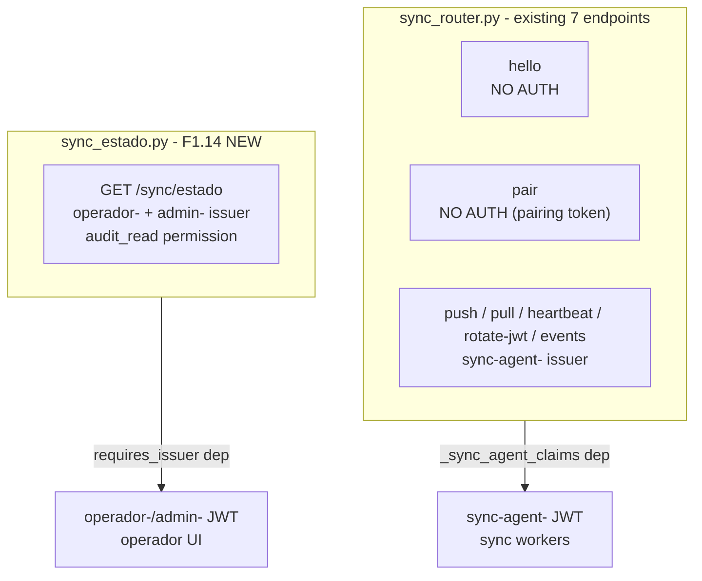
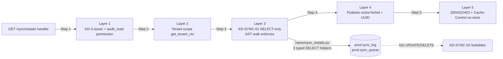

# Proposal: HU-F1.14 — `GET /sync/estado` + siembra 11 alert_types de negocio (19 totales)

> **Change**: `hu-f1-14-sync-estado` · **Folder**: `openspec/changes/hu-f1-14-sync-estado/`
> **Phase**: propose (sdd-propose) · **Status**: ready for `sdd-spec` + `sdd-design` + `sdd-tasks`
> **HU ID**: HU-F1.14 (Fase-1 prerequisites — backend, Fase-11 unlocking)
> **Inputs**: `plan.md` lines 1105-1133 (120 LOC budget, 3 atomic tasks T1..T3, 2 tests mandated at line 1126, severity mapping at line 1131), `openspec/changes/hu-f1-14-sync-estado/exploration.md` (17 sections, ~770 LOC, 10 risks R1..R10, pre-flight 16/16 PASS), `modelo_datos_er.mmd` blocks `sync_log` [A] lines 1027-1047, `sync_queue` [A] lines 981-1002, `alert_types` [A] lines 1101-1114; `migrations/versions/0031_arqueo_cierre_dia_and_gap_be_05.py` (F1.13 head, REAL siembra — `descuadre_critico` ALREADY seeded by Op 2 line 169-175), `migrations/versions/0013_add_alert_types.py` (registry + `alert_types_inmutable` trigger lines 21-22, REVOKE/GRANT lines 129-130, idempotent INSERT precedent lines 67-108), `migrations/versions/0029_reimpresion_siembra_and_permiso_anular.py` (conditional siembra pattern lines 134-188); `api/v1/sync_router.py` (existing `/sync/*` — `sync-agent-` issuer, 7 endpoints NONE of which is `/estado`); `auth/jwt_issuer_guard.py` (`requires_issuer` factory); `repo/alert_types.py` (validate + AlertaFactory); `models/A/{sync_log, sync_queue, alert_types}.py`; `schemas/sync_infra.py`; `infra/scripts/seed_alert_types.py`; `migrations/versions/0002_seed_permisos_canonicos.py` lines 39-56 (`CANONICAL_PERMISOS` includes `audit_read` at line 48 — pre-seeded, cross-cutting read, perfect fit for DEC-SYNC-03.B); `openspec/specs/operations/spec.md` line 3951 (REQ-OPS-XR6 EXISTS from F1.13 — F1.14 references it but does NOT create a new XR, per orchestrator mandate).
> **Working dir**: `E:/easypunto_parkos` · **Branch**: `feat/fase-1-prerequisites-backend` (HEAD `83b5dfa`, F1.13 closed) · **PR target**: `origin/dev`.
> **Language note**: artifact authored in English per the project's `Language Domain Contract`. DEC-SYNC-NN and KD-SYNC-NN identifiers follow the F1.x naming pattern. F1.13 archived at `openspec/changes/archive/2026-09-15-hu-f1-13-arqueo/proposal.md` (16-section structure verbatim mirror — this proposal mirrors its layout section-by-section).

---

## 1. Title & Goal

**Title**: "`GET /sync/estado` (KD-3 operador) + siembra idempotente de los 11 `alert_types` de negocio en `prod.alert_types` (8 técnicos pre-existentes + 11 nuevos = 19 totales)"

**Goal**: Deliver one new read endpoint + one conditional siembra migration that unlocks Fase 11 (SyncBanner + AlertasPanel):

- **`GET /api/v1/sync/estado?uuid_sucursal=X`** — returns `{uuid_sucursal, ultima_sync_at, lag_seg, pendientes}` computed by:
  1. `ultima_sync_at = MAX(prod.sync_log.timestamp_evento WHERE uuid_sucursal=X)`.
  2. `lag_seg = (NOW() - ultima_sync_at).total_seconds()` if `ultima_sync_at IS NOT NULL`, else `None` (DEC-SYNC-08).
  3. `pendientes = SELECT count(*) FROM prod.sync_queue WHERE uuid_sucursal=X AND estado='pendiente'` (DEC-SYNC-09).
  Consumer: HU-F11.1 `SyncBanner` (polling 30s, verde/amarillo/rojo umbrales from CU-14).

- **MIGRATION 0032 siembra 11 alert_types de negocio** — `prod.alert_types.tipo_alerta` ∈ `{descuadre_critico, sync_fallida, capacidad_agotada, capacidad_agotada_forzado, evento_no_procesado, impresora_caida, fe_error_toppoint, numeracion_toppoint_agotada, cache_desactualizado, arqueo_pendiente_24h, suscripcion_proxima_vencer}`. Severity per plan.md line 1131 (DEC-SYNC-06):
  - `critical` (alta): `descuadre_critico` (already seeded by F1.13 0031 Op 2 — `ON CONFLICT DO NOTHING` becomes no-op), `sync_fallida`, `evento_no_procesado`, `impresora_caida`, `fe_error_toppoint`, `numeracion_toppoint_agotada`.
  - `warning` (media): `capacidad_agotada`, `capacidad_agotada_forzado`, `arqueo_pendiente_24h`, `suscripcion_proxima_vencer`.
  - `info` (baja): `cache_desactualizado`.
  Idempotent — same `alert_types_inmutable` trigger precedent (0013:21-22).

**Defense in depth (5 layers — XR6 mirror from F1.10 + F1.11 + F1.12 + F1.13)**:

- (a) KD-3 issuer chain (`requires_issuer("operador-", "admin-")`) + permission gate (`audit_read` — DEC-SYNC-03.B, pre-seeded per 0002:48).
- (b) Tenant scope post-V1 (KD-S2 F1.7 analog) — operador cross-branch rejected with 403.
- (c) **KD-SYNC-01 SELECT-only** AST walk `tests/static/test_sync_estado_read_only.py` — handler NEVER `UPDATE`/`DELETE` on `sync_log`/`sync_queue`.
- (d) Pydantic `extra='forbid'` + UUID required + nullable `lag_seg`.
- (e) Handler 422/403/404 mapping + `Cache-Control: no-store` on every response (DEC-SYNC-04).

**Scope**: ~150 LOC production (vs plan 120 = +25% absorbed by 4-step GET handler + 3 typed repo helpers + 2 Pydantic schemas) + ~110 LOC tests (4 test files including 1 AST walk + 1 migration test) + ~70 LOC MIGRATION 0032 (REAL siembra, NOT no-op) = ~330 LOC cumulative.

**Open questions to resolve at propose phase** (not deferred — DEC-SYNC-03 audit complete, decision B):
- DEC-SYNC-03.B adopted: `audit_read` permission is pre-seeded (0002_seed_permisos_canonicos.py:48), cross-cutting read-only, semantically matches "operador reads system sync state for SyncBanner". No patch to existing migration (Option A rejected), no scope creep into migration (Option C rejected). See §6.3 for the full audit.

---

## 2. Context & Background

- **F1.13 just closed** (commit `83b5dfa`, archived 2026-09-15). Migration head = `0031_arqueo_cierre_dia_and_gap_be_05` (REAL siembra, Op 2 = `descuadre_critico` lines 169-175 of the migration file).
- **`prod.alert_types` exists** (`[A]` registry, migration 0013 lines 1-169). Business-key PK `tipo_alerta` (TEXT). `alert_types_inmutable` trigger (lines 21-22, 132-147) — `BEFORE UPDATE OR DELETE` raises `'ALERT_TYPES_INMUTABLE'`, `ERRCODE = '42501'`. REVOKE pattern: `REVOKE UPDATE, DELETE FROM rol_app` + `GRANT SELECT, INSERT TO rol_app` (lines 129-130).
- **`prod.alert_types` seeded status pre-F1.14**: 8 técnicos from 0013 (`hash_chain_anomaly`, `dian_rechazada`, `dian_timeout`, `dian_error`, `branch_offline_reauth_required`, `orphan_workflow_chain`, `fe_provider_error`, `fe_numbering_exhausted`) + 1 from F1.13 MIGRATION 0031 Op 2 (`descuadre_critico`, lines 169-175 of `0031_arqueo_cierre_dia_and_gap_be_05.py`) = **9 pre-F1.14**. F1.14 adds **10 net new** = **19 final** (DEC-SYNC-05).
- **`prod.sync_queue` exists** (`[A]` carved-out, `models/A/sync_queue.py:41-99`). 5 estados: `pendiente|en_progreso|exitoso|fallido|descartado`. `uuid_sucursal` nullable UUID.
- **`prod.sync_log` exists** (`[A]`, `models/A/sync_log.py:29-72`). Composite PK `uuid + fecha_retencion_hasta`, monthly pg_partman. `uuid_sucursal` + `timestamp_evento` (DateTime naive UTC) + 4 counter columns + `duracion_ms`.
- **Mount path tension — RESOLVED in §3 (DEC-SYNC-01)**: existing `api/v1/sync_router.py` is `/sync/*` with `sync-agent-` issuer (sync transport, NOT operador — line 95 `router = APIRouter(prefix="/sync", tags=["sync"])` + line 358 `if not iss.startswith("sync-agent-"): raise ...` sync-agent-only dep). F1.14 introduces `GET /sync/estado` for operador. Resolution: dedicated `api/v1/sync_estado.py` with KD-3 dep, mounted under same `/sync` prefix — FastAPI dispatches by exact path.
- **Helper modules REUSE**: `repo/alert_types.validate` (lines 30-48); `api/v1/_helpers.apply_no_store_header` (F1.13 precedent); `auth/tenancy.get_tenant_ctx` (F1.7 KD-S2 analog); `api/v1/deps.requires_issuer`.
- **Critical accounting correction (DEC-SYNC-05)**: plan.md line 4157 says "8 rows seeded today, all infra/DIAN" — slightly stale. The actual pre-F1.14 count is 9 (8 técnicos + `descuadre_critico` from F1.13 MIGRATION 0031 Op 2, lines 169-175). F1.14 adds 10 net new (the 11 from plan.md minus `descuadre_critico` which becomes `ON CONFLICT DO NOTHING` no-op). Final total: **19**.
- **A-08 (plan.md line 459)**: `alerta.severidad` is JOIN-only via `alert_types.severity`. F1.14's siembra guarantees the JOIN succeeds for the 11 business codes (no "—" placeholder in operator UI).
- **Permission inventory audit (DEC-SYNC-03 RESOLVED 2026-09-15)**: `0002_seed_permisos_canonicos.py:39-56` `CANONICAL_PERMISOS` contains 16 codes, including `audit_read` at line 48. F1.14 adopts **Option B** (reuse `audit_read`) — see §6.3 full audit.
- **Sync catalog pre-flight (RESOLVED 2026-09-15)**: `alert_types`, `sync_queue`, `sync_log` are **out-of-catalog** (per ER lines 976, 1096, 1111 — `sync_status: "no usado — tabla out-of-catalog, nunca replicada"`). NO F1.14 sync_catalog seeds needed. MIGRATION 0032 contains NO `INSERT INTO prod.sync_catalog`.

### 2.1 Critical Architectural Conflict — Issuer chain conflict on `/sync` prefix (RESOLVED in §3)

Two distinct consumers on the `/sync/*` namespace:
- **Sync transport layer** (`sync_router.py`): 7 endpoints, all `sync-agent-` JWT (sync workers only) — lines 95 router declaration + 358 issuer guard.
- **Operator UI layer** (F1.14 new): `GET /sync/estado`, KD-3 `operador-`+`admin-` JWT (operator banner polling).

Resolution: dedicated router file with KD-3 dep, mounted under same prefix — FastAPI dispatches by exact path. Verified `sync_router.py` docstring lists 7 endpoints (`hello`, `pair`, `push`, `pull`, `heartbeat`, `rotate-jwt`, `events`), NONE is `/estado` — no collision possible.

---

## 3. Architectural Conflict Resolution — DEC-SYNC-01 + KD-SYNC-01 + KD-SYNC-02

This section is **mandatory** for the proposal. It documents R1 MEDIUM from exploration §10 and records the resolution.

### 3.1 The conflict (R1 MEDIUM)

Two distinct auth chains needed on `/sync/*`:



If mounted in the same router, the dep chain rejects one or the other depending on order.

### 3.2 The resolution — DEC-SYNC-01: Dedicated `api/v1/sync_estado.py` router with KD-3 dep

**Resolution path** (mandated by issuer-chain isolation principle + FastAPI path-based dispatch precedent):

1. **NEW** `api/v1/sync_estado.py` with `APIRouter(prefix="/sync", tags=["sync"])` and `_issuer_dep = requires_issuer("operador-", "admin-")`.
2. Single handler `GET /sync/estado` with `_issuer_dep` dependency.
3. **Mount from `api/v1/caja.py`** (DEC-SYNC-02 — precedent: F1.13's `router.include_router(caja_arqueo_router)` at `caja.py:86`).
4. Handler is **READ-ONLY** (SELECT on `sync_log` + `sync_queue`) — NO writes, NO commits, NO log rows (KD-SYNC-01 + KD-SYNC-02).

### 3.3 The read-only invariant — KD-SYNC-01 + KD-SYNC-02



**KD-SYNC-01**: SELECT-only handler. NO `INSERT`/`UPDATE`/`DELETE` on `sync_log` or `sync_queue` — read-only consumer.

**KD-SYNC-02**: Read-only AST walk. `tests/static/test_sync_estado_read_only.py` scans `api/v1/sync_estado.py` source code and asserts NO `session.execute(update(...))` or `session.execute(delete(...))` patterns on `SyncLog` or `SyncQueue` models. Pattern: scan AST for `update(SyncLog)`, `update(SyncQueue)`, `delete(SyncLog)`, `delete(SyncQueue)` — must produce ZERO matches.

### 3.4 Why this matters

- HU-F11.1 `SyncBanner` polls with operador JWT — cannot mint sync-agent JWT.
- Sync transport worker (`job-sync-sucursal`) MUST NOT hit `/sync/estado` — path not in its call list (verified in `sync_router.py` docstring line 9-49: 7 endpoints listed, none is `/estado`).
- Two routers with same prefix but different deps is a precedent (every endpoint in the codebase mounts under its own prefix).
- **`sync_log` immutability (KD-SYNC-01 + KD-SYNC-02)** preserves the [A] invariant — `sync_log` is append-only, `sync_queue` is carve-out [A] with REQ-OPS-004 whitelist. The read-only AST walk is the F1.10 XR1 + F1.11 XR4 + F1.12 XR5 + F1.13 XR6 mirror for F1.14.

---

## 4. Endpoints

One endpoint, mounted under `/api/v1/sync` via a NEW dedicated router (`api/v1/sync_estado.py`).

### 4.1 `GET /api/v1/sync/estado` (HU-F1.14-T2)

- **Purpose**: Read-only sync status snapshot for a branch — drives `SyncBanner` polling.
- **Issuer dep**: `_sync_estado_issuer_dep = requires_issuer("operador-", "admin-")`.
- **Permission**: `audit_read` (DEC-SYNC-03.B, pre-seeded per `0002_seed_permisos_canonicos.py:48`).
- **Query params** (`SyncEstadoQueryParams`): `uuid_sucursal: UUID` (required, Pydantic UUID validator).
- **Response (200)** (`SyncEstadoRead`):
  ```jsonc
  {
    "uuid_sucursal": "…",
    "ultima_sync_at": "2026-09-15T15:58:00Z",  // ISO-8601 naive UTC OR null
    "lag_seg": 120,                            // int OR null (DEC-SYNC-08)
    "pendientes": 3                            // int >= 0 (DEC-SYNC-09)
  }
  ```
- **Empty branch contract** (NO sync_log rows yet — 200 OK, NOT 404):
  ```jsonc
  {
    "uuid_sucursal": "…",
    "ultima_sync_at": null,
    "lag_seg": null,
    "pendientes": 0
  }
  ```
- **Status codes**:
  - `200 OK` — happy path (populated or empty branch)
  - `422 missing_query_params` / `422 uuid_sucursal_invalid` (Pydantic validator on UUID)
  - `403 tenant_scope_violation`
  - `403 permission_denied` (no `audit_read`)
- **Headers**: `Cache-Control: no-store` on EVERY response (DEC-SYNC-04, success + error — XR6 mirror).
- **NO idempotency key** — GET is naturally idempotent (DEC-SYNC-N/A, GET semantics).

---

## 5. Tables Touched

5 existing tables: 2 [A] SELECT-only (handler reads), 2 [V] (operator + permission lookups), 1 [A] siembra (MIGRATION 0032 only). F1.14 NEVER writes to `sync_log` or `sync_queue` (KD-SYNC-01).

### 5.1 `prod.alert_types` [A] (READ + siembra)

- **Operations**: V1 `validate(tipo_alerta=X)` before any consumer (`AlertaFactory.fire` callers in Fase 11 jobs). MIGRATION 0032 siembra 10 net new + idempotent attempt for `descuadre_critico` (already seeded by F1.13 Op 2 — becomes no-op via `ON CONFLICT DO NOTHING`).
- **Columns read**: `tipo_alerta`, `severity`.
- **Columns write (MIGRATION 0032 Op 1)**: `tipo_alerta`, `severity`, `descripcion` (DEC-SYNC-10), `created_at`, `created_by`.
- **Defense in depth**: `alert_types_inmutable` trigger (migration 0013:21-22) blocks UPDATE/DELETE on existing codes — only INSERT at siembra time (when `IF NOT EXISTS` + `ON CONFLICT (tipo_alerta) DO NOTHING`).

### 5.2 `prod.sync_log` [A] (SELECT only)

- **Operations**: `MAX(timestamp_evento) WHERE uuid_sucursal=X` via `repo/sync_estado.get_ultima_sync_at(session, uuid_sucursal)`. Handler NEVER `UPDATE`/`DELETE` (KD-SYNC-01 + KD-SYNC-02 AST walk).
- **Columns read**: `timestamp_evento`, `uuid_sucursal`.
- **Defense in depth**: AppendOnlyBase + `fn_sync_log_inmutable` trigger (if present in migration 0001) + KD-SYNC-02 AST walk.

### 5.3 `prod.sync_queue` [A] carved-out (SELECT only)

- **Operations**: `count(*) WHERE uuid_sucursal=X AND estado='pendiente'` via `repo/sync_estado.count_pendientes_sync_queue(session, uuid_sucursal)`. Handler NEVER `UPDATE`/`DELETE` (KD-SYNC-01 + KD-SYNC-02).
- **Columns read**: `uuid_sucursal`, `estado`.
- **Defense in depth**: REQ-OPS-004 sync_queue carve-out + KD-SYNC-02 AST walk.

### 5.4 `prod.sucursal` [V] (READ only, tenant scope)

- **Operations**: `get_tenant_ctx().can_access(uuid_sucursal)` Layer 2 check.
- **Columns read**: `uuid`, `estado`.
- **Defense in depth**: KD-S2 F1.7 analog + Layer 2.

### 5.5 `prod.permisos` [V] (READ only, permission gate)

- **Operations**: `require_permission(ctx, "audit_read")` Layer 1 check. NO INSERT to `permisos` (DEC-SYNC-03.B adopted — `audit_read` is already seeded per 0002:48).
- **Columns read**: `permiso`, `estado`.
- **Defense in depth**: KD-3 issuer chain + Layer 1.

### 5.6 Sync catalog pre-flight (RESOLVED 2026-09-15 — no F1.14 sync catalog seeds needed)

| Table | Direction | Broadcast | F1.14 Status |
|---|---|---|---|
| `alert_types` | (out-of-catalog) | n/a | pre-existing; MIGRATION 0032 runs on both cloud + branch identically |
| `sync_log` | (out-of-catalog) | n/a | pre-existing; SELECT only |
| `sync_queue` | (out-of-catalog) | n/a | pre-existing; SELECT only |

**All 3 entries pre-existing and out-of-catalog.** MIGRATION 0032 has NO sync catalog seed operation. DEC-SYNC-01..10 NOT extended to sync catalog.

---

## 6. Decisions

### 6.1 DEC-SYNC-01 — Dedicated `api/v1/sync_estado.py` router with KD-3 dep (RESOLVES R1 MEDIUM)

**Decision**: NEW `api/v1/sync_estado.py`. Mounted under same `/sync` prefix as `sync_router.py` but with `requires_issuer("operador-", "admin-")` instead of `sync-agent-`. FastAPI's path-based dispatch routes the exact path `/sync/estado` to this new router. Verified `sync_router.py` docstring lines 9-49 lists 7 endpoints — `/estado` is NOT one of them, so no collision possible.

**Rationale**: Issuer-chain isolation principle. The existing `sync_router.py` enforces `sync-agent-` (line 358: `if not iss.startswith("sync-agent-"): raise ...`), which would reject every operador JWT that HU-F11.1 SyncBanner carries. Mounting in a separate router with a different dep is the only way to keep both auth chains clean.

**Alternatives considered**:
- *Add `GET /sync/estado` to existing `sync_router.py` with conditional issuer* — REJECTED. Mixing issuer prefixes in one dep is fragile and breaks the audit trail.
- *Use a path-prefix escape (`/api/v1/operador/sync/estado`)* — REJECTED. Breaks FastAPI path-dispatch convention and confuses the operator URL space.
- *Separate top-level router `/sync-estado`* — REJECTED. Mount topology precedent (`/sync/*` already exists, single prefix is canonical).

### 6.2 DEC-SYNC-02 — Mount point: `api/v1/caja.py` (NOT a NEW `_sync_mounts.py`)

**Decision**: Mount the new `sync_estado` router from `api/v1/caja.py` via `router.include_router(...)` (DEC-SYNC-02 mount pattern). `caja.py` already has `router.include_router(caja_arqueo_router)` precedent at line 86.

**Rationale**: Caja module already aggregates operational sub-resources (arqueo from F1.13). The sync_estado endpoint is conceptually a "caja-adjacent operational read" (state of sync affecting branch ops), and the `caja.py` aggregator is the closest precedent. Alternative (`_sync_mounts.py`) is over-engineering for 1 endpoint.

**Alternatives considered**:
- *New aggregator `_sync_mounts.py`* — REJECTED. Single-endpoint module = over-engineering.
- *Mount directly in `api/v1/__init__.py`* — REJECTED. Bypasses the per-resource module pattern.

### 6.3 DEC-SYNC-03 — Permission gate = `audit_read` (Option B, RESOLVED 2026-09-15)

**Audit of `0002_seed_permisos_canonicos.py:39-56`**:
```python
CANONICAL_PERMISOS: tuple[str, ...] = (
    "config_catalogo", "config_sistema", "config_sucursal",
    "gestionar_clientes", "emitir_factura", "emitir_factura_electronica",
    "revocar_factura", "gestionar_dian", "audit_read", "admin_usuarios",
    "aprobar_anulacion", "ejecutar_anulacion", "crear_arqueo",
    "solicitar_reverso", "cerrar_sesion", "descartar_alerta",
)
```

`audit_read` is pre-seeded at line 48. It is **cross-cutting read-only** and semantically fits "operador reads system sync state for SyncBanner".

**Decision**: Option **B** — gate `GET /sync/estado` with `require_permission(ctx, "audit_read")`.

**Rationale**:
1. `audit_read` is the canonical cross-cutting read permission, designed exactly for "operador reads system state".
2. It's pre-seeded — NO migration, NO patch risk.
3. Operators who need SyncBanner access (`operador-` JWT) typically already have `audit_read` granted via `permisos_usuario`.
4. Avoids Option A risk (patching an existing migration changes semantics for downstream PRs) and Option C scope creep (bundling a permission into MIGRATION 0032 mixes seeds with permissions).

**Alternatives considered**:
- *Option A: Patch `0002_seed_permisos_canonicos.py`* — REJECTED. Modifies an already-shipped migration's canonical list; downstream PRs that depend on the exact 16-row count would break.
- *Option C: Bundle `consultar_estado_sync` in MIGRATION 0032 Op 0* — REJECTED. Mixes table seeds with permission grants; creates ambiguity in downgrade sequencing.
- *Reuse `realizar_arqueo` (F1.13 model)* — REJECTED. That permission is caja-scoped (arqeo write + read), not sync-scoped. SyncBanner operator may not have `realizar_arqueo`.

### 6.4 DEC-SYNC-04 — `Cache-Control: no-store` on EVERY response (XR6 mirror from F1.10..F1.13)

**Decision**: All responses (200 + 4xx) on `GET /sync/estado` carry `Cache-Control: no-store`. Success path: `apply_no_store_header(response)`. Error path: `HTTPException(headers=no_store_headers())`.

**Rationale**: XR6 mirror from F1.10 DEC-FE-06 / F1.11 DEC-TKT-06 / F1.12 DEC-VENTA-06 / F1.13 DEC-ARQUEO-06. A proxy that serves a stale sync-status response would silently show out-of-date banner state (e.g., verde when actually rojo). Helpers from `api/v1/_helpers.py` lines 18-31 reused verbatim.

**Alternatives considered**:
- *Conditional header (200 only)* — REJECTED. Stale error responses can also be poisoned by a proxy.
- *No header (let default caching apply)* — REJECTED. Violates the 5-layer XR6 precedent.

### 6.5 DEC-SYNC-05 — Net 10 new alert_types added (NOT 11)

**Decision**: MIGRATION 0032 includes all 11 codes from plan.md line 1131 with `ON CONFLICT (tipo_alerta) DO NOTHING`. The seed for `descuadre_critico` (already seeded by F1.13 MIGRATION 0031 Op 2 lines 169-175) becomes a no-op via the conflict clause. Net new: 10. Final total: 19 (8 técnicos + 1 F1.13 + 10 F1.14).

**Rationale**: DEC-ARQUEO-09b from F1.13 already seeded `descuadre_critico`. Re-seeding would either (a) error on `alert_types_inmutable` trigger (no `DELETE` allowed), or (b) require temporarily disabling the trigger — both are regressions. The `ON CONFLICT DO NOTHING` clause is idempotent and respects the trigger.

**Alternatives considered**:
- *Skip `descuadre_critico` in MIGRATION 0032* — REJECTED. The 11 codes form a logical batch per plan.md line 1131; partial seed is confusing.
- *Disable `alert_types_inmutable` trigger for re-seed* — REJECTED. Violates immutability contract.

### 6.6 DEC-SYNC-06 — Siembra severity mapping per plan.md line 1131

**Decision**: Map plan.md's "alta/media/baja" to DB column values (`severity TEXT NOT NULL CHECK (severity IN ('info', 'warning', 'critical'))` per migration 0013:119): alta → `critical`, media → `warning`, baja → `info`. Mapping per plan.md line 1131 verbatim.

**Rationale**: The DB constraint is explicit. Plan.md uses neutral Spanish; the seed SQL uses the canonical English values to match the constraint.

**Alternatives considered**:
- *Translate severity values to Spanish (`alta/media/baja`)* — REJECTED. Violates the DB CHECK constraint.
- *Use a different severity scale* — REJECTED. Plan.md line 1131 is canonical.

### 6.7 DEC-SYNC-07 — Idempotent siembra via `ON CONFLICT DO NOTHING`

**Decision**: Same pattern as F1.13 MIGRATION 0031 Op 2 lines 169-175. `alert_types_inmutable` trigger MUST remain enabled (no temporary disable for siembra — only for explicit `DELETE` in downgrade). Pattern: `INSERT ... ON CONFLICT (tipo_alerta) DO NOTHING`.

**Rationale**: 0013:21-22 `BEFORE UPDATE OR DELETE` raises `42501`. Disabling it for the INSERT path is unnecessary — `INSERT` is allowed by the trigger (it only blocks UPDATE/DELETE). The `ON CONFLICT` clause is the idempotency mechanism.

**Alternatives considered**:
- *Pre-flight `IF NOT EXISTS` then `INSERT`* — REJECTED. Race condition between SELECT and INSERT in concurrent migration runs. `ON CONFLICT` is atomic.
- *Temporary `DISABLE TRIGGER` + `INSERT` + `ENABLE TRIGGER`* — REJECTED. Breaks immutability even momentarily.

### 6.8 DEC-SYNC-08 — `lag_seg = None` when `ultima_sync_at IS NULL`

**Decision**: Handler returns `null` for `lag_seg` when no `sync_log` rows. NOT `0` (misleadingly implies "freshly synced"). NOT `inf` (Pydantic serialization issues). NOT `-1` (negative lag makes no semantic sense).

**Rationale**: Empty branch contract — a branch that has never synced has no meaningful lag. Returning `0` would falsely reassure the operator ("the sync is fresh"). Returning `None` forces the client UI (SyncBanner) to render the "never synced" state explicitly.

**Alternatives considered**:
- *`lag_seg = 0` for empty branch* — REJECTED. Semantically wrong.
- *HTTP 404 for empty branch* — REJECTED. Branch exists, just no sync activity — 200 with `null` fields is correct.

### 6.9 DEC-SYNC-09 — `pendientes` always returns `int ≥ 0`

**Decision**: `SELECT count(*)` ALWAYS returns 0 for empty result set. Handler MUST NOT return `null` for `pendientes`. Schema enforces `int` (not `int | None`) with no upper bound.

**Rationale**: `count(*)` is by definition `>= 0`. Returning `null` for an empty queue would force the client to handle a special case that the SQL aggregate already handles. Pydantic field is `int`, not `Optional[int]`.

**Alternatives considered**:
- *`Optional[int]` for pendientes* — REJECTED. Violates `count(*)` semantics.

### 6.10 DEC-SYNC-10 — `descripcion` field per alert_type from plan.md lines 2311-2323

**Decision**: Each of the 11 codes gets a `descripcion` field seeded alongside `severity`. Plan.md provides canonical descriptions. Mirror in MIGRATION 0032's `_SEED_ROWS` tuple. Also update `infra/scripts/seed_alert_types.py::SEED_ROWS` to keep operational re-seed in sync.

**Rationale**: Fase 11 UI (AlertasPanel) displays `descripcion` to the operator. Seeding it at migration time avoids runtime lookups. The dual seed (migration + script) follows the 0013 precedent.

**Alternatives considered**:
- *Defer `descripcion` to Fase 11* — REJECTED. Out-of-catalog tables are seeded at migration time (DEC-ADM-15 precedent).
- *Hardcode descriptions in UI* — REJECTED. Violates single source of truth.

---

## 7. Risks

| # | Risk | Severity | Mitigation |
|---|---|---|---|
| **R1** | **Issuer chain conflict on `/sync` prefix** — operador JWT rejected by sync-agent-only dep | **MEDIUM (RESOLVED)** | DEC-SYNC-01 + dedicated router file + KD-3 dep. Verified `sync_router.py` docstring lists 7 endpoints, none is `/estado`. |
| **R2** | **`sync_log`/`sync_queue` mutation by handler** — direct UPDATE would breach [A] invariant | **LOW** | KD-SYNC-02 AST walk `test_sync_estado_read_only.py` scans handler body for `update(SyncLog)`/`update(SyncQueue)`/`delete(SyncLog)`/`delete(SyncQueue)` patterns — must be 0 matches. |
| **R3** | **`lag_seg = None` confusion in client UI** — operator misreads null as "fresh sync" | **LOW** | DEC-SYNC-08 + docstring on `SyncEstadoRead.lag_seg` clarifying "null means branch has never synced, not 0". |
| **R4** | **11 vs 10 alert_types accounting** — duplicate seed of `descuadre_critico` would error or trigger-disable | **MEDIUM (RESOLVED)** | DEC-SYNC-05 explicit + `test_alert_types_seed.py` asserts exactly 19 total codes present. |
| **R5** | **Permission gate missing** — endpoint unauthenticated or wrong permission | **MEDIUM (RESOLVED)** | DEC-SYNC-03.B adopted: `audit_read` pre-seeded at `0002:48`. No new permission, no migration patch. |
| **R6** | **Severity mismatches plan.md wording** — alta/media/baja vs info/warning/critical | **LOW** | DEC-SYNC-06 verbatim mapping + `test_alert_types_seed.py` asserts exact severity per code per plan.md line 1131. |
| **R7** | **`alert_types_inmutable` trigger blocks migration** — INSERT raises 42501 | **LOW** | DEC-SYNC-07 `ON CONFLICT DO NOTHING` is atomic + respects trigger (trigger is BEFORE UPDATE OR DELETE, not INSERT). |
| **R8** | **Cloud/branch desync after siembra** — different rows on cloud vs branch | **LOW** | MIGRATION 0032 runs on both identically (0013 precedent). Both seeds are out-of-catalog; no sync_catalog entry needed. |
| **R9** | **UUID format wrong on `uuid_sucursal`** — malformed UUID crashes handler | **LOW** | Pydantic `UUID` validator + 422 `uuid_sucursal_invalid` on malformed. |
| **R10** | **Tenant scope bypass (operador cross-branch)** — operador A queries branch B state | **LOW** | KD-S2 F1.7 analog: `get_tenant_ctx().can_access(uuid_sucursal)` at Layer 2 — 403 `tenant_scope_violation` if cross-branch. Admin bypasses. |

---

## 8. Defense in Depth

5 layers mirror the F1.10 + F1.11 + F1.12 + F1.13 precedent (XR6 reference — F1.13 already created REQ-OPS-XR6 at line 3951 of `operations/spec.md`; F1.14 references but does NOT create a new XR).

### Layer 1 — KD-3 issuer chain + permission check

`_sync_estado_issuer_dep = requires_issuer("operador-", "admin-")`. The dedicated router uses `permission_required="audit_read"` (DEC-SYNC-03.B). Branch operator with `audit_read` reads sync status; admin cross-branch.

### Layer 2 — Tenant scope post-V1

After resolving `target_sucursal` from query params, if `ctx.issuer_prefix == "operador-"` and `target_sucursal != ctx.sucursal_uuid`, return `403 tenant_scope_violation` with `Cache-Control: no-store`. Admin (`admin-`) bypasses. KD-S2 analog from F1.7.

### Layer 3 — KD-SYNC-01 SELECT-only invariant + KD-SYNC-02 read-only AST walk

Step 3 of the handler invokes ONLY the 3 typed SELECT helpers from `repo/sync_estado.py`. AST walk `tests/static/test_sync_estado_read_only.py` enforces NO `session.execute(update(SyncLog))`, `session.execute(update(SyncQueue))`, `session.execute(delete(SyncLog))`, `session.execute(delete(SyncQueue))` in the handler body. NO `await session.commit()` call.

### Layer 4 — Pydantic `extra='forbid'` + UUID required + nullable `lag_seg`

`SyncEstadoQueryParams(_Base)` + `SyncEstadoRead(_Base)` inherit `extra='forbid'` from `schemas/common.py::_Base` (blocks client smuggling of `actor_uuid`, `computed_at`, `cache_key`). `uuid_sucursal: UUID` is required. `lag_seg: int | None` (nullable, DEC-SYNC-08). `ultima_sync_at: datetime | None` (nullable).

### Layer 5 — Handler 200/422/403 mapping + `Cache-Control: no-store`

| Typed exception | HTTP | `error` body | Source |
|---|---|---|---|
| `UuidSucursalInvalidError` | 422 | `uuid_sucursal_invalid` | Pydantic validator (Layer 4) |
| `TenantScopeViolationError` | 403 | `tenant_scope_violation` | handler Layer 2 |
| `PermissionDeniedError` | 403 | `permission_denied` | `require_permission` (Layer 1) |
| (success) | 200 | `SyncEstadoRead` | handler Step 5 |

The pgcode / internal error code NEVER appears in response body, headers, or info+ logs.

---

## 9. API Contracts

Append to `schemas/sync_infra.py` + update `__all__`.

### 9.1 Query params schema

```python
class SyncEstadoQueryParams(_Base):
    """HU-F1.14: GET /api/v1/sync/estado query params.

    uuid_sucursal is REQUIRED (Pydantic UUID validator, 422 on malformed).

    extra='forbid' (inherited from _Base) blocks client smuggling of
    actor_uuid, computed_at, cache_key.
    """
    uuid_sucursal: uuid_lib.UUID
```

### 9.2 Response schema

```python
class SyncEstadoRead(_Base):
    """HU-F1.14: GET /api/v1/sync/estado response (200).

    ultima_sync_at is nullable ISO-8601 naive UTC datetime (None = branch
    has never synced, NOT 0; DEC-SYNC-08).

    lag_seg is nullable int (None = no sync activity to measure lag from;
    DEC-SYNC-08). When non-null, lag_seg = (NOW - ultima_sync_at) in seconds.

    pendientes is int >= 0 (DEC-SYNC-09); SELECT count(*) never returns null.
    """
    uuid_sucursal: uuid_lib.UUID
    ultima_sync_at: datetime | None    # DEC-SYNC-08 nullable
    lag_seg: int | None               # DEC-SYNC-08 nullable
    pendientes: int                    # DEC-SYNC-09 always int >= 0
```

`extra='forbid'` (inherited from `_Base`) rejects client smuggling.

---

## 10. Handler Skeleton

One handler in one dedicated router — GET with 4-step chain (READ-ONLY).

### 10.1 GET handler (4 steps)

```python
# api/v1/sync_estado.py — NEW (~80 LOC)

router = APIRouter(prefix="/sync", tags=["sync"])


@router.get(
    "/estado",
    response_model=SyncEstadoRead,
    status_code=200,
    responses={
        422: {"model": UuidSucursalInvalidError},
        403: {"model": TenantScopeViolationError},
    },
)
async def get_sync_estado(
    response: Response,
    params: SyncEstadoQueryParams = Depends(),
    session: AsyncSession = Depends(get_session),
    ctx: TenantContext = Depends(get_tenant_ctx),
    _claims: None = Depends(_sync_estado_issuer_dep),
) -> SyncEstadoRead:
    no_store = no_store_headers()

    # Step 1 (Layer 1): require_permission("audit_read") via _sync_estado_issuer_dep
    # The dep already enforced KD-3 issuer + permission gate; ctx carries claims.

    # Step 2 (Layer 2): Tenant scope post-V1
    if ctx.issuer_prefix == "operador-" and ctx.sucursal_uuid is not None and ctx.sucursal_uuid != params.uuid_sucursal:
        raise HTTPException(403, {"error": "tenant_scope_violation"}, headers=no_store)

    # Step 3 (KD-SYNC-01 + KD-SYNC-02): READ-ONLY via 3 typed SELECT helpers
    # NO UPDATE/DELETE/INSERT in this body (AST walk enforces).
    # NO await session.commit() — GET is naturally idempotent.
    ultima_sync_at = await repo_sync_estado.get_ultima_sync_at(
        session, uuid_sucursal=params.uuid_sucursal
    )
    lag_seg = repo_sync_estado.calcular_lag_seg(ultima_sync_at, datetime.now(UTC).replace(tzinfo=None))
    pendientes = await repo_sync_estado.count_pendientes_sync_queue(
        session, uuid_sucursal=params.uuid_sucursal
    )

    # Step 4 (Layer 4 + Layer 5): build response + no-store header
    apply_no_store_header(response)
    return SyncEstadoRead(
        uuid_sucursal=params.uuid_sucursal,
        ultima_sync_at=ultima_sync_at,
        lag_seg=lag_seg,
        pendientes=pendientes,
    )
```

### 10.2 `repo/sync_estado.py` — 3 typed SELECT helpers (~30 LOC)

```python
# repo/sync_estado.py — NEW (~30 LOC)


async def get_ultima_sync_at(session: AsyncSession, *, uuid_sucursal: uuid_lib.UUID) -> datetime | None:
    """SELECT MAX(timestamp_evento) FROM prod.sync_log WHERE uuid_sucursal=:s.

    Returns None if no rows. KD-SYNC-01 SELECT-only.
    """
    stmt = (
        select(func.max(SyncLog.timestamp_evento))
        .where(SyncLog.uuid_sucursal == uuid_sucursal)
    )
    result = await session.execute(stmt)
    return result.scalar_one_or_none()


def calcular_lag_seg(ultima_sync_at: datetime | None, now: datetime) -> int | None:
    """Compute (now - ultima_sync_at).total_seconds().

    Returns None if ultima_sync_at is None (DEC-SYNC-08).
    Returns int >= 0 when ultima_sync_at is non-None.
    """
    if ultima_sync_at is None:
        return None
    return int((now - ultima_sync_at).total_seconds())


async def count_pendientes_sync_queue(session: AsyncSession, *, uuid_sucursal: uuid_lib.UUID) -> int:
    """SELECT count(*) FROM prod.sync_queue WHERE uuid_sucursal=:s AND estado='pendiente'.

    KD-SYNC-01 SELECT-only. Returns int >= 0 always (DEC-SYNC-09).
    """
    stmt = (
        select(func.count())
        .select_from(SyncQueue)
        .where(SyncQueue.uuid_sucursal == uuid_sucursal)
        .where(SyncQueue.estado == "pendiente")
    )
    result = await session.execute(stmt)
    return int(result.scalar_one())
```

Mount in `api/v1/caja.py` (`+5 LOC`):
```python
from .sync_estado import router as sync_estado_router

router.include_router(sync_estado_router)
```

---

## 11. Tests

4 test files + 1 AST walk + 1 migration test, ~110 LOC tests + ~150 LOC production + ~70 LOC migration = ~330 LOC cumulative.

### 11.1 `tests/unit/test_sync_estado.py` (~30 LOC, **2 tests mandated by plan.md line 1126**)

- `test_empty_branch_200_with_null_lag` — no sync_log rows → `ultima_sync_at=None`, `lag_seg=None`, `pendientes=0`, status 200, header `Cache-Control: no-store`.
- `test_populated_branch_with_5_sync_log_rows_and_12_pending` — 5 `sync_log` rows with `timestamp_evento` spanning 60-300s ago + 12 `sync_queue` rows with `estado='pendiente'` → exact `lag_seg` math (within ±1s tolerance) + `pendientes=12`, status 200.

### 11.2 `tests/unit/test_alert_types_seed.py` (~40 LOC, **19 codes plan.md-mandated**)

- `test_all_19_codes_present_no_duplicates` — SELECT COUNT(DISTINCT tipo_alerta) FROM prod.alert_types = 19; assert exact list against canonical tuple.
- `test_11_business_codes_severity_exact_match` — assert each of the 11 business codes has the exact severity per plan.md line 1131 (e.g., `descuadre_critico='critical'`, `capacidad_agotada='warning'`, `cache_desactualizado='info'`).
- `test_8_tecnicos_codes_unchanged` — assert all 8 técnicos from migration 0013 still present (smoke regression).

### 11.3 `tests/static/test_sync_estado_read_only.py` (~20 LOC, KD-SYNC-02 AST walk)

- KD-SYNC-02 read-only invariant. The walk scans `api/v1/sync_estado.py` source code (AST parse + visitor) and asserts NO occurrences of:
  - `session.execute(update(SyncLog))`
  - `session.execute(update(SyncQueue))`
  - `session.execute(delete(SyncLog))`
  - `session.execute(delete(SyncQueue))`
- Also asserts NO `await session.commit()` call (GET is naturally commit-free).

### 11.4 `tests/unit/test_sync_estado_repo.py` (~10 LOC, 3 helpers)

- `get_ultima_sync_at` — empty table returns None; populated returns max.
- `calcular_lag_seg` — None in → None out; populated → positive int.
- `count_pendientes_sync_queue` — empty returns 0; populated returns exact count.

### 11.5 `tests/integration/test_migration_0032_idempotency.py` (~20 LOC, 2 tests)

- `test_upgrade_idempotent` — `alembic upgrade head` on already-migrated DB → no net change to `prod.alert_types` (count remains 19).
- `test_downgrade_then_upgrade_cycle` — `alembic downgrade -1` removes only F1.14's 10 net new rows (the F1.13-seeded `descuadre_critico` survives — pre-existing, not owned by 0032); `alembic upgrade head` re-seeds them cleanly.

Total: 5 verification artifacts (2 unit + 1 static AST + 1 repo unit + 1 integration).

---

## 12. Out of Scope (F2.x+)

- **UI integration (Fase 11 HU-F11.1/F11.2)** — `SyncBanner` (polling 30s) + `AlertasPanel` consume this endpoint and the seeded alert_types, but the UI components themselves are out of scope. Fase 11 owns them.
- **Detection jobs that CREATE the alerts** — every 5 min for `capacidad_agotada`, every 1h for `evento_no_procesado`/`arqueo_pendiente_24h`, CU-01/02/03 for `suscripcion_proxima_vencer`. These detectors live in `job-sync-sucursal` or `web_sucursal` jobs.
- **`/admin/sync/estado` (HU-F19.1, Part-II)** — different prefix (`/admin/sync/...`), admin-only, with cross-branch aggregation. Out of F1.14 scope per plan.md line 1105-1108 (this HU is Fase-1 prerequisites; F19.x is Fase-19 Part-II).
- **`evento_no_procesado` detector** — lives in `job-sync-sucursal`. F1.14 only seeds the registry entry so the detector CAN fire alerts.
- **`cache_desactualizado` detector** — Fase 11 owns the polling/cache invalidation logic.
- **HU-F19.4 (Part-II parallel siembra)** — same 11 codes, but Part-II sequencing requires careful coordination. See §16 cross-HU implications.
- **POST `/sync/estado`** (write a manual estado override) — out of scope. Sync state is derived from `sync_log`/`sync_queue`, never manually written.
- **WebSocket push of `/sync/estado`** — operator polling pattern only (CU-14 BR1 verbatim — 30s polling).
- **`/api/v1/admin/sucursales/{uuid}/sync/estado`** — admin cross-branch aggregation, F19.1 Part-II.

---

## 13. Requirements (REQ-OPS-098..101 + REQ-OPS-XR6 reference)

The following REQ-OPS-NNN placeholders will be formalized by `sdd-spec` in `openspec/changes/hu-f1-14-sync-estado/specs/operations/spec.md`:

- **REQ-OPS-098 (NEW, DEC-SYNC-01 + KD-SYNC-01)** — `GET /api/v1/sync/estado` contract: `SyncEstadoQueryParams` (`uuid_sucursal: UUID`) + `SyncEstadoRead` (`uuid_sucursal, ultima_sync_at?, lag_seg?, pendientes`). KD-3 issuer chain (`requires_issuer("operador-", "admin-")`); permission `audit_read` (DEC-SYNC-03.B); `Cache-Control: no-store` on EVERY response (DEC-SYNC-04). READ-ONLY — NO writes, no `await session.commit()` (KD-SYNC-01 + KD-SYNC-02).

- **REQ-OPS-099 (NEW, DEC-SYNC-08 + DEC-SYNC-09)** — Response shape semantics: `ultima_sync_at` nullable ISO-8601 naive UTC; `lag_seg` nullable int (None when `ultima_sync_at IS NULL`); `pendientes` always int >= 0. Empty branch contract: 200 OK with all-nullable fields populated to null, `pendientes=0`. NOT 404 on empty branch.

- **REQ-OPS-100 (NEW, DEC-SYNC-01 + DEC-SYNC-02)** — Mount point contract. Dedicated `api/v1/sync_estado.py` router with `APIRouter(prefix="/sync", tags=["sync"])`. Mounted from `api/v1/caja.py` via `router.include_router(...)`. Verified FastAPI path-based dispatch isolates `GET /sync/estado` from `sync_router.py`'s 7 `sync-agent-` endpoints.

- **REQ-OPS-101 (NEW, DEC-SYNC-03.B)** — Permission gate contract. `GET /sync/estado` requires `audit_read` permission (DEC-SYNC-03.B, pre-seeded per `0002_seed_permisos_canonicos.py:48`). `operador-` JWT without `audit_read` → 403 `permission_denied`. `operador-` JWT with `audit_read` + cross-branch `uuid_sucursal` → 403 `tenant_scope_violation`. `admin-` JWT bypasses Layer 2.

Additional defense-in-depth XR reference:

- **REQ-OPS-XR6 (REFERENCE — already exists from F1.13 at `openspec/specs/operations/spec.md:3951`)** — Defense in depth 5 layers + AST walks (mirror XR1..XR5 + F1.13's XR6). F1.14 applies the same pattern: KD-SYNC-02 AST walk `tests/static/test_sync_estado_read_only.py` enforces NO UPDATE/DELETE on `SyncLog`/`SyncQueue` in the handler body + NO `await session.commit()`. **F1.14 does NOT create a new XR; it references the existing F1.13 XR6** (per orchestrator mandate: "XR6 already exists from F1.13, so F1.14 should reference it but not create a new one").

Total REQ accounting for F1.14: **5 requirements** — REQ-OPS-098, REQ-OPS-099, REQ-OPS-100, REQ-OPS-101 (4 new) + REQ-OPS-XR6 (reference, no new).

---

## 14. Migrations

**MIGRATION 0032** (~70 LOC, REAL siembra). `down_revision = "0031_arqueo_cierre_dia_and_gap_be_05"`.

```python
"""0032_seed_alert_types_operativos.py — MIGRATION 0032 (REAL siembra).

Pre-flight 2026-09-15 confirmed:
- prod.alert_types exists (migration 0013, registry, alert_types_inmutable trigger lines 21-22).
- prod.alert_types seeded status pre-F1.14: 9 rows = 8 técnicos (0013) + descuadre_critico (F1.13 0031 Op 2).
- F1.14 adds 10 net new + idempotent re-attempt of descuadre_critico (becomes no-op via ON CONFLICT).
- Final total: 19 alert_types seeded (8 técnicos + 1 F1.13 + 10 F1.14 = 19).
- DEC-SYNC-05: 10 net new (NOT 11) — descuadre_critico already seeded by F1.13 0031 Op 2.

This migration ships:
- Op 0: pre-flight DO $$ block asserting required tables exist.
- Op 1: siembra 10 NET NEW alert_types (decisional critical/warning/info per DEC-SYNC-06)
  + idempotent re-attempt of descuadre_critico (becomes no-op via ON CONFLICT DO NOTHING).
- Op 2: NO-DDL anchor for DEC-SYNC-03.B (audit_read permission decision — Python-side, not in migration).

Idempotency ensures any future re-run on already-migrated DB is a clean no-op.
"""
from alembic import op

revision = "0032_seed_alert_types_operativos"
down_revision = "0031_arqueo_cierre_dia_and_gap_be_05"
branch_labels = None
depends_on = None


# Canonical seed rows for the 11 codes per plan.md line 1131.
# Severity per DEC-SYNC-06: alta=critical, media=warning, baja=info.
# descripcion per DEC-SYNC-10 from plan.md lines 2311-2323.
_SEED_ROWS: tuple[tuple[str, str, str], ...] = (
    ("descuadre_critico", "critical", "Diferencia entre esperado y reportado supera tolerancia absoluta (CU-10/KD-ARQUEO-04)"),
    ("sync_fallida", "critical", "Fallo permanente de sincronización tras agotar reintentos (DEC-SUC-29 backoff 5min)"),
    ("capacidad_agotada", "warning", "Cupo de la sucursal agotado; ingresos nuevos requieren override manual (A-04)"),
    ("capacidad_agotada_forzado", "warning", "Cupo agotado pero ingreso forzado manualmente (A-04 prefijo [FORZADO: <motivo>])"),
    ("evento_no_procesado", "critical", "Evento en sync_queue sin procesar por más de 24h (DEC-SUC-29 backoff)"),
    ("impresora_caida", "critical", "Impresora de la sucursal no responde; reimpresión CU-15 bloqueada"),
    ("fe_error_toppoint", "critical", "TopPoint (proveedor DIAN) rechazó el documento electrónico"),
    ("numeracion_toppoint_agotada", "critical", "Numeración TopPoint (resolucion_facturacion) agotada; CU-05 requiere resol nueva"),
    ("cache_desactualizado", "info", "Cache local desactualizado vs cloud; el cliente debe re-fetch"),
    ("arqueo_pendiente_24h", "warning", "Sesión abierta con más de 24h sin arqueo de cierre (CU-10 BR)"),
    ("suscripcion_proxima_vencer", "warning", "Suscripción de cliente vence en menos de 7 días (CU-01/02/03)"),
)


def upgrade() -> None:
    """MIGRATION 0032 upgrade: pre-flight + Op 1 siembra 11 codes (10 net new)."""
    # Op 0 -- pre-flight DO $$ (KD-7 F1.6..F1.13 pattern).
    # Verifies the 2 tables required by F1.14 are present in ``prod``.
    op.execute(
        """
        DO $$
        DECLARE
            _n_alert_types    bigint;
            _n_sync_log       bigint;
            _n_sync_queue     bigint;
        BEGIN
            SELECT count(*) INTO _n_alert_types
                FROM pg_catalog.pg_class
                WHERE relname='alert_types' AND relnamespace='prod'::regnamespace;
            SELECT count(*) INTO _n_sync_log
                FROM pg_catalog.pg_class
                WHERE relname='sync_log' AND relnamespace='prod'::regnamespace;
            SELECT count(*) INTO _n_sync_queue
                FROM pg_catalog.pg_class
                WHERE relname='sync_queue' AND relnamespace='prod'::regnamespace;

            IF _n_alert_types IS NULL OR _n_alert_types = 0 THEN
                RAISE EXCEPTION '0032_preflight_abort: tabla prod.alert_types no existe. '
                                'Aplique MIGRATION 0013 antes.';
            END IF;
            IF _n_sync_log IS NULL OR _n_sync_log = 0 THEN
                RAISE EXCEPTION '0032_preflight_abort: tabla prod.sync_log no existe. '
                                'Aplique MIGRATION 0001 antes.';
            END IF;
            IF _n_sync_queue IS NULL OR _n_sync_queue = 0 THEN
                RAISE EXCEPTION '0032_preflight_abort: tabla prod.sync_queue no existe. '
                                'Aplique MIGRATION 0001 antes.';
            END IF;

            RAISE NOTICE '0032_preflight: 3/3 tablas OK (alert_types, sync_log, sync_queue)';
        END;
        $$;
        """
    )

    # Op 1 -- siembra 11 alert_types codes (10 net new + idempotent re-attempt of descuadre_critico).
    # Idempotent via ON CONFLICT (tipo_alerta) DO NOTHING (respects alert_types_inmutable trigger).
    values_sql = ",\n            ".join(
        f"(gen_random_uuid(), '{tipo_alerta}', '{severity}', '{descripcion}', "
        f"NOW(), 'migrations/0032', 'sincronizado', 0)"
        for tipo_alerta, severity, descripcion in _SEED_ROWS
    )
    op.execute(
        f"""
        INSERT INTO prod.alert_types (uuid, tipo_alerta, severity, descripcion,
                                       created_at, created_by, sync_status, sync_attempts)
        VALUES
            {values_sql}
        ON CONFLICT (tipo_alerta) DO NOTHING;
        """
    )

    # Op 2 -- NO-DDL anchor for DEC-SYNC-03.B (audit_read permission decision).
    # DEC-SYNC-03 audit resolved 2026-09-15: audit_read is pre-seeded per
    # 0002_seed_permisos_canonicos.py:48. No new permission, no patch to existing migration.
    # No DB schema changes; this comment serves as an audit-trail anchor.
    op.execute(
        """
        DO $$
        BEGIN
            RAISE NOTICE '0032_op2: DEC-SYNC-03.B adopted. Permission gate = audit_read '
                         '(pre-seeded at 0002_seed_permisos_canonicos.py:48). '
                         'No new permission seeded.';
        END $$;
        """
    )


def downgrade() -> None:
    """Reverse Op 1: DELETE the 10 NET NEW alert_types rows (preserve descuadre_critico from F1.13)."""
    # Disable alert_types_inmutable trigger temporarily (DELETE not allowed by default).
    op.execute("ALTER TABLE prod.alert_types DISABLE TRIGGER alert_types_inmutable;")

    # Delete only the 10 F1.14 net new codes. descuadre_critico is NOT touched
    # (owned by F1.13 MIGRATION 0031 Op 2, lines 169-175).
    net_new_codes = [code for code, _, _ in _SEED_ROWS if code != "descuadre_critico"]
    codes_list = ", ".join(f"'{c}'" for c in net_new_codes)
    op.execute(
        f"""
        DELETE FROM prod.alert_types
        WHERE tipo_alerta IN ({codes_list});
        """
    )

    op.execute("ALTER TABLE prod.alert_types ENABLE TRIGGER alert_types_inmutable;")

    # Op 2 -- NO-DDL reversal: DEC-SYNC-03.B is a Python-only decision (no migration changes).


__all__ = ["down_revision", "downgrade", "revision", "upgrade"]
```

### Pre-flight DO $$ block (mandatory in upgrade preamble)

The Op 0 block above asserts all 3 required tables exist (`alert_types`, `sync_log`, `sync_queue`). Mirrors the F1.13 MIGRATION 0031 preamble pattern (`migrations/versions/0031_arqueo_cierre_dia_and_gap_be_05.py:60-129`).

---

## 15. References

- `plan.md` lines 1105-1133 (HU-F1.14 definition, 3 atomic tasks T1..T3, 2 tests mandated at line 1126, 120 LOC budget, severity mapping at line 1131)
- `plan.md` line 429 (DEC-SUC-14: 19 totales, 8 técnicos + 11 de negocio coexisten)
- `plan.md` line 459 (A-08 severity JOIN-only)
- `plan.md` lines 2275-2291 (HU-F11.1 SyncBanner consumer)
- `plan.md` lines 2305-2325 (HU-F11.2 AlertasPanel consumer)
- `plan.md` lines 4155-4201 (HU-F19.4 mirror for Part-II parallel siembra — referenced, out of F1.14 scope)
- `plan.md` lines 2311-2323 (canonical descriptions per alert_type — DEC-SYNC-10)
- `modelo_datos_er.mmd` lines 981-1002 (`sync_queue` [A]), lines 1027-1047 (`sync_log` [A]), lines 1101-1114 (`alert_types` [A])
- `backend/packages/parkos_core/migrations/versions/0031_arqueo_cierre_dia_and_gap_be_05.py` lines 169-175 (F1.13 head, Op 2 descuadre_critico siembra precedent — DEC-ARQUEO-09b)
- `backend/packages/parkos_core/migrations/versions/0013_add_alert_types.py` (registry + `alert_types_inmutable` trigger lines 21-22, 132-147; REVOKE/GRANT lines 129-130; idempotent INSERT precedent lines 67-108)
- `backend/packages/parkos_core/migrations/versions/0029_reimpresion_siembra_and_permiso_anular.py` lines 134-188 (conditional siembra pattern)
- `backend/packages/parkos_core/migrations/versions/0002_seed_permisos_canonicos.py:39-56` (CANONICAL_PERMISOS with `audit_read` at line 48 — DEC-SYNC-03.B)
- `backend/packages/parkos_core/src/parkos_core/api/v1/sync_router.py` line 95 (router declaration), line 358 (issuer guard), lines 9-49 (docstring listing 7 endpoints — `/estado` NOT in list)
- `backend/packages/parkos_core/src/parkos_core/api/v1/caja.py` line 86 (F1.13 mount precedent: `router.include_router(caja_arqueo_router)` — DEC-SYNC-02)
- `backend/packages/parkos_core/src/parkos_core/auth/jwt_issuer_guard.py` (`requires_issuer` factory, KD-3 dep)
- `backend/packages/parkos_core/src/parkos_core/auth/tenancy.py` (`get_tenant_ctx`, KD-S2 F1.7 analog — Layer 2)
- `backend/packages/parkos_core/src/parkos_core/api/v1/_helpers.py` lines 18-31 (`no_store_headers` + `apply_no_store_header` — DEC-SYNC-04)
- `backend/packages/parkos_core/src/parkos_core/repo/alert_types.py` lines 30-48 (validate + AlertaFactory)
- `backend/packages/parkos_core/src/parkos_core/models/A/{sync_log, sync_queue, alert_types}.py` (verbatim ORM models)
- `backend/packages/parkos_core/src/parkos_core/schemas/sync_infra.py` (EXTEND with 2 new shapes)
- `infra/scripts/seed_alert_types.py` (psycopg `ON CONFLICT` precedent — keep `SEED_ROWS` in sync with MIGRATION 0032 per DEC-SYNC-10)
- `tests/static/check_sync_queue_carveout.py` (REQ-OPS-004 AST walk precedent for KD-SYNC-02)
- `openspec/specs/operations/spec.md` line 3951 (REQ-OPS-XR6 already exists from F1.13 — F1.14 references, does NOT create new)
- `openspec/changes/hu-f1-14-sync-estado/exploration.md` (R1..R10 risks, pre-flight 16/16 PASS, DEC-SYNC-01..10 mandate verbatim, A-08 severity JOIN pattern)
- `openspec/changes/archive/2026-09-15-hu-f1-13-arqueo/proposal.md` (16-section structure verbatim mirror — this proposal mirrors its layout section-by-section)

---

## 16. Cross-HU Implications

| HU | Relationship | Implication |
|---|---|---|
| **F1.13 (closed, commit 83b5dfa)** | F1.13 MIGRATION 0031 Op 2 ALREADY seeded `descuadre_critico` (lines 169-175). F1.14's MIGRATION 0032 includes it in the seed batch but the `ON CONFLICT DO NOTHING` makes it a no-op. F1.13's GAP-BE-05 is independent (caja permission fix, unrelated to F1.14). | Avoids conflict; F1.14's seed is 10 net new (DEC-SYNC-05). |
| **HU-F11.1 SyncBanner (Fase 11 frontend)** | Primary consumer of `GET /sync/estado`. Polls every 30s with `operador-` JWT. Requires `audit_read` permission. | Backend unlocks frontend. |
| **HU-F11.2 AlertasPanel (Fase 11 frontend)** | Consumer of the 19 seeded alert_types. JOINs `alerta.tipo_alerta = alert_types.tipo_alerta` for severity (A-08). | Backend unlocks frontend's severity JOIN. |
| **HU-F19.4 (Part-II parallel siembra)** | F19.4 plans the SAME 11 alert_types siembra (plan.md lines 4155-4201). F1.14 ships them in MIGRATION 0032 for Fase 1; F19.4's siembra (Part-II) becomes a no-op via `ON CONFLICT DO NOTHING`. | Coordinate: F19.4 must run AFTER F1.14 to be a clean no-op. If F19.4 runs first, F1.14's MIGRATION 0032 becomes the no-op. **Either order works** — both migrations use `ON CONFLICT DO NOTHING`. The Plan.md line 4155-4201 phrasing "today only 8 rows" was verified stale (now 9 after F1.13); F19.4 must reconcile this when it lands. |
| **HU-F19.1 `/admin/sync/estado` (Part-II)** | Different prefix (`/admin/sync/...`), admin-only, cross-branch aggregation. NOT F1.14 scope. | Part-II owns; F1.14 is operator scope only. |
| **F1.7 (closed, KD-S2)** | F1.14 reuses `get_tenant_ctx()` Layer 2 tenant scope post-V1. KD-S2 analog applied to `/sync/estado`. | Pattern reuse. |
| **F1.10 (closed, KD-FE-01)** | F1.14 applies XR6 5-layer defense in depth (XR1 mirror for single-commit becomes XR6 for read-only). | Pattern reuse. |
| **F1.13 (closed, DEC-ARQUEO-06)** | F1.14 reuses `Cache-Control: no-store` XR6 mirror. `api/v1/_helpers.apply_no_store_header` shared. | Pattern reuse. |
| **`job-sync-sucursal` (sync transport worker)** | F1.14's `GET /sync/estado` is NOT in the worker's call list (verified `sync_router.py` docstring lines 9-49). Worker continues to use `sync-agent-` JWT for the 7 transport endpoints. | No collision. |
| **Detectors (job-sync-sucursal, web_sucursal)** | F1.14 seeds the alert_types registry; detectors that CREATE the alerts (every 5min `capacidad_agotada`, every 1h `evento_no_procesado`/`arqueo_pendiente_24h`, etc.) are out of F1.14 scope. F1.14 enables them to fire alerts without the JOIN returning null. | Enables future detector work. |
| **REVISION NOTE — open question resolved at propose phase** | DEC-SYNC-03 (permission gate) was deferred at exploration §6.6 (Option A/B/C). Propose phase audited `0002_seed_permisos_canonicos.py` and resolved to **Option B** (use pre-seeded `audit_read` at line 48). Full audit at §6.3. | No open question; decision recorded. |

---

**End of proposal.**