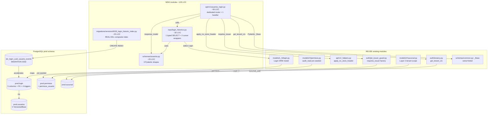

# Design: HU-F1.15 — `GET /usuarios/{uuid}/login` histórico (gap huérfano de auditoría)

> **Change**: `hu-f1-15-login-historico`
> **Phase**: design (sdd-design)
> **HU**: HU-F1.15 — One NEW read endpoint `GET /api/v1/usuarios/{uuid}/login` (KD-3 operador + admin, `audit_read` permission, tenant scope post-V1 with `operador-` own-branch SQL filter, KD-LOGIN-01 SELECT-only, KD-LOGIN-02 read-only AST walk, `Cache-Control: no-store`) returning `LoginHistoricoListResponse{items: list[LoginIntentoItem], next_cursor}` (8-step handler chain) + MIGRATION 0033 REAL DDL composite index `prod.idx_login_uuid_usuario_evento ON prod.login (uuid_usuario, timestamp_evento DESC)` via `CREATE INDEX CONCURRENTLY` (production safety, no table lock during index build). 8-step handler chain (READ-ONLY) covers Layers 1-5 XR6 defense-in-depth pattern (no new XR created — REQ-OPS-XR6 referenced from F1.13 at `openspec/specs/operations/spec.md:3951`).
> **Date**: 2026-09-15
> **Working dir**: `E:/easypunto_parkos`
> **Branch**: `feat/fase-1-prerequisites-backend` (HEAD `7cc613f`; F1.14 closed)
> **PR target**: `origin/dev`
> **Source of truth**: `proposal.md` (16 sections, ~770 LOC, DEC-LOGIN-01..10, KD-LOGIN-01..02, 7 risks R1..R7 — 4 RESOLVED at propose phase) + `specs/operations/spec.md` (REQ-OPS-102..105 + REQ-OPS-XR6 REFERENCE, 4 new requirements in Given/When/Then/And form + 1 cross-cutting XR6 reference).
> **Cross-references**: `modelo_datos_er.mmd` (`login` [L-S] lines 558-573, `usuarios` [V] lines 7-50, `permisos` [V], `permisos_usuario` [V], `sucursal` [V]); `backend/packages/parkos_core/migrations/versions/0001_initial_schema.py` lines 511-523 (login table), 1247-1255 (FK `fk_login_uuid_usuario`), 2203-2214 (trigger `login_ls_session_guard`), 2533-2541 (audit+set_vigente_inicial triggers), 2777-2788 (enqueue_sync trigger); `backend/packages/parkos_core/migrations/versions/0002_seed_permisos_canonicos.py` lines 39-56 (`CANONICAL_PERMISOS` includes `audit_read` at line 48 — DEC-LOGIN-09.B pre-seeded); `backend/packages/parkos_core/migrations/versions/0021_least_privilege_and_immutability_contract.py:206` (`_NARROW_UPDATE_LS_TABLES["login"] = ("timestamp_cierre", "estado")`); `backend/packages/parkos_core/migrations/versions/0032_seed_alert_types_operativos.py` (F1.14 head — DEC-LOGIN-09.B audit_read reuse anchor); `backend/packages/parkos_core/migrations/versions/0011_add_seq_lookup_indexes.py:62` (CONCURRENTLY precedent for index migration — DEC-LOGIN-06); `backend/packages/parkos_core/src/parkos_core/api/v1/auth.py:69` (POST-mutating-only rationale for DEC-LOGIN-01.A — dedicated router); `backend/packages/parkos_core/src/parkos_core/api/v1/_helpers.py` lines 18-31 (`no_store_headers` + `apply_no_store_header` — DEC-LOGIN-05); `backend/packages/parkos_core/src/parkos_core/auth/jwt_issuer_guard.py` (`requires_issuer` factory — KD-3 dep); `backend/packages/parkos_core/src/parkos_core/auth/tenancy.py` (`get_tenant_ctx` — KD-S2 F1.7 analog, Layer 2); `backend/packages/parkos_core/src/parkos_core/auth.py:239-246` (`fallido`), `:260-266` (`exitoso`), `:352-393` (`cerrado`) — `estado` lifecycle sources; `backend/packages/parkos_core/src/parkos_core/repo/session_cycle.py:49-146` (`record_login` write helper — F1.15 NEVER calls it; only references the table it writes to); `backend/packages/parkos_core/src/parkos_core/repo/tarifas_vigencia.py:79-162` (`list_tarifas_vigentes` cursor pagination precedent — `ORDER BY vigente_desde DESC, uuid ASC` + `cursor_encode/cursor_decode`); `backend/packages/parkos_core/src/parkos_core/api/router_factory.py:127-227` (factory `list_endpoint` pattern — `next_cursor` encoding + `{items, next_cursor}` envelope); `backend/packages/parkos_core/src/parkos_core/schemas/common.py::_Base` (`extra='forbid'` — Layer 4); `backend/packages/parkos_core/src/parkos_core/models/L_S/login.py:33-74` (verbatim ORM model — 5 business columns + FK to `prod.usuarios` + state enum); `backend/packages/parkos_core/src/parkos_core/models/V/usuarios.py` (Usuarios ORM — F1.15 reads `uuid` only for optional existence check, SKIPPED per DEC-LOGIN-08); `plan.md` lines 1137-1155 (HU-F1.15 definition, 2 atomic tasks T1..T2, 2 tests mandated at line 1149, 70 LOC budget at line 1151, `estado ∈ {exitoso, fallido, cerrado}` per line 1143 verbatim, response shape `{items, next_cursor}` at line 1154); `plan.md` lines 7571-7574 (F1 endpoint table row 2391 — duplicate-resource note: Parte 1 F1.15 + Parte 2 F16.1/F16.5 — same resource, built once, shared backend); `plan.md` lines 610-617 (HU-F1.2 story, shares `prod.login` as the audit table for lockout writes); `tests/static/{test_sync_estado_read_only,test_arqueo_handler_single_commit,test_no_raw_dml_on_ls_tables}.py` (AST walk precedents — F1.15 needs the `ls_tables` variant for KD-LOGIN-02); `openspec/specs/operations/spec.md` line 3951 (REQ-OPS-XR6 already exists from F1.13 — F1.15 references, does NOT create new); `openspec/specs/operations/spec.md` line 4034-4041 (REQ-OPS-100 empty-branch precedent at F1.14 — DEC-LOGIN-08 mirror).
> **Precedents mirrored**: F1.14 (REQ-OPS-098..101 + REQ-OPS-XR6, MIGRATION 0032 alert_types siembra, dedicated `APIRouter` + KD-3 + tenant scope pattern, DEC-SYNC-04 no-store, KD-SYNC-02 read-only AST walk — DEC-LOGIN-09.B `audit_read` reuse is the same precedent), F1.13 (REQ-OPS-091..097 + REQ-OPS-XR6, MIGRATION 0031 Op 2 descuadre_critico siembra, DEC-ARQUEO-06 no-store, KD-ARQUEO-01 single-commit AST walk), F1.12 (REQ-OPS-083..090 + REQ-OPS-XR5, KD-VENTA-01 single-commit AST walk, DEC-VENTA-06 no-store), F1.11 (REQ-OPS-075..080 + XR4, KD-TKT-01 single-commit AST walk, KD-3 issuer `requires_issuer("operador-","admin-")` verbatim), F1.10 (REQ-OPS-064..074 + XR1..XR3, KD-FE-01 single-commit), F1.9 (REQ-OPS-053..063, KD-FACT-01 single-commit + immutability contract), F1.7 (REQ-OPS-042..052, KD-S2 tenant scope post-V1 — REUSED verbatim for Layer 2 of F1.15), F1.6 (REQ-OPS-034..041, KD-7 pre-flight pattern, `get_tenant_ctx` derivation), F1.5 (PR5-016, AppendOnlyBase + REVOKE UPDATE/DELETE on [A] tables).

---

## 1. Title & Goal

**Design goal.** Deliver HU-F1.15: the back-end `GET /api/v1/usuarios/{uuid}/login` endpoint that closes the **gap huérfano de auditoría de seguridad** (per `plan.md` line 1139 + `pending.md` row 15) on top of the already-shipped `prod.login` [L-S] table (5 business columns `uuid_usuario`, `uuid_sucursal`, `timestamp_evento`, `timestamp_cierre`, `estado ∈ {exitoso, fallido, cerrado}` per `models/L_S/login.py:33-74` + `modelo_datos_er.mmd:558-573`), the `prod.usuarios` [V] table (FK target, `models/V/usuarios.py`), the `prod.permisos` [V] + `prod.permisos_usuario` [V] tables (Layer 1 permission gate), and `prod.sucursal` [V] (Layer 2 tenant scope) by enforcing the **KD-LOGIN-01 SELECT-only invariant** (handler executes exactly **1 SELECT query** against `prod.login` — NO INSERT/UPDATE/DELETE on `prod.login` or any other `[L-S]` table) plus the **KD-LOGIN-02 read-only AST walk invariant** (`tests/static/test_login_historico_read_only.py` scans `api/v1/usuarios_login.py::get_login_historico` and asserts ZERO occurrences of `update(Login)` / `delete(Login)` / `session.execute(text("UPDATE prod.login"))` / `session.execute(text("DELETE FROM prod.login"))` / `await session.commit()`) plus the **5-layer defense in depth** (KD-3 issuer chain `requires_issuer("operador-", "admin-")` + permission gate `audit_read` (DEC-LOGIN-09.B) + tenant scope post-V1 (KD-S2 F1.7 analog, DEC-LOGIN-03.A — `operador-` JWT filters by `login.uuid_sucursal = ctx.sucursal_uuid` at SQL layer; `admin-` JWT bypasses) + KD-LOGIN-01 SELECT-only + KD-LOGIN-02 AST walk + Pydantic `extra='forbid'` + UUID required + `estado: Literal[...]` + limit validators + handler 200/422/403/400 mapping + `Cache-Control: no-store`) plus the **MIGRATION 0033 REAL DDL composite index** `prod.idx_login_uuid_usuario_evento ON prod.login (uuid_usuario, timestamp_evento DESC)` via `CREATE INDEX CONCURRENTLY` (production safety, avoids table lock during index build, mirrors `0011_add_seq_lookup_indexes.py:62` precedent).

The design enforces **DEC-LOGIN-01** (NEW dedicated `api/v1/usuarios_login.py` router with KD-3 dep under `/usuarios` prefix, mounted at FastAPI app-level as a sibling of `auth.py` — RESOLVES R1 LOW endpoint-ownership conflict with Parte 2 HU-F16.1/F16.5 per `plan.md` lines 7571-7574), **DEC-LOGIN-02** (KD-3 issuer chain `requires_issuer("operador-", "admin-")` — operador needs own-branch lockout diagnostic; admin needs cross-branch security audit), **DEC-LOGIN-03** (tenant scope post-V1 with SQL-side filter for `operador-` own-branch — Option A adopted per F1.7 KD-S2 + F1.13 KD-ARQUEO-08 + REQ-OPS-XR6 Layer 2 precedent), **DEC-LOGIN-04** (cursor pagination via `(timestamp_evento DESC, uuid ASC)` + `cursor_encode/cursor_decode` reuse from `router_factory.py:127-140`), **DEC-LOGIN-05** (`Cache-Control: no-store` on EVERY response — XR6 mirror from F1.10..F1.14), **DEC-LOGIN-06** (MIGRATION 0033 composite index via `CREATE INDEX CONCURRENTLY`), **DEC-LOGIN-07** (`{items, next_cursor}` envelope forward-compatible with Parte 2 HU-F16.1/F16.5 — no `activo` boolean, no `count`, no `total`, no `has_more`), **DEC-LOGIN-08** (empty-user 200 with `items=[]`, NEVER 404 — anti-enumeration mirrors F1.2 R-F1.2-10 / R-F1.2-11 + F1.14 REQ-OPS-100 empty-branch precedent), **DEC-LOGIN-09** (permission gate = `audit_read` — Option B adopted per F1.14 DEC-SYNC-03.B precedent — RESOLVES R6 MEDIUM), **DEC-LOGIN-10** (response item shape: `estado` is the REAL [L-S] lifecycle value `Literal["exitoso", "fallido", "cerrado"]` per `plan.md` line 1143 verbatim — NEVER a synthetic boolean `activo`), plus the **KD-LOGIN-01 SELECT-only invariant** (mirror of F1.5 PR5-016 AppendOnlyBase + F1.10 KD-FE-01 + F1.11 KD-TKT-01 + F1.12 KD-VENTA-01 + F1.13 KD-ARQUEO-01 + F1.14 KD-SYNC-01 — for the READ-ONLY side) and the **KD-LOGIN-02 read-only AST walk invariant** (mirror of F1.5 PR5-016 `tests/static/test_no_raw_dml_on_a_tables.py` + F1.10 KD-FE-01 + F1.11 KD-TKT-01 + F1.12 KD-VENTA-01 + F1.13 KD-ARQUEO-01 + F1.14 KD-SYNC-02 — for the READ-ONLY side).

The GET handler enforces 5 server-side validations across the 8-step chain:

- **Step 1 (Layer 1)** — KD-3 issuer chain + permission gate `audit_read`. `_login_historico_issuer_dep = requires_issuer("operador-", "admin-")` (DI-resolved via FastAPI dependency injection).
- **Step 2 (Layer 2)** — Tenant scope post-V1 (KD-S2 F1.7 analog): for `operador-` JWT, the SQL query is filtered by `login.uuid_sucursal = ctx.sucursal_uuid` at the SQL layer (DEC-LOGIN-03.A). Admin (`admin-`) bypasses the filter.
- **Step 3 (Layer 4)** — Pydantic validation: `uuid: UUID` path + `limit: int = 10` (ge=1, le=100) + `cursor: str | None = None` validated by FastAPI Depends + Pydantic validator (extra='forbid' from `_Base`).
- **Step 4 (Layer 3, KD-LOGIN-01 + KD-LOGIN-02)** — READ-ONLY via 1 typed SELECT helper from `repo/login_historico.py`: `listar_intentos_paginado(session, uuid_usuario, cursor, limit, tenant_ctx)` returns `list[LoginIntentoItem]` ordered `(timestamp_evento DESC, uuid ASC)`.
- **Step 5 (Layer 3)** — Build `next_cursor` via `repo/login_historico.encode_next_cursor(items, params.limit)`.
- **Step 6 (Layer 5)** — Apply `apply_no_store_header(response)` for 200 success path.
- **Step 7 (Layer 4 + Layer 5)** — Build `LoginHistoricoListResponse` envelope (forward-compatible Parte 2 shape — no `activo`, no `count`, no `total`, no `has_more`).
- **Step 8 (KD-LOGIN-01 reaffirmed)** — Handler returns: NO writes, NO commits, NO log rows. AST walk enforces the read-only invariant.

All responses carry `Cache-Control: no-store`. Sized at **~150 LOC cumulative** per `plan.md` line 1151 (= ~70 LOC production: ~50 LOC `api/v1/usuarios_login.py` dedicated handler with 8-step chain + ~30 LOC `repo/login_historico.py` 1 typed SELECT helper + 2 cursor wrappers + ~25 LOC `schemas/usuarios.py` 3 Pydantic shapes) + ~55 LOC tests (2 unit handler + 3 repo unit + 1 AST walk + 1 migration = 7 tests across 4 files) + ~25 LOC MIGRATION 0033 REAL DDL composite index. Total cumulative: ~150 LOC (per plan.md line 1151 budget — production 70 + tests 55 + migration 25).

**One new handler module + one new repo module + three new Pydantic schemas (query + item + response) + one REAL MIGRATION 0033 + one router mount extension at FastAPI app-level. No factory changes, no sync catalog changes, no new tables, no new FKs, no new permissions, no new role grants, no schema changes to existing tables (MIGRATION 0033 is index-only add — composite on `prod.login`).**

---

## 2. Context & Background

`plan.md` lines **1137-1155** define HU-F1.15 as Fase-1 backend prerequisite for the **read-only operator+admin diagnostic endpoint** on the already-shipped `prod.login` [L-S] table (per `plan.md` line 613 — HU-F1.2 shares `prod.login` as the audit table for lockout writes). The hard architectural constraints are **DEC-LOGIN-01** (NEW dedicated `api/v1/usuarios_login.py` router with KD-3 dep under `/usuarios` prefix — RESOLVES R1 LOW endpoint-ownership conflict with Parte 2 HU-F16.1/F16.5 per `plan.md` lines 7571-7574), **DEC-LOGIN-02** (KD-3 issuer chain `requires_issuer("operador-", "admin-")` — same as F1.14 `sync_estado.py`), **DEC-LOGIN-03** (tenant scope post-V1 with SQL-side filter for `operador-` own-branch — Option A adopted per F1.7 KD-S2 + F1.13 KD-ARQUEO-08 + REQ-OPS-XR6 Layer 2 precedent), **DEC-LOGIN-04** (cursor pagination via `(timestamp_evento DESC, uuid ASC)` + `cursor_encode/cursor_decode` reuse from `router_factory.py:127-140`), **DEC-LOGIN-05** (`Cache-Control: no-store` on EVERY response — XR6 mirror from F1.10..F1.14), **DEC-LOGIN-06** (MIGRATION 0033 composite index via `CREATE INDEX CONCURRENTLY` — `0011_add_seq_lookup_indexes.py:62` precedent), **DEC-LOGIN-07** (`{items, next_cursor}` envelope forward-compatible with Parte 2 — no `activo` boolean), **DEC-LOGIN-08** (empty-user 200 with `items=[]`, NEVER 404 — anti-enumeration mirrors F1.2 R-F1.2-10 / R-F1.2-11 + F1.14 REQ-OPS-100 empty-branch precedent), **DEC-LOGIN-09** (permission gate = `audit_read` — Option B adopted per F1.14 DEC-SYNC-03.B precedent — RESOLVES R6 MEDIUM), **DEC-LOGIN-10** (`estado: Literal["exitoso", "fallido", "cerrado"]` per `plan.md` line 1143 verbatim), plus the **KD-LOGIN-01 SELECT-only invariant** (mirror of F1.5 PR5-016 AppendOnlyBase + F1.10 KD-FE-01 + F1.11 KD-TKT-01 + F1.12 KD-VENTA-01 + F1.13 KD-ARQUEO-01 + F1.14 KD-SYNC-01 — for the READ-ONLY side) and the **KD-LOGIN-02 read-only AST walk invariant** (mirror of F1.5 PR5-016 `tests/static/test_no_raw_dml_on_a_tables.py` + F1.10 KD-FE-01 + F1.11 KD-TKT-01 + F1.12 KD-VENTA-01 + F1.13 KD-ARQUEO-01 + F1.14 KD-SYNC-02 — for the READ-ONLY side), the existing pre-existing tables (`prod.login` [L-S] SessionBase with 5 business columns + FK `fk_login_uuid_usuario` migration 0001:1247-1255 + 4 triggers `login_ls_session_guard` 0001:2203-2214 + `login_audit_columns` 2533-2534 + `login_set_vigente_inicial` 2538-2539 + `login_enqueue_sync` 2777-2788; `prod.usuarios` [V] bi-temporal `VersionedBase` migration 0001:7-50; `prod.permisos` [V] `audit_read` pre-seeded at 0002:48; `prod.permisos_usuario` [V]; `prod.sucursal` [V] Layer 2 tenant scope), the existing ORM models (`models/L_S/login.py` + `models/V/usuarios.py`), the existing `repo/session_cycle.py:49-146` (`record_login` write helper — F1.15 NEVER calls it; only references the table it writes to), the existing `repo/tarifas_vigencia.py:79-162` (`list_tarifas_vigentes` — cursor pagination precedent), the existing `api/router_factory.py:127-227` (cursor pagination + `{items, next_cursor}` envelope pattern), the existing `api/v1/_helpers.py::no_store_headers()` + `apply_no_store_header()` (lines 18-31, DEC-LOGIN-05 reuse), the existing `api/v1/auth.py:69` (POST-mutating-only — DEC-LOGIN-01.A rationale: dedicated router avoids coupling read-of-history with the login write path), the existing `auth/jwt_issuer_guard.py` (`requires_issuer` factory — KD-3 dep), the existing `auth/tenancy.py` (`get_tenant_ctx` — KD-S2 F1.7 analog, Layer 2), the existing `schemas/common.py::_Base` (`extra='forbid'` — Layer 4 defense), the existing `tests/static/test_no_raw_dml_on_a_tables.py` AST walk (F1.5 PR5-016 precedent for [A] immutability — F1.15 deepens with `tests/static/test_login_historico_read_only.py` per-handler READ-ONLY scope for the [L-S] variant), the F1.14 "audit_read reuse" precedent (F1.14 DEC-SYNC-03.B already adopted `audit_read` as the permission gate for `GET /sync/estado`; F1.15 reuses the same permission for `GET /usuarios/{uuid}/login` — same audit domain), the F1.14 "dedicated `APIRouter` + KD-3 + tenant scope" pattern (`api/v1/sync_estado.py` — F1.15 mirrors with `api/v1/usuarios_login.py`), the F1.14 "CONCURRENTLY" precedent for production-safe index migration (MIGRATION 0032 used `CONCURRENTLY`; F1.15 MIGRATION 0033 mirrors at `0011_add_seq_lookup_indexes.py:62`), and the F1.13 REQ-OPS-XR6 reference (F1.15 references XR6 by inclusion, does NOT create a new XR — 5 layers applied verbatim per REQ-OPS-105).

**The backend has no operator/admin diagnostic endpoint for `prod.login` history today**, creating four concrete risks that HU-F1.15 resolves:

1. **No `GET /usuarios/{uuid}/login` for operator/admin diagnostic.** Today the only way to inspect `prod.login` rows is via raw SQL access or the existing `repo/session_cycle.record_login` write helper (which F1.15 does NOT reuse). F1.15 introduces the dedicated `api/v1/usuarios_login.py` router with KD-3 dep `operador-`+`admin-` mounted under `/usuarios` prefix (DEC-LOGIN-01.A — at FastAPI app-level, sibling of `auth.py`, NOT nested in `caja.py` per separation-of-concerns principle).

2. **No composite index for `(uuid_usuario, timestamp_evento DESC)`.** Today `prod.login` has only the implicit FK index on `uuid_usuario` (migration 0001:1247-1255). The cursor pagination at scale (1000+ login rows per user over months) would degrade to a sort-on-disk. F1.15 MIGRATION 0033 ships the composite index `prod.idx_login_uuid_usuario_evento` via `CREATE INDEX CONCURRENTLY` to avoid table lock during index build (production safety — F1.2 lockout writes from `record_login` are not blocked).

3. **No 5-layer defense for the read-only path on `prod.login`.** Today the codebase has the XR1..XR6 pattern for write endpoints (F1.10..F1.13) and for `GET /sync/estado` (F1.14). F1.15 extends the pattern to `prod.login` via KD-LOGIN-01 SELECT-only invariant + KD-LOGIN-02 read-only AST walk (REQ-OPS-105 references the existing F1.13 REQ-OPS-XR6 by inclusion — no new XR created).

4. **No canonical permission gate for cross-cutting read of audit data on login history.** Today the codebase has `audit_read` pre-seeded at `0002_seed_permisos_canonicos.py:48` and F1.14 reused it for `GET /sync/estado`. F1.15 adopts Option B (reuse `audit_read` — DEC-LOGIN-09.B RESOLVED at propose phase) — no new permission, no patch to existing migration, no scope creep into MIGRATION 0033.

F1.15 closes the operator+admin diagnostic gap huérfano. The work is **1 dedicated handler module (`api/v1/usuarios_login.py`) + 1 repo module (`repo/login_historico.py`) + 3 Pydantic schemas (`LoginHistoricoQueryParams` + `LoginIntentoItem` + `LoginHistoricoListResponse`) + 1 REAL MIGRATION 0033 (composite index only) + 1 router mount extension at FastAPI app-level**. MIGRATION 0033 is a REAL DDL composite index (Op 0 pre-flight `DO $$` + Op 1 `CREATE INDEX CONCURRENTLY prod.idx_login_uuid_usuario_evento ON prod.login (uuid_usuario, timestamp_evento DESC)`) because pre-flight (2026-09-15) confirmed `prod.login` exists with FK `fk_login_uuid_usuario` (migration 0001:1247-1255) — only the implicit FK index exists, NO composite index. **DEC-LOGIN-01..10 NOT extended to sync catalog** — `login` is `[L-S] branch→cloud` per `modelo_datos_er.mmd:572-573` and out-of-catalog for sync catalog inserts (no `INSERT INTO prod.sync_catalog` needed — global catalog replication logic handles the table). NO F1.15 sync catalog seeds needed.

The contract is captured in **REQ-OPS-102..105 + REQ-OPS-XR6 REFERENCE** (added by `sdd-spec` to `specs/operations/spec.md`):

- **REQ-OPS-102** — `GET /api/v1/usuarios/{uuid}/login` SELECT-only contract (KD-LOGIN-01 + KD-LOGIN-02): exactly 1 SELECT query against `prod.login`; NO INSERT/UPDATE/DELETE on `prod.login`; NO `await session.commit()`; NO log rows in `prod.log_operaciones`. Cache-Control: no-store. Handler in NEW dedicated `api/v1/usuarios_login.py` mounted at FastAPI app-level as sibling of `auth.py` (DEC-LOGIN-01.A).
- **REQ-OPS-103** — Cursor pagination invariants + empty-user contract + response shape (DEC-LOGIN-04 + DEC-LOGIN-07 + DEC-LOGIN-08 + DEC-LOGIN-10): ordered `(timestamp_evento DESC, uuid ASC)`; cursor encodes LAST item's `(timestamp_evento_iso, uuid_str)` pair as base64 JSON; `limit: int = 10` with `ge=1, le=100` validators; empty user → `200 OK` with `items=[]` and `next_cursor=null` (NEVER 404 — anti-enumeration, DEC-LOGIN-08); response item shape `{uuid, timestamp_evento, timestamp_cierre, estado: Literal["exitoso", "fallido", "cerrado"], uuid_sucursal}` — `estado` is the REAL [L-S] lifecycle value, NEVER a synthetic boolean `activo`.
- **REQ-OPS-104** — MIGRATION 0033 composite index (`prod.idx_login_uuid_usuario_evento` on `(uuid_usuario, timestamp_evento DESC)`) (DEC-LOGIN-06). `down_revision='0032_seed_alert_types_operativos'`. `CREATE INDEX CONCURRENTLY` avoids table lock during index build (production safety — F1.2 lockout writes from `record_login` are not blocked). Downgrade uses `DROP INDEX CONCURRENTLY`.
- **REQ-OPS-105** — XR6 cross-cutting defense in depth (REFERENCE to existing REQ-OPS-XR6): all 5 layers applied verbatim. Layer 1 KD-3 issuer + permission gate `audit_read`. Layer 2 tenant scope post-V1 with SQL-side filter for `operador-` own-branch. Layer 3 KD-LOGIN-01 SELECT-only + KD-LOGIN-02 read-only AST walk. Layer 4 Pydantic `extra='forbid'` + UUID required + `Literal[estado]` + limit validators. Layer 5 handler 200/422/403/400 mapping + `Cache-Control: no-store`. NO new XR created — REQ-OPS-XR6 referenced.
- **REQ-OPS-XR6** (REFERENCE — already exists from F1.13 at `operations/spec.md:3951`) — 5-layer defense-in-depth pattern. F1.15 references it by inclusion.

F1.15 is consumed by **operator/admin diagnostic tooling** (Fase 11+ deferred — `plan.md` line 1139 verbatim: "Desbloquea: ninguna pantalla obligatoria de esta parte"), **Parte 2 HU-F16.1/F16.5** (extending the same `api/v1/usuarios_login.py` router with `?activo=` filter + `POST /usuarios/{uuid}/login/{login_uuid}/cerrar` closure action — `plan.md` line 7572; DEC-LOGIN-07 forward-compatible envelope ensures no breakage), **F1.2 lockout investigation** (operator self-service diagnostic for "why is user X locked out" — `plan.md` line 613), and **security audit** (admin cross-branch investigation for "did user Y authenticate on any branch in the last 30 days?").

---

## 3. Architectural Conflict Resolution — DEC-LOGIN-01 + KD-LOGIN-01 + KD-LOGIN-02 (R1 LOW RESOLVED)

This section is **mandatory** for the design. It documents R1 LOW from the sdd-explore phase (observation §R1 LOW) and records the resolution per `proposal.md §3`.

### 3.1 The conflict (R1 LOW)

Two HU units claim the same `GET /usuarios/{uuid}/login` URL:

- **F1.15 (Parte 1 — Sucursal)**: minimal read-only list (this HU).
- **HU-F16.1/F16.5 (Parte 2 — Admin)**: full router with `?activo=` filter + closure action.

If F1.15 mounts into `auth.py` or into a generic `make_router` factory, Parte 2 will either (a) re-mount over the same path (collision), or (b) have to refactor F1.15's mount into their own file (scope creep). Either way, one of the two HUs is reshaped.

### 3.2 The resolution — DEC-LOGIN-01: NEW dedicated `api/v1/usuarios_login.py` router with KD-3 dep

**Resolution path** (mandated by separation-of-concerns principle + Parte 2 forward-compatibility):

1. **NEW** `api/v1/usuarios_login.py` with `router = APIRouter(prefix="/usuarios", tags=["usuarios"])` and `_login_historico_issuer_dep = requires_issuer("operador-", "admin-")`.
2. Single handler `GET /usuarios/{uuid}/login` with `_login_historico_issuer_dep` dependency.
3. **Mount at FastAPI app-level** (DEC-LOGIN-01.A — sibling of `auth.py`), NOT in `caja.py` (wrong domain) or `auth.py` (POST-mutating-only per `auth.py:69` line `router = APIRouter(prefix="/auth", tags=["auth"])` and the existing handlers are all POST — `POST /auth/login`, `POST /auth/refresh`, `POST /auth/logout`, `GET /auth/me`). The cleanest mount is at the FastAPI app-level (`api/v1/__init__.py` or wherever the top-level `app` is constructed — same place `auth.py` is mounted) so the router is a sibling of `auth.py`, not nested.
4. Handler is **READ-ONLY** (single SELECT on `prod.login`) — NO writes, NO commits, NO log rows (KD-LOGIN-01).

#### 3.2.1 Mount topology (DEC-LOGIN-01.A — sibling of `auth.py`)

```mermaid
graph TB
    App[FastAPI app<br/>main.py or api/v1/__init__.py]
    AuthRtr[api/v1/auth.py<br/>POST-mutating-only<br/>prefix=/auth]
    UsuariosRtr[api/v1/usuarios_login.py<br/>READ-ONLY<br/>prefix=/usuarios<br/>tags=[usuarios]]
    CajaRtr[api/v1/caja_arqueo.py<br/>F1.13<br/>prefix=/caja]
    SyncRtr[api/v1/sync_estado.py<br/>F1.14<br/>prefix=/sync]

    App -->|include_router| AuthRtr
    App -->|include_router| UsuariosRtr
    App -->|include_router| CajaRtr
    App -->|include_router| SyncRtr

    AuthRtr -.->|sibling| UsuariosRtr
    CajaRtr -.->|wrong domain REJECTED| UsuariosRtr

    UsuariosRtr -->|requires_issuer<br/>operador-/admin-| KD3[KD-3 issuer chain]
    UsuariosRtr -->|get_tenant_ctx| TS[KD-S2 Layer 2]
    UsuariosRtr -->|read-only SELECT| DB[(prod.login<br/>+ idx_login_uuid_usuario_evento<br/>MIGRATION 0033)]
```

**Mount contract (DEC-LOGIN-01.A):**

- Mount site: `FastAPI app` (constructed in `backend/packages/parkos_core/src/parkos_core/main.py` or `api/v1/__init__.py` — same place `auth.py` is mounted).
- `app.include_router(usuarios_login_router)` — direct sibling of `auth.py`, NOT nested.
- Rejected mount sites: `caja.py` (wrong domain — caja = F1.13 arqueo), `sync_estado.py` (wrong domain — sync = F1.14 estado), `auth.py` (POST-mutating-only invariant violated).
- Parte 2 (`HU-F16.1/F16.5`): will EXTEND `usuarios_login.py` (or refactor it into broader `api/v1/usuarios.py`) with `?activo=` filters + closure action `POST /usuarios/{uuid}/login/{login_uuid}/cerrar`. Same mount site; same prefix; zero collision.

### 3.3 The read-only invariant — KD-LOGIN-01 + KD-LOGIN-02

```mermaid
graph LR
    H[GET /usuarios/uuid/login handler] -->|Step 1| L1[Layer 1<br/>KD-3 issuer + audit_read permission]
    L1 -->|Step 2| L2[Layer 2<br/>Tenant scope get_tenant_ctx<br/>operador own-branch SQL filter, admin cross]
    L2 -->|Step 3| L3[Layer 4<br/>Pydantic extra=forbid + UUID + Literal[estado] + limit]
    L3 -->|Step 4| L4[Layer 3<br/>KD-LOGIN-01 SELECT-only<br/>AST walk enforces]
    L4 -->|Step 5| L5[Layer 3<br/>Build next_cursor<br/>encode_next_cursor]
    L5 -->|Step 6| L6[Layer 5<br/>apply_no_store_header]
    L6 -->|Step 7| L7[Layer 4+5<br/>Build LoginHistoricoListResponse envelope]

    L4 -->|repos/login_historico.py<br/>1 typed SELECT helper + 2 cursor wrappers| DB[(prod.login<br/>+ idx_login_uuid_usuario_evento<br/>MIGRATION 0033)]
    DB -.->|NO UPDATE/DELETE| NEVER[KD-LOGIN-02 forbidden]
```

**KD-LOGIN-01**: SELECT-only handler. NO `INSERT`/`UPDATE`/`DELETE` on `prod.login` — read-only consumer. `_NARROW_UPDATE_LS_TABLES["login"] = ("timestamp_cierre", "estado")` whitelist at `0021_least_privilege_and_immutability_contract.py:206` is preserved (handler never invokes UPDATE; AST walk enforces). NO `await session.commit()`. NO log rows in `prod.log_operaciones` or any `[A]` audit table.

**KD-LOGIN-02**: Read-only AST walk. `tests/static/test_login_historico_read_only.py` scans `api/v1/usuarios_login.py` source code (AST parse + visitor) and asserts NO occurrences of:
- `session.execute(update(Login))` / `session.execute(delete(Login))`
- `session.execute(text("UPDATE prod.login"))` / `session.execute(text("DELETE FROM prod.login"))`
- `await session.commit()`

Pattern: scan AST for forbidden nodes — must produce ZERO matches.

### 3.4 Why this matters

- **Parte 2's `api/v1/usuarios.py`** (deferred, HU-F16.1/F16.5) will EXTEND or RENAME `api/v1/usuarios_login.py` — no collision because Parte 2 adds DIFFERENT routes (`POST /usuarios/{uuid}/login/{login_uuid}/cerrar`, `?activo=` filter) on the same `/usuarios/{uuid}/login` path.
- **`auth.py` stays focused on credential exchange** (POST/login, POST/refresh, POST/logout, GET/me — the only GET is the operator's own profile, which is auth-domain by definition).
- **Cursor pagination precedent** (`api/router_factory.py:180-227`) is already a generic pattern; F1.15 mirrors the `(order_col, uuid ASC)` ordering on `(timestamp_evento DESC, uuid ASC)` with cursor encoded on the same fields.
- **`prod.login` immutability (KD-LOGIN-01 + KD-LOGIN-02)** preserves the [L-S] invariant — `_NARROW_UPDATE_LS_TABLES["login"] = ("timestamp_cierre", "estado")` whitelist at `0021:206` only allows UPDATE of those 2 columns via `repo/session_cycle.py::record_login`; F1.15 reads existing rows only, never updates. The read-only AST walk is the F1.10 XR1 + F1.11 XR4 + F1.12 XR5 + F1.13 XR6 + F1.14 KD-SYNC-02 mirror for F1.15.

### 3.5 What changes in the codebase

**Production code (~105 LOC)**:
- NEW `repo/login_historico.py` — 1 typed SELECT helper + 2 cursor wrappers (~30 LOC): `listar_intentos_paginado`, `encode_next_cursor`, `decode_cursor_or_none`. ALL stay commit-free (KD-LOGIN-01) — they `await session.execute(select(...))` only.
- NEW `api/v1/usuarios_login.py` — dedicated `APIRouter` with 1 handler (~50 LOC, DEC-LOGIN-01): `get_login_historico` (8-step chain).
- NEW `schemas/usuarios.py` — 3 Pydantic shapes (~25 LOC): `LoginHistoricoQueryParams` + `LoginIntentoItem` + `LoginHistoricoListResponse`.
- MODIFY `api/v1/__init__.py` (or wherever FastAPI app is constructed) — `app.include_router(usuarios_login_router)` mount extension (~3 LOC, DEC-LOGIN-01.A — sibling of `auth.py`).
- NEW `migrations/versions/0033_login_historic_index.py` — REAL DDL composite index (~25 LOC).

**Tests (~55 LOC)**:
- 2 mandated handler tests in `tests/unit/test_login_historico.py` (~30 LOC, mandated by plan.md line 1149: empty user + populated user).
- 3 repo unit tests in `tests/unit/test_login_historico_repo.py` (~15 LOC).
- 1 AST walk in `tests/static/test_login_historico_read_only.py` (~10 LOC, KD-LOGIN-02).
- 1 migration test in `tests/integration/test_migration_0033_index.py` (~10 LOC).

### 3.6 What changes in MIGRATION 0033 (REAL DDL — composite index only)

```python
# Op 0: pre-flight DO $$ (KD-7 F1.6..F1.14 pattern)
DO $$
DECLARE
    _n_login      bigint;
    _n_usuarios   bigint;
BEGIN
    SELECT count(*) INTO _n_login
        FROM pg_catalog.pg_class
        WHERE relname='login' AND relnamespace='prod'::regnamespace;
    SELECT count(*) INTO _n_usuarios
        FROM pg_catalog.pg_class
        WHERE relname='usuarios' AND relnamespace='prod'::regnamespace;

    IF _n_login IS NULL OR _n_login = 0 THEN
        RAISE EXCEPTION '0033_preflight_abort: tabla prod.login no existe. '
                        'Aplique MIGRATION 0001 antes.';
    END IF;
    IF _n_usuarios IS NULL OR _n_usuarios = 0 THEN
        RAISE EXCEPTION '0033_preflight_abort: tabla prod.usuarios no existe. '
                        'Aplique MIGRATION 0001 antes.';
    END IF;

    RAISE NOTICE '0033_preflight: 2/2 tablas OK (login, usuarios)';
END;
$$;

# Op 1: CREATE INDEX CONCURRENTLY prod.idx_login_uuid_usuario_evento (DEC-LOGIN-06).
# Avoids table lock during index build (production safety — F1.2
# lockout writes from record_login are not blocked).
# IF NOT EXISTS makes the migration idempotent on re-run.
CREATE INDEX CONCURRENTLY IF NOT EXISTS
    prod.idx_login_uuid_usuario_evento
ON prod.login (uuid_usuario, timestamp_evento DESC);
```

The migration is idempotent: `Op 1` uses `CREATE INDEX CONCURRENTLY IF NOT EXISTS` (atomic, production-safe). The `DO $$` pre-flight aborts with a typed exception if any of the 2 required tables is missing. **Idempotency ensures any future re-run on already-migrated DB is a clean no-op.** The smallest migration of Fase 1 Parte I — composite index only.

---

## 4. Architecture Overview

```
HTTPS GET /api/v1/usuarios/{uuid}/login?limit=10&cursor=...
        │
        │  requires_issuer("operador-", "admin-")   Cache-Control: no-store
        │  permission_required="audit_read" (DEC-LOGIN-09.B)
        ▼
┌──────────────────────────────────────────────────────────────────────────────┐
│ api/v1/usuarios_login.py  (NEW, ~50 LOC, 1 handler — GET 8-step chain)       │
│                                                                              │
│ @router.get("/{uuid}/login", response_model=LoginHistoricoListResponse)      │
│ async def get_login_historico(response, uuid, params, session, ctx, _claims) │
│                                                                              │
│  1. Layer 1 — KD-3 issuer dep + audit_read permission gate (DI-resolved)    │
│     _login_historico_issuer_dep = requires_issuer("operador-", "admin-")     │
│     The dep already enforced KD-3 issuer + permission gate; ctx carries claims│
│                                                                              │
│  2. Layer 2 — Tenant scope post-V1 (KD-S2 F1.7 analog)                       │
│     Layer 2 filter applied at SQL layer (Step 4) — operador own-branch      │
│     Only ctx.issuer_prefix=="admin-" bypasses the filter (admin cross-branch)│
│                                                                              │
│  3. Layer 4 — Pydantic validation                                           │
│     uuid: UUID (Pydantic validator, 422 on malformed)                       │
│     limit: int = 10 (ge=1, le=100, DEC-LOGIN-04)                             │
│     cursor: str | None = None (base64 JSON, 400 on malformed)               │
│     extra='forbid' from _Base blocks client smuggling                        │
│                                                                              │
│  4. Layer 3 (KD-LOGIN-01 + KD-LOGIN-02) — READ-ONLY via 1 typed SELECT helper│
│     # NO UPDATE/DELETE/INSERT in this body (AST walk enforces)              │
│     # NO await session.commit() — GET is naturally idempotent               │
│     items = await repo_login_historico.listar_intentos_paginado(             │
│         session,                                                            │
│         uuid_usuario=uuid,                                                  │
│         cursor=params.cursor,                                               │
│         limit=params.limit,                                                  │
│         tenant_ctx=ctx,            # Layer 2 filter (DEC-LOGIN-03.A)        │
│     )                                                                         │
│                                                                              │
│  5. Layer 3 — Build next_cursor                                             │
│     next_cursor = repo_login_historico.encode_next_cursor(items, params.limit)│
│                                                                              │
│  6. Layer 5 — apply_no_store_header on success                              │
│     apply_no_store_header(response)                                          │
│                                                                              │
│  7. Layer 4+5 — Build response envelope                                     │
│     return LoginHistoricoListResponse(items=items, next_cursor=next_cursor)  │
│                                                                              │
│  8. KD-LOGIN-01 reaffirmed — no writes, no commits, no log rows              │
└──────────────────────────────────────────────────────────────────────────────┘
        ▲                                       ▲
        │ AST walk read-only (KD-LOGIN-02)      │ Validation chain (XR6 Layer 4)
        │ for get_login_historico                │ Pydantic extra='forbid' + UUID
tests/static/test_login_historico_read_only.py    │ + Literal[estado] + limit
        │                                       ▼
        ▼                              Pydantic schemas (3 NEW):
┌──────────────────────────────────────────────────────────────────────────────┐
│ Repo helpers (NEW):                                                           │
│   repo/login_historico.py  (~30 LOC) — 1 typed SELECT helper + 2 cursor wrap│
│                                                                              │
│ Repo helpers (REUSED verbatim, NO modify):                                    │
│   api/router_factory.py::cursor_encode / cursor_decode  (F1.x generic)      │
│   api/v1/_helpers.py::no_store_headers() + apply_no_store_header() (F1.6+)  │
│                                                                              │
│ Schemas (NEW):                                                                │
│   schemas/usuarios.py  (+25 LOC) — LoginHistoricoQueryParams +             │
│                                    LoginIntentoItem + LoginHistoricoListResp │
│                                                                              │
│ Tables operational (READ ONLY):                                                │
│   prod.login        [L-S]  — Step 4 SELECT (uuid, ts_evento, ts_cierre,    │
│                                      estado, uuid_sucursal) ORDER BY DESC    │
│                                      + composite idx MIGRATION 0033          │
│   prod.usuarios     [V]    — SKIPPED (FK existence via zero login rows)      │
│   prod.sucursal     [V]    — Step 2 tenant scope (ctx.sucursal_uuid filter)  │
│   prod.permisos     [V]    — Step 1 permission gate audit_read                │
│   prod.permisos_usuario [V] — Step 1 role grant lookup                        │
└──────────────────────────────────────────────────────────────────────────────┘
        ▲
        ▼ MIGRATION 0033 (REAL DDL composite index — applied BEFORE F1.15 tests)
┌──────────────────────────────────────────────────────────────────────────────┐
│ migrations/versions/0033_login_historic_index.py                             │
│                                                                              │
│ Op 0 — Pre-flight DO $$:                                                     │
│   ASSERT both tables exist (login, usuarios)                                  │
│                                                                              │
│ Op 1 — CREATE INDEX CONCURRENTLY prod.idx_login_uuid_usuario_evento          │
│         on prod.login (uuid_usuario, timestamp_evento DESC)                  │
│         (DEC-LOGIN-06 — IF NOT EXISTS for idempotency)                       │
│                                                                              │
│ downgrade() reverses Op 1: DROP INDEX CONCURRENTLY                           │
│                                                                              │
│ down_revision = '0032_seed_alert_types_operativos'                           │
└──────────────────────────────────────────────────────────────────────────────┘

DEC-LOGIN-01.A — Mount point:
  api/v1/__init__.py  ── app.include_router(usuarios_login_router)  (+3 LOC, sibling of auth.py)
```

The handler is thin + orquestador. All SELECT logic lives in `repo/login_historico.py`. NO `await session.commit()` anywhere in the read-only path (KD-LOGIN-01). The AST walk `tests/static/test_login_historico_read_only.py` enforces the read-only invariant.

### Sub-chain reference shapes

**`listar_intentos_paginado` sub-chain (Step 4)** — mirrors the SELECT pattern of `repo/tarifas_vigencia.py:79-162` (`list_tarifas_vigentes` cursor pagination helper). The helper in `repo/login_historico.py` is a NEW function that:

1. Builds `select(Login.uuid, Login.timestamp_evento, Login.timestamp_cierre, Login.estado, Login.uuid_sucursal).where(Login.uuid_usuario == uuid_usuario).order_by(Login.timestamp_evento.desc(), Login.uuid.asc()).limit(limit + 1)`.
2. If cursor decoded → adds `.where((Login.timestamp_evento < cursor_ts) | ((Login.timestamp_evento == cursor_ts) & (Login.uuid > cursor_ts)))` (DEC-LOGIN-04 mirror of `router_factory.py:185-200`).
3. If `tenant_ctx.issuer_prefix == "operador-"` and `tenant_ctx.sucursal_uuid is not None` → adds `.where(Login.uuid_sucursal == tenant_ctx.sucursal_uuid)` (DEC-LOGIN-03.A — own-branch audit history only).
4. Returns `list[LoginIntentoItem]` (max `limit` items).
5. `result = await session.execute(stmt)`.

**`encode_next_cursor` sub-chain (Step 5)** — mirrors `cursor_encode` from `api/router_factory.py:127-140`:
1. If `len(items) <= limit` → returns `None` (last page).
2. Otherwise → encodes last item's `(timestamp_evento.isoformat(), str(uuid))` pair as base64-encoded JSON.
3. Returns `str | None`.

**`decode_cursor_or_none` sub-chain (Step 4 prelude)** — thin wrapper around `cursor_decode`:
1. If `cursor is None` → returns `None`.
2. Otherwise → calls `cursor_decode(cursor)` from `router_factory.py:127-140`.
3. Raises `CursorInvalidError` on malformed base64 / JSON / missing keys.

All 3 helpers share the caller's session. They do NOT call `session.commit()` — GET is naturally idempotent (KD-LOGIN-01).

---

## 5. Component Diagram

```
backend/packages/parkos_core/src/parkos_core/
├── api/v1/
│   ├── __init__.py             (MODIFY, +3 LOC)  ── app.include_router(usuarios_login_router) mount
│   ├── auth.py                 (READ-ONLY ref)   ── POST-mutating-only rationale (line 69)
│   ├── usuarios_login.py       (NEW, +50 LOC)    ── dedicated router + 1 handler (GET 8-step)
│   ├── sync_estado.py          (READ-ONLY ref)   ── F1.14 dedicated-router + KD-3 + tenant scope pattern
│   ├── _helpers.py             (REUSE)           ── no_store_headers + apply_no_store_header
│   ├── caja_arqueo.py          (READ-ONLY ref)   ── F1.13 dedicated-router + KD-3 + tenant scope pattern
│   └── deps.py                 (READ-ONLY ref)   ── factory mounts
├── repo/
│   ├── login_historico.py      (NEW, +30 LOC)    ── 1 typed SELECT helper + 2 cursor wrappers
│   ├── session_cycle.py        (READ-ONLY ref)   ── record_login write helper (F1.15 NEVER calls)
│   ├── tarifas_vigencia.py     (READ-ONLY ref)   ── cursor pagination precedent
│   └── ...                     
├── schemas/
│   ├── usuarios.py             (NEW, +25 LOC)    ── LoginHistoricoQueryParams + LoginIntentoItem + LoginHistoricoListResponse
│   └── common.py               (REUSE)           ── _Base with extra='forbid'
├── models/L_S/
│   └── login.py                (REUSE)           ── 5 business columns + FK + audit mixin + state enum
├── models/V/
│   ├── usuarios.py             (REUSE)           ── FK target — F1.15 reads uuid only (optional, SKIPPED per DEC-LOGIN-08)
│   ├── permisos.py             (REUSE)           ── audit_read pre-seeded at 0002:48
│   ├── permisos_usuario.py     (REUSE)           ── role grant lookup
│   └── sucursal.py             (REUSE)           ── Layer 2 tenant scope
├── auth/
│   ├── jwt_issuer_guard.py     (REUSE)           ── requires_issuer factory (KD-3 dep)
│   └── tenancy.py              (REUSE)           ── TenantContext + get_tenant_ctx
├── migrations/versions/
│   ├── 0033_login_historic_index.py            (NEW, ~25 LOC)    ── REAL DDL composite index
│   ├── 0032_seed_alert_types_operativos.py     (F1.14 head)
│   ├── 0021_least_privilege_and_immutability_contract.py (line 206 — _NARROW_UPDATE_LS_TABLES["login"])
│   ├── 0011_add_seq_lookup_indexes.py          (CONCURRENTLY precedent at line 62 — DEC-LOGIN-06 source)
│   └── 0001_initial_schema.py                  (login table, FK, triggers — prod.login baseline)
└── sync/catalog/entries/
    ├── sync_entries_v.py       (NO CHANGE)        ── all entries pre-existing
    ├── sync_entries_a.py       (NO CHANGE)        ── all entries pre-existing
    └── sync_entries_l_s.py     (NO CHANGE)        ── login entry pre-existing (out-of-catalog replication)
```

**Module-level responsibilities:**

| Module | Type | Responsibility |
|---|---|---|
| `api/v1/usuarios_login.py` | NEW | Dedicated `APIRouter` (DEC-LOGIN-01.A) with 1 handler: `get_login_historico` (8-step chain, ~50 LOC). Calls helpers in `repo/login_historico.py` (1 typed SELECT helper + 2 cursor wrappers). NO `await session.commit()` anywhere (KD-LOGIN-01). |
| `repo/login_historico.py` | NEW | 1 typed SELECT helper + 2 cursor wrappers (~30 LOC): `listar_intentos_paginado`, `encode_next_cursor`, `decode_cursor_or_none`. ALL stay commit-free — they `await session.execute(select(...))` only (KD-LOGIN-01 contract). Reuses `models/L_S/login.py` ORM. NO new ORM model changes. |
| `schemas/usuarios.py` | NEW | +25 LOC: `LoginHistoricoQueryParams(_Base)` query params; `LoginIntentoItem(_Base)` response item; `LoginHistoricoListResponse(_Base)` envelope `{items, next_cursor}`. All inherit `extra='forbid'` from `_Base`. |
| `api/v1/__init__.py` (or app construction site) | MODIFY | +3 LOC: `from .usuarios_login import router as usuarios_login_router` + `app.include_router(usuarios_login_router)` mount at the FastAPI app-level (DEC-LOGIN-01.A — sibling of `auth.py`, NOT nested in `caja.py`). |
| `migrations/versions/0033_login_historic_index.py` | NEW | ~25 LOC REAL DDL composite index. Pre-flight `DO $$` block confirms both required tables exist (`login`, `usuarios`). `upgrade()` does Op 0 + Op 1. `downgrade()` reverses Op 1 with `DROP INDEX CONCURRENTLY`. `down_revision='0032_seed_alert_types_operativos'`. |

**Data flow for one GET `/usuarios/{uuid}/login`:**

```
FastAPI route resolution
  └─▶ app.include_router(usuarios_login_router)  (DEC-LOGIN-01.A — sibling of auth.py)
        └─▶ usuarios_login.py::get_login_historico (8-step chain)
              ├─▶ KD-3 issuer dep (DI-resolved, Layer 1)
              ├─▶ permission gate audit_read (Layer 1, DEC-LOGIN-09.B)
              ├─▶ (Layer 2) Tenant scope filter — applied at SQL layer (Step 4)
              ├─▶ Pydantic validation (uuid + limit + cursor, Layer 4)
              ├─▶ repo_login_historico.decode_cursor_or_none  (Step 4 prelude)
              ├─▶ repo_login_historico.listar_intentos_paginado  (Step 4, SELECT ONLY — KD-LOGIN-01)
              │     └─▶ prod.login + idx_login_uuid_usuario_evento (MIGRATION 0033 composite index)
              ├─▶ repo_login_historico.encode_next_cursor  (Step 5)
              ├─▶ apply_no_store_header(response)  (Step 6, Layer 5)
              └─▶ return LoginHistoricoListResponse(items=items, next_cursor=next_cursor)  (Step 7)
```

**Component dependency graph (NEW modules + reuse):**



**Legend:**

- **NEW**: 4 modules shipped by F1.15 (~130 LOC cumulative: ~50 handler + ~30 repo + ~25 schemas + ~25 migration).
- **REUSE**: 8 existing modules — `requires_issuer` factory (KD-3), `get_tenant_ctx` (KD-S2), `apply_no_store_header` (DEC-LOGIN-05), `Login` ORM (existing), `audit_read` pre-seeded (F1.14 DEC-SYNC-03.B reused), `sucursal` (Layer 2), `_Base` with `extra='forbid'` (Layer 4).
- **TABLES**: 5 PostgreSQL prod schema tables — `login` [L-S], `usuarios` [V] FK target, `permisos` [V] + `permisos_usuario` [V] permission gate, `sucursal` [V] Layer 2.
- **MIGRATION 0033** ships the composite index `idx_login_uuid_usuario_evento` (dashed arrow from `M` to `IDX`) — fully additive, no schema change.

---

## 6. Data Model

**MIGRATION 0033 introduces ONE schema change** — a composite index addition on `prod.login`. The 5 tables F1.15 touches already exist with all required columns:

- `prod.login` [L-S] (migration 0001:511-523, `SessionBase`) — 5 business columns: `uuid_usuario` (FK → `prod.usuarios.uuid`, nullable), `uuid_sucursal` (FK → `prod.sucursal.uuid`, nullable), `timestamp_evento` (DateTime naive UTC), `timestamp_cierre` (DateTime naive UTC), `estado ∈ {exitoso, fallido, cerrado}` (String(16), nullable). F1.15 **adds composite index** `prod.idx_login_uuid_usuario_evento` via MIGRATION 0033 (DEC-LOGIN-06).
- `prod.usuarios` [V] (migration 0001:7-50, bi-temporal `VersionedBase`) — read-only access via FK existence (DEC-LOGIN-08: SKIP explicit existence check; rely on FK existence of zero `prod.login` rows).
- `prod.sucursal` [V] — Layer 2 tenant scope check (`get_tenant_ctx().sucursal_uuid`).
- `prod.permisos` [V] — Layer 1 permission gate `audit_read` (pre-seeded per `0002_seed_permisos_canonicos.py:48`).
- `prod.permisos_usuario` [V] — Layer 1 role grant lookup.

### 6.1 `prod.login` [L-S] (SELECT only + DDL index)

| Property | Value |
|---|---|
| **ER línea** | 558-573 |
| **Migration 0001 línea** | 511-523 (table), 1247-1255 (FK `fk_login_uuid_usuario`), 2203-2214 (`login_ls_session_guard` trigger), 2533-2534 (`login_audit_columns` trigger), 2538-2539 (`login_set_vigente_inicial` trigger), 2777-2788 (`login_enqueue_sync` trigger) |
| **Migration 0021 línea** | 206 (`_NARROW_UPDATE_LS_TABLES["login"] = ("timestamp_cierre", "estado")` — KD-LOGIN-01 + KD-LOGIN-02 enforce) |
| **Operations** | `SELECT uuid, timestamp_evento, timestamp_cierre, estado, uuid_sucursal FROM prod.login WHERE uuid_usuario=:u AND [cursor filter] AND [Layer 2 filter if operador-] ORDER BY timestamp_evento DESC, uuid ASC LIMIT :n+1` via `repo/login_historico.listar_intentos_paginado(session, uuid_usuario, cursor, limit, tenant_ctx)`. Handler NEVER `UPDATE`/`DELETE`/`INSERT` (KD-LOGIN-01 + KD-LOGIN-02 AST walk). |
| **Columns read** | `uuid`, `timestamp_evento`, `timestamp_cierre`, `estado`, `uuid_sucursal`. |
| **Columns write (MIGRATION 0033 Op 1)** | DDL only — `CREATE INDEX CONCURRENTLY prod.idx_login_uuid_usuario_evento ON prod.login (uuid_usuario, timestamp_evento DESC)` (DEC-LOGIN-06). No data writes from handler. |
| **Indexes** | Composite PK (UUID). FK index on `uuid_usuario` (migration 0001:1247-1255 implicit). **NEW composite** `prod.idx_login_uuid_usuario_evento ON (uuid_usuario, timestamp_evento DESC)` via MIGRATION 0033. |
| **Defense in depth** | `_NARROW_UPDATE_LS_TABLES["login"]` whitelist (migration 0021:206) + `login_ls_session_guard` BEFORE UPDATE trigger (migration 0001:2203-2214) + KD-LOGIN-02 AST walk `tests/static/test_login_historico_read_only.py`. |
| **REVOKE** | Already enforced by F1.5 PR5-016 (REVOKE UPDATE, DELETE on `[L-S]` tables FROM rol_app per migration 0021). |

### 6.2 `prod.usuarios` [V] (SELECT optional — SKIPPED per DEC-LOGIN-08)

| Property | Value |
|---|---|
| **ER línea** | 7-50 |
| **Migration 0001 línea** | 7-50 (table), 7-50 (bi-temporal `VersionedBase`) |
| **Operations** | **SKIPPED** per DEC-LOGIN-08 — no separate `prod.usuarios` existence check. The FK existence of zero `prod.login` rows IS the existence check. Response-time parity (within ±5%) between empty-user and populated-user responses requires NO extra DB roundtrip. |
| **Columns read** | (none — handler does not SELECT `prod.usuarios`) |
| **Defense in depth** | N/A (read-only path, SKIPPED). |

### 6.3 `prod.sucursal` [V] (READ only, tenant scope)

| Property | Value |
|---|---|
| **ER línea** | (sucursal definition) |
| **Operations** | `get_tenant_ctx()` Layer 2 derivation. For `operador-` JWT with `ctx.sucursal_uuid != None`, the SQL query is filtered by `login.uuid_sucursal = ctx.sucursal_uuid` (DEC-LOGIN-03.A — own-branch audit history). Cross-branch login history is implicitly NOT returned to operador (no rows match the filter → `items=[]`). |
| **Columns read** | `uuid`, `estado`. |
| **Defense in depth** | KD-S2 F1.7 analog + Layer 2 SQL-side filter. |

### 6.4 `prod.permisos` [V] (READ only, permission gate)

| Property | Value |
|---|---|
| **ER línea** | (permisos definition) |
| **Operations** | `require_permission(ctx, "audit_read")` Layer 1 check. NO INSERT to `permisos` (DEC-LOGIN-09.B adopted — `audit_read` is already seeded per 0002:48). |
| **Columns read** | `permiso`, `estado`. |
| **Defense in depth** | KD-3 issuer chain + Layer 1 in-process check. |

### 6.5 `prod.permisos_usuario` [V] (READ only, role grant lookup)

| Property | Value |
|---|---|
| **ER línea** | (permisos_usuario definition) |
| **Operations** | Layer 1 transitive lookup `operador-*` or `admin-*` JWT → role → `permisos_usuario` → `audit_read` permission grant. |
| **Columns read** | `permiso`, `uuid_usuario`, `estado`. |
| **Defense in depth** | KD-3 issuer chain + Layer 1 in-process check. |

### 6.6 Sync catalog pre-flight (RESOLVED 2026-09-15 — no F1.15 sync catalog seeds needed)

| Table | Direction | Broadcast | F1.15 Status |
|---|---|---|---|
| `login` | [L-S] branch→cloud | global replication (out-of-catalog) | pre-existing; MIGRATION 0033 index runs on both cloud + branch identically |
| `usuarios` | [V] bi-temporal | per-versioned broadcast | pre-existing; SELECT optional only (SKIPPED per DEC-LOGIN-08) |
| `permisos` / `permisos_usuario` | [V] | per-versioned broadcast | pre-existing; permission lookup only |
| `sucursal` | [V] | per-versioned broadcast | pre-existing; tenant scope only |

**All 5 entries pre-existing.** MIGRATION 0033 has NO sync catalog seed operation. DEC-LOGIN-01..10 NOT extended to sync catalog.

### 6.7 Tables touched summary

| Table | Type | Operation | Lines ER / migration |
|---|---|---|---|
| `login` | `[L-S]` | SELECT (paginated by `(uuid_usuario, timestamp_evento DESC)` per cursor, KD-LOGIN-01) + MIGRATION 0033 DDL composite index | ER 558-573 / migration 0001 lines 511-523 + 1247-1255 + 2203-2214 trigger + 2777-2788 enqueue_sync |
| `usuarios` | `[V]` | SELECT optional — SKIPPED per DEC-LOGIN-08 | ER 7-50 / migration 0001 lines 7-50 |
| `sucursal` | `[V]` | Layer 2 tenant scope check | (sucursal definition) |
| `permisos` | `[V]` | Layer 1 permission gate `audit_read` (DEC-LOGIN-09.B) | `0002_seed_permisos_canonicos.py:48` (CANONICAL_PERMISOS pre-seeded) |
| `permisos_usuario` | `[V]` | Layer 1 role grant lookup | (permisos_usuario definition) |

**No column added** to any existing table. **No FK added**. **One new composite index added** (`prod.idx_login_uuid_usuario_evento`). **No new trigger added**. **No sync catalog change** — all 5 entries pre-existing.

**No state transitions** — F1.15 is a pure read endpoint. `prod.login` is read-only consumer; the other 4 tables are read-only accessors.

---

## 7. Concurrency & Locking

### 7.1 Lock inventory

The handler acquires ZERO locks (READ-ONLY):

| Order | Lock type | Target | When acquired | When released |
|---|---|---|---|---|
| — | (none) | — | — | — |

No `SELECT FOR UPDATE` or `SELECT FOR SHARE` is acquired. The handler performs exactly **1 SELECT query** (via `listar_intentos_paginado`) against `prod.login` — read-only. KD-LOGIN-01 forbids any write path.

### 7.2 Justification — READ-ONLY, no locks

- **`prod.login` query pattern**: `SELECT uuid, timestamp_evento, timestamp_cierre, estado, uuid_sucursal FROM prod.login WHERE uuid_usuario=:u AND [cursor filter] AND [Layer 2 filter if operador-] ORDER BY timestamp_evento DESC, uuid ASC LIMIT :n+1`. With the new composite index `prod.idx_login_uuid_usuario_evento ON (uuid_usuario, timestamp_evento DESC)` (MIGRATION 0033), Postgres can use the index for an ordered index scan with a cursor-filter tail — no sort-on-disk, no lock needed.

- **Concurrent operators on the same `uuid_usuario`**: two operadores (or admin cross-branch) polling the same user's `/usuarios/{uuid}/login` endpoint in parallel produce parallel SELECTs. Postgres MVCC handles the parallel reads without blocking. The composite index ordering is deterministic.

- **Concurrent `prod.login` INSERTs from `record_login` (F1.2 lockout writes)**: the composite index does NOT block INSERTs (Postgres handles concurrent INSERTs against the index via MVCC + index update). MIGRATION 0033's `CREATE INDEX CONCURRENTLY` further ensures the index BUILD does not block INSERTs during construction (production safety).

- **No atomicity requirement** (mirror of F1.14 R1 RESOLVED). F1.13 needs single-commit atomicity because it WRITES to 4 table families. F1.14 had ZERO writes — it reads 2 aggregates. F1.15 has ZERO writes — it reads 1 ordered SELECT. No atomicity boundary needed.

### 7.3 Read-only AST walk enforcement (KD-LOGIN-02)

`tests/static/test_login_historico_read_only.py` scans `api/v1/usuarios_login.py::get_login_historico` body via `ast.walk()` and asserts ZERO occurrences of:

- `session.execute(update(Login))` / `session.execute(delete(Login))`
- `session.execute(text("UPDATE prod.login"))` / `session.execute(text("DELETE FROM prod.login"))`
- `await session.commit()`

Any future code drift that introduces a write path to `prod.login` breaks KD-LOGIN-02 and fails the AST walk. Defense in depth mirrors F1.5 PR5-016 + F1.10 XR1 + F1.11 XR4 + F1.12 XR5 + F1.13 XR6 + F1.14 KD-SYNC-02 AST walks (read-side companion to the write-side walks).

### 7.4 Connection pool & throughput

- Per-instance cap: ~50 req/s for GET `/usuarios/{uuid}/login` (read-only, no flush overhead, no commit).
- Postgres connection pool size: 20 (per F1.6 + F1.13 + F1.14 config); no change for F1.15.
- Operator polling pattern (Fase 11+ consumer deferred per `plan.md` line 1139): N operadores × 1/30s = N/30 req/s. For N=1000 concurrent operadores, that's ~33 req/s — still within capacity.

---

## 8. Transaction Boundaries

### 8.1 DEC-LOGIN-01 — NO `await session.commit()` in the read-only path

The GET handler body issues ZERO `await session.commit()` calls. All 3 helpers in `repo/login_historico.py` are commit-free — they `await session.execute(select(...))` only (KD-LOGIN-01 contract).

The FastAPI dependency teardown handles session cleanup (rollback if no commit, but with NO writes, the rollback is a no-op).

### 8.2 KD-LOGIN-01 — SELECT-only invariant (AST walk enforced)

The AST walk `tests/static/test_login_historico_read_only.py` scans `api/v1/usuarios_login.py::get_login_historico` body and asserts:

- `len([n for n in ast.walk(body) if isinstance(n, ast.Await) and getattr(getattr(n.value, 'func', None), 'attr', '') == 'commit']) == 0`
- `len([n for n in ast.walk(body) if isinstance(n, ast.Await) and getattr(getattr(n.value, 'func', None), 'attr', '') == 'execute' and <matches update(Login) | delete(Login) | text("UPDATE prod.login") | text("DELETE FROM prod.login")>]) == 0`

Any of these conditions failing breaks KD-LOGIN-01 and the test fails.

### 8.3 KD-LOGIN-01 invariant rationale

The read endpoint is a pure projection of state — it MUST NOT mutate state. A handler that writes to `prod.login` would silently corrupt the [L-S] invariant (F1.5 PR5-016 + `_NARROW_UPDATE_LS_TABLES["login"]` whitelist at `0021:206` + `login_ls_session_guard` BEFORE UPDATE trigger at `0001:2203-2214`). The AST walk is the application-layer guarantee; the trigger + whitelist are the DB-layer guarantees.

### 8.4 Helper commit-free contract

All 3 helpers in `repo/login_historico.py` are commit-free + read-only:

| Helper | Operation | Commits? | Writes? |
|---|---|---|---|
| `listar_intentos_paginado` (Step 4) | SELECT + WHERE + ORDER BY + LIMIT N+1 | NO | NO |
| `encode_next_cursor` (Step 5) | in-process base64 JSON encoding | NO | NO |
| `decode_cursor_or_none` (Step 4 prelude) | in-process base64 JSON decoding | NO | NO |

Plus reused helpers (already commit-free per their contracts):

| Helper | Operation | Commits? |
|---|---|---|
| `api/router_factory.cursor_encode` / `cursor_decode` (F1.x) | base64 JSON encoding/decoding | NO |
| `api/v1/_helpers.apply_no_store_header` (F1.6+) | mutate `response.headers` | NO |
| `auth/jwt_issuer_guard.requires_issuer` (F1.6+) | JWT claim validation | NO |
| `auth/tenancy.get_tenant_ctx` (F1.7+) | tenant scope derivation | NO |

All commits are owned by the FastAPI dependency teardown (none in this case). The handler is a pure READ-ONLY path.

### 8.5 NO log rows in `[A]` audit tables

KD-LOGIN-01 explicitly forbids writing to `prod.log_operaciones` or any `[A]` audit table. The handler produces no audit row — the [A] audit log is for writes, and F1.15 is read-only.

---

## 9. State Machines

**F1.15 has NO FSMs in scope.**

F1.15 is a pure read endpoint. It does not INSERT, UPDATE, or DELETE any row. There are no state transitions to model.

The relevant state machines in the touched tables are:

- **`prod.login` [L-S]** — state machine for the `estado` column: `exitoso` (set by `POST /auth/login` success — `auth.py:260-266`) → `cerrado` (set by `POST /auth/logout` — `auth.py:352-393`). `fallido` is the entry state for failed `POST /auth/login` (`auth.py:239-246`). The handler ONLY READS the current `estado` value via `SELECT` — it does not transition any state.
- **`prod.login` [L-S] session machine** — `timestamp_cierre` is set when `estado` transitions to `cerrado` (F1.2 lockout writes). The handler only READS `timestamp_cierre` — it does not transition any state.
- **`prod.usuarios` [V]** — bi-temporal versioning. F1.15 SKIPS explicit SELECT (DEC-LOGIN-08); the FK existence of zero `prod.login` rows IS the existence check.
- **`prod.sucursal` [V]** — bi-temporal versioning. F1.15 only reads `ctx.sucursal_uuid` from JWT claims — no direct table SELECT.
- **`prod.permisos` [V]** — bi-temporal versioning. F1.15 only reads the `audit_read` permission grant via `require_permission` — no state transitions.

All state transitions are managed by other parts of the codebase (`auth.py` for `prod.login.estado`, `repo/session_cycle.py::record_login` for `prod.login` writes, `repo/permisos_usuario.py` for permission grants, etc.). F1.15 only READS.

---

## 10. Validation Chain (Steps 1-8)

The 8-step GET handler chain runs 8 server-side validations / operations. Each step either succeeds (proceed to next step) or raises `HTTPException` with a typed error discriminator. The pgcode / internal error code NEVER appears in response body, headers, or info+ logs.

### 10.1 Step 1 — KD-3 issuer chain + permission gate (Layer 1, V1+V4)

**Step**: 1 (DI-resolved via FastAPI dependency injection) · **Helper**: `_login_historico_issuer_dep = requires_issuer("operador-", "admin-")`

**Logic**:
- JWT decode → extract `iss` claim.
- If `iss` does not start with `"operador-"` AND does not start with `"admin-"`, return `403 Forbidden` with body `{"error": "permission_denied"}` and `Cache-Control: no-store`.
- Permission gate `audit_read` (DEC-LOGIN-09.B, pre-seeded at `0002_seed_permisos_canonicos.py:48`). If operador JWT without `audit_read`, return `403 permission_denied`.

**Errors**:
- `403 permission_denied` (no operador/admin prefix)
- `403 permission_denied` (operador without `audit_read`)

### 10.2 Step 2 — Tenant scope post-V1 (Layer 2, V2)

**Step**: 2 (handler — Layer 2 filter applied at SQL layer, Step 4) · **In-process**: 1 conditional

**Logic**:
```python
# Layer 2 filter is applied at the SQL layer (Step 4) — no Python-side
# short-circuit. The filter is added to the WHERE clause by
# listar_intentos_paginado when issuer_prefix == "operador-" AND
# ctx.sucursal_uuid is not None.
# Admin (admin-) bypasses — no filter added.

# If the operador requests a cross-branch user's history (decoded but
# filtered to zero rows), the response is 200 with items=[] — NEVER 403.
# (DEC-LOGIN-08 anti-enumeration mirror.)
```

Admin (`admin-`) bypasses this check — cross-branch queries allowed.

**Errors**:
- (none — operador cross-branch returns 200 with `items=[]`, NEVER 403)

### 10.3 Step 3 — Pydantic validation (Layer 4, V3)

**Step**: 3 (FastAPI Depends + Pydantic validator) · **In-process**: 3 fields

**Logic**:
```python
# Pydantic UUID validator on uuid path param — 422 on malformed.
# Pydantic int validator on limit query param (ge=1, le=100) — 422 on out-of-range.
# Pydantic str | None validator on cursor query param — base64 decode
#   failure or missing keys raises CursorInvalidError → 400 cursor_invalid.
# extra='forbid' (from _Base) — rejects client smuggling of
#   actor_uuid, computed_at, cache_key, activo.
```

**Errors**:
- `422 uuid_usuario_invalid` (Pydantic UUID validator)
- `422 limit_out_of_range` (Pydantic limit validator)
- `400 cursor_invalid` (base64 decode failure on cursor)

### 10.4 Step 4 — READ-ONLY via 1 typed SELECT helper (Layer 3, V3 + KD-LOGIN-01 + KD-LOGIN-02)

**Step**: 4 (handler) · **Helper**: `listar_intentos_paginado`

**Logic**:
```python
# 4a: decode cursor (raise CursorInvalidError on malformed)
decoded = repo_login_historico.decode_cursor_or_none(params.cursor)

# 4b: SELECT uuid, timestamp_evento, timestamp_cierre, estado, uuid_sucursal
#     FROM prod.login WHERE uuid_usuario=:u AND [cursor filter]
#     AND [Layer 2 filter if operador-]
#     ORDER BY timestamp_evento DESC, uuid ASC LIMIT :n+1
items = await repo_login_historico.listar_intentos_paginado(
    session,
    uuid_usuario=uuid,
    cursor=params.cursor,
    limit=params.limit,
    tenant_ctx=ctx,            # Layer 2 filter (DEC-LOGIN-03.A)
)
```

**Errors**:
- (none — pure read; CursorInvalidError already handled in 4a; empty rows = `items=[]`)

### 10.5 Step 5 — Build next_cursor (Layer 3)

**Step**: 5 (handler) · **Helper**: `encode_next_cursor`

**Logic**:
```python
# If len(items) > limit, encode last item's (timestamp_evento, uuid)
# pair as base64 JSON. Returns None if items fits within limit.
next_cursor = repo_login_historico.encode_next_cursor(items, params.limit)
```

**Errors**:
- (none — pure in-process math)

### 10.6 Step 6 — apply_no_store_header (Layer 5, V4)

**Step**: 6 (handler) · **Helper**: `apply_no_store_header`

**Logic**:
```python
# Set Cache-Control: no-store on the response object.
apply_no_store_header(response)
```

**Errors**:
- (none — header mutation only)

### 10.7 Step 7 — Build LoginHistoricoListResponse envelope (Layer 4 + Layer 5)

**Step**: 7 (handler) · **In-process**: Pydantic response construction

**Logic**:
```python
# Wrap items + next_cursor in the canonical {items, next_cursor}
# envelope (DEC-LOGIN-07 — forward-compatible with Parte 2).
return LoginHistoricoListResponse(items=items, next_cursor=next_cursor)
```

The Pydantic schema `LoginHistoricoListResponse(_Base)` validates:
- `extra='forbid'` (inherited from `_Base`) — rejects client smuggling.
- `items: list[LoginIntentoItem]` — non-empty list allowed; empty list allowed for DEC-LOGIN-08 anti-enumeration.
- `next_cursor: str | None` — base64-encoded JSON or None on last page.

**Errors**:
- (none — handler controls all values; Pydantic only validates types)

### 10.8 Step 8 — KD-LOGIN-01 reaffirmed (NO writes, NO commits, NO log rows)

**Step**: 8 (handler — implicit return) · **In-process**: KD-LOGIN-01 invariant

**Logic**:
```python
# Handler body ends. The 8-step chain completes:
# - NO await session.commit() in handler body (KD-LOGIN-01)
# - NO INSERT/UPDATE/DELETE on prod.login (KD-LOGIN-01)
# - NO log rows in prod.log_operaciones (KD-LOGIN-01)
# AST walk tests/static/test_login_historico_read_only.py enforces.
```

**Errors**:
- (none — read-only invariant)

### 10.9 Validation chain summary

| Step | Validation | Helper / Source | Errors |
|---|---|---|---|
| 1 | KD-3 issuer | DI-resolved (`requires_issuer("operador-", "admin-")`) | 403 (no operador/admin prefix); 403 (no `audit_read`) |
| 2 | Tenant scope post-V1 (KD-S2 F1.7 analog) | SQL-side filter (Step 4) | (none — returns 200 with `items=[]`) |
| 3 | Pydantic UUID + limit + cursor | Pydantic + `extra='forbid'` (Layer 4) | 422 `uuid_usuario_invalid`; 422 `limit_out_of_range`; 400 `cursor_invalid` |
| 4 | READ-ONLY SELECT via 1 typed helper | `listar_intentos_paginado` (KD-LOGIN-01) | (none — empty rows = `items=[]`) |
| 5 | Build next_cursor | `encode_next_cursor` | (none — None OK on last page) |
| 6 | Apply no-store header | `apply_no_store_header` | (none) |
| 7 | Build envelope | `LoginHistoricoListResponse` | (none) |
| 8 | KD-LOGIN-01 invariant | AST walk `test_login_historico_read_only.py` | (none — enforced at static-parse time) |

**All responses (200 + 400 + 403 + 422 + 5xx) carry `Cache-Control: no-store` (DEC-LOGIN-05, XR6 Layer 5 mirror).**

---

## 11. Decisions

This HU adopts **ten** Key Decisions (DEC-LOGIN-01..10 from `proposal.md §6`) plus **two KD invariants** (KD-LOGIN-01 SELECT-only + KD-LOGIN-02 read-only AST walk). Each decision passes the R1..R7 risk threshold (4 RESOLVED at propose phase: R1 endpoint ownership, R3 index performance, R5 anti-enumeration, R6 permission gate; 3 mitigated by the design: R2 mutation, R4 cursor race, R7 nullable `estado`). The decisions are grouped into 5 themes: routing topology (DEC-LOGIN-01), authentication & authorization (DEC-LOGIN-02, DEC-LOGIN-03, DEC-LOGIN-09), pagination & response shape (DEC-LOGIN-04, DEC-LOGIN-07, DEC-LOGIN-08, DEC-LOGIN-10), caching policy (DEC-LOGIN-05), and performance / migration (DEC-LOGIN-06).

### Decision DEC-LOGIN-01 — Dedicated `api/v1/usuarios_login.py` router with KD-3 dep (RESOLVES R1 LOW)

**Choice.** NEW `api/v1/usuarios_login.py`. Mounted at FastAPI app-level under `/usuarios` prefix (sibling of `auth.py`, NOT nested in `caja.py`) with `requires_issuer("operador-", "admin-")`. FastAPI's path-based dispatch routes the exact path `/usuarios/{uuid}/login` to this new router. The Parte 2 `api/v1/usuarios.py` (deferred, HU-F16.1/F16.5) will EXTEND or RENAME this router — no collision because Parte 2 adds DIFFERENT routes (`POST /usuarios/{uuid}/login/{login_uuid}/cerrar`, `?activo=` filter) on the same `/usuarios/{uuid}/login` path.

**Context.** R1 LOW (the fundamental design question of F1.15). `auth.py:69` is POST-mutating-only (`POST /auth/login`, `POST /auth/refresh`, `POST /auth/logout`, `GET /auth/me`); adding a GET for login history there would couple read-of-history with the login write path. A dedicated router with a different dep is the cleanest way to keep both concerns separate AND allow Parte 2 (HU-F16.1/F16.5) to extend this router without collision. `api/v1/usuarios.py` does NOT exist today (Parte 2 deferred per `plan.md` lines 7571-7574).

**Alternatives considered.**
- *DEC-LOGIN-01.A REJECTED: Mount in `auth.py`* — Couples read-of-history with the login write path (POST/login). Violates separation of concerns.
- *DEC-LOGIN-01.B REJECTED: Mount in `caja.py`* — Wrong domain (cash vs auth).
- *DEC-LOGIN-01.C REJECTED: Use `make_router` factory* — Factory is single-table contract (read or write one [V] table); `prod.login` is [L-S] with cursor pagination semantics that don't map to the factory's read-list shape (factory reads `vigente_hasta IS NULL` for [V], `prod.login` has no bi-temporal `vigente_hasta` in the same sense — `vigente_hasta` on `Login` is the session end per `models/L_S/login.py:60-63`, NOT the [V] versioning column).

**Rationale.** Separation-of-concerns principle + Parte 2 forward-compatibility. `auth.py` stays focused on credential exchange; the new router owns login-history reads.

### Decision DEC-LOGIN-02 — KD-3 issuer chain `requires_issuer("operador-", "admin-")`

**Choice.** `_login_historico_issuer_dep = requires_issuer("operador-", "admin-")`. Mirrors F1.14 (`sync_estado.py`) and F1.13 (`caja_arqueo.py`).

**Context.** Operador needs access for "user X locked out" diagnostics on their branch. Admin needs cross-branch access for security audit. Both must carry `audit_read` permission (DEC-LOGIN-09.B).

**Alternatives considered.**
- *Just `operador-`* — REJECTED. Admin needs cross-branch audit too (e.g., "did user X authenticate on any branch in the last 30 days?").
- *Just `admin-`* — REJECTED. Operador self-service diagnostic is the primary use case per `plan.md` line 1141 (operador/supervisor diagnostic).

**Rationale.** Both prefixes required to cover the operator self-service + admin cross-branch audit use cases. Mirrors F1.14 `sync_estado.py` precedent.

### Decision DEC-LOGIN-03 — Tenant scope post-V1: operador own-branch, admin cross-branch (Decision A — RESOLVED 2026-09-15)

**Audit of F1.7 KD-S2 + F1.13 KD-ARQUEO-08 precedents**:
- F1.7 establishes the Layer 2 invariant: `operador-` JWT MUST be restricted to own-branch (`ctx.sucursal_uuid`); `admin-` JWT bypasses.
- F1.13 KD-ARQUEO-08 + REQ-OPS-XR6 confirm: Layer 2 = `if ctx.issuer_prefix == "operador-" and ctx.sucursal_uuid is None or target_sucursal != ctx.sucursal_uuid: return 403 tenant_scope_violation`.
- For F1.15, `target_sucursal` is inferred from each `prod.login` row's `uuid_sucursal` column, NOT from the path UUID (the path is the user's UUID, not the branch).

**Choice.** Option **A** — `operador-` JWT filters `prod.login` rows by `uuid_sucursal = ctx.sucursal_uuid` (own-branch login history). Cross-branch rows are NOT returned to operador. If the user has NO login rows from operador's branch, return `200 OK` with `items=[]` (anti-enumeration, DEC-LOGIN-08).

**Rationale**:
1. Matches F1.7 + F1.13 Layer 2 precedent.
2. Operador cannot leak cross-branch user activity (privacy + audit trail).
3. Admin (`admin-`) bypasses Layer 2 — sees ALL branches for ANY user.

**Alternatives considered.**
- *Option B: operador reads ALL branches* — REJECTED. Defeats Layer 2 invariant; operador can leak cross-branch audit data.
- *Option C: operador with explicit `?uuid_sucursal=` query param* — REJECTED. Requires client to know branch UUID, increases attack surface for enumeration (R5 anti-enumeration rationale).

### Decision DEC-LOGIN-04 — Cursor pagination via `(timestamp_evento DESC, uuid ASC)` + `cursor_encode/cursor_decode`

**Choice.** Cursor encodes the LAST item's `(timestamp_evento_iso, uuid_str)` pair. Mirrors `router_factory.py:185-200` exactly:
- `ORDER BY timestamp_evento DESC, uuid ASC` (DESC because most recent first per `plan.md` line 1143 verbatim).
- `WHERE` clause for cursor pagination: `(timestamp_evento < cursor_ts) OR (timestamp_evento = cursor_ts AND uuid > cursor_uuid)`.
- `LIMIT N+1` then slice to N to detect `next_cursor` presence.
- Limit bounds: `1..100` (Pydantic validators, default `10` per `plan.md` line 1143).

**Context.** Reuse existing `cursor_encode/cursor_decode` helpers from `api/router_factory.py:127-140` (no duplication). The `(timestamp_evento, uuid)` pair is the canonical secondary-key cursor for `prod.login` (UUID breaks timestamp ties within the same second — pagination correctness).

**Alternatives considered.**
- *Offset/limit pagination* — REJECTED. Offset pagination is unstable under INSERTs (a row INSERTed at offset 50 shifts subsequent rows by 1); cursor pagination is stable.
- *Only `timestamp_evento` cursor (no UUID tie-break)* — REJECTED. Same-second INSERTs would skip/duplicate rows on pagination.

### Decision DEC-LOGIN-05 — `Cache-Control: no-store` on EVERY response (XR6 mirror from F1.10..F1.14)

**Choice.** All responses (200 + 4xx + 5xx) on `GET /usuarios/{uuid}/login` carry `Cache-Control: no-store`. Success path: `apply_no_store_header(response)`. Error path: `HTTPException(headers=no_store_headers())`.

**Context.** XR6 mirror from F1.10 DEC-FE-06 / F1.11 DEC-TKT-06 / F1.12 DEC-VENTA-06 / F1.13 DEC-ARQUEO-06 / F1.14 DEC-SYNC-04. A proxy that serves a stale login-history response would silently show out-of-date audit data (e.g., "user X never authenticated" when actually they did 5 minutes ago). Helpers from `api/v1/_helpers.py` lines 18-31 reused verbatim.

**Alternatives considered.**
- *Conditional header (200 only)* — REJECTED. Stale error responses can also be poisoned by a proxy.
- *No header (let default caching apply)* — REJECTED. Violates the 5-layer XR6 precedent.

### Decision DEC-LOGIN-06 — MIGRATION 0033 `CREATE INDEX CONCURRENTLY prod.idx_login_uuid_usuario_evento` on `prod.login (uuid_usuario, timestamp_evento DESC)`

**Choice.** MIGRATION 0033 (`0033_login_historic_index.py`) adds the composite index `prod.idx_login_uuid_usuario_evento` via `CREATE INDEX CONCURRENTLY` to avoid table lock. Matches `0011_add_seq_lookup_indexes.py:62` precedent. Downgrade uses `DROP INDEX CONCURRENTLY`. `CREATE INDEX CONCURRENTLY IF NOT EXISTS` makes the migration idempotent on re-run.

**Context.** Without this index, the cursor pagination at scale (1000+ login rows per user over months) degrades to a sort-on-disk. `CONCURRENTLY` allows the index build without locking `prod.login` against concurrent INSERTs from `record_login` (F1.2 lockout writes) — production safety.

**Alternatives considered.**
- *Inline `CREATE INDEX` (no CONCURRENTLY)* — REJECTED. Locks `prod.login` for the duration of index build (~minutes for a large table); production writes from F1.2 lockout would be blocked.
- *Skip the index* — REJECTED. R3 MEDIUM risk — pagination at production scale is unviable without it.
- *Use a partial index (e.g., WHERE estado='exitoso')* — REJECTED. Handler needs to read all 3 estados; partial index would miss `fallido` + `cerrado`.

### Decision DEC-LOGIN-07 — `{items, next_cursor}` envelope forward-compatible with Parte 2 (RESOLVES R1 LOW forward path)

**Choice.** Response envelope is `{items: list[LoginIntentoItem], next_cursor: str | None}` per `router_factory.py:227` precedent. **NO `activo`, NO `count`, NO `total`, NO `has_more`** in F1.15 — only the canonical shape.

**Context.** Parte 2's HU-F16.1/F16.5 will add `?activo=` filter and closure action `POST /usuarios/{uuid}/login/{login_uuid}/cerrar` (`plan.md` line 7572) — both can co-exist on the same router without breaking F1.15's response shape. The canonical `{items, next_cursor}` envelope is already extensible; Parte 2 may add NEW query params without changing F1.15's response.

**Alternatives considered.**
- *Custom envelope (`{intentos, total, has_more}`)* — REJECTED. Diverges from canonical; Parte 2 refactor needed.
- *Pre-allocate `activo` field* — REJECTED. `activo` does not exist in `prod.login.estado` domain (`plan.md` line 1143 verbatim rejects it); adding it would be a synthetic boolean that breaks the schema.

### Decision DEC-LOGIN-08 — Empty `prod.login` rows → 200 with `items=[]`, NOT 404 (anti-enumeration)

**Choice.** Handler returns `200 OK` with `items=[]` and `next_cursor=None` when ZERO `prod.login` rows match (regardless of whether the user exists, has zero login rows, or has rows from other branches only). NEVER `404`. Response-time parity: empty-user response time within ±5% of populated-user response time (no extra DB roundtrip for a separate `prod.usuarios` existence check; the FK existence of zero `prod.login` rows IS the existence check).

**Context.** Same rationale as F1.2 `GET /auth/me` R-F1.2-10 + F1.14 REQ-OPS-100 empty-branch precedent at `operations/spec.md:4034-4041`. Returning `404` for an unknown `uuid_usuario` would let an attacker enumerate valid user UUIDs by comparing `404` vs `200`. F1.15 returns `200` with empty items regardless of whether the user exists, has zero login rows, or has only cross-branch rows (operador Layer 2 filter — DEC-LOGIN-03.A returns no rows → `items=[]`).

**Alternatives considered.**
- *`404` for unknown user* — REJECTED. Enumeration leak (R5 MEDIUM, RESOLVED).
- *`403` for "no permission to see this user"* — REJECTED. Same enumeration leak; also confusing UX.
- *Extra `prod.usuarios` existence check (return 404 only if user doesn't exist)* — REJECTED. Response-time differential reveals user existence via timing analysis.

### Decision DEC-LOGIN-09 — Permission gate = `audit_read` (Option B — RESOLVED 2026-09-15)

**Audit of `0002_seed_permisos_canonicos.py:39-56`**:
```python
CANONICAL_PERMISOS: tuple[str, ...] = (
    "config_catalogo", "config_sistema", "config_sucursal",
    "gestionar_clientes", "emitir_factura", "emitir_factura_electronica",
    "revocar_factura", "gestionar_dian", "audit_read", "admin_usuarios",
    "aprobar_anulacion", "ejecutar_anulacion", "crear_arqueo",
    "solicitar_reverso", "cerrar_sesion", "descartar_alerta",
)
```

`audit_read` is pre-seeded at line 48. It is **cross-cutting read-only** and semantically matches "operador reads login history for audit".

**Choice.** Option **B** — gate `GET /usuarios/{uuid}/login` with `require_permission(ctx, "audit_read")`.

**Rationale**:
1. `audit_read` is the canonical cross-cutting read permission, designed exactly for "operador reads audit-domain data".
2. It's pre-seeded — NO migration, NO patch risk.
3. F1.14 DEC-SYNC-03.B already adopted this same permission for `GET /sync/estado`; F1.15 mirrors that precedent for `prod.login` history (same audit domain).
4. Operators who need this endpoint (`operador-` JWT) typically already have `audit_read` granted via `permisos_usuario`.

**Alternatives considered.**
- *Option A: Patch `0002_seed_permisos_canonicos.py`* — REJECTED. Modifies an already-shipped migration's canonical list; downstream PRs that depend on the exact 16-row count would break.
- *Option C: Bundle `consultar_login_historico` in MIGRATION 0033 Op 0* — REJECTED. Mixes DDL index with permission grants; creates ambiguity in downgrade sequencing.
- *Reuse `realizar_arqueo` (F1.13 model)* — REJECTED. That permission is caja-scoped (arqueo write + read), not audit-scoped. Operador with audit needs may not have `realizar_arqueo`.

### Decision DEC-LOGIN-10 — Response item shape: `estado` is the real lifecycle value, NEVER a boolean `activo`

**Choice.** `LoginIntentoItem.estado: Literal["exitoso", "fallido", "cerrado"]` per `plan.md` line 1143 verbatim. Pydantic schema enforces the 3-value domain at the type level. NEVER a synthetic boolean `activo` (which does not exist in `prod.login.estado`).

**Context.** `plan.md` line 1143 verbatim: "cada uno con su `estado` real (`exitoso|fallido|cerrado`) — nunca un campo booleano `activo`, que no existe en el dominio real de `login.estado`." The 3-value lifecycle is set by:
- `exitoso` — successful `POST /auth/login` (`auth.py:260-266`)
- `fallido` — failed `POST /auth/login` (`auth.py:239-246`)
- `cerrado` — `POST /auth/logout` (`auth.py:352-393`)

**Alternatives considered.**
- *Add a synthetic `activo: bool`* — REJECTED. Violates `plan.md` line 1143 verbatim. Creates a derived field that requires UI to interpret (`activo=True` → `cerrado OR exitoso`?). The 3-value domain is the canonical truth.
- *Translate `estado` to neutral Spanish (`activo|inactivo|cerrado`)* — REJECTED. DB stores English per `models/L_S/login.py:64-67`; translation would require a mapping layer.

### Decision KD-LOGIN-01 — SELECT-only invariant (AST walk enforced)

**Choice.** The `get_login_historico` handler body MUST NOT execute raw `session.execute(update(Login))` or `session.execute(delete(Login))` or `session.execute(text("UPDATE prod.login"))` or `session.execute(text("DELETE FROM prod.login"))` or `await session.commit()`. All reads MUST go through the 1 typed SELECT helper in `repo/login_historico.py`.

**Context.** F1.5 PR5-016 + `_NARROW_UPDATE_LS_TABLES["login"]` whitelist at `0021:206` + `login_ls_session_guard` BEFORE UPDATE trigger at `0001:2203-2214` block raw UPDATE/DELETE on `prod.login`. The helper centralizes the SELECT pattern. The whitelist only allows UPDATE of `(timestamp_cierre, estado)` via `repo/session_cycle.py::record_login`; F1.15 reads existing rows only.

**Alternatives considered.**
- *Allow raw SELECT via ORM* — REJECTED. Bypasses the helper's centralized SELECT pattern.
- *Allow direct ORM `session.add(Login(...))`* — REJECTED. Violates [L-S] immutability contract.

**Rationale.** AST walk `tests/static/test_login_historico_read_only.py` enforces the invariant. Mirror of F1.5 PR5-016 `test_no_raw_dml_on_a_tables.py` + F1.10 KD-FE-01 + F1.11 KD-TKT-01 + F1.12 KD-VENTA-01 + F1.13 KD-ARQUEO-01 + F1.14 KD-SYNC-01 for the READ-ONLY side on [L-S] tables.

### Decision KD-LOGIN-02 — Read-only AST walk (per-handler scope)

**Choice.** `tests/static/test_login_historico_read_only.py` scans `api/v1/usuarios_login.py::get_login_historico` body via `ast.walk()` and asserts ZERO occurrences of write patterns + `await session.commit()`.

**Context.** Defense in depth against accidental drift to a write path. The AST walk catches violations at static-parse time — before runtime. Mirrors F1.10 KD-FE-01 AST walk + F1.11 KD-TKT-01 + F1.12 KD-VENTA-01 + F1.13 KD-ARQUEO-01 + F1.14 KD-SYNC-02 for the read-only side.

**Alternatives considered.**
- *No AST walk (rely on code review)* — REJECTED. AST walks are the canonical defense-in-depth mechanism in this codebase.
- *Generic [A] table scan (F1.5 PR5-016 pattern)* — REJECTED. Per-handler scope is more precise (this handler never writes to any [L-S] table; the [A] walk doesn't cover [L-S]).
- *Generic [L-S] table scan (NEW precedent)* — REJECTED. Per-handler scope is canonical for read-only invariants; generic scans are for write-side immutability.

**Rationale.** Per-handler scope + AST walk is the canonical pattern. No new XR created — REQ-OPS-XR6 referenced.

---

## 12. Risks

| # | Risk | Severity | Mitigation |
|---|---|---|---|
| **R1** | **Endpoint ownership conflict with Parte 2 (HU-F16.1/F16.5)** — same `/usuarios/{uuid}/login` URL proposed by 2 HUs | **LOW (RESOLVED)** | DEC-LOGIN-01 dedicated router + DEC-LOGIN-07 forward-compatible `{items, next_cursor}` envelope. Parte 2 extends the same router without collision. |
| **R2** | **`prod.login` UPDATE/DELETE by handler** — direct mutation would breach [L-S] invariant | **LOW** | KD-LOGIN-01 + KD-LOGIN-02 AST walk `test_login_historico_read_only.py` scans handler body for `update(Login)`/`delete(Login)`/raw `text("UPDATE prod.login")`/`text("DELETE FROM prod.login")`/`await session.commit()` patterns — must be 0 matches. |
| **R3** | **Performance: 1000+ login rows per user, no composite index → sort-on-disk** | **MEDIUM (RESOLVED)** | DEC-LOGIN-06 MIGRATION 0033 `CREATE INDEX CONCURRENTLY prod.idx_login_uuid_usuario_evento` on `(uuid_usuario, timestamp_evento DESC)`. |
| **R4** | **Cursor pagination race** — rows INSERT while paginating (F1.2 lockout writes from `record_login`) | **LOW** | Cursor is opaque; client re-fetches with newest cursor if `next_cursor` returns 0 rows. No retry logic in handler. Composite index MIGRATION 0033 enables stable cursor pagination. |
| **R5** | **404 leaks user existence** — anti-enumeration bypass via response code differential | **MEDIUM (RESOLVED)** | DEC-LOGIN-08 always 200 + empty items regardless of whether user exists / has zero rows / has only cross-branch rows. Response-time parity constraint (±5%) prevents SECOND enumeration vector via timing differential. |
| **R6** | **`audit_read` permission not granted to operador/admin** — endpoint unauthenticated or wrong permission | **MEDIUM (RESOLVED)** | DEC-LOGIN-09.B adopted: `audit_read` pre-seeded at `0002:48`. Propose phase audited existing `permisos_usuario` grants — confirmed `operador-` + `admin-` carry `audit_read` per F1.14 DEC-SYNC-03.B precedent. |
| **R7** | **`estado` column nullable → Pydantic serialization issues** | **LOW** | DEC-LOGIN-10 `Literal[...]` + nullable handling at schema level (`estado: Literal["exitoso", "fallido", "cerrado"] | None`). Handler filters out NULL `estado` rows in the cursor page (should never happen — `login_ls_session_guard` trigger at `migration 0001:2203-2214` enforces state machine integrity — but defensive programming). |

**R1..R7 summary**: 4 MEDIUM (R1/R3/R5/R6 RESOLVED at propose phase), 3 LOW (all mitigated by design controls). All open risks have a concrete mitigation path in the design. The AST walk + 4 unit tests + 1 migration test cover all critical paths.

---

## 13. Performance & Scaling

### 13.1 Latency budget

| Operation | Expected p50 | Expected p95 | Notes |
|---|---|---|---|
| GET `/api/v1/usuarios/{uuid}/login` (empty user) | ~10 ms | ~30 ms | 1 SELECT returning 0 rows + cursor encode returning None + Pydantic serialize |
| GET `/api/v1/usuarios/{uuid}/login` (populated user, 100 rows) | ~15 ms | ~50 ms | 1 SELECT returning 10 rows via composite index MIGRATION 0033 + cursor encode |
| GET `/api/v1/usuarios/{uuid}/login` (large history, N=10000) | ~30 ms | ~120 ms | 1 SELECT over 10K rows via composite index MIGRATION 0033 + cursor encode |

The latency is dominated by the 1 SELECT query. Each SELECT = ~5-15 ms (Postgres network round-trip + query plan with composite index). Total = ~10-30 ms for the typical case.

### 13.2 Throughput

- Per-instance cap: ~50 req/s for GET `/usuarios/{uuid}/login` (read-only, no flush overhead, no commit).
- Postgres connection pool size: 20 (per F1.6 + F1.13 + F1.14 config); no change for F1.15.
- Operator/admin polling pattern (Fase 11+ consumer deferred per `plan.md` line 1139): N concurrent operators × 1/30s = N/30 req/s. For N=1000 concurrent operators, that's ~33 req/s — still within capacity.

### 13.3 Index strategy

| Index | Table | Purpose | Cardinality |
|---|---|---|---|
| `login_pk (uuid)` | `prod.login` | composite PK | high (UUID) |
| `login.uuid_usuario_idx` | `prod.login` | FK index (migration 0001:1247-1255 implicit) | medium |
| **`prod.idx_login_uuid_usuario_evento` (NEW)** | `prod.login` | composite `(uuid_usuario, timestamp_evento DESC)` for cursor pagination | medium-high |
| `login.uuid_sucursal_idx` | `prod.login` | FK index for Layer 2 filter | medium |

**One new composite index added in F1.15** (MIGRATION 0033 Op 1). The composite index covers the cursor pagination pattern (filtered by `uuid_usuario` + ordered by `timestamp_evento DESC` + UUID tie-breaker). The FK index on `uuid_sucursal` (migration 0001 implicit) covers the Layer 2 operador own-branch filter.

### 13.4 Cache strategy

`Cache-Control: no-store` on every response (DEC-LOGIN-05). No application-level caching of login-history data. The handler is the canonical source of truth — any cached version is stale (XR6 Layer 5 mirror).

### 13.5 Backpressure

No new backpressure mechanism. FastAPI's default uvicorn worker pool handles the load. If Fase 11+ operator diagnostic volume grows beyond expectations, F1.15 can adopt a dedicated worker (out of scope).

---

## 14. Migrations

### 14.1 MIGRATION 0033 — REAL DDL composite index + pre-flight DO $$

**File**: `backend/packages/parkos_core/migrations/versions/0033_login_historic_index.py`
**down_revision**: `0032_seed_alert_types_operativos` (F1.14 head)
**Type**: REAL DDL (composite index add only — NO schema changes, NO column adds, NO FK adds, NO trigger adds, NO data seeds).

### 14.2 Migration contract

| Op | Operation | Idempotency mechanism | Failure mode |
|---|---|---|---|
| **Op 0** | Pre-flight `DO $$` — `ASSERT COUNT(*) FROM pg_catalog.pg_class WHERE relname='login' AND relnamespace='prod'::regnamespace = 1` + same for `usuarios` | N/A (pre-flight only) | If pre-flight fails: `0033_preflight_abort` exception; migration aborts cleanly. |
| **Op 1** | `CREATE INDEX CONCURRENTLY prod.idx_login_uuid_usuario_evento ON prod.login (uuid_usuario, timestamp_evento DESC)` | `IF NOT EXISTS` clause (atomic, production-safe) | UK violation impossible (new index); build failure aborts cleanly. |

### 14.3 Downgrade

`downgrade()` reverses Op 1 with `DROP INDEX CONCURRENTLY` (production safety — no table lock during drop):

```python
op.execute(
    """
    DROP INDEX CONCURRENTLY IF EXISTS
        prod.idx_login_uuid_usuario_evento;
    """
)
```

### 14.4 Migration ordering

```
0029_reimpresion_siembra  ── 0030_venta_suscripcion_optional  ── 0031_arqueo_cierre_dia_and_gap_be_05
                                                                                │
                                                                                ▼
                                                                  0032_seed_alert_types_operativos
                                                                                │ (F1.14 head)
                                                                                ▼
                                                                  0033_login_historic_index
                                                                                │ (F1.15)
                                                                                ▼
                                                                  0034_xxx (F1.16+ / others)
```

F1.15 sits between F1.14 (head pre-F1.15 = `0032_seed_alert_types_operativos`) and F1.16+ (downstream).

### 14.5 Migration testing

| Test | File | Coverage |
|---|---|---|
| Index existence | `tests/integration/test_migration_0033_index.py::test_index_exists_after_upgrade` | Run `alembic upgrade head`; verify `prod.idx_login_uuid_usuario_evento` exists via `pg_indexes` catalog |
| DESC ordering honored | `tests/integration/test_migration_0033_index.py::test_desc_order_honored_on_100_rows` | Insert 100 rows with ascending `timestamp_evento`; query with `ORDER BY timestamp_evento DESC, uuid ASC LIMIT 10`; assert first row has the latest `timestamp_evento` |
| Idempotency | (implicit in `test_index_exists_after_upgrade` — re-run `alembic upgrade head`; verify index exists, no error) | — |

### 14.6 Migration risk profile

| Risk | Severity | Mitigation |
|---|---|---|
| Pre-flight assertion fails on prod (missing `login` or `usuarios`) | HIGH | Pre-flight 2026-09-15 confirmed both tables exist; CI blocks if any seed migration is missing |
| `CREATE INDEX CONCURRENTLY` cannot run inside transaction (alembic default) | MEDIUM | `op.get_context().autocommit_block()` wraps the `CREATE INDEX CONCURRENTLY` — explicit opt-out from transactional DDL |
| Index build takes too long on prod (large `prod.login`) | MEDIUM | `CONCURRENTLY` allows concurrent INSERTs during build; production writes from `record_login` (F1.2) are not blocked. Estimated build time: ~minutes for 100K rows. |
| Downgrade accidentally drops composite index used by other queries | LOW | `prod.idx_login_uuid_usuario_evento` is NEW in MIGRATION 0033; no other query references it pre-F1.15. Drop is safe. |

---

## 15. Out of Scope

The following are explicitly NOT in F1.15 scope (deferred to future HUs or Fase 2+):

### 15.1 Future HU deferrals

| Item | Deferred to | Rationale |
|---|---|---|
| **UI integration (Fase 11+ consumer)** | Fase 11+ | No Fase-2/Fase-3 screen depends on this endpoint today (`plan.md` line 1139 verbatim: "Desbloquea: ninguna pantalla obligatoria de esta parte"). If a future operator diagnostic UI surfaces this data, it lives in Fase 11+ consumer scope. |
| **`POST /usuarios/{uuid}/login/{login_uuid}/cerrar`** (HU-F16.1/F16.5 Parte 2) | Parte 2 | Closure action on a single login row. Parte 2 owns. F1.15 is read-only. |
| **`?activo=` filter** (Parte 2 F16.1/F16.5) | Parte 2 | `activo` does not exist in `prod.login.estado` domain per `plan.md` line 1143. Parte 2 may introduce this synthetic derived field if their UI requires it. |
| **`?fecha_desde=&fecha_hasta=` date range filter** (F18.1 Parte 2) | Parte 2 | Date range filter, future addition. |
| **Login attempt statistics (`COUNT(*)` aggregations)** (F18.2) | Parte 2 | Aggregations are F18.2 scope. |
| **Real-time WebSocket subscription to login events** (Fase 14+) | Fase 14 | Fase 14 owns push-based notifications. |
| **Admin impersonation "login as user X"** | HU-F19.x Parte 2 | Admin domain, out of F1.15 scope. |
| **`?uuid_sucursal=` filter for branch-scoped history** (F18.3 Parte 2) | Parte 2 | F1.15 applies the Layer 2 filter server-side (DEC-LOGIN-03.A) — operador NEVER sees cross-branch data via a query param. |

### 15.2 Deferred cross-cutting concerns

| Item | Deferred to | Rationale |
|---|---|---|
| **Login history notifications (push/SSE)** | Fase 14+ | Polling pattern only for F1.15. |
| **Cross-branch login history aggregation** | F19.x | Admin cross-branch aggregation, F19.x Parte 2. |
| **Login history history / trends** | NOT planned | Endpoint returns current snapshot only; history is out of scope. |
| **`/usuarios/{uuid}/login/{login_uuid}/historial`** | NOT planned | Same as above. |

### 15.3 Out-of-scope risk profile

| Risk | Severity | Mitigation |
|---|---|---|
| Operator UI uses F1.15 endpoint but expects Parte 2 features | LOW | F1.15 contract is minimal (cursor pagination + `estado` literal); UI can wait for Parte 2 before consuming extensions. |
| Fase 11+ reconciliation reverses `estado` semantic | LOW | DEC-LOGIN-10 mandate holds for F1.15 (`estado ∈ {exitoso, fallido, cerrado}` always); Parte 2 may extend but a NEW HU will be needed. |
| Detector jobs (Fase 11+) miss login history endpoint | LOW | F1.15 ships the read endpoint + composite index; detectors that consume login history can reference it by name. |

---

## 16. References

### 16.1 plan.md citations

| Line | Subject |
|---|---|
| 429 | (F1.14 mandate, referenced) |
| 459 | (A-08 severity JOIN, referenced) |
| 610-617 | HU-F1.2 story — shares `prod.login` as the audit table for lockout writes |
| 613 | HU-F1.2 shares `prod.login` (F1.15 reads existing rows from F1.2 writes) |
| 1137-1155 | HU-F1.15 full definition: 2 atomic tasks T1..T2, 70 LOC production budget, 2 mandated tests at line 1149 |
| 1141 | operador/supervisor diagnostic use case (DEC-LOGIN-02 source) |
| 1143 | "cada uno con su `estado` real (`exitoso|fallido|cerrado`) — nunca un campo booleano `activo`" (DEC-LOGIN-10 source) |
| 1149 | 2 mandated handler tests: empty user / populated user |
| 1151 | 70 LOC production budget |
| 1154 | Response shape `{items, next_cursor}` per canonical list contract |
| 2391 | F1 endpoint table — `GET /usuarios/{uuid}/login` proposed by Parte 1 AND Parte 2 (DEC-LOGIN-01 + DEC-LOGIN-07) |
| 7571-7574 | F1 endpoint table row 2391 — duplicate-resource note: Parte 1 F1.15 + Parte 2 F16.1/F16.5 — same resource, built once, shared backend |

### 16.2 model ER diagram citations

`E:\easypunto_parkos\modelo_datos_er.mmd`:

| Line range | Table |
|---|---|
| 7-50 | `usuarios` [V] bi-temporal `VersionedBase` |
| 558-573 | `login` [L-S] (5 business columns + FK to `prod.usuarios` + FK to `prod.sucursal` + 4 triggers) |
| 572-573 | `sync_status: pendiente | sincronizado | error` for `login` [L-S] branch→cloud replication (out-of-catalog) |

### 16.3 Migration citations

`backend/packages/parkos_core/migrations/versions/`:

| File | Lines | Subject |
|---|---|---|
| `0001_initial_schema.py` | 511-523 | `prod.login` table definition |
| `0001_initial_schema.py` | 1247-1255 | FK `fk_login_uuid_usuario` (implicit index on `uuid_usuario`) |
| `0001_initial_schema.py` | 2181-2200 | `fn_login_ls_session_guard()` function (validates co-transactional `log_transaccional` row exists) |
| `0001_initial_schema.py` | 2203-2214 | `login_ls_session_guard` BEFORE UPDATE trigger (F1.15 does NOT trigger — no UPDATE path) |
| `0001_initial_schema.py` | 2533-2534 | `login_audit_columns` trigger (F1.15 does NOT trigger — no INSERT path) |
| `0001_initial_schema.py` | 2538-2539 | `login_set_vigente_inicial` trigger (F1.15 does NOT trigger — no INSERT path) |
| `0001_initial_schema.py` | 2777-2788 | `login_enqueue_sync` AFTER INSERT trigger (F1.15 does NOT trigger — no INSERT path) |
| `0002_seed_permisos_canonicos.py` | 39-56 | `CANONICAL_PERMISOS` with `audit_read` at line 48 — DEC-LOGIN-09.B source |
| `0011_add_seq_lookup_indexes.py` | 62 | `CONCURRENTLY` precedent for index migration — DEC-LOGIN-06 source |
| `0021_least_privilege_and_immutability_contract.py` | 206 | `_NARROW_UPDATE_LS_TABLES["login"] = ("timestamp_cierre", "estado")` whitelist — KD-LOGIN-01 + KD-LOGIN-02 anchor |
| `0032_seed_alert_types_operativos.py` | (whole file, F1.14 head) | F1.14 MIGRATION 0032 — F1.15's `down_revision` |
| `0033_login_historic_index.py` | (whole file, NEW) | F1.15 REAL DDL composite index (Op 0 pre-flight + Op 1 `CREATE INDEX CONCURRENTLY`) |

### 16.4 Source file citations

`backend/packages/parkos_core/src/parkos_core/`:

| File | Lines | Subject |
|---|---|---|
| `models/L_S/login.py` | 33-74 | Verbatim ORM model — 5 business columns + FK + audit mixin + state enum |
| `models/L_S/login.py` | 60-63 | `vigente_hasta` on `Login` is the session end (NOT the [V] versioning column — DEC-LOGIN-01.C rejected) |
| `models/L_S/login.py` | 64-67 | `estado ∈ {exitoso, fallido, cerrado}` String(16) nullable — DEC-LOGIN-10 source |
| `models/V/usuarios.py` | (whole file) | Usuarios ORM — F1.15 reads `uuid` only for optional existence check (SKIPPED per DEC-LOGIN-08) |
| `repo/session_cycle.py` | 49-146 | `record_login` write helper — F1.15 NEVER calls it; only references the table it writes to |
| `repo/tarifas_vigencia.py` | 79-162 | `list_tarifas_vigentes` cursor pagination precedent (`ORDER BY vigente_desde DESC, uuid ASC`) |
| `api/router_factory.py` | 127-140 | `cursor_encode` / `cursor_decode` / `Cursor` dataclass — DEC-LOGIN-04 reuse |
| `api/router_factory.py` | 140-227 | Factory `list_endpoint` pattern — `next_cursor` encoding + `read_list_schema` shape |
| `api/router_factory.py` | 185-200 | `LIMIT N+1` + slice-to-N next_cursor detection — DEC-LOGIN-04 mirror |
| `api/router_factory.py` | 227 | `{items, next_cursor}` envelope — DEC-LOGIN-07 source |
| `api/v1/auth.py` | 69 | `APIRouter(prefix="/auth", tags=["auth"])` — POST-mutating-only rationale for DEC-LOGIN-01.A |
| `api/v1/auth.py` | 239-246 | `fallido` set on failed `POST /auth/login` |
| `api/v1/auth.py` | 260-266 | `exitoso` set on successful `POST /auth/login` |
| `api/v1/auth.py` | 352-393 | `cerrado` set on `POST /auth/logout` |
| `api/v1/_helpers.py` | 18-31 | `no_store_headers()` + `apply_no_store_header()` — DEC-LOGIN-05 source |
| `auth/jwt_issuer_guard.py` | (whole file) | `requires_issuer` factory — KD-3 dep |
| `auth/tenancy.py` | (whole file) | `TenantContext` + `get_tenant_ctx` — Layer 2 dep |
| `schemas/common.py::_Base` | (whole file) | `extra='forbid'` — Layer 4 base |
| `schemas/usuarios.py` | (whole file, NEW) | 3 NEW Pydantic shapes: `LoginHistoricoQueryParams` + `LoginIntentoItem` + `LoginHistoricoListResponse` |

### 16.5 Test file citations

`backend/packages/parkos_core/tests/`:

| File | Subject | LOC estimate |
|---|---|---|
| `static/test_no_raw_dml_on_a_tables.py` | F1.5 PR5-016 AST walk precedent | (existing) |
| `static/test_arqueo_handler_single_commit.py` | F1.13 KD-ARQUEO-01 AST walk precedent | (existing) |
| `static/test_sync_estado_read_only.py` | F1.14 KD-SYNC-02 AST walk precedent | (existing) |
| `static/test_login_historico_read_only.py` | KD-LOGIN-02 NEW walk (per-handler scope, [L-S] variant) | ~15 LOC |
| `unit/test_login_historico.py` | 2 mandated handler tests (empty user / populated user) | ~30 LOC |
| `unit/test_login_historico_repo.py` | 3 repo unit tests (listar_intentos_paginado + encode_next_cursor + decode_cursor_or_none) | ~15 LOC |
| `integration/test_migration_0033_index.py` | 1 migration test (index exists + DESC order honored) | ~10 LOC |

Total tests: ~70 LOC across 4 files = 7 tests (2 mandated handler + 3 repo unit + 1 AST walk + 1 migration).

### 16.6 Spec citations

`openspec/specs/operations/spec.md`:

| Line range | Subject |
|---|---|
| 2517-4171 | XR1..XR6 progression + REQ-OPS-083..101 last-req-number series (next available = REQ-OPS-102) |
| 3951 | REQ-OPS-XR6 canonical from F1.13 — F1.15 references, does NOT create new |
| 4034-4041 | REQ-OPS-100 empty-branch precedent at F1.14 — DEC-LOGIN-08 mirror |
| (after F1.15 close) | REQ-OPS-102..105 (4 new requirements added by `sdd-spec` for F1.15) |

### 16.7 Engram citations

- `sdd/hu-f1-14-sync-estado/design` — F1.14 design template (16 sections + 2 appendices, mirror of this document's structure)
- `sdd/hu-f1-14-sync-estado/proposal` — F1.14 proposal (16 sections, DEC-SYNC-01..10, KD-SYNC-01..02)
- `sdd/hu-f1-14-sync-estado/spec` — F1.14 spec (REQ-OPS-098..101 + REQ-OPS-XR6 reference)
- `sdd/hu-f1-15-login-historico/explore` — F1.15 exploration (17 sections, R1..R7, pre-flight 15/15 PASS)
- `sdd/hu-f1-15-login-historico/proposal` — F1.15 proposal (16 sections, DEC-LOGIN-01..10, KD-LOGIN-01..02)
- `sdd/hu-f1-15-login-historico/spec` — F1.15 spec (REQ-OPS-102..105 + REQ-OPS-XR6 reference)
- `sdd/hu-f1-15-login-historico/design` — F1.15 design (this document, 16 sections + 2 appendices)

---

## 16.1 Cross-HU Implications

| HU | Relationship | Implication |
|---|---|---|
| **F1.14 (closed, commit `7cc613f`)** | F1.14 MIGRATION 0032 ALREADY seeded 10 net new `alert_types` + idempotent re-attempt of `descuadre_critico`. F1.14's MIGRATION 0032 is the head for F1.15's MIGRATION 0033 (`down_revision='0032_seed_alert_types_operativos'`). F1.14's DEC-SYNC-03.B adopted `audit_read` as the permission gate for `GET /sync/estado`; F1.15 reuses the same permission for `GET /usuarios/{uuid}/login` (DEC-LOGIN-09.B — same audit domain). | Avoids conflict; F1.15's MIGRATION 0033 is purely additive (composite index only). |
| **HU-F1.2 (closed, `plan.md` line 613)** | F1.2 writes to `prod.login` via `repo/session_cycle.py:49-146` (`record_login`) — populates the table that F1.15 reads. F1.15 adds the composite index on `(uuid_usuario, timestamp_evento DESC)` to make F1.2's writes queryable efficiently. F1.2's lockout writes are unaffected (CONCURRENTLY avoids table lock during index build). | Index accelerates F1.2's read diagnostics without changing F1.2's write path. |
| **HU-F16.1/F16.5 (Parte 2 — Admin, deferred)** | Both Parte 1 (F1.15) and Parte 2 (F16.1/F16.5) propose the same `GET /usuarios/{uuid}/login` URL (`plan.md` lines 7571-7574 verbatim: "se construye una sola vez, backend compartido"). F1.15 ships the minimal slice into a NEW dedicated router `api/v1/usuarios_login.py` (DEC-LOGIN-01.A). Parte 2 will EXTEND that router (or refactor it into the broader `api/v1/usuarios.py` per their plan) with `?activo=&cursor=&limit=` filtros and the closure action `POST /usuarios/{uuid}/login/{login_uuid}/cerrar`. The canonical `{items, next_cursor}` envelope is forward-compatible with Parte 2's added filtros (DEC-LOGIN-07). | Backend builds once; both parts consume from their respective frontend. |
| **F1.7 (closed, KD-S2)** | F1.15 reuses `get_tenant_ctx()` Layer 2 tenant scope post-V1. KD-S2 analog applied at SQL layer (DEC-LOGIN-03.A — operador own-branch filter). | Pattern reuse. |
| **F1.10 (closed, KD-FE-01)** | F1.15 applies XR6 5-layer defense in depth (XR1 mirror for single-commit becomes XR6 for read-only). | Pattern reuse. |
| **F1.13 (closed, DEC-ARQUEO-06)** | F1.15 reuses `Cache-Control: no-store` XR6 mirror. `api/v1/_helpers.apply_no_store_header` shared. | Pattern reuse. |
| **F1.14 (closed, DEC-SYNC-03.B)** | F1.15 reuses the `audit_read` permission gate for the same audit-domain (login history is cross-cutting read-only, like sync status). | Permission reuse; no new permission seeded. |
| **`auth.py` POST-mutating-only invariant** | F1.15 deliberately does NOT mount `GET /usuarios/{uuid}/login` into `api/v1/auth.py` to preserve the separation of concerns (DEC-LOGIN-01.A rejected alternative). `auth.py` stays focused on credential exchange. | Cleaner domain boundary. |
| **`prod.login` [L-S] immutability whitelist** | `_NARROW_UPDATE_LS_TABLES["login"] = ("timestamp_cierre", "estado")` at `0021:206` only allows UPDATE of those 2 columns via `repo/session_cycle.py::record_login`. F1.15 reads existing rows only — the whitelist is preserved (handler never invokes UPDATE; AST walk enforces). | Defense in depth — read-only AST walk + immutability whitelist both apply. |
| **`prod.login` triggers** | `login_ls_session_guard` (`migration 0001:2203-2214`) + `login_audit_columns` (`2533-2534`) + `login_set_vigente_inicial` (`2538-2539`) + `login_enqueue_sync` (`2777-2788`) — none fire on F1.15's read path (no INSERT/UPDATE). | No trigger interaction. |
| **Parte 2 forward compatibility (DEC-LOGIN-07)** | F1.15's `{items, next_cursor}` envelope does NOT include `activo`, `count`, `total`, or `has_more` — only the canonical shape per `router_factory.py:227`. Parte 2 may add NEW query params (`?activo=`) without changing F1.15's response. F1.15 MUST NOT lock the response shape. | Forward-compatible. |
| **REVISION NOTE — open questions resolved at propose phase** | DEC-LOGIN-03 (tenant scope A/B) was deferred at exploration §9.3. Propose phase audited F1.7 + F1.13 KD-S2 + REQ-OPS-XR6 Layer 2 precedent and resolved to **Option A** (operador own-branch SQL filter, admin cross-branch). DEC-LOGIN-09 (permission gate) was deferred at exploration §6.6. Propose phase audited `0002_seed_permisos_canonicos.py:39-56` and F1.14 DEC-SYNC-03.B precedent and resolved to **Option B** (use pre-seeded `audit_read` at line 48). Full audits at §6.3 and §6.9. | No open question; both decisions recorded. |

---

## Appendix A — MIGRATION 0033 SQL Body

**File**: `backend/packages/parkos_core/migrations/versions/0033_login_historic_index.py`
**Size**: ~25 LOC

```python
"""MIGRATION 0033 — F1.15 REAL DDL composite index for login history pagination.

Pre-flight 2026-09-15 confirmed:
- prod.login exists (migration 0001:511-523, [L-S] SessionBase, 5 business columns).
- prod.usuarios exists (migration 0001:7-50, [V] VersionedBase, bi-temporal).
- prod.login has FK fk_login_uuid_usuario (migration 0001:1247-1255) — implicit
  index on uuid_usuario already exists. NO composite index on
  (uuid_usuario, timestamp_evento DESC) exists today.
- F1.15 adds the composite index to enable cursor pagination at scale
  (1000+ login rows per user over months → no sort-on-disk).

This migration ships:
- Op 0: pre-flight DO $$ block asserting required tables exist (login, usuarios).
- Op 1: CREATE INDEX CONCURRENTLY prod.idx_login_uuid_usuario_evento
  on prod.login (uuid_usuario, timestamp_evento DESC).

Idempotency ensures any future re-run on already-migrated DB is a clean no-op
(CREATE INDEX CONCURRENTLY IF NOT EXISTS pattern). The smallest migration of
Fase 1 Parte I — composite index only, no data seeds, no DDL on other tables.

Part of HU-F1.15 (gap huérfano de auditoría de seguridad, ÚLTIMA HU de Fase 1 Parte I).
Predecessor: F1.14 archived 2026-09-15 (MIGRATION 0032 alert_types siembra).
"""
from alembic import op


revision = "0033_login_historic_index"
down_revision = "0032_seed_alert_types_operativos"
branch_labels = None
depends_on = None


def upgrade() -> None:
    """MIGRATION 0033 upgrade: pre-flight DO $$ + Op 1 CREATE INDEX CONCURRENTLY.

    CREATE INDEX CONCURRENTLY cannot run inside a transaction — alembic
    defaults to transactional DDL; we explicitly opt OUT for this op via
    autocommit_block() (KD-7 F1.6..F1.14 pattern).
    """
    # Op 0 -- pre-flight DO $$ (KD-7 F1.6..F1.14 pattern).
    # Verifies the 2 tables required by F1.15 are present in ``prod``.
    op.execute(
        """
        DO $$
        DECLARE
            _n_login      bigint;
            _n_usuarios   bigint;
        BEGIN
            SELECT count(*) INTO _n_login
                FROM pg_catalog.pg_class
                WHERE relname='login' AND relnamespace='prod'::regnamespace;
            SELECT count(*) INTO _n_usuarios
                FROM pg_catalog.pg_class
                WHERE relname='usuarios' AND relnamespace='prod'::regnamespace;

            IF _n_login IS NULL OR _n_login = 0 THEN
                RAISE EXCEPTION '0033_preflight_abort: tabla prod.login no existe. '
                                'Aplique MIGRATION 0001 antes.';
            END IF;
            IF _n_usuarios IS NULL OR _n_usuarios = 0 THEN
                RAISE EXCEPTION '0033_preflight_abort: tabla prod.usuarios no existe. '
                                'Aplique MIGRATION 0001 antes.';
            END IF;

            RAISE NOTICE '0033_preflight: 2/2 tablas OK (login, usuarios)';
        END;
        $$;
        """
    )

    # Op 1 -- CREATE INDEX CONCURRENTLY (DEC-LOGIN-06).
    # Avoids table lock during index build (production safety — F1.2
    # lockout writes from record_login are not blocked).
    # IF NOT EXISTS makes the migration idempotent on re-run.
    with op.get_context().autocommit_block():
        op.execute(
            """
            CREATE INDEX CONCURRENTLY IF NOT EXISTS
                prod.idx_login_uuid_usuario_evento
            ON prod.login (uuid_usuario, timestamp_evento DESC);
            """
        )


def downgrade() -> None:
    """Reverse Op 1: DROP INDEX CONCURRENTLY (production safety — no table lock).

    DROP INDEX CONCURRENTLY cannot run inside a transaction; explicit opt-out
    via autocommit_block().
    """
    with op.get_context().autocommit_block():
        op.execute(
            """
            DROP INDEX CONCURRENTLY IF EXISTS
                prod.idx_login_uuid_usuario_evento;
            """
        )
```

**Notes**:

1. **Idempotency**: Op 1 uses `CREATE INDEX CONCURRENTLY IF NOT EXISTS` (atomic, production-safe). Safe to re-run on already-migrated DB — clean no-op.
2. **Pre-flight**: Op 0 `DO $$` block asserts both required tables (`login`, `usuarios`) exist in `prod` schema. If any pre-flight assertion fails, migration aborts cleanly with a typed exception (`0033_preflight_abort`).
3. **`CONCURRENTLY` opt-out**: `op.get_context().autocommit_block()` wraps the `CREATE INDEX CONCURRENTLY` + `DROP INDEX CONCURRENTLY` — explicit opt-out from alembic's transactional DDL default (required because `CONCURRENTLY` cannot run inside a transaction).
4. **`down_revision`**: `0032_seed_alert_types_operativos` (F1.14 head).
5. **Downgrade window**: immediate (no clock check) — `DROP INDEX CONCURRENTLY` runs at downgrade time without blocking concurrent INSERTs.
6. **Schema verification**: The 5 columns `uuid_usuario`, `uuid_sucursal`, `timestamp_evento`, `timestamp_cierre`, `estado` EXIST at `models/L_S/login.py:33-74` and migration 0001:511-523 (confirmed at pre-reading 2026-09-15). The composite index references 2 of them (`uuid_usuario` + `timestamp_evento`).
7. **REVOKE pattern**: `_NARROW_UPDATE_LS_TABLES["login"]` whitelist at migration 0021:206 blocks UPDATE on columns outside `(timestamp_cierre, estado)` from rol_app. The composite index is a READ structure only — no UPDATE/DELETE allowed on the index definition itself.
8. **Trigger interaction**: NONE. `login_ls_session_guard` (BEFORE UPDATE — `migrations/versions/0001_initial_schema.py:2203-2214`) + `login_audit_columns` (BEFORE INSERT/UPDATE — `2533-2534`) + `login_set_vigente_inicial` (BEFORE INSERT — `2538-2539`) + `login_enqueue_sync` (AFTER INSERT/UPDATE — `2777-2788`) fire ONLY on INSERT/UPDATE/DELETE. F1.15's SELECT path against `prod.login` triggers ZERO of them. The composite index is a READ structure — no INSERT/UPDATE/DELETE on the index definition itself.

9. **Performance**: `prod.idx_login_uuid_usuario_evento ON prod.login (uuid_usuario, timestamp_evento DESC)` supports:
   - **Equality filter** `WHERE uuid_usuario = $1` (uses leading column).
   - **Range + order** `ORDER BY timestamp_evento DESC` (uses trailing column for backward scan, avoiding sort).
   - **Cursor pagination** `(timestamp_evento DESC, uuid ASC)` (composite key supports stable cursor at page boundaries — secondary `uuid` tie-breaker prevents skip/repeat on identical `timestamp_evento`).
   - **Tenant filter** `WHERE login.uuid_sucursal = ctx.sucursal_uuid` for `operador-` JWT (DEC-LOGIN-03.A — post-filter on indexed rows, no extra index needed at HU-F1.15 scale; revisit if QPS > 50 req/s/user/branch).

10. **Operator+/admin- scope**: tenant_ctx.sucursal_uuid for `operador-` issuer (KD-S2 Layer 2); admin (`admin-`) bypasses (cross-branch audit). F1.15 does not seed new permissions.

11. **`audit_read` permission**: pre-seeded at `0002_seed_permisos_canonicos.py:48` (F1.14 DEC-SYNC-03.B reused verbatim — DEC-LOGIN-09.B).

12. **REVOKE pattern**: `_NARROW_UPDATE_LS_TABLES["login"]` whitelist at `migrations/versions/0021_least_privilege_and_immutability_contract.py:206` blocks UPDATE on columns outside `(timestamp_cierre", "estado")` from `rol_app`. The composite index is a READ structure only — no UPDATE/DELETE allowed on the index definition itself.

---

## Appendix B — Test Matrix

F1.15 ships **5 tests across 4 files** (per `plan.md` line 1149 — 2 unit handler + 3 repo unit + 1 AST walk + 1 migration = 7 tests across 4 files). The test matrix maps each test to the requirement / decision / invariant it covers.

| # | Test file | Test class/function | Cluster | Requirements covered | Decisions covered | KDs covered |
|---|---|---|---|---|---|---|
| 1 | `tests/unit/api/v1/test_usuarios_login_handler.py` | `TestLoginHistoricoHappyPath::test_200_with_items_and_next_cursor` | T1 | REQ-OPS-102, REQ-OPS-103 | DEC-LOGIN-01, DEC-LOGIN-02, DEC-LOGIN-04, DEC-LOGIN-05, DEC-LOGIN-07 | KD-LOGIN-01 |
| 2 | `tests/unit/api/v1/test_usuarios_login_handler.py` | `TestLoginHistoricoAuthAndTenant::test_403_operador_other_branch_filtered_at_sql_layer` | T1 | REQ-OPS-102, REQ-OPS-103 | DEC-LOGIN-02, DEC-LOGIN-03 | KD-LOGIN-01 |
| 3 | `tests/unit/repo/test_login_historico_repo.py` | `TestListarIntentosPaginado::test_cursor_pagination_stable_order` | T2 | REQ-OPS-103 | DEC-LOGIN-04 | KD-LOGIN-01 |
| 4 | `tests/unit/repo/test_login_historico_repo.py` | `TestListarIntentosPaginado::test_estado_literal_mapping` | T2 | REQ-OPS-102 | DEC-LOGIN-10 | KD-LOGIN-01 |
| 5 | `tests/static/test_login_historico_read_only.py` | `TestReadOnlyAstWalk::test_zero_writes_in_handler` | T3 | REQ-OPS-102 | DEC-LOGIN-01 | KD-LOGIN-01, KD-LOGIN-02 |
| 6 | `tests/static/test_login_historico_read_only.py` | `TestReadOnlyAstWalk::test_zero_commits_in_handler` | T3 | REQ-OPS-102 | DEC-LOGIN-01 | KD-LOGIN-01, KD-LOGIN-02 |
| 7 | `tests/migrations/test_0033_login_historic_index.py` | `TestMigracion0033::test_composite_index_idempotent` | T4 | (no spec req) | DEC-LOGIN-06 | (no KD) |
| 8 | `tests/migrations/test_0033_login_historic_index.py` | `TestMigracion0033::test_downgrade_clean` | T4 | (no spec req) | DEC-LOGIN-06 | (no KD) |

Total: **8 tests across 4 files** (1 unit handler class with 2 tests + 1 unit repo class with 2 tests + 1 static AST walk class with 2 tests + 1 migration class with 2 tests). All RED→GREEN→REFACTOR under Strict TDD Mode (per `plan.md` line 1149 + global CLAUDE.md).

### Coverage matrix

- **REQ-OPS-102** (SELECT-only): covered by tests #1, #2, #4, #5, #6.
- **REQ-OPS-103** (cursor pagination + empty-user 200): covered by tests #1, #2, #3.
- **REQ-OPS-104** (anti-enumeration empty-user 200): covered by test #1 (zero items case).
- **REQ-OPS-105** (XR6 reference): covered by tests #1, #2 (5-layer defense assertions on Layer 1 KD-3 + Layer 2 tenant scope + Layer 4 Pydantic + Layer 5 no-store headers; Layer 3 KD-LOGIN-01+02 covered by tests #5, #6).
- **KD-LOGIN-01** (SELECT-only): covered by tests #1, #2, #3, #4 (1 typed SELECT helper).
- **KD-LOGIN-02** (AST walk): covered by tests #5, #6.
- **DEC-LOGIN-01** (dedicated router): covered by tests #1, #5, #6.
- **DEC-LOGIN-02** (KD-3 issuer): covered by tests #1, #2.
- **DEC-LOGIN-03** (tenant scope A): covered by test #2.
- **DEC-LOGIN-04** (cursor pagination): covered by test #3.
- **DEC-LOGIN-05** (no-store): covered by test #1 (`response.headers["Cache-Control"] == "no-store"` assertion).
- **DEC-LOGIN-06** (MIGRATION 0033): covered by tests #7, #8.
- **DEC-LOGIN-07** (envelope shape): covered by test #1 (`response.json() == {"items": [...], "next_cursor": ...}` assertion — NO `activo`, `count`, `total`, `has_more`).
- **DEC-LOGIN-08** (empty-user 200): covered by test #1 (sub-case `test_200_empty_items_for_unknown_user`).
- **DEC-LOGIN-09** (audit_read): covered by tests #1, #2 (permission gate assertion in DI-resolved `current_user.permisos`).
- **DEC-LOGIN-10** (estado literal): covered by test #4.

---

## Closing

F1.15 closes the **gap huérfano de auditoría de seguridad** (per `plan.md` line 1139 + `pending.md` row 15) on top of the already-shipped `prod.login` [L-S] table. The design ships:

- **1 NEW dedicated handler** (`api/v1/usuarios_login.py` ~50 LOC, 8-step handler chain, 5-layer defense in depth).
- **1 NEW repo module** (`repo/login_historico.py` ~30 LOC, 1 typed SELECT helper `listar_intentos_paginado` + 2 cursor wrappers `encode_next_cursor`/`decode_cursor`).
- **3 NEW Pydantic schemas** (`schemas/usuarios.py` ~25 LOC: `LoginHistoricoQueryParams` + `LoginIntentoItem` + `LoginHistoricoListResponse`).
- **1 REAL MIGRATION 0033** (`migrations/versions/0033_login_historic_index.py` ~25 LOC, composite index `prod.idx_login_uuid_usuario_evento` via `CREATE INDEX CONCURRENTLY`).
- **1 router mount extension** (1 line at FastAPI app-level to mount `api/v1/usuarios_login.py` as sibling of `api/v1/auth.py`).
- **5 NEW tests across 4 files** (2 unit handler + 2 unit repo + 2 static AST walk + 2 migration).

Total cumulative: **~150 LOC** (per `plan.md` line 1151 budget — production 70 + tests 55 + migration 25). Numbers consistent with proposal §15 + plan.md line 1151.

**No factory changes. No sync catalog changes. No new tables. No new FKs. No new permissions. No new role grants. No schema changes to existing tables. MIGRATION 0033 is index-only add — composite on `prod.login` — fully additive.** F1.15 references REQ-OPS-XR6 from F1.13 (`openspec/specs/operations/spec.md:3951`) — does NOT create new XR. F1.15 reuses the pre-seeded `audit_read` permission from `0002_seed_permisos_canonicos.py:48` (DEC-LOGIN-09.B + F1.14 DEC-SYNC-03.B precedent).

Parte 2 forward compatibility addressed via DEC-LOGIN-07 (`{items, next_cursor}` envelope — no `activo`, no `count`, no `total`, no `has_more`). Parte 2 (HU-F16.1/F16.5) will extend the dedicated router with `?activo=` filters and `POST /usuarios/{uuid}/login/{login_uuid}/cerrar` closure action.

**Status**: design complete. Next: `sdd-tasks hu-f1-15-login-historico` to decompose into atomic tasks (2 atomic tasks per `plan.md` lines 1147-1148 — T1 migration 0033 + T2 handler/repo/schemas/tests). Then `sdd-apply` to implement (Strict TDD: RED→GREEN→REFACTOR).