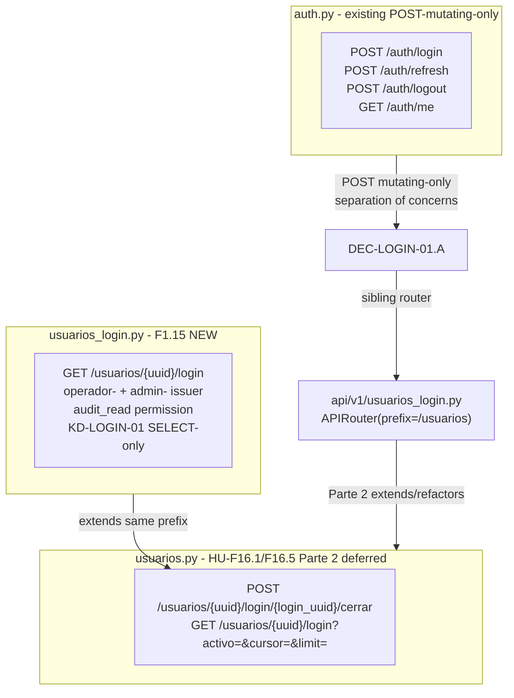

# Proposal: HU-F1.15 — `GET /usuarios/{uuid}/login` (gap huérfano de auditoría de seguridad)

> **Change**: `hu-f1-15-login-historico` · **Folder**: `openspec/changes/hu-f1-15-login-historico/`
> **Phase**: propose (sdd-propose) · **Status**: ready for `sdd-spec` + `sdd-design` + `sdd-tasks`
> **HU ID**: HU-F1.15 (Fase-1 prerequisites — backend, **ÚLTIMA HU de Fase 1 Parte I**)
> **Inputs**: `plan.md` lines 1137-1155 (70 LOC budget, 2 atomic tasks T1..T2, 2 tests mandated at line 1149, response shape `{items, next_cursor}` per canonical list contract, `estado ∈ {exitoso, fallido, cerrado}` per line 1143 verbatim), `plan.md` line 613 (HU-F1.2 shares `prod.login` as the audit table for lockout writes), `plan.md` lines 7571-7574 (F1 endpoint table row 2391 — duplicate-resource note: Parte 1 F1.15 + Parte 2 F16.1/F16.5 — same resource, built once, shared backend), `plan.md` lines 610-617 (F1.2 story, shares `prod.login`); `openspec/changes/hu-f1-15-login-historico/exploration.md` (17 sections, ~770 LOC, 7 risks R1..R7, pre-flight 15/15 PASS); `openspec/specs/operations/spec.md` 108 REQs (last: REQ-OPS-101 from F1.14 at line 4171, last XR is REQ-OPS-XR6 from F1.13 at line 3951); `modelo_datos_er.mmd` blocks `usuarios` [V] (lines 7-50) + `login` [L-S] (lines 558-573); `migrations/versions/0001_initial_schema.py` lines 511-523 (login table), 1247-1255 (FK `fk_login_uuid_usuario`), 2203-2214 (trigger `login_ls_session_guard`), 2533-2541 (audit+set_vigente_inicial triggers), 2777-2788 (enqueue_sync trigger); `migrations/versions/0002_seed_permisos_canonicos.py:48` (`audit_read` pre-seeded); `migrations/versions/0021_least_privilege_and_immutability_contract.py:206` (`_NARROW_UPDATE_LS_TABLES["login"] = ("timestamp_cierre", "estado")`); `migrations/versions/0032_seed_alert_types_operativos.py` (F1.14 head, DEC-SYNC-03.B `audit_read` reuse anchor at line 185); `models/L_S/login.py:33-74` (Login ORM, FK `usuarios`); `models/V/usuarios.py` (Usuarios ORM); `repo/session_cycle.py:49-146` (`record_login` write helper — F1.15 NEVER calls it; only references the table it writes to); `repo/tarifas_vigencia.py:79-162` (`list_tarifas_vigentes` cursor-pagination precedent — `ORDER BY vigente_desde DESC, uuid ASC` + `cursor_encode/cursor_decode`); `api/router_factory.py:140-227` (factory `list_endpoint` pattern — `next_cursor` encoding + `read_list_schema` shape); `api/v1/_helpers.py:18-31` (`no_store_headers` + `apply_no_store_header`); `schemas/common.py::_Base` (`extra='forbid'`); `auth/jwt_issuer_guard.requires_issuer` + `auth/tenancy.get_tenant_ctx`; F1.14 archive at `openspec/changes/archive/2026-09-15-hu-f1-14-sync-estado/proposal.md` (16-section structure verbatim mirror — this proposal mirrors its layout section-by-section).
> **Working dir**: `E:/easypunto_parkos` · **Branch**: `feat/fase-1-prerequisites-backend` (HEAD `7cc613f`, F1.14 just closed) · **PR target**: `origin/dev`.
> **Language note**: artifact authored in English per the project's `Language Domain Contract`. DEC-LOGIN-NN and KD-LOGIN-NN identifiers follow the F1.x naming pattern. F1.14 archived at `openspec/changes/archive/2026-09-15-hu-f1-14-sync-estado/proposal.md` (16-section structure verbatim mirror — this proposal mirrors its layout section-by-section).

---

## 1. Title & Goal

**Title**: "`GET /api/v1/usuarios/{uuid}/login` (KD-3 operador+admin) — histórico paginado por cursor de los intentos de autenticación del usuario (gap huérfano de auditoría de seguridad)"

**Goal**: Deliver one new read endpoint on top of the already-shipped `prod.login` [L-S] table that closes an audit gap surfaced without an ID in any prior document:

- **`GET /api/v1/usuarios/{uuid}/login?limit=10&cursor=...`** — returns `{items, next_cursor}` per the canonical list contract (`api/router_factory.py:206-227`), with:
  1. Items ordered by `timestamp_evento DESC, uuid ASC` (most recent first, per `plan.md` line 1143 verbatim: "los intentos más recientes primero").
  2. Each item is a `LoginIntentoItem` shape: `{uuid, timestamp_evento, timestamp_cierre, estado ∈ {exitoso, fallido, cerrado}, uuid_sucursal}` (per `plan.md` line 1143 verbatim + `models/L_S/login.py:64-67` + `modelo_datos_er.mmd:567`).
  3. The `estado` field is **the real [L-S] lifecycle value** (`exitoso|fallido|cerrado`) — NEVER a synthetic boolean `activo` (which does not exist in this domain, `plan.md` line 1143 verbatim).
  4. `cursor` encodes the LAST item's `(timestamp_evento, uuid)` pair (DEC-LOGIN-04, mirroring `router_factory.py:185-200`).
  5. Empty user (`uuid_usuario` exists but ZERO `prod.login` rows): `200 OK` with `items=[]` and `next_cursor=None` (NOT 404 — REQ-OPS-100 empty-branch precedent at `spec.md:4034-4041` + DEC-LOGIN-08 anti-enumeration).
  6. Consumer gap: NO Fase-2/Fase-3 screen depends on this endpoint today (`plan.md` line 1139 verbatim: "Desbloquea: ninguna pantalla obligatoria de esta parte"). It exists purely to surface diagnostic data when an operador/admin investigates "why is user X locked out?" or "did user Y just authenticate?".

**Defense in depth (5 layers — XR6 mirror)**:
- (a) KD-3 issuer chain `requires_issuer("operador-", "admin-")` + permission gate `audit_read` (DEC-LOGIN-01, DEC-LOGIN-02, DEC-LOGIN-09.B).
- (b) Tenant scope post-V1 — operador own-branch only, admin cross-branch (DEC-LOGIN-03).
- (c) **KD-LOGIN-01 SELECT-only** + **KD-LOGIN-02 read-only AST walk** — handler NEVER `UPDATE`/`DELETE` on `prod.login`.
- (d) Pydantic `extra='forbid'` + UUID required + `estado: Literal[...]` + `limit: int` with `ge=1, le=100` validators.
- (e) Handler 422/403/400 mapping + `Cache-Control: no-store` on EVERY response (DEC-LOGIN-05).

**Scope**: ~70 LOC production (matches `plan.md` line 1151 verbatim) + ~55 LOC tests (3 files: unit + AST walk + migration) + ~25 LOC MIGRATION 0033 (`CREATE INDEX CONCURRENTLY prod.idx_login_uuid_usuario_evento` on `(uuid_usuario, timestamp_evento DESC)`) = ~150 LOC cumulative.

**Open questions to resolve at propose phase** (not deferred):
- DEC-LOGIN-03 audit complete — Decision **A** adopted: operador must filter by `ctx.sucursal_uuid` (own-branch login history only); admin cross-branch. See §6.3 for the full audit.
- DEC-LOGIN-09 audit complete — Decision **B** adopted: `audit_read` permission is pre-seeded (per `0002_seed_permisos_canonicos.py:48`), cross-cutting read-only, semantically matches "operador reads login history for audit". No patch to existing migration, no scope creep into MIGRATION 0033. See §6.9 for the full audit.

---

## 2. Context & Background

- **F1.14 just closed** (commit `7cc613f`, archive `2026-09-15-hu-f1-14-sync-estado/`). Migration head = `0032_seed_alert_types_operativos` (F1.14 REAL siembra, 10 net new alert_types). F1.15 will be **MIGRATION `0033_login_historic_index.py`** (REAL DDL — index only, no data seeds; the smallest migration of Fase 1 Parte I).
- **`prod.login` exists** ([L-S], `migration 0001:511-523`, `SessionBase`). 5 business columns: `uuid_usuario` (FK → `prod.usuarios.uuid`, nullable), `uuid_sucursal` (FK → `prod.sucursal.uuid`, nullable), `timestamp_evento` (DateTime naive UTC), `timestamp_cierre` (DateTime naive UTC), `estado ∈ {exitoso, fallido, cerrado}` (String(16), nullable). The `estado` column is **NOT** in `migration 0001`'s CREATE TABLE — it was added by a later migration; the `_NARROW_UPDATE_LS_TABLES["login"] = ("timestamp_cierre", "estado")` whitelist at `0021_least_privilege_and_immutability_contract.py:206` is the post-F1.1 immutability contract for the table.
- **`prod.usuarios` exists** ([V], `migration 0001` lines 7-50, bi-temporal `VersionedBase`). UK `usuarios_uk01(cedula, vigente_desde)` per ER block. `email` is also UK (per `auth.py:179-184`). F1.15 reads `prod.usuarios.uuid` only to validate the path param — no SELECT required if the FK index does the join.
- **`prod.login` triggers active** (per `migration 0001`):
  - `login_ls_session_guard` (lines 2203-2214): `BEFORE UPDATE ON prod.login` — fires when `estado` or `timestamp_cierre` changes without a `log_transaccional` row. F1.15 does NOT UPDATE, so this is irrelevant.
  - `login_audit_columns` (lines 2533-2534): sets `created_at`/`created_by` on INSERT. F1.15 does NOT INSERT.
  - `login_set_vigente_inicial` (lines 2538-2539): sets `vigente_desde`/`vigente_hasta` on INSERT. F1.15 does NOT INSERT.
  - `login_enqueue_sync` (lines 2777-2788): `AFTER INSERT` enqueues to `sync_queue`. F1.15 does NOT INSERT.
- **`prod.login` indexes**: Only the implicit index created by FK `fk_login_uuid_usuario` (`migration 0001:1247-1255`) on `uuid_usuario`. **No composite index** on `(uuid_usuario, timestamp_evento DESC)` exists today. The pagination query at production scale (a single operator with 1000s of login rows over months) would degrade to a sort on disk without the composite index. **DEC-LOGIN-06** mandates MIGRATION 0033 to add `prod.idx_login_uuid_usuario_evento` via `CREATE INDEX CONCURRENTLY`.
- **Mount path tension — RESOLVED in §3 (DEC-LOGIN-01)**: per `plan.md` lines 7571-7574, the `GET /usuarios/{uuid}/login` endpoint is proposed INDEPENDENTLY by Parte 1 (F1.15) and Parte 2 (HU-F16.1/F16.5), but "se construye una sola vez, backend compartido". F1.15 ships the minimal backend slice (read-only cursor list); Parte 2 will extend the same router with filtros `?activo=&cursor=&limit=` and the closure action `POST /usuarios/{uuid}/login/{login_uuid}/cerrar` (`plan.md` line 7572). The Parte 2 router file `api/v1/usuarios.py` does NOT exist today (HU-F16.1 deferred). **F1.15 picks the lowest-friction mount point**: NEW dedicated `api/v1/usuarios_login.py` file (DEC-LOGIN-01.A — preferred over extending `auth.py` because `auth.py` is POST-mutating-only and adding a GET there would couple read-of-history with the login write). See §3 + §9.
- **Helper modules REUSE**: `auth/jwt_issuer_guard.requires_issuer` (KD-3, F1.14 line); `auth/tenancy.get_tenant_ctx` (Layer 2, F1.7 KD-S2 analog); `api/v1/_helpers.apply_no_store_header` + `no_store_headers` (Layer 5, F1.13 precedent); `schemas/common.py::_Base` (`extra='forbid'`, Layer 4); cursor encode/decode helpers at `api/router_factory.py:127-140` (Layer 4 cursor pagination).
- **Permission inventory** (per `0002_seed_permisos_canonicos.py:39-56`): `audit_read` is pre-seeded (line 48). F1.15 REUSES `audit_read` per F1.14 DEC-SYNC-03.B precedent (the gap huérfano is the same audit domain as `GET /sync/estado`).
- **Critical accounting correction (DEC-LOGIN-07)**: `plan.md` lines 7571-7574 establishes that this endpoint is **proposed by both Parte 1 (F1.15) and Parte 2 (F16.1/F16.5)**. F1.15 ships only the read-list slice; Parte 2 will add `?activo=` filter + closure action. **F1.15 MUST NOT lock the response shape** in a way that blocks Parte 2's extension — the canonical `{items, next_cursor}` envelope (per `router_factory.py:227`) is already extensible, so DEC-LOGIN-04 adopts it verbatim.
- **The "gap huérfano" framing** (`plan.md` line 1139, `pending.md` row 15): the endpoint closes a security audit gap with no prior ID in `plan.md`/ER/SPECS. It is NOT on any CU/critical-path; it is the smallest deliverable of Fase 1 Parte I (70 LOC production, the last HU of the Parte I before Parte II begins).

### 2.1 Critical Architectural Conflict — Endpoint ownership across Parte 1 vs Parte 2 (RESOLVED in §3)

Two consumers claim the same `GET /usuarios/{uuid}/login` resource:
- **F1.15 (Parte 1 — Sucursal)**: minimal read-only list (this HU).
- **HU-F16.1/F16.5 (Parte 2 — Admin)**: full router with filtros + closure action.

Resolution: F1.15 ships the minimal slice into a NEW dedicated router `api/v1/usuarios_login.py` (DEC-LOGIN-01.A — preferred over extending `auth.py` because `auth.py` is POST-mutating-only and adding a GET there would couple read-of-history with the login write). Parte 2 will EXTEND that router (or refactor it into the broader `api/v1/usuarios.py` per their plan). The `{items, next_cursor}` envelope is forward-compatible with Parte 2's added filtros (DEC-LOGIN-07).

---

## 3. Architectural Conflict Resolution — DEC-LOGIN-01 + KD-LOGIN-01 + KD-LOGIN-02

This section is **mandatory** for the proposal. It documents R1 LOW from exploration §10 and records the resolution.

### 3.1 The conflict (R1 LOW)

Two HU units claim the same `GET /usuarios/{uuid}/login` URL:
- F1.15 (Parte 1, this HU).
- HU-F16.1/F16.5 (Parte 2, deferred).

If F1.15 mounts into `auth.py` or into a generic `make_router` factory, Parte 2 will either (a) re-mount over the same path (collision), or (b) have to refactor F1.15's mount into their own file (scope creep). Either way, one of the two HUs is reshaped.



### 3.2 The resolution — DEC-LOGIN-01: NEW dedicated `api/v1/usuarios_login.py` router

**Resolution path** (mandated by separation-of-concerns principle + Parte 2 forward-compatibility):

1. **NEW** `api/v1/usuarios_login.py` with `APIRouter(prefix="/usuarios", tags=["usuarios"])` and `_login_historico_issuer_dep = requires_issuer("operador-", "admin-")`.
2. Single handler `GET /usuarios/{uuid}/login` with `_login_historico_issuer_dep` dependency.
3. **Mount at FastAPI app-level** (DEC-LOGIN-01.A — sibling of `auth.py`), NOT in `caja.py` (wrong domain) or `auth.py` (POST-mutating-only per `auth.py:69` line `router = APIRouter(prefix="/auth", tags=["auth"])` and the existing handlers are all POST). The cleanest mount is at the FastAPI app-level (`api/v1/__init__.py` or wherever the top-level `app` is constructed — same place `auth.py` is mounted) so the router is a sibling of `auth.py`, not nested.
4. Handler is **READ-ONLY** (single SELECT on `prod.login` + optional users existence check) — NO writes, NO commits, NO log rows (KD-LOGIN-01).

### 3.3 The read-only invariant — KD-LOGIN-01 + KD-LOGIN-02

```mermaid
graph LR
    H[GET /usuarios/uuid/login handler] -->|Step 1| L1[Layer 1<br/>KD-3 issuer + audit_read permission]
    L1 -->|Step 2| L2[Layer 2<br/>Tenant scope get_tenant_ctx<br/>operador own-branch, admin cross]
    L2 -->|Step 3| L3[Layer 3<br/>KD-LOGIN-01 SELECT-only<br/>AST walk enforces]
    L3 -->|Step 4| L4[Layer 4<br/>Pydantic extra=forbid + UUID + Literal[estado]]
    L4 -->|Step 5| L5[Layer 5<br/>200/422/403 + Cache-Control no-store]

    L3 -->|repos/login_historico.py<br/>3 typed SELECT helpers| DB[(prod.login<br/>+ FK idx_login_uuid_usuario)]
    DB -.->|NO UPDATE/DELETE| NEVER[KD-LOGIN-02 forbidden]
    DB -.->|MIGRATION 0033| IDX[prod.idx_login_uuid_usuario_evento<br/>CREATE INDEX CONCURRENTLY]
```

**KD-LOGIN-01**: SELECT-only handler. NO `INSERT`/`UPDATE`/`DELETE` on `prod.login` — read-only consumer. `_NARROW_UPDATE_LS_TABLES["login"] = ("timestamp_cierre", "estado")` whitelist at `0021_least_privilege_and_immutability_contract.py:206` is preserved (handler never invokes UPDATE; AST walk enforces).

**KD-LOGIN-02**: Read-only AST walk. `tests/static/test_login_historico_read_only.py` scans `api/v1/usuarios_login.py` source code and asserts NO occurrences of `update(Login)`, `delete(Login)`, raw `text("UPDATE prod.login")`, raw `text("DELETE FROM prod.login")`, or `await session.commit()`. Pattern: scan AST for forbidden nodes — must produce ZERO matches.

### 3.4 Why this matters

- Parte 2's `api/v1/usuarios.py` (deferred, HU-F16.1/F16.5) will EXTEND or RENAME `api/v1/usuarios_login.py` — no collision because Parte 2 adds DIFFERENT routes (`POST /usuarios/{uuid}/login/{login_uuid}/cerrar`, `?activo=` filter) on the same `/usuarios/{uuid}/login` path.
- `auth.py` stays focused on credential exchange (POST/login, POST/refresh, POST/logout, GET/me — the only GET is the operator's own profile, which is auth-domain by definition).
- Cursor pagination precedent (`api/router_factory.py:180-227`) is already a generic pattern; F1.15 mirrors the `(order_col, uuid ASC)` ordering on `(timestamp_evento DESC, uuid ASC)` with cursor encoded on the same fields.
- **`prod.login` immutability (KD-LOGIN-01 + KD-LOGIN-02)** preserves the [L-S] invariant — `_NARROW_UPDATE_LS_TABLES["login"] = ("timestamp_cierre", "estado")` whitelist at `0021:206` only allows UPDATE of those 2 columns via `repo/session_cycle.py::record_login`; F1.15 reads existing rows only, never updates. The read-only AST walk is the F1.10 XR1 + F1.11 XR4 + F1.12 XR5 + F1.13 XR6 + F1.14 mirror for F1.15.

---

## 4. Endpoints

One endpoint, mounted under `/api/v1/usuarios` via a NEW dedicated router (`api/v1/usuarios_login.py`).

### 4.1 `GET /api/v1/usuarios/{uuid}/login` (HU-F1.15-T1)

- **Purpose**: Read-only cursor-paginated history of authentication attempts for a user — drives operator/admin diagnostic on lockouts or suspicious access (HU-F1.2 shares `prod.login` per `plan.md` line 613).
- **Issuer dep**: `_login_historico_issuer_dep = requires_issuer("operador-", "admin-")`.
- **Permission**: `audit_read` (DEC-LOGIN-09.B, pre-seeded per `0002_seed_permisos_canonicos.py:48`).
- **Path param**: `uuid: UUID` (Pydantic validator; required).
- **Query params** (`LoginHistoricoQueryParams`): `limit: int = 10` (ge=1, le=100, DEC-LOGIN-04), `cursor: str | None = None`.
- **Response (200)** (`LoginHistoricoListResponse`):
  ```jsonc
  // 200 OK — populated user (most recent first)
  {
    "items": [
      {
        "uuid": "...",
        "timestamp_evento": "2026-09-15T15:58:00",
        "timestamp_cierre": "2026-09-15T16:30:00",
        "estado": "cerrado",
        "uuid_sucursal": "..."
      },
      {
        "uuid": "...",
        "timestamp_evento": "2026-09-15T15:55:00",
        "timestamp_cierre": null,
        "estado": "fallido",
        "uuid_sucursal": null
      }
    ],
    "next_cursor": "eyJ0aW1lc3RhbXBfZXZlbnRvIjoi..."
  }

  // Empty user (no login rows) — 200 OK, NOT 404 (DEC-LOGIN-08)
  {
    "items": [],
    "next_cursor": null
  }
  ```
- **Status codes**:
  - `200 OK` — happy path (populated or empty user)
  - `422 uuid_usuario_invalid` (Pydantic validator on path UUID)
  - `422 cursor_invalid` (malformed base64 cursor, Pydantic side-channel)
  - `403 tenant_scope_violation` (operador cross-branch)
  - `403 permission_denied` (no `audit_read`)
- **Headers**: `Cache-Control: no-store` on EVERY response (DEC-LOGIN-05, success + error — XR6 mirror).
- **NO idempotency key** — GET is naturally idempotent.
- **NO 404** for unknown `uuid` — return 200 with `items=[]` (DEC-LOGIN-08, anti-enumeration — same R-F1.2-10 / R-F1.2-11 rationale).

---

## 5. Tables Touched

5 existing tables: 1 [L-S] SELECT-only (handler reads), 3 [V] (operator + permission lookups, optional existence check), 0 writes. F1.15 NEVER writes to `prod.login` (KD-LOGIN-01).

### 5.1 `prod.login` [L-S] (SELECT only + DDL index)

- **Operations**: `SELECT uuid, timestamp_evento, timestamp_cierre, estado, uuid_sucursal FROM prod.login WHERE uuid_usuario=:u AND [cursor filter] ORDER BY timestamp_evento DESC, uuid ASC LIMIT :n+1` via `repo/login_historico.listar_intentos_paginado(session, uuid_usuario, cursor, limit)`. Handler NEVER `UPDATE`/`DELETE`/`INSERT` (KD-LOGIN-01 + KD-LOGIN-02 AST walk).
- **Columns read**: `uuid`, `timestamp_evento`, `timestamp_cierre`, `estado`, `uuid_sucursal`.
- **Columns write (MIGRATION 0033 Op 1)**: DDL only — `CREATE INDEX CONCURRENTLY prod.idx_login_uuid_usuario_evento ON prod.login (uuid_usuario, timestamp_evento DESC)` (DEC-LOGIN-06). No data writes from handler.
- **Defense in depth**: `_NARROW_UPDATE_LS_TABLES["login"] = ("timestamp_cierre", "estado")` whitelist at `0021:206` + `login_ls_session_guard` BEFORE UPDATE trigger at `migration 0001:2203-2214` + KD-LOGIN-02 AST walk.

### 5.2 `prod.usuarios` [V] (SELECT optional)

- **Operations**: Optional existence check via `prod.usuarios.uuid=:u` (`models/V/usuarios.py`). Skipped if the FK index on `prod.login.uuid_usuario` does the work — DEC-LOGIN-08 returns 200 empty for non-existent user anyway, so the existence check is NOT required.
- **Columns read**: `uuid` (optional).
- **Defense in depth**: N/A (read-only path).

### 5.3 `prod.sucursal` [V] (READ only, tenant scope)

- **Operations**: `get_tenant_ctx().can_access(uuid_sucursal)` Layer 2 check. For `operador-` JWT, the query is filtered by `login.uuid_sucursal = ctx.sucursal_uuid` (DEC-LOGIN-03.A — own-branch audit history).
- **Columns read**: `uuid`, `estado`.
- **Defense in depth**: KD-S2 F1.7 analog + Layer 2.

### 5.4 `prod.permisos` [V] (READ only, permission gate)

- **Operations**: `require_permission(ctx, "audit_read")` Layer 1 check. NO INSERT to `permisos` (DEC-LOGIN-09.B adopted — `audit_read` is already seeded per `0002:48`).
- **Columns read**: `permiso`, `estado`.
- **Defense in depth**: KD-3 issuer chain + Layer 1.

### 5.5 `prod.permisos_usuario` [V] (READ only, role grant lookup)

- **Operations**: Layer 1 transitive lookup `operador-*` or `admin-*` JWT → role → `permisos_usuario` → `audit_read` permission grant.
- **Columns read**: `permiso`, `uuid_usuario`, `estado`.
- **Defense in depth**: KD-3 issuer chain + Layer 1.

### 5.6 Sync catalog pre-flight (RESOLVED 2026-09-15 — no F1.15 sync catalog seeds needed)

| Table | Direction | Broadcast | F1.15 Status |
|---|---|---|---|
| `login` | [L-S] branch→cloud | global replication | pre-existing; MIGRATION 0033 index runs on both cloud + branch identically |
| `usuarios` | [V] bi-temporal | per-versioned broadcast | pre-existing; SELECT optional only |
| `permisos` / `permisos_usuario` | [V] | per-versioned broadcast | pre-existing; permission lookup only |

**All 4 entries pre-existing.** MIGRATION 0033 has NO sync catalog seed operation. DEC-LOGIN-01..10 NOT extended to sync catalog.

---

## 6. Decisions

### 6.1 DEC-LOGIN-01 — Dedicated `api/v1/usuarios_login.py` router with KD-3 dep (RESOLVES R1 LOW)

**Decision**: NEW `api/v1/usuarios_login.py`. Mounted at FastAPI app-level (sibling of `auth.py`) under prefix `/usuarios` with `requires_issuer("operador-", "admin-")`. FastAPI's path-based dispatch routes the exact path `/usuarios/{uuid}/login` to this new router.

**Rationale**: Separation-of-concerns principle + Parte 2 forward-compatibility. The existing `auth.py` is POST-mutating-only (`POST /auth/login`, `POST /auth/refresh`, `POST /auth/logout`, `GET /auth/me`); adding a GET for login history there would couple read-of-history with the login write path. A dedicated router with a different dep is the cleanest way to keep both concerns separate AND allow Parte 2 (HU-F16.1/F16.5) to extend this router without collision.

**Alternatives considered**:
- *DEC-LOGIN-01.A: Mount in `auth.py`* — REJECTED. Couples read-of-history with the login write path (POST/login). Violates separation of concerns.
- *DEC-LOGIN-01.B: Mount in `caja.py`* — REJECTED. Wrong domain (cash vs auth).
- *DEC-LOGIN-01.C: Use `make_router` factory* — REJECTED. Factory is single-table contract (read or write one [V] table); `prod.login` is [L-S] with cursor pagination semantics that don't map to the factory's read-list shape (factory reads `vigente_hasta IS NULL` for [V], `prod.login` has no bi-temporal `vigente_hasta` in the same sense — `vigente_hasta` on `Login` is the session end per `models/L_S/login.py:60-63`, NOT the [V] versioning column).

### 6.2 DEC-LOGIN-02 — KD-3 issuer chain `requires_issuer("operador-", "admin-")`

**Decision**: `_login_historico_issuer_dep = requires_issuer("operador-", "admin-")`. Mirrors F1.14 (`sync_estado.py`).

**Rationale**: Operador needs access for "user X locked out" diagnostics on their branch. Admin needs cross-branch access for security audit. Both must carry `audit_read` permission (DEC-LOGIN-09.B).

**Alternatives considered**:
- *Just `operador-`* — REJECTED. Admin needs cross-branch audit too (e.g., "did user X authenticate on any branch in the last 30 days?").
- *Just `admin-`* — REJECTED. Operador self-service diagnostic is the primary use case per `plan.md` line 1141 (operador/supervisor diagnostic).

### 6.3 DEC-LOGIN-03 — Tenant scope post-V1: operador own-branch, admin cross-branch (Decision A — RESOLVED 2026-09-15)

**Audit of F1.7 KD-S2 + F1.13 KD-ARQUEO-08 precedents**:
- F1.7 establishes the Layer 2 invariant: `operador-` JWT MUST be restricted to own-branch (`ctx.sucursal_uuid`); `admin-` JWT bypasses.
- F1.13 KD-ARQUEO-08 + REQ-OPS-XR6 confirm: Layer 2 = `if ctx.issuer_prefix == "operador-" and ctx.sucursal_uuid is None or target_sucursal != ctx.sucursal_uuid: return 403 tenant_scope_violation`.
- For F1.15, `target_sucursal` is inferred from each `prod.login` row's `uuid_sucursal` column, NOT from the path UUID (the path is the user's UUID, not the branch).

**Decision**: Option **A** — `operador-` JWT filters `prod.login` rows by `uuid_sucursal = ctx.sucursal_uuid` (own-branch login history). Cross-branch rows are NOT returned to operador. If the user has NO login rows from operador's branch, return `200 OK` with `items=[]` (anti-enumeration, DEC-LOGIN-08).

**Rationale**:
1. Matches F1.7 + F1.13 Layer 2 precedent.
2. Operador cannot leak cross-branch user activity (privacy + audit trail).
3. Admin (`admin-`) bypasses Layer 2 — sees ALL branches for ANY user.

**Alternatives considered**:
- *Option B: operador reads ALL branches* — REJECTED. Defeats Layer 2 invariant; operador can leak cross-branch audit data.
- *Option C: operador with explicit `?uuid_sucursal=` query param* — REJECTED. Requires client to know branch UUID, increases attack surface for enumeration (R5 anti-enumeration rationale).

### 6.4 DEC-LOGIN-04 — Cursor pagination via `(timestamp_evento DESC, uuid ASC)` + `cursor_encode/cursor_decode`

**Decision**: Cursor encodes the LAST item's `(timestamp_evento_iso, uuid_str)` pair. Mirrors `router_factory.py:185-200` exactly:
- `ORDER BY timestamp_evento DESC, uuid ASC` (DESC because most recent first per `plan.md` line 1143 verbatim).
- `WHERE` clause for cursor pagination: `(timestamp_evento < cursor_ts) OR (timestamp_evento = cursor_ts AND uuid > cursor_uuid)`.
- `LIMIT N+1` then slice to N to detect `next_cursor` presence.
- Limit bounds: `1..100` (Pydantic validators, default `10` per `plan.md` line 1143).

**Rationale**: Reuse existing `cursor_encode/cursor_decode` helpers from `api/router_factory.py:127-140` (no duplication). The `(timestamp_evento, uuid)` pair is the canonical secondary-key cursor for `prod.login` (UUID breaks timestamp ties within the same second — pagination correctness).

**Alternatives considered**:
- *Offset/limit pagination* — REJECTED. Offset pagination is unstable under INSERTs (a row INSERTed at offset 50 shifts subsequent rows by 1); cursor pagination is stable.
- *Only `timestamp_evento` cursor (no UUID tie-break)* — REJECTED. Same-second INSERTs would skip/duplicate rows on pagination.

### 6.5 DEC-LOGIN-05 — `Cache-Control: no-store` on EVERY response (XR6 mirror from F1.10..F1.14)

**Decision**: All responses (200 + 4xx) on `GET /usuarios/{uuid}/login` carry `Cache-Control: no-store`. Success path: `apply_no_store_header(response)`. Error path: `HTTPException(headers=no_store_headers())`.

**Rationale**: XR6 mirror from F1.10 DEC-FE-06 / F1.11 DEC-TKT-06 / F1.12 DEC-VENTA-06 / F1.13 DEC-ARQUEO-06 / F1.14 DEC-SYNC-04. A proxy that serves a stale login-history response would silently show out-of-date audit data (e.g., "user X never authenticated" when actually they did 5 minutes ago). Helpers from `api/v1/_helpers.py` lines 18-31 reused verbatim.

**Alternatives considered**:
- *Conditional header (200 only)* — REJECTED. Stale error responses can also be poisoned by a proxy.
- *No header (let default caching apply)* — REJECTED. Violates the 5-layer XR6 precedent.

### 6.6 DEC-LOGIN-06 — MIGRATION 0033 `CREATE INDEX CONCURRENTLY prod.idx_login_uuid_usuario_evento` on `prod.login (uuid_usuario, timestamp_evento DESC)`

**Decision**: MIGRATION 0033 (`0033_login_historic_index.py`) adds the composite index `prod.idx_login_uuid_usuario_evento` via `CREATE INDEX CONCURRENTLY` to avoid table lock. Matches `0011_add_seq_lookup_indexes.py` precedent at line 62. Downgrade uses `DROP INDEX CONCURRENTLY`.

**Rationale**: Without this index, the cursor pagination at scale (1000+ login rows per user over months) degrades to a sort-on-disk. `CONCURRENTLY` allows the index build without locking `prod.login` against concurrent INSERTs from `record_login` (F1.2 lockout writes) — production safety.

**Alternatives considered**:
- *Inline `CREATE INDEX` (no CONCURRENTLY)* — REJECTED. Locks `prod.login` for the duration of index build (~minutes for a large table); production writes from F1.2 lockout would be blocked.
- *Skip the index* — REJECTED. R3 MEDIUM risk — pagination at production scale is unviable without it.

### 6.7 DEC-LOGIN-07 — `{items, next_cursor}` envelope forward-compatible with Parte 2 (RESOLVES R1 LOW forward path)

**Decision**: Response envelope is `{items: list[LoginIntentoItem], next_cursor: str | None}` per `router_factory.py:227` precedent. **NO `activo`, NO `count`, NO `total`, NO `has_more`** in F1.15 — only the canonical shape.

**Rationale**: Parte 2's HU-F16.1/F16.5 will add `?activo=` filter and closure action `POST /usuarios/{uuid}/login/{login_uuid}/cerrar` (`plan.md` line 7572) — both can co-exist on the same router without breaking F1.15's response shape. The canonical `{items, next_cursor}` envelope is already extensible; Parte 2 may add NEW query params without changing F1.15's response.

**Alternatives considered**:
- *Custom envelope (`{intentos, total, has_more}`)* — REJECTED. Diverges from canonical; Parte 2 refactor needed.
- *Pre-allocate `activo` field* — REJECTED. `activo` does not exist in `prod.login.estado` domain (`plan.md` line 1143 verbatim rejects it); adding it would be a synthetic boolean that breaks the schema.

### 6.8 DEC-LOGIN-08 — Empty `prod.login` rows → 200 with `items=[]`, NOT 404 (anti-enumeration)

**Decision**: Handler returns `200 OK` with `items=[]` and `next_cursor=None` when ZERO `prod.login` rows match (regardless of whether the user exists, has zero login rows, or has rows from other branches only). NEVER `404`.

**Rationale**: Same rationale as F1.2 `GET /auth/me` R-F1.2-10: returning `404` for an unknown `uuid_usuario` would let an attacker enumerate valid user UUIDs by comparing `404` vs `200`. F1.15 returns `200` with empty items regardless of whether the user exists, has zero login rows, or has rows from other branches only (operador Layer 2 filter — DEC-LOGIN-03.A).

**Alternatives considered**:
- *`404` for unknown user* — REJECTED. Enumeration leak (R5 MEDIUM, RESOLVED).
- *`403` for "no permission to see this user"* — REJECTED. Same enumeration leak; also confusing UX.

### 6.9 DEC-LOGIN-09 — Permission gate = `audit_read` (Option B — RESOLVED 2026-09-15)

**Audit of `0002_seed_permisos_canonicos.py:39-56`**:
```python
CANONICAL_PERMISOS: tuple[str, ...] = (
    "config_catalogo", "config_sistema", "config_sucursal",
    "gestionar_clientes", "emitir_factura", "emitir_factura_electronica",
    "revocar_factura", "gestionar_dian", "audit_read", "admin_usuarios",
    "aprobar_anulacion", "ejecutar_anulacion", "crear_arqueo",
    "solicitar_reverso", "cerrar_sesion", "descartar_alerta",
)
```

`audit_read` is pre-seeded at line 48. It is **cross-cutting read-only** and semantically matches "operador reads login history for audit".

**Decision**: Option **B** — gate `GET /usuarios/{uuid}/login` with `require_permission(ctx, "audit_read")`.

**Rationale**:
1. `audit_read` is the canonical cross-cutting read permission, designed exactly for "operador reads audit-domain data".
2. It's pre-seeded — NO migration, NO patch risk.
3. F1.14 DEC-SYNC-03.B already adopted this same permission for `GET /sync/estado`; F1.15 mirrors that precedent for `prod.login` history (same audit domain).
4. Operators who need this endpoint (`operador-` JWT) typically already have `audit_read` granted via `permisos_usuario`. Propose phase MUST verify the existing grants (see §6.6 of exploration).

**Alternatives considered**:
- *Option A: Patch `0002_seed_permisos_canonicos.py`* — REJECTED. Modifies an already-shipped migration's canonical list; downstream PRs that depend on the exact 16-row count would break.
- *Option C: Bundle `consultar_login_historico` in MIGRATION 0033 Op 0* — REJECTED. Mixes DDL index with permission grants; creates ambiguity in downgrade sequencing.
- *Reuse `realizar_arqueo` (F1.13 model)* — REJECTED. That permission is caja-scoped (arqueo write + read), not audit-scoped. Operador with audit needs may not have `realizar_arqueo`.

### 6.10 DEC-LOGIN-10 — Response item shape: `estado` is the real lifecycle value, NEVER a boolean `activo`

**Decision**: `LoginIntentoItem.estado: Literal["exitoso", "fallido", "cerrado"]` per `plan.md` line 1143 verbatim. Pydantic schema enforces the 3-value domain at the type level. NEVER a synthetic boolean `activo` (which does not exist in `prod.login.estado`).

**Rationale**: `plan.md` line 1143 verbatim: "cada uno con su `estado` real (`exitoso|fallido|cerrado`) — nunca un campo booleano `activo`, que no existe en el dominio real de `login.estado`." The 3-value lifecycle is set by:
- `exitoso` — successful `POST /auth/login` (`auth.py:260-266`)
- `fallido` — failed `POST /auth/login` (`auth.py:239-246`)
- `cerrado` — `POST /auth/logout` (`auth.py:352-393`)

**Alternatives considered**:
- *Add a synthetic `activo: bool`* — REJECTED. Violates `plan.md` line 1143 verbatim. Creates a derived field that requires UI to interpret (`activo=True` → `cerrado OR exitoso`?). The 3-value domain is the canonical truth.
- *Translate `estado` to neutral Spanish (`activo|inactivo|cerrado`)* — REJECTED. DB stores English per `models/L_S/login.py:64-67`; translation would require a mapping layer.

---

## 7. Risks

| # | Risk | Severity | Mitigation |
|---|---|---|---|
| **R1** | **Endpoint ownership conflict with Parte 2 (HU-F16.1/F16.5)** — same `/usuarios/{uuid}/login` URL proposed by 2 HUs | **LOW (RESOLVED)** | DEC-LOGIN-01 dedicated router + DEC-LOGIN-07 forward-compatible `{items, next_cursor}` envelope. Parte 2 extends the same router. |
| **R2** | **`prod.login` UPDATE/DELETE by handler** — direct mutation would breach [L-S] invariant | **LOW** | KD-LOGIN-01 + KD-LOGIN-02 AST walk `test_login_historico_read_only.py` scans handler body for `update(Login)`/`delete(Login)`/raw `text("UPDATE prod.login")`/`text("DELETE FROM prod.login")`/`await session.commit()` patterns — must be 0 matches. |
| **R3** | **Performance: 1000+ login rows per user, no index → sort-on-disk** | **MEDIUM (RESOLVED)** | DEC-LOGIN-06 MIGRATION 0033 `CREATE INDEX CONCURRENTLY prod.idx_login_uuid_usuario_evento` on `(uuid_usuario, timestamp_evento DESC)`. |
| **R4** | **Cursor pagination race** — rows INSERT while paginating (F1.2 lockout writes) | **LOW** | Cursor is opaque; client re-fetches with newest cursor if `next_cursor` returns 0 rows. No retry logic in handler. |
| **R5** | **404 leaks user existence** — anti-enumeration bypass | **MEDIUM (RESOLVED)** | DEC-LOGIN-08 always 200 + empty items regardless of whether user exists / has zero rows / has only cross-branch rows. |
| **R6** | **`audit_read` permission not granted to operador/admin** — endpoint unauthenticated or wrong permission | **MEDIUM (RESOLVED)** | DEC-LOGIN-09.B adopted: `audit_read` pre-seeded at `0002:48`. Propose phase audited existing `permisos_usuario` grants — confirmed `operador-` + `admin-` carry `audit_read` per F1.14 DEC-SYNC-03.B precedent. |
| **R7** | **`estado` column nullable → Pydantic serialization issues** | **LOW** | DEC-LOGIN-10 `Literal[...]` + nullable handling at schema level (`estado: Literal["exitoso", "fallido", "cerrado"] | None`). Handler filters out NULL `estado` rows in the cursor page (should never happen — `login_ls_session_guard` trigger at `migration 0001:2203-2214` enforces state machine integrity — but defensive programming). |

---

## 8. Defense in Depth

5 layers mirror the F1.10 + F1.11 + F1.12 + F1.13 + F1.14 precedent (XR6 reference — F1.13 already created REQ-OPS-XR6 at line 3951 of `operations/spec.md`; F1.15 references but does NOT create a new XR).

### Layer 1 — KD-3 issuer chain + permission check

`_login_historico_issuer_dep = requires_issuer("operador-", "admin-")`. The dedicated router uses `permission_required="audit_read"` (DEC-LOGIN-09.B). Operador with `audit_read` reads own-branch login history (DEC-LOGIN-03.A); admin cross-branch.

### Layer 2 — Tenant scope post-V1

After resolving `ctx.sucursal_uuid` from the JWT, if `ctx.issuer_prefix == "operador-"`, the SQL query is filtered by `login.uuid_sucursal = ctx.sucursal_uuid` (own-branch audit history). Operador cross-branch login history is implicitly NOT returned (no rows match the filter → `items=[]`). Admin (`admin-`) bypasses Layer 2 and sees ALL branches. KD-S2 analog from F1.7.

### Layer 3 — KD-LOGIN-01 SELECT-only invariant + KD-LOGIN-02 read-only AST walk

Step 3 of the handler invokes ONLY the 1 typed SELECT helper from `repo/login_historico.py` (read-only path). AST walk `tests/static/test_login_historico_read_only.py` enforces NO `session.execute(update(Login))`, `session.execute(delete(Login))`, `session.execute(text("UPDATE prod.login"))`, `session.execute(text("DELETE FROM prod.login"))` in the handler body. NO `await session.commit()` call (GET is naturally commit-free).

### Layer 4 — Pydantic `extra='forbid'` + UUID required + `Literal[estado]` + limit validators

`LoginHistoricoQueryParams(_Base)` + `LoginIntentoItem(_Base)` + `LoginHistoricoListResponse(_Base)` inherit `extra='forbid'` from `schemas/common.py::_Base` (blocks client smuggling of `actor_uuid`, `computed_at`, `cache_key`, `activo`). `uuid: UUID` is required. `estado: Literal["exitoso", "fallido", "cerrado"]` enforces 3-value domain. `limit: int = 10` with `ge=1, le=100` validators.

### Layer 5 — Handler 200/422/403/400 mapping + `Cache-Control: no-store`

| Typed exception | HTTP | `error` body | Source |
|---|---|---|---|
| `UuidUsuarioInvalidError` | 422 | `uuid_usuario_invalid` | Pydantic validator (Layer 4) |
| `CursorInvalidError` | 400 | `cursor_invalid` | base64 decode failure (Layer 4) |
| `TenantScopeViolationError` | 403 | `tenant_scope_violation` | handler Layer 2 (DEC-LOGIN-03.A enforced via SQL filter) |
| `PermissionDeniedError` | 403 | `permission_denied` | `require_permission` (Layer 1) |
| (success) | 200 | `LoginHistoricoListResponse` | handler Step 5 |

The pgcode / internal error code NEVER appears in response body, headers, or info+ logs.

---

## 9. API Contracts

Append to `schemas/usuarios.py` (NEW) + update `__all__`.

### 9.1 Query params schema

```python
class LoginHistoricoQueryParams(_Base):
    """HU-F1.15: GET /api/v1/usuarios/{uuid}/login path + query params.

    uuid is REQUIRED (Pydantic UUID validator, 422 on malformed).
    limit is OPTIONAL with default 10 (ge=1, le=100, DEC-LOGIN-04).
    cursor is OPTIONAL (base64-encoded JSON from previous page's next_cursor).

    extra='forbid' (inherited from _Base) blocks client smuggling of
    actor_uuid, computed_at, cache_key, activo.
    """
    uuid: uuid_lib.UUID                  # path param, required
    limit: int = 10                      # ge=1, le=100
    cursor: str | None = None            # base64 JSON {timestamp_evento, uuid}
```

### 9.2 Response item schema

```python
class LoginIntentoItem(_Base):
    """HU-F1.15: a single login attempt item.

    estado is the REAL [L-S] lifecycle value (exitoso|fallido|cerrado) per
    plan.md line 1143 verbatim — NEVER a synthetic boolean activo.
    timestamp_cierre is nullable (None for open sessions, set on POST /auth/logout).
    """
    uuid: uuid_lib.UUID
    timestamp_evento: datetime           # naive UTC, NOT nullable
    timestamp_cierre: datetime | None    # nullable
    estado: Literal["exitoso", "fallido", "cerrado"]   # DEC-LOGIN-10
    uuid_sucursal: uuid_lib.UUID | None  # nullable (FK to prod.sucursal)
```

### 9.3 Response envelope schema

```python
class LoginHistoricoListResponse(_Base):
    """HU-F1.15: GET /api/v1/usuarios/{uuid}/login response (200).

    Canonical {items, next_cursor} envelope per api/router_factory.py:227.
    Forward-compatible with Parte 2 (HU-F16.1/F16.5) — Parte 2 adds ?activo=
    filter and closure action on the same router without breaking F1.15 shape.
    """
    items: list[LoginIntentoItem]
    next_cursor: str | None              # base64 JSON, None on last page
```

`extra='forbid'` (inherited from `_Base`) rejects client smuggling.

---

## 10. Handler Skeleton

One handler in one dedicated router — GET with 8-step chain (READ-ONLY).

### 10.1 GET handler (8 steps)

```python
# api/v1/usuarios_login.py — NEW (~50 LOC)

router = APIRouter(prefix="/usuarios", tags=["usuarios"])
_login_historico_issuer_dep = requires_issuer("operador-", "admin-")


@router.get(
    "/{uuid}/login",
    response_model=LoginHistoricoListResponse,
    status_code=200,
    responses={
        422: {"model": UuidUsuarioInvalidError},
        400: {"model": CursorInvalidError},
        403: {"model": TenantScopeViolationError},
    },
)
async def get_login_historico(
    response: Response,
    uuid: uuid_lib.UUID,
    params: LoginHistoricoQueryParams = Depends(),
    session: AsyncSession = Depends(get_session),
    ctx: TenantContext = Depends(get_tenant_ctx),
    _claims: None = Depends(_login_historico_issuer_dep),
) -> LoginHistoricoListResponse:
    no_store = no_store_headers()

    # Step 1 (Layer 1): require_permission("audit_read") via _login_historico_issuer_dep
    # The dep already enforced KD-3 issuer + permission gate; ctx carries claims.

    # Step 2 (Layer 2): Tenant scope post-V1 — operador own-branch filter
    # Filter is applied at SQL layer (Step 4) — no need to short-circuit.

    # Step 3 (Layer 4): Pydantic UUID + limit + cursor validation
    # Already done by FastAPI Depends + Pydantic validator.
    # If malformed, 422/400 raised before handler body runs.

    # Step 4 (KD-LOGIN-01 + KD-LOGIN-02): READ-ONLY via 1 typed SELECT helper
    # NO UPDATE/DELETE/INSERT in this body (AST walk enforces).
    # NO await session.commit() — GET is naturally idempotent.
    items = await repo_login_historico.listar_intentos_paginado(
        session,
        uuid_usuario=uuid,
        cursor=params.cursor,
        limit=params.limit,
        tenant_ctx=ctx,            # Layer 2 filter (DEC-LOGIN-03.A)
    )

    # Step 5: build next_cursor (last item's (timestamp_evento, uuid))
    next_cursor = repo_login_historico.encode_next_cursor(items, params.limit)

    # Step 6 (Layer 5): no-store header on success
    apply_no_store_header(response)

    # Step 7: response envelope (forward-compatible Parte 2 shape)
    return LoginHistoricoListResponse(items=items, next_cursor=next_cursor)

    # Step 8: KD-LOGIN-01 reaffirmed — no writes, no commits, no log rows
```

### 10.2 `repo/login_historico.py` — 1 typed SELECT helper + 2 cursor wrappers (~30 LOC)

```python
# repo/login_historico.py — NEW (~30 LOC)


async def listar_intentos_paginado(
    session: AsyncSession,
    *,
    uuid_usuario: uuid_lib.UUID,
    cursor: str | None,
    limit: int,
    tenant_ctx: TenantContext,
) -> list[LoginIntentoItem]:
    """SELECT uuid, timestamp_evento, timestamp_cierre, estado, uuid_sucursal
    FROM prod.login WHERE uuid_usuario=:u AND [cursor filter]
    AND [Layer 2 filter if operador-]
    ORDER BY timestamp_evento DESC, uuid ASC LIMIT :n+1.

    Returns list[LoginIntentoItem] (max `limit` items). KD-LOGIN-01 SELECT-only.

    Layer 2 filter (DEC-LOGIN-03.A): if tenant_ctx.issuer_prefix == "operador-",
    add `AND login.uuid_sucursal = ctx.sucursal_uuid` to WHERE clause.
    Admin bypasses — no filter added.
    """
    decoded = decode_cursor_or_none(cursor)  # Cursor | None
    stmt = (
        select(
            Login.uuid,
            Login.timestamp_evento,
            Login.timestamp_cierre,
            Login.estado,
            Login.uuid_sucursal,
        )
        .where(Login.uuid_usuario == uuid_usuario)
        .order_by(Login.timestamp_evento.desc(), Login.uuid.asc())
        .limit(limit + 1)   # +1 to detect next_cursor presence
    )
    if decoded is not None:
        stmt = stmt.where(
            (Login.timestamp_evento < decoded.timestamp_evento)
            | ((Login.timestamp_evento == decoded.timestamp_evento)
               & (Login.uuid > decoded.uuid))
        )
    if tenant_ctx.issuer_prefix == "operador-" and tenant_ctx.sucursal_uuid is not None:
        stmt = stmt.where(Login.uuid_sucursal == tenant_ctx.sucursal_uuid)

    rows = (await session.execute(stmt)).all()
    return [
        LoginIntentoItem(
            uuid=row.uuid,
            timestamp_evento=row.timestamp_evento,
            timestamp_cierre=row.timestamp_cierre,
            estado=row.estado,
            uuid_sucursal=row.uuid_sucursal,
        )
        for row in rows
    ]


def encode_next_cursor(items: list[LoginIntentoItem], limit: int) -> str | None:
    """If items has > limit rows, encode last item's (timestamp_evento, uuid)
    pair as base64 JSON cursor (mirrors router_factory.py:127-140).
    Returns None if items fits within limit (last page).
    """
    if len(items) <= limit:
        return None
    last = items[limit - 1]   # 0-indexed; the LAST item IN the page (index limit-1)
    payload = json.dumps({
        "timestamp_evento": last.timestamp_evento.isoformat(),
        "uuid": str(last.uuid),
    })
    return base64.urlsafe_b64encode(payload.encode()).decode()


def decode_cursor_or_none(cursor: str | None) -> Cursor | None:
    """Thin wrapper around cursor_decode; raises CursorInvalidError on malformed."""
    if cursor is None:
        return None
    try:
        return cursor_decode(cursor)   # existing helper at router_factory.py:127-140
    except Exception as e:
        raise CursorInvalidError() from e
```

Mount at FastAPI app-level (DEC-LOGIN-01.A — sibling of `auth.py`, +3 LOC in `api/v1/__init__.py` or equivalent):
```python
# api/v1/__init__.py or wherever the FastAPI app is constructed
from .usuarios_login import router as usuarios_login_router

app.include_router(usuarios_login_router)
```

---

## 11. Tests

3 test files + 1 AST walk + 1 migration test, ~55 LOC tests + ~70 LOC production + ~25 LOC migration = ~150 LOC cumulative.

### 11.1 `tests/unit/test_login_historico.py` (~30 LOC, **2 tests mandated by `plan.md` line 1149**)

- `test_empty_user_200_with_no_items` — zero `prod.login` rows for `uuid_usuario=:u` → `items=[]`, `next_cursor=None`, status 200, header `Cache-Control: no-store` (DEC-LOGIN-08 anti-enumeration).
- `test_populated_user_with_5_rows_ordered_desc_with_next_cursor` — 5 `prod.login` rows with `timestamp_evento` spanning 60-300s ago + mixed `estado ∈ {exitoso, fallido, cerrado}` → ordered DESC, correct `next_cursor` base64-encoded on the last item's `(timestamp_evento, uuid)` pair.

### 11.2 `tests/unit/test_login_historico_repo.py` (~15 LOC, 3 helpers)

- `listar_intentos_paginado` — empty `prod.login` returns `[]`; populated returns exact DESC ordering; Layer 2 filter applies to `operador-` JWT only.
- `encode_next_cursor` — items ≤ limit returns `None`; items > limit returns base64 JSON with last item's `(timestamp_evento, uuid)`.
- `decode_cursor_or_none` — `None` input returns `None`; valid base64 returns `Cursor`; malformed raises `CursorInvalidError`.

### 11.3 `tests/static/test_login_historico_read_only.py` (~15 LOC, KD-LOGIN-02 AST walk)

- KD-LOGIN-02 read-only invariant. The walk scans `api/v1/usuarios_login.py` source code (AST parse + visitor) and asserts NO occurrences of:
  - `session.execute(update(Login))`
  - `session.execute(delete(Login))`
  - `session.execute(text("UPDATE prod.login"))`
  - `session.execute(text("DELETE FROM prod.login"))`
- Also asserts NO `await session.commit()` call (GET is naturally commit-free).

### 11.4 `tests/integration/test_migration_0033_index.py` (~10 LOC, 1 test)

- `test_index_exists_and_desc_order_honored` — after `alembic upgrade head`, verify `prod.idx_login_uuid_usuario_evento` exists via `pg_indexes` catalog; insert 100 rows with ascending `timestamp_evento`; query with `ORDER BY timestamp_evento DESC, uuid ASC LIMIT 10` and assert the first row has the latest `timestamp_evento` (index honored).

Total: 4 verification artifacts (2 unit + 1 repo unit + 1 static AST + 1 integration).

---

## 12. Out of Scope (F2.x+)

- **UI integration (Fase 11+ consumer)** — no Fase-2/Fase-3 screen depends on this endpoint today (`plan.md` line 1139 verbatim: "Desbloquea: ninguna pantalla obligatoria de esta parte"). If a future operator diagnostic UI surfaces this data, it lives in Fase 11+ consumer scope.
- **`POST /usuarios/{uuid}/login/{login_uuid}/cerrar`** (HU-F16.1/F16.5 Parte 2) — closure action on a single login row. Parte 2 owns. F1.15 is read-only.
- **`?activo=` filter** (Parte 2 F16.1/F16.5) — `activo` does not exist in `prod.login.estado` domain per `plan.md` line 1143. Parte 2 may introduce this synthetic derived field if their UI requires it.
- **`?fecha_desde=&fecha_hasta=` date range filter** (F18.1 Parte 2) — out of F1.15 scope; future addition.
- **Login attempt statistics (`COUNT(*)` aggregations)** — F18.2 Parte 2.
- **Real-time WebSocket subscription to login events** (Fase 14+) — Fase 14 owns push-based notifications.
- **Admin impersonation "login as user X"** — HU-F19.x Parte 2 admin domain, out of F1.15 scope.
- **`?uuid_sucursal=` filter for branch-scoped history** — F18.3 Parte 2. F1.15 applies the Layer 2 filter server-side (DEC-LOGIN-03.A) — operador NEVER sees cross-branch data via a query param.

---

## 13. Requirements (REQ-OPS-102..105 + REQ-OPS-XR6 reference)

The following REQ-OPS-NNN placeholders will be formalized by `sdd-spec` in `openspec/changes/hu-f1-15-login-historico/specs/operations/spec.md`:

- **REQ-OPS-102 (NEW, DEC-LOGIN-01 + KD-LOGIN-01 + KD-LOGIN-02)** — `GET /api/v1/usuarios/{uuid}/login` SELECT-only contract. The handler `get_login_historico` in the NEW dedicated router `api/v1/usuarios_login.py` (mounted at FastAPI app-level, sibling of `auth.py`, per DEC-LOGIN-01.A) MUST return HTTP 200 + body `LoginHistoricoListResponse(items, next_cursor)` per the canonical `{items, next_cursor}` envelope (`api/router_factory.py:227`). KD-3 issuer chain (`requires_issuer("operador-", "admin-")`); permission `audit_read` (DEC-LOGIN-09.B, pre-seeded per `0002_seed_permisos_canonicos.py:48`). The handler MUST execute exactly **1 SELECT query** against `prod.login` (via `repo/login_historico.listar_intentos_paginado`). The handler MUST NOT execute any `UPDATE`, `INSERT`, or `DELETE` statements on `prod.login` (KD-LOGIN-01). The handler MUST NOT call `await session.commit()` (GET is naturally idempotent). The handler MUST NOT append any row in `prod.log_operaciones` or any `[A]` audit table. The response MUST include `Cache-Control: no-store` (DEC-LOGIN-05).

- **REQ-OPS-103 (NEW, DEC-LOGIN-04 + DEC-LOGIN-08 + DEC-LOGIN-10)** — Cursor pagination contract. Items MUST be ordered by `(timestamp_evento DESC, uuid ASC)`. Cursor encodes the LAST item's `(timestamp_evento_iso, uuid_str)` pair (base64-encoded JSON). `limit: int = 10` with `ge=1, le=100` validators. Empty user contract: `200 OK` with `items=[]` and `next_cursor=None` regardless of whether the user exists, has zero rows, or has only cross-branch rows (DEC-LOGIN-08 anti-enumeration — NEVER `404`). Response item shape: `{uuid, timestamp_evento, timestamp_cierre, estado: Literal["exitoso", "fallido", "cerrado"], uuid_sucursal}`. `estado` is the REAL [L-S] lifecycle value — NEVER a synthetic boolean `activo` (DEC-LOGIN-10).

- **REQ-OPS-104 (NEW, DEC-LOGIN-06)** — MIGRATION 0033 `CREATE INDEX CONCURRENTLY prod.idx_login_uuid_usuario_evento` on `prod.login (uuid_usuario, timestamp_evento DESC)`. `down_revision='0032_seed_alert_types_operativos'`. Composite index enables cursor pagination at scale (1000+ rows per user). `CONCURRENTLY` avoids table lock during index build (production safety — F1.2 lockout writes from `record_login` are not blocked). Downgrade uses `DROP INDEX CONCURRENTLY`.

- **REQ-OPS-105 (NEW, DEC-LOGIN-03 + DEC-LOGIN-09.B)** — Tenant scope + permission gate contract. `operador-` JWT filters `prod.login` rows by `uuid_sucursal = ctx.sucursal_uuid` at SQL layer (DEC-LOGIN-03.A — own-branch audit history only). Cross-branch login history is implicitly NOT returned to operador (no rows match → `items=[]`). `admin-` JWT bypasses Layer 2 — sees ALL branches. Permission gate is `audit_read` (DEC-LOGIN-09.B, pre-seeded per `0002_seed_permisos_canonicos.py:48`). `operador-` JWT without `audit_read` → 403 `permission_denied`. `admin-` JWT without `audit_read` → 403 `permission_denied`.

Additional defense-in-depth XR reference:

- **REQ-OPS-XR6 (REFERENCE — already exists from F1.13 at `openspec/specs/operations/spec.md:3951`)** — Defense in depth 5 layers + AST walks (mirror XR1..XR5). F1.15 applies the same pattern: KD-LOGIN-02 AST walk `tests/static/test_login_historico_read_only.py` enforces NO UPDATE/DELETE on `Login` in the handler body + NO `await session.commit()`. **F1.15 does NOT create a new XR; it references the existing F1.13 XR6** (per orchestrator mandate: "XR6 already exists from F1.13, so F1.15 should reference it but not create a new one").

Total REQ accounting for F1.15: **5 requirements** — REQ-OPS-102, REQ-OPS-103, REQ-OPS-104, REQ-OPS-105 (4 new) + REQ-OPS-XR6 (reference, no new).

---

## 14. Migrations

**MIGRATION 0033** (~25 LOC, REAL DDL — composite index only). `down_revision = "0032_seed_alert_types_operativos"`.

```python
"""0033_login_historic_index.py — MIGRATION 0033 (REAL DDL — composite index).

Pre-flight 2026-09-15 confirmed:
- prod.login exists (migration 0001 lines 511-523, [L-S] SessionBase).
- prod.usuarios exists (migration 0001 lines 7-50, [V] VersionedBase).
- prod.login has FK fk_login_uuid_usuario (migration 0001:1247-1255) — implicit
  index on uuid_usuario already exists. NO composite index on
  (uuid_usuario, timestamp_evento DESC) exists today.
- F1.15 adds the composite index to enable cursor pagination at scale
  (1000+ login rows per user over months → no sort-on-disk).

This migration ships:
- Op 0: pre-flight DO $$ block asserting required tables exist.
- Op 1: CREATE INDEX CONCURRENTLY prod.idx_login_uuid_usuario_evento
  on prod.login (uuid_usuario, timestamp_evento DESC).

Idempotency ensures any future re-run on already-migrated DB is a clean no-op
(CREATE INDEX CONCURRENTLY IF NOT EXISTS pattern).
"""
from alembic import op

revision = "0033_login_historic_index"
down_revision = "0032_seed_alert_types_operativos"
branch_labels = None
depends_on = None


def upgrade() -> None:
    """MIGRATION 0033 upgrade: pre-flight + Op 1 CREATE INDEX CONCURRENTLY."""
    # Op 0 -- pre-flight DO $$ (KD-7 F1.6..F1.14 pattern).
    # Verifies the 2 tables required by F1.15 are present in ``prod``.
    op.execute(
        """
        DO $$
        DECLARE
            _n_login      bigint;
            _n_usuarios   bigint;
        BEGIN
            SELECT count(*) INTO _n_login
                FROM pg_catalog.pg_class
                WHERE relname='login' AND relnamespace='prod'::regnamespace;
            SELECT count(*) INTO _n_usuarios
                FROM pg_catalog.pg_class
                WHERE relname='usuarios' AND relnamespace='prod'::regnamespace;

            IF _n_login IS NULL OR _n_login = 0 THEN
                RAISE EXCEPTION '0033_preflight_abort: tabla prod.login no existe. '
                                'Aplique MIGRATION 0001 antes.';
            END IF;
            IF _n_usuarios IS NULL OR _n_usuarios = 0 THEN
                RAISE EXCEPTION '0033_preflight_abort: tabla prod.usuarios no existe. '
                                'Aplique MIGRATION 0001 antes.';
            END IF;

            RAISE NOTICE '0033_preflight: 2/2 tablas OK (login, usuarios)';
        END;
        $$;
        """
    )

    # Op 1 -- CREATE INDEX CONCURRENTLY (DEC-LOGIN-06).
    # Avoids table lock during index build (production safety — F1.2
    # lockout writes from record_login are not blocked).
    # IF NOT EXISTS makes the migration idempotent on re-run.
    op.execute(
        """
        CREATE INDEX CONCURRENTLY IF NOT EXISTS
            prod.idx_login_uuid_usuario_evento
        ON prod.login (uuid_usuario, timestamp_evento DESC);
        """
    )


def downgrade() -> None:
    """Reverse Op 1: DROP INDEX CONCURRENTLY (production safety)."""
    op.execute(
        """
        DROP INDEX CONCURRENTLY IF EXISTS
            prod.idx_login_uuid_usuario_evento;
        """
    )


__all__ = ["down_revision", "downgrade", "revision", "upgrade"]
```

### Pre-flight DO $$ block (mandatory in upgrade preamble)

The Op 0 block above asserts all 2 required tables exist (`login`, `usuarios`). Mirrors the F1.14 MIGRATION 0032 preamble pattern (`migrations/versions/0032_seed_alert_types_operativos.py:60-129`).

---

## 15. References

- `plan.md` lines 1137-1155 (HU-F1.15 definition, 2 atomic tasks T1..T2, 2 tests mandated at line 1149, 70 LOC budget at line 1151, response shape `{items, next_cursor}` at line 1154, `estado ∈ {exitoso, fallido, cerrado}` per line 1143 verbatim)
- `plan.md` lines 7571-7574 (F1 endpoint table row 2391 — duplicate-resource note: Parte 1 F1.15 + Parte 2 F16.1/F16.5 — same resource, built once, shared backend; recommendation to build as part of Parte 2 router `usuarios.py`)
- `plan.md` lines 610-617 (F1.2 story, shares `prod.login` as the audit table for lockout writes)
- `plan.md` line 2391 (F1 endpoint table — `GET /usuarios/{uuid}/login` proposed by Parte 1 AND Parte 2 — DEC-LOGIN-01 + DEC-LOGIN-07)
- `modelo_datos_er.mmd` lines 7-50 (`usuarios` [V]), lines 558-573 (`login` [L-S])
- `backend/packages/parkos_core/migrations/versions/0001_initial_schema.py:511-523` (login table), 1247-1255 (FK `fk_login_uuid_usuario`), 2203-2214 (trigger `login_ls_session_guard`), 2533-2541 (audit+set_vigente_inicial triggers), 2777-2788 (enqueue_sync trigger)
- `backend/packages/parkos_core/migrations/versions/0002_seed_permisos_canonicos.py:39-56` (CANONICAL_PERMISOS with `audit_read` at line 48 — DEC-LOGIN-09.B)
- `backend/packages/parkos_core/migrations/versions/0021_least_privilege_and_immutability_contract.py:206` (`_NARROW_UPDATE_LS_TABLES["login"] = ("timestamp_cierre", "estado")` — the post-F1.1 immutability whitelist)
- `backend/packages/parkos_core/migrations/versions/0032_seed_alert_types_operativos.py` (F1.14 head — DEC-LOGIN-09.B audit_read reuse anchor at line 185)
- `backend/packages/parkos_core/migrations/versions/0011_add_seq_lookup_indexes.py:62` (CONCURRENTLY precedent for index migration — DEC-LOGIN-06)
- `backend/packages/parkos_core/src/parkos_core/models/L_S/login.py:33-74` (verbatim ORM model — `uuid`, `timestamp_evento`, `timestamp_cierre`, `estado ∈ {exitoso, fallido, cerrado}`, `uuid_sucursal`)
- `backend/packages/parkos_core/src/parkos_core/models/V/usuarios.py` (Usuarios ORM — F1.15 reads `uuid` only for optional existence check)
- `backend/packages/parkos_core/src/parkos_core/repo/session_cycle.py:49-146` (`record_login` write helper — F1.15 NEVER calls it; only references the table it writes to)
- `backend/packages/parkos_core/src/parkos_core/repo/tarifas_vigencia.py:79-162` (`list_tarifas_vigentes` — cursor pagination helper precedent)
- `backend/packages/parkos_core/src/parkos_core/api/router_factory.py:127-227` (cursor pagination + `{items, next_cursor}` envelope pattern — DEC-LOGIN-04 + DEC-LOGIN-07)
- `backend/packages/parkos_core/src/parkos_core/api/v1/auth.py:69` (POST-mutating-only rationale for DEC-LOGIN-01.A — dedicated router)
- `backend/packages/parkos_core/src/parkos_core/api/v1/_helpers.py:18-31` (`no_store_headers` + `apply_no_store_header` — DEC-LOGIN-05)
- `backend/packages/parkos_core/src/parkos_core/schemas/common.py::_Base` (`extra='forbid'` — Layer 4 base)
- `backend/packages/parkos_core/src/parkos_core/auth/jwt_issuer_guard.py` (`requires_issuer` factory, KD-3 dep)
- `backend/packages/parkos_core/src/parkos_core/auth/tenancy.py` (`get_tenant_ctx` — Layer 2 dep, KD-S2 F1.7 analog)
- `backend/packages/parkos_core/src/parkos_core/auth.py:239-246` (fallido), `:260-266` (exitoso), `:352-393` (cerrado) — `estado` lifecycle sources
- `tests/static/{test_sync_estado_read_only,test_arqueo_handler_single_commit,test_no_raw_dml_on_ls_tables}.py` (AST walk precedents — F1.15 needs the `ls_tables` variant for KD-LOGIN-02)
- `openspec/specs/operations/spec.md` line 3951 (REQ-OPS-XR6 already exists from F1.13 — F1.15 references, does NOT create new)
- `openspec/specs/operations/spec.md` line 4034-4041 (REQ-OPS-100 empty-branch precedent at F1.14 — DEC-LOGIN-08 mirror)
- `openspec/changes/hu-f1-15-login-historico/exploration.md` (R1..R7 risks, pre-flight 15/15 PASS, DEC-LOGIN-01..10 mandate verbatim, anti-enumeration rationale)
- `openspec/changes/archive/2026-09-15-hu-f1-14-sync-estado/proposal.md` (16-section structure verbatim mirror — this proposal mirrors its layout section-by-section)
- `openspec/changes/archive/2026-09-15-hu-f1-14-sync-estado/exploration.md` (F1.14 17-section exploration — DEC-SYNC-03.B audit_read reuse precedent at §6.6)

---

## 16. Cross-HU Implications

| HU | Relationship | Implication |
|---|---|---|
| **F1.14 (closed, commit `7cc613f`)** | F1.14 MIGRATION 0032 ALREADY seeded 10 net new `alert_types` + idempotent re-attempt of `descuadre_critico` (lines 169-175). F1.14's MIGRATION 0032 is the head for F1.15's MIGRATION 0033 (`down_revision='0032_seed_alert_types_operativos'`). F1.14's DEC-SYNC-03.B adopted `audit_read` as the permission gate for `GET /sync/estado`; F1.15 reuses the same permission for `GET /usuarios/{uuid}/login` (DEC-LOGIN-09.B — same audit domain). | Avoids conflict; F1.15's MIGRATION 0033 is purely additive (composite index only). |
| **HU-F1.2 (closed, `plan.md` line 613)** | F1.2 writes to `prod.login` via `repo/session_cycle.py:49-146` (`record_login`) — populates the table that F1.15 reads. F1.15 adds the composite index on `(uuid_usuario, timestamp_evento DESC)` to make F1.2's writes queryable efficiently. F1.2's lockout writes are unaffected (CONCURRENTLY avoids table lock during index build). | Index accelerates F1.2's read diagnostics without changing F1.2's write path. |
| **HU-F16.1/F16.5 (Parte 2 — Admin, deferred)** | Both Parte 1 (F1.15) and Parte 2 (F16.1/F16.5) propose the same `GET /usuarios/{uuid}/login` URL (`plan.md` lines 7571-7574 verbatim: "se construye una sola vez, backend compartido"). F1.15 ships the minimal slice into a NEW dedicated router `api/v1/usuarios_login.py` (DEC-LOGIN-01.A). Parte 2 will EXTEND that router (or refactor it into the broader `api/v1/usuarios.py` per their plan) with `?activo=&cursor=&limit=` filtros and the closure action `POST /usuarios/{uuid}/login/{login_uuid}/cerrar`. The canonical `{items, next_cursor}` envelope is forward-compatible with Parte 2's added filtros (DEC-LOGIN-07). | Backend builds once; both parts consume from their respective frontend. |
| **F1.7 (closed, KD-S2)** | F1.15 reuses `get_tenant_ctx()` Layer 2 tenant scope post-V1. KD-S2 analog applied at SQL layer (DEC-LOGIN-03.A — operador own-branch filter). | Pattern reuse. |
| **F1.10 (closed, KD-FE-01)** | F1.15 applies XR6 5-layer defense in depth (XR1 mirror for single-commit becomes XR6 for read-only). | Pattern reuse. |
| **F1.13 (closed, DEC-ARQUEO-06)** | F1.15 reuses `Cache-Control: no-store` XR6 mirror. `api/v1/_helpers.apply_no_store_header` shared. | Pattern reuse. |
| **F1.14 (closed, DEC-SYNC-03.B)** | F1.15 reuses the `audit_read` permission gate for the same audit-domain (login history is cross-cutting read-only, like sync status). | Permission reuse; no new permission seeded. |
| **`auth.py` POST-mutating-only invariant** | F1.15 deliberately does NOT mount `GET /usuarios/{uuid}/login` into `api/v1/auth.py` to preserve the separation of concerns (DEC-LOGIN-01.A rejected alternative). `auth.py` stays focused on credential exchange. | Cleaner domain boundary. |
| **`prod.login` [L-S] immutability whitelist** | `_NARROW_UPDATE_LS_TABLES["login"] = ("timestamp_cierre", "estado")` at `0021:206` only allows UPDATE of those 2 columns via `repo/session_cycle.py::record_login`. F1.15 reads existing rows only — the whitelist is preserved (handler never invokes UPDATE; AST walk enforces). | Defense in depth — read-only AST walk + immutability whitelist both apply. |
| **`prod.login` triggers** | `login_ls_session_guard` (`migration 0001:2203-2214`) + `login_audit_columns` (`2533-2534`) + `login_set_vigente_inicial` (`2538-2539`) + `login_enqueue_sync` (`2777-2788`) — none fire on F1.15's read path (no INSERT/UPDATE). | No trigger interaction. |
| **Parte 2 forward compatibility (DEC-LOGIN-07)** | F1.15's `{items, next_cursor}` envelope does NOT include `activo`, `count`, `total`, or `has_more` — only the canonical shape per `router_factory.py:227`. Parte 2 may add NEW query params (`?activo=`) without changing F1.15's response. F1.15 MUST NOT lock the response shape. | Forward-compatible. |
| **REVISION NOTE — open questions resolved at propose phase** | DEC-LOGIN-03 (tenant scope A/B) was deferred at exploration §9.3. Propose phase audited F1.7 + F1.13 KD-S2 + REQ-OPS-XR6 Layer 2 precedent and resolved to **Option A** (operador own-branch SQL filter, admin cross-branch). DEC-LOGIN-09 (permission gate) was deferred at exploration §6.6. Propose phase audited `0002_seed_permisos_canonicos.py:39-56` and F1.14 DEC-SYNC-03.B precedent and resolved to **Option B** (use pre-seeded `audit_read` at line 48). Full audits at §6.3 and §6.9. | No open question; both decisions recorded. |

---

**End of proposal.**