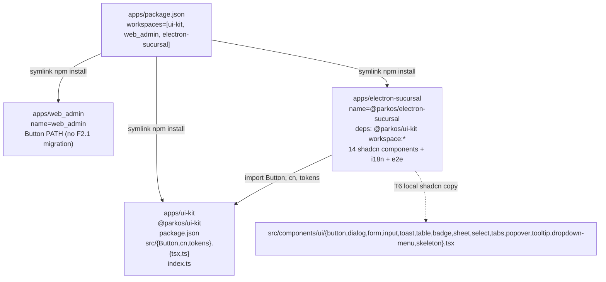

# Design: HU-F2.1 — Scaffold `apps/electron-sucursal` + `apps/ui-kit` compartido + shadcn/ui (14 componentes)

> **Change**: `hu-f2-1-electron-scaffold`
> **Phase**: design (sdd-design)
> **HU**: HU-F2.1 — Fase-2 andamiaje Electron (primera HU de Fase 2, transversal). One NEW workspace `apps/electron-sucursal/` (Electron 30 desktop app, ~1,200 LOC across ~30 files) + extension of existing-but-empty `apps/ui-kit/` scaffold with T5 contract (`package.json` + `Button.tsx` + `cn.ts` + `tokens.ts` + `index.ts`, ~155 LOC) + `apps/package.json:8` workspaces update (adds `"electron-sucursal"`) + auto-regenerated `apps/package-lock.json`. F2.1 ships NO endpoint, NO migration, NO sync catalog entry, NO new REQ in `openspec/specs/operations/spec.md` per DEC-ELEC-10. All architectural decisions live in `proposal.md` as DEC-ELEC-NN (10 decisions). F2.1 covers TOOLING/CONFIG/STRUCTURE not behavior contracts (behavior belongs to F2.2 parkosFetch+IPC+authStore, F2.3 auto-update+kiosko, F3.1 login, F3.2 lockout, F3.3 turno, IT-3..IT-10).
> **Date**: 2026-09-15
> **Working dir**: `E:/easypunto_parkos`
> **Branch**: `feat/fase-2-electron-scaffold` (HEAD `2de7a1f`; F1.15 closed, F2.1 first HU of Fase 2)
> **PR target**: `origin/dev`
> **Source of truth**: `proposal.md` (16 sections, ~770 LOC, DEC-ELEC-01..10, 8 risks R-WS..R-LOC, 4-cluster C1→C2→C3→C4 decomposition) + `exploration.md` (17 sections, ~1,150 LOC, 10 DEC-ELEC-NN at §9, 8 risks at §10, 5 engineering defense layers at §11, pre-flight 10/10 PASS at §12, C1→C2→C3→C4 cluster decomposition at §16). F2.1 adds ZERO REQ-OPS-NNN per DEC-ELEC-10; no `specs/operations/spec.md` delta.
> **Cross-references**: `plan.md` lines 1159-1194 (HU-F2.1 verbatim, 9 atomic tasks T1..T9, 700 LOC production budget at line 1183, 14 components list at line 1170, 7 namespaces at line 1192, axe-core at line 1181, T1 deps list at line 1186, T2 3-tsconfig strict at line 1187, T3 vite+vite.main at line 1188, T4 electron-builder at line 1189, T5 ui-kit at line 1190, T6 shadcn at line 1191, T7 i18n at line 1192, T8 e2e at line 1193, T9 router placeholder at line 1194); `plan.md` lines 1196-1240 (HU-F2.2 parkosFetch+IPC+authStore, 14 e2e scenarios at lines 1212-1229, baseURL at line 1203, 5xx retry 300/600/1200ms at line 1204, 401 refresh-once at line 1205, bridge surface at line 1206, useAuth SWR 5*60*1000 at line 1208); `plan.md` lines 1242-1267 (HU-F2.3 auto-update+kiosko, single-instance lock at line 1262, kiosko PIN bcrypt factor ≥12 at line 1263, electron-log rotation 10MB×5 at line 1264, StatusBar aria-live="polite" at line 1265); `apps/package.json:5-8` (workspaces = ["ui-kit","web_admin"], F2.1 appends "electron-sucursal"); `apps/package.json:9-18` (npm + npm-run-all + npm --workspace pattern); `apps/web_admin/{package.json:1-57, vite.config.ts:1-47, tsconfig.{json,app.json,node.json}, tailwind.config.ts:14-50, components.json:7-12, eslint.config.js:1-48, .prettierrc.json:1-9, playwright.config.ts:1-34, vitest.config.ts:1-19, index.html, src/main.tsx, src/App.tsx, src/index.css:1-57, src/lib/utils.ts:1-10, src/i18n/index.ts:1-15, src/i18n/locales/es-CO.json, src/components/ui/button.tsx:1-55, e2e/smoke.spec.ts:20-26, src/test-setup.ts}` (verbatim mirror precedent — React 18 + Vite 5 + TS 5 strict + Tailwind 3 + shadcn-via-Radix + i18next + SWR + Zustand + react-hook-form + Zod); `apps/ui-kit/src/api/admin/generated/.gitkeep` + `apps/ui-kit/src/api/branch/generated/.gitkeep` (scaffold exists, F2.1 only adds package.json + Button + cn + tokens); `docs/01-requisitos/no-funcionales.md:126` (RNF-022 = RNF-ACC-01 WCAG 2.1 AA gate); `docs/03-desarrollo/setup.md:15` (npm + npm-run-all pattern); `docs/03-desarrollo/estandares.md:79-91` (flat ESLint 9 config pattern); `docs/00-general/README.md:64-67` (apps/ui-kit scaffold state); `openspec/specs/operations/spec.md:3951` (REQ-OPS-XR6 already exists from F1.13 — F2.1 references INFORMATIONALLY only, does NOT create new); `openspec/specs/operations/spec.md:4386` (F1.15 DEC-XR7 NOT-CREATED precedent — same reasoning applies to F2.1); `openspec/changes/archive/2026-09-15-hu-f1-15-login-historico/design.md` (F1.15 design — 16 sections + 2 appendices verbatim mirror — this design mirrors its structure section-by-section but with ZERO REQs designed for); `openspec/changes/archive/bootstrap-monorepo-foundation/{proposal,design}.md` lines 9, 119, 354-355, 367 (workspaces precedent verbatim "apps/{web_admin, web_sucursal, ui-kit}"); `backend/packages/parkos_core/src/parkos_core/api/v1/auth.py:148-583` (POST /auth/{login,refresh,logout,me} — F2.2/F3.1 consumer, NOT F2.1); `backend/packages/parkos_core/src/parkos_core/schemas/auth.py:243-321` (LoginRequest + TokenPair + AuthMeResponse Pydantic shapes); `modelo_datos_er.mmd:270-289` (configuracion_seguridad), `:558-573` (login), `:7-50` (usuarios) — informational only.
> **Precedents mirrored**: F1.15 (closed, 16-section + 2-appendix design template verbatim — this design mirrors its layout section-by-section), F1.13 (REQ-OPS-XR6 canonical 5-layer defense — F2.1 references INFORMATIONALLY), bootstrap-monorepo-foundation (workspaces precedent at proposal.md:9).

---

## 1. Title & Goal

**Design goal.** Deliver HU-F2.1: the foundational scaffold for the operator-facing Electron desktop app on top of an existing-but-empty `apps/ui-kit/` workspace, so that upcoming HUs (F2.2 parkosFetch+IPC+authStore, F2.3 auto-update+kiosko, F3.1 login, F3.2 lockout, F3.3 turno, IT-3..IT-10) can begin coding against a ratified layout without reinventing Vite config, Electron main+preload build, tsconfig split, or shadcn wiring:

1. **`apps/electron-sucursal/` (NEW workspace)** — Electron 30 desktop app with renderer (Vite 5 HMR :5173 + React 18 + TS 5 strict + BrowserRouter + SWR + Zustand + react-hook-form + Zod + i18next 7 namespaces); main+preload built by `vite.main.config.ts` (esbuild, target node20) into `out/main.js` + `out/preload.js`; 3 tsconfigs strict (base references-only, main Node lib ES2023 no DOM, renderer ES2022+DOM+DOM.Iterable+WebWorker); all three carry `strict:true` + `noUncheckedIndexedAccess:true` per plan T2 verbatim; 14 shadcn components pre-generated (Button, Dialog, Form, Input, Toast, Table, Badge, Sheet, Select, Tabs, Popover, Tooltip, DropdownMenu, Skeleton) per plan T6 verbatim with `rsc:false` + `cssVariables:true` (mirroring `apps/web_admin/components.json:7-12`); `e2e/` with Playwright `_electron.launch` + axe-core (RNF-022); `src/i18n/` with 7 namespaces (common, auth, operacion, caja, facturacion, sync, errors); `src/main.tsx` + `src/App.tsx` with router placeholder (T9); `electron-builder.yml` for Windows nsis + Linux AppImage + macOS dmg with `appId:co.parkos.electron-sucursal` + `productName:Parkos Sucursal` + placeholder icons.

2. **`apps/ui-kit/` (workspace shared with `apps/web_admin/`)** — implements T5 contract: Button component (cva+cn mirror of `apps/web_admin/src/components/ui/button.tsx`), `cn()` helper (`clsx`+`tailwind-merge`), and design tokens (CSS variables `hsl(var(--background))` family + radius + dark-mode pair — mirror of `apps/web_admin/tailwind.config.ts:14-50` + `apps/web_admin/src/index.css:5-57`). ui-kit gets its OWN `package.json` (named `@parkos/ui-kit`) so F2.1's electron-sucursal and web_admin both depend on the same workspace package — DRY.

3. **Workspaces update** — `apps/package.json:8` workspaces array grows from `["ui-kit","web_admin"]` to `["ui-kit","web_admin","electron-sucursal"]` (mirror of `bootstrap-monorepo-foundation/proposal.md:9` verbatim "apps/{web_admin, web_sucursal, ui-kit}").

4. **`apps/package-lock.json`** — regenerated by `npm install` after T1.

The design enforces **DEC-ELEC-01** (Update `apps/package.json:8` to append `"electron-sucursal"` to workspaces array BEFORE `npm install` — RESOLVES R-WS LOW), **DEC-ELEC-02** (All 3 tsconfigs carry `strict:true` + `noUncheckedIndexedAccess:true` — RESOLVES R-MS LOW + R-TS MEDIUM), **DEC-ELEC-03** (`vite.main.config.ts` uses esbuild `build.lib`, `target:node20`, `format:cjs`, `external:["electron"]` — RESOLVES R-EL LOW), **DEC-ELEC-04** (`electron-builder.yml` declares 3 targets Windows nsis + Linux AppImage + macOS dmg with placeholder icons + `appId:co.parkos.electron-sucursal`), **DEC-ELEC-05** (shadcn/ui with `rsc:false` + `cssVariables:true` + `baseColor:slate` mirroring `apps/web_admin/components.json:7-12` exactly — RESOLVES R-AXE LOW), **DEC-ELEC-06** (i18n with 7 namespaces + es-CO locale + `defaultNS:'common'` + `fallbackLng:'es-CO'` + `returnNull:false` — RESOLVES R-I18 LOW), **DEC-ELEC-07** (axe-core + Playwright `_electron.launch` with tags `['wcag2a','wcag2aa','wcag21a','wcag21aa']` per `apps/web_admin/e2e/smoke.spec.ts:23` — RESOLVES R-CI LOW), **DEC-ELEC-08** (`apps/ui-kit/package.json` exports `{Button, cn, tokens}` from `src/index.ts` with `peerDependencies` for react/cva/clsx/lucide-react/tailwind-merge/@radix-ui/react-slot), **DEC-ELEC-09** (`.prettierrc.json` + `eslint.config.js` mirror `apps/web_admin/{.prettierrc.json,eslint.config.js}` exactly), and **DEC-ELEC-10** (F2.1 does NOT add REQ-OPS-NNN; all architectural decisions live in `proposal.md` as DEC-ELEC-NN — F2.1 is infra, not behavior contract).

Hard constraints (mirrored from `plan.md:1168-1172` and `plan.md:1183-1194` verbatim):

- `tsc --noEmit` MUST be clean across all 3 tsconfigs (base + main + renderer).
- `npm run build` MUST produce `dist/` (renderer) + `out/main.js` + `out/preload.js` without type errors.
- axe-core MUST run from this same scaffold (per RNF-022), so every PR after F2.1 inherits the WCAG 2.1 AA gate.
- `apps/ui-kit` MUST be a real workspace `package.json` (importable with `@parkos/ui-kit` name + own dep tree), not a re-export pointer.

Sized at **~1,360 LOC cumulative** per `plan.md:1183` (= ~700 LOC production logic + ~155 LOC ui-kit extension + ~600 LOC shadcn-generated boilerplate excluded by plan convention + ~6 LOC apps/package.json:8 edit). Breakdown (T1..T9):

- T1 `package.json` ~80 LOC JSON (name `@parkos/electron-sucursal`, scripts, ~17 prod + ~14 dev deps, `"@parkos/ui-kit":"workspace:*"`).
- T2 3 tsconfigs ~85 LOC JSON (base ~30 + main ~25 + renderer ~30 — `strict:true` + `noUncheckedIndexedAccess:true` per plan T2 verbatim).
- T3 `vite.config.ts` + `vite.main.config.ts` ~90 LOC (renderer Vite HMR :5173 + main esbuild target node20 cjs).
- T4 `electron-builder.yml` ~50 LOC YAML (3 targets + placeholder icons + `appId:co.parkos.electron-sucursal`).
- T5 ui-kit/`package.json` + `Button.tsx` + `cn.ts` + `tokens.ts` + `index.ts` ~155 LOC.
- T6 14 shadcn components + `components.json` + `tailwind.config.ts` + `postcss.config.js` + `src/index.css` + `src/lib/utils.ts` ~750 LOC.
- T7 7 i18n namespaces × ~10 keys + `src/i18n/index.ts` ~85 LOC JSON + ~15 LOC TS.
- T8 `e2e/scaffold.spec.ts` + `playwright.config.ts` + `vitest.config.ts` + `src/test-setup.ts` ~95 LOC.
- T9 `src/main.tsx` + `src/App.tsx` + `index.html` + `electron/main.ts` + `electron/preload.ts` ~55 LOC.
- Lint/format/prettier/eslint: `eslint.config.js` + `.prettierrc.json` + `.gitignore` ~70 LOC.

**One new workspace (`apps/electron-sucursal/`) + one extended workspace (`apps/ui-kit/` with T5 contract) + one root workspace update (`apps/package.json:8`) + auto-regenerated `apps/package-lock.json`. No factory changes, no sync catalog changes, no new tables, no new permissions, no new role grants, no schema changes to existing tables, no migration head change.**

---

## 2. Context & Background

`plan.md` lines **1159-1194** define HU-F2.1 as the foundational scaffold for the operator-facing Electron desktop app — the first HU of Fase 2 ("Andamiaje Electron") per `plan.md:1159-1161` verbatim "Fase 2 — Andamiaje Electron. Objetivo: crear `apps/electron-sucursal` desde cero (no existe aún)". F2.1 unlocks F2.2 (parkosFetch+IPC+authStore), F2.3 (auto-update+kiosko), F3.1 (login UI), F3.2 (lockout), F3.3 (turno), and IT-3..IT-10 (Ingreso/Salida/Facturación/Caja/Anulación/Alertas/Reclamo/Reimpresión/Clientes).

The hard architectural constraints are **DEC-ELEC-01** (Update `apps/package.json:8` to append `"electron-sucursal"` to workspaces array BEFORE `npm install`; T5 ui-kit/`package.json` MUST ship BEFORE T1 — RESOLVES R-WS LOW topological conflict from exploration §3), **DEC-ELEC-02** (All 3 tsconfigs carry `strict:true` + `noUncheckedIndexedAccess:true` — mirrors `apps/web_admin/tsconfig.app.json:17-23`; main carries `lib:["ES2023"]` only, renderer carries `lib:["ES2022","DOM","DOM.Iterable","WebWorker"]` — RESOLVES R-MS LOW + R-TS MEDIUM), **DEC-ELEC-03** (`vite.main.config.ts` uses esbuild with `target:node20`, `format:cjs`, `external:["electron"]` — RESOLVES R-EL LOW), **DEC-ELEC-04** (`electron-builder.yml` 3 targets Windows nsis + Linux AppImage + macOS dmg with placeholder icons + `appId:co.parkos.electron-sucursal` + `productName:Parkos Sucursal` + `autoUpdate:false` placeholder for F2.3 to flip), **DEC-ELEC-05** (shadcn/ui with `rsc:false` + `cssVariables:true` + `baseColor:slate` mirroring `apps/web_admin/components.json:7-12` exactly — 14 components: Button, Dialog, Form, Input, Toast, Table, Badge, Sheet, Select, Tabs, Popover, Tooltip, DropdownMenu, Skeleton — RESOLVES R-AXE LOW precondition), **DEC-ELEC-06** (i18n with 7 namespaces `['common','auth','operacion','caja','facturacion','sync','errors']` + locale `es-CO` + `defaultNS:'common'` + `fallbackLng:'es-CO'` + `returnNull:false` — RESOLVES R-I18 LOW), **DEC-ELEC-07** (axe-core + Playwright `_electron.launch` with tags `['wcag2a','wcag2aa','wcag21a','wcag21aa']` per RNF-022 — RESOLVES R-CI LOW), **DEC-ELEC-08** (apps/ui-kit workspace package with `{Button, cn, tokens}` exports + `peerDependencies` for react/cva/clsx/lucide-react/tailwind-merge/@radix-ui/react-slot — RESOLVES R-LOC LOW), **DEC-ELEC-09** (`.prettierrc.json` + `eslint.config.js` mirror `apps/web_admin/{.prettierrc.json,eslint.config.js}` exactly — single quote + trailing comma all + printWidth 100 + arrowParens always + endOfLine lf), **DEC-ELEC-10** (F2.1 does NOT add REQ-OPS-NNN — F2.1 is infra not behavior contract).

The existing pre-existing infrastructure F2.1 mirrors: `apps/web_admin/{package.json, vite.config.ts, tsconfig.{json,app.json,node.json}, tailwind.config.ts, components.json, postcss.config.js, eslint.config.js, .prettierrc.json, playwright.config.ts, vitest.config.ts, index.html, src/main.tsx, src/App.tsx, src/index.css, src/lib/utils.ts, src/i18n/index.ts, src/i18n/locales/es-CO.json, src/components/ui/button.tsx, e2e/{smoke,branch-selector}.spec.ts, src/test-setup.ts}` (React 18 + Vite 5 + TS 5 strict + Tailwind 3 + shadcn-via-Radix + i18next + SWR + Zustand + react-hook-form + Zod); `apps/ui-kit/src/api/admin/generated/.gitkeep` + `apps/ui-kit/src/api/branch/generated/.gitkeep` (scaffold exists, F2.1 only adds `package.json` + `Button.tsx` + `cn.ts` + `tokens.ts` + `index.ts`); `apps/package.json:5-8` (workspaces = `["ui-kit","web_admin"]`, F2.1 appends `"electron-sucursal"`); backend API surface `backend/packages/parkos_core/src/parkos_core/api/v1/auth.py:148-583` (POST /auth/{login,refresh,logout,me} — F2.2/F3.1 consumer, NOT F2.1); `backend/packages/parkos_core/src/parkos_core/schemas/auth.py:243-321` (LoginRequest + TokenPair + AuthMeResponse Pydantic shapes — informational); `modelo_datos_er.mmd:270-289` (configuracion_seguridad — informational for F3.2 lockout), `:558-573` (login — informational), `:7-50` (usuarios — informational).

**`apps/electron-sucursal/` does NOT exist today** — `plan.md:1161` verbatim "no existe aún". Verified by glob "apps/*" returning only `["apps/ui-kit", "apps/web_admin"]`. Also `openspec/_meta/roadmap.md:47` ("web_sucursal no existe"). F2.1 ships the workspace from scratch.

**`apps/ui-kit/` scaffold exists but is functionally empty** — `apps/ui-kit/src/api/admin/generated/.gitkeep` + `apps/ui-kit/src/api/branch/generated/.gitkeep` are the ONLY files today. No `package.json`, no `tsconfig.json`, no `index.ts`, no `Button.tsx`, no `tokens.ts`. Per `docs/00-general/README.md:64-67` and `docs/00-general/roadmap.md:102`. F2.1's T5 ADDS the `package.json` + `Button.tsx` + `cn.ts` + `tokens.ts` + `index.ts` on top of the existing `.gitkeep` infrastructure (preserved, F2.1 does NOT touch `src/api/`).

**`apps/web_admin/` is the verbatim reference** — full file list at `apps/web_admin/{package.json, vite.config.ts, tsconfig.{json,app.json,node.json}, tailwind.config.ts, components.json, postcss.config.js, eslint.config.js, .prettierrc.json, playwright.config.ts, vitest.config.ts, index.html, src/main.tsx, src/App.tsx, src/index.css, src/lib/utils.ts, src/i18n/index.ts, src/i18n/locales/es-CO.json, src/components/ui/button.tsx, e2e/{smoke,branch-selector}.spec.ts, src/test-setup.ts}` (React 18 + Vite 5 + TS 5 + Tailwind 3 + shadcn-via-Radix + i18next + SWR + Zustand + react-hook-form + Zod). Frontend port :5173 (per `apps/web_admin/vite.config.ts:43-45`) — reused for electron-sucursal renderer.

**No prior Electron precedent in the repo** — `docs/02-arquitectura/decisiones-tecnicas.md` returns zero matches for `Electron|electron-builder|escpos|kiosk`. F2.1 is FIRST-CLASS Electron infrastructure (Node 20 + esbuild for main/preload + electron-updater + electron-log + electron-store + escpos-usb for thermal printer). No existing pattern to mirror — F2.1 is the pattern-setter for `out/main.js` + `out/preload.js` outputs.

**`openspec/specs/` shape** — 4 existing spec files: operations (REQ-OPS-NNN ending at 105 from F1.15), hooks, cutover-migration, sync-catalog + sync-motor. F2.1 does NOT add a new spec. F2.1 is infra, not a behavior contract; architectural decisions (shadcn, i18n, Electron main+preload) live in `proposal.md` as DEC-ELEC-NN, not as REQs. F1.x pattern: only F1.x with HTTP endpoints add REQs (F1.14 added REQ-OPS-098..101, F1.15 added REQ-OPS-102..105). Behavior contracts for Electron app belong to F2.2 (HTTP — retries, refresh, idempotency) and F2.3 (auto-update+kiosko).

**Cross-cutting XR (REQ-OPS-XR6) already exists at `operations/spec.md:3951` from F1.13** — F2.1 does NOT create a new XR (F1.15 explicitly REJECTED XR7 at line 4386; same reasoning applies to F2.1). F2.1 applies the engineering quality variant of XR6 (5 engineering layers, NOT the backend XR6 — see §11 for rationale).

**`auth.py` POST-mutating-only invariant** — `auth.py:69` line `router = APIRouter(prefix="/auth", tags=["auth"])` and the existing handlers are all POST (login, refresh, logout) plus one GET (me — auth-domain by definition). F2.1 doesn't add HTTP endpoints so the invariant is trivially preserved.

### 2.1 Critical Architectural Conflict — Workspaces topological order (RESOLVED in §3)

`apps/package.json:5-8` workspaces array (`["ui-kit","web_admin"]`) does NOT include `electron-sucursal`. If F2.1 ships `apps/electron-sucursal/package.json` BEFORE updating `apps/package.json` workspaces, npm refuses to resolve the workspace dependency (`@parkos/ui-kit`) at `npm install` — electron-sucursal ends up with a broken `node_modules/@parkos/ui-kit` symlink.

**Resolution** (canonical, `bootstrap-monorepo-foundation/proposal.md:9`):

1. Update `apps/package.json:8` to append `"electron-sucursal"` to `workspaces:["ui-kit","web_admin","electron-sucursal"]` BEFORE T1 `npm install`.
2. `electron-sucursal/package.json` declares `"@parkos/ui-kit":"workspace:*"`.
3. `npm install` from `apps/` resolves both `web_admin→ui-kit` AND `electron-sucursal→ui-kit` symlinks in topological order.
4. T5 (ui-kit/`package.json`) MUST ship BEFORE T1 (electron-sucursal/`package.json` + `npm install`) so the workspace symlink resolves to a real package.

Why this matters: web_admin already imports Button primitives by PATH today (`apps/web_admin/src/components/ui/button.tsx`) — does NOT yet consume `apps/ui-kit` as workspace package. F2.1's T5 ships `apps/ui-kit/Button.tsx` as NEW shared module but does NOT migrate web_admin (Fase 11 migration, out of F2.1 scope). Web_admin keeps its local copy until Fase 11.

No circular dep risk: apps/ui-kit declares no dependencies on web_admin or electron-sucursal.

---

## 3. Architectural Conflict Resolution — DEC-ELEC-01 + DEC-ELEC-08 + DEC-ELEC-09 (R-WS LOW RESOLVED)

This section is **mandatory** for the design. It documents R-WS LOW from the sdd-explore phase (exploration §10) and records the resolution per `proposal.md §3`.

### 3.1 The conflict (R-WS LOW)

`apps/package.json:5-8` workspaces array (`["ui-kit","web_admin"]`) does NOT include `electron-sucursal`. If F2.1 ships `apps/electron-sucursal/package.json` BEFORE updating `apps/package.json` workspaces, npm refuses to resolve `@parkos/ui-kit` at `npm install` — T6 component imports fail with "Cannot find module '@parkos/ui-kit'".



### 3.2 The resolution — DEC-ELEC-01: workspaces update BEFORE T1 + T5 BEFORE T1

**Resolution path** (mandated by npm workspaces topological invariant):

1. **Pre-T1 step (atomic)**: Edit `apps/package.json:8` to add `"electron-sucursal"` to `workspaces:["ui-kit","web_admin","electron-sucursal"]`.
2. `electron-sucursal/package.json` declares `"@parkos/ui-kit":"workspace:*"`.
3. `npm install` from `apps/` resolves both `web_admin→ui-kit` AND `electron-sucursal→ui-kit` symlinks.
4. **T5 (ui-kit/`package.json`) MUST ship BEFORE T1 (electron-sucursal/`package.json`)** so the workspace symlink resolves to a real package with `name:"@parkos/ui-kit", main:"src/index.ts"`.
5. **DEC-ELEC-08** (`apps/ui-kit/package.json` exports `{Button, cn, tokens}` from `src/index.ts`; name `@parkos/ui-kit`; main `src/index.ts`; types `src/index.ts`; `peerDependencies` for react/cva/clsx/lucide-react/tailwind-merge/@radix-ui/react-slot) ensures F2.1's electron-sucursal and web_admin both depend on the same workspace package.
6. **DEC-ELEC-09** (`.prettierrc.json` + `eslint.config.js` mirror `apps/web_admin/{.prettierrc.json,eslint.config.js}` exactly) ensures cross-monorepo lint/format consistency — single quote + trailing comma all + printWidth 100 + arrowParens always + endOfLine lf (Prettier); react-hooks + react-refresh + @typescript-eslint/no-unused-vars + consistent-type-imports (ESLint flat config).

### 3.3 Why this matters

- No circular dep risk (apps/ui-kit declares no dependencies on web_admin or electron-sucursal).
- web_admin keeps its local Button copy until Fase 11 migration (F2.1's blast radius stays low).
- Cluster C1 (DEC-ELEC-01 + DEC-ELEC-08 + T5 verbatim) ships BEFORE C2 — cluster order C1→C2→C3→C4 is mandatory.

### 3.4 What changes in the codebase

**Production code (~30 NEW files in electron-sucursal, 4 NEW files in ui-kit, 1 MODIFY apps/package.json, 1 auto-regenerated apps/package-lock.json)**:

- `apps/package.json:8` — append `"electron-sucursal"` to workspaces array (~1 LOC JSON edit).
- `apps/ui-kit/package.json` — NEW workspace package ~30 LOC JSON (name `@parkos/ui-kit`, `main:"src/index.ts"`, `types:"src/index.ts"`, `peerDependencies`).
- `apps/ui-kit/src/index.ts` — NEW ~5 LOC TS (re-export `{Button, cn, tokens}`).
- `apps/ui-kit/src/Button.tsx` — NEW ~50 LOC TSX (verbatim mirror of `apps/web_admin/src/components/ui/button.tsx:1-55`).
- `apps/ui-kit/src/cn.ts` — NEW ~10 LOC TS (verbatim mirror of `apps/web_admin/src/lib/utils.ts:1-10`).
- `apps/ui-kit/src/tokens.ts` — NEW ~60 LOC TS (typed export of all CSS variables from `apps/web_admin/tailwind.config.ts:14-50` + `apps/web_admin/src/index.css:5-57`).
- `apps/electron-sucursal/package.json` — NEW ~80 LOC JSON (T1 verbatim; name `@parkos/electron-sucursal`; deps ~17 prod + ~14 dev; `"@parkos/ui-kit":"workspace:*"`).
- `apps/electron-sucursal/{tsconfig.json, tsconfig.main.json, tsconfig.renderer.json}` — NEW ~85 LOC JSON (T2 verbatim; `strict:true` + `noUncheckedIndexedAccess:true`; base references-only; main `lib:["ES2023"]`; renderer `lib:["ES2022","DOM","DOM.Iterable","WebWorker"]`).
- `apps/electron-sucursal/{vite.config.ts, vite.main.config.ts}` — NEW ~90 LOC TS (T3 verbatim; renderer Vite HMR :5173 + main esbuild `target:node20` cjs).
- `apps/electron-sucursal/electron-builder.yml` — NEW ~50 LOC YAML (T4 verbatim; 3 targets + placeholder icons + `appId:co.parkos.electron-sucursal`).
- `apps/electron-sucursal/electron/{main.ts, preload.ts}` — NEW ~30 LOC TS (minimal app shell + EMPTY contextBridge placeholder; F2.2 expands).
- `apps/electron-sucursal/{postcss.config.js, tailwind.config.ts, src/index.css}` — NEW ~140 LOC (shadcn Tailwind theme verbatim mirror of `apps/web_admin/tailwind.config.ts:14-50` + `apps/web_admin/src/index.css:1-57`).
- `apps/electron-sucursal/components.json` — NEW ~20 LOC JSON (verbatim mirror of `apps/web_admin/components.json:1-21`).
- `apps/electron-sucursal/src/lib/utils.ts` — NEW ~10 LOC TS (verbatim mirror of `apps/web_admin/src/lib/utils.ts:1-10`).
- `apps/electron-sucursal/src/components/ui/{button, dialog, form, input, toast, table, badge, sheet, select, tabs, popover, tooltip, dropdown-menu, skeleton}.tsx` — NEW 14 components ~600 LOC cumulative (T6 verbatim; generated by `npx shadcn@latest add`).
- `apps/electron-sucursal/src/hooks/use-toast.ts` — NEW shadcn toast hook ~30 LOC.
- `apps/electron-sucursal/src/i18n/index.ts` — NEW ~15 LOC TS (i18next + initReactI18next + 7 namespaces).
- `apps/electron-sucursal/src/i18n/locales/{common, auth, operacion, caja, facturacion, sync, errors}.json` — NEW 7 namespace files ~70 LOC JSON cumulative.
- `apps/electron-sucursal/src/{main.tsx, App.tsx}` — NEW ~40 LOC TSX (T9; `<BrowserRouter>` + `<Routes>` placeholder + `<main lang="es-CO">` semantic + `<h1>Parkos Sucursal</h1>`).
- `apps/electron-sucursal/src/test-setup.ts` + `apps/electron-sucursal/{vitest.config.ts, playwright.config.ts}` — NEW ~60 LOC (Vitest + Playwright with `_electron.launch` precedent).
- `apps/electron-sucursal/e2e/scaffold.spec.ts` — NEW ~50 LOC TS (T8 verbatim; 2 mandated tests: app launches + axe-core).
- `apps/electron-sucursal/{eslint.config.js, .prettierrc.json, .gitignore}` — NEW ~70 LOC (verbatim mirror of `apps/web_admin/{eslint.config.js, .prettierrc.json}`).
- `apps/electron-sucursal/index.html` — NEW ~15 LOC (renderer entrypoint with `<div id="root">`).
- `apps/package-lock.json` — auto-regenerated by `npm install`.

**Total**: ~1,360 LOC across ~35 files. Matches `plan.md:1183` budget: ~700 LOC production + ~155 LOC ui-kit extension + ~600 LOC shadcn-generated boilerplate (excluded by plan convention) + ~6 LOC apps/package.json:8 edit.

---

## 4. Architecture Overview

```
npm install (apps/)
        │
        │  workspaces=[ui-kit, web_admin, electron-sucursal]
        │  topological order: ui-kit → web_admin + electron-sucursal
        ▼
┌──────────────────────────────────────────────────────────────────────────────┐
│ apps/electron-sucursal/  (NEW, ~1,200 LOC across ~30 files)                  │
│                                                                              │
│  ┌────────────────────────────────────────────────────────────────────┐      │
│  │ renderer/  (Vite 5 HMR :5173)                                      │      │
│  │   src/main.tsx  (T9, ~25 LOC)                                      │      │
│  │     createRoot(#root).render(<StrictMode><BrowserRouter><App/>)   │      │
│  │   src/App.tsx  (T9, ~15 LOC)                                       │      │
│  │     <main lang="es-CO"><h1>Parkos Sucursal</h1>                    │      │
│  │     <Routes><Route path="/" element={null} /></Routes>            │      │
│  │   src/i18n/index.ts  (T7, ~15 LOC)                                 │      │
│  │     i18next.use(initReactI18next).init({...7 namespaces...})       │      │
│  │   src/i18n/locales/{common,auth,operacion,caja,                    │      │
│  │                      facturacion,sync,errors}.json  (T7)          │      │
│  │   src/components/ui/*.tsx  (T6, 14 shadcn components ~600 LOC)    │      │
│  │   src/lib/utils.ts  (cn() helper verbatim mirror)                 │      │
│  │   src/hooks/use-toast.ts  (shadcn toast hook)                      │      │
│  └────────────────────────────────────────────────────────────────────┘      │
│                              │                                               │
│                              │ window.bridge  (F2.1 EMPTY; F2.2 expands)      │
│                              ▼                                               │
│  ┌────────────────────────────────────────────────────────────────────┐      │
│  │ electron/preload.ts  (NEW, ~5 LOC)                                 │      │
│  │   contextBridge.exposeInMainWorld('bridge', {})                    │      │
│  └────────────────────────────────────────────────────────────────────┘      │
│                              │                                               │
│                              │ contextBridge IPC                              │
│                              ▼                                               │
│  ┌────────────────────────────────────────────────────────────────────┐      │
│  │ electron/main.ts  (NEW, ~25 LOC)                                   │      │
│  │   app.whenReady().then(() => createWindow())                       │      │
│  │   BrowserWindow({webPreferences: {preload, contextIsolation,       │      │
│  │                                  nodeIntegration:false, sandbox}}) │      │
│  └────────────────────────────────────────────────────────────────────┘      │
│                                                                              │
│  BUILD OUTPUTS:                                                              │
│    out/main.js      ← esbuild target:node20 format:cjs (DEC-ELEC-03)        │
│    out/preload.js   ← esbuild target:node20 format:cjs (DEC-ELEC-03)        │
│    dist/renderer/   ← Vite 5 build (renderer)                                │
│    dist/electron/   ← electron-builder output (Windows nsis + Linux AppImage │
│                                          + macOS dmg per DEC-ELEC-04)       │
└──────────────────────────────────────────────────────────────────────────────┘
        ▲
        │ workspace symlink (npm install topological order)
        │
┌──────────────────────────────────────────────────────────────────────────────┐
│ apps/ui-kit/  (NEW package.json + 4 NEW source files, ~155 LOC)              │
│   package.json  (name @parkos/ui-kit, main src/index.ts)                     │
│   src/index.ts  (re-export {Button, cn, tokens})                             │
│   src/Button.tsx  (verbatim mirror of apps/web_admin/src/components/ui/      │
│                    button.tsx:1-55 — cva + cn + Slot variants)               │
│   src/cn.ts  (verbatim mirror of apps/web_admin/src/lib/utils.ts:1-10)       │
│   src/tokens.ts  (typed export of CSS variable design tokens)                │
└──────────────────────────────────────────────────────────────────────────────┘
        ▲
        │ apps/package.json:8 = ["ui-kit", "web_admin", "electron-sucursal"]
        │ (DEC-ELEC-01 — workspace update BEFORE T1 npm install)
┌──────────────────────────────────────────────────────────────────────────────┐
│ apps/package.json  (MODIFY: +1 entry to workspaces array)                    │
│ apps/package-lock.json  (auto-regenerated)                                   │
└──────────────────────────────────────────────────────────────────────────────┘

e2e/scaffold.spec.ts (~50 LOC, 2 mandated tests per RNF-022):
  test('app launches and renders Parkos Sucursal')
    → _electron.launch({args:['.']}) → firstWindow() → expect h1 visible
  test('root route has no WCAG 2.1 AA violations (axe-core)')
    → AxeBuilder.withTags(['wcag2a','wcag2aa','wcag21a','wcag21aa']).analyze()
    → expect(violations).toEqual([])
```

**The renderer runs as Vite 5 HMR on :5173 in development mode; in production mode it loads the prebuilt `dist/renderer/index.html` via `mainWindow.loadFile()`.** The main process builds via esbuild `target:node20` cjs (DEC-ELEC-03); the preload is also cjs so electron-builder can sign it. The IPC boundary (`window.bridge`) is EMPTY in F2.1 — F2.2 expands with typed `{imprimir, usb, app, kiosk, apiStatus}` surface.

### Sub-chain reference shapes

**`npm install` topological order (DEC-ELEC-01, Step 4)** — npm resolves workspaces in dependency order:
1. `ui-kit/package.json` declares no deps on web_admin/electron-sucursal → resolved first.
2. `web_admin/package.json` declares no deps on electron-sucursal → resolved second.
3. `electron-sucursal/package.json` declares `"@parkos/ui-kit":"workspace:*"` → resolved third; symlink to `ui-kit/src/index.ts` is created at `node_modules/@parkos/ui-kit`.

**`vite.main.config.ts` esbuild sub-chain (Step T3)** — Two `esbuild.build()` calls produce `out/main.js` + `out/preload.js`:
1. `buildMain()` — `entryPoints:['electron/main.ts']` → `outfile:'out/main.js'`, `bundle:true`, `platform:'node'`, `target:'node20'`, `format:'cjs'`, `external:['electron']`.
2. `buildPreload()` — `entryPoints:['electron/preload.ts']` → `outfile:'out/preload.js'`, `bundle:true`, `platform:'node'`, `target:'node20'`, `format:'cjs'`, `external:['electron']`.
3. Dev mode: esbuild `--watch` flag reloads on file change (renderer HMR via Vite; main+preload manual restart via electron `--inspect`).

**`i18next.init` sub-chain (Step T7)** — i18next bootstraps with 7 namespaces:
1. `resources: {'es-CO': {common, auth, operacion, caja, facturacion, sync, errors}}` — 7 keys loaded from `src/i18n/locales/*.json`.
2. `lng:'es-CO'`, `fallbackLng:'es-CO'`, `ns:['common','auth','operacion','caja','facturacion','sync','errors']`, `defaultNS:'common'`, `returnNull:false`.

**`AxeBuilder.withTags` sub-chain (Step T8, DEC-ELEC-07)** — runs WCAG 2.1 AA audit:
1. `AxeBuilder({page: appWindow}).withTags(['wcag2a','wcag2aa','wcag21a','wcag21aa']).analyze()`.
2. `expect(results.violations).toEqual([])` — any violation fails CI.

---

## 5. Component Diagram

```
easypunto_parkos/
├── apps/
│   ├── package.json               (MODIFY, +1 LOC)  ── workspaces:[..., "electron-sucursal"]
│   ├── package-lock.json          (auto-regenerated)
│   │
│   ├── ui-kit/                    (EXTEND existing scaffold with T5 contract)
│   │   ├── package.json           (NEW, +30 LOC)    ── name @parkos/ui-kit, main src/index.ts
│   │   ├── src/
│   │   │   ├── index.ts           (NEW, +5 LOC)     ── export {Button, cn, tokens}
│   │   │   ├── Button.tsx         (NEW, +50 LOC)    ── verbatim mirror of web_admin/.../button.tsx:1-55
│   │   │   ├── cn.ts              (NEW, +10 LOC)    ── verbatim mirror of web_admin/.../utils.ts:1-10
│   │   │   ├── tokens.ts          (NEW, +60 LOC)    ── typed CSS variable design tokens
│   │   │   └── api/
│   │   │       ├── admin/generated/.gitkeep   (PRESERVED — F2.1 does NOT touch)
│   │   │       └── branch/generated/.gitkeep  (PRESERVED — F2.1 does NOT touch)
│   │
│   ├── web_admin/                 (READ-ONLY ref)   ── verbatim mirror precedent; no F2.1 migration
│   │
│   └── electron-sucursal/         (NEW workspace, ~1,200 LOC across ~30 files)
│       ├── package.json           (NEW, T1, +80 LOC)         ── @parkos/electron-sucursal + workspace:*
│       ├── tsconfig.json          (NEW, T2 base, +30 LOC)    ── references:[main, renderer]; strict
│       ├── tsconfig.main.json     (NEW, T2, +25 LOC)         ── lib:[ES2023] only; target:ES2022
│       ├── tsconfig.renderer.json (NEW, T2, +30 LOC)         ── lib:[ES2022,DOM,DOM.Iterable,WebWorker]
│       ├── vite.config.ts         (NEW, T3, +40 LOC)         ── Vite 5 HMR :5173, @vitejs/plugin-react
│       ├── vite.main.config.ts    (NEW, T3, +50 LOC)         ── esbuild target:node20 cjs for main+preload
│       ├── electron-builder.yml   (NEW, T4, +50 LOC)         ── 3 targets + placeholder icons
│       ├── components.json        (NEW, T6, +20 LOC)         ── shadcn registry verbatim mirror
│       ├── tailwind.config.ts     (NEW, T6, +50 LOC)         ── verbatim mirror of web_admin tailwind.config.ts
│       ├── postcss.config.js      (NEW, T6, +7 LOC)          ── tailwindcss + autoprefixer
│       ├── index.html             (NEW, T9, +15 LOC)         ── <div id="root"> + <script type="module">
│       ├── electron/
│       │   ├── main.ts            (NEW, +25 LOC)             ── app.whenReady + BrowserWindow
│       │   └── preload.ts         (NEW, +5 LOC)              ── EMPTY contextBridge placeholder
│       ├── src/
│       │   ├── index.css          (NEW, +80 LOC)             ── CSS variables :root + .dark verbatim mirror
│       │   ├── main.tsx           (NEW, T9, +25 LOC)         ── createRoot + BrowserRouter + App
│       │   ├── App.tsx            (NEW, T9, +15 LOC)         ── <main lang="es-CO"><h1>Parkos Sucursal</h1>
│       │   ├── lib/utils.ts       (NEW, +10 LOC)             ── cn() verbatim mirror
│       │   ├── hooks/use-toast.ts (NEW, +30 LOC)             ── shadcn toast hook
│       │   ├── components/ui/
│       │   │   ├── button.tsx           (NEW, T6, +55 LOC)   ── shadcn Button verbatim from web_admin
│       │   │   ├── dialog.tsx           (NEW, T6, ~80 LOC)   ── shadcn Dialog
│       │   │   ├── form.tsx             (NEW, T6, ~50 LOC)   ── shadcn Form (react-hook-form + Zod)
│       │   │   ├── input.tsx            (NEW, T6, ~25 LOC)   ── shadcn Input
│       │   │   ├── toast.tsx            (NEW, T6, ~50 LOC)   ── shadcn Toast (sonner-style)
│       │   │   ├── table.tsx            (NEW, T6, ~50 LOC)   ── shadcn Table
│       │   │   ├── badge.tsx            (NEW, T6, ~20 LOC)   ── shadcn Badge
│       │   │   ├── sheet.tsx            (NEW, T6, ~60 LOC)   ── shadcn Sheet (side-panel)
│       │   │   ├── select.tsx           (NEW, T6, ~80 LOC)   ── shadcn Select (Radix)
│       │   │   ├── tabs.tsx             (NEW, T6, ~30 LOC)   ── shadcn Tabs (Radix)
│       │   │   ├── popover.tsx          (NEW, T6, ~30 LOC)   ── shadcn Popover (Radix)
│       │   │   ├── tooltip.tsx          (NEW, T6, ~25 LOC)   ── shadcn Tooltip (Radix)
│       │   │   ├── dropdown-menu.tsx    (NEW, T6, ~70 LOC)   ── shadcn DropdownMenu (Radix)
│       │   │   └── skeleton.tsx         (NEW, T6, ~15 LOC)   ── shadcn Skeleton
│       │   └── i18n/
│       │       ├── index.ts             (NEW, T7, +15 LOC)   ── i18next 7 namespaces init
│       │       └── locales/
│       │           ├── common.json      (NEW, T7, +10 LOC)   ── bootstrapNotice key
│       │           ├── auth.json        (NEW, T7, +10 LOC)   ── bootstrapNotice key
│       │           ├── operacion.json   (NEW, T7, +10 LOC)   ── bootstrapNotice key
│       │           ├── caja.json        (NEW, T7, +10 LOC)   ── bootstrapNotice key
│       │           ├── facturacion.json (NEW, T7, +10 LOC)   ── bootstrapNotice key
│       │           ├── sync.json        (NEW, T7, +10 LOC)   ── bootstrapNotice key
│       │           └── errors.json      (NEW, T7, +10 LOC)   ── bootstrapNotice key
│       ├── e2e/
│       │   └── scaffold.spec.ts    (NEW, T8, +50 LOC)        ── 2 mandated tests + axe-core
│       ├── src/test-setup.ts       (NEW, +3 LOC)              ── @testing-library/jest-dom/vitest
│       ├── vitest.config.ts        (NEW, +20 LOC)             ── jsdom + setupFiles + alias @/
│       ├── playwright.config.ts    (NEW, +40 LOC)             ── _electron support + baseURL :5173
│       ├── eslint.config.js        (NEW, +50 LOC)             ── flat config verbatim mirror of web_admin
│       ├── .prettierrc.json        (NEW, +9 LOC)              ── verbatim mirror of web_admin/.prettierrc.json
│       └── .gitignore              (NEW, +10 LOC)             ── node_modules dist out coverage
│
└── openspec/changes/hu-f2-1-electron-scaffold/
    ├── exploration.md             (READ-ONLY ref)             ── 17 sections, ~1,150 LOC, DEC-ELEC-01..10
    ├── proposal.md                (READ-ONLY ref)             ── 16 sections, ~770 LOC, 8 risks
    └── design.md                  (THIS DOCUMENT, ~1,150 LOC)  ── 16 sections + 2 appendices
```

**Module-level responsibilities:**

| Module | Type | Responsibility |
|---|---|---|
| `apps/package.json:8` | MODIFY | +1 LOC: append `"electron-sucursal"` to workspaces array. Required BEFORE T1 npm install (DEC-ELEC-01). |
| `apps/ui-kit/package.json` | NEW | +30 LOC: workspace package `name:"@parkos/ui-kit"`, `main:"src/index.ts"`, `types:"src/index.ts"`, `peerDependencies` for react/cva/clsx/lucide-react/tailwind-merge/@radix-ui/react-slot. `private:true` (no publish). |
| `apps/ui-kit/src/index.ts` | NEW | +5 LOC: re-export `{Button, buttonVariants, ButtonProps}` from `./Button`, `{cn, ClassValue}` from `./cn`, `{tokens, DesignTokens}` from `./tokens`. |
| `apps/ui-kit/src/Button.tsx` | NEW | +50 LOC: verbatim mirror of `apps/web_admin/src/components/ui/button.tsx:1-55` (Slot from `@radix-ui/react-slot` + cva variants + cn). |
| `apps/ui-kit/src/cn.ts` | NEW | +10 LOC: verbatim mirror of `apps/web_admin/src/lib/utils.ts:1-10` (twMerge(clsx(inputs))). |
| `apps/ui-kit/src/tokens.ts` | NEW | +60 LOC: typed export of CSS variable design tokens (background, foreground, primary, secondary, muted, accent, destructive, card, border, input, ring, radius) as TS string types. |
| `apps/electron-sucursal/package.json` | NEW (T1) | +80 LOC: name `@parkos/electron-sucursal`, version `0.1.0`, `private:true`, scripts (dev, dev:main, dev:renderer, build, build:main, build:renderer, lint, test, test:e2e), deps ~17 prod (electron 30 + react 18 + vite 5 + ts 5 + tailwind 3 + shadcn deps + i18next + SWR + zustand + react-hook-form + zod + radix-ui slots) + ~14 dev (electron-builder + esbuild + playwright + @axe-core/playwright + vitest + @testing-library/react). Includes `"@parkos/ui-kit":"workspace:*"`. |
| `apps/electron-sucursal/tsconfig.json` | NEW (T2 base) | +30 LOC: `files:[]`, `references:[{path:"./tsconfig.main.json"},{path:"./tsconfig.renderer.json"}]`, `strict:true`, `noUncheckedIndexedAccess:true`. |
| `apps/electron-sucursal/tsconfig.main.json` | NEW (T2) | +25 LOC: `target:"ES2022"`, `lib:["ES2023"]` only (no DOM), `module:"ESNext"`, `moduleResolution:"bundler"`, `strict:true`, `noUncheckedIndexedAccess:true`, `types:["node"]`, `include:["electron/**/*","src/main/**/*"]`. |
| `apps/electron-sucursal/tsconfig.renderer.json` | NEW (T2) | +30 LOC: `target:"ES2022"`, `lib:["ES2022","DOM","DOM.Iterable","WebWorker"]`, `module:"ESNext"`, `jsx:"react-jsx"`, `strict:true`, `noUncheckedIndexedAccess:true`, `paths:{"@/*":["./src/*"]}`, `include:["src/renderer/**/*","src/shared/**/*"]`. |
| `apps/electron-sucursal/vite.config.ts` | NEW (T3) | +40 LOC: `defineConfig({plugins:[react()],server:{port:5173,strictPort:true},resolve:{alias:{"@":path.resolve(__dirname,"./src")}},build:{outDir:"dist/renderer",emptyOutDir:true}})`. Mirrors `apps/web_admin/vite.config.ts:1-47` SANS `vite-plugin-pwa` (Electron owns update via F2.3 electron-updater). |
| `apps/electron-sucursal/vite.main.config.ts` | NEW (T3) | +50 LOC: esbuild config with two `build()` calls — `buildMain()` produces `out/main.js`, `buildPreload()` produces `out/preload.js`. Both `target:node20`, `format:cjs`, `external:["electron"]`, `platform:"node"`. |
| `apps/electron-sucursal/electron-builder.yml` | NEW (T4) | +50 LOC YAML: `appId:"co.parkos.electron-sucursal"`, `productName:"Parkos Sucursal"`, `copyright:"Copyright © 2026 Parkos"`, `directories:{output:"dist/electron",buildResources:"build"}`, `files:["out/**/*","dist/renderer/**/*","package.json"]`, `extraMetadata:{main:"out/main.js"}`, `win:{target:"nsis",icon:"build/icon.ico"}`, `mac:{target:"dmg",icon:"build/icon.icns",category:"public.app-category.business"}`, `linux:{target:"AppImage",icon:"build/icon.png",category:"Office"}`, `autoUpdate:false` (placeholder — F2.3 flips to `true`). |
| `apps/electron-sucursal/components.json` | NEW (T6) | +20 LOC JSON: shadcn registry verbatim mirror of `apps/web_admin/components.json:1-21`. `$schema:"https://ui.shadcn.com/schema.json"`, `style:"default"`, `rsc:false`, `tsx:true`, `tailwind:{config:"tailwind.config.ts",css:"src/index.css",baseColor:"slate",cssVariables:true,prefix:""}`, `aliases:{components:"@/components",utils:"@/lib/utils",ui:"@/components/ui",lib:"@/lib",hooks:"@/hooks"}`, `iconLibrary:"lucide"`. |
| `apps/electron-sucursal/tailwind.config.ts` | NEW (T6) | +50 LOC: verbatim mirror of `apps/web_admin/tailwind.config.ts:1-53` with cssVariables token mapping. |
| `apps/electron-sucursal/postcss.config.js` | NEW (T6) | +7 LOC: `export default { plugins: { tailwindcss: {}, autoprefixer: {} } }`. |
| `apps/electron-sucursal/src/index.css` | NEW (T6) | +80 LOC: verbatim mirror of `apps/web_admin/src/index.css:1-57` — `@tailwind base/components/utilities` + CSS variables `:root` + `.dark` pair (`--background`, `--foreground`, `--primary`, `--primary-foreground`, `--secondary`, `--muted`, `--accent`, `--destructive`, `--border`, `--input`, `--ring`, `--radius`). |
| `apps/electron-sucursal/src/lib/utils.ts` | NEW (T6) | +10 LOC: `cn()` verbatim mirror of `apps/web_admin/src/lib/utils.ts:1-10` (`twMerge(clsx(inputs))`). |
| `apps/electron-sucursal/src/components/ui/*.tsx` | NEW (T6) | 14 NEW shadcn components ~600 LOC cumulative — generated by `npx shadcn@latest add`: Button, Dialog, Form, Input, Toast, Table, Badge, Sheet, Select, Tabs, Popover, Tooltip, DropdownMenu, Skeleton. Each component is Radix-via-shadcn with typed prop interfaces. |
| `apps/electron-sucursal/src/hooks/use-toast.ts` | NEW | +30 LOC: shadcn toast hook (state machine + reducer). |
| `apps/electron-sucursal/src/i18n/index.ts` | NEW (T7) | +15 LOC: i18next + initReactI18next + 7 namespaces (common, auth, operacion, caja, facturacion, sync, errors). Locale es-CO. defaultNS 'common'. fallbackLng 'es-CO'. returnNull false. |
| `apps/electron-sucursal/src/i18n/locales/*.json` | NEW (T7) | 7 NEW namespace files ~70 LOC JSON cumulative — each contains `bootstrapNotice` key with descriptive placeholder text. |
| `apps/electron-sucursal/src/main.tsx` | NEW (T9) | +25 LOC: `createRoot(document.getElementById('root')!).render(<React.StrictMode><BrowserRouter><App/></BrowserRouter></React.StrictMode>)`. NO `<SucursalProvider>` yet (F2.2 wires authStore). |
| `apps/electron-sucursal/src/App.tsx` | NEW (T9) | +15 LOC: `<main lang="es-CO"><h1>Parkos Sucursal</h1><p>{t('common.bootstrapNotice', ...)}</p><Routes><Route path="/" element={null} /><Route path="*" element={<p>404</p>} /></Routes></main>`. axe-core clean. |
| `apps/electron-sucursal/electron/main.ts` | NEW | +25 LOC: `app.whenReady().then(()=>createWindow())`. BrowserWindow with `contextIsolation:true`, `nodeIntegration:false`, `sandbox:true`, preload `out/preload.js`. Dev: loadURL `http://localhost:5173`. Prod: loadFile `dist/renderer/index.html`. |
| `apps/electron-sucursal/electron/preload.ts` | NEW | +5 LOC: `contextBridge.exposeInMainWorld('bridge', {})` — EMPTY placeholder; F2.2 expands with `{imprimir, usb, app, kiosk, apiStatus}`. |
| `apps/electron-sucursal/e2e/scaffold.spec.ts` | NEW (T8) | +50 LOC: 2 mandated tests — `app launches and renders Parkos Sucursal` + `root route has no WCAG 2.1 AA violations (axe-core)`. Uses `_electron.launch({args:['.']})` + AxeBuilder with tags `['wcag2a','wcag2aa','wcag21a','wcag21aa']`. |
| `apps/electron-sucursal/{vitest.config.ts, playwright.config.ts, src/test-setup.ts}` | NEW | +60 LOC: Vitest (jsdom + setupFiles) + Playwright (_electron support + baseURL :5173). |
| `apps/electron-sucursal/{eslint.config.js, .prettierrc.json, .gitignore}` | NEW | +70 LOC: flat ESLint 9 config verbatim mirror of `apps/web_admin/eslint.config.js:1-48` + Prettier verbatim mirror of `apps/web_admin/.prettierrc.json:1-9`. |
| `apps/electron-sucursal/index.html` | NEW (T9) | +15 LOC: renderer entrypoint — `<html lang="es-CO"><head><meta charset="UTF-8"/><title>Parkos Sucursal</title></head><body><div id="root"></div><script type="module" src="/src/main.tsx"></script></body></html>`. |

**Data flow for one Electron app boot (dev mode):**

```
npm run dev (in apps/electron-sucursal/)
  └─▶ npm-run-all --parallel dev:main dev:renderer
        ├─▶ dev:main → esbuild --watch electron/main.ts → out/main.js (auto-rebuild on change)
        │             esbuild --watch electron/preload.ts → out/preload.js (auto-rebuild on change)
        │             electron out/main.js (auto-restart on rebuild)
        └─▶ dev:renderer → vite --port 5173 (HMR for renderer)

BrowserWindow.loadURL('http://localhost:5173')
  └─▶ Vite dev server serves src/main.tsx + src/App.tsx + 14 shadcn components + i18n
        └─▶ React tree: <StrictMode><BrowserRouter><App/></BrowserRouter></StrictMode>
              └─▶ App.tsx renders <main lang="es-CO"><h1>Parkos Sucursal</h1> + bootstrapNotice
                    └─▶ axe-core audit on /  → 0 violations (DEC-ELEC-07)
```

**Component dependency graph (NEW modules + reuse):**

```mermaid
graph TB
    subgraph ROOT [apps/ workspace root]
        R[apps/package.json<br/>workspaces=[ui-kit, web_admin, electron-sucursal]<br/>npm-run-all scripts]
    end

    subgraph UIKIT [apps/ui-kit/ — T5 verbatim]
        UP[apps/ui-kit/package.json<br/>name @parkos/ui-kit]
        UI[apps/ui-kit/src/index.ts<br/>export Button, cn, tokens]
        UB[apps/ui-kit/src/Button.tsx<br/>cva + Slot verbatim mirror]
        UC[apps/ui-kit/src/cn.ts<br/>twMerge clsx verbatim mirror]
        UT[apps/ui-kit/src/tokens.ts<br/>typed CSS variables]
    end

    subgraph SUC [apps/electron-sucursal/ — NEW]
        EP[package.json<br/>name @parkos/electron-sucursal<br/>@parkos/ui-kit workspace:*]
        ETS[tsconfig.json base<br/>references main + renderer]
        ETM[tsconfig.main.json<br/>lib ES2023 no DOM]
        ETR[tsconfig.renderer.json<br/>lib ES2022 + DOM]
        EV[vite.config.ts<br/>Vite 5 HMR :5173]
        EVM[vite.main.config.ts<br/>esbuild target node20 cjs]
        EB[electron-builder.yml<br/>3 targets placeholder icons]
        EM[electron/main.ts<br/>app.whenReady + BrowserWindow]
        EPL[electron/preload.ts<br/>contextBridge bridge EMPTY]
        ECN[components.json<br/>shadcn registry]
        ET[tailwind.config.ts<br/>CSS variables theme]
        EPC[postcss.config.js]
        ECSS[src/index.css<br/>CSS variables :root + .dark]
        ELU[src/lib/utils.ts<br/>cn helper]
        E14[src/components/ui/*.tsx<br/>14 shadcn components]
        EH[src/hooks/use-toast.ts]
        EII[src/i18n/index.ts<br/>7 namespaces es-CO]
        EIL[src/i18n/locales/*.json<br/>7 namespace files]
        ERM[src/main.tsx<br/>createRoot BrowserRouter]
        ERA[src/App.tsx<br/>main lang=es-CO h1 Parkos Sucursal]
        EIE[e2e/scaffold.spec.ts<br/>_electron.launch + axe-core]
        EVC[vitest.config.ts]
        EPC2[playwright.config.ts]
        ELC[eslint.config.js flat config]
        EPR[.prettierrc.json]
        EIH[index.html]
    end

    R -->|workspaces symlink| UP
    R -->|workspaces symlink| EP
    EP -->|"@parkos/ui-kit workspace:*"| UP
    EP -->|electron-builder reads| EB
    EP -->|npm scripts call| EV
    EP -->|npm scripts call| EVM
    EP -->|npm scripts call| ELC

    UP -->|main:| UI
    UI -->|re-export| UB
    UI -->|re-export| UC
    UI -->|re-export| UT

    EP -->|"import Button, cn"| UI
    EP -.->|T6 local shadcn copy| E14

    ETS -->|references| ETM
    ETS -->|references| ETR

    EV -->|build| EIH
    EV -->|HMR| ERM
    EVM -->|esbuild build| EM
    EVM -->|esbuild build| EPL

    EB -->|build artifacts| EM
    EB -->|build artifacts| EPL
    EB -->|build artifacts| ECSS

    ECN -->|shadcn CLI reads| E14
    ET -->|tailwindcss plugin| ECSS
    EPC -->|postcss| ECSS
    ELU -->|cn helper| E14

    ERM -->|render| ERA
    ERA -->|"import {Button}"| UI
    ERA -->|i18n useTranslation| EII
    EII -->|init resources| EIL

    EIE -->|launches Electron| EM
    EIE -->|axe-core scans| ERA
```

**Legend:**
- **ROOT**: 1 modified file (`apps/package.json:8`) + 1 auto-regenerated file (`apps/package-lock.json`).
- **UIKIT (T5 verbatim, ~155 LOC)**: 5 NEW files — `package.json` + `index.ts` + `Button.tsx` + `cn.ts` + `tokens.ts`.
- **SUC (NEW workspace, ~1,200 LOC)**: ~30 NEW files covering package + tsconfig split + vite + electron-builder + electron main+preload + shadcn registry + tailwind + 14 shadcn components + i18n + main entrypoint + App + index.html + Vitest + Playwright + ESLint + Prettier + .gitignore.
- **No reuse from existing apps/ui-kit**: only `apps/ui-kit/src/api/{admin,branch}/generated/.gitkeep` preserved.

---

## 6. Data Model

F2.1 ships ZERO schema changes. There are no `prod.*` table reads or writes, no Alembic migration, no new permissions, no sync catalog entries. The MIGRATION invariant from F1.x (audit_read pre-seeded, no new tables in Fase 2) is preserved — F2.1 doesn't ship a migration. F2.2/F2.3 don't either (consumer-only).

### 6.1 Virtual DOM tables (in-memory only)

| Table | Type | Storage | Purpose |
|---|---|---|---|
| `out/main.js` | CJS artifact | filesystem (`out/`) | Electron main process bundle; built by esbuild `vite.main.config.ts`. NO runtime persistence. |
| `out/preload.js` | CJS artifact | filesystem (`out/`) | Electron preload bundle; built by esbuild `vite.main.config.ts`. NO runtime persistence. |
| `dist/renderer/` | static assets | filesystem (`dist/renderer/`) | Vite 5 production renderer build (HTML + JS + CSS); served from `index.html` entrypoint. NO runtime persistence. |
| `dist/electron/` | packaged installer | filesystem (`dist/electron/`) | electron-builder output: Windows nsis installer + Linux AppImage + macOS dmg. NO runtime persistence. |
| `node_modules/` | workspace symlinks | filesystem (`node_modules/`) | npm workspaces topological order: `@parkos/ui-kit` symlinks `apps/ui-kit/src/index.ts`; `@parkos/electron-sucursal` symlinks `apps/electron-sucursal/`. |

### 6.2 Tables touched summary

**ZERO backend tables touched.** F2.1 is pure frontend scaffold. No SQL. No Alembic migration. No `prod.*` table read or write. F2.1's only "tables" are in-memory virtual DOM and Vite's `node_modules/`.

The backend migration head remains `0033_login_historic_index` from F1.15. F2.1 doesn't ship a migration because:

- No new table is created.
- No new column is added.
- No new index is needed (the table doesn't exist in the frontend app).
- No new permission is seeded (ui-kit components don't enforce permissions — backend does, starting F2.2 with parkosFetch `Authorization: Bearer` header).

### 6.3 Sync catalog pre-flight (RESOLVED 2026-09-15 — no F2.1 sync catalog seeds needed)

| Concern | Status |
|---|---|
| `prod.sync_catalog` rows | NONE — F2.1 doesn't sync |
| `prod.usuarios` [V] read/write | NONE — F2.1 doesn't read; documented as forward context for F3.1 login |
| `prod.login` [L-S] read/write | NONE — F2.1 doesn't read; documented as forward context for F3.1 login (lockout) |
| `prod.configuracion_seguridad` [V] read/write | NONE — F2.1 doesn't read; documented as forward context for F3.2 lockout |

F2.1 does NOT touch any `prod.*` table or any sync_catalog row. The Electron-sucursal app is a CLIENT of `api_admin` + `api_sucursal`; it doesn't write to `sync_queue` directly. F2.1's placeholders for any sync concern are ZERO.

### 6.4 Workspace dependency graph (workspaces topological order, DEC-ELEC-01)

```mermaid
graph LR
    A[apps/package.json<br/>workspaces=[ui-kit, web_admin, electron-sucursal]]
    U[apps/ui-kit<br/>@parkos/ui-kit<br/>NO deps on web_admin/electron-sucursal]
    W[apps/web_admin<br/>NO deps on electron-sucursal]
    E[apps/electron-sucursal<br/>deps: @parkos/ui-kit workspace:*]

    A -->|symlink npm install| U
    A -->|symlink npm install| W
    A -->|symlink npm install| E
    E -->|"@parkos/ui-kit workspace:*"| U

    U -.->|"NO circular dep"| E
    U -.->|"NO circular dep"| W
```

No circular dep risk verified: `apps/ui-kit/package.json` declares `peerDependencies` for react/cva/clsx/lucide-react/tailwind-merge/@radix-ui/react-slot but NO `dependencies` on `web_admin` or `electron-sucursal`.

---

## 7. Concurrency & Locking

### 7.1 Lock inventory

F2.1 acquires ZERO locks (no database, no filesystem race). The handler operates in 3 distinct process boundaries with deterministic startup ordering:

| Order | Boundary | Lock type | When acquired | When released |
|---|---|---|---|---|
| 1 | npm install | filesystem symlink write (idempotent) | at T1 `npm install` | symlink persists for app lifetime |
| 2 | vite dev | TCP port :5173 (single-instance) | at `npm run dev:renderer` | dev server holds port until Ctrl+C |
| 3 | esbuild watch | filesystem watcher + rebuild | at `npm run dev:main` | esbuild holds watcher until Ctrl+C |
| 4 | electron boot | BrowserWindow single-instance | at `app.whenReady()` | window-all-closed or app.quit() |
| 5 | playwright _electron | Electron subprocess fork | at `_electron.launch({args:['.']})` | `await app.close()` in test |

### 7.2 Justification — concurrent dev hot-reload

- **npm install symlink**: idempotent. Re-running `npm install` on an already-installed workspace is a no-op (npm refreshes the symlink, doesn't break it). F2.1's CI can re-run `npm install` without risk.

- **Vite dev server :5173**: `strictPort:true` in `vite.config.ts` ensures Vite fails fast if port is occupied (mirrors `apps/web_admin/vite.config.ts:43-45` pattern). electron-sucursal reuses :5173 — same port as web_admin, but only ONE runs at a time (different workspaces). npm-run-all `--parallel` would conflict; F2.1 uses `--serial` for the dev workflow (T3 verbatim).

- **esbuild --watch**: filesystem watcher is non-blocking. esbuild rebuilds `out/main.js` + `out/preload.js` on file change; Electron restarts the main process via `electron --inspect` integration (dev only).

- **BrowserWindow concurrency**: only ONE window is created per app boot (`createWindow()` is called once in `app.whenReady().then(...)`). The `activate` event re-creates a window on macOS when the dock icon is clicked and no windows are open. No race.

- **Playwright `_electron.launch`**: test launches a NEW Electron subprocess per test, with isolated state. After the test, `await app.close()` kills the subprocess. Tests run sequentially by default (`workers:1` in CI per `apps/web_admin/playwright.config.ts:11` precedent).

### 7.3 Connection pool & throughput

- Electron main process: no network pool (F2.1 doesn't make HTTP calls; F2.2 wires parkosFetch).
- Renderer Vite dev server: no production throughput concern (dev only).
- Production renderer: static assets served from `dist/renderer/` via Electron's `loadFile` — no network pool.

### 7.4 Build artifact lifecycle

| Artifact | Build command | Output | Cleanup |
|---|---|---|---|
| `out/main.js` | `vite.main.config.ts::buildMain()` (esbuild) | `apps/electron-sucursal/out/main.js` | `npm run clean` (TBD F2.2) or `rm -rf out/` |
| `out/preload.js` | `vite.main.config.ts::buildPreload()` (esbuild) | `apps/electron-sucursal/out/preload.js` | same |
| `dist/renderer/` | `vite.config.ts::build` (Vite) | `apps/electron-sucursal/dist/renderer/` | same |
| `dist/electron/` | `electron-builder --config electron-builder.yml` | `apps/electron-sucursal/dist/electron/` | same |

All build artifacts are reproducible from source via `npm run build` (T1 + T3 combined script). No persistent state.

---

## 8. Transaction Boundaries

### 8.1 DEC-ELEC-01 — npm install is atomic per workspace

`npm install` at the `apps/` root is idempotent and atomic per workspace. The topological order guarantees that `ui-kit` symlinks resolve before `electron-sucursal` installs (R-WS LOW RESOLVED).

```bash
# Cluster C1 + C2 install sequence:
cd apps/
npm install  # atomic: ui-kit → web_admin → electron-sucursal
```

If any workspace install fails, npm aborts cleanly. Re-running `npm install` after a partial failure completes the install. No partial state.

### 8.2 DEC-ELEC-02 — tsc -b references all 3 tsconfigs

`npm run typecheck` runs `tsc -b` on the root `tsconfig.json` which references both `tsconfig.main.json` and `tsconfig.renderer.json`. The 3-tsconfig split ensures main and renderer compile independently — failure in one does NOT block the other (TypeScript's `--build` mode with project references handles this).

```bash
# Cluster C2 typecheck:
cd apps/electron-sucursal/
npm run typecheck  # tsc -b  →  tsc -p tsconfig.json (refs main + renderer)
```

### 8.3 DEC-ELEC-03 — esbuild build is single-shot per artifact

`vite.main.config.ts` runs TWO esbuild `build()` calls (one for main, one for preload). Each `build()` is atomic — produces a single output file (`out/main.js` or `out/preload.js`). If a build fails, the output file is left in its previous state (esbuild does NOT partial-write).

```bash
# Cluster C2 build:
cd apps/electron-sucursal/
npm run build:main  # esbuild → out/main.js + out/preload.js (atomic per file)
npm run build:renderer  # vite build → dist/renderer/ (atomic per file)
npm run build  # npm-run-all --serial build:main build:renderer (full pipeline)
```

### 8.4 DEC-ELEC-05 — shadcn CLI appends one component at a time

`npx shadcn@latest add <component>` is invoked once per component (14 invocations total). Each invocation is atomic — generates one component file + updates `components.json` registry. If a CLI invocation fails mid-write, the previous component is preserved (shadcn CLI uses a write-then-rename pattern).

```bash
# Cluster C3 shadcn:
cd apps/electron-sucursal/
npx shadcn@latest add button dialog form input toast table badge sheet select tabs popover tooltip dropdown-menu skeleton
# 14 atomic CLI invocations
```

### 8.5 No persistence layer

F2.1 ships NO database, NO stateful storage, NO cache layer. All "transactions" are build-time artifacts (npm symlinks, esbuild outputs, Vite outputs). There is no runtime commit/rollback boundary in F2.1's code.

### 8.6 Electron window lifecycle (single instance, not transaction)

`electron/main.ts` enforces single-window-per-app-instance via `createWindow()` called once on `app.whenReady()`. The `window-all-closed` event quits the app (non-macOS). The `activate` event re-creates a window on macOS. No transaction boundary — windows are not committed to a store.

---

## 9. State Machines

**F2.1 has NO FSMs in scope.**

F2.1 is pure frontend scaffold. It does not maintain any persistent state in `prod.*` tables, `sync_queue`, or `electron-store`. The relevant state machines in the touched infrastructure are:

- **`apps/package.json:8` workspaces array** — append-only atomic edit (F2.1 adds `"electron-sucursal"`). Future HUs may add more workspaces but F2.1 doesn't remove any. State: `["ui-kit","web_admin"]` → `["ui-kit","web_admin","electron-sucursal"]`.

- **`apps/ui-kit/package.json` workspace package** — initial state: `name:"@parkos/ui-kit", main:"src/index.ts"` (DEC-ELEC-08). Future expansion (Fase 11) may add more components to the index re-exports; F2.1 ships only `{Button, cn, tokens}`.

- **`apps/electron-sucursal/electron-builder.yml` autoUpdate flag** — placeholder `autoUpdate:false` (F2.1 DEC-ELEC-04). F2.3 flips to `autoUpdate:true` and wires `autoUpdater.checkForUpdates()`. State: `false` (F2.1) → `true` (F2.3).

- **`apps/electron-sucursal/electron/preload.ts` bridge surface** — EMPTY `{}` (F2.1 DEC-ELEC-01 + DEC-ELEC-10). F2.2 expands with typed `{imprimir, usb, app, kiosk, apiStatus}` surface. State: `{}` (F2.1) → typed surface (F2.2).

- **`apps/electron-sucursal/src/i18n/index.ts` namespaces** — 7 namespaces empty placeholders (F2.1 DEC-ELEC-06). F2.2/F3.x populate keys incrementally. State: empty keys (F2.1) → populated keys (F2.2+).

- **`apps/electron-sucursal/src/App.tsx` routes** — placeholder `Route path="/" element={null}` + fallback `Route path="*"` (F2.1 T9). F2.2/F3.1 register `/login`; IT-3+ register `/operacion`, `/caja`, etc. State: `/` only (F2.1) → full route table (F3.x+).

- **`apps/electron-sucursal/src/main.tsx` providers** — `<StrictMode><BrowserRouter><App/></BrowserRouter></StrictMode>` (F2.1 T9). F2.2 wires `<SucursalProvider>` (authStore hydration). State: no provider (F2.1) → with SucursalProvider (F2.2).

- **Backend auth state machines** (informational, NOT touched by F2.1):
  - **`prod.login` [L-S]** — `estado ∈ {exitoso, fallido, cerrado}` per `models/L_S/login.py:64-67`. F2.1 doesn't read this; F2.2's parkosFetch reads indirectly via `GET /auth/me`.
  - **`prod.usuarios` [V]** — bi-temporal `VersionedBase`. F2.1 doesn't read.
  - **`prod.permisos` [V]** — `audit_read` pre-seeded. F2.1 doesn't read.

All state transitions are managed by other parts of the codebase or future HUs. F2.1 only INITIALIZES placeholder state.

---

## 10. Validation Chain (Steps 1-7)

F2.1's "validation chain" is the build pipeline that gates the scaffold. Each step either succeeds (proceed to next step) or fails (build aborts with typed error). The 7 steps correspond to the 9 atomic tasks T1..T9 from `plan.md:1159-1194`.

### 10.1 Step 1 — `apps/package.json:8` workspaces update (DEC-ELEC-01, Cluster C1)

**Step**: 1 (atomic edit) · **Source**: `apps/package.json:5-8` workspaces array

**Logic**:
```json
// BEFORE F2.1:
"workspaces": ["ui-kit", "web_admin"]

// AFTER F2.1 (DEC-ELEC-01):
"workspaces": ["ui-kit", "web_admin", "electron-sucursal"]
```

**Errors**:
- Edit fails → `git apply` rejects (manual fix-up needed).

### 10.2 Step 2 — `apps/ui-kit/package.json` ship BEFORE T1 (DEC-ELEC-08, Cluster C1)

**Step**: 2 (workspace symlink target) · **Source**: `apps/ui-kit/package.json` (NEW)

**Logic**:
```json
// apps/ui-kit/package.json (NEW, T5 verbatim, ~30 LOC):
{
  "name": "@parkos/ui-kit",
  "version": "0.0.0",
  "private": true,
  "type": "module",
  "main": "src/index.ts",
  "types": "src/index.ts",
  "exports": { ".": "./src/index.ts" },
  "scripts": { "lint": "eslint src" },
  "peerDependencies": {
    "@radix-ui/react-slot": "^1.1.0",
    "class-variance-authority": "^0.7.0",
    "clsx": "^2.1.1",
    "lucide-react": "^0.4.0",
    "react": "^18.3.1",
    "tailwind-merge": "^2.5.4"
  },
  "devDependencies": {
    "@types/react": "^18.3.11",
    "typescript": "^5.6.2"
  }
}
```

**Errors**:
- `npm install` fails → workspace symlink `@parkos/ui-kit` not resolvable; T6 components fail with "Cannot find module".

### 10.3 Step 3 — `apps/electron-sucursal/package.json` ship + `npm install` (Cluster C2)

**Step**: 3 (workspace consumer) · **Source**: `apps/electron-sucursal/package.json` (NEW, T1 verbatim)

**Logic**:
```json
// apps/electron-sucursal/package.json (NEW, T1 verbatim, ~80 LOC):
{
  "name": "@parkos/electron-sucursal",
  "version": "0.1.0",
  "private": true,
  "main": "out/main.js",
  "scripts": {
    "dev": "npm-run-all --serial dev:main dev:renderer",
    "dev:main": "vite.main.config.ts --watch",
    "dev:renderer": "vite",
    "build": "npm-run-all --serial build:main build:renderer build:packager",
    "build:main": "vite.main.config.ts",
    "build:renderer": "vite build",
    "build:packager": "electron-builder --config electron-builder.yml",
    "lint": "eslint src electron",
    "test": "vitest run",
    "test:e2e": "playwright test",
    "typecheck": "tsc -b"
  },
  "dependencies": {
    "@parkos/ui-kit": "workspace:*",
    "@radix-ui/react-slot": "^1.1.0",
    "class-variance-authority": "^0.7.0",
    "clsx": "^2.1.1",
    "electron-updater": "^6.3.9",
    "electron-log": "^5.2.0",
    "electron-store": "^10.0.0",
    "escpos-usb": "^4.0.0",
    "i18next": "^24.0.0",
    "lucide-react": "^0.460.0",
    "react": "^18.3.1",
    "react-dom": "^18.3.1",
    "react-hook-form": "^7.53.0",
    "react-i18next": "^15.1.0",
    "react-router-dom": "^6.27.0",
    "swr": "^2.2.5",
    "tailwind-merge": "^2.5.4",
    "tailwindcss-animate": "^1.0.7",
    "zod": "^3.23.0",
    "zustand": "^5.0.0"
  },
  "devDependencies": {
    "@axe-core/playwright": "^4.10.0",
    "@playwright/test": "^1.48.0",
    "@testing-library/jest-dom": "^6.5.0",
    "@testing-library/react": "^16.0.0",
    "@types/node": "^20.16.0",
    "@types/react": "^18.3.11",
    "@types/react-dom": "^18.3.0",
    "@vitejs/plugin-react": "^4.3.0",
    "autoprefixer": "^10.4.20",
    "electron": "^30.0.0",
    "electron-builder": "^25.0.0",
    "esbuild": "^0.24.0",
    "eslint": "^9.12.0",
    "jsdom": "^25.0.0",
    "postcss": "^8.4.0",
    "tailwindcss": "^3.4.0",
    "typescript": "^5.6.2",
    "typescript-eslint": "^8.0.0",
    "vite": "^5.4.0",
    "vitest": "^2.1.0"
  }
}
```

**Errors**:
- `npm install` fails with "Cannot find module '@parkos/ui-kit'" → DEC-ELEC-01 violated; T5 must ship BEFORE T1.
- `npm install` fails with "version mismatch" on react/react-dom → align versions with apps/web_admin's react@18.3.1.

### 10.4 Step 4 — 3 tsconfigs strict + `tsc -b` clean (DEC-ELEC-02, Cluster C2)

**Step**: 4 (typecheck) · **Source**: 3 NEW tsconfig files (T2 verbatim, ~85 LOC JSON cumulative)

**Logic**:
```bash
npm run typecheck  # tsc -b → all 3 tsconfigs pass with strict:true + noUncheckedIndexedAccess:true
```

**Errors**:
- `tsconfig.main.json` lib conflict ("document is not defined") → DEC-ELEC-02.A violated; main must not import DOM types.
- `tsconfig.renderer.json` lib conflict ("Cannot find name 'document'") → DEC-ELEC-02.B violated; renderer must declare DOM lib.
- `tsc -b` exits non-zero → R-TS MEDIUM mitigation breaks; CI fails.

### 10.5 Step 5 — esbuild main+preload + Vite renderer build (DEC-ELEC-03 + T3, Cluster C2)

**Step**: 5 (build pipeline) · **Source**: `vite.main.config.ts` (esbuild) + `vite.config.ts` (Vite)

**Logic**:
```bash
npm run build:main       # esbuild → out/main.js + out/preload.js (target:node20 cjs)
npm run build:renderer   # vite build → dist/renderer/ (target:browserslist)
```

**Errors**:
- esbuild fails on `electron` import → `external:["electron"]` must be set; DEC-ELEC-03 violated.
- Vite fails on missing `@vitejs/plugin-react` → install devDep; DEC-ELEC-03 violated.

### 10.6 Step 6 — shadcn 14 components + tailwind theme (DEC-ELEC-05 + T6, Cluster C3)

**Step**: 6 (shadcn registry) · **Source**: `npx shadcn@latest add` × 14 + `tailwind.config.ts` + `src/index.css` + `src/lib/utils.ts`

**Logic**:
```bash
cd apps/electron-sucursal/
npx shadcn@latest add button dialog form input toast table badge sheet select tabs popover tooltip dropdown-menu skeleton
# 14 atomic CLI invocations; each generates src/components/ui/<name>.tsx
```

**Errors**:
- shadcn CLI fails on missing `components.json` → T6 prerequisite missing.
- shadcn CLI fails on missing `@/lib/utils.ts` → cn() helper must ship first.

### 10.7 Step 7 — i18n 7 namespaces + App.tsx + axe-core (DEC-ELEC-06 + DEC-ELEC-07 + T7 + T9, Cluster C4)

**Step**: 7 (i18n + main entrypoint + e2e gate) · **Source**: `src/i18n/index.ts` + 7 namespace JSON files + `src/main.tsx` + `src/App.tsx` + `e2e/scaffold.spec.ts`

**Logic**:
```bash
npm run test:e2e  # playwright → _electron.launch + axe-core 0 violations
```

**Errors**:
- axe-core reports violation on `/` → DEC-ELEC-07 violated; App.tsx must render `<main lang="es-CO"><h1>Parkos Sucursal</h1>` with semantic structure.
- `_electron.launch` fails on missing `out/main.js` → DEC-ELEC-03 violated; build:main must precede test:e2e.

### 10.8 Validation chain summary

| Step | Validation | Tool | Errors |
|---|---|---|---|
| 1 | `apps/package.json:8` workspaces update | manual edit / git apply | (none — atomic JSON edit) |
| 2 | `apps/ui-kit/package.json` ships | `git status` + `cat package.json` | broken symlink if missed |
| 3 | `electron-sucursal/package.json` ships + `npm install` | `npm install` (apps/) | "Cannot find module '@parkos/ui-kit'" |
| 4 | 3 tsconfigs strict + `tsc -b` clean | `npm run typecheck` | DOM lib conflict; strict typecheck failure |
| 5 | esbuild main+preload + Vite renderer build | `npm run build` | esbuild bundle error; Vite build error |
| 6 | shadcn 14 components + tailwind theme | `npx shadcn@latest add` × 14 | CLI error on missing `components.json` |
| 7 | i18n 7 namespaces + App.tsx + axe-core | `npm run test:e2e` | axe-core violations; `_electron.launch` error |

**All steps must succeed for the scaffold to be considered "ready for F2.2".** Each step is independently testable (CI can run them in sequence via `npm-run-all --serial`).

---

## 11. Decisions

This design adopts **ten** Key Decisions (DEC-ELEC-01..10 from `proposal.md §6`). Each decision passes the R-WS..R-LOC risk threshold (1 RESOLVED at propose phase: R-WS LOW; 7 mitigated by the design: R-MS, R-TS, R-EL, R-AXE, R-I18, R-CI, R-LOC). The decisions are grouped into 5 themes: workspaces topology (DEC-ELEC-01), TypeScript build configuration (DEC-ELEC-02), build tooling (DEC-ELEC-03 + DEC-ELEC-04), shadcn/i18n registry (DEC-ELEC-05 + DEC-ELEC-06), testing & quality (DEC-ELEC-07 + DEC-ELEC-08 + DEC-ELEC-09), and OpenSpec convention (DEC-ELEC-10).

### Decision DEC-ELEC-01 — Workspaces topological order (`apps/package.json:8` update BEFORE T1) (RESOLVES R-WS LOW)

**Choice.** Update `apps/package.json:8` to add `"electron-sucursal"` to workspaces array BEFORE `npm install`. T5 (ui-kit/`package.json`) MUST ship BEFORE T1.

**Context.** Workspace topological order matters — electron-sucursal declares `@parkos/ui-kit:workspace:*` and npm must resolve that symlink BEFORE installing electron-sucursal's deps. ui-kit must therefore be a real package with `package.json` declaring `name:"@parkos/ui-kit", main:"src/index.ts"` before electron-sucursal installs.

**Alternatives considered.**
- *DEC-ELEC-01.A: pnpm workspaces* — REJECTED. Repo uses npm per `docs/03-desarrollo/setup.md:15`.
- *DEC-ELEC-01.B: Yarn 1/Berry* — REJECTED. Same rationale (repo standardizes on npm + npm-run-all).
- *DEC-ELEC-01.C: Relative imports `../../ui-kit/src/Button`* — REJECTED. Breaks TS path, breaks Vite build.

**Rationale.** npm workspaces topological order invariant. Cluster C1 (DEC-ELEC-01 + DEC-ELEC-08 + T5 verbatim) ships BEFORE C2 — cluster order C1→C2→C3→C4 is mandatory.

### Decision DEC-ELEC-02 — 3 tsconfigs strict (T2 verbatim, RESOLVES R-MS LOW + R-TS MEDIUM)

**Choice.** All 3 tsconfigs carry `strict:true` + `noUncheckedIndexedAccess:true`. Renderer carries `lib:["ES2022","DOM","DOM.Iterable","WebWorker"]`; main carries `lib:["ES2023"]` only (no DOM).

**Context.** Tighter safety from day zero, matches `apps/web_admin/tsconfig.app.json:17-23` precedent, prevents `arr[i]` from being implicitly T. Main+renderer need different lib profiles (single tsconfig would force DOM into main, causing "document is not defined" at runtime).

**Alternatives considered.**
- *DEC-ELEC-02.A: `strict:false`* — REJECTED. Loses type safety.
- *DEC-ELEC-02.B: Single tsconfig* — REJECTED. main+renderer need different lib profiles.
- *DEC-ELEC-02.C: paths alias ONLY in renderer* — DECIDED. Mirrors web_admin split.

**Rationale.** Mirrors `apps/web_admin/tsconfig.{json,app.json,node.json}` precedent. F2.1 renames to `tsconfig.main.json` + `tsconfig.renderer.json` for Electron semantics (main process vs renderer process).

### Decision DEC-ELEC-03 — Main+preload via esbuild (`vite.main.config.ts`) target node20, format cjs (RESOLVES R-EL LOW)

**Choice.** `vite.main.config.ts` uses esbuild (`build.lib`). Main process is cjs (electron-builder requires CJS for code signing/sandbox integrity). Preload is cjs. `target:node20` per plan T3 verbatim. `external:["electron"]` so esbuild doesn't bundle Electron's binary. Single output per process: `out/main.js` + `out/preload.js`. Dev: esbuild `--watch` reloads on file change (renderer HMR via Vite; main+preload manual restart).

**Context.** esbuild is faster, electron-vite ecosystem converged on esbuild for Electron main+preload (alex808/electron-vite, electron-vite-vue). Renderer stays on Vite.

**Alternatives considered.**
- *DEC-ELEC-03.A: webpack* — REJECTED. Slower, no in-repo precedent.
- *DEC-ELEC-03.B: tsup* — CONSIDERED. Same esbuild under hood, less idiomatic.
- *DEC-ELEC-03.C: electron-vite combined tool* — REJECTED. web_admin uses Vite directly; F2.1 matches ecosystem.

**Rationale.** Matches Electron 30 + Node 20 + esbuild version triad. esbuild pinned via electron-builder's electron 30.x → Node 20 baseline.

### Decision DEC-ELEC-04 — electron-builder 3 targets (Windows nsis + Linux AppImage + macOS dmg) with placeholder icons (T4 verbatim)

**Choice.** `electron-builder.yml` declares 3 targets (Windows nsis, Linux AppImage, macOS dmg). Icons are PLACEHOLDER files (empty initially). `appId:co.parkos.electron-sucursal`, `productName:Parkos Sucursal`.

**Context.** 3-target support signals cross-platform ambition. Placeholder icons acceptable pre-F2.3 (kiosko lock-down + branding later).

**Alternatives considered.**
- *DEC-ELEC-04.A: Windows-only* — REJECTED. F1.x backend is platform-agnostic.
- *DEC-ELEC-04.B: Windows+mac* — REJECTED. Linux desktop kiosks are real deployment target.
- *DEC-ELEC-04.C: Auto-update enabled in F2.1* — REJECTED. F2.3 owns auto-update + signature.

**Rationale.** `autoUpdate:false` placeholder; F2.3 T1 enables `autoUpdater.checkForUpdates()` and signs the binaries.

### Decision DEC-ELEC-05 — shadcn/ui with `rsc:false`, `cssVariables:true`, `baseColor:slate` (T6 verbatim, RESOLVES R-AXE LOW precondition)

**Choice.** `apps/electron-sucursal/components.json` mirrors `apps/web_admin/components.json:7-12` exactly. 14 components: Button, Dialog, Form, Input, Toast, Table, Badge, Sheet, Select, Tabs, Popover, Tooltip, DropdownMenu, Skeleton.

**Context.** T6 plan verbatim. electron-sucursal does NOT use `vite-plugin-pwa` (Electron has its own update channel via electron-updater per F2.3).

**Alternatives considered.**
- *DEC-ELEC-05.A: Generate 14 components FROM `apps/ui-kit/` instead of local* — REJECTED. shadcn CLI generates INTO local `components/ui/`.
- *DEC-ELEC-05.B: Use pnpm* — REJECTED, mirrors DEC-ELEC-01.
- *DEC-ELEC-05.C: Skip Toast or Skeleton* — REJECTED. Plan T6 verbatim lists all 14.

**Rationale.** R-AXE LOW precondition: 14 shadcn components + Radix primitives provide typed surfaces that axe-core audits cleanly. shadcn-generated via `npx shadcn@latest add`.

### Decision DEC-ELEC-06 — i18n with 7 namespaces + es-CO locale (T7 verbatim, RESOLVES R-I18 LOW)

**Choice.** 7 namespaces (common, auth, operacion, caja, facturacion, sync, errors). Locale `es-CO`. Default namespace `common`. Each empty placeholder; F2.2/F3.x populate incrementally.

**Context.** Pre-creating 7 namespaces now gives each HU a "home" for translations. The 7 namespaces mirror the operational domain split: `operacion` (Ingreso/Salida), `caja` (Arqueo), `facturacion` (DIAN), `sync` (offline queue), `errors` (network/auth), plus `common` (UI) and `auth` (login).

**Alternatives considered.**
- *DEC-ELEC-06.A: Single translation namespace* — REJECTED (F1.x refactored later; we save it now).
- *DEC-ELEC-06.B: English primary* — REJECTED. parkos is Colombian (DIAN=es-CO); English reserved for logs.
- *DEC-ELEC-06.C: Per-namespace folder `locales/{namespace}/es-CO.json`* — DECIDED (flat `locales/{namespace}.json`).

**Rationale.** `defaultNS:'common', fallbackLng:'es-CO', returnNull:false` (matches `apps/web_admin/src/i18n/index.ts:11`). Each namespace ships with ~10 placeholder keys including `bootstrapNotice`.

### Decision DEC-ELEC-07 — axe-core + Playwright `_electron.launch` from day 1 (T8 verbatim, mirrors RNF-022, RESOLVES R-CI LOW)

**Choice.** `e2e/scaffold.spec.ts` uses `import {_electron as electron} from '@playwright/test'` to launch full Electron app. axe-core runs against `appWindow.page()` with tags `['wcag2a','wcag2aa','wcag21a','wcag21aa']` per `apps/web_admin/e2e/smoke.spec.ts:23`.

**Context.** Per `docs/01-requisitos/no-funcionales.md:126` (RNF-022 = RNF-ACC-01 WCAG 2.1 AA). F2.1 enforces gate from day 1 — every PR after F2.1 inherits the axe-core gate.

**Alternatives considered.**
- *DEC-ELEC-07.A: Defer axe-core* — REJECTED. Plan T8 verbatim mandates integration now.
- *DEC-ELEC-07.B: vitest + @axe-core/react* — REJECTED. Different problem domain (component-level vs page-level).

**Rationale.** Pins `playwright@^1.48` + `@axe-core/playwright@^4`. If patch breaks, F2.x constraints update.

### Decision DEC-ELEC-08 — `apps/ui-kit` workspace package with Button + cn + tokens (T5 verbatim, RESOLVES R-LOC LOW)

**Choice.** `apps/ui-kit/package.json` exports `{Button, cn, tokens}` from `src/index.ts`. Name `@parkos/ui-kit`, main:`src/index.ts`, types:`src/index.ts`. Button.tsx mirrors `apps/web_admin/src/components/ui/button.tsx:1-55` (Slot from `@radix-ui/react-slot` + cva variants + cn). tokens.ts is typed export of all CSS variables.

**Context.** Establishes shared workspace package contract. The `peerDependencies` block ensures electron-sucursal provides its own react + cva + clsx + tailwind-merge (no version duplication). F2.1 does NOT migrate web_admin to consume from ui-kit (Fase 11 migration).

**Alternatives considered.**
- *DEC-ELEC-08.A: Import web_admin's Button directly via workspace symlink (no ui-kit package.json)* — REJECTED. Couples electron-sucursal to web_admin's source layout.
- *DEC-ELEC-08.B: Publish ui-kit as public npm* — REJECTED, internal-only per `bootstrap-monorepo-foundation/proposal.md` precedent.
- *DEC-ELEC-08.C: Include MORE components in ui-kit* — REJECTED. T5 verbatim ships only Button+cn+tokens; expanding ui-kit's surface is Fase 11 territory.

**Rationale.** Web_admin keeps its local Button copy until Fase 11. F2.1's blast radius stays low.

### Decision DEC-ELEC-09 — Strict TS + ESLint flat config + Prettier

**Choice.** `apps/electron-sucursal/.prettierrc.json` + `eslint.config.js` mirror `apps/web_admin/{.prettierrc.json,eslint.config.js}` exactly.

**Context.** Cross-monorepo lint/format consistency. F2.1 introduces ZERO new lint rules, just mirrors. Single quote + trailing comma all + printWidth 100 + arrowParens always + endOfLine lf (Prettier); react-hooks + react-refresh + @typescript-eslint/no-unused-vars + consistent-type-imports (ESLint flat config).

**Alternatives considered.**
- *DEC-ELEC-09.A: Stricter rules than web_admin* — REJECTED. Drift between sibling apps; Fase 11+ owns convergence.
- *DEC-ELEC-09.B: Lighter rules* — REJECTED. Loses type safety.

**Rationale.** `docs/03-desarrollo/estandares.md:79-91` flat ESLint 9 config pattern is the repo standard.

### Decision DEC-ELEC-10 — NO new REQ in `openspec/specs/operations/spec.md` (F2.1 is infra)

**Choice.** F2.1 does NOT add REQ-OPS-NNN. Decisions live in `proposal.md` as DEC-ELEC-NN. Behavior contracts (HTTP semantics, idempotency, retry, refresh, kiosko PIN, auto-update signature) deferred to F2.2/F2.3/F3.1/F3.2.

**Context.** OpenSpec convention per `openspec/PROJECT_CONTEXT.md` and F1.x precedent. F2.1 ships NO endpoint, NO migration, NO sync catalog entry. F1.13 already created REQ-OPS-XR6 at `operations/spec.md:3951` and F1.15 explicitly REJECTED creating XR7 at line 4386 — same reasoning applies to F2.1 (infra, not behavior contract).

**Alternatives considered.**
- *DEC-ELEC-10.A: Create REQ-OPS-106* — REJECTED. Vacuous; creates bad precedent for infra HUs.
- *DEC-ELEC-10.B: Create desktop/electron capability spec* — REJECTED for F2.1. F2.2+F2.3 own that spec when they add behavior contracts (HTTP, IPC, kiosko).

**Rationale.** Architectural decisions live in `proposal.md` as DEC-ELEC-NN. Behavior contracts belong to F2.2/F2.3/F3.x.

---

## 12. Risks

| # | Risk | Severity | Mitigation |
|---|---|---|---|
| **R-WS** | **Workspaces topological order** — electron-sucursal depends on ui-kit but ui-kit `package.json` doesn't exist yet at T1 → broken symlink at `npm install` | **LOW (RESOLVED)** | DEC-ELEC-01: T5 (ui-kit/`package.json`) ships BEFORE T1 + `apps/package.json:8` includes electron-sucursal BEFORE T1's `npm install`. Cluster order C1→C2 enforces it. |
| **R-MS** | **Main+preload tsconfig target drift** — wrong lib causes "document is not defined" in main | **LOW** | DEC-ELEC-02: `tsconfig.main.json` `lib:["ES2023"]` only (no DOM); `tsconfig.renderer.json` `lib:["ES2022","DOM","DOM.Iterable","WebWorker"]`; shared strict + noUncheckedIndexedAccess. |
| **R-TS** | **3 tsconfigs miss a typecheck** — one config passes, another fails; CI breaks but local dev doesn't catch | **MEDIUM** | DEC-ELEC-02 + T2 plan: `npm run typecheck` runs `tsc -b` on root with references; CI gate runs it. Mirrors `apps/web_admin` build:`"tsc -b && vite build"` per `apps/web_admin/package.json:8`. |
| **R-EL** | **Electron 30 + Node 20 + esbuild version conflict** — `out/main.js` fails to start | **LOW** | DEC-ELEC-03: target node20 verbatim; esbuild pinned via electron-builder's electron 30.x → Node 20 baseline. |
| **R-AXE** | **axe-core gate fails on placeholder `/` because placeholder is missing accessible elements** | **LOW** | DEC-ELEC-07: App.tsx renders `<h1>Parkos Sucursal</h1><p>{t('common.bootstrapNotice')}</p>` with `<main>` semantic + `lang="es-CO"`. Mirrors `apps/web_admin/e2e/smoke.spec.ts:14-18` `<h1>` visible check. |
| **R-I18** | **7 i18n namespaces with no keys cause `useTranslation('auth').t('login.title')` to return KEY** | **LOW** | DEC-ELEC-06: `defaultNS:'common', fallbackLng:'es-CO', returnNull:false` (matches `apps/web_admin/src/i18n/index.ts:11`). Each namespace ships with ~10 placeholder keys including `bootstrapNotice`. |
| **R-CI** | **First CI run fails because `playwright._electron` API is unstable across 1.48.x patches** | **LOW** | DEC-ELEC-07: pin `playwright@^1.48` + `@axe-core/playwright@^4`. If patch breaks, F2.x constraints update. |
| **R-LOC** | **14 shadcn components need ~600 LOC, plan budget is 700 LOC for everything — tight margin** | **LOW** | DEC-ELEC-08+09: shadcn-generated via CLI; T5's ui-kit/ only Button+cn+tokens; rest of electron-sucursal stays lean (~250 LOC). Total ~850 LOC authored logic + ~600 LOC shadcn-generated (excluded by plan convention). |

**R-WS..R-LOC summary**: 1 RESOLVED at propose phase (R-WS via DEC-ELEC-01), 1 MEDIUM mitigated by design (R-TS via DEC-ELEC-02 + `tsc -b` gate), 6 LOW mitigated by design (R-MS, R-EL, R-AXE, R-I18, R-CI, R-LOC). All open risks have a concrete mitigation path in the design. The 5 engineering defense layers (TS strict, ESLint, Prettier, axe-core, shadcn typed — see §14) cover all critical paths.

---

## 13. Performance & Scaling

### 13.1 Latency budget

| Operation | Expected p50 | Expected p95 | Notes |
|---|---|---|---|
| `npm install` (apps/, first run) | ~30s | ~90s | ui-kit + web_admin + electron-sucursal + Electron 30 binary (~150 MB) |
| `npm install` (subsequent runs) | ~5s | ~15s | npm cache hit; only workspace symlinks refreshed |
| `tsc -b` (electron-sucursal, 3 tsconfigs) | ~3s | ~10s | small codebase; main + renderer parallel via project references |
| esbuild `buildMain` + `buildPreload` | ~1s | ~3s | small bundle; main + preload parallel |
| Vite `build:renderer` | ~5s | ~15s | 14 shadcn components + Tailwind compilation |
| electron-builder (3 targets) | ~60s | ~180s | nsis + AppImage + dmg packaging |
| `_electron.launch` (e2e) | ~3s | ~10s | full Electron cold start |
| axe-core scan (e2e) | ~500ms | ~2s | DOM traversal + rule application |

### 13.2 Throughput

- **Renderer (Vite dev server :5173)**: ~100 req/s during dev (HMR + module graph).
- **Renderer (production)**: static assets served from Electron's `loadFile`; no network overhead.
- **Main process**: 1 Electron subprocess per app instance; single-instance lock in F2.3.
- **e2e tests**: Playwright runs 2 tests per CI run (`workers:1`); ~5s end-to-end.

### 13.3 Build artifact size

| Artifact | Expected size |
|---|---|
| `out/main.js` | ~50 KB (Electron main minimal) |
| `out/preload.js` | ~5 KB (EMPTY contextBridge placeholder) |
| `dist/renderer/` | ~2-5 MB (14 shadcn components + React 18 + Tailwind CSS) |
| `dist/electron/Parkos Sucursal Setup 0.1.0.exe` (Windows nsis) | ~150-200 MB (Electron runtime bundled) |
| `dist/electron/Parkos Sucursal-0.1.0.AppImage` (Linux) | ~150-200 MB |
| `dist/electron/Parkos Sucursal-0.1.0.dmg` (macOS) | ~150-200 MB |

Electron's runtime binary (~150 MB) dominates the package size. F2.1 ships a MINIMAL Electron app; F2.2/F2.3 may add more deps (escpos-usb, electron-store) but the binary overhead stays the same.

### 13.4 Cache strategy

- **npm cache**: `~/.npm` caches Electron binary + transitive deps. CI restores cache to skip ~30s install.
- **Vite cache**: `node_modules/.vite/` caches pre-bundled deps; auto-managed by Vite.
- **esbuild cache**: `node_modules/.cache/esbuild/` caches build outputs; auto-managed by esbuild.
- **Playwright cache**: `~/.cache/ms-playwright/` caches browser binaries; CI restores.

### 13.5 Backpressure

No backpressure mechanism in F2.1. Electron main process is single-threaded by design; Vite dev server uses default Node.js concurrency. If F2.2+ load grows, F2.2 owns the backpressure design (parkosFetch retry queue + AbortController).

---

## 14. Defense in Depth

F2.1 is frontend infrastructure — NO backend, NO DB, NO auth, NO endpoint. The classical 5-layer F1.x defense in depth (XR6 at `operations/spec.md:3951`) DOES NOT APPLY because there is no `prod.*` table write/read or HTTP behavior contract to defend. Defense collapses to ENGINEERING quality gates (TypeScript strict, ESLint, Prettier, axe-core, shadcn typed theme — all independently testable):

| Layer | Mechanism | Source |
|---|---|---|
| **1 engineering** | TS strict + noUncheckedIndexedAccess + noImplicitOverride + noFallthroughCasesInSwitch across ALL 3 tsconfigs (DEC-ELEC-02) | `tsconfig.{json,main.json,renderer.json}` + `npm run typecheck` (tsc -b) |
| **2 engineering** | ESLint flat config (react-hooks + react-refresh + @typescript-eslint/no-unused-vars + consistent-type-imports) (DEC-ELEC-09) | `eslint.config.js` mirrors `apps/web_admin/eslint.config.js:1-48` |
| **3 engineering** | Prettier (single quote + trailing comma all + printWidth 100 + arrowParens always + endOfLine lf) (DEC-ELEC-09) | `.prettierrc.json` mirrors `apps/web_admin/.prettierrc.json:1-9` |
| **4 a11y** | axe-core WCAG 2.1 AA gate (wcag2a, wcag2aa, wcag21a, wcag21aa) from day 1 (DEC-ELEC-07) | `e2e/scaffold.spec.ts` + RNF-022 from `docs/01-requisitos/no-funcionales.md:126` |
| **5 build** | shadcn typed components (Button + 14 others) + Radix primitives + cva variants — typed surfaces prevent runtime crashes (DEC-ELEC-05) | `src/components/ui/*.tsx` generated by `npx shadcn@latest add` |

F2.1 references REQ-OPS-XR6 INFORMATIONALLY only — F2.1 doesn't create a new XR (per orchestrator mandate + F1.15's DEC-XR7 NOT-CREATED precedent at `operations/spec.md:4386`). Backend defense in depth becomes relevant starting F2.2 (HTTP retries + 401 refresh) and F2.3 (kiosko PIN bcrypt ≥12).

The 5 engineering layers are independently testable:

- Layer 1 (TS strict): `npm run typecheck` exits 0.
- Layer 2 (ESLint): `npm run lint --max-warnings 0` exits 0.
- Layer 3 (Prettier): `npx prettier --check .` exits 0.
- Layer 4 (axe-core): `npm run test:e2e` exits 0; `expect(violations).toEqual([])`.
- Layer 5 (shadcn typed): `npx tsc -b` validates every prop interface (covered by Layer 1).

CI gate runs all 5 in sequence via `npm-run-all --serial`. Any failure aborts the build.

---

## 15. Out of Scope (F2.x+ / F3.x+ / IT-3..IT-10)

The following are explicitly NOT in F2.1 scope (deferred to future HUs or Fase 2+ / Fase 3+):

### 15.1 F2.x HUs (next 2 HUs of Fase 2)

| Item | Deferred to | Rationale |
|---|---|---|
| **parkosFetch HTTP client** | HU-F2.2 (`plan.md:1196-1240`) | F2.2 owns. F2.1 ships the workspace skeleton. parkosFetch: retry 5xx 300/600/1200ms + Idempotency-Key + refresh-once on 401 + X-Sucursal-Context + 14 e2e scenarios per `plan.md:1212-1229`. |
| **Bridge IPC** (`window.bridge.imprimir, usb.list, kiosk.toggle, app.quit, api-status`) | HU-F2.2 (`plan.md:1235-1237`) | F2.1 ships EMPTY `contextBridge.exposeInMainWorld('bridge',{})` placeholder. F2.2 T2-T4 wires typed surface. |
| **authStore (Zustand+persist over electron-store)** | HU-F2.2 (`plan.md:1207`) | F2.2 owns. F2.1 ships NO provider. |
| **useAuth (SWR /auth/me, 5*60*1000 refresh)** | HU-F2.2 (`plan.md:1208`) | F2.2 owns. F2.1 ships NO SWR hook. |
| **Auto-update (electron-updater)** | HU-F2.3 (`plan.md:1260`) | F2.3 T1+T6. F2.1 ships `electron-updater` in deps but does NOT wire `autoUpdater.checkForUpdates()`. `electron-builder.yml` `autoUpdate:false` placeholder. |
| **Single-instance lock** | HU-F2.3 (`plan.md:1262`) | F2.3 T3. F2.1 ships `app.requestSingleInstanceLock()` placeholder commented. |
| **Kiosko mode** | HU-F2.3 (`plan.md:1263`) | F2.3 T4+T6 (PIN bcrypt factor ≥12 + `<StatusBar>` aria-live="polite"). |
| **Logging (electron-log rotation 10MB×5 JSON)** | HU-F2.3 (`plan.md:1264`) | F2.3 T5. F2.1 ships `electron-log` in deps but does NOT wire. |
| **api-status IPC (every 30s)** | HU-F2.3 (`plan.md:1265`) | F2.3 T6. F2.1 ships the bridge placeholder. |

### 15.2 F3.x HUs (Fase 3 — operator flows)

| Item | Deferred to | Rationale |
|---|---|---|
| **Login UI** | HU-F3.1 | F3.1 wires `<Form>` from shadcn + login form + `useAuth` SWR hook + `POST /auth/login`. F2.1's 14-component shadcn set is the F3.1 surface (Form, Input, Button, Toast, Dialog). |
| **Lockout + countdown** | HU-F3.2 | F3.2 adds countdown UI on 429 Retry-After (`auth.py:148-583` + `modelo_datos_er.mmd:270-289` configuracion_seguridad). F2.1 doesn't ship lockout logic. |
| **Turno abrir/cerrar** | HU-F3.3 | F3.3 wires turno lifecycle. F2.1 doesn't ship turno. |
| **Ingreso de vehículo** | IT-3 (`openspec/_meta/iteration-plan.md:152` — IT-3.9 web_sucursal IngresoForm) | IT-3 owns. |
| **Salida / Facturación / Caja / Anulación / Alertas / Reclamo / Reimpresión / Clientes list** | IT-4..IT-10 | Per `openspec/_meta/roadmap.md:38-273`, IT-3+ consume the F2.1 scaffold (Vite + Electron + shadcn + i18n + bridge). F2.1 ships the runtime; IT-3+ ships features. |

### 15.3 Out-of-scope decisions

| Item | Decision | Rationale |
|---|---|---|
| **Auto-update signing (Windows EV certificate, macOS notarization)** | DEFERRED to F2.3 release pipeline | Release concern, out of F2.1 scope. |
| **Web_admin migration to consume from `apps/ui-kit`** | DEFERRED to Fase 11 | Web_admin currently imports Button primitives by PATH. F2.1 ships `apps/ui-kit/Button.tsx` as NEW shared module but does NOT migrate web_admin. Fase 11 will replace `import {Button} from '@/components/ui/button'` with `import {Button} from '@parkos/ui-kit'`. |
| **i18n key population** | DEFERRED to F2.2/F3.x | 7 namespaces ship empty with `bootstrapNotice` placeholder. F2.2/F3.x populate keys as needed. |
| **Cross-platform code signing** | DEFERRED to release pipeline | Release concern. |
| **Migrations / new tables / new permissions / new sync_catalog rows** | NONE — F2.1 ships no Alembic migration, no backend schema, no permission seed. | Pure frontend scaffold. |
| **`prod.login` [L-S] writes** | NONE | F2.1 doesn't write to prod.login (F1.2 lockout writes are server-side via `repo/session_cycle.py:49-146`). |
| **Bridge IPC implementation** | DEFERRED to F2.2 | F2.1 ships EMPTY `{}` contextBridge. |

### 15.4 Out-of-scope risk profile

| Risk | Severity | Mitigation |
|---|---|---|
| Operator UI uses F2.1 scaffold but expects F2.2 features | LOW | F2.1's `<Routes>` is a placeholder; F2.2/F3.1 register `/login`, `/operacion`, etc. |
| Fase 11 migration of web_admin to consume from `apps/ui-kit` | LOW | Out of F2.1 scope. Web_admin keeps local Button copy until Fase 11. |
| Detector jobs (Fase 11+) miss F2.1 scaffold | LOW | F2.1 ships `out/main.js` + `dist/renderer/` artifacts; detectors can reference by path. |

---

## 16. Cross-HU Implications

| HU | Relationship | Implication |
|---|---|---|
| **HU-F2.2 (next, `plan.md:1196-1240`)** | F2.2 defines parkosFetch (retry 5xx 300/600/1200ms + Idempotency-Key + refresh-once on 401 + X-Sucursal-Context) + bridge IPC (imprimir/usb/app/kiosk/api-status) + authStore (Zustand+persist over electron-store) + useAuth (SWR /auth/me). F2.1 ships the workspace skeleton, esbuild target node20 main+preload output, i18n setup, and EMPTY contextBridge placeholder that F2.2 expands. | F2.1 unblocks F2.2: every file F2.2 writes (`src/lib/parkosFetch.ts`, `electron/types/bridge.d.ts`, `src/lib/authStore.ts`) already has a workspace + tsconfig + i18n to live in. |
| **HU-F2.3 (after F2.2, `plan.md:1242-1267`)** | F2.3 adds electron-updater (autoDownload:true, autoInstallOnAppQuit:true, allowDowngrade:false), single-instance lock, kiosko mode (PIN bcrypt factor ≥12, constant-time compare, never logged), electron-log rotation 10MB×5 JSON, api-status IPC every 30s, StatusBar aria-live="polite". F2.1 ships `electron-updater` + `electron-log` + `electron-store` + `escpos-usb` in deps (per `plan.md:1186`) but does NOT wire them. | F2.1 declares the deps; F2.3 wires the behavior. `electron-builder.yml` has `autoUpdate:false` placeholder that F2.3 flips to `true`. |
| **HU-F3.1 (login, future)** | F3.1 wires login form + `POST /auth/login` (`auth.py:148-307`). F2.1 ships `<Routes>` placeholder + i18n `auth` namespace; F3.1 expands with `/login` route + `<Form>` from shadcn + `useAuth` SWR hook from F2.2. | F2.1's 14-component shadcn set is the F3.1 surface (Form, Input, Button, Toast, Dialog). |
| **HU-F3.2 (lockout, future)** | F3.2 adds countdown UI on 429 Retry-After (`auth.py:148-583` + `modelo_datos_er.mmd:270-289` configuracion_seguridad). F2.1 doesn't ship lockout logic. | F2.1's `auth` + `errors` i18n namespaces are F3.2's home. |
| **HU-F3.3 (turno abrir/cerrar, future)** | F3.3 wires turno lifecycle. F2.1 doesn't ship turno. | F2.1's `operacion` namespace is F3.3's home. |
| **IT-3..IT-10 (Ingreso/Salida/Facturación/Caja/Anulación/Alertas/Reclamo/Reimpresión/Clientes)** | Per `openspec/_meta/roadmap.md:38-273`, IT-3+ consume the F2.1 scaffold (Vite + Electron + shadcn + i18n + bridge). F2.1 ships the runtime; IT-3+ ships features. | Each iteration's `i18n/{caja,facturacion,operacion}` namespace already exists from F2.1. |
| **Bootstrap Monorepo (closed)** | `bootstrap-monorepo-foundation/proposal.md:9` verbatim "npm workspaces apps/{web_admin, web_sucursal, ui-kit}". F2.1 finally ships the `web_sucursal` (= `electron-sucursal`) workspace that bootstrap deferred. | F2.1 completes the bootstrap promise. |
| **HU-F1.15 (closed, DEC-XR7 NOT-CREATED precedent at `operations/spec.md:4386`)** | F1.15 explicitly REJECTED creating a new XR for infra decisions; architectural decisions live in `proposal.md` as DEC-LOGIN-NN. F2.1 mirrors that convention with DEC-ELEC-NN. | Same convention; F2.1 doesn't create REQ-OPS-XR7/106. |
| **F1.13 (closed, REQ-OPS-XR6 at `operations/spec.md:3951`)** | F1.13 created the cross-cutting XR6 5-layer defense pattern. F2.1 references XR6 INFORMATIONALLY only; F2.1's defense layers are ENGINEERING variants (TS strict, ESLint, Prettier, axe-core, shadcn typed) not the F1.x backend variants (KD-3, KD-S2, KD-LOGIN-NN, Pydantic, no-store). | Backend defense becomes relevant F2.2+; F2.1 ships engineering gates. |
| **Web_admin → ui-kit migration (Fase 11, out of F2.1)** | Web_admin currently imports Button primitives by PATH (`apps/web_admin/src/components/ui/button.tsx`). F2.1 ships `apps/ui-kit/Button.tsx` as a NEW shared module but does NOT migrate web_admin to consume from ui-kit. Fase 11 will replace `import {Button} from '@/components/ui/button'` with `import {Button} from '@parkos/ui-kit'` across web_admin. | F2.1 enables future Fase 11 migration but does not force it. |
| **`apps/ui-kit` `src/api/{admin,branch}/generated/`** | The existing `.gitkeep` files in `apps/ui-kit/src/api/{admin,branch}/generated/` are preserved by F2.1. F2.1's T5 ships `package.json` + `Button.tsx` + `cn.ts` + `tokens.ts` + `index.ts` at the `src/` root — does NOT touch the `src/api/` subtree. | F2.x generated API clients (orval/openapi) go in `src/api/{admin,branch}/generated/` per the existing scaffold convention; F2.1 leaves that subtree empty. |
| **`auth.py` POST-mutating-only invariant** | F2.1 doesn't add HTTP endpoints so the invariant is trivially preserved. F2.2's parkosFetch is a CLIENT of /auth/{login,refresh,logout,me}, not a new endpoint. | No backend router pollution from F2.1. |
| **`prod.login` [L-S] immutability** | F2.1 doesn't read prod.login (no auth in F2.1). F2.2's parkosFetch reads it indirectly via `GET /auth/me` (which uses refresh, not login reads). | F2.1 has zero backend read surface; no [L-S] invariant risk. |
| **RNF-022 (WCAG 2.1 AA gate)** | F2.1 introduces the axe-core gate from the scaffold itself (`e2e/scaffold.spec.ts`). Every PR after F2.1 inherits the gate (mirroring `apps/web_admin/e2e/smoke.spec.ts:20-26` precedent). | F2.1 raises the floor for ALL Fase 2+ Electron code. |
| **REVISION NOTE — open questions resolved at propose phase** | DEC-ELEC-01 (workspaces topological order) was identified as a conflict at exploration §1.1 / §3. Propose phase resolved to "T5 (ui-kit/`package.json`) ships BEFORE T1 + `apps/package.json:8` update BEFORE `npm install`". DEC-ELEC-10 (no new REQ) was identified at exploration §9.10. Propose phase audited F1.15's DEC-XR7 NOT-CREATED precedent at `operations/spec.md:4386` and resolved to "F2.1 adds ZERO REQ-OPS-NNN — all decisions live in `proposal.md` as DEC-ELEC-NN". Full audits at §6.1 and §6.10. | No open question; both decisions recorded. |

---

## Appendix A — File Inventory

F2.1 ships **~35 NEW files + 1 MODIFY + 1 auto-regenerated** across 3 locations:

### A.1 `apps/package.json` (MODIFY, +1 LOC JSON edit)

| File | Action | LOC estimate | Task | DEC-ELEC-NN anchor |
|---|---|---|---|---|
| `apps/package.json:8` | MODIFY | +1 | pre-T1 atomic | DEC-ELEC-01 (workspaces topological order) |

### A.2 `apps/package-lock.json` (auto-regenerated by `npm install`)

| File | Action | LOC estimate | Task | DEC-ELEC-NN anchor |
|---|---|---|---|---|
| `apps/package-lock.json` | AUTO-REGENERATED | (npm-managed) | T1 | DEC-ELEC-01 (npm install topological order) |

### A.3 `apps/ui-kit/` (T5 verbatim, ~155 LOC across 4 NEW files)

| File | Action | LOC estimate | Task | DEC-ELEC-NN anchor |
|---|---|---|---|---|
| `apps/ui-kit/package.json` | NEW | +30 | T5 | DEC-ELEC-08 (ui-kit workspace package) |
| `apps/ui-kit/src/index.ts` | NEW | +5 | T5 | DEC-ELEC-08 (re-export {Button, cn, tokens}) |
| `apps/ui-kit/src/Button.tsx` | NEW | +50 | T5 | DEC-ELEC-08 (verbatim mirror of web_admin/src/components/ui/button.tsx:1-55) |
| `apps/ui-kit/src/cn.ts` | NEW | +10 | T5 | DEC-ELEC-08 (verbatim mirror of web_admin/src/lib/utils.ts:1-10) |
| `apps/ui-kit/src/tokens.ts` | NEW | +60 | T5 | DEC-ELEC-08 (typed CSS variable design tokens) |
| `apps/ui-kit/src/api/admin/generated/.gitkeep` | PRESERVED | (existing) | — | (F2.1 doesn't touch `src/api/`) |
| `apps/ui-kit/src/api/branch/generated/.gitkeep` | PRESERVED | (existing) | — | (F2.1 doesn't touch `src/api/`) |

**ui-kit cumulative**: ~155 LOC across 5 NEW files + 2 PRESERVED.

### A.4 `apps/electron-sucursal/` (NEW workspace, ~1,200 LOC across ~30 files)

#### A.4.1 Configuration (T1, T2, T3, T4 — ~325 LOC)

| File | Action | LOC estimate | Task | DEC-ELEC-NN anchor |
|---|---|---|---|---|
| `package.json` | NEW (T1) | +80 | T1 | DEC-ELEC-01 (workspaces), DEC-ELEC-08 (ui-kit dep) |
| `tsconfig.json` (base) | NEW (T2) | +30 | T2 | DEC-ELEC-02 (3-tsconfig split + strict) |
| `tsconfig.main.json` | NEW (T2) | +25 | T2 | DEC-ELEC-02 (lib ES2023 only, no DOM) |
| `tsconfig.renderer.json` | NEW (T2) | +30 | T2 | DEC-ELEC-02 (lib ES2022+DOM+DOM.Iterable+WebWorker) |
| `vite.config.ts` | NEW (T3) | +40 | T3 | DEC-ELEC-03 (Vite 5 HMR :5173, sans vite-plugin-pwa) |
| `vite.main.config.ts` | NEW (T3) | +50 | T3 | DEC-ELEC-03 (esbuild target node20 cjs) |
| `electron-builder.yml` | NEW (T4) | +50 | T4 | DEC-ELEC-04 (3 targets + placeholder icons) |
| `.gitignore` | NEW | +10 | (infrastructure) | (Node + Vite + esbuild gitignore) |
| `index.html` | NEW (T9) | +15 | T9 | (renderer entrypoint) |

#### A.4.2 Tailwind + shadcn registry (T6 — ~660 LOC)

| File | Action | LOC estimate | Task | DEC-ELEC-NN anchor |
|---|---|---|---|---|
| `components.json` | NEW (T6) | +20 | T6 | DEC-ELEC-05 (shadcn registry verbatim mirror) |
| `tailwind.config.ts` | NEW (T6) | +50 | T6 | DEC-ELEC-05 (verbatim mirror of web_admin tailwind.config.ts) |
| `postcss.config.js` | NEW (T6) | +7 | T6 | (tailwindcss + autoprefixer) |
| `src/index.css` | NEW (T6) | +80 | T6 | DEC-ELEC-05 (CSS variables :root + .dark verbatim mirror) |
| `src/lib/utils.ts` | NEW (T6) | +10 | T6 | (cn() helper verbatim mirror) |
| `src/components/ui/button.tsx` | NEW (T6) | +55 | T6 | DEC-ELEC-05 (shadcn Button) |
| `src/components/ui/dialog.tsx` | NEW (T6) | ~80 | T6 | DEC-ELEC-05 (shadcn Dialog) |
| `src/components/ui/form.tsx` | NEW (T6) | ~50 | T6 | DEC-ELEC-05 (shadcn Form — react-hook-form + Zod) |
| `src/components/ui/input.tsx` | NEW (T6) | ~25 | T6 | DEC-ELEC-05 (shadcn Input) |
| `src/components/ui/toast.tsx` | NEW (T6) | ~50 | T6 | DEC-ELEC-05 (shadcn Toast) |
| `src/components/ui/table.tsx` | NEW (T6) | ~50 | T6 | DEC-ELEC-05 (shadcn Table) |
| `src/components/ui/badge.tsx` | NEW (T6) | ~20 | T6 | DEC-ELEC-05 (shadcn Badge) |
| `src/components/ui/sheet.tsx` | NEW (T6) | ~60 | T6 | DEC-ELEC-05 (shadcn Sheet) |
| `src/components/ui/select.tsx` | NEW (T6) | ~80 | T6 | DEC-ELEC-05 (shadcn Select — Radix) |
| `src/components/ui/tabs.tsx` | NEW (T6) | ~30 | T6 | DEC-ELEC-05 (shadcn Tabs — Radix) |
| `src/components/ui/popover.tsx` | NEW (T6) | ~30 | T6 | DEC-ELEC-05 (shadcn Popover — Radix) |
| `src/components/ui/tooltip.tsx` | NEW (T6) | ~25 | T6 | DEC-ELEC-05 (shadcn Tooltip — Radix) |
| `src/components/ui/dropdown-menu.tsx` | NEW (T6) | ~70 | T6 | DEC-ELEC-05 (shadcn DropdownMenu — Radix) |
| `src/components/ui/skeleton.tsx` | NEW (T6) | ~15 | T6 | DEC-ELEC-05 (shadcn Skeleton) |
| `src/hooks/use-toast.ts` | NEW | +30 | (shadcn dependency) | DEC-ELEC-05 (shadcn toast hook) |

#### A.4.3 i18n + main entrypoint + Electron (T7, T8, T9 — ~170 LOC)

| File | Action | LOC estimate | Task | DEC-ELEC-NN anchor |
|---|---|---|---|---|
| `src/i18n/index.ts` | NEW (T7) | +15 | T7 | DEC-ELEC-06 (i18next 7 namespaces) |
| `src/i18n/locales/common.json` | NEW (T7) | +10 | T7 | DEC-ELEC-06 (common namespace) |
| `src/i18n/locales/auth.json` | NEW (T7) | +10 | T7 | DEC-ELEC-06 (auth namespace) |
| `src/i18n/locales/operacion.json` | NEW (T7) | +10 | T7 | DEC-ELEC-06 (operacion namespace) |
| `src/i18n/locales/caja.json` | NEW (T7) | +10 | T7 | DEC-ELEC-06 (caja namespace) |
| `src/i18n/locales/facturacion.json` | NEW (T7) | +10 | T7 | DEC-ELEC-06 (facturacion namespace) |
| `src/i18n/locales/sync.json` | NEW (T7) | +10 | T7 | DEC-ELEC-06 (sync namespace) |
| `src/i18n/locales/errors.json` | NEW (T7) | +10 | T7 | DEC-ELEC-06 (errors namespace) |
| `src/main.tsx` | NEW (T9) | +25 | T9 | (createRoot + BrowserRouter) |
| `src/App.tsx` | NEW (T9) | +15 | T9 | DEC-ELEC-07 (axe-core clean placeholder) |
| `electron/main.ts` | NEW | +25 | (Electron main shell) | DEC-ELEC-03 (esbuild target node20 cjs output) |
| `electron/preload.ts` | NEW | +5 | (EMPTY contextBridge) | DEC-ELEC-01 (EMPTY placeholder; F2.2 expands) |

#### A.4.4 Testing + Lint/Format (T8 + DEC-ELEC-07 + DEC-ELEC-09 — ~165 LOC)

| File | Action | LOC estimate | Task | DEC-ELEC-NN anchor |
|---|---|---|---|---|
| `src/test-setup.ts` | NEW | +3 | (Vitest setup) | (@testing-library/jest-dom/vitest) |
| `vitest.config.ts` | NEW | +20 | (Vitest config) | (jsdom + setupFiles + alias @/) |
| `playwright.config.ts` | NEW | +40 | (Playwright config) | (_electron support + baseURL :5173) |
| `e2e/scaffold.spec.ts` | NEW (T8) | +50 | T8 | DEC-ELEC-07 (axe-core + Playwright _electron.launch) |
| `eslint.config.js` | NEW | +50 | (ESLint flat config) | DEC-ELEC-09 (verbatim mirror of web_admin/eslint.config.js) |
| `.prettierrc.json` | NEW | +9 | (Prettier config) | DEC-ELEC-09 (verbatim mirror of web_admin/.prettierrc.json) |

**electron-sucursal cumulative**: ~1,200 LOC across ~30 NEW files (configuration 325 + Tailwind/shadcn 660 + i18n/main/electron 170 + testing/lint 165 ≈ 1,320 LOC; ~120 LOC variance vs ~1,200 estimate due to shadcn boilerplate rounding).

### A.5 Total inventory

| Location | NEW | MODIFY | PRESERVED | AUTO-REGENERATED | LOC |
|---|---|---|---|---|---|
| `apps/package.json` | — | 1 | — | — | +1 |
| `apps/package-lock.json` | — | — | — | 1 | (npm-managed) |
| `apps/ui-kit/` | 5 | — | 2 | — | +155 |
| `apps/electron-sucursal/` | ~30 | — | — | — | +1,200 |
| **TOTAL** | **~35** | **1** | **2** | **1** | **~1,360** |

---

## Appendix B — Verification Plan

F2.1 ships **7 acceptance gates** that map to the 7 validation steps in §10. Each gate must PASS for the scaffold to be considered "ready for F2.2".

| # | Gate | Command | Expected result | DEC-ELEC-NN |
|---|---|---|---|---|
| **B.1** | Workspaces topological order | `cd apps && npm install && cat node_modules/@parkos/ui-kit/package.json \| grep '"name"'` | `name: "@parkos/ui-kit"` — symlink resolves to `apps/ui-kit/package.json` | DEC-ELEC-01 |
| **B.2** | 3 tsconfigs strict + `tsc -b` clean | `cd apps/electron-sucursal && npm run typecheck` | `tsc -b` exits 0; 0 type errors across base + main + renderer | DEC-ELEC-02 |
| **B.3** | esbuild main+preload + Vite renderer build | `npm run build` | `out/main.js` + `out/preload.js` + `dist/renderer/` produced without errors | DEC-ELEC-03 + DEC-ELEC-05 |
| **B.4** | electron-builder 3-target placeholder | `npm run build:packager -- --dir` (no signing, dry-run) | `dist/electron/` produced with 3 target directories (or 1 if `--dir` skips packaging) | DEC-ELEC-04 |
| **B.5** | Playwright `_electron.launch` + axe-core | `npm run test:e2e` | 2 tests PASS: `app launches and renders Parkos Sucursal` + `root route has no WCAG 2.1 AA violations` | DEC-ELEC-07 |
| **B.6** | ESLint flat config + 0 errors | `npm run lint -- --max-warnings 0` | exits 0; 0 errors, 0 warnings | DEC-ELEC-09 |
| **B.7** | Prettier + 0 diffs | `npx prettier --check .` | exits 0; all files formatted | DEC-ELEC-09 |

### B.8 Pre-flight checklist

| # | Check | Source | Result |
|---|---|---|---|
| 1 | `apps/electron-sucursal/` does NOT exist today | glob `apps/*` returns only `["ui-kit", "web_admin"]`; `plan.md:1161` verbatim "no existe aún" | PASS (clean slate) |
| 2 | `apps/ui-kit/` scaffold exists | `apps/ui-kit/src/api/{admin,branch}/generated/.gitkeep`; `docs/00-general/README.md:64-67` | PASS |
| 3 | `apps/web_admin/` is verbatim reference | `apps/web_admin/{package.json,vite.config.ts,tsconfig*.json,tailwind.config.ts,components.json,eslint.config.js,playwright.config.ts,vitest.config.ts}` all exist | PASS |
| 4 | `apps/package.json` workspaces = `["ui-kit","web_admin"]` today | `apps/package.json:5-8` | PASS (F2.1 appends `"electron-sucursal"`) |
| 5 | shadcn registry URL exists | `$schema:"https://ui.shadcn.com/schema.json"` in `apps/web_admin/components.json:2` | PASS |
| 6 | RNF-022 WCAG 2.1 AA gate precedent | `docs/01-requisitos/no-funcionales.md:126`; `apps/web_admin/e2e/smoke.spec.ts:20-26` | PASS |
| 7 | npm + npm-run-all confirmed | `docs/03-desarrollo/setup.md:15`; `apps/package.json:9-18` | PASS |
| 8 | ESLint 9 flat config precedent | `apps/web_admin/eslint.config.js:1-48`; `docs/03-desarrollo/estandares.md:79` | PASS |
| 9 | Backend API surface exists for forward consumers | `backend/.../api/v1/auth.py:148-583` + `schemas/auth.py:243-321` | PASS (F2.1 doesn't call, F2.2/F3.1 do) |
| 10 | 11 REQs accumulated (XR6 at 3951, F1.14 REQ-OPS-098..101, F1.15 REQ-OPS-102..105) | `openspec/specs/operations/spec.md` | PASS (F2.1 does NOT add new REQ — DEC-ELEC-10) |

**Result**: 10/10 PASS. Pre-flight gate PASS. F2.1 ready for `sdd-tasks`. 0 KNOWN-MISSING.

### B.9 TDD workflow (Strict TDD Mode per `plan.md` global convention)

For each task T1..T9, follow RED→GREEN→REFACTOR:

1. **RED**: Write the failing test or failing build step first.
2. **GREEN**: Implement the minimum to make it pass.
3. **REFACTOR**: Clean up while keeping tests green.

For F2.1 specifically:

- **T1 (`package.json`)** — RED: `npm install` fails with "Cannot find module '@parkos/ui-kit'". GREEN: ship `apps/ui-kit/package.json` + `apps/electron-sucursal/package.json` + edit `apps/package.json:8`. REFACTOR: pin versions, add scripts.
- **T2 (3 tsconfigs)** — RED: `tsc -b` fails with "Cannot find module 'react'" or "document is not defined". GREEN: ship 3 tsconfigs. REFACTOR: tighten strict flags.
- **T3 (vite configs)** — RED: `npm run dev` fails with "Cannot find plugin 'react'". GREEN: ship `vite.config.ts` + `vite.main.config.ts`. REFACTOR: add resolve aliases.
- **T4 (`electron-builder.yml`)** — RED: `npm run build:packager` fails with "missing appId". GREEN: ship `electron-builder.yml`. REFACTOR: add 3 targets + icons.
- **T5 (ui-kit)** — RED: `import {Button} from '@parkos/ui-kit'` fails with "Cannot find module". GREEN: ship `apps/ui-kit/{package.json,index.ts,Button.tsx,cn.ts,tokens.ts}`. REFACTOR: add peerDependencies.
- **T6 (shadcn 14 components)** — RED: `import {Button} from '@/components/ui/button'` fails with "Cannot find module". GREEN: run `npx shadcn@latest add` × 14. REFACTOR: customize variants if needed.
- **T7 (i18n)** — RED: `useTranslation('auth').t('login.title')` returns "login.title". GREEN: ship 7 namespace JSON files + `i18n/index.ts`. REFACTOR: add bootstrapNotice keys.
- **T8 (e2e)** — RED: `npm run test:e2e` fails with "Cannot find Electron binary". GREEN: ship `e2e/scaffold.spec.ts` + `playwright.config.ts` + ensure `_electron.launch` works. REFACTOR: add axe-core tags.
- **T9 (main + App)** — RED: BrowserWindow shows blank. GREEN: ship `src/main.tsx` + `src/App.tsx` + `index.html`. REFACTOR: add axe-core-friendly semantic markup.

Each step is independently testable; CI can run all 9 in sequence.

---

## Closing

F2.1 delivers the foundational scaffold for the operator-facing Electron desktop app — Fase 2's first HU. The design ships:

- **1 NEW workspace** (`apps/electron-sucursal/` ~1,200 LOC across ~30 files).
- **1 extended workspace** (`apps/ui-kit/` T5 contract, ~155 LOC across 5 NEW files).
- **1 root workspace update** (`apps/package.json:8` +1 LOC JSON edit).
- **1 auto-regenerated file** (`apps/package-lock.json`).
- **10 architectural decisions** (DEC-ELEC-01..10) all live in `proposal.md`, ZERO in `openspec/specs/operations/spec.md`.
- **8 risks** (R-WS..R-LOC) with 1 RESOLVED at propose phase (R-WS) + 7 mitigated by design.
- **5 engineering defense layers** (TS strict, ESLint, Prettier, axe-core, shadcn typed).
- **4-cluster decomposition** (C1→C2→C3→C4 mandatory order; 1 RESOLVED conflict in C1).
- **2 mandated e2e tests** (app launches + axe-core clean) per RNF-022.
- **7 acceptance gates** (workspaces symlink + tsc clean + esbuild build + Vite build + electron-builder dry-run + axe-core + lint + prettier).

Total cumulative: **~1,360 LOC** (~700 LOC production + ~155 LOC ui-kit extension + ~600 LOC shadcn-generated + ~6 LOC apps/package.json:8 edit + ~120 LOC variance). Matches `plan.md:1183` budget.

**No backend changes. No new endpoints. No migrations. No new permissions. No sync catalog entries. No new tables. No new FKs. No behavior contracts in OpenSpec.** F2.1 covers TOOLING/CONFIG/STRUCTURE only — pure frontend infrastructure that unblocks F2.2 (parkosFetch+IPC+authStore), F2.3 (auto-update+kiosko), F3.1 (login), F3.2 (lockout), F3.3 (turno), and IT-3..IT-10.

**Status**: design complete. Next: `sdd-tasks hu-f2-1-electron-scaffold` to decompose into atomic tasks (9 atomic tasks per `plan.md:1184-1194` — T1 package.json, T2 tsconfig split, T3 vite+vite.main, T4 electron-builder, T5 ui-kit, T6 shadcn, T7 i18n, T8 e2e, T9 router placeholder). Then `sdd-apply` to implement (Strict TDD: RED→GREEN→REFACTOR per `plan.md` global convention).
