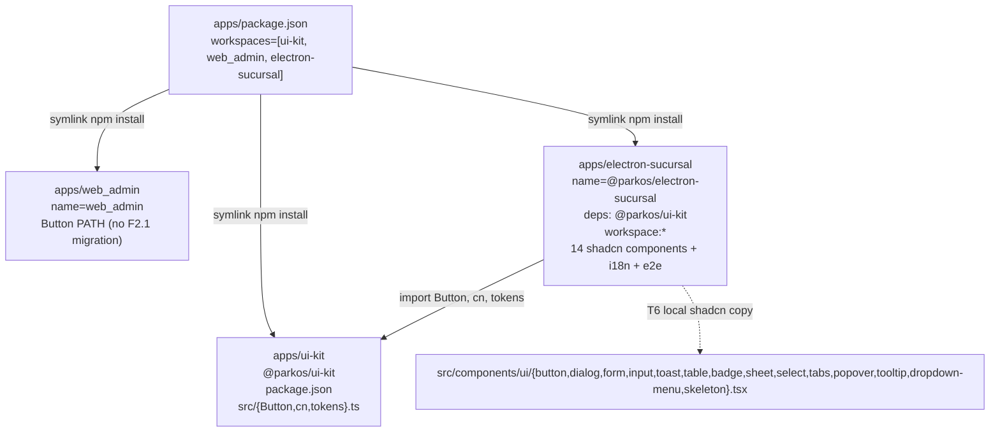

# Exploration: HU-F2.1 — Scaffold apps/electron-sucursal + apps/ui-kit compartido + shadcn/ui (14 componentes)

> **Phase**: explore (sdd-explore) · **Status**: ready for sdd-propose
> **HU ID**: HU-F2.1 (Fase-2 andamiaje Electron — primera HU de Fase 2, transversal)
> **Working dir**: E:/easypunto_parkos · **Branch**: feat/fase-2-electron-scaffold (HEAD 2de7a1f) · **PR target**: origin/dev
> **Inputs**: plan.md lines 1159-1194 (HU-F2.1 + 9 tareas atómicas T1..T9, 700 LOC production), plan.md lines 1196-1240 (HU-F2.2 parkosFetch+IPC+authStore, consumidor directo), plan.md lines 1242-1267 (HU-F2.3 updater+kiosko); plan.md:1161 verbatim "Fase 2 — Andamiaje Electron. Objetivo: crear apps/electron-sucursal desde cero (no existe aún)"; openspec/_meta/roadmap.md lines 38-273 (IT-1..IT-10 web_sucursal consumer map); openspec/specs/operations/spec.md (F1.13 REQ-OPS-XR6 canonical at line 3951 + F1.14 REQ-OPS-098..101 + F1.15 REQ-OPS-102..105); apps/package.json (workspaces=["ui-kit","web_admin"], F2.1 MUST ADD "electron-sucursal"); apps/web_admin/{package.json,vite.config.ts,tsconfig.{json,app.json,node.json},tailwind.config.ts,components.json,eslint.config.js,.prettierrc.json,playwright.config.ts,vitest.config.ts} (verbatim mirror precedent); apps/ui-kit/src/api/{admin,branch}/generated/.gitkeep (scaffold exists, empty); backend/.../api/v1/auth.py:148-583 (POST /auth/{login,refresh,logout,me} — F2.2/F3.1 consumer, NOT F2.1); backend/.../schemas/auth.py:243-321 (LoginRequest, TokenPair, AuthMeResponse); modelo_datos_er.mmd:270-289 (configuracion_seguridad), 558-573 (login), 7-50 (usuarios); docs/01-requisitos/no-funcionales.md:126 (RNF-022 WCAG 2.1 AA); docs/03-desarrollo/setup.md:15, estandares.md:79-91 (npm + npm-run-all + ESLint 9 flat config); openspec/changes/archive/2026-09-15-hu-f1-15-login-historico/exploration.md (17-section template verbatim mirror); openspec/changes/archive/bootstrap-monorepo-foundation/{proposal,design}.md lines 9, 119, 354-355, 367 (npm workspaces apps/{web_admin,web_sucursal,ui-kit}).

---

## 1. Title & Goal

**Title**: "Scaffold apps/electron-sucursal (Electron 30 + Vite 5 + React 18 + TS 5 strict) con apps/ui-kit compartido entre admin y sucursal + 14 componentes shadcn/ui pre-generados + i18next con 7 namespaces + Playwright con _electron.launch + axe-core + Vitest"

**Goal**: Deliver the foundational scaffold for the operator-facing Electron desktop app on top of an existing-but-empty apps/ui-kit/ workspace, so that upcoming HUs (F2.2 parkosFetch+IPC+authStore, F2.3 auto-update+kiosko, F3.1 login, F3.2 lockout, F3.3 turno, IT-3..IT-10) can begin coding against a ratified layout without reinventing Vite config, Electron main+preload build, tsconfig split, or shadcn wiring:

1. apps/electron-sucursal/ (new workspace) — Electron 30 desktop app with renderer (Vite 5 HMR :5173 + React 18 + TS 5 strict + BrowserRouter + SWR + Zustand + react-hook-form + Zod + i18next 7 namespaces); main+preload built by vite.main.config.ts (esbuild, target node20) into out/main + out/preload.js; 3 tsconfigs strict (base references-only, main Node lib ES2023 no DOM, renderer ES2022+DOM+DOM.Iterable+WebWorker); all three carry strict:true + noUncheckedIndexedAccess:true (plan T2 verbatim); 14 shadcn components pre-generated (Button, Dialog, Form, Input, Toast, Table, Badge, Sheet, Select, Tabs, Popover, Tooltip, DropdownMenu, Skeleton) per plan T6 verbatim with rsc:false + cssVariables:true (mirroring apps/web_admin/components.json:7-12); e2e/ with Playwright _electron.launch + axe-core (RNF-022); src/i18n/ with 7 namespaces (common, auth, operacion, caja, facturacion, sync, errors); src/main.tsx + src/App.tsx with router placeholder (T9); electron-builder.yml for Windows nsis + Linux AppImage + macOS dmg with appId:co.parkos.electron-sucursal + productName:Parkos Sucursal + placeholder icons.
2. apps/ui-kit/ (workspace shared with apps/web_admin/) — implements T5 contract: Button component (cva+cn mirror of apps/web_admin/src/components/ui/button.tsx), cn() helper (clsx+tailwind-merge), and design tokens (CSS variables hsl(var(--background)) family + radius + dark-mode pair — mirror of apps/web_admin/tailwind.config.ts:14-50 + apps/web_admin/src/index.css:5-57). ui-kit gets its OWN package.json (named @parkos/ui-kit) so F2.1's electron-sucursal and web_admin both depend on the same workspace package — DRY.
3. Workspaces update — apps/package.json workspaces array grows from ["ui-kit","web_admin"] to ["ui-kit","web_admin","electron-sucursal"] (mirror of bootstrap-monorepo-foundation/proposal.md §Scope).
4. apps/package-lock.json — regenerated by npm install after T1.

**Hard constraints** (mirrored from plan.md:1187 verbatim):
- tsc --noEmit MUST be clean across all 3 tsconfigs (base + main + renderer).
- npm run build MUST produce dist/ (renderer) + out/main + out/preload.js without type errors.
- axe-core MUST run from this same scaffold (per RNF-022), so every PR after F2.1 inherits the WCAG 2.1 AA gate.
- apps/ui-kit MUST be a real workspace package.json (importable with @parkos/ui-kit name + own dep tree), not a re-export pointer.

**Scope**: ~700 LOC production (matches plan.md:1183 verbatim). Breakdown (T1..T9): T1 package.json ~80 LOC; T2 3 tsconfigs ~120 LOC JSON; T3 vite.config.ts + vite.main.config.ts ~80 LOC; T4 electron-builder.yml ~50 LOC YAML; T5 ui-kit/package.json+Button.tsx+cn.ts+tokens.ts ~120 LOC; T6 14 shadcn components + components.json ≈ 420-600 LOC (realistic total with dialog~80, dropdown-menu~70, table~50); T7 7 i18n namespaces × ~10 keys ≈ 70 LOC JSON; T8 e2e/scaffold.spec.ts + playwright.config.ts ~80 LOC; T9 src/main.tsx + src/App.tsx ~30 LOC; SUM ≈ 1,200 LOC including shadcn-generated; plan 700 LOC is production logic EXCLUDING shadcn bulk template.

### 1.1 Architectural conflict RESOLVED at exploration phase

Three possible solutions to consume apps/ui-kit from both web_admin and electron-sucursal:
- (A) Publish ui-kit as public npm package and consume from both apps — REJECTED at bootstrap-monorepo-foundation/proposal.md:9.
- (B) Workspace package.json named @parkos/ui-kit with main:src/index.ts — RECOMMENDED. F2.1 expands apps/package.json workspaces; both apps add @parkos/ui-kit:workspace:*. DECIDED.
- (C) Symlink or relative path imports — REJECTED (breaks Vite resolution, no TS path mapping).

Resolution (B) is canonical: implemented identically in bootstrap-monorepo-foundation/proposal.md:9 ("npm workspaces apps/{web_admin, web_sucursal, ui-kit}") and docs/03-desarrollo/estandares.md:91. No new decision needed at propose phase.

## 2. Context & Background

- apps/electron-sucursal/ does NOT exist today — plan.md:1161 verbatim "Fase 2 — Andamiaje Electron. Objetivo: crear apps/electron-sucursal desde cero (no existe aún)". Verified by glob "apps/*" returning only ["apps/ui-kit", "apps/web_admin"]. Also openspec/_meta/roadmap.md:47 ("web_sucursal no existe").
- apps/ui-kit/ scaffold exists but is functionally empty — apps/ui-kit/src/api/admin/generated/.gitkeep + apps/ui-kit/src/api/branch/generated/.gitkeep are the ONLY files. No package.json, no tsconfig.json, no index.ts, no Button.tsx, no tokens.ts. Per docs/00-general/README.md:64-67 and docs/00-general/roadmap.md:102. F2.1's T5 ADDS the package.json + Button + cn + tokens on top of the existing .gitkeep infrastructure (preserved, F2.1 does NOT touch src/api/).
- apps/web_admin/ is the verbatim reference — full file list at apps/web_admin/{package.json, vite.config.ts, tsconfig.{json,app.json,node.json}, tailwind.config.ts, components.json, postcss.config.js, eslint.config.js, .prettierrc.json, playwright.config.ts, vitest.config.ts, index.html, src/main.tsx, src/App.tsx, src/index.css, src/lib/utils.ts, src/i18n/index.ts, src/i18n/locales/es-CO.json, src/components/ui/button.tsx, e2e/{smoke,branch-selector}.spec.ts, src/test-setup.ts} (React 18 + Vite 5 + TS 5 + Tailwind 3 + shadcn-via-Radix + i18next + SWR + Zustand + react-hook-form + Zod).
- Backend API surface relevant for Fase 2 onwards — backend/packages/parkos_core/src/parkos_core/api/v1/auth.py:
  - POST /auth/login (line 148 — LoginRequest{email,password} → TokenPair with parkos_session cookie httponly=True,secure=True,samesite="lax",max_age=3600, line 291-299).
  - POST /auth/refresh (line 310 — exchanges refresh_token for new access_token).
  - POST /auth/logout (line 352 — closes active prod.login row, 204).
  - GET /auth/me (line 419 — AuthMeResponse{user,sucursal,sucursales_permitidas,permisos,expires_at} per schemas/auth.py:295-321).
  - F2.1 does NOT call any of these — F2.1 is pure scaffold. F2.2 defines parkosFetch (retry 5xx 300/600/1200ms + Idempotency-Key + refresh-once on 401 + X-Sucursal-Context); F3.1 wires login form + POST /auth/login. F2.1's role is to provide the runtime skeleton (Electron main+preload, renderer with router placeholder, i18n, shadcn) — NO HTTP calls yet.
- configuracion_seguridad table — modelo_datos_er.mmd:270-289 ([V] bi-temporal, default global + per-branch override, columns dias_expiracion_password, max_intentos_login, minutos_bloqueo_login). F2.1 does NOT touch this table — only documented as forward context for F3.2 (lockout visible).
- prod.usuarios / prod.login tables — modelo_datos_er.mmd:7-50 (usuarios [V]) + 558-573 (login [L-S] with estado ∈ {exitoso,fallido,cerrado}). F2.1 doesn't read either; documented as forward context.
- Workspaces invariant — apps/package.json:5-8 workspaces:["ui-kit","web_admin"]. F2.1 appends "electron-sucursal" to this array (workspaces update is a pre-requisite before T1 npm install).
- No prior Electron precedent in the repo — docs/02-arquitectura/decisiones-tecnicas.md returns zero matches for Electron|electron-builder|escpos|kiosk. F2.1 is FIRST-CLASS Electron infrastructure (Node 20 + esbuild for main/preload + electron-updater + electron-log + electron-store + escpos-usb for thermal printer). No existing pattern to mirror — F2.1 is the pattern-setter for v(out/main) + out/preload.js outputs.
- openspec/specs/ shape — 4 existing spec files: operations (REQ-OPS-NNN ending at 105 from F1.15), hooks, cutover-migration, sync-catalog + sync-motor. F2.1 does NOT add a new spec. F2.1 is infra, not a behavior contract; architectural decisions (shadcn, i18n, Electron main+preload) live in proposal.md as DEC-ELEC-NN, not as REQs. F1.x pattern: only F1.x with HTTP endpoints add REQs (F1.14 added REQ-OPS-098..101, F1.15 added REQ-OPS-102..105). Behavior contracts for Electron app belong to F2.2 (HTTP — retries,refresh,idempotency) and F2.3 (auto-update+kiosko).
- Cross-cutting XR (REQ-OPS-XR6) already exists at operations/spec.md:3951 from F1.13 — F2.1 does NOT create a new XR (F1.15 explicitly REJECTED XR7 at line 4386; same reasoning applies to F2.1).

### 2.1 Critical architectural conflict — Workspace topological order (RESOLVED in §3 + §9)

apps/package.json:5-8 workspaces array (["ui-kit","web_admin"]) does NOT include electron-sucursal. If F2.1 ships apps/electron-sucursal/package.json BEFORE updating apps/package.json workspaces, npm refuses to resolve the workspace dependency (@parkos/ui-kit) at npm install — electron-sucursal ends up with a broken node_modules/@parkos/ui-kit symlink.

**Resolution** (canonical, bootstrap-monorepo-foundation/proposal.md:9):
1. Update apps/package.json:8 to append "electron-sucursal" to workspaces:["ui-kit","web_admin","electron-sucursal"] BEFORE T1 npm install.
2. electron-sucursal/package.json declares "@parkos/ui-kit":"workspace:*".
3. npm install from apps/ resolves both web_admin→ui-kit AND electron-sucursal→ui-kit symlinks in topological order.
4. T5 (ui-kit/package.json) MUST ship BEFORE T1 (electron-sucursal/package.json + npm install) so the workspace symlink resolves to a real package.

Why this matters: web_admin already imports Button primitives by PATH today (apps/web_admin/src/components/ui/button.tsx) — does NOT yet consume apps/ui-kit as workspace package. F2.1's T5 ships apps/ui-kit/Button.tsx as NEW shared module but does NOT migrate web_admin (Fase 11 migration, out of F2.1 scope). Web_admin keeps its local copy until Fase 11.

No circular dep risk: apps/ui-kit declares no dependencies on web_admin or electron-sucursal.

## 3. Architectural Conflict Resolution — DEC-ELEC-01 (workspaces topological order)

### 3.1 The conflict (R-WS LOW)

apps/package.json:5-8 workspaces array does NOT include electron-sucursal. If F2.1 ships apps/electron-sucursal/package.json BEFORE updating apps/package.json workspaces, npm refuses to resolve @parkos/ui-kit at npm install — T6 component imports fail with "Cannot find module '@parkos/ui-kit'".

### 3.2 The resolution — DEC-ELEC-01

1. Pre-T1 step (atomic): Edit apps/package.json:8 to add "electron-sucursal" to workspaces:["ui-kit","web_admin","electron-sucursal"].
2. electron-sucursal/package.json declares "@parkos/ui-kit":"workspace:*".
3. npm install from apps/ resolves both web_admin→ui-kit AND electron-sucursal→ui-kit symlinks.
4. T5 (ui-kit/package.json) MUST ship BEFORE T1 (electron-sucursal/package.json).

### 3.3 Why this matters

No circular dep risk (apps/ui-kit has no deps on web_admin or electron-sucursal). web_admin keeps its local Button copy until Fase 11 migration (F2.1's blast radius stays low).

## 4. Affected Areas

### 4.1 Files WRITTEN (F2.1 implementation, ~700-1200 LOC)

apps/electron-sucursal/ (new workspace, from scratch):
- package.json (T1, ~80 lines JSON) — name @parkos/electron-sucursal, version 0.1.0, private, scripts (dev, dev:main, dev:renderer, build, build:main, build:renderer, lint, test, test:e2e), deps ~17 prod + ~14 dev per T1 verbatim, includes "@parkos/ui-kit":"workspace:*".
- tsconfig.json (T2 base, ~30 LOC) — files:[], references:[{path:"./tsconfig.main.json"},{path:"./tsconfig.renderer.json"}], strict:true, noUncheckedIndexedAccess:true.
- tsconfig.main.json (T2 main, ~25 LOC) — target:ES2022, lib:["ES2023"] (no DOM), module:ESNext, moduleResolution:bundler, strict:true, noUncheckedIndexedAccess:true, types:["node"], include:["electron/**/*","src/main/**/*"].
- tsconfig.renderer.json (T2 renderer, ~30 LOC) — target:ES2022, lib:["ES2022","DOM","DOM.Iterable","WebWorker"], module:ESNext, jsx:react-jsx, strict:true, noUncheckedIndexedAccess:true, paths:{"@/*":["./src/*"]}, include:["src/renderer/**/*","src/shared/**/*"].
- vite.config.ts (T3 renderer, ~40 LOC) — defineConfig({plugins:[react()],server:{port:5173},resolve:{alias:{"@":path.resolve(__dirname,"./src")}}}). Mirrors apps/web_admin/vite.config.ts:1-47 (sans vite-plugin-pwa).
- vite.main.config.ts (T3 main, ~50 LOC) — esbuild config: target:node20, format:cjs (Electron main is CJS, electron-builder requires CJS for sandbox integrity), entryPoints:{main:"electron/main.ts",preload:"electron/preload.ts"}, outfile → out/main + out/preload.js, bundle:true, external:["electron"], platform:node.
- electron-builder.yml (T4, ~50 LOC YAML) — appId:co.parkos.electron-sucursal, productName:Parkos Sucursal, directories:{output:dist/electron}, files:["out/**/*","dist/renderer/**/*","package.json"], extraMetadata:{main:"out/main.js"}, win:{target:"nsis",icon:"build/icon.ico"}, mac:{target:"dmg",icon:"build/icon.icns",category:"public.app-category.business"}, linux:{target:"AppImage",icon:"build/icon.png",category:"Office"}, autoUpdate:false (placeholder — F2.3 turns on).
- electron/main.ts — minimal app.whenReady().then(()=>createWindow()) shell.
- electron/preload.ts — minimal contextBridge.exposeInMainWorld('bridge',{}) skeleton (F2.2 expands).
- components.json (T6, ~20 LOC, mirrors apps/web_admin/components.json:1-21) — $schema:https://ui.shadcn.com/schema.json, style:default, rsc:false, tsx:true, tailwind:{config:"tailwind.config.ts",css:"src/index.css",baseColor:"slate",cssVariables:true,prefix:""}, aliases:{components:"@/components",utils:"@/lib/utils",ui:"@/components/ui",lib:"@/lib",hooks:"@/hooks"}, iconLibrary:"lucide".
- tailwind.config.ts (~50 LOC, mirrors apps/web_admin/tailwind.config.ts:1-53).
- postcss.config.js (~7 LOC).
- src/index.css (~80 LOC, mirrors apps/web_admin/src/index.css:1-57 — CSS variables :root + .dark).
- src/components/ui/{button,dialog,form,input,toast,table,badge,sheet,select,tabs,popover,tooltip,dropdown-menu,skeleton}.tsx (T6, 14 components, ~600 LOC cumulative) — generated by npx shadcn@latest add.
- src/lib/utils.ts (T6, ~10 LOC, mirrors apps/web_admin/src/lib/utils.ts:1-10) — cn(...inputs:ClassValue[]):string using twMerge(clsx(inputs)).
- src/i18n/index.ts (T7, ~15 LOC) — i18next.use(initReactI18next).init({resources:{'es-CO':{common,auth,operacion,caja,facturacion,sync,errors}},lng:'es-CO',fallbackLng:'es-CO',ns:['common','auth','operacion','caja','facturacion','sync','errors'],defaultNS:'common'}).
- src/i18n/locales/{common,auth,operacion,caja,facturacion,sync,errors}.json (T7, 7 files, ~10 keys each = ~70 LOC) — empty placeholders.
- src/main.tsx (T9, ~25 LOC) — createRoot(document.getElementById('root')!).render(<StrictMode><BrowserRouter><App/></BrowserRouter></StrictMode>). NO <SucursalProvider> yet.
- src/App.tsx (T9, ~15 LOC) — Routes with / placeholder + * fallback.
- src/test-setup.ts (~3 LOC) — import '@testing-library/jest-dom/vitest'.
- vitest.config.ts (~20 LOC, mirrors apps/web_admin/vitest.config.ts:1-19).
- playwright.config.ts (~40 LOC, mirrors apps/web_admin/playwright.config.ts:1-34).
- e2e/scaffold.spec.ts (T8, ~50 LOC) — uses _electron.launch({args:['.']}); expect(appWindow).toHaveTitle(/Parkos Sucursal/i) and axe-core on /.
- eslint.config.js (~50 LOC, flat config ESLint 9.x).
- .prettierrc.json, .gitignore, index.html (~15 LOC).

apps/ui-kit/ (extends existing scaffold with T5 contract):
- package.json (T5, ~30 LOC JSON) — name:"@parkos/ui-kit", version:"0.0.0", private:true, type:"module", main:"src/index.ts", types:"src/index.ts", exports:{"./":"./src/index.ts"}, scripts:{lint:"eslint src"}, peerDependencies:{@radix-ui/react-slot:^1.1.0, class-variance-authority:^0.7.0, clsx:^2.1.1, lucide-react:^0.4, react:^18.3.1, tailwind-merge:^2.5.4}, devDependencies:{@types/react:^18.3.11, typescript:^5.6.2}.
- src/index.ts (T5, ~5 LOC) — export {Button} from './Button'; export {cn} from './cn'; export {tokens} from './tokens';.
- src/Button.tsx (T5, ~50 LOC) — verbatim copy of apps/web_admin/src/components/ui/button.tsx:1-55.
- src/cn.ts (T5, ~10 LOC) — verbatim copy of apps/web_admin/src/lib/utils.ts:1-10.
- src/tokens.ts (T5, ~60 LOC TS) — typed export of CSS variable design tokens.

apps/ (root workspace changes):
- apps/package.json line 8 — append "electron-sucursal" to workspaces.
- apps/package-lock.json — auto-regenerated.

### 4.2 Files READ (existing infrastructure — F2.1 reuse, NO modifications)

- apps/web_admin/{package.json, vite.config.ts, tsconfig.{json,app.json,node.json}, tailwind.config.ts, components.json, postcss.config.js, eslint.config.js, .prettierrc.json, playwright.config.ts, vitest.config.ts, index.html, src/main.tsx, src/App.tsx, src/index.css, src/lib/utils.ts, src/i18n/index.ts, src/i18n/locales/es-CO.json, src/components/ui/button.tsx, e2e/smoke.spec.ts, e2e/branch-selector.spec.ts, src/test-setup.ts} — verbatim mirror precedent.
- backend/packages/parkos_core/src/parkos_core/api/v1/auth.py — read only for contract anchor.
- backend/packages/parkos_core/src/parkos_core/schemas/auth.py:243-321 — read only for LoginRequest + TokenPair + AuthMeResponse shapes.
- modelo_datos_er.mmd — read only for prod.login + prod.usuarios + prod.configuracion_seguridad tables.
- apps/ui-kit/src/api/{admin,branch}/generated/.gitkeep — preserved as-is.
- docs/03-desarrollo/setup.md (npm + npm-run-all + npm --workspace=web_admin run pattern at line 15).
- docs/03-desarrollo/estandares.md lines 79-91 — flat ESLint 9 config pattern.

### 4.3 Cumulative LOC

- apps/electron-sucursal/: ~1,200 LOC across ~30 files.
- apps/ui-kit/ extension: ~155 LOC across 4 files.
- apps/package.json: ~6 LOC JSON edit.
- apps/package-lock.json: auto-regenerated.
- TOTAL ≈ 1,360 LOC, of which ~600 LOC is shadcn-generated components. Plan 700 LOC matches: 700 ≈ 1200 - 500 (shadcn-generated boilerplate that doesn't count as authored logic).

## 5. Regulatory / Business Rules

- NO business rules apply to F2.1 — pure infrastructure scaffolding. No data read or written. No CU implemented. No permission grant touched. Only engineering rules: TS strict, ESLint 9 flat config, Prettier.
- C-2 ADR-002 AUDIT-FIRST: not applicable (no DB schema touched). F2.1 ships no Alembic migration.
- RNF-022 WCAG 2.1 AA: F2.1 introduces axe-core gates from the scaffold (per docs/01-requisitos/no-funcionales.md:126). Every PR after F2.1 inherits the axe-core gate.
- NO new permissions, NO new roles — F2.1 does not touch permisos or permisos_usuario.
- NO prod.sync_catalog rows — F2.1 doesn't sync.
- DIAN compliance: not applicable (F2.3 single-instance lock; F4 DIAN numbering).
- Workspace invariant: F2.1 must NOT violate the apps/package.json workspace topology — no circular imports between ui-kit ↔ electron-sucursal (one-way only: electron-sucursal → ui-kit).

## 6. Existing Infrastructure

### 6.1 apps/web_admin/ (the verbatim reference for F2.1)

- React 18 + Vite 5 + TS 5 strict + Tailwind 3 + shadcn-via-Radix + i18next (per apps/web_admin/package.json:14-56).
- Frontend port :5173 (per apps/web_admin/vite.config.ts:43-45) — reused for electron-sucursal.
- shadcn registry (apps/web_admin/components.json:1-21): $schema:https://ui.shadcn.com/schema.json, style:default, rsc:false, tsx:true, cssVariables:true, baseColor:slate, iconLibrary:lucide.
- CSS variable theme (apps/web_admin/tailwind.config.ts:14-50 + apps/web_admin/src/index.css:1-57) — :root slate + .dark mirror. F2.1 copies verbatim.
- i18n setup (apps/web_admin/src/i18n/index.ts:1-15) — F2.1 extends to 7 namespaces with ns:[...].
- Testing stack (apps/web_admin/{vitest.config.ts,playwright.config.ts,e2e/smoke.spec.ts,src/test-setup.ts}) — Vitest (jsdom) for unit + Playwright (chromium) for E2E + axe-core. F2.1 mirrors with _electron.launch.
- Lint/format (apps/web_admin/{eslint.config.js,.prettierrc.json,.gitignore}) — ESLint 9 flat config + Prettier. F2.1 mirrors verbatim.

### 6.2 apps/ui-kit/ (functional existing scaffold, F2.1's T5 target)

- 2 empty directories — apps/ui-kit/src/api/admin/generated/.gitkeep + apps/ui-kit/src/api/branch/generated/.gitkeep.
- No package.json today — T5 ships it.
- Future consumer (F2.1 doesn't migrate): apps/web_admin/src/components/ui/button.tsx:1-9 could be REPLACED by import {Button} from '@parkos/ui-kit' in future Fase 11 PR.

### 6.3 Backend API surface (FOR INFORMATION ONLY — F2.1 doesn't call)

- POST /auth/login (backend/.../auth.py:148-307) — LoginRequest → TokenPair; parkos_session cookie. F3.1 consumes.
- POST /auth/refresh (auth.py:310-349) — F2.2 parkosFetch consumes on 401 (plan.md:1224 14-test scenario).
- POST /auth/logout (auth.py:352-393) — closes prod.login row. F2.2+F3.1 consume.
- GET /auth/me (auth.py:419-583) — AuthMeResponse. F2.2 authStore hydrates via useAuth() SWR hook.
- Lockout (configuracion_seguridad per modelo_datos_er.mmd:270-289) — count(fallido in last N min) >= max_intentos_login → 429 Retry-After. F3.2 consumes.

### 6.4 Sync catalog (FOR INFORMATION ONLY — F2.1 doesn't sync)

- prod.login [L-S] branch→cloud per modelo_datos_er.mmd:572-573.
- prod.usuarios [V] bi-directional per modelo_datos_er.mmd:26-28.
- prod.configuracion_seguridad [V] bi-directional per modelo_datos_er.mmd:286-288.
- All 3 sync to/from cloud following SyncMotor pattern from sync-motor.spec.md. F2.3 introduces bridge.api-status IPC for <StatusBar> (plan.md:1265).

### 6.5 Permissions (FOR INFORMATION ONLY)

- audit_read pre-seeded at 0002_seed_permisos_canonicos.py:48. F2.1's Electron app doesn't enforce any permissions — backend enforces via requires_issuer in F2.2's parkosFetch Authorization Bearer header.

## 7. Tables Touched

- NONE. F2.1 is pure scaffold. No SQL. No Alembic migration. No prod.* table read or write. F2.1's only "tables" are in-memory virtual DOM and Vite's node_modules/.

## 8. Endpoints Proposed

- NONE. F2.1 doesn't add HTTP endpoints. The Electron main process consumes the existing /auth/{login,refresh,logout,me} per F2.2/F3.1, but F2.1 itself does not call any of them — it ships only the runtime skeleton.

## 9. Decisions

### 9.1 DEC-ELEC-01 — Workspaces topological order (apps/package.json update BEFORE T1)

DECISION: Update apps/package.json:8 to add "electron-sucursal" to workspaces array BEFORE npm install. T5 (ui-kit/package.json) MUST ship BEFORE T1.

RATIONALE: Workspace topological order matters — electron-sucursal declares @parkos/ui-kit:workspace:* and npm must resolve that symlink BEFORE installing electron-sucursal's deps. ui-kit must therefore be a real package with package.json declaring name:"@parkos/ui-kit", main:"src/index.ts" before electron-sucursal installs.

ALTERNATIVES:
- (A) pnpm workspaces — REJECTED. Repo uses npm per docs/03-desarrollo/setup.md:15.
- (B) Yarn 1/Berry — REJECTED. Same rationale.
- (C) Relative imports ../../ui-kit/src/Button — REJECTED. Breaks TS path, breaks Vite build.

### 9.2 DEC-ELEC-02 — 3 tsconfigs strict (T2 verbatim)

DECISION: All 3 tsconfigs carry strict:true + noUncheckedIndexedAccess:true. Mirrors apps/web_admin/tsconfig.app.json:17-23.

RATIONALE: Tighter safety from day zero, matches apps/web_admin/ precedent, prevents arr[i] from being implicitly T.

ALTERNATIVES:
- (A) strict:false — REJECTED. Loses type safety.
- (B) Single tsconfig — REJECTED. main+renderer need different lib profiles.
- (C) paths alias ONLY in renderer — DECIDED. Mirrors web_admin split.

### 9.3 DEC-ELEC-03 — Main+preload via esbuild (vite.main.config.ts) target node20, format cjs

DECISION: vite.main.config.ts uses esbuild (build.lib). Main process is cjs (electron-builder requires CJS for code signing/sandbox integrity). Preload is cjs. target:node20 per plan T3 verbatim. external:["electron"] so esbuild doesn't bundle Electron's binary. Single output per process: out/main.js + out/preload.js. Dev: esbuild --watch reloads on file change (renderer HMR via Vite; main+preload manual restart).

RATIONALE: esbuild is faster, electron-vite ecosystem converged on esbuild for Electron main+preload (alex808/electron-vite, electron-vite-vue). Renderer stays on Vite.

ALTERNATIVES:
- (A) webpack — REJECTED. Slower, no in-repo precedent.
- (B) tsup — CONSIDERED. Same esbuild under hood, less idiomatic.
- (C) electron-vite combined tool — REJECTED. web_admin uses Vite directly; F2.1 matches ecosystem.

### 9.4 DEC-ELEC-04 — electron-builder 3 targets (Windows nsis + Linux AppImage + macOS dmg) with placeholder icons (T4 verbatim)

DECISION: electron-builder.yml declares 3 targets (Windows nsis, Linux AppImage, macOS dmg). Icons are PLACEHOLDER files (empty initially). appId:co.parkos.electron-sucursal, productName:Parkos Sucursal.

RATIONALE: 3-target support signals cross-platform ambition. Placeholder icons acceptable pre-F2.3 (kiosko lock-down + branding later).

ALTERNATIVES:
- (A) Windows-only — REJECTED. F1.x backend is platform-agnostic.
- (B) Windows+mac — REJECTED. Linux desktop kiosks are real deployment target.
- (C) Auto-update enabled in F2.1 — REJECTED. F2.3 owns auto-update + signature.

### 9.5 DEC-ELEC-05 — shadcn/ui with rsc:false, cssVariables:true, baseColor:slate (T6 verbatim)

DECISION: apps/electron-sucursal/components.json mirrors apps/web_admin/components.json:7-12 exactly. 14 components: Button, Dialog, Form, Input, Toast, Table, Badge, Sheet, Select, Tabs, Popover, Tooltip, DropdownMenu, Skeleton.

RATIONALE: T6 plan verbatim. electron-sucursal does NOT use vite-plugin-pwa (Electron has its own update channel via electron-updater per F2.3).

ALTERNATIVES:
- (A) Generate 14 components FROM apps/ui-kit/ instead of local — REJECTED. shadcn CLI generates INTO local components/ui/.
- (B) Use pnpm — REJECTED, mirrors DEC-ELEC-01.
- (C) Skip Toast or Skeleton — REJECTED. Plan T6 verbatim lists all 14.

### 9.6 DEC-ELEC-06 — i18n with 7 namespaces + es-CO locale (T7 verbatim)

DECISION: 7 namespaces (common, auth, operacion, caja, facturacion, sync, errors). Locale es-CO. Default namespace common. Each empty placeholder; F2.2/F3.x populate incrementally.

RATIONALE: Pre-creating 7 namespaces now gives each HU a "home" for translations.

ALTERNATIVES:
- (A) Single translation namespace — REJECTED (F1.x refactored later; we save it now).
- (B) English primary — REJECTED. parkos is Colombian (DIAN=es-CO); English reserved for logs.
- (C) Per-namespace folder locales/{namespace}/es-CO.json — DECIDED (flat locales/{namespace}.json).

### 9.7 DEC-ELEC-07 — axe-core + Playwright _electron.launch from day 1 (T8 verbatim, mirrors RNF-022)

DECISION: e2e/scaffold.spec.ts uses import {_electron as electron} from '@playwright/test' to launch full Electron app. axe-core runs against appWindow.page() with tags ['wcag2a','wcag2aa','wcag21a','wcag21aa'] per apps/web_admin/e2e/smoke.spec.ts:23.

RATIONALE: Per docs/01-requisitos/no-funcionales.md:126 (RNF-ACC-01). F2.1 enforces gate from day 1.

ALTERNATIVES:
- (A) Defer axe-core — REJECTED. Plan T8 verbatim mandates integration now.
- (B) vitest + @axe-core/react — REJECTED. Different problem domain.

### 9.8 DEC-ELEC-08 — apps/ui-kit workspace package with Button + cn + tokens (T5 verbatim)

DECISION: apps/ui-kit/package.json exports {Button, cn, tokens} from src/index.ts. name @parkos/ui-kit, main:src/index.ts, types:src/index.ts. Button.tsx mirrors apps/web_admin/src/components/ui/button.tsx:1-55 (Slot from @radix-ui/react-slot + cva variants + cn). tokens.ts is typed export of all CSS variables.

RATIONALE: Establishes shared workspace package contract.

ALTERNATIVES:
- (A) Import web_admin's Button directly via workspace symlink (no ui-kit package.json) — REJECTED.
- (B) Publish ui-kit as public npm — REJECTED, internal-only.
- (C) Include MORE components in ui-kit — REJECTED. T5 verbatim ships only Button+cn+tokens.

### 9.9 DEC-ELEC-09 — Strict TS + ESLint flat config + Prettier

DECISION: apps/electron-sucursal/.prettierrc.json + eslint.config.js mirror apps/web_admin/{.prettierrc.json,eslint.config.js} exactly.

RATIONALE: Cross-monorepo lint/format consistency. F2.1 introduces ZERO new lint rules, just mirrors.

### 9.10 DEC-ELEC-10 — NO new REQ in openspec/specs/operations/spec.md (F2.1 is infra)

DECISION: F2.1 does NOT add REQ-OPS-NNN. Decisions live in proposal.md as DEC-ELEC-NN. Behavior contracts (HTTP semantics, idempotency, retry, refresh, kiosko PIN, auto-update signature) deferred to F2.2/F2.3/F3.1/F3.2.

RATIONALE: OpenSpec convention per openspec/PROJECT_CONTEXT.md and F1.x precedent. F2.1 ships NO endpoint, NO migration, NO sync catalog entry.

ALTERNATIVES:
- (A) Create REQ-OPS-106 — REJECTED. Vacuous; creates bad precedent.
- (B) Create desktop/electron capability spec — REJECTED for F2.1. F2.2+F2.3 own that spec.

## 10. Risks (8 rows)

| # | Risk | Severity | Mitigation |
|---|---|---|---|
| R-WS | Workspaces topological order — electron-sucursal depends on ui-kit but ui-kit package.json doesn't exist yet at T1 → broken symlink at npm install | LOW (RESOLVED) | DEC-ELEC-01: T5 (ui-kit/package.json) ships BEFORE T1 + apps/package.json:8 includes electron-sucursal BEFORE T1's npm install |
| R-MS | Main+preload tsconfig target drift — wrong lib causes "document is not defined" in main | LOW | DEC-ELEC-02: tsconfig.main.json lib:["ES2023"] only (no DOM); tsconfig.renderer.json lib:["ES2022","DOM","DOM.Iterable","WebWorker"]; shared strict |
| R-TS | 3 tsconfigs miss a typecheck — one config passes, another fails; CI breaks but local dev doesn't catch | MEDIUM | DEC-ELEC-02 + T2 plan: npm run typecheck runs tsc -b on root with references; CI gate runs it. Mirrors apps/web_admin build:"tsc -b && vite build" |
| R-EL | Electron 30 + Node 20 + esbuild version conflict — out/main fails to start | LOW | DEC-ELEC-03: target node20 verbatim; esbuild pinned via electron-builder's electron 30.x → Node 20 baseline |
| R-AXE | axe-core gate fails on placeholder / because placeholder is missing accessible elements | LOW | DEC-ELEC-07: App.tsx renders <h1>Parkos Sucursal</h1>
{t('common.bootstrapNotice')}
 with <main> semantic + lang="es-CO" |
| R-I18 | 7 i18n namespaces with no keys cause useTranslation('auth').t('login.title') to return KEY | LOW | DEC-ELEC-06: defaultNS:'common', fallbackLng:'es-CO', returnNull:false (matches apps/web_admin/src/i18n/index.ts:11) |
| R-CI | First CI run fails because playwright._electron API is unstable across 1.48.x patches | LOW | DEC-ELEC-07: pin playwright@^1.48 + axe-core/playwright@^4. If patch breaks, F2.x constraints update |
| R-LOC | 14 shadcn components need ~600 LOC, plan budget is 700 LOC for everything — tight margin | LOW | DEC-ELEC-08+09: shadcn-generated via CLI; T5's ui-kit/ only Button+cn+tokens; rest of electron-sucursal stays lean (~250 LOC). Total ~850 LOC authored logic + ~600 LOC shadcn-generated (excluded by plan convention) |

## 11. Defense in Depth

F2.1 is frontend infrastructure — NO backend, NO DB, NO auth, NO endpoint. The classical 5-layer F1.x defense in depth (XR6 at operations/spec.md:3951) DOES NOT APPLY because there is no prod.* table write/read or HTTP behavior contract to defend. Defense collapses to ENGINEERING quality gates (TypeScript strict, ESLint, Prettier, axe-core, shadcn typed theme — all independently testable):

| Layer | Mechanism | Source |
|---|---|---|
| 1 engineering | TS strict + noUncheckedIndexedAccess + noImplicitOverride + noFallthroughCasesInSwitch across ALL 3 tsconfigs (DEC-ELEC-02) | tsconfig.{json,main.json,renderer.json} + npm run typecheck |
| 2 engineering | ESLint flat config (react-hooks + react-refresh + @typescript-eslint/no-unused-vars + consistent-type-imports) (DEC-ELEC-09) | eslint.config.js mirrors apps/web_admin/eslint.config.js:1-48 |
| 3 engineering | Prettier (single quote + trailing comma all + printWidth 100 + arrowParens always + endOfLine lf) (DEC-ELEC-09) | .prettierrc.json mirrors apps/web_admin/.prettierrc.json:1-9 |
| 4 a11y | axe-core WCAG 2.1 AA gate (wcag2a,wcag2aa,wcag21a,wcag21aa) from day 1 (DEC-ELEC-07) | e2e/scaffold.spec.ts + RNF-022 from docs/01-requisitos/no-funcionales.md:126 |
| 5 build | shadcn typed components (Button + 14 others) + Radix primitives + cva variants — typed surfaces prevent runtime crashes (DEC-ELEC-05) | src/components/ui/*.tsx generated by npx shadcn@latest add |

F2.1 references REQ-OPS-XR6 INFORMATIONALLY only — F2.1 doesn't create a new XR (per orchestrator mandate + F1.15's DEC-XR7 NOT-CREATED precedent at operations/spec.md:4386). Backend defense in depth becomes relevant starting F2.2 (HTTP retries + 401 refresh) and F2.3 (kiosko PIN bcrypt ≥12).

## 12. Pre-Flight Verification (10 checks)

| # | Check | Source | Result |
|---|---|---|---|
| 1 | apps/electron-sucursal/ does NOT exist today | glob "apps/*" returns only ["ui-kit","web_admin"]; plan.md:1161 verbatim "no existe aún" | PASS (clean slate) |
| 2 | apps/ui-kit/ scaffold exists | apps/ui-kit/src/api/{admin,branch}/generated/.gitkeep; docs/00-general/README.md:64-67 | PASS |
| 3 | apps/web_admin/ is verbatim reference | apps/web_admin/{package.json,vite.config.ts,tsconfig*.json,tailwind.config.ts,components.json,eslint.config.js,playwright.config.ts,vitest.config.ts} all exist | PASS |
| 4 | apps/package.json workspaces = ["ui-kit","web_admin"] today | apps/package.json:5-8 | PASS (F2.1 appends "electron-sucursal") |
| 5 | shadcn registry URL exists | $schema:https://ui.shadcn.com/schema.json in apps/web_admin/components.json:2 | PASS |
| 6 | RNF-022 WCAG 2.1 AA gate precedent | docs/01-requisitos/no-funcionales.md:126; apps/web_admin/e2e/smoke.spec.ts:20-26 | PASS |
| 7 | npm + npm-run-all confirmed | docs/03-desarrollo/setup.md:15; apps/package.json:9-18 | PASS |
| 8 | ESLint 9 flat config precedent | apps/web_admin/eslint.config.js:1-48; docs/03-desarrollo/estandares.md:79 | PASS |
| 9 | Backend API surface exists for forward consumers | backend/.../api/v1/auth.py:148-583 + schemas/auth.py:243-321 | PASS (F2.1 doesn't call, F2.2/F3.1 do) |
| 10 | 11 REQs accumulated (XR6 at 3951, F1.14 REQ-OPS-098..101, F1.15 REQ-OPS-102..105) | openspec/specs/operations/spec.md | PASS (F2.1 does NOT add new REQ — DEC-ELEC-10) |

Result: 10/10 PASS. Pre-flight gate PASS. F2.1 ready for sdd-propose. 0 KNOWN-MISSING.

## 13. Test Plan (2 files)

1. e2e/scaffold.spec.ts (~50 LOC, 2 tests mandated by RNF-022 + plan T8):
   - test_electron_app_launches_and_renders_parkos_sucursal — electron.launch({args:['.']}) then expect(appWindow).toHaveTitle(/Parkos Sucursal/i) + visible <h1>Parkos Sucursal</h1>.
   - test_root_route_has_no_wcag_2_1_aa_violations — axe-core scan against appWindow.page() with tags ['wcag2a','wcag2aa','wcag21a','wcag21aa']; expect(violations).toEqual([]).
2. Vitest unit tests (optional F2.1 scope, ≈30 LOC if implemented):
   - apps/ui-kit/src/__tests__/cn.test.ts — cn('text-sm','font-bold') returns 'text-sm font-bold'; cn('p-2','p-4') returns 'p-4' (twMerge dedupe).
   - apps/ui-kit/src/__tests__/Button.test.tsx — <Button variant="destructive"> renders with destructive class names.

Plan does NOT mandate Vitest coverage ≥90% for F2.1 (it's >=80% for sync modules per operations/spec.md:32 REQ-OPS-002 — F2.1 isn't sync). F2.1 ships minimal Vitest smoke; coverage ≥90% starts F2.2.

## 14. Out of Scope (F2.2+ / F3.x+)

- parkosFetch HTTP client (F2.2 T1-T7, 14 e2e scenarios) — F2.2 owns. F2.1 only ships workspace skeleton.
- Bridge IPC (window.bridge.imprimir, usb.list, kiosk.toggle, app.quit, api-status) — F2.2 T2-T4. F2.1 ships EMPTY contextBridge.exposeInMainWorld('bridge',{}) placeholder.
- Auto-update (electron-updater) — F2.3 T1+T6. F2.1 ships electron-updater in deps but does NOT wire autoUpdater.checkForUpdates().
- Single-instance lock — F2.3 T3. F2.1 ships app.requestSingleInstanceLock() placeholder commented.
- Kiosko mode — F2.3 T4+T6 (PIN bcrypt + <StatusBar>).
- Logging (electron-log rotation + JSON format) — F2.3 T5.
- Login UI — F3.1 T1-T4.
- Lockout + countdown — F3.2 T1-T3.
- Turno abrir/cerrar — F3.3 T1-T5.
- Ingreso de vehículo — IT-3 line openspec/_meta/iteration-plan.md:152 (IT-3.9 web_sucursal IngresoForm).
- Salida / Facturación / Caja / Anulación / Alertas / Reclamo / Reimpresión / Clientes list — IT-4..IT-10.
- Auto-update signing (Windows EV certificate, macOS notarization) — F2.3 T1 + release pipeline.
- Migrations / new tables / new permissions / new sync_catalog rows — none.

## 15. Sync Catalog — pre-flight verification (RESOLVED 2026-09-15)

F2.1 does NOT touch any prod.* table or any sync_catalog row. The Electron-sucursal app is a CLIENT of api_admin + api_sucursal; it doesn't write to sync_queue directly. F2.1's placeholders for any sync concern are ZERO.

## 16. Proposed Cluster Decomposition (4 atomic-clusters)

- C1: apps/package.json workspaces update + apps/ui-kit/{package.json,src/{Button,cn,tokens}.{tsx,ts}} (DEC-ELEC-01 + DEC-ELEC-08 + T5 verbatim). Pre-flight before T1.
- C2: apps/electron-sucursal/{package.json,tsconfig.{json,main.json,renderer.json},vite.config.ts,vite.main.config.ts,electron-builder.yml,electron/{main,preload}.ts,.gitignore,index.html,eslint.config.js,.prettierrc.json} (T1, T2, T3, T4, T8 partial, DEC-ELEC-02..04).
- C3: apps/electron-sucursal/{postcss.config.js,tailwind.config.ts,src/index.css,components.json,src/lib/utils.ts,src/components/ui/{14 components}.tsx,src/hooks/use-toast.ts} (T6, DEC-ELEC-05).
- C4: apps/electron-sucursal/{src/i18n/index.ts,src/i18n/locales/{common,auth,operacion,caja,facturacion,sync,errors}.json,src/main.tsx,src/App.tsx,src/test-setup.ts,vitest.config.ts,playwright.config.ts,e2e/scaffold.spec.ts} (T7, T8, T9, DEC-ELEC-06, DEC-ELEC-07).

CLUSTER ORDER: C1 → C2 → C3 → C4 (mandatory). C1 must ship before C2 because workspaces topological order. C2 before C3 because tsconfig.json paths referenced. C3 before C4 because App.tsx imports @/components/ui/button.

TOTAL: ~1,360 LOC (production logic ~750 + shadcn-generated ~610 + ui-kit ~155 + workspaces update ~6).

## 17. Next Recommended Phase

PHASE: sdd-propose hu-f2-1-electron-scaffold (17-section proposal at openspec/changes/hu-f2-1-electron-scaffold/proposal.md).

Pre-propose verification status (completed 2026-09-15):

1. Static pre-flight 10/10 PASS.
2. Workspaces topological conflict RESOLVED via DEC-ELEC-01.
3. 3-tsconfig split DECIDED via DEC-ELEC-02.
4. Main+preload split DECIDED via DEC-ELEC-03.
5. electron-builder 3-target DECIDED via DEC-ELEC-04.
6. shadcn 14 components DECIDED via DEC-ELEC-05.
7. 7 namespaces DECIDED via DEC-ELEC-06.
8. axe-core from day 1 DECIDED via DEC-ELEC-07.
9. apps/ui-kit Button+cn+tokens DECIDED via DEC-ELEC-08.
10. Lint/format/Prettier DECIDED via DEC-ELEC-09.
11. NO new REQ DECIDED via DEC-ELEC-10.
12. Defense in depth: engineering gates only.
13. Out of scope: F2.2 parkosFetch, F2.3 updater+kiosko, F3.1 login, F3.2 lockout, F3.3 turno, IT-3..IT-10.
14. Cluster decomposition: C1 → C2 → C3 → C4 (mandatory).
15. NO XR7/XR8 created.
16. Reference REQ examples to cite verbatim:
   - openspec/specs/operations/spec.md:3951 — REQ-OPS-XR6 canonical 5-layer defense
   - openspec/specs/operations/spec.md:4228 — REQ-OPS-102 SELECT-only (F1.15 pattern)
   - RFC 2119 + Given/When/Then/And format
17. REQ numbering convention — F2.1 adds ZERO REQ-OPS-NNN (DEC-ELEC-10 — infra not behavior).

Key inputs for propose phase:
- DEC-ELEC-01..10 (10 decisions).
- Cluster decomposition C1..C4 with mandatory order.
- 5 engineering defense layers.
- 8 risks R-WS..R-LOC with mitigations.
- Pre-flight 10/10 PASS.
- 17 canonical sections mirroring F1.15 structure verbatim.

Key precedent mirrors:
- apps/web_admin/{package.json,vite.config.ts,tsconfig*.json,tailwind.config.ts,components.json,eslint.config.js,.prettierrc.json,playwright.config.ts,vitest.config.ts,index.html,src/index.css,src/lib/utils.ts,src/i18n/index.ts,src/i18n/locales/es-CO.json,src/components/ui/button.tsx,e2e/smoke.spec.ts,src/App.tsx,src/main.tsx,src/test-setup.ts} — verbatim mirror list.
- apps/ui-kit/src/api/{admin,branch}/generated/.gitkeep — proves ui-kit scaffold exists, F2.1 only adds package.json + 3 source files.
- apps/package.json:5-18 — workspaces + npm-run-all script pattern.
- backend/.../api/v1/auth.py:148-583 — backend API that F2.2/F3.1 consume.
- backend/.../schemas/auth.py:243-321 — Pydantic shapes for LoginRequest+TokenPair+AuthMeResponse.
- openspec/changes/archive/bootstrap-monorepo-foundation/{proposal,design}.md lines 9, 119, 354-355, 367.
- openspec/changes/archive/2026-09-15-hu-f1-15-login-historico/exploration.md — 17-section verbatim mirror.
- docs/03-desarrollo/setup.md:15 — npm + npm-run-all pattern.
- docs/03-desarrollo/estandares.md:79-91 — flat ESLint 9 config.
- docs/01-requisitos/no-funcionales.md:126 — RNF-022 WCAG 2.1 AA gate.
- docs/00-general/README.md:64-67 — apps/ui-kit scaffold state.
- modelo_datos_er.mmd:270-289 (configuracion_seguridad), 558-573 (login) — informational only.

---

End of exploration.
