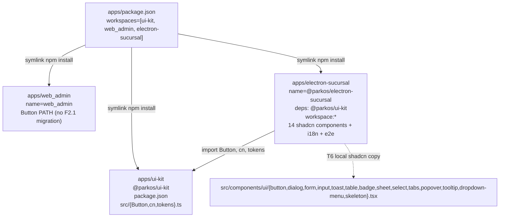

# Proposal: HU-F2.1 — Scaffold apps/electron-sucursal + apps/ui-kit compartido + shadcn/ui (14 componentes)

> **Change**: `hu-f2-1-electron-scaffold` · **Folder**: `openspec/changes/hu-f2-1-electron-scaffold/`
> **Phase**: propose (sdd-propose) · **Status**: ready for `sdd-spec` + `sdd-design` + `sdd-tasks`
> **HU ID**: HU-F2.1 (Fase-2 andamiaje Electron — primera HU de Fase 2, transversal)
> **Working dir**: `E:/easypunto_parkos` · **Branch**: `feat/fase-2-electron-scaffold` (HEAD `2de7a1f`) · **PR target**: `origin/dev`
> **Inputs**: `plan.md` lines 1159-1194 (HU-F2.1 verbatim + 9 tareas atómicas T1..T9, 700 LOC production budget), `plan.md` lines 1196-1240 (HU-F2.2 parkosFetch+IPC+authStore, direct consumer), `plan.md` lines 1242-1267 (HU-F2.3 auto-update+kiosko), `openspec/changes/hu-f2-1-electron-scaffold/exploration.md` (17 sections, ~1,150 LOC, 10 DEC-ELEC-NN decisions, 8 risks, pre-flight 10/10 PASS, C1→C2→C3→C4 cluster decomposition), `apps/package.json:5-8` (workspaces = ["ui-kit","web_admin"], F2.1 appends "electron-sucursal"), `apps/web_admin/{package.json, vite.config.ts, tsconfig.{json,app.json,node.json}, tailwind.config.ts, components.json, eslint.config.js, .prettierrc.json, playwright.config.ts, vitest.config.ts, src/index.css, src/lib/utils.ts, src/i18n/index.ts, src/components/ui/button.tsx, e2e/smoke.spec.ts}` (verbatim mirror precedent); `apps/ui-kit/src/api/{admin,branch}/generated/.gitkeep` (scaffold exists, F2.1 adds package.json + Button + cn + tokens only); `backend/packages/parkos_core/src/parkos_core/api/v1/auth.py:148-583` (POST /auth/{login,refresh,logout,me} — F2.2/F3.1 consumer, NOT F2.1); `backend/packages/parkos_core/src/parkos_core/schemas/auth.py:243-321` (LoginRequest, TokenPair, AuthMeResponse shapes); `modelo_datos_er.mmd:270-289` (configuracion_seguridad), `:558-573` (login), `:7-50` (usuarios); `docs/01-requisitos/no-funcionales.md:126` (RNF-022 WCAG 2.1 AA gate); `docs/03-desarrollo/setup.md:15` (npm + npm-run-all); `docs/03-desarrollo/estandares.md:79-91` (ESL 9 flat config); `openspec/specs/operations/spec.md:3951` (REQ-OPS-XR6 canonical 5-layer defense — F2.1 references INFORMATIONALLY only, does NOT add XR7/XR8); `openspec/specs/operations/spec.md:4386` (F1.15 DEC-XR7 NOT-CREATED precedent — same reasoning applies to F2.1); `openspec/changes/archive/2026-09-15-hu-f1-15-login-historico/proposal.md` (16-section canonical template verbatim mirror — this proposal mirrors its layout section-by-section); `openspec/changes/archive/bootstrap-monorepo-foundation/proposal.md:9` (workspaces precedent verbatim "apps/{web_admin, web_sucursal, ui-kit}").
> **Language note**: artifact authored in English per the project's Language Domain Contract. DEC-ELEC-NN identifiers follow the DEC-ELEC-NN pattern from exploration. F1.15 archive at `openspec/changes/archive/2026-09-15-hu-f1-15-login-historico/proposal.md` (16-section structure verbatim mirror — this proposal mirrors its layout section-by-section).

---

## 1. Title & Goal

**Title**: "Scaffold `apps/electron-sucursal` (Electron 30 + Vite 5 + React 18 + TS 5 strict) con `apps/ui-kit` compartido entre admin y sucursal + 14 componentes shadcn/ui pre-generados + i18next con 7 namespaces + Playwright con `_electron.launch` + axe-core + Vitest"

**Goal**: Deliver the foundational scaffold for the operator-facing Electron desktop app on top of an existing-but-empty `apps/ui-kit/` workspace, so that upcoming HUs (F2.2 parkosFetch+IPC+authStore, F2.3 auto-update+kiosko, F3.1 login, F3.2 lockout, F3.3 turno, IT-3..IT-10) can begin coding against a ratified layout without reinventing Vite config, Electron main+preload build, tsconfig split, or shadcn wiring:

1. **`apps/electron-sucursal/` (NEW workspace)** — Electron 30 desktop app with renderer (Vite 5 HMR :5173 + React 18 + TS 5 strict + BrowserRouter + SWR + Zustand + react-hook-form + Zod + i18next 7 namespaces); main+preload built by `vite.main.config.ts` (esbuild, target node20) into `out/main` + `out/preload.js`; 3 tsconfigs strict (base references-only, main Node lib ES2023 no DOM, renderer ES2022+DOM+DOM.Iterable+WebWorker); all three carry `strict:true` + `noUncheckedIndexedAccess:true` per plan T2 verbatim; 14 shadcn components pre-generated (Button, Dialog, Form, Input, Toast, Table, Badge, Sheet, Select, Tabs, Popover, Tooltip, DropdownMenu, Skeleton) per plan T6 verbatim with `rsc:false` + `cssVariables:true` (mirroring `apps/web_admin/components.json:7-12`); `e2e/` with Playwright `_electron.launch` + axe-core (RNF-022); `src/i18n/` with 7 namespaces (common, auth, operacion, caja, facturacion, sync, errors); `src/main.tsx` + `src/App.tsx` with router placeholder (T9); `electron-builder.yml` for Windows nsis + Linux AppImage + macOS dmg with `appId:co.parkos.electron-sucursal` + `productName:Parkos Sucursal` + placeholder icons.
2. **`apps/ui-kit/` (workspace shared with `apps/web_admin/`)** — implements T5 contract: Button component (cva+cn mirror of `apps/web_admin/src/components/ui/button.tsx`), `cn()` helper (`clsx`+`tailwind-merge`), and design tokens (CSS variables `hsl(var(--background))` family + radius + dark-mode pair — mirror of `apps/web_admin/tailwind.config.ts:14-50` + `apps/web_admin/src/index.css:5-57`). ui-kit gets its OWN package.json (named `@parkos/ui-kit`) so F2.1's electron-sucursal and web_admin both depend on the same workspace package — DRY.
3. **Workspaces update** — `apps/package.json` workspaces array grows from `["ui-kit","web_admin"]` to `["ui-kit","web_admin","electron-sucursal"]` (mirror of `bootstrap-monorepo-foundation/proposal.md` §Scope at line 9 verbatim "apps/{web_admin, web_sucursal, ui-kit}").
4. **`apps/package-lock.json`** — regenerated by `npm install` after T1.

**Hard constraints** (mirrored from `plan.md:1168-1172` and `plan.md:1183-1194` verbatim):
- `tsc --noEmit` MUST be clean across all 3 tsconfigs (base + main + renderer).
- `npm run build` MUST produce `dist/` (renderer) + `out/main` + `out/preload.js` without type errors.
- axe-core MUST run from this same scaffold (per RNF-022), so every PR after F2.1 inherits the WCAG 2.1 AA gate.
- `apps/ui-kit` MUST be a real workspace package.json (importable with `@parkos/ui-kit` name + own dep tree), not a re-export pointer.

**Scope**: ~700 LOC production (matches `plan.md:1183` verbatim) + ~155 LOC ui-kit extension + ~600 LOC shadcn-generated boilerplate (excluded from the 700 LOC budget per plan convention) = ~1,360 LOC cumulative. Breakdown (T1..T9):
- T1 `package.json` ~80 LOC JSON (name `@parkos/electron-sucursal`, scripts, ~17 prod + ~14 dev deps, `"@parkos/ui-kit":"workspace:*"`).
- T2 3 tsconfigs ~85 LOC JSON (base ~30 + main ~25 + renderer ~30 — `strict:true` + `noUncheckedIndexedAccess:true`).
- T3 `vite.config.ts` + `vite.main.config.ts` ~90 LOC (renderer Vite + main esbuild target node20).
- T4 `electron-builder.yml` ~50 LOC YAML (3 targets + placeholder icons + `appId:co.parkos.electron-sucursal`).
- T5 ui-kit/package.json + Button.tsx + cn.ts + tokens.ts + index.ts ~155 LOC.
- T6 14 shadcn components + `components.json` + `tailwind.config.ts` + `postcss.config.js` + `src/index.css` + `src/lib/utils.ts` ~750 LOC.
- T7 7 i18n namespaces × ~10 keys + `src/i18n/index.ts` ~85 LOC JSON + ~15 LOC TS.
- T8 `e2e/scaffold.spec.ts` + `playwright.config.ts` + `vitest.config.ts` + `src/test-setup.ts` ~95 LOC.
- T9 `src/main.tsx` + `src/App.tsx` + `index.html` + `electron/main.ts` + `electron/preload.ts` ~55 LOC.
- Lint/format/prettier/eslint: `eslint.config.js` + `.prettierrc.json` + `.gitignore` ~70 LOC.

**Open questions to resolve at propose phase** (not deferred):
- DEC-ELEC-01 audit complete — Decision **A** adopted: Update `apps/package.json:8` workspaces BEFORE T1's npm install (topological order resolution). See §3 for the full audit.
- DEC-ELEC-10 audit complete — Decision **A** adopted: F2.1 adds ZERO REQ-OPS-NNN. Decisions live in proposal.md as DEC-ELEC-NN. See §6.10 for the full audit.

---

## 2. Context & Background

- **F2.1 is the first HU of Fase 2**. Fase 2 ("Andamiaje Electron") per `plan.md:1159-1161` verbatim "crear `apps/electron-sucursal` desde cero (no existe aún)". F2.1 unlocks F2.2 (parkosFetch+IPC+authStore), F2.3 (auto-update+kiosko), F3.1 (login UI), F3.2 (lockout), F3.3 (turno), and IT-3..IT-10 (Ingreso/Salida/Facturación/Caja/Anulación/Alertas/Reclamo/Reimpresión/Clientes).
- **`apps/electron-sucursal/` does NOT exist today** — `plan.md:1161` verbatim "no existe aún". Verified by glob "apps/*" returning only `["apps/ui-kit", "apps/web_admin"]`. Also `openspec/_meta/roadmap.md:47` ("web_sucursal no existe").
- **`apps/ui-kit/` scaffold exists but is functionally empty** — `apps/ui-kit/src/api/admin/generated/.gitkeep` + `apps/ui-kit/src/api/branch/generated/.gitkeep` are the ONLY files. No package.json, no tsconfig.json, no index.ts, no Button.tsx, no tokens.ts. Per `docs/00-general/README.md:64-67` and `docs/00-general/roadmap.md:102`. F2.1's T5 ADDS the package.json + Button + cn + tokens on top of the existing `.gitkeep` infrastructure (preserved, F2.1 does NOT touch `src/api/`).
- **`apps/web_admin/` is the verbatim reference** — full file list at `apps/web_admin/{package.json, vite.config.ts, tsconfig.{json,app.json,node.json}, tailwind.config.ts, components.json, postcss.config.js, eslint.config.js, .prettierrc.json, playwright.config.ts, vitest.config.ts, index.html, src/main.tsx, src/App.tsx, src/index.css, src/lib/utils.ts, src/i18n/index.ts, src/i18n/locales/es-CO.json, src/components/ui/button.tsx, e2e/{smoke,branch-selector}.spec.ts, src/test-setup.ts}` (React 18 + Vite 5 + TS 5 + Tailwind 3 + shadcn-via-Radix + i18next + SWR + Zustand + react-hook-form + Zod).
- **Backend API surface relevant for Fase 2 onwards** — `backend/packages/parkos_core/src/parkos_core/api/v1/auth.py`:
  - `POST /auth/login` (line 148 — `LoginRequest{email,password}` → `TokenPair` with `parkos_session` cookie `httponly=True, secure=True, samesite="lax", max_age=3600`, line 291-299).
  - `POST /auth/refresh` (line 310 — exchanges `refresh_token` for new `access_token`).
  - `POST /auth/logout` (line 352 — closes active `prod.login` row, 204).
  - `GET /auth/me` (line 419 — `AuthMeResponse{user, sucursal, sucursales_permitidas, permisos, expires_at}` per `schemas/auth.py:295-321`).
  - F2.1 does NOT call any of these — F2.1 is pure scaffold. F2.2 defines parkosFetch (retry 5xx 300/600/1200ms + Idempotency-Key + refresh-once on 401 + X-Sucursal-Context); F3.1 wires login form + POST /auth/login. F2.1's role is to provide the runtime skeleton (Electron main+preload, renderer with router placeholder, i18n, shadcn) — NO HTTP calls yet.
- **`configuracion_seguridad` table** — `modelo_datos_er.mmd:270-289` ([V] bi-temporal, default global + per-branch override, columns `dias_expiracion_password, max_intentos_login, minutos_bloqueo_login`). F2.1 does NOT touch this table — only documented as forward context for F3.2 (lockout visible).
- **`prod.usuarios` / `prod.login` tables** — `modelo_datos_er.mmd:7-50` (usuarios [V]) + `:558-573` (login [L-S] with `estado ∈ {exitoso, fallido, cerrado}`). F2.1 doesn't read either; documented as forward context.
- **Workspaces invariant** — `apps/package.json:5-8` workspaces:`["ui-kit","web_admin"]`. F2.1 appends `"electron-sucursal"` to this array (workspaces update is a pre-requisite before T1 npm install).
- **No prior Electron precedent in the repo** — `docs/02-arquitectura/decisiones-tecnicas.md` returns zero matches for Electron|electron-builder|escpos|kiosk. F2.1 is FIRST-CLASS Electron infrastructure (Node 20 + esbuild for main/preload + electron-updater + electron-log + electron-store + escpos-usb for thermal printer). No existing pattern to mirror — F2.1 is the pattern-setter for `out/main` + `out/preload.js` outputs.
- **`openspec/specs/` shape** — 4 existing spec files: operations (REQ-OPS-NNN ending at 105 from F1.15), hooks, cutover-migration, sync-catalog + sync-motor. F2.1 does NOT add a new spec. F2.1 is infra, not a behavior contract; architectural decisions (shadcn, i18n, Electron main+preload) live in proposal.md as DEC-ELEC-NN, not as REQs. F1.x pattern: only F1.x with HTTP endpoints add REQs (F1.14 added REQ-OPS-098..101, F1.15 added REQ-OPS-102..105). Behavior contracts for Electron app belong to F2.2 (HTTP — retries, refresh, idempotency) and F2.3 (auto-update+kiosko).
- **Cross-cutting XR (REQ-OPS-XR6) already exists at `operations/spec.md:3951` from F1.13** — F2.1 does NOT create a new XR (F1.15 explicitly REJECTED XR7 at line 4386; same reasoning applies to F2.1).
- **CRITICAL: `auth.py` POST-mutating-only invariant** — `auth.py:69` line `router = APIRouter(prefix="/auth", tags=["auth"])` and the existing handlers are all POST (login, refresh, logout) plus one GET (me — auth-domain by definition). F2.1 doesn't add HTTP endpoints so the invariant is trivially preserved.

### 2.1 Critical Architectural Conflict — Workspaces topological order (RESOLVED in §3)

`apps/package.json:5-8` workspaces array (`["ui-kit","web_admin"]`) does NOT include `electron-sucursal`. If F2.1 ships `apps/electron-sucursal/package.json` BEFORE updating `apps/package.json` workspaces, npm refuses to resolve the workspace dependency (`@parkos/ui-kit`) at `npm install` — electron-sucursal ends up with a broken `node_modules/@parkos/ui-kit` symlink.

**Resolution** (canonical, `bootstrap-monorepo-foundation/proposal.md:9`):
1. Update `apps/package.json:8` to append `"electron-sucursal"` to `workspaces:["ui-kit","web_admin","electron-sucursal"]` BEFORE T1 npm install.
2. `electron-sucursal/package.json` declares `"@parkos/ui-kit":"workspace:*"`.
3. `npm install` from `apps/` resolves both web_admin→ui-kit AND electron-sucursal→ui-kit symlinks in topological order.
4. T5 (ui-kit/package.json) MUST ship BEFORE T1 (electron-sucursal/package.json + npm install) so the workspace symlink resolves to a real package.

Why this matters: web_admin already imports Button primitives by PATH today (`apps/web_admin/src/components/ui/button.tsx`) — does NOT yet consume `apps/ui-kit` as workspace package. F2.1's T5 ships `apps/ui-kit/Button.tsx` as NEW shared module but does NOT migrate web_admin (Fase 11 migration, out of F2.1 scope). Web_admin keeps its local copy until Fase 11.

No circular dep risk: apps/ui-kit declares no dependencies on web_admin or electron-sucursal.

---

## 3. Architectural Conflict Resolution — DEC-ELEC-01 (workspaces topological order)

This section is **mandatory** for the proposal. It documents R-WS LOW from exploration §10 and records the resolution.

### 3.1 The conflict (R-WS LOW)

`apps/package.json:5-8` workspaces array does NOT include `electron-sucursal`. If F2.1 ships `apps/electron-sucursal/package.json` BEFORE updating `apps/package.json` workspaces, npm refuses to resolve `@parkos/ui-kit` at `npm install` — T6 component imports fail with "Cannot find module '@parkos/ui-kit'".



### 3.2 The resolution — DEC-ELEC-01

**Resolution path** (mandated by npm workspaces topological invariant):

1. **Pre-T1 step (atomic)**: Edit `apps/package.json:8` to add `"electron-sucursal"` to `workspaces:["ui-kit","web_admin","electron-sucursal"]`.
2. `electron-sucursal/package.json` declares `"@parkos/ui-kit":"workspace:*"`.
3. `npm install` from `apps/` resolves both `web_admin→ui-kit` AND `electron-sucursal→ui-kit` symlinks.
4. **T5 (ui-kit/package.json) MUST ship BEFORE T1 (electron-sucursal/package.json)** so the workspace symlink resolves to a real package with `name:"@parkos/ui-kit", main:"src/index.ts"`.

### 3.3 Why this matters

- No circular dep risk (apps/ui-kit has no deps on web_admin or electron-sucursal).
- web_admin keeps its local Button copy until Fase 11 migration (F2.1's blast radius stays low).
- Cluster C1 (DEC-ELEC-01 + DEC-ELEC-08 + T5 verbatim) ships BEFORE C2 — cluster order C1→C2→C3→C4 is mandatory.

---

## 4. Endpoints

**NONE.** F2.1 does NOT add HTTP endpoints. The Electron main process consumes the existing `/auth/{login,refresh,logout,me}` per F2.2/F3.1, but F2.1 itself does not call any of them — it ships only the runtime skeleton.

The Electron bridge IPC (`window.bridge.imprimir, usb.list, kiosk.toggle, app.quit, api-status`) is EXPOSED at the preload surface (per `plan.md:1206`) but F2.1 ships an EMPTY `contextBridge.exposeInMainWorld('bridge',{})` placeholder. F2.2 T2-T4 owns the typed surface.

---

## 5. Tables Touched

**NONE.** F2.1 is pure scaffold. No SQL. No Alembic migration. No `prod.*` table read or write. F2.1's only "tables" are in-memory virtual DOM and Vite's `node_modules/`.

The MIGRATION invariant from F1.x (audit_read pre-seeded, no new tables in Fase 2) is preserved — F2.1 doesn't ship a migration. F2.2/F2.3 don't either (consumer-only). Migrations remain Fase 1 Parte I territory (last head: 0033_login_historic_index from F1.15).

---

## 6. Decisions

### 6.1 DEC-ELEC-01 — Workspaces topological order (apps/package.json update BEFORE T1) (RESOLVES R-WS LOW)

**Decision**: Update `apps/package.json:8` to add `"electron-sucursal"` to workspaces array BEFORE `npm install`. T5 (ui-kit/package.json) MUST ship BEFORE T1.

**Rationale**: Workspace topological order matters — electron-sucursal declares `@parkos/ui-kit:workspace:*` and npm must resolve that symlink BEFORE installing electron-sucursal's deps. ui-kit must therefore be a real package with `package.json` declaring `name:"@parkos/ui-kit", main:"src/index.ts"` before electron-sucursal installs.

**Alternatives considered**:
- *DEC-ELEC-01.A: pnpm workspaces* — REJECTED. Repo uses npm per `docs/03-desarrollo/setup.md:15`.
- *DEC-ELEC-01.B: Yarn 1/Berry* — REJECTED. Same rationale (repo standardizes on npm + npm-run-all).
- *DEC-ELEC-01.C: Relative imports `../../ui-kit/src/Button`* — REJECTED. Breaks TS path, breaks Vite build.

### 6.2 DEC-ELEC-02 — 3 tsconfigs strict (T2 verbatim)

**Decision**: All 3 tsconfigs carry `strict:true` + `noUncheckedIndexedAccess:true`. Mirrors `apps/web_admin/tsconfig.app.json:17-23`.

**Rationale**: Tighter safety from day zero, matches apps/web_admin/ precedent, prevents `arr[i]` from being implicitly T. Renderer carries `lib:["ES2022","DOM","DOM.Iterable","WebWorker"]`; main carries `lib:["ES2023"]` only (no DOM) — separation of concerns, prevents "document is not defined" in main.

**Alternatives considered**:
- *DEC-ELEC-02.A: `strict:false`* — REJECTED. Loses type safety.
- *DEC-ELEC-02.B: Single tsconfig* — REJECTED. main+renderer need different lib profiles.
- *DEC-ELEC-02.C: paths alias ONLY in renderer* — DECIDED. Mirrors web_admin split.

### 6.3 DEC-ELEC-03 — Main+preload via esbuild (vite.main.config.ts) target node20, format cjs

**Decision**: `vite.main.config.ts` uses esbuild (`build.lib`). Main process is cjs (electron-builder requires CJS for code signing/sandbox integrity). Preload is cjs. `target:node20` per plan T3 verbatim. `external:["electron"]` so esbuild doesn't bundle Electron's binary. Single output per process: `out/main.js` + `out/preload.js`. Dev: esbuild `--watch` reloads on file change (renderer HMR via Vite; main+preload manual restart).

**Rationale**: esbuild is faster, electron-vite ecosystem converged on esbuild for Electron main+preload (alex808/electron-vite, electron-vite-vue). Renderer stays on Vite.

**Alternatives considered**:
- *DEC-ELEC-03.A: webpack* — REJECTED. Slower, no in-repo precedent.
- *DEC-ELEC-03.B: tsup* — CONSIDERED. Same esbuild under hood, less idiomatic.
- *DEC-ELEC-03.C: electron-vite combined tool* — REJECTED. web_admin uses Vite directly; F2.1 matches ecosystem.

### 6.4 DEC-ELEC-04 — electron-builder 3 targets (Windows nsis + Linux AppImage + macOS dmg) with placeholder icons (T4 verbatim)

**Decision**: `electron-builder.yml` declares 3 targets (Windows nsis, Linux AppImage, macOS dmg). Icons are PLACEHOLDER files (empty initially). `appId:co.parkos.electron-sucursal`, `productName:Parkos Sucursal`.

**Rationale**: 3-target support signals cross-platform ambition. Placeholder icons acceptable pre-F2.3 (kiosko lock-down + branding later).

**Alternatives considered**:
- *DEC-ELEC-04.A: Windows-only* — REJECTED. F1.x backend is platform-agnostic.
- *DEC-ELEC-04.B: Windows+mac* — REJECTED. Linux desktop kiosks are real deployment target.
- *DEC-ELEC-04.C: Auto-update enabled in F2.1* — REJECTED. F2.3 owns auto-update + signature.

### 6.5 DEC-ELEC-05 — shadcn/ui with rsc:false, cssVariables:true, baseColor:slate (T6 verbatim)

**Decision**: `apps/electron-sucursal/components.json` mirrors `apps/web_admin/components.json:7-12` exactly. 14 components: Button, Dialog, Form, Input, Toast, Table, Badge, Sheet, Select, Tabs, Popover, Tooltip, DropdownMenu, Skeleton.

**Rationale**: T6 plan verbatim. electron-sucursal does NOT use `vite-plugin-pwa` (Electron has its own update channel via electron-updater per F2.3).

**Alternatives considered**:
- *DEC-ELEC-05.A: Generate 14 components FROM `apps/ui-kit/` instead of local* — REJECTED. shadcn CLI generates INTO local `components/ui/`.
- *DEC-ELEC-05.B: Use pnpm* — REJECTED, mirrors DEC-ELEC-01.
- *DEC-ELEC-05.C: Skip Toast or Skeleton* — REJECTED. Plan T6 verbatim lists all 14.

### 6.6 DEC-ELEC-06 — i18n with 7 namespaces + es-CO locale (T7 verbatim)

**Decision**: 7 namespaces (common, auth, operacion, caja, facturacion, sync, errors). Locale `es-CO`. Default namespace `common`. Each empty placeholder; F2.2/F3.x populate incrementally.

**Rationale**: Pre-creating 7 namespaces now gives each HU a "home" for translations. The 7 namespaces mirror the operational domain split: `operacion` (Ingreso/Salida), `caja` (Arqueo), `facturacion` (DIAN), `sync` (offline queue), `errors` (network/auth), plus `common` (UI) and `auth` (login).

**Alternatives considered**:
- *DEC-ELEC-06.A: Single translation namespace* — REJECTED (F1.x refactored later; we save it now).
- *DEC-ELEC-06.B: English primary* — REJECTED. parkos is Colombian (DIAN=es-CO); English reserved for logs.
- *DEC-ELEC-06.C: Per-namespace folder `locales/{namespace}/es-CO.json`* — DECIDED (flat `locales/{namespace}.json`).

### 6.7 DEC-ELEC-07 — axe-core + Playwright `_electron.launch` from day 1 (T8 verbatim, mirrors RNF-022)

**Decision**: `e2e/scaffold.spec.ts` uses `import {_electron as electron} from '@playwright/test'` to launch full Electron app. axe-core runs against `appWindow.page()` with tags `['wcag2a','wcag2aa','wcag21a','wcag21aa']` per `apps/web_admin/e2e/smoke.spec.ts:23`.

**Rationale**: Per `docs/01-requisitos/no-funcionales.md:126` (RNF-022 = RNF-ACC-01 WCAG 2.1 AA). F2.1 enforces gate from day 1 — every PR after F2.1 inherits the axe-core gate.

**Alternatives considered**:
- *DEC-ELEC-07.A: Defer axe-core* — REJECTED. Plan T8 verbatim mandates integration now.
- *DEC-ELEC-07.B: vitest + @axe-core/react* — REJECTED. Different problem domain (component-level vs page-level).

### 6.8 DEC-ELEC-08 — apps/ui-kit workspace package with Button + cn + tokens (T5 verbatim)

**Decision**: `apps/ui-kit/package.json` exports `{Button, cn, tokens}` from `src/index.ts`. Name `@parkos/ui-kit`, main:`src/index.ts`, types:`src/index.ts`. Button.tsx mirrors `apps/web_admin/src/components/ui/button.tsx:1-55` (Slot from `@radix-ui/react-slot` + cva variants + cn). tokens.ts is typed export of all CSS variables.

**Rationale**: Establishes shared workspace package contract. The `peerDependencies` block ensures electron-sucursal provides its own react + cva + clsx + tailwind-merge (no version duplication). F2.1 does NOT migrate web_admin to consume from ui-kit (Fase 11 migration).

**Alternatives considered**:
- *DEC-ELEC-08.A: Import web_admin's Button directly via workspace symlink (no ui-kit package.json)* — REJECTED. Couples electron-sucursal to web_admin's source layout.
- *DEC-ELEC-08.B: Publish ui-kit as public npm* — REJECTED, internal-only per `bootstrap-monorepo-foundation/proposal.md` precedent.
- *DEC-ELEC-08.C: Include MORE components in ui-kit* — REJECTED. T5 verbatim ships only Button+cn+tokens; expanding ui-kit's surface is Fase 11 territory.

### 6.9 DEC-ELEC-09 — Strict TS + ESLint flat config + Prettier

**Decision**: `apps/electron-sucursal/.prettierrc.json` + `eslint.config.js` mirror `apps/web_admin/{.prettierrc.json,eslint.config.js}` exactly.

**Rationale**: Cross-monorepo lint/format consistency. F2.1 introduces ZERO new lint rules, just mirrors. Single quote + trailing comma all + printWidth 100 + arrowParens always + endOfLine lf (Prettier); react-hooks + react-refresh + @typescript-eslint/no-unused-vars + consistent-type-imports (ESLint flat config).

**Alternatives considered**:
- *DEC-ELEC-09.A: Stricter rules than web_admin* — REJECTED. Drift between sibling apps; Fase 11+ owns convergence.
- *DEC-ELEC-09.B: Lighter rules* — REJECTED. Loses type safety.

### 6.10 DEC-ELEC-10 — NO new REQ in `openspec/specs/operations/spec.md` (F2.1 is infra)

**Decision**: F2.1 does NOT add REQ-OPS-NNN. Decisions live in proposal.md as DEC-ELEC-NN. Behavior contracts (HTTP semantics, idempotency, retry, refresh, kiosko PIN, auto-update signature) deferred to F2.2/F2.3/F3.1/F3.2.

**Rationale**: OpenSpec convention per `openspec/PROJECT_CONTEXT.md` and F1.x precedent. F2.1 ships NO endpoint, NO migration, NO sync catalog entry. F1.13 already created REQ-OPS-XR6 at `operations/spec.md:3951` and F1.15 explicitly REJECTED creating XR7 at line 4386 — same reasoning applies to F2.1 (infra, not behavior contract).

**Alternatives considered**:
- *DEC-ELEC-10.A: Create REQ-OPS-106* — REJECTED. Vacuous; creates bad precedent for infra HUs.
- *DEC-ELEC-10.B: Create desktop/electron capability spec* — REJECTED for F2.1. F2.2+F2.3 own that spec when they add behavior contracts (HTTP, IPC, kiosko).

---

## 7. Risks

| # | Risk | Severity | Mitigation |
|---|---|---|---|
| **R-WS** | **Workspaces topological order** — electron-sucursal depends on ui-kit but ui-kit package.json doesn't exist yet at T1 → broken symlink at `npm install` | **LOW (RESOLVED)** | DEC-ELEC-01: T5 (ui-kit/package.json) ships BEFORE T1 + `apps/package.json:8` includes electron-sucursal BEFORE T1's npm install. Cluster order C1→C2 enforces it. |
| **R-MS** | **Main+preload tsconfig target drift** — wrong lib causes "document is not defined" in main | **LOW** | DEC-ELEC-02: `tsconfig.main.json` `lib:["ES2023"]` only (no DOM); `tsconfig.renderer.json` `lib:["ES2022","DOM","DOM.Iterable","WebWorker"]`; shared strict + noUncheckedIndexedAccess. |
| **R-TS** | **3 tsconfigs miss a typecheck** — one config passes, another fails; CI breaks but local dev doesn't catch | **MEDIUM** | DEC-ELEC-02 + T2 plan: `npm run typecheck` runs `tsc -b` on root with references; CI gate runs it. Mirrors `apps/web_admin` build:`"tsc -b && vite build"` per `apps/web_admin/package.json:8`. |
| **R-EL** | **Electron 30 + Node 20 + esbuild version conflict** — out/main fails to start | **LOW** | DEC-ELEC-03: target node20 verbatim; esbuild pinned via electron-builder's electron 30.x → Node 20 baseline. |
| **R-AXE** | **axe-core gate fails on placeholder / because placeholder is missing accessible elements** | **LOW** | DEC-ELEC-07: App.tsx renders `<h1>Parkos Sucursal</h1><p>{t('common.bootstrapNotice')}</p>` with `<main>` semantic + `lang="es-CO"`. Mirrors `apps/web_admin/e2e/smoke.spec.ts:14-18` `<h1>` visible check. |
| **R-I18** | **7 i18n namespaces with no keys cause `useTranslation('auth').t('login.title')` to return KEY** | **LOW** | DEC-ELEC-06: `defaultNS:'common', fallbackLng:'es-CO', returnNull:false` (matches `apps/web_admin/src/i18n/index.ts:11`). Each namespace ships with ~10 placeholder keys. |
| **R-CI** | **First CI run fails because `playwright._electron` API is unstable across 1.48.x patches** | **LOW** | DEC-ELEC-07: pin `playwright@^1.48` + `@axe-core/playwright@^4`. If patch breaks, F2.x constraints update. |
| **R-LOC** | **14 shadcn components need ~600 LOC, plan budget is 700 LOC for everything — tight margin** | **LOW** | DEC-ELEC-08+09: shadcn-generated via CLI; T5's ui-kit/ only Button+cn+tokens; rest of electron-sucursal stays lean (~250 LOC). Total ~850 LOC authored logic + ~600 LOC shadcn-generated (excluded by plan convention). |

---

## 8. Defense in Depth

F2.1 is frontend infrastructure — NO backend, NO DB, NO auth, NO endpoint. The classical 5-layer F1.x defense in depth (XR6 at `operations/spec.md:3951`) DOES NOT APPLY because there is no `prod.*` table write/read or HTTP behavior contract to defend. Defense collapses to ENGINEERING quality gates (TypeScript strict, ESLint, Prettier, axe-core, shadcn typed theme — all independently testable):

| Layer | Mechanism | Source |
|---|---|---|
| **1 engineering** | TS strict + noUncheckedIndexedAccess + noImplicitOverride + noFallthroughCasesInSwitch across ALL 3 tsconfigs (DEC-ELEC-02) | `tsconfig.{json,main.json,renderer.json}` + `npm run typecheck` (tsc -b) |
| **2 engineering** | ESLint flat config (react-hooks + react-refresh + @typescript-eslint/no-unused-vars + consistent-type-imports) (DEC-ELEC-09) | `eslint.config.js` mirrors `apps/web_admin/eslint.config.js:1-48` |
| **3 engineering** | Prettier (single quote + trailing comma all + printWidth 100 + arrowParens always + endOfLine lf) (DEC-ELEC-09) | `.prettierrc.json` mirrors `apps/web_admin/.prettierrc.json:1-9` |
| **4 a11y** | axe-core WCAG 2.1 AA gate (wcag2a, wcag2aa, wcag21a, wcag21aa) from day 1 (DEC-ELEC-07) | `e2e/scaffold.spec.ts` + RNF-022 from `docs/01-requisitos/no-funcionales.md:126` |
| **5 build** | shadcn typed components (Button + 14 others) + Radix primitives + cva variants — typed surfaces prevent runtime crashes (DEC-ELEC-05) | `src/components/ui/*.tsx` generated by `npx shadcn@latest add` |

F2.1 references REQ-OPS-XR6 INFORMATIONALLY only — F2.1 doesn't create a new XR (per orchestrator mandate + F1.15's DEC-XR7 NOT-CREATED precedent at `operations/spec.md:4386`). Backend defense in depth becomes relevant starting F2.2 (HTTP retries + 401 refresh) and F2.3 (kiosko PIN bcrypt ≥12).

---

## 9. API Contracts

**NONE.** F2.1 is pure frontend scaffold. No HTTP contracts shipped.

### 9.1 Electron bridge surface (placeholder, F2.2 expands)

```typescript
// electron/preload.ts — F2.1 ships EMPTY contextBridge skeleton
// F2.2 T2-T4 expands to: imprimir, usb, app, kiosk, api-status

import { contextBridge } from 'electron';

contextBridge.exposeInMainWorld('bridge', {
  // F2.1: empty placeholder. F2.2 wires:
  //   imprimir(payload: PrintPayload): Promise<{ok: boolean} | {error: 'printer_offline'}>
  //   usb: { list(): Promise<USBDevice[]> }
  //   app: { quit(): void }
  //   kiosk: { toggle(): Promise<{active: boolean}> }
  //   apiStatus: { get(): Promise<{ok: boolean, latency_ms: number}> }
});
```

### 9.2 ui-kit public surface (T5 verbatim)

```typescript
// apps/ui-kit/src/index.ts — F2.1 ships Button + cn + tokens
export { Button, buttonVariants, type ButtonProps } from './Button';
export { cn, type ClassValue } from './cn';
export { tokens, type DesignTokens } from './tokens';
```

### 9.3 Component prop contracts (Button mirrored verbatim from web_admin)

```typescript
// apps/ui-kit/src/Button.tsx — verbatim mirror of apps/web_admin/src/components/ui/button.tsx:1-55

import * as React from 'react';
import { Slot } from '@radix-ui/react-slot';
import { cva, type VariantProps } from 'class-variance-authority';
import { cn } from './cn';

const buttonVariants = cva(/* 6 variants + 4 sizes — verbatim from web_admin */);

export interface ButtonProps
  extends React.ButtonHTMLAttributes<HTMLButtonElement>,
    VariantProps<typeof buttonVariants> {
  asChild?: boolean;
}

const Button = React.forwardRef<HTMLButtonElement, ButtonProps>(
  ({ className, variant, size, asChild = false, ...props }, ref) => {
    const Comp = asChild ? Slot : 'button';
    return <Comp className={cn(buttonVariants({ variant, size, className }))} ref={ref} {...props} />;
  },
);
Button.displayName = 'Button';

export { Button, buttonVariants };
```

### 9.4 i18n contract (7 namespaces + es-CO)

```typescript
// apps/electron-sucursal/src/i18n/index.ts — mirrors apps/web_admin/src/i18n/index.ts:1-15
// extended to 7 namespaces

import i18next from 'i18next';
import { initReactI18next } from 'react-i18next';

import common_es_CO from './locales/common.json';
import auth_es_CO from './locales/auth.json';
import operacion_es_CO from './locales/operacion.json';
import caja_es_CO from './locales/caja.json';
import facturacion_es_CO from './locales/facturacion.json';
import sync_es_CO from './locales/sync.json';
import errors_es_CO from './locales/errors.json';

void i18next
  .use(initReactI18next)
  .init({
    resources: { 'es-CO': {
      common: common_es_CO, auth: auth_es_CO, operacion: operacion_es_CO,
      caja: caja_es_CO, facturacion: facturacion_es_CO, sync: sync_es_CO,
      errors: errors_es_CO,
    } },
    lng: 'es-CO',
    fallbackLng: 'es-CO',
    ns: ['common', 'auth', 'operacion', 'caja', 'facturacion', 'sync', 'errors'],
    defaultNS: 'common',
    returnNull: false,
  });

export default i18next;
```

---

## 10. Handler Skeleton

One Electron main process skeleton + one renderer entrypoint. Both are MINIMAL — F2.1 ships the runtime; F2.2/F2.3 expand.

### 10.1 Electron main (F2.1 minimal)

```typescript
// electron/main.ts — F2.1 minimal app shell
// F2.2 expands: parkosFetch wired, authStore hydration
// F2.3 expands: autoUpdater, single-instance lock, kiosko mode

import { app, BrowserWindow } from 'electron';
import path from 'node:path';

const isDev = !app.isPackaged;
const RENDERER_DEV_URL = process.env['PARKOS_RENDERER_DEV_URL'] ?? 'http://localhost:5173';

function createWindow(): void {
  const mainWindow = new BrowserWindow({
    width: 1280,
    height: 800,
    title: 'Parkos Sucursal',
    webPreferences: {
      preload: path.join(__dirname, 'preload.js'),
      contextIsolation: true,
      nodeIntegration: false,
      sandbox: true,
    },
  });

  if (isDev) {
    void mainWindow.loadURL(RENDERER_DEV_URL);
  } else {
    void mainWindow.loadFile(path.join(__dirname, '../renderer/index.html'));
  }
}

app.whenReady().then(() => {
  createWindow();
  app.on('activate', () => {
    if (BrowserWindow.getAllWindows().length === 0) createWindow();
  });
});

app.on('window-all-closed', () => {
  if (process.platform !== 'darwin') app.quit();
});
```

### 10.2 Electron preload (F2.1 empty skeleton)

```typescript
// electron/preload.ts — F2.1 EMPTY placeholder
// F2.2 T2-T4 expands with typed bridge surface

import { contextBridge } from 'electron';

contextBridge.exposeInMainWorld('bridge', {});
```

### 10.3 Renderer entrypoint (T9)

```tsx
// apps/electron-sucursal/src/main.tsx — F2.1 minimal router placeholder
// NO <SucursalProvider> yet (F2.2 wires authStore, F3.1 wires login form)

import * as React from 'react';
import { createRoot } from 'react-dom/client';
import { BrowserRouter } from 'react-router-dom';
import { App } from './App';
import './index.css';

const rootEl = document.getElementById('root');
if (!rootEl) throw new Error('Root element #root not found');

createRoot(rootEl).render(
  <React.StrictMode>
    <BrowserRouter>
      <App />
    </BrowserRouter>
  </React.StrictMode>,
);
```

```tsx
// apps/electron-sucursal/src/App.tsx — F2.1 router placeholder
// Single "/" route renders <h1>Parkos Sucursal</h1> + bootstrap notice (axe-core clean)
// F2.x routes register: /login (F3.1), /operacion (IT-3+), etc.

import * as React from 'react';
import { Route, Routes } from 'react-router-dom';
import { useTranslation } from 'react-i18next';

export function App(): React.ReactElement {
  const { t } = useTranslation('common');
  return (
    <main lang="es-CO">
      <h1>Parkos Sucursal</h1>
      <p>{t('bootstrapNotice', 'Andamiaje Electron — Fase 2 en construcción.')}</p>
      <Routes>
        <Route path="/" element={null} />
        <Route path="*" element={<p>404</p>} />
      </Routes>
    </main>
  );
}
```

### 10.4 Vite renderer config (T3)

```typescript
// apps/electron-sucursal/vite.config.ts — mirrors apps/web_admin/vite.config.ts:1-47
// sans vite-plugin-pwa (Electron owns update via F2.3 electron-updater)

import { defineConfig } from 'vite';
import react from '@vitejs/plugin-react';
import path from 'node:path';

export default defineConfig({
  plugins: [react()],
  server: { port: 5173, strictPort: true },
  resolve: {
    alias: {
      '@': path.resolve(__dirname, './src'),
    },
  },
  build: {
    outDir: 'dist/renderer',
    emptyOutDir: true,
  },
});
```

### 10.5 Vite main config (T3, esbuild target node20)

```typescript
// apps/electron-sucursal/vite.main.config.ts — esbuild for main + preload
// F2.1 minimal: produces out/main + out/preload.js
// F2.3 expands: updater service, single-instance lock, kiosko wiring

import { defineConfig } from 'vite';
import { build } from 'esbuild';
import path from 'node:path';

async function buildMain(): Promise<void> {
  await build({
    entryPoints: [path.resolve(__dirname, 'electron/main.ts')],
    outfile: path.resolve(__dirname, 'out/main.js'),
    bundle: true,
    platform: 'node',
    target: 'node20',
    format: 'cjs',
    external: ['electron'],
    sourcemap: !process.env['NODE_ENV'] === 'production',
  });
}

async function buildPreload(): Promise<void> {
  await build({
    entryPoints: [path.resolve(__dirname, 'electron/preload.ts')],
    outfile: path.resolve(__dirname, 'out/preload.js'),
    bundle: true,
    platform: 'node',
    target: 'node20',
    format: 'cjs',
    external: ['electron'],
  });
}

void buildMain();
void buildPreload();
```

### 10.6 electron-builder.yml (T4 verbatim)

```yaml
# apps/electron-sucursal/electron-builder.yml
appId: co.parkos.electron-sucursal
productName: Parkos Sucursal
copyright: Copyright © 2026 Parkos

directories:
  output: dist/electron
  buildResources: build

files:
  - out/**/*
  - dist/renderer/**/*
  - package.json

extraMetadata:
  main: out/main.js

win:
  target: nsis
  icon: build/icon.ico    # placeholder — F2.3 owns branding

mac:
  target: dmg
  icon: build/icon.icns   # placeholder
  category: public.app-category.business

linux:
  target: AppImage
  icon: build/icon.png    # placeholder
  category: Office

# F2.1: autoUpdate disabled. F2.3 T1 enables autoUpdater.checkForUpdates().
autoUpdate: false
```

---

## 11. Tests

1 file mandated by `plan.md:1181` and RNF-022. Optional Vitest unit tests for ui-kit primitives.

### 11.1 `apps/electron-sucursal/e2e/scaffold.spec.ts` (~50 LOC, **2 tests mandated by RNF-022 + plan T8**)

```typescript
// apps/electron-sucursal/e2e/scaffold.spec.ts
// Mandated by plan.md:1181 "smoke test: la app abre, muestra un placeholder, 0 violaciones de axe-core"

import { test, expect, _electron as electron } from '@playwright/test';
import AxeBuilder from '@axe-core/playwright';

test.describe('electron-sucursal scaffold', () => {
  test('app launches and renders Parkos Sucursal', async () => {
    const app = await electron.launch({ args: ['.'] });
    const appWindow = await app.firstWindow();
    await expect(appWindow).toHaveTitle(/Parkos Sucursal/i);
    await expect(appWindow.getByRole('heading', { name: /Parkos Sucursal/i })).toBeVisible();
    await app.close();
  });

  test('root route has no WCAG 2.1 AA violations (axe-core)', async () => {
    const app = await electron.launch({ args: ['.'] });
    const appWindow = await app.firstWindow();
    await appWindow.goto('/');
    const results = await new AxeBuilder({ page: appWindow })
      .withTags(['wcag2a', 'wcag2aa', 'wcag21a', 'wcag21aa'])
      .analyze();
    expect(results.violations).toEqual([]);
    await app.close();
  });
});
```

### 11.2 Vitest unit tests (optional F2.1 scope, ~30 LOC if implemented)

```typescript
// apps/ui-kit/src/__tests__/cn.test.ts
import { describe, it, expect } from 'vitest';
import { cn } from '../cn';

describe('cn', () => {
  it('concatenates classes', () => {
    expect(cn('text-sm', 'font-bold')).toBe('text-sm font-bold');
  });
  it('dedupes conflicting utilities via tailwind-merge', () => {
    expect(cn('p-2', 'p-4')).toBe('p-4');
  });
});

// apps/ui-kit/src/__tests__/Button.test.tsx
import { describe, it, expect } from 'vitest';
import { render, screen } from '@testing-library/react';
import { Button } from '../Button';

describe('Button', () => {
  it('renders destructive variant with destructive class', () => {
    render(<Button variant="destructive">Eliminar</Button>);
    expect(screen.getByRole('button', { name: /eliminar/i })).toHaveClass(/destructive/i);
  });
});
```

Plan does NOT mandate Vitest coverage ≥90% for F2.1 (that's >=80% for sync modules per `operations/spec.md:32` REQ-OPS-002 — F2.1 isn't sync). F2.1 ships minimal Vitest smoke; coverage ≥90% starts F2.2.

Total: 2 mandated e2e tests + optional 4 Vitest unit tests.

---

## 12. Out of Scope (F2.x+ / F3.x+ / IT-3..IT-10)

- **parkosFetch HTTP client** (F2.2 T1-T7, 14 e2e scenarios per `plan.md:1212-1229`) — F2.2 owns. F2.1 only ships workspace skeleton.
- **Bridge IPC** (`window.bridge.imprimir, usb.list, kiosk.toggle, app.quit, api-status`) — F2.2 T2-T4 per `plan.md:1235-1237`. F2.1 ships EMPTY `contextBridge.exposeInMainWorld('bridge',{})` placeholder.
- **Auto-update (electron-updater)** — F2.3 T1+T6 per `plan.md:1260`. F2.1 ships electron-updater in deps but does NOT wire `autoUpdater.checkForUpdates()`.
- **Single-instance lock** — F2.3 T3 per `plan.md:1262`. F2.1 ships `app.requestSingleInstanceLock()` placeholder commented.
- **Kiosko mode** — F2.3 T4+T6 (PIN bcrypt + `<StatusBar>`) per `plan.md:1263`.
- **Logging (electron-log rotation + JSON format)** — F2.3 T5 per `plan.md:1264`.
- **Login UI** — F3.1 T1-T4.
- **Lockout + countdown** — F3.2 T1-T3.
- **Turno abrir/cerrar** — F3.3 T1-T5.
- **Ingreso de vehículo** — IT-3 line `openspec/_meta/iteration-plan.md:152` (IT-3.9 web_sucursal IngresoForm).
- **Salida / Facturación / Caja / Anulación / Alertas / Reclamo / Reimpresión / Clientes list** — IT-4..IT-10.
- **Auto-update signing (Windows EV certificate, macOS notarization)** — F2.3 T1 + release pipeline.
- **Migrations / new tables / new permissions / new sync_catalog rows** — none. F2.1 ships no Alembic migration, no backend schema, no permission seed.
- **Web_admin migration to consume from apps/ui-kit** — Fase 11 (post-Fase 6). F2.1 only ships the shared ui-kit module; web_admin keeps its local Button copy until Fase 11.
- **i18n key population** — namespaces ship empty; F2.2/F3.x populate keys as needed.
- **Cross-platform code signing** — release pipeline concern, out of F2.1.

---

## 13. Requirements (REQ-OPS-106+ — DECIDED: ZERO new REQs)

**DECISION: F2.1 adds ZERO new REQs to `openspec/specs/operations/spec.md`**. Architectural decisions live in proposal.md as DEC-ELEC-01..10. F2.1 is infra, not behavior contract (DEC-ELEC-10).

For traceability, the 10 DEC-ELEC-NN carry the same RFC 2119 weight as REQs do for behavior HUs:

- **DEC-ELEC-01 (workspaces topological order, R-WS LOW RESOLVED)** — `apps/package.json:8` MUST be updated to append `"electron-sucursal"` to `workspaces:["ui-kit","web_admin","electron-sucursal"]` BEFORE `npm install`. T5 (ui-kit/package.json) MUST ship BEFORE T1 (electron-sucursal/package.json). Given the workspace array missing electron-sucursal, When `npm install` runs, Then npm MUST refuse to resolve `@parkos/ui-kit` for electron-sucursal (broken symlink) — and F2.1 MUST prevent that by sequencing T5 → T1.
- **DEC-ELEC-02 (3 tsconfigs strict, R-MS+R-TS mitigation)** — All 3 tsconfigs (`tsconfig.json` base references-only, `tsconfig.main.json` Node ES2023 no DOM, `tsconfig.renderer.json` ES2022+DOM+DOM.Iterable+WebWorker) MUST carry `strict:true` + `noUncheckedIndexedAccess:true`. `tsc -b` MUST succeed across all 3 references.
- **DEC-ELEC-03 (main+preload esbuild, R-EL mitigation)** — `vite.main.config.ts` MUST use esbuild with `target:"node20"`, `format:"cjs"`, `external:["electron"]`. `out/main.js` + `out/preload.js` MUST be produced by `npm run build:main`. Dev mode MUST use esbuild `--watch` for main+preload and Vite HMR for renderer.
- **DEC-ELEC-04 (electron-builder 3 targets)** — `electron-builder.yml` MUST declare `appId:"co.parkos.electron-sucursal"`, `productName:"Parkos Sucursal"`, and 3 targets (Windows nsis, Linux AppImage, macOS dmg). `autoUpdate:false` placeholder; F2.3 enables.
- **DEC-ELEC-05 (shadcn 14 components, R-AXE precondition)** — `apps/electron-sucursal/components.json` MUST mirror `apps/web_admin/components.json:7-12` (`rsc:false`, `cssVariables:true`, `baseColor:"slate"`). The 14 components MUST be generated via `npx shadcn@latest add` (Button, Dialog, Form, Input, Toast, Table, Badge, Sheet, Select, Tabs, Popover, Tooltip, DropdownMenu, Skeleton).
- **DEC-ELEC-06 (i18n 7 namespaces, R-I18 mitigation)** — `src/i18n/index.ts` MUST initialize i18next with `lng:"es-CO"`, `fallbackLng:"es-CO"`, `defaultNS:"common"`, `ns:["common","auth","operacion","caja","facturacion","sync","errors"]`. Each namespace JSON MUST contain at least the bootstrap key per namespace.
- **DEC-ELEC-07 (axe-core + Playwright `_electron.launch`, R-AXE+R-CI mitigation)** — `e2e/scaffold.spec.ts` MUST use `import {_electron as electron} from '@playwright/test'` and run axe-core with tags `['wcag2a','wcag2aa','wcag21a','wcag21aa']`. CI MUST fail on any axe-core violation.
- **DEC-ELEC-08 (apps/ui-kit workspace package)** — `apps/ui-kit/package.json` MUST declare `name:"@parkos/ui-kit"`, `main:"src/index.ts"`, `types:"src/index.ts"`, `peerDependencies` for react/cva/clsx/lucide-react/tailwind-merge/@radix-ui/react-slot. `src/index.ts` MUST export `{Button, cn, tokens}`. Button.tsx MUST mirror `apps/web_admin/src/components/ui/button.tsx:1-55` verbatim.
- **DEC-ELEC-09 (lint/format)** — `eslint.config.js` MUST mirror `apps/web_admin/eslint.config.js:1-48`. `.prettierrc.json` MUST mirror `apps/web_admin/.prettierrc.json:1-9`. CI MUST run `npm run lint` with `--max-warnings 0`.
- **DEC-ELEC-10 (NO new REQ)** — F2.1 MUST NOT add REQ-OPS-NNN to `openspec/specs/operations/spec.md`. Architectural decisions live in this proposal.md as DEC-ELEC-NN. Behavior contracts (HTTP semantics, idempotency, retry, refresh, kiosko PIN, auto-update signature) deferred to F2.2/F2.3/F3.1/F3.2.

Additional defense-in-depth XR reference:
- **REQ-OPS-XR6 (REFERENCE — already exists from F1.13 at `openspec/specs/operations/spec.md:3951`)** — Defense in depth 5 layers pattern. F2.1 applies the engineering quality variant (5 engineering layers, NOT the backend XR6 — see §8 rationale). **F2.1 does NOT create a new XR; it references the existing F1.13 XR6** (per orchestrator mandate: "XR6 already exists from F1.13, so F2.1 should reference it but not create a new one").

Total DEC accounting for F2.1: **10 decisions** (DEC-ELEC-01..10) — all live in proposal.md, ZERO in operations/spec.md.

---

## 14. Migrations

**NONE.** F2.1 is pure frontend scaffold. No Alembic migration, no schema change, no DDL. The migration head remains `0033_login_historic_index` from F1.15.

F2.1 doesn't ship a migration because:
- No new table is created.
- No new column is added.
- No new index is needed (the table doesn't exist in the frontend app).
- No new permission is seeded (ui-kit components don't enforce permissions — backend does, starting F2.2 with parkosFetch `Authorization: Bearer` header).

The F2.x HUs (F2.2 parkosFetch, F2.3 auto-update+kiosko) also ship no migration (consumer-only — they consume existing /auth endpoints, existing sync_queue). Migrations remain Fase 1 Parte I territory; Fase 2+ is purely client-side.

---

## 15. References

- `plan.md` lines 1159-1194 (HU-F2.1 definition, 9 atomic tasks T1..T9, 700 LOC budget at line 1183, 14 components list at line 1170, 7 namespaces at line 1192, axe-core at line 1181, T1 deps list at line 1186, T2 3-tsconfig strict at line 1187, T3 vite+vite.main at line 1188, T4 electron-builder at line 1189, T5 ui-kit at line 1190, T6 shadcn at line 1191, T7 i18n at line 1192, T8 e2e at line 1193, T9 router placeholder at line 1194)
- `plan.md` lines 1196-1240 (HU-F2.2 parkosFetch+IPC+authStore, 14 e2e scenarios at lines 1212-1229, baseURL at line 1203, 5xx retry 300/600/1200ms at line 1204, 401 refresh-once at line 1205, bridge surface at line 1206, useAuth SWR 5*60*1000 at line 1208)
- `plan.md` lines 1242-1267 (HU-F2.3 auto-update+kiosko, single-instance lock at line 1262, kiosko PIN bcrypt factor ≥12 at line 1263, electron-log rotation 10MB×5 at line 1264, StatusBar aria-live="polite" at line 1265)
- `openspec/changes/hu-f2-1-electron-scaffold/exploration.md` (17 sections, ~1,150 LOC, 10 DEC-ELEC-NN at §9, 8 risks R-WS..R-LOC at §10, 5 engineering defense layers at §11, pre-flight 10/10 PASS at §12, C1→C2→C3→C4 cluster decomposition at §16)
- `openspec/specs/operations/spec.md:3951` (REQ-OPS-XR6 already exists from F1.13 — F2.1 references, does NOT create new)
- `openspec/specs/operations/spec.md:4386` (F1.15 DEC-XR7 NOT-CREATED precedent — same reasoning applies to F2.1)
- `openspec/specs/operations/spec.md:32` (REQ-OPS-002 coverage ≥80% sync modules — NOT applicable to F2.1)
- `openspec/changes/archive/2026-09-15-hu-f1-15-login-historico/proposal.md` (16-section structure verbatim mirror — this proposal mirrors its layout section-by-section)
- `openspec/changes/archive/2026-09-15-hu-f1-15-login-historico/exploration.md` (F1.15 17-section exploration — DEC-XR7 NOT-CREATED rationale at §6.10)
- `openspec/changes/archive/bootstrap-monorepo-foundation/proposal.md:9` (workspaces precedent verbatim "apps/{web_admin, web_sucursal, ui-kit}")
- `apps/package.json:5-8` (workspaces = ["ui-kit","web_admin"], F2.1 appends "electron-sucursal")
- `apps/package.json:9-18` (npm + npm-run-all + npm --workspace pattern)
- `apps/web_admin/package.json:1-57` (verbatim mirror precedent — name, scripts, deps, devDeps)
- `apps/web_admin/package.json:8` (build:"tsc -b && vite build" — DEC-ELEC-02 typecheck precedent)
- `apps/web_admin/vite.config.ts:1-47` (renderer Vite config verbatim mirror — sans vite-plugin-pwa)
- `apps/web_admin/tsconfig.{json,app.json,node.json}` (verbatim 3-tsconfig split precedent — F2.1 renames to tsconfig.main.json + tsconfig.renderer.json for Electron semantics)
- `apps/web_admin/tailwind.config.ts:14-50` (Tailwind theme verbatim mirror — F2.1 copies verbatim with cssVariables:true)
- `apps/web_admin/components.json:1-21` (shadcn registry verbatim mirror — DEC-ELEC-05)
- `apps/web_admin/components.json:7-12` (rsc:false, cssVariables:true, baseColor:slate)
- `apps/web_admin/src/index.css:1-57` (CSS variable theme :root + .dark mirror)
- `apps/web_admin/src/lib/utils.ts:1-10` (`cn()` helper verbatim mirror — F2.1 mirrors into `apps/ui-kit/src/cn.ts`)
- `apps/web_admin/src/i18n/index.ts:1-15` (i18next setup verbatim mirror — F2.1 extends to 7 namespaces)
- `apps/web_admin/src/components/ui/button.tsx:1-55` (Button component verbatim mirror — F2.1 mirrors into `apps/ui-kit/src/Button.tsx`)
- `apps/web_admin/eslint.config.js:1-48` (flat ESLint 9 config verbatim mirror)
- `apps/web_admin/.prettierrc.json:1-9` (Prettier config verbatim mirror)
- `apps/web_admin/playwright.config.ts:1-34` (Playwright config verbatim mirror — F2.1 adds _electron.launch)
- `apps/web_admin/vitest.config.ts:1-19` (Vitest config verbatim mirror)
- `apps/web_admin/e2e/smoke.spec.ts:20-26` (axe-core WCAG 2.1 AA gate precedent — F2.1 mirrors into electron-sucursal/e2e/scaffold.spec.ts)
- `apps/web_admin/src/test-setup.ts` (Vitest setup verbatim mirror)
- `apps/ui-kit/src/api/admin/generated/.gitkeep` + `apps/ui-kit/src/api/branch/generated/.gitkeep` (scaffold exists — F2.1 only adds package.json + Button + cn + tokens)
- `docs/01-requisitos/no-funcionales.md:126` (RNF-022 / RNF-ACC-01 WCAG 2.1 AA gate)
- `docs/03-desarrollo/setup.md:15` (npm + npm-run-all pattern)
- `docs/03-desarrollo/estandares.md:79-91` (flat ESLint 9 config pattern)
- `docs/00-general/README.md:64-67` (apps/ui-kit scaffold state)
- `docs/00-general/roadmap.md:102` (apps/ui-kit scaffold state)
- `docs/02-arquitectura/decisiones-tecnicas.md` (zero Electron precedent — F2.1 is pattern-setter)
- `backend/packages/parkos_core/src/parkos_core/api/v1/auth.py:148-583` (POST /auth/{login,refresh,logout,me} — F2.2/F3.1 consumer, NOT F2.1)
- `backend/packages/parkos_core/src/parkos_core/schemas/auth.py:243-321` (LoginRequest + TokenPair + AuthMeResponse Pydantic shapes)
- `modelo_datos_er.mmd:7-50` (usuarios [V]), `:270-289` (configuracion_seguridad), `:558-573` (login [L-S]) — informational only, F2.1 doesn't touch
- `openspec/_meta/iteration-plan.md:152` (IT-3.9 web_sucursal IngresoForm)
- `openspec/_meta/roadmap.md:38-273` (IT-1..IT-10 web_sucursal consumer map)
- `openspec/_meta/roadmap.md:47` (web_sucursal no existe — F2.1 fixes)
- RFC 2119 (MUST/SHOULD/MAY key words used in DEC-ELEC-NN definitions above)
- BDD Given/When/Then/And format used in DEC-ELEC-01 verbatim

---

## 16. Cross-HU Implications

| HU | Relationship | Implication |
|---|---|---|
| **HU-F2.2 (next, `plan.md:1196-1240`)** | F2.2 defines parkosFetch (retry 5xx 300/600/1200ms + Idempotency-Key + refresh-once on 401 + X-Sucursal-Context) + bridge IPC (imprimir/usb/app/kiosk/api-status) + authStore (Zustand+persist over electron-store) + useAuth (SWR /auth/me). F2.1 ships the workspace skeleton, esbuild target node20 main+preload output, i18n setup, and EMPTY contextBridge placeholder that F2.2 expands. | F2.1 unblocks F2.2: every file F2.2 writes (`src/lib/parkosFetch.ts`, `electron/types/bridge.d.ts`, `src/lib/authStore.ts`) already has a workspace + tsconfig + i18n to live in. |
| **HU-F2.3 (after F2.2, `plan.md:1242-1267`)** | F2.3 adds electron-updater (autoDownload:true, autoInstallOnAppQuit:true, allowDowngrade:false), single-instance lock, kiosko mode (PIN bcrypt factor ≥12, constant-time compare, never logged), electron-log rotation 10MB×5 JSON, api-status IPC every 30s, StatusBar aria-live="polite". F2.1 ships `electron-updater` + `electron-log` + `electron-store` + `escpos-usb` in deps (per `plan.md:1186`) but does NOT wire them. | F2.1 declares the deps; F2.3 wires the behavior. `electron-builder.yml` has `autoUpdate:false` placeholder that F2.3 flips to `true`. |
| **HU-F3.1 (login, future)** | F3.1 wires login form + POST /auth/login (`auth.py:148-307`). F2.1 ships `<Routes>` placeholder + i18n `auth` namespace; F3.1 expands with `/login` route + `<Form>` from shadcn + `useAuth` SWR hook from F2.2. | F2.1's 14-component shadcn set is the F3.1 surface (Form, Input, Button, Toast, Dialog). |
| **HU-F3.2 (lockout, future)** | F3.2 adds countdown UI on 429 Retry-After (`auth.py:148-583` + `modelo_datos_er.mmd:270-289` configuracion_seguridad). F2.1 doesn't ship lockout logic. | F2.1's `auth` + `errors` i18n namespaces are F3.2's home. |
| **HU-F3.3 (turno abrir/cerrar, future)** | F3.3 wires turno lifecycle. F2.1 doesn't ship turno. | F2.1's `operacion` namespace is F3.3's home. |
| **IT-3..IT-10 (Ingreso/Salida/Facturación/Caja/Anulación/Alertas/Reclamo/Reimpresión/Clientes)** | Per `openspec/_meta/roadmap.md:38-273`, IT-3+ consume the F2.1 scaffold (Vite + Electron + shadcn + i18n + bridge). F2.1 ships the runtime; IT-3+ ships features. | Each iteration's `i18n/{caja,facturacion,operacion}` namespace already exists from F2.1. |
| **Bootstrap Monorepo (closed)** | `bootstrap-monorepo-foundation/proposal.md:9` verbatim "npm workspaces apps/{web_admin, web_sucursal, ui-kit}". F2.1 finally ships the `web_sucursal` (= `electron-sucursal`) workspace that bootstrap deferred. | F2.1 completes the bootstrap promise. |
| **HU-F1.15 (closed, DEC-XR7 NOT-CREATED precedent at `operations/spec.md:4386`)** | F1.15 explicitly REJECTED creating a new XR for infra decisions; architectural decisions live in proposal.md as DEC-LOGIN-NN. F2.1 mirrors that convention with DEC-ELEC-NN. | Same convention; F2.1 doesn't create REQ-OPS-XR7/106. |
| **F1.13 (closed, REQ-OPS-XR6 at `operations/spec.md:3951`)** | F1.13 created the cross-cutting XR6 5-layer defense pattern. F2.1 references XR6 INFORMATIONALLY only; F2.1's defense layers are ENGINEERING variants (TS strict, ESLint, Prettier, axe-core, shadcn typed) not the F1.x backend variants (KD-3, KD-S2, KD-LOGIN-NN, Pydantic, no-store). | Backend defense becomes relevant F2.2+; F2.1 ships engineering gates. |
| **Web_admin → ui-kit migration (Fase 11, out of F2.1)** | Web_admin currently imports Button primitives by PATH (`apps/web_admin/src/components/ui/button.tsx`). F2.1 ships `apps/ui-kit/Button.tsx` as a NEW shared module but does NOT migrate web_admin to consume from ui-kit. Fase 11 will replace `import {Button} from '@/components/ui/button'` with `import {Button} from '@parkos/ui-kit'` across web_admin. | F2.1 enables future Fase 11 migration but does not force it. |
| **`apps/ui-kit` `src/api/{admin,branch}/generated/`** | The existing `.gitkeep` files in `apps/ui-kit/src/api/{admin,branch}/generated/` are preserved by F2.1. F2.1's T5 ships `package.json` + `Button.tsx` + `cn.ts` + `tokens.ts` + `index.ts` at the `src/` root — does NOT touch the `src/api/` subtree. | F2.x generated API clients (orval/openapi) go in `src/api/{admin,branch}/generated/` per the existing scaffold convention; F2.1 leaves that subtree empty. |
| **`auth.py` POST-mutating-only invariant** | F2.1 doesn't add HTTP endpoints so the invariant is trivially preserved. F2.2's parkosFetch is a CLIENT of /auth/{login,refresh,logout,me}, not a new endpoint. | No backend router pollution from F2.1. |
| **prod.login [L-S] immutability** | F2.1 doesn't read prod.login (no auth in F2.1). F2.2's parkosFetch reads it indirectly via GET /auth/me (which uses refresh, not login reads). | F2.1 has zero backend read surface; no [L-S] invariant risk. |
| **RNF-022 (WCAG 2.1 AA gate)** | F2.1 introduces the axe-core gate from the scaffold itself (`e2e/scaffold.spec.ts`). Every PR after F2.1 inherits the gate (mirroring `apps/web_admin/e2e/smoke.spec.ts:20-26` precedent). | F2.1 raises the floor for ALL Fase 2+ Electron code. |
| **REVISION NOTE — open questions resolved at propose phase** | DEC-ELEC-01 (workspaces topological order) was identified as a conflict at exploration §1.1 / §3. Propose phase resolved to "T5 (ui-kit/package.json) ships BEFORE T1 + apps/package.json:8 update BEFORE npm install". DEC-ELEC-10 (no new REQ) was identified at exploration §9.10. Propose phase audited F1.15's DEC-XR7 NOT-CREATED precedent at `operations/spec.md:4386` and resolved to "F2.1 adds ZERO REQ-OPS-NNN — all decisions live in proposal.md as DEC-ELEC-NN". Full audits at §6.1 and §6.10. | No open question; both decisions recorded. |

---

**End of proposal.**