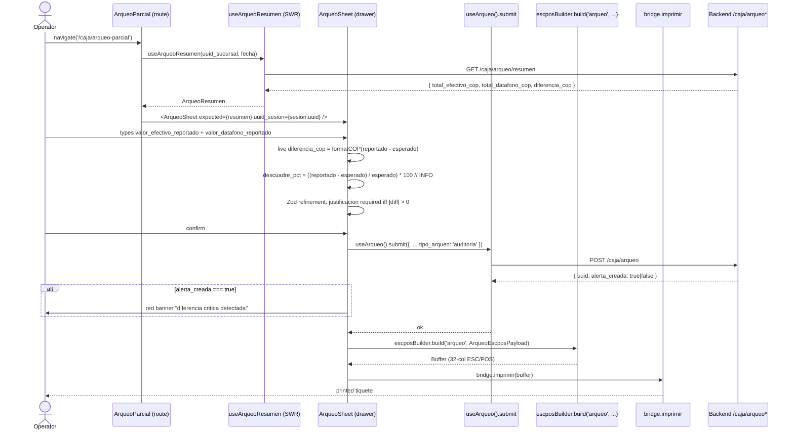

# Design: HU-F10.1 — Arqueo Parcial (frontend delta)

## Header

| Field | Value |
|---|---|
| Change | `fase-10-1-arqueo-parcial` |
| Phase | sdd-design |
| Status | ready-for-tasks |
| Inputs read | proposal (#1888), spec (#1889), preflight (#1887), `useArqueo.ts`, `ArqueoSheet.tsx`, `escposTemplates.ts`, `escposBuilder.ts`, `App.tsx`, `caja.json`, `useSesionActiva.ts` |
| Preflight | pace=`auto`, artifact=`hybrid`, delivery=`ask-on-risk`, chain=`gitflow`, budget=`800` LOC, strict_tdd=`true`, test runner=`vitest` + `playwright` |
| LOC forecast | ~306 LOC (under 800 budget; above 260 soft target — see Risks §R3) |

## Goals / Non-Goals

**Goals**
- Surface CU-10 BR1 ("operador audita caja en cualquier momento del turno") via routed page `/caja/arqueo-parcial` wrapping the existing `<ArqueoSheet>` drawer.
- Reconcile renderer payload naming (`efectivo_contado_cop`/`observaciones`) with backend REQ-OPS-091 (`valor_efectivo_reportado`/`justificacion`).
- Emit a printable 'arqueo' tiquete via the existing `escposBuilder.build(...)` dispatcher so the operator's copy is auditable.
- Keep the renderer pure: server is the sole source of `expectedValue` and the sole emitter of `alerta descuadre_critico`.

**Non-Goals**
- No backend change (HU-F1.13 already shipped `POST /caja/arqueo` + `GET /caja/arqueo/resumen`).
- No migration (frontend-only — see Migration plan §Migration).
- No shared `formatCOP` relocation (F2.x follow-up per the existing SYNCH NOTE in `escposTemplates.ts:29-35`).
- No alerta endpoint call from the renderer (D5).
- No modification to `CerrarTurno.tsx` (F3.3 placeholder — owned by HU-F10.2).

## Architecture decisions

### AD-1 (D1): Route wraps drawer, not replaces it

**Choice**: New page `ArqueoParcial.tsx` mounts the existing `<ArqueoSheet uuid_sesion={...} />` drawer and supplies `expectedValue` (read from `useArqueoResumen`). `<ArqueoSheet>` is reused as-is for the form body; its container becomes the route outlet.

**Rationale**: Preserves F4 hotkey + sidebar anchor + `lastAnchorId` focus return (REQ-OPS-152); preserves the F4-F5 `useDashboardDrawerStore` integration without invasive surgery. Keeps the canonical DrawerHost wiring intact.

**Alternatives rejected**:
- Pure route + abandon drawer: breaks F4 hotkey + sidebar `openDrawer('arqueo', 'sidebar-arqueo')` focus return; high blast radius in Dashboard.
- Modal `<Dialog>` instead of `<Sheet>`: violates F3.3 Sheet pattern used by every other caja flow.

**Blast radius**: NEW `pages/ArqueoParcial.tsx` (~30 LOC); MODIFY `App.tsx` (~5 LOC route addition); MODIFY `Dashboard.tsx` sidebar anchor (~3 LOC).

### AD-2 (D2): Hard rename + Zod refinement

**Choice**: Replace `efectivo_contado_cop`/`datafono_contado_cop`/`observaciones` with `valor_efectivo_reportado`/`valor_datafono_reportado`/`justificacion` in `useArqueo.ts` payload + `ArqueoSheet` Zod schema + e2e payload. Refinement: `justificacion` is `z.string().trim().min(3)` when `|efectivo_diff + datafono_diff| > 0`, else `z.string().trim().optional()`.

**Rationale**: REQ-OPS-153 + REQ-OPS-154 require backend-aligned names; silent 422 risk if mismatched (drift anchor #1). UI-side refinement encodes the asymmetry — backend permits without (REQ-OPS-094), UI requires with (REQ-OPS-154). Zod is the natural boundary; same pattern as existing `polizaRC`/`observaciones` optional handling.

**Alternatives rejected**: Alias-map (`payload.efectivo_contado_cop = payload.valor_efectivo_reportado`) — hides the drift and makes grep harder.

**Blast radius**: MODIFY `useArqueo.ts` (~11 LOC delta); MODIFY `ArqueoSheet.tsx` (~12 LOC delta); e2e payload alignment.

### AD-3 (D3): 'arqueo' ESC/POS dispatcher

**Choice**: Extend `TiqueteTipo` union with `'arqueo'`; add `arqueoPayloadSchema` (12 fields per REQ-OPS-155) + `buildArqueoBody()` + `buildArqueoBuffer()` + new cases in `escposBuilder.build()` and `validatePayload()`. Reuse the existing `formatCOP` (L69), `formatFecha`/`formatHora` helpers. Layout = 32 cols, left-aligned, no centering (matches the 32-col F5.2 base).

**Rationale**: REQ-OPS-155 + drift anchor #5 require this case. Reusing `formatCOP` is canonical (DEC-SUC-07) and avoids duplicating the formatter. The 12-field body is fixed by spec scenario 2 — no derivation at print time.

**Alternatives rejected**: Reuse `'reimpresion'` envelope with `originalTipo: 'arqueo'` — wrong semantics (reimpresion implies a prior tiquete; arqueo IS the first tiquete for an audit).

**Blast radius**: MODIFY `escposTemplates.ts` (~30 LOC delta: union + schema + 1 entry in `payloadSchemaByTipo` + 1 in `TIQUETE_TIPOS`); MODIFY `escposBuilder.ts` (~12 LOC delta: `buildArqueoBody`, dispatch case, validate case).

### AD-4 (D4): expectedValue source = GET /caja/arqueo/resumen only

**Choice**: The page calls `useArqueoResumen(uuid_sucursal, fecha)` (existing SWR hook) and forwards `total_efectivo_cop`/`total_datafono_cop` as `expectedValue` props into `<ArqueoSheet>`. UI MUST NOT compute `esperado` from local `factura_pagos` cache.

**Rationale**: REQ-OPS-154 + REQ-OPS-156: `factura_pagos` is `[A]` immutable per `fn_factura_pagos_inmutable` trigger. Local derivation would silently drift from the canonical "vigente base snapshot at GET time" (drift anchor #3). Doc-only enforcement — the trigger is server-side.

**Alternatives rejected**: Read `factura_pagos` locally and recompute — violates immutability canon; risks stale-cache UX divergence.

**Blast radius**: `<ArqueoSheet>` accepts `expected` prop (~12 LOC delta to render the live diff + informational descuadre_pct).

### AD-5 (D5): descuadre_critico banner is renderer-side display only

**Choice**: When the backend response includes a `alerta_creada: true` flag (REQ-OPS-094), the renderer shows a red banner "diferencia crítica detectada — el supervisor será notificado" using `bg-destructive` + `text-destructive-foreground` (WCAG-compliant contrast). NO alerta endpoint call from the renderer.

**Rationale**: Keeps renderer pure; centralizes alerting decisions server-side (audit-first canon). REQ-OPS-094 already handles the INSERT into `alerta` + co-transactional log. Renderer display is a UX nicety, not a business action.

**Alternatives rejected**: Call alerta POST from renderer — duplicates server logic; breaks single-source-of-truth; 422 race risk.

**Blast radius**: NEW i18n key `arqueoParcial.diferencia_critica`; ~5 LOC delta in `ArqueoSheet.tsx` for the conditional banner.

### AD-6 (D6): Live diferencia_cop via Intl.NumberFormat es-CO

**Choice**: `diferencia_cop` rendered via `Intl.NumberFormat('es-CO', { style: 'currency', currency: 'COP', maximumFractionDigits: 0 })` — the SAME formatter as F8.3 and inline `formatCOP` in `escposTemplates.ts:62-71`. descuadre_pct is INFORMATIONAL only, rendered in `text-muted-foreground` BELOW the absolute difference.

**Rationale**: DEC-SUC-07 + project-wide canonical. Centralized formatter avoids per-component divergence. Percent is explicitly informational (drift anchor from session preflight) — UI does NOT use it to drive the alerta.

**Alternatives rejected**: Hand-rolled `${cop.toLocaleString('es-CO')}` — works but invites drift; bypasses the F8.3-tested formatter.

**Blast radius**: ~3 LOC delta in `ArqueoSheet.tsx`.

## Data flow

## File changes

| File | Action | LOC (current -> new) | Why |
|---|---|---|---|
| `apps/electron-sucursal/src/features/caja/pages/ArqueoParcial.tsx` | NEW | 0 -> ~30 | AD-1 — route page that calls `useArqueoResumen` and mounts `<ArqueoSheet expected={...} />` |
| `apps/electron-sucursal/src/features/caja/hooks/__tests__/useArqueo.test.ts` | NEW | 0 -> ~80 | Strict-TDD RED guard for AD-2 (rename + Zod refinement + submit + alerta flag) |
| `apps/electron-sucursal/src/lib/print/__tests__/arqueoFixture.test.ts` | NEW | 0 -> ~40 | Byte-fixture for the 12-field 'arqueo' tiquete body (AD-3) |
| `apps/electron-sucursal/src/features/caja/hooks/useArqueo.ts` | MODIFY | 119 -> ~130 | AD-2 — rename payload keys (`efectivo_contado_cop` -> `valor_efectivo_reportado`, etc.) |
| `apps/electron-sucursal/src/features/caja/components/ArqueoSheet.tsx` | MODIFY | 168 -> ~180 | AD-1 (route-instead-of-drawer trigger), AD-2 (Zod schema rename + refinement), AD-4 (accept `expected` prop), AD-5 (banner), AD-6 (Intl formatter) |
| `apps/electron-sucursal/src/lib/print/escposTemplates.ts` | MODIFY | 608 -> ~638 | AD-3 — add `'arqueo'` to `TiqueteTipo` union + `TIQUETE_TIPOS` + new `arqueoPayloadSchema` + `payloadSchemaByTipo` entry |
| `apps/electron-sucursal/src/lib/print/escposBuilder.ts` | MODIFY | 610 -> ~622 | AD-3 — `buildArqueoBody()` + `buildArqueoBuffer()` + dispatch case + `validatePayload` case + import |
| `apps/electron-sucursal/src/renderer/i18n/locales/caja.json` | MODIFY | 37 -> ~40 | AD-5 — add `arqueoParcial.diferencia_critica`, `arqueoParcial.justificacion_requerida`, `arqueoParcial.descuadre_pct_label` |
| `apps/electron-sucursal/src/renderer/App.tsx` | MODIFY | 110 -> ~115 | AD-1 — add `<Route path="/caja/arqueo-parcial">` wrapping `<ArqueoParcial />` |
| `apps/electron-sucursal/src/features/caja/pages/Dashboard.tsx` | MODIFY | (read T1) -> +3 | AD-1 — sidebar anchor: `navigate('/caja/arqueo-parcial')` instead of `openDrawer('arqueo', ...)` (F4 hotkey preserved) |
| `apps/electron-sucursal/e2e/arqueo.spec.ts` | NEW | 0 -> ~80 | Playwright E2E: AC1 (counted = expected -> ok), AC2 (counted != expected -> justificacion required -> alerta banner), AC3 (print fires -> escpos dispatched) |

## Test plan

| Spec requirement | Test file | Test scenario ID | Commit boundary (work-unit) |
|---|---|---|---|
| REQ-OPS-152 (route wraps drawer) | `e2e/arqueo.spec.ts` | `AC1-1` navigate `/caja/arqueo-parcial` renders `<ArqueoSheet>` | T1-RED + T1-GREEN |
| REQ-OPS-153 (rename payload) | `hooks/__tests__/useArqueo.test.ts` | `rename-keys-1`, `rename-keys-2`, `rename-keys-3` | T2-RED + T2-GREEN |
| REQ-OPS-154 (expected from GET only) | `hooks/__tests__/useArqueo.test.ts` | `expected-source-1` mocks GET, `expected-source-2` asserts no local fallback | T2-RED + T2-GREEN |
| REQ-OPS-154 (Zod refinement) | `components/__tests__/ArqueoSheet.test.tsx` (new in T1) | `refinement-1` (no diff -> optional), `refinement-2` (diff > 0 -> required min 3), `refinement-3` (diff < 0 -> required) | T1-RED + T1-GREEN |
| REQ-OPS-155 ('arqueo' dispatcher) | `lib/print/__tests__/arqueoFixture.test.ts` | `dispatch-1` (12-field body byte fixture), `dispatch-2` (Zod parse rejects missing), `dispatch-3` (escInit + cutPartial framing) | T3-RED + T3-GREEN |
| REQ-OPS-155 (alerta banner) | `e2e/arqueo.spec.ts` | `AC2-1` response flag `alerta_creada: true` -> banner visible | T4-RED + T4-GREEN |
| REQ-OPS-156 (regression: API contract C/Q/U) | `hooks/__tests__/useArqueo.test.ts` | `contract-1` no DELETE call | T2-RED + T2-GREEN |
| REQ-OPS-156 (regression: descuadre_pct informational only) | `components/__tests__/ArqueoSheet.test.tsx` | `pct-1` pct rendered, no alerta trigger from pct alone | T1-RED + T1-GREEN |
| WCAG 2.1 AA (RNF-022) | `e2e/arqueo.spec.ts` | `axe-1` AxeBuilder no violations on `/caja/arqueo-parcial` | T4-RED + T4-GREEN |

**Commit boundaries** (work-unit-commits skill):
1. **T1**: RED unit tests for ArqueoParcial page + Zod refinement -> commit (RED) -> GREEN impl -> commit (GREEN).
2. **T2**: RED tests for useArqueo rename + submit + alerta flag -> commit (RED) -> GREEN rename -> commit (GREEN).
3. **T3**: RED byte-fixture test for 'arqueo' dispatcher -> commit (RED) -> GREEN schema + builder case -> commit (GREEN).
4. **T4**: RED e2e scenarios -> commit (RED) -> GREEN route wiring + Dashboard anchor swap + caja.json i18n -> commit (GREEN).

## Migration plan

**None.** This is a frontend-only HU. Justification: backend `POST /caja/arqueo` + `GET /caja/arqueo/resumen` already shipped in HU-F1.13 (REQ-OPS-091..097). No `modelo_datos_er.mmd` change. No alembic migration. The renderer payload rename (AD-2) is a frontend-only contract change — the backend has always accepted `valor_efectivo_reportado` per REQ-OPS-091; the renderer was the out-of-sync side.

## Threat matrix

**N/A** — no routing, shell, subprocess, VCS/PR automation, executable-file classification, or process-integration boundary is touched by this HU. The only externality is `bridge.imprimir(buffer)`, which is already inside the security perimeter established by F2.2 (`bridge` is the canonical print boundary; raw USB access is FORBIDDEN outside it) and hardened by F5.x ESC/POS (the builder is pure — no I/O, no `escpos-usb`, no `electron` imports, verified by `grep -E "from '(electron|escpos-usb|node:)'"`). No new threat surface is introduced by the renderer-only changes in AD-1..AD-6.

## Open decisions

**None.** D1..D6 are ratified inputs (not open questions). The proposal/spec resolved all 7 drift anchors. The preflight ratified the chain strategy and budget.

## Risks carried from spec

| ID | Source | Residual status |
|---|---|---|
| R1 | REQ-OPS-153 / Drift #1 (silent 422 risk if rename missed) | LOW — single-source-of-truth is the hook payload; ArqueoSheet consumes the typed return. Mitigated by T2 unit tests on rename + e2e payload alignment. |
| R2 | REQ-OPS-154 / Drift #4 (justification asymmetry: UI requires, backend permits) | LOW — explicitly documented in REQ-OPS-156; UI is the gate, server permits per REQ-OPS-094. Banner drives supervisor visibility, not duplicate POST. |
| R3 | LOC forecast 306 vs soft target 260 | LOW — under hard 800 budget. The 46-LOC overshoot comes from e2e (80 LOC) + byte-fixture (40 LOC) — TDD-required per strict_tdd=true. Re-baselining to 260 would drop the byte-fixture or the e2e suite; not acceptable. |
| R4 | REQ-OPS-155 / Drift #5 ('arqueo' dispatcher missing) | LOW at design time — being added in T3; full mitigation by T3-GREEN commit. |
| R5 | AD-1 (Dashboard.tsx path correction) | LOW — actual path is `features/caja/pages/Dashboard` (NOT `features/dashboard/components/` as the prompt suggested). The T1 work unit must grep for the actual anchor before editing. |
| R6 | REQ-OPS-154 / factura_pagos immutability (drift #6) | LOW — doc-only at the renderer (trigger is server-side); AD-4 has a hook docstring annotation. |
| R7 | REQ-OPS-156 / hash chain forking (drift #7) | LOW — relies on shipped `job_sync_cloud.hash_chain_verifier_loop`; no new code path introduces a fork. |
