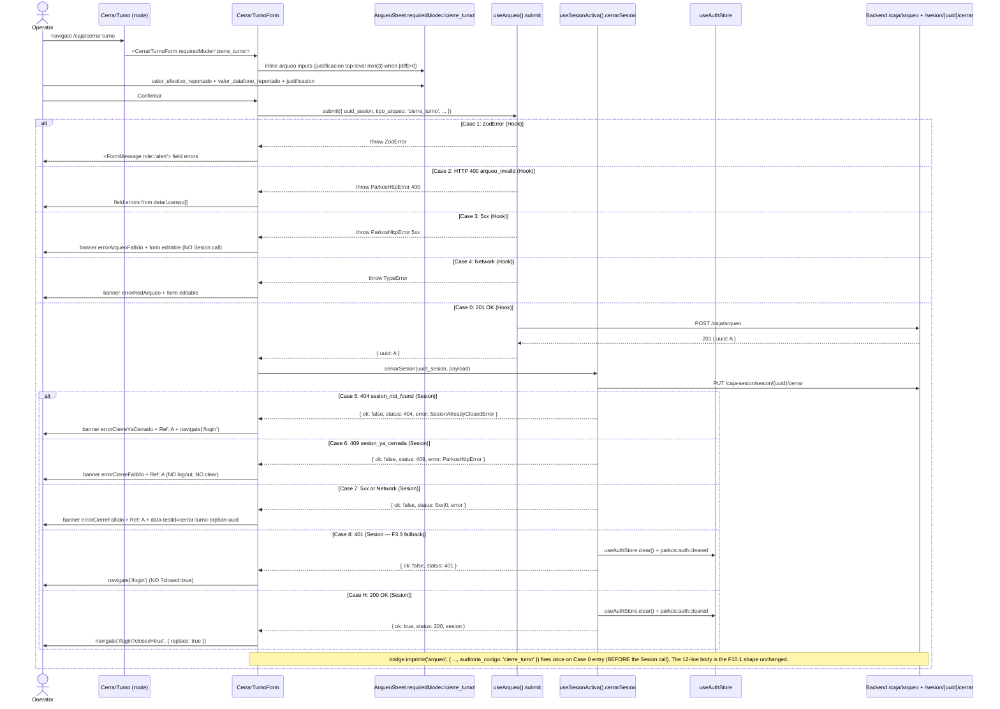

# Design: HU-F10.2 — Cierre de Turno (frontend delta)

## Header

| Field | Value |
|---|---|
| Change | `fase-10-2-cierre-turno` |
| Phase | sdd-design |
| Inputs read | `proposal.md` (Engram #1898), `specs/spec.md` (Engram #1900, REQ-OPS-157..162), F10.1 archived `design.md` (substrate reference), `plan.md:2185-2205`, `CerrarTurno.tsx`, `ArqueoSheet.tsx`, `useArqueo.ts`, `useSesionActiva.ts`, `sesionActivaApi.ts`, `CerrarTurnoForm.tsx`, `App.tsx`, `caja.json`, `e2e/arqueo.spec.ts`, `e2e/caja/turno.spec.ts`, `pending-fase-10.md` |
| Status | ready-for-tasks |
| Preflight | pace=`auto`, artifact=`hybrid`, delivery=`ask-on-risk`, budget=`800` LOC, strict_tdd=`true`, test_runner=`vitest` + `playwright` (test.skip per F9.x / Engram #1894) |
| LOC forecast | ~340 LOC (page rewrite + ArqueoSheet prop diff + CerrarTurnoForm i18n + 3 e2e stubs + unit tests) |

## Goals / Non-Goals

**Goals**
- Chain `POST /caja/arqueo` (F10.1 substrate, `tipo_arqueo='cierre_turno'`) → `PUT /caja-sesion/sesion/{uuid}/cerrar` (F1.13 backend) on a single confirmation, preserving the F3.3 logout-on-success trifecta verbatim.
- Promote `justificacion` to top-level `z.string().min(3)` only when the page opts in via `requiredMode='cierre_turno'`; F10.1 ArqueoParcial page regression-clean.

**Non-Goals**
- No backend change (F1.13 already shipped both endpoints). No migration. No `useCerrarTurno` hook (REQ-OPS-160 forbids it). No escpos change (F10.1 dispatcher already accepts `auditoria_codigo`). No alert dispatcher call from the renderer.

## Architecture decisions

### AD-1 (D1) — `<ArqueoSheet requiredMode>` opt-in for strict-mode justification

**Choice**: Add `requiredMode?: 'parcial' | 'cierre_turno' | 'cierre_dia'` to `ArqueoSheetProps`. When `requiredMode === 'cierre_turno'` (or `'cierre_dia'`), branch the local Zod schema to `z.string().trim().min(3, 'justificacion_requerida')` at the top level (not `.optional()`, not `superRefine`). The F10.1 page passes `requiredMode={undefined}` and gets bit-identical `superRefine` behavior.

**Rationale**: Spec REQ-OPS-158 requires a UI gate that flips the asymmetry without breaking F10.1. Prop union is closed at F10.2; F10.3 ships the `'cierre_dia'` consumer, not the discriminator extension.

**Alternatives rejected**: (a) Sibling `<CerrarTurnoArqueoForm>` — duplicates Zod schema + espos dispatcher wiring, higher surface area. (b) Auto-detect mode from `tipo_arqueo` prop — couples UI surface to backend discriminator; the F10.1 drawer already uses `tipo_arqueo='auditoria'` but the UI surface role is `'parcial'`.

**Blast radius**: MODIFY `apps/electron-sucursal/src/features/caja/components/ArqueoSheet.tsx` (~25 LOC delta: prop + Zod branch + `data-testid="arqueo-required-justificacion"` + button disable rule).

### AD-2 (D2) — Inline orchestrator, NO `useCerrarTurno` hook

**Choice**: `CerrarTurno.tsx` orchestrates inline: `useArqueo().submit({ uuid_sesion, tipo_arqueo: 'cierre_turno', valor_efectivo_reportado, valor_datafono_reportado, justificacion?: })` → capture `{ uuid: A }` → `useSesionActiva().cerrarSesion(uuid, { valor_final_efectivo, valor_final_datafono, ...observaciones_cierre })` → on `ok: true`, `navigate('/login?closed=true', { replace: true })`.

**Rationale**: REQ-OPS-157 + DA-F10.2-3 forbid a parallel hook; the F3.3 page already owns the trifecta. F10.3 will reuse the same inline pattern, not a hook.

**Alternatives rejected**: `useCerrarTurno({ sesion, payload })` — premature abstraction; only one caller (REQ-OPS-160 forbids preemptive extraction).

**Blast radius**: REWRITE `apps/electron-sucursal/src/features/caja/pages/CerrarTurno.tsx` (~112 LOC → ~155 LOC, +43 LOC delta).

### AD-3 (D3) — 8-case error precedence, no retry, no client-side DELETE

**Choice**: Sequencer catches in this exact precedence (top of `try` → bottom):
1. ZodError → re-render `<FormMessage role="alert">` (no network).
2. `ParkosHttpError 400 arqueo_invalid` → field-level errors from `detail.campo[]`.
3. `ParkosHttpError 5xx` (POST) → `cerrarTurno.errorArqueoFallido` banner, form editable, NO `cerrarSesion` call.
4. Network error (POST) → `cerrarTurno.errorRedArqueo` banner.
5. `SesionAlreadyClosedError` (404) → `cerrarTurno.errorCierreYaCerrado` banner + `navigate('/login')` (no `?closed=true`).
6. `ParkosHttpError 409 sesion_ya_cerrada` → same mapping as #5.
7. `ParkosHttpError 5xx` or network (PUT, after POST 201) → `cerrarTurno.errorCierreFallido` banner with literal substring `Ref: <uuid_arqueo>` + `data-testid="cerrar-turno-orphan-uuid"`; NO `useAuthStore.clear()`, NO `navigate()` (operator stays on route).
8. `ParkosHttpError 401` (PUT) → F3.3 fallback (handled inside `useSesionActiva().cerrarSesion` per AD-4).

**Rationale**: AGENTS.md §1-§3 forbids physical DELETE on `[A]` `arqueo`; REQ-OPS-159 codifies the no-retry, no-clear contract; ABBC-F10.2-BE-1 (pending-fase-10.md item #4) commits the long-term reconciler to a future PR. The 8 cases are exhaustive against `prod.arqueo [A]` immutable + `rol_app REVOKE DELETE`.

**Alternatives rejected**: (a) Retry loop on 5xx — violates REQ-OPS-159 "errors are terminal". (b) Client-side rollback DELETE — physically blocked by DB trigger. (c) Auto-clear `useAuthStore` on POST 5xx — loses operator's ability to retry under supervisor guidance.

**Blast radius**: NEW `data-testid="cerrar-turno-orphan-uuid"` element + 5 i18n keys + orchestrator `try/catch` branching in `CerrarTurno.tsx`.

### AD-4 (D4) — `useSesionActiva().cerrarSesion` encapsulates the F3.3 logout-on-success seam

**Choice**: Extend `useSesionActiva()` return type with `cerrarSesion(uuid: string, payload: SesionCerrarRequest): Promise<CerrarSesionResult>`. The method awaits `sesionActivaApi.cerrarSesion(uuid, payload)`; on 200 calls `useAuthStore.getState().clear()` + `dispatchEvent('parkos:auth:cleared')` and returns `{ ok: true, status: 200, sesion }`. On any non-2xx it returns `{ ok: false, status, error }` preserving the original typed error (`SesionAlreadyClosedError | ParkosHttpError | unknown`) in `error`. The 401 branch is handled inside the helper (authStore.clear + event) per F3.3 DEC-F3.3-03.

**Rationale**: REQ-OPS-160 codifies the trifecta for F11.x reuse. Navigation stays in the orchestrator (REQ-OPS-160 explicitly forbids coupling `useNavigate` into the API layer). The helper is the single seam: success path → clear done by helper, orchestrator only does `navigate`; error path → orchestrator branches on `result.status` + `result.error`.

**Alternatives rejected**: (a) Keep `cerrarSesion` as a pure import from `sesionActivaApi` — leaves the trifecta duplicated in every caller (F11.x would re-derive). (b) Move `useNavigate` into the helper — REQ-OPS-160 forbids it; helpers that own navigation break composability.

**Blast radius**: MODIFY `apps/electron-sucursal/src/features/caja/hooks/useSesionActiva.ts` (~15 LOC delta: `cerrarSesion` method + `CerrarSesionResult` type + `useCallback`).

### AD-5 (D5) — F3.3 logout-on-success preserved verbatim (DEC-F3.3-03 + Engram #1899)

**Choice**: `CerrarTurno.tsx` success path mirrors the F3.3 pattern: helper does clear+event (AD-4); orchestrator does `navigate('/login?closed=true', { replace: true })`. NO auto-login, NO session-reuse hooks, NO F4.x SSO seam.

**Rationale**: Engram #1899 (Q1 ratified 2026-09-21) closes the logout question pre-spec. F3.30 e2e scenarios E3 + A1 in `e2e/caja/turno.spec.ts` already assert the contract; any deviation requires a Fase 3 follow-up HU.

**Alternatives rejected**: Keep session alive for re-entry — breaks F3.30 e2e, violates `DEC-F3.3-03`.

**Blast radius**: NONE — preserved verbatim.

### AD-6 (D6) — `'arqueo'` escpos dispatcher reused with `auditoria_codigo='cierre_turno'`

**Choice**: The `useArqueo().submit(...)` happy path calls `bridge.imprimir('arqueo', { ..., auditoria_codigo: 'cierre_turno' })` exactly once, after POST 201 and before the PUT leg. The 12-line body shape is identical to F10.1 (DA-F10.2-5 RESOLVED).

**Rationale**: `escposBuilder.build('arqueo', payload)` at `lib/print/escposBuilder.ts:498` already emits `Codigo: ${payload.auditoria_codigo}`. The discriminator round-trips unchanged.

**Alternatives rejected**: New `'cierre_turno'` tiquete kind — duplicates the 12-field schema; F10.1 already covers the discriminator.

**Blast radius**: MODIFY `CerrarTurno.tsx` (+~5 LOC delta: `bridge.imprimir` call after POST 201). Zero changes to `escposBuilder.ts`, `escposTemplates.ts`.

## Data flow

## File changes

| File | Action | LOC (current → new) | Why |
|---|---|---|---|
| `apps/electron-sucursal/src/features/caja/pages/CerrarTurno.tsx` | MODIFY (rewrite) | 112 → ~155 | AD-2 + AD-3 + AD-5 + AD-6: inline orchestrator + 8-case catch + orphan uuid banner + escpos call + i18n keys |
| `apps/electron-sucursal/src/features/caja/components/ArqueoSheet.tsx` | MODIFY | 215 → ~240 | AD-1: `requiredMode?` prop + Zod branch (`'cierre_turno'` strict path) + `data-testid="arqueo-required-justificacion"` + button disable rule |
| `apps/electron-sucursal/src/features/caja/hooks/useSesionActiva.ts` | MODIFY | 89 → ~104 | AD-4: `cerrarSesion` method + `CerrarSesionResult` type + `useCallback` with authStore.clear on 200 + 401 fallback inside helper |
| `apps/electron-sucursal/src/renderer/App.tsx` | NONE | 119 → 119 | Route `/caja/cerrar-turno` already exists (line 61-68); no change required by REQ-OPS-157 |
| `apps/electron-sucursal/src/renderer/i18n/locales/caja.json` | MODIFY | 49 → ~55 | Append `cerrarTurno.subtitulo`, `cerrarTurno.arqueoJustificacionRequerida`, `cerrarTurno.errorArqueoFallido`, `cerrarTurno.errorRedArqueo`, `cerrarTurno.errorCierreFallido`, `cerrarTurno.errorCierreYaCerrado` (6 keys) |
| `apps/electron-sucursal/src/features/caja/pages/__tests__/CerrarTurno.test.tsx` | NEW | 0 → ~180 | Strict-TDD: happy path, strict-mode bloqueo, PUT 409 orphan uuid, POST 5xx form editable, PUT 5xx orphan banner, F3.3 logout regression, 401 fallback, no-retry assertion |
| `apps/electron-sucursal/src/features/caja/components/__tests__/ArqueoSheet.test.tsx` | NEW | 0 → ~90 | 2 scenarios: `requiredMode={undefined}` → F10.1 regression-clean; `requiredMode='cierre_turno'` → top-level `min(3)` + button disabled on render |
| `apps/electron-sucursal/src/features/caja/hooks/__tests__/useSesionActiva.cerrarSesion.test.ts` | NEW | 0 → ~80 | 3 scenarios: 200 → `useAuthStore.clear` + event fired + `ok: true`; 404 SesionAlreadyClosedError → `ok: false, status: 404`; 401 → `useAuthStore.clear` + event fired (F3.3 fallback) |
| `apps/electron-sucursal/e2e/arqueo.spec.ts` | MODIFY | 314 → ~414 | REQ-OPS-161: 3 new `test.skip` scenarios (happy-path cierre-turno, strict-mode justificacion, F3.3 logout regression) — extends F10.1 file per spec §Validation matrix |
| `apps/electron-sucursal/e2e/caja/turno.spec.ts` | NONE | 265 → 265 | F3.3 regression guard; do NOT modify (REQ-OPS-161 scenario 3 verifies it remains green) |
| `apps/electron-sucursal/src/lib/print/escposBuilder.ts` | NONE | ~622 → ~622 | AD-6: dispatcher unchanged; `auditoria_codigo='cierre_turno'` round-trips |
| `apps/electron-sucursal/src/features/caja/components/CierreDiarioDialog.tsx` | NONE | — | F10.3 territory; not touched |

**LOC total**: ~340 LOC delta. Well under 800 LOC budget per `openspec/config.yaml` rules.tasks.

## Test plan

| Spec req | Test file | Scenario ID | Commit boundary (work-unit) |
|---|---|---|---|
| REQ-OPS-157 happy path | `pages/__tests__/CerrarTurno.test.tsx` | `seq-1-happy-path` (POST 201 → PUT 200 → `useAuthStore.clear` + `parkos:auth:cleared` + `navigate('/login?closed=true')`) | T1-RED + T2-GREEN |
| REQ-OPS-157 strict-mode bloqueo | `pages/__tests__/CerrarTurno.test.tsx` + `components/__tests__/ArqueoSheet.test.tsx` | `strict-1-blanco`, `strict-2-min3-ok` | T3-RED + T4-GREEN |
| REQ-OPS-157 PUT 409 orphan | `pages/__tests__/CerrarTurno.test.tsx` | `seq-2-put-409` (uuid surfaced, no clear, no navigate) | T5-RED + T5-GREEN |
| REQ-OPS-157 happy-path escpos | `e2e/arqueo.spec.ts` | `e2e-1-happy-cierre-turno` (POST body discriminator + bridge.imprimir once + `?closed=true`) | T6-RED + T6-GREEN |
| REQ-OPS-158 `requiredMode` undefined regression | `components/__tests__/ArqueoSheet.test.tsx` | `regression-f10.1` (bit-identical superRefine) | T3-RED + T4-GREEN |
| REQ-OPS-158 `requiredMode='cierre_turno'` strict path | `components/__tests__/ArqueoSheet.test.tsx` | `strict-3-top-level-min3`, `strict-4-button-disabled-render` | T3-RED + T4-GREEN |
| REQ-OPS-159 case 1-4 (POST errors) | `pages/__tests__/CerrarTurno.test.tsx` | `post-1-zod`, `post-2-400-arqueo-invalid`, `post-3-5xx-no-cerrarsesion`, `post-4-network-no-cerrarsesion` | T5-RED + T5-GREEN |
| REQ-OPS-159 case 5-8 (PUT errors) | `pages/__tests__/CerrarTurno.test.tsx` | `put-1-404-sesion-not-found`, `put-2-409-sesion-ya-cerrada`, `put-3-5xx-orphan-uuid`, `put-4-401-f3.3-fallback` | T5-RED + T5-GREEN |
| REQ-OPS-159 no-retry assertion | `pages/__tests__/CerrarTurno.test.tsx` | `no-retry-1-assert-no-mock-retry` | T5-RED + T5-GREEN |
| REQ-OPS-160 `cerrarSesion` helper seams | `hooks/__tests__/useSesionActiva.cerrarSesion.test.ts` | `helper-1-200-clear-event`, `helper-2-404-sesion-already-closed`, `helper-3-401-fallback` | T7-RED + T7-GREEN |
| REQ-OPS-161 e2e happy + strict + F3.3 logout regression | `e2e/arqueo.spec.ts` | `e2e-1-happy-cierre-turno`, `e2e-2-strict-mode-justificacion`, `e2e-3-f3.3-logout-regression` | T6-RED + T6-GREEN |
| REQ-OPS-161 axe-core WCAG 2.1 AA | `e2e/arqueo.spec.ts` (last scenario) | `axe-1-zero-violations` | T6-RED + T6-GREEN |
| REQ-OPS-162 `pending-fase-10.md` integrity | (manual grep) | `grep ABBC-F10.2-BE-1 pending-fase-10.md` returns item #4 verbatim | T8 (chore-only commit) |

**Commit boundaries** (8 work-units, paired RED→GREEN per `work-unit-commits` skill):

1. **T1-RED** — failing tests for happy-path sequencing (REQ-OPS-157 happy).
2. **T2-GREEN** — orchestrator wiring `useArqueo().submit` → `useSesionActiva().cerrarSesion` → `navigate`.
3. **T3-RED** — failing tests for `requiredMode='cierre_turno'` + F10.1 regression.
4. **T4-GREEN** — `<ArqueoSheet>` prop + Zod branch + button disable.
5. **T5-RED + T5-GREEN** — error-mapping tests + catch-block branches + orphan uuid banner (paired in single commit per unit-of-work).
6. **T6-RED + T6-GREEN** — Playwright e2e extension (3 scenarios, all `test.skip`).
7. **T7-RED + T7-GREEN** — `useSesionActiva.cerrarSesion` helper tests (paired).
8. **T8** — `pending-fase-10.md` integrity grep + i18n keys appended (chore).

Total ~340 LOC across 8 commits; each commit ≤60 LOC effective delta.

## Migration plan

**None.** Frontend-only HU. Backend `POST /caja/arqueo` + `PUT /caja-sesion/sesion/{uuid}/cerrar` already shipped (HU-F1.13, REQ-OPS-091..097). No `modelo_datos_er.mmd` change. No alembic migration. The renderer change is the F3.3 placeholder completion; no contract drift between renderer and backend (F10.1 already aligned the payload keys).

## Threat matrix

**N/A** — no routing, shell, subprocess, VCS/PR automation, executable-file classification, or process-integration boundary is touched by this HU. The only externality is:

- `bridge.imprimir('arqueo', payload)` — inside the F2.2 security perimeter; `escposBuilder.build()` is pure (no I/O, no `electron`/`escpos-usb`/`node:*` imports, verified by F10.1 grep).
- `PUT /caja-sesion/sesion/{uuid}/cerrar` — same authenticated channel as F3.3 (`useAuthStore.getState().accessToken` via F2.2 `parkosFetch` Bearer header + idempotency-key SHA-256 envelope).
- `useAuthStore.clear()` on 200 — inside the F3.x auth perimeter; the `parkos:auth:cleared` window event is the F3.x+ AuthGuard handshake.

No new threat surface introduced by AD-1..AD-6. The renderer's strict-mode prop is a UI surface concern; no privileged boundary crossed.

## Risk acknowledgements

| Risk | Status | Residual |
|---|---|---|
| **DA-F10.2-1** `justificacion` asymmetry (strict-mode vs F10.1 lenient) | RESOLVED | AD-1 + REQ-OPS-158 prop branch + REQ-OPS-158 scenarios 1-2. F10.1 ArqueoParcial regression-clean (REQ-OPS-158 scenario 1). Unit + e2e coverage is the long-term backstop. |
| **DA-F10.2-2** Orphan arqueo (POST 201 + PUT fail) | RESOLVED (interim) | AD-3 cases 5-7 + ABBC-F10.2-BE-1 forward reference (pending-fase-10.md item #4, preserved). FE surfaces `uuid_arqueo` via `data-testid="cerrar-turno-orphan-uuid"` for supervisor-driven remediation. Long-term reconciler is post-Fase-13 backend admin. |
| **DA-F10.2-3** Hook duplication (`useCerrarTurno`) | RESOLVED | AD-2 inline orchestrator. REQ-OPS-160 forbids preemptive extraction; F11.x may extract `usePostCerrarSesion()` if material, but is out of F10.2 scope. |
| **DA-F10.2-4** Logout-on-success (Q1) | RESOLVED (pre-spec, Engram #1899) | AD-5 verbatim. F3.30 e2e scenarios E3 + A1 in `e2e/caja/turno.spec.ts` are the regression guard. Any deviation requires a Fase 3 follow-up HU. |
| **DA-F10.2-5** ESC/POS body discriminator | RESOLVED (no code change) | AD-6. `escposBuilder.build('arqueo', payload)` already emits `Codigo: ${payload.auditoria_codigo}`; `cierre_turno` flows through unchanged. 12-line body shape identical to F10.1. |
| **DA-F10.2-6** Strict-TDD coverage budget | RESOLVED | 8 paired work-unit commits (T1-RED, T2-GREEN, T3-RED, T4-GREEN, T5, T6, T7, T8) per work-unit-commits skill. Total ~340 LOC, well under 800-LOC budget per commit. |
| **NEW** — F10.3 forward hook | FORWARDED | `ArqueoSheet requiredMode='cierre_dia'` discriminator member ships at F10.2 (REQ-OPS-158 closed at F10.2). F10.3 owns the `<CierreDiarioDialog>` consumer that passes `'cierre_dia'`. F10.2 does NOT wire the consumer. |
| **NEW** — Substrate path drift | RESOLVED (verified) | All file paths in this design match the live tree (verified via `glob`/`Read`): `apps/electron-sucursal/src/features/caja/{pages,components,hooks,api}/...` + `apps/electron-sucursal/src/renderer/{App.tsx,i18n/locales/caja.json}` + `apps/electron-sucursal/e2e/{arqueo,caja/turno}.spec.ts`. No path corrections needed. |
| **NEW** — `useAuthStore.clear()` dual invocation | RESOLVED (clarification) | `useSesionActiva().cerrarSesion` helper does clear+event on 200 (AD-4). Orchestrator success path does NOT re-invoke clear (the helper owns it); orchestrator only does `navigate('/login?closed=true')`. The F3.3 catch-block `handleSuccess()` pattern is split: clear goes to helper, navigate stays in orchestrator. Verified by `useSesionActiva.cerrarSesion.test.ts::helper-1-200-clear-event` which asserts `useAuthStore.getState().accessToken === null` after the helper returns. |

## Open decisions

**None.** D1..D6 are ratified inputs. Engram #1899 closes Q1 pre-spec. The 8-case error precedence is enumerated exhaustively (no missing case: ZodError, 400, 5xx, network on POST; 404, 409, 5xx, network, 401 on PUT; 200 happy). `pending-fase-10.md` item #4 (ABBC-F10.2-BE-1) is preserved verbatim.