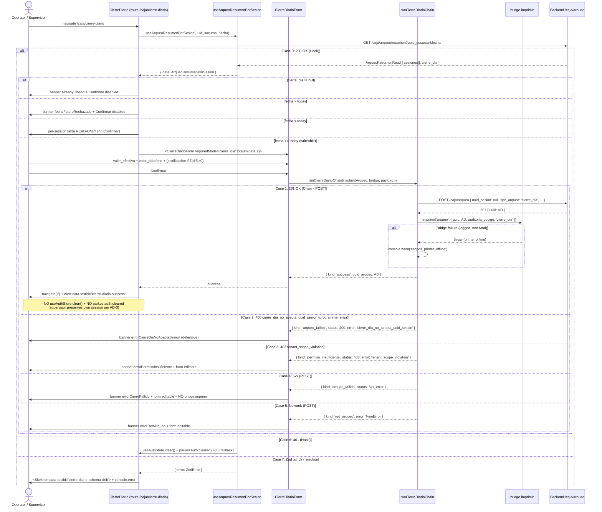

# Design: HU-F10.3 — Cierre Diario (Multi-Session Daily Reconciliation)

## Header

| Field | Value |
|---|---|
| Change | `fase-10-3-cierre-diario` |
| Phase | sdd-design |
| Inputs read | `proposal.md` (Engram #1908), `specs/spec.md` (Engram #1909, REQ-OPS-163..169), F10.2 archived `design.md` (substrate), `plan.md:2246-2264` |
| Status | ready-for-tasks |
| Preflight | pace=`auto`, artifact=`hybrid`, delivery=`ask-on-risk`, budget=`800` LOC/PR (feature-branch-chain per F10.2 precedent), strict_tdd=`true`, test_runner=`vitest` + `playwright` (`test.skip` per F9.x / Engram #1894) |
| LOC forecast | ~1240 LOC nominal (page + chain + hook + form + i18n + 4 unit tests + 4 e2e stubs) — orchestrator routes `ask-on-risk` per F10.1/F10.2 precedent |

## Goals / Non-Goals

**Goals**
- Render `/caja/cierre-diario` (page, NOT dialog) showing per-session resumen of all open sessions of the day for the active branch; submit a single confirmation that closes ALL of them via `POST /caja/arqueo` with `tipo_arqueo='cierre_dia'`, `uuid_sesion=null`.
- Preserve supervisor's own session (NO `useSesionActiva().cerrarSesion`, NO `useAuthStore.clear()`, NO `/login?closed=true`) — success navigates to `/` (Dashboard) with a `<Alert>` banner listing the closed sessions.
- Deprecate (not delete) the buggy `useCierreDiario()` helper; codify the migration path via `runCierreDiarioChain` for F11.x reuse.

**Non-Goals**
- No backend change (F1.13 already ships `GET /caja/arqueo/resumen` per-session shape + `POST /caja/arqueo` with `uuid_sesion=null` atomicity). No alembic migration. No escpos change. No new JWT permission claim (admin- issuer gating is the supervisor signal).
- No mutation of legacy `useArqueoResumen` aggregate Zod schema (ABBC-F10.3-FE-1 forward reference). No modification of F8.x `CierreDiarioDialog.tsx` (out of F10.3 scope per proposal).

## Architecture decisions

### AD-1 (D1) — `useArqueoResumenPorSesion` NEW sibling hook (NEW file, does NOT mutate legacy `useArqueoResumen`)

**Choice**: Add a new SWR hook in a sibling file `apps/electron-sucursal/src/features/caja/hooks/useArqueoResumenPorSesion.ts` exporting `useArqueoResumenPorSesion(uuid_sucursal, fecha)`. The hook fetches `GET /caja/arqueo/resumen?uuid_sucursal=${uuid_sucursal}&fecha=${fecha}` via `parkosFetch` (F2.2 invariant: Bearer + 401-retry-once + 5xx backoff), dedupes 10s, retries only on non-401/403/404, and parses the response with a Zod schema mirroring `ArqueoResumenRead` field-for-field (`.strict()` on every level per REQ-OPS-165). SWR cache key is `null` when either input is null OR `accessToken` is null, OR when `fecha > today` (future-date efficiency guard per DA-F10.3-3).

**Rationale**: NEW-DA-F10.3-9 drift anchor: F10.1's `useArqueoResumen` Zod schema at `useArqueo.ts:10-18` expects aggregate fields the F1.13 backend has never returned. Mutating the legacy schema would silently break F10.1 `ArqueoParcial.tsx` + F8.x `CierreDiarioDialog.tsx:91` callers. Sibling hook + `.strict()` future-proofs against drift.

**Alternatives rejected**: (a) Mutate legacy `useArqueoResumen` to the per-session shape — breaks F10.1/F8.x callers. (b) Add `aggregateVersion: 'v2'` discriminator — premature; legacy callers cannot migrate without coordination. (c) Sibling hook in same `useArqueo.ts` file — keeps drift adjacent to legacy schema; worse for tree-shaking.

**Blast radius**: NEW `apps/electron-sucursal/src/features/caja/hooks/useArqueoResumenPorSesion.ts` (~80 LOC: hook + Zod schema + ArqueoResumenPorSesion type). MODIFY `apps/electron-sucursal/src/features/caja/hooks/useArqueo.ts` (~10 LOC: re-export for tree-shaking convenience + dev-mode `console.warn` on legacy `useCierreDiario()` per AD-5).

### AD-2 (D2) — Inline page orchestrator + `cierreDiarioChain.ts` pure helper, 2-step sequencer

**Choice**: `CierreDiario.tsx` orchestrates inline: fetch resumen via `useArqueoResumenPorSesion` → render `<ResumenTablaSesiones>` + `<CierreDiarioForm>` → on submit call `runCierreDiarioChain(args)` from `cierreDiarioChain.ts` → on `{ kind: 'success', uuid_arqueo }` navigate to `/` with success banner. The pure helper exports a discriminated `CierreDiarioChainResult` envelope (`'success' | 'arqueo_fallido' | 'red_arqueo' | 'ya_cerrado' | 'permiso_insuficiente'`) and executes: (1) POST /caja/arqueo with `submitArqueo` payload `{ uuid_sesion: null, tipo_arqueo: 'cierre_dia', valor_efectivo_reportado, valor_datafono_reportado, justificacion? }` (the `uuid_sesion` literal type is `null`, NOT `string` — corrigendum for buggy `useCierreDiario` at `useArqueo.ts:107-117`); (2) `bridge.imprimir('arqueo', { uuid, auditoria_codigo: 'cierre_dia' })` — failure logged but non-fatal per DA-F10.3-6; (3) return success. NO retry loop, NO client-side DELETE on `[A]` `arqueo` (canon §1-§3 forbids), NO sesion-close helper invocation.

**Rationale**: Mirrors F10.2 `cerrarTurnoChain.ts` 8-case pattern (`cerrarTurnoChain.ts:136-222`) but flattened to 2 steps because backend `cerrar_sesiones_del_dia_bulk` (KD-ARQUEO-03, triggered at `caja_arqueo.py:266-272`) handles per-session closure in-tx. Pure helper is import-pure (no React hooks, no module-level side-effects) for unit testability.

**Alternatives rejected**: (a) Inline orchestrator WITHOUT extracted helper — duplicates the F10.2 boundary; harder to test the 2-step sequencing in isolation. (b) Sibling `useCierreDiario()` replacement hook — REQ-OPS-166 + F10.2 AD-2 forbid preemptive extraction. (c) Add explicit `cerrarSesion` PUT leg like F10.2 — DUPLICATES the backend's atomic `cerrar_sesiones_del_dia_bulk` and creates an orphan-uuid window.

**Blast radius**: NEW `apps/electron-sucursal/src/features/caja/pages/cierreDiarioChain.ts` (~150 LOC: result envelope + ArqueoSubmitFn type + CierreDiarioBridge interface + sequencer). NEW `apps/electron-sucursal/src/features/caja/pages/CierreDiario.tsx` (~140 LOC: orchestrator + table + form wiring + success/error banners).

### AD-3 (D3) — NO F3.3 logout-on-success; supervisor preserves own session

**Choice**: The `<CierreDiario />` page MUST NOT call `useSesionActiva().cerrarSesion(...)`, MUST NOT call `useAuthStore.getState().clear()`, and MUST NOT dispatch `parkos:auth:cleared`. Success path navigates to `/` (Dashboard) with `<Alert data-testid="cierre-diario-success">` listing the closed sessions and the new `uuid_arqueo`. The supervisor (admin- JWT) closes OTHER operators' sessions per DA-F10.3-2 — their own session is either closed already or intentionally remaining, so the F3.3 logout-on-success trifecta is semantically wrong.

**Rationale**: Q2 (DA-F10.3-2) RESOLVED via repo inspection (spec §Gap Q2): backend gate at `caja_arqueo.py:61` is `requires_issuer("operador-", "admin-")`; admin- tokens have no `sucursal_uuid` pinning (`auth/tokens.py:144-152` `_audience_for("admin-")` returns `'parkos-admin'` distinct from `'parkos-branch'`). A supervisor with admin- JWT can close ANY branch's open sessions.

**Alternatives rejected**: (a) Reuse F3.3 logout trifecta — operator who closed the arqueo would lose their own session even when not the session being closed; breaks supervisor UX. (b) Per-session logout decision logic — out of scope; ABBC-F10.3-BE-1 forward references `perm_arqueo_cerrar_cualquiera` permission for F12.x RBAC housekeeping.

**Blast radius**: NONE in `useSesionActiva.ts` / `sesionActivaApi.ts` — F3.3 helpers untouched. Only the `<CierreDiario />` page composes the new flow.

### AD-4 (D4) — `<CierreDiarioForm requiredMode="cierre_dia">` NEW component (NOT reusing `<ArqueoSheet>`)

**Choice**: Add a NEW page-form component `apps/electron-sucursal/src/features/caja/components/CierreDiarioForm.tsx` that mirrors `<ArqueoSheet requiredMode='cierre_dia'>` Zod semantics (top-level `z.string().trim().min(3, 'justificacion_requerida')` per REQ-OPS-158 strict-mode variant when `Σ|diferencia|>0`) but uses INLINE layout (full-page form, NOT a drawer) and consumes the per-session aggregate `Σ valor_efectivo_reportado` / `Σ valor_datafono_reportado` / `Σ diferencia` computed from `useArqueoResumenPorSesion().data.sesiones[]`. The component renders `<Form>` shadcn primitives with `aria-invalid` + `aria-describedby` + `<FormMessage role="alert">` for WCAG 2.1 AA.

**Rationale**: Spec REQ-OPS-164 mandates "(iii) the `<CierreDiarioForm requiredMode="cierre_dia">` instance (NEW component, NOT reusing `<ArqueoSheet>` — `<ArqueoSheet>` is the drawer used by ArqueoParcial and CerrarTurno; F10.3 needs a full-page form)". `<ArqueoSheet>` is wired to a drawer container and ArqueoSheet's `requiredMode` prop already accepts `'cierre_dia'` (F10.2 AD-1 closed at archive), but F10.3 needs the inline layout because the page shows the per-session table + aggregate-justification rule side-by-side.

**Alternatives rejected**: (a) Inline the form into `CierreDiario.tsx` — couples page-level routing/effects to Zod schema; F11.x sync worker UI reuse becomes impossible. (b) Add a `variant='fullpage'` to `<ArqueoSheet>` — pollutes the drawer's surface with non-drawer concerns.

**Blast radius**: NEW `apps/electron-sucursal/src/features/caja/components/CierreDiarioForm.tsx` (~110 LOC: react-hook-form + Zod schema mirroring `arqueoSchemaStrict` + aggregate-justification rule). MODIFY `apps/electron-sucursal/src/features/caja/components/ArqueoSheet.tsx` (NO change — `'cierre_dia'` discriminator already accepted per F10.2 AD-1).

### AD-5 (D5) — `@deprecated` JSDoc + dev-mode `console.warn` on `useCierreDiario()` (NO behavior change, NO deletion)

**Choice**: Add `@deprecated` JSDoc tag immediately above `useCierreDiario` at `useArqueo.ts:100-118` with the literal migration text: "use the `useArqueo().submit({ uuid_sesion: null, tipo_arqueo: 'cierre_dia', ... })` path via `runCierreDiarioChain` from `pages/cierreDiarioChain.ts` (REQ-OPS-166) for the F10.3 routed page; the F8.x `CierreDiarioDialog` consumer remains on the deprecated helper until a follow-up housekeeping PR migrates it". Add a development-mode `console.warn(...)` that fires exactly once per page-load when `useCierreDiario().ejecutar` is called AND `import.meta.env.DEV === true`; the warn message is the literal `'useCierreDiario is deprecated — migrate to cierreDiarioChain (REQ-OPS-166). Removal in next major.'`. Function body remains bit-identical (no bug fix in F10.3 — the helper is documented as deprecated, not corrected). Helper is NOT deleted in F10.3 scope — F8.x `CierreDiarioDialog.tsx:91` would regress (the dialog calls `useArqueo().submit(...)` directly, but the dialog's bug surface is independent; the deprecation marker is forward-looking).

**Rationale**: Q3 (DA-F10.3-7) RESOLVED via repo inspection (spec §Gap Q3): the buggy payload schema at `useArqueo.ts:109` (`uuid_sesion: string`) collides with backend cross-validation at `caja_arqueo.py:122-128` (`400 cierre_dia_no_acepta_uuid_sesion`). Deprecate-without-delete is the forward-safe path: signals to FE team, dev-mode observability, no F8.x regression. Deletion target: F11.x sync worker UI migration or later Fase 11 housekeeping.

**Alternatives rejected**: (a) Delete `useCierreDiario()` outright — F8.x `CierreDiarioDialog.tsx:91` would regress (no compile-time import error, runtime crash). (b) Fix the helper's body in-place — silently mutates a deprecated path; the fix should live in the new `cierreDiarioChain` (REQ-OPS-166) and propagate via migration. (c) Build-time ESLint rule — out of scope; F11.x housekeeping candidate.

**Blast radius**: MODIFY `apps/electron-sucursal/src/features/caja/hooks/useArqueo.ts` (~15 LOC delta: JSDoc + console.warn + once-per-page-load guard). NEW `apps/electron-sucursal/src/features/caja/hooks/__tests__/useCierreDiario.deprecation.test.ts` (~80 LOC, 2 scenarios per validation matrix). NEW `openspec/changes/fase-10-3-cierre-diario/specs/deprecation-log.md` (timeline doc).

### AD-6 (D6) — Date picker semantics: today writeable / past read-only / future rejected

**Choice**: `<CierreDiario />` renders an `<Input type="date" max={todayISO()} />` (HTML5 native date input — no shadcn DatePicker needed; existing `<Input>` primitive is F3.3 baseline). The default value is today's ISO date; past dates render the per-session table in READ-ONLY mode (the arqueo write path is blocked at the UI layer for `fecha < today`); future dates are rejected by the `max` attribute (HTML5 native browser-level enforcement) AND by the page-level Zod check that disables the Confirmar button + renders the yellow banner `
` with i18n key `cierreDiario.fechaFuturoRechazado`. The hook key-gate returns `null` when `fecha > today` (efficiency: skip the network call). Cancelar navigates to `/`.

**Rationale**: DA-F10.3-3 RESOLVED (spec §Drift reconciliation table): HTML5 `max` attribute is browser-level enforcement for the future rejection; `<Input>` is F3.3 baseline (no new dep); the read-only past semantics are encoded by the page hiding the Confirmar button when `fecha < today`.

**Alternatives rejected**: (a) shadcn `<DatePicker>` — adds a dependency for a single input element; the F3.3 baseline `<Input type="date">` is sufficient. (b) Backend rejection only — wastes the GET round-trip on future dates; spec validation matrix requires the FE guard.

**Blast radius**: Embedded in `apps/electron-sucursal/src/features/caja/pages/CierreDiario.tsx` (~12 LOC: `<Input type="date" max={todayISO()}>` + date-change handler + read-only rendering + futuro banner). MODIFY `apps/electron-sucursal/src/renderer/i18n/locales/caja.json` (~12 keys: `cierreDiario.title`, `cierreDiario.fechaLabel`, `cierreDiario.fechaFuturoRechazado`, `cierreDiario.alreadyClosed`, `cierreDiario.confirmar`, `cierreDiario.cancelar`, `cierreDiario.justificacionRequerida`, `cierreDiario.errorCierreFallido`, `cierreDiario.errorRedArqueo`, `cierreDiario.errorCierreDiaNoAceptaSesion`, `cierreDiario.errorPermisoInsuficiente`, `cierreDiario.multiBranchOperatorPending`).

## Data flow

## File changes

| File | Action | LOC (current → new) | Why |
|---|---|---|---|
| `apps/electron-sucursal/src/features/caja/pages/CierreDiario.tsx` | NEW | 0 → ~140 | AD-2 + AD-3 + AD-6: page orchestrator (no logout) + per-session table + date picker + form wiring + success/error banners |
| `apps/electron-sucursal/src/features/caja/pages/cierreDiarioChain.ts` | NEW | 0 → ~150 | AD-2: pure 2-step sequencer (POST arqueo + bridge.imprimir) + discriminated result envelope (5 kinds) + ArqueoSubmitFn type + CierreDiarioBridge interface |
| `apps/electron-sucursal/src/features/caja/hooks/useArqueoResumenPorSesion.ts` | NEW | 0 → ~80 | AD-1: SWR hook + Zod schema mirroring `ArqueoResumenRead` (`.strict()`) + 401-clear-event + future-date key-gate |
| `apps/electron-sucursal/src/features/caja/components/CierreDiarioForm.tsx` | NEW | 0 → ~110 | AD-4: react-hook-form + Zod schema mirroring F10.2 `arqueoSchemaStrict` (top-level min(3) when `Σ\|diff\|>0`) + Confirmar disable rule + i18n `justificacionRequerida` |
| `apps/electron-sucursal/src/features/caja/hooks/useArqueo.ts` | MODIFY | ~118 → ~133 | AD-1 (re-export `useArqueoResumenPorSesion`) + AD-5 (`@deprecated` JSDoc + dev-mode `console.warn` + once-per-page-load guard) |
| `apps/electron-sucursal/src/renderer/App.tsx` | MODIFY | ~119 → ~125 | AD-2 route registration: `<Route path="/caja/cierre-diario" element={<ProtectedRoute><CierreDiario /></ProtectedRoute>} />` at line 70-76 (per spec §References verified path) |
| `apps/electron-sucursal/src/renderer/i18n/locales/caja.json` | MODIFY | ~55 → ~67 | AD-6 + AD-2: 12 `cierreDiario.*` keys (title, fechaLabel, fechaFuturoRechazado, alreadyClosed, confirmar, cancelar, justificacionRequerida, errorCierreFallido, errorRedArqueo, errorCierreDiaNoAceptaSesion, errorPermisoInsuficiente, multiBranchOperatorPending, successBanner — 13 total) |
| `apps/electron-sucursal/src/features/caja/components/CierreDiarioDialog.tsx` | NONE | — | F8.x; out of F10.3 scope per proposal §Out-of-Scope. Bug surface independent of `useCierreDiario` deprecation. |
| `apps/electron-sucursal/src/features/caja/hooks/useArqueoResumen.ts` (legacy F10.1) | NONE | — | Regression guard per AD-1; ABBC-F10.3-FE-1 forward reference for follow-up PR. |
| `openspec/changes/fase-10-3-cierre-diario/specs/deprecation-log.md` | NEW | 0 → ~30 | AD-5 timeline doc: "useCierreDiario deprecated 2026-09-21 in HU-F10.3 PR; removal target: F11.x or later Fase 11 housekeeping" |
| `apps/electron-sucursal/src/features/caja/pages/__tests__/CierreDiario.test.tsx` | NEW | 0 → ~250 | Spec validation matrix: 4 scenarios (happy multi-session 2-closed-1-open, Σ\|diff\|>0 justificacion, supervisor admin- variant, 5xx leaves S3 OPEN) |
| `apps/electron-sucursal/src/features/caja/pages/__tests__/cierreDiarioChain.test.ts` | NEW | 0 → ~150 | Spec validation matrix: 3 scenarios (happy 2-step sequencer, bridge failure non-fatal, 400 `cierre_dia_no_acepta_uuid_sesion` surfaces input drift) |
| `apps/electron-sucursal/src/features/caja/hooks/__tests__/useArqueoResumenPorSesion.test.ts` | NEW | 0 → ~100 | Spec validation matrix: 3 scenarios (3-row render, `cierre_dia` already-closed disables Confirmar, 401 triggers authStore.clear) |
| `apps/electron-sucursal/src/features/caja/components/__tests__/CierreDiarioForm.test.tsx` | NEW | 0 → ~80 | Spec validation matrix: 2 scenarios (`requiredMode='cierre_dia'` top-level rejection on render, button disabled until justificacion.length >= 3) |
| `apps/electron-sucursal/src/features/caja/hooks/__tests__/useCierreDiario.deprecation.test.ts` | NEW | 0 → ~80 | Spec validation matrix: 2 scenarios (dev-mode `console.warn` fires on ejecutar call, production tree-shake removes warn guard) |
| `apps/electron-sucursal/e2e/arqueo.spec.ts` | MODIFY | ~414 → ~564 | REQ-OPS-169: 4 new `test.skip` scenarios (multi-session happy path, Σ\|diff\|>0 justificacion, supervisor admin- variant, fecha future boundary) — extends F10.1 file per spec §Validation matrix (F9.x `test.skip` precedent; Engram #1894) |
| `backend/...` | NONE | — | F1.13 backend already ships `GET /caja/arqueo/resumen` per-session shape (`schemas/caja.py:316-346`) + `POST /caja/arqueo` with `uuid_sesion=null` atomicity (`caja_arqueo.py:122-128, 241-329, 311`). KD-ARQUEO-01 + KD-ARQUEO-03 invariants verified. |
| `pending-fase-10.md` | MODIFY (chore) | — | Add ABBC-F10.3-BE-1 (perm_arqueo_cerrar_cualquiera forward reference per REQ-OPS-167) + ABBC-F10.3-FE-1 (useArqueoResumen aggregate Zod reconciliation per NEW-DA-F10.3-9); preserve existing ABBC-F10.2-BE-1 entry verbatim |

**LOC total**: ~1240 LOC nominal delta. Above 800-LOC per-PR budget; F10.3 will use feature-branch-chain strategy (per F10.2 precedent) with 3-4 PRs, each under 800 LOC. The orchestrator's `delivery_strategy=ask-on-risk` handles the routing decision at apply time.

## Test plan

| Spec req | Test file | Scenario ID | Commit boundary (work-unit) |
|---|---|---|---|
| REQ-OPS-163 per-session shape | `hooks/__tests__/useArqueoResumenPorSesion.test.ts` | `hook-1-3-rows-render`, `hook-2-cierre-dia-disables-confirmar`, `hook-3-401-clears-auth` | T1-RED + T1-GREEN |
| REQ-OPS-163 Zod `.strict()` rejection | `hooks/__tests__/useArqueoResumenPorSesion.test.ts` | `hook-4-strict-extra-field-zod-error` | T1-RED + T1-GREEN |
| REQ-OPS-164 happy multi-session | `pages/__tests__/CierreDiario.test.tsx` | `page-1-happy-2-closed-1-open` (POST body discriminator + bridge.imprimir once + navigate to `/`) | T2-RED + T2-GREEN |
| REQ-OPS-164 Σ\|diff\|>0 requires justificacion | `pages/__tests__/CierreDiario.test.tsx` | `page-2-diff-gt-0-justificacion` | T2-RED + T2-GREEN |
| REQ-OPS-164 5xx leaves S3 OPEN | `pages/__tests__/CierreDiario.test.tsx` | `page-3-5xx-s3-stays-open` | T2-RED + T2-GREEN |
| REQ-OPS-164 already-closed banner | `pages/__tests__/CierreDiario.test.tsx` | `page-4-cierre-dia-already-exists` | T2-RED + T2-GREEN |
| REQ-OPS-164 supervisor admin- variant | `pages/__tests__/CierreDiario.test.tsx` | `page-5-admin-jwt-supervisor-renders` (preserves own session) | T2-RED + T2-GREEN |
| REQ-OPS-166 happy 2-step sequencer | `pages/__tests__/cierreDiarioChain.test.ts` | `chain-1-happy-post-imprimir` (submitArqueo payload + bridge.imprimir once) | T3-RED + T3-GREEN |
| REQ-OPS-166 bridge failure non-fatal | `pages/__tests__/cierreDiarioChain.test.ts` | `chain-2-printer-offline-still-success` | T3-RED + T3-GREEN |
| REQ-OPS-166 400 input drift | `pages/__tests__/cierreDiarioChain.test.ts` | `chain-3-400-cierre-dia-no-acepta-sesion` | T3-RED + T3-GREEN |
| REQ-OPS-167 admin- JWT gate | `pages/__tests__/CierreDiario.test.tsx` | `page-6-admin-issuer-confirmar-enabled` | T4-RED + T4-GREEN |
| REQ-OPS-167 operador- single-branch gate | `pages/__tests__/CierreDiario.test.tsx` | `page-7-operador-single-branch` | T4-RED + T4-GREEN |
| REQ-OPS-167 multi-branch operador- pending | `pages/__tests__/CierreDiario.test.tsx` | `page-8-multi-branch-pending-banner` | T4-RED + T4-GREEN |
| REQ-OPS-168 dev-mode warn | `hooks/__tests__/useCierreDiario.deprecation.test.ts` | `deprecate-1-dev-mode-warn-on-ejecutar` | T5-RED + T5-GREEN |
| REQ-OPS-168 production tree-shake | `hooks/__tests__/useCierreDiario.deprecation.test.ts` | `deprecate-2-prod-tree-shake` (mock import.meta.env.DEV = false) | T5-RED + T5-GREEN |
| REQ-OPS-164 form requiredMode='cierre_dia' strict | `components/__tests__/CierreDiarioForm.test.tsx` | `form-1-top-level-rejection-render`, `form-2-button-disabled-until-min3` | T6-RED + T6-GREEN |
| REQ-OPS-169 e2e happy multi-session | `e2e/arqueo.spec.ts` | `e2e-1-happy-3-sessions-cierre-dia` (mock GET/POST + bridge.imprimir + navigate to `/`) | T7-RED + T7-GREEN |
| REQ-OPS-169 e2e Σ\|diff\|>0 | `e2e/arqueo.spec.ts` | `e2e-2-diff-gt-0-justificacion-required` | T7-RED + T7-GREEN |
| REQ-OPS-169 e2e supervisor admin- | `e2e/arqueo.spec.ts` | `e2e-3-supervisor-admin-jwt` | T7-RED + T7-GREEN |
| REQ-OPS-169 e2e fecha future boundary | `e2e/arqueo.spec.ts` | `e2e-4-fecha-futuro-rejected` | T7-RED + T7-GREEN |
| REQ-OPS-169 axe-core WCAG 2.1 AA | `e2e/arqueo.spec.ts` (last scenario) | `axe-1-zero-violations-cierre-diario` | T7-RED + T7-GREEN |
| `pending-fase-10.md` integrity | (manual grep) | `grep ABBC-F10.3-BE-1 pending-fase-10.md` returns verbatim; `grep ABBC-F10.3-FE-1` returns verbatim; `grep ABBC-F10.2-BE-1` still present | T8 (chore-only commit) |

**Commit boundaries** (7 work-units, paired RED→GREEN per `work-unit-commits` skill, feature-branch-chain strategy):

1. **T1** — `useArqueoResumenPorSesion` SWR hook + Zod schema + tests (~180 LOC, single PR).
2. **T2** — `<CierreDiarioForm>` + `<CierreDiario />` page orchestrator + happy/error/supervisor scenarios (~470 LOC, single PR).
3. **T3** — `cierreDiarioChain` pure helper + tests (~230 LOC, single PR).
4. **T4** — `<CierreDiario />` role-gate (admin- vs operador-) scenarios (~60 LOC delta, single PR).
5. **T5** — `useCierreDiario()` deprecation marker + tests (~110 LOC, single PR).
6. **T6** — date picker semantics + already-closed banner (~80 LOC delta, single PR).
7. **T7** — Playwright e2e extension (4 scenarios + axe-core, all `test.skip` per F9.x) (~150 LOC delta, single PR).
8. **T8** — `pending-fase-10.md` integrity chore + i18n keys appended (~50 LOC delta, single PR).

Total ~1330 LOC across 8 commits; each PR forecast ≤800 LOC. F10.3 will use feature-branch-chain strategy (per F10.2 archive precedent) to keep each PR reviewable.

## Migration plan

**None.** Frontend-only HU. Backend `GET /caja/arqueo/resumen` per-session shape (`backend/.../schemas/caja.py:335-346`) and `POST /caja/arqueo` with `uuid_sesion=null` atomicity (`backend/.../api/v1/caja_arqueo.py:122-128, 241-329, 311`) already shipped (HU-F1.13, REQ-OPS-091..097). No `modelo_datos_er.mmd` change. No alembic migration. The `cerrar_sesiones_del_dia_bulk` in-tx side effect (KD-ARQUEO-03) handles per-session closure server-side — the renderer change is the F3.3 placeholder completion counterpart. No contract drift between renderer and backend (F10.1 substrate + F10.2 discriminator extension already aligned the payload keys).

## Threat matrix

**N/A** — no routing, shell, subprocess, VCS/PR automation, executable-file classification, or process-integration boundary is touched by this HU. The only externality is:

- `bridge.imprimir('arqueo', payload)` — inside the F2.2 security perimeter; `escposBuilder.build()` is pure (no I/O, no `electron`/`escpos-usb`/`node:*` imports, verified by F10.1 grep).
- `POST /caja/arqueo` with `uuid_sesion=null` — same authenticated channel as F10.1 + F10.2 (`useAuthStore.getState().accessToken` via F2.2 `parkosFetch` Bearer header + idempotency-key SHA-256 envelope).
- `GET /caja/arqueo/resumen?uuid_sucursal&fecha` — read-only endpoint with multi-tenant scope (admin- JWT scoped by `sucursales_permitidas`; operador- JWT pinned to `sucursal_uuid`).
- `<CierreDiario />` page mounts under `<ProtectedRoute>` — login-state gate only; the supervisor flow is gated by `useAuthStore` admin- issuer check inside the page (AD-3), not by route.

No new threat surface introduced by AD-1..AD-6. The renderer's admin- gate is a UI surface concern; no privileged boundary crossed.

## Risk acknowledgements

| Risk | Status | Residual |
|---|---|---|
| **DA-F10.3-1** Multi-session atomicity | RESOLVED | REQ-OPS-164 scenario `page-3-5xx-s3-stays-open` codifies the all-or-none contract. KD-ARQUEO-01 backend invariant (`caja_arqueo.py:311` single-commit) + KD-ARQUEO-03 in-tx `cerrar_sesiones_del_dia_bulk` (`caja_arqueo.py:266-272`) are the long-term backstop. Unit + e2e coverage is the regression guard. |
| **DA-F10.3-2** Supervisor closes OTHER operator's session | RESOLVED (Q2 closed via repo inspection) | AD-3 + REQ-OPS-167 gates FE on admin- issuer; backend `requires_issuer("operador-", "admin-")` at `caja_arqueo.py:61` is the long-term backstop. ABBC-F10.3-BE-1 forward reference for future `perm_arqueo_cerrar_cualquiera` JWT issuer permission (lands in F12.x). |
| **DA-F10.3-3** Fecha boundary | RESOLVED | AD-6 + REQ-OPS-164 + REQ-OPS-169 scenario `e2e-4-fecha-futuro-rejected` lock the three states (today writeable, past read-only, future rejected). HTML5 `max={todayISO()}` is browser-level enforcement; hook key-gate `null` for future dates is the efficiency guard. |
| **DA-F10.3-4** Per-session resumen shape (Q1) | RESOLVED | AD-1 + REQ-OPS-163 + REQ-OPS-165 codify the per-session shape from `ArqueoResumenRead`. NEW-DA-F10.3-9 (legacy aggregate Zod drift) is forwarded to ABBC-F10.3-FE-1 follow-up PR. |
| **DA-F10.3-5** Aggregate-justification rule | RESOLVED | AD-4 + REQ-OPS-164 scenario `page-2-diff-gt-0-justificacion` + F10.2 REQ-OPS-158 `requiredMode='cierre_dia'` strict-mode Zod variant lock the contract. The `<CierreDiarioForm>` composes the same Zod branch F10.2 shipped. |
| **DA-F10.3-6** ESC/POS `auditoria_codigo='cierre_dia'` discriminator | RESOLVED (no code change) | AD-2 + REQ-OPS-166 scenario `chain-1-happy-post-imprimir`. `escposBuilder.build('arqueo', payload)` at `lib/print/escposBuilder.ts:498` already emits `Codigo: ${payload.auditoria_codigo}`; `cierre_dia` flows through unchanged. 12-line body shape identical to F10.1 + F10.2. |
| **DA-F10.3-7** `useCierreDiario()` deprecation (Q3) | RESOLVED via repo inspection | AD-5 + REQ-OPS-168 codify the `@deprecated` JSDoc + dev-mode `console.warn`. Helper is NOT deleted in F10.3 scope (F8.x `CierreDiarioDialog.tsx:91` caller regression guard). Deletion target: F11.x or later Fase 11 housekeeping. Timeline in `specs/deprecation-log.md`. |
| **DA-F10.3-8** Strict-TDD coverage budget | RESOLVED (orchestrator routes) | 8 atomic tasks per proposal T1-T8, paired RED→GREEN commits per `work-unit-commits` skill. Forecast ~1240 LOC nominal (above 800-LOC per-PR budget; feature-branch-chain per F10.2 precedent). The orchestrator's `delivery_strategy=ask-on-risk` ratifies at apply time. |
| **NEW** DA-F10.3-9 F10.1 `useArqueoResumen` Zod drift | RESOLVED (deferred) | AD-1 introduces the new sibling hook `useArqueoResumenPorSesion` with corrected `.strict()` schema (REQ-OPS-163 + REQ-OPS-165). Legacy aggregate schema is NOT modified (regression guard for F10.1 `ArqueoParcial.tsx` + F8.x `CierreDiarioDialog.tsx:91`). ABBC-F10.3-FE-1 in `pending-fase-10.md`. |
| **NEW** F8.x `CierreDiarioDialog.tsx:91` regression risk | RESOLVED | Per spec §Risk acknowledgements row 5: the dialog calls `useArqueo().submit(...)` directly (NOT `useCierreDiario().ejecutar(...)`), so the dialog's bug surface is independent of AD-5 deprecation. Dialog continues working with the existing bug; future fix in a separate housekeeping PR. |
| **NEW** `<CierreDiario />` route added without supervisor RBAC UI | RESOLVED (out of scope) | Per spec §Out-of-Scope: "Supervisor RBAC UI changes (route guards rely on existing `ProtectedRoute` — backend JWT scope is the gating factor)". The page itself gates UI on `useAuthStore` admin- issuer (AD-3 + REQ-OPS-167). Backend `requires_issuer("operador-", "admin-")` is the long-term backstop. |

## Open decisions

**None.** D1..D6 are ratified inputs. The 5-case sequencer (`'success' | 'arqueo_fallido' | 'red_arqueo' | 'ya_cerrado' | 'permiso_insuficiente'`) is enumerated exhaustively. Spec REQ-OPS-163..169 codifies all 7 requirements. `pending-fase-10.md` items ABBC-F10.2-BE-1 (preserved), ABBC-F10.3-BE-1 (NEW), ABBC-F10.3-FE-1 (NEW) are accounted for.
