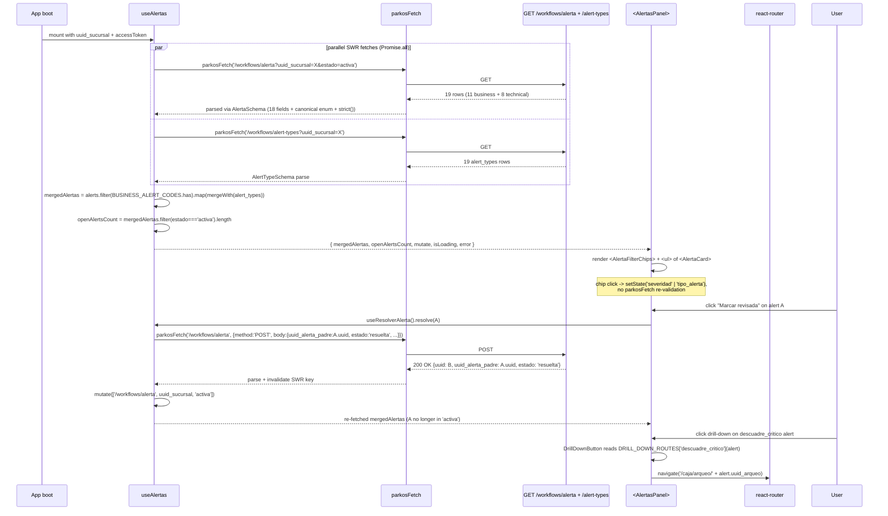

# Design: HU-F11.2 — Alertas Panel (Panel de alertas locales)

## Header

| Field | Value |
|---|---|
| Change | `fase-11-2-alertas-panel` |
| Phase | sdd-design (Phase 4 of SDD cycle) |
| Inputs read | `proposal.md` (144 lines, 14 drift anchors); `specs/spec.md` (333 lines, REQ-OPS-177..183); `plan.md` lines 2303-2344; F11.1 design.md substrate (6 ADs / 13 files / 1,312 LOC at SHA `4021d3d`); `~/.config/opencode/skills/{sdd-design,react,shadcn,work-unit-commits}/SKILL.md` |
| Status | DRAFT — awaits sdd-tasks |
| Preflight | pace=auto, artifact=hybrid (OpenSpec + Engram), delivery=ask-on-risk, budget=2000 LOC, strict_tdd=true, test=vitest+playwright, author=`Parkos Dev <dev@parkos.local>` |

## Goals

- Promote the F11.1 `<AlertasPanel />` stub to production: list + filter chips + drill-down + resolver.
- Reconcile FE Zod `AlertaSchema` to BE Pydantic 18 fields + canonical state enum (DA-F11.2-9 GATING).
- Ship the 11-vs-8 client-side filter (`BUSINESS_ALERT_CODES` whitelist; ABIERTO-06).
- Strict-TDD: RED tests land BEFORE any source change.

## Non-Goals

- Backend route modifications (`GET /workflows/alerta` from F1.1; `POST /workflows/alerta` reuses create path).
- Alert-types seed (F1.14 already shipped).
- Real-time push via WebSocket (deferred to v2; F11.2 keeps SWR 30 s polling).
- Admin-side alertas UI in `web_admin` (separate HU).

## Architecture decisions (AD-1..AD-7)

### AD-1 — Canonical state vocabulary `activa|descartada|resuelta` (D1)

**Choice**: `AlertaSchema.estado: z.enum(['activa','descartada','resuelta'])` matches BE Pydantic `Literal[...]` at `schemas/workflows.py:377` (DA-F11.2-9 reconciled). F11.1 stub enum (`['abierta','cerrada']`) deleted from `useSyncEstado.ts:90-146`. Query param changes from `?estado=abierta` to `?estado=activa`. BE handler rejects legacy with `400 {"error": "estado_invalido"}`.

**File**: `apps/electron-sucursal/src/lib/api/schemas/alertas.ts` (~80 LOC, NEW). Centralized in `lib/api/schemas/` so F12.x (Mi turno) and any future admin surface consuming alertas can re-use.

**Blast radius**: 1 import path change in `AlertasPanel.tsx`; F11.1 stub 57 lines deleted.

**Rejected**: (a) Dual-enum keep-alive — contradicts AGENTS.md §API contract canon (one source of truth). (b) FE-invented enum — breaks BE Pydantic validation on POST.

### AD-2 — `<AlertasPanel />` list + filter chips + per-`tipo_alerta` drill-down router (D2)

**Choice**: Promote F11.1 stub to a composition of 4 sub-components (F11.1 design.md pattern of separate banners over conditional rendering):
- `<AlertasPanel>` (orchestrator, ~120 LOC) owns state + SWR hook.
- `<AlertaCard>` (~80 LOC) renders severity badge + mensaje + drill-down + resolver.
- `<AlertaFilterChips>` (~60 LOC) renders severity + tipo_alerta chips; client-side filter.
- `lib/alertas/router.ts` (~50 LOC) `DRILL_DOWN_ROUTES: Record<TipoAlerta, (alert) => string>` keyed by code; `datos_nuevos.uuid_ingreso` for `capacidad_agotada_forzado`.

**Files**: 4 NEW + 1 MODIFY in `apps/electron-sucursal/src/{components,features/alertas/components,lib/alertas}/`. F11.1 stub at `features/sync/components/AlertasPanel.tsx:17` deleted; new orchestrator lives at top-level `components/AlertasPanel.tsx` (F11.1 banner precedent).

**Blast radius**: All callers of the stub (likely `<AppShell>` + `<StatusBar>` per F11.1) re-pointed to the new module path.

**Rejected**: (a) Monolithic component — conflicts with F11.1 component composition precedent. (b) Inline router inside `AlertaCard` — mixes presentation with routing logic.

### AD-3 — `useAlertas` SWR with parallel fetches + derived `openAlertsCount` (D3)

**Choice**: Two independent `useSWR` calls under the `useAlertas` namespace:
- `useSWR(['/workflows/alerta', uuid_sucursal, 'activa'], fetcher, { refreshInterval: 30_000 })` — primary alerts.
- `useSWR(['/workflows/alert-types', uuid_sucursal], fetcher, { refreshInterval: 300_000 })` — display metadata.

Derived `mergedAlertas` selector: each row enriched with `severidad` / `descripcion` / `mensaje` from `alert_types[tipo_alerta]`; rows with `tipo_alerta` absent from `alert_types` are silently dropped. Derived `openAlertsCount`: `mergedAlertas.filter(a => a.estado === 'activa' && BUSINESS_ALERT_CODES.has(a.tipo_alerta)).length` (mirrors `apiStatusStore`-derived selector pattern from F11.1).

**File**: `apps/electron-sucursal/src/features/alertas/hooks/useAlertas.ts` (~120 LOC, NEW).

**Blast radius**: Replaces F11.1 stub at `useSyncEstado.ts:90-146`. 401 → `useAuthStore.clear()` + `parkos:auth:cleared` event reused verbatim from F11.1.

**Rejected**: (a) Single endpoint with backend JOIN (path a) — flagged as **ABBC-F11.2-BE-1** for `pending-fase-11.md`. (b) SWR 5 min cadence for both — violates DA-F11.2-6 (30 s precedent from F11.1).

### AD-4 — `AlertaSchema` 18-field Zod + canonical state + `datos_nuevos` optional (D4)

**Choice**: Zod `strict()` schema with exactly the 18 BE fields from REQ-OPS-177. `estado` constrained to canonical enum (AD-1). `datos_nuevos: z.record(z.unknown()).nullable().optional()` so the schema parses today's BE response (no `datos_nuevos` field yet) AND gracefully picks up the column once ABBC-F11.2-BE-1 lands OR a future `AlertaRead` extension adds it.

**File**: `apps/electron-sucursal/src/lib/api/schemas/alertas.ts` (~80 LOC, shared with AD-1).

**Blast radius**: 1 import in `useAlertas.ts`; 1 in `useResolverAlerta.ts` (POST body reuses the same Zod primitives via `z.infer`).

**Rejected**: (a) `.passthrough()` — defeats strict-against-drift defence (REQ-OPS-180 scenario). (b) `.deepPartial()` — flattens type info needed for `datos_nuevos.uuid_ingreso` drill-down extraction.

### AD-5 — Append-only `marcar revisada` via `POST /workflows/alerta` with `uuid_alerta_padre` (D5, DEC-SUC-25)

**Choice**: `useResolverAlerta` (~80 LOC, NEW) POSTs to `/api/v1/workflows/alerta` with body `{ uuid_sucursal, uuid_usuario, uuid_alerta_padre: original.uuid, tipo_alerta: original.tipo_alerta, estado: 'resuelta', timestamp_evento: now() }`. On 200: `mutate(['/workflows/alerta', uuid_sucursal, 'activa'])` re-fetches. NEVER issues `PUT`/`PATCH` against `/workflows/alerta/{uuid}` (DEC-SUC-25; `prod.alerta` is `[A]`).

**File**: `apps/electron-sucursal/src/features/alertas/hooks/useResolverAlerta.ts` (~80 LOC, NEW).

**Blast radius**: Consumed by `<ResolverAlertaButton>` (~70 LOC, NEW). On 403 `actor_is_target` (REQ-26 only blocks `descartada`, NOT `resuelta` per DA-F11.2-13) the hook surfaces a typed toast — never thrown.

**Rejected**: (a) `PATCH /workflows/alerta/{uuid}` — violates `[A]` append-only canon. (b) Optimistic cache update without re-fetch — e2e S3 requires backend state assertion (REQ-OPS-183).

### AD-6 — `BUSINESS_ALERT_CODES` whitelist of 11; technical codes drop silently (D6, ABIERTO-06)

**Choice**: `apps/electron-sucursal/src/features/alertas/constants.ts` (~30 LOC) exports `BUSINESS_ALERT_CODES: Set<string>` (11) + `TECHNICAL_ALERT_CODES: Set<string>` (8). `useAlertas` filters via `Set.has(...)` (O(1) per row). On drop, emits `console.debug` in dev (`import.meta.env.DEV`) — NEVER `console.error`. The 11 codes derive from `plan.md:2311-2323`.

**File**: `apps/electron-sucursal/src/features/alertas/constants.ts` (~30 LOC, NEW).

**Blast radius**: Imported by `useAlertas.ts` (filter) + `<AlertaFilterChips>` (chip population) + `constants.test.ts` (O(1) perf sanity).

**Rejected**: (a) Array `.includes()` — REQ-OPS-182 scenario mandates O(1) `Set.has`. (b) `console.error` for dropped codes — contradicts ABIERTO-06 ("autoridad de filtro es el FE, no un error de sistema").

### AD-7 — 4 e2e scenarios (11 visible, drill-down, resolver + backend, 8 excluded) (D7)

**Choice**: `apps/electron-sucursal/e2e/alertas-panel.spec.ts` (~150 LOC, NEW) with Playwright + testcontainers Postgres for backend assertion. S1 (11 visible + filterable), S2 (drill-down per router map + `datos_nuevos` fallback), S3 (resolver: backend row in `prod.alerta` with `uuid_alerta_padre`), S4 (8 excluded + axe-core WCAG 2.1 AA). NO `test.skip` for S1/S2/S3; S4 axe-core may use `test.skip` per F9.x CI precedent.

**File**: `apps/electron-sucursal/e2e/alertas-panel.spec.ts` (~150 LOC, NEW).

**Blast radius**: Testcontainers Postgres fixture re-uses F1.2 pattern.

**Rejected**: (a) Mock-only e2e — DA-F11.2-8 mandates backend DB assertion in S3. (b) Split into 4 spec files — review fatigue; one file mirrors F11.1.

## Data flow

## File changes

| File | Action | LOC | Description |
|---|---|---|---|
| `apps/electron-sucursal/src/features/alertas/hooks/useAlertas.ts` | NEW | ~120 | SWR hook with parallel `/workflows/alerta` + `/workflows/alert-types` fetches, derived `mergedAlertas` + `openAlertsCount`. |
| `apps/electron-sucursal/src/features/alertas/hooks/useResolverAlerta.ts` | NEW | ~80 | Append-only POST; SWR cache invalidate on success; typed toast on 403. |
| `apps/electron-sucursal/src/features/alertas/constants.ts` | NEW | ~30 | `BUSINESS_ALERT_CODES` (11) + `TECHNICAL_ALERT_CODES` (8) Sets. |
| `apps/electron-sucursal/src/features/alertas/types.ts` | NEW | ~30 | Shared TS types from BE `AlertaRead` + `AlertTypeRead`. |
| `apps/electron-sucursal/src/features/alertas/components/AlertaCard.tsx` | NEW | ~80 | Severity badge, mensaje, drill-down button, resolver button. |
| `apps/electron-sucursal/src/features/alertas/components/AlertaFilterChips.tsx` | NEW | ~60 | Severity + tipo_alerta chips; client-side filter; `aria-pressed`. |
| `apps/electron-sucursal/src/features/alertas/components/DrillDownButton.tsx` | NEW | ~50 | Reads from `lib/alertas/router.ts`, navigates via `react-router-dom`. |
| `apps/electron-sucursal/src/features/alertas/components/ResolverAlertaButton.tsx` | NEW | ~70 | Calls `useResolverAlerta().resolve(alert)`; optimistic UI disabled; `aria-label`. |
| `apps/electron-sucursal/src/lib/alertas/router.ts` | NEW | ~50 | `DRILL_DOWN_ROUTES` keyed by 11 business codes; `datos_nuevos.uuid_ingreso` for `capacidad_agotada_forzado`. |
| `apps/electron-sucursal/src/lib/api/schemas/alertas.ts` | NEW | ~80 | `AlertaSchema` (18 fields + canonical state enum + `datos_nuevos` optional + `strict()`) + `AlertTypeSchema`. |
| `apps/electron-sucursal/src/components/AlertasPanel.tsx` | MODIFY (rewrite) | ~120 | Orchestrator: SWR hook + filters + list; F11.1 stub replaced. |
| `apps/electron-sucursal/src/features/sync/hooks/useSyncEstado.ts` | MODIFY (delete lines 90-146) | -57 | Remove F11.1 stub: `useAlertas`, `fetchAlertas`, `AlertaSchema`, `AlertaArraySchema`, `Alerta` type. |
| `apps/electron-sucursal/src/renderer/i18n/locales/alertas.json` | MODIFY | ~30 | Add 11 desc keys (`alertas.desc.descuadre_critico`...), `severidad.alta/media/baja`, `actions.marcarRevisada`, `empty.noAlerts`. |
| `apps/electron-sucursal/src/features/alertas/__tests__/useAlertas.test.ts` | NEW | ~120 | RED: parallel fetch, client-side merge, BUSINESS_ALERT_CODES filter, `openAlertsCount` selector, 30 s polling, 401 cleanup. |
| `apps/electron-sucursal/src/features/alertas/__tests__/AlertaSchema.test.ts` | NEW | ~80 | RED: canonical state, legacy rejected, `strict()` unknown fields, `datos_nuevos` optional. |
| `apps/electron-sucursal/src/features/alertas/__tests__/AlertasPanel.test.tsx` | NEW | ~150 | RED: 11 visible, 8 dropped, filter chips, drill-down, resolver, error state. |
| `apps/electron-sucursal/src/features/alertas/__tests__/useResolverAlerta.test.ts` | NEW | ~80 | RED: append-only POST, SWR invalidate, 403 toast, no PUT/PATCH. |
| `apps/electron-sucursal/src/features/alertas/__tests__/constants.test.ts` | NEW | ~40 | O(1) `Set.has` membership; 11/8 counts; canonical codes by name. |
| `apps/electron-sucursal/src/features/alertas/__tests__/AlertaCard.test.tsx` | NEW | ~80 | RED: severity badge color; drill-down routes; resolver click. |
| `apps/electron-sucursal/src/features/alertas/__tests__/AlertaFilterChips.test.tsx` | NEW | ~60 | RED: chip toggles filter without re-fetch; `aria-pressed`. |
| `apps/electron-sucursal/e2e/alertas-panel.spec.ts` | NEW | ~150 | Playwright S1-S4 + testcontainers Postgres for S3; axe-core WCAG 2.1 AA. |

**Forecast**: 11 NEW src + 9 NEW tests + 3 MODIFY = 23 files. Source ~770 LOC; tests ~760 LOC; total ~1,530 LOC (under 2,000 meta-budget, with ~470 LOC headroom).

## Test plan

| REQ-OPS | Scenario | Test file | Type |
|---|---|---|---|
| 177 | Parses real BE shape | `AlertaSchema.test.ts` | vitest unit |
| 177 | Schema rejects legacy `estado='abierta'` | `AlertaSchema.test.ts` | vitest unit |
| 177 | BE handler 400 on `?estado=abierta` | `e2e/alertas-panel.spec.ts` (S0 optional) | playwright |
| 177 | No display fields in BE response | `AlertaSchema.test.ts` | vitest unit |
| 178 | 11 business + 8 dropped -> 11 `<li>` | `AlertasPanel.test.tsx` + e2e S1/S4 | RTL + playwright |
| 178 | Filter chips toggle without `parkosFetch` | `AlertaFilterChips.test.tsx` | RTL |
| 178 | Drill-down navigates per router map | `AlertaCard.test.tsx` + e2e S2 | RTL + playwright |
| 178 | `datos_nuevos.uuid_ingreso` fallback | `AlertaCard.test.tsx` + e2e S2 | RTL + playwright |
| 179 | 30 s polling cadence (`vi.useFakeTimers`) | `useAlertas.test.ts` | vitest unit |
| 179 | `alert_types` merge populates display fields | `useAlertas.test.ts` | vitest unit |
| 179 | `openAlertsCount` (business + activa only) | `useAlertas.test.ts` | vitest unit |
| 179 | 401 -> `useAuthStore.clear()` + `parkos:auth:cleared` event | `useAlertas.test.ts` | vitest unit |
| 180 | Schema rejects legacy `estado='abierta'` | `AlertaSchema.test.ts` | vitest unit |
| 180 | Schema accepts canonical `'resuelta'` | `AlertaSchema.test.ts` | vitest unit |
| 180 | `strict()` rejects unknown fields | `AlertaSchema.test.ts` | vitest unit |
| 180 | `datos_nuevos` optional today, mandatory later | `AlertaSchema.test.ts` | vitest unit |
| 181 | Successful resolve invalidates SWR cache | `useResolverAlerta.test.ts` | vitest unit |
| 181 | Backend persists new row with `uuid_alerta_padre` | e2e S3 (testcontainers) | playwright |
| 181 | No `PUT`/`PATCH` recorded | `useResolverAlerta.test.ts` | vitest unit |
| 182 | Mixed payload renders 11 / drops 8 | `AlertasPanel.test.tsx` + e2e S1/S4 | RTL + playwright |
| 182 | `Set.has` O(1) per row | `constants.test.ts` | vitest unit |
| 183 | S1 11 visibles + filterable | e2e S1 | playwright |
| 183 | S2 drill-down per router map | e2e S2 | playwright |
| 183 | S3 backend row persisted | e2e S3 | playwright + testcontainers |
| 183 | S4 8 technical codes excluded | e2e S4 | playwright |
| 183 | axe-core WCAG 2.1 AA | e2e (final block) | playwright |

## Migration plan

None. Frontend-only change; backend `prod.alerta` schema untouched. BE follow-up **ABBC-F11.2-BE-1** (extend `AlertaRead` with JOIN to `alert_types`) is flagged for `pending-fase-11.md` and tracked as a separate backend delta.

F11.1 stub deletion at `useSyncEstado.ts:90-146` is a strict-TDD boundary: the deletion commit runs AFTER `useAlertas.ts` GREEN + RED tests for `AlertasPanel.test.tsx` reference the new module path. No "delete then add" window where the codebase is broken.

## Threat matrix

N/A — no routing, shell, subprocess, VCS/PR automation, executable-file classification, or process-integration boundary is added or modified. The change is a PWA-side UI + SWR hook with `parkosFetch` (existing transport) and `react-router-dom` `useNavigate` (existing router). Auth + API boundaries unchanged.

## Risk acknowledgements

| ID | Severity | Mitigation in design |
|---|---|---|
| DA-F11.2-1 (FE Zod 7 vs BE 19 fields) | High | AD-4: codified 18 BE fields + canonical enum (REQ-OPS-177 + REQ-OPS-180). |
| DA-F11.2-2 (POST endpoint shape unverified) | Med | AD-5: `useResolverAlerta` POSTs to `/workflows/alerta` reusing F1.1 create path (DEC-SUC-25). |
| DA-F11.2-3 (filter UX client-side) | Med | AD-2 + AD-6: client-side chips; 19 max rows trivial. |
| DA-F11.2-4 (drill-down per `tipo_alerta`) | Med | AD-2: `lib/alertas/router.ts` map; `datos_nuevos.uuid_ingreso` fallback. |
| DA-F11.2-5 (12th business alert breaks whitelist) | Low | AD-6: whitelist as `Set<string>` constant; add 1 line per new code. |
| DA-F11.2-6 (polling 30 s) | Low | AD-3: matches F11.1 SyncBanner precedent. |
| DA-F11.2-7 (derived selector for counter badge) | Low | AD-3: `openAlertsCount` derived selector mirrors `apiStatusStore`. |
| DA-F11.2-8 (e2e verifies backend state) | Low | AD-7: e2e S3 uses testcontainers Postgres SELECT on `prod.alerta`. |
| DA-F11.2-9 (state vocabulary drift) | GATING | AD-1 + AD-4: Zod enum aligned to BE Pydantic; legacy rejected at handler 400. |
| DA-F11.2-10 (no JOIN in `AlertaRead`) | High | AD-3: client-side merge from `/workflows/alert-types`. Path (a) deferred to **ABBC-F11.2-BE-1**. |
| DA-F11.2-11 (no covering tests) | High | Test plan: 7 unit test files + 2 RTL + 1 e2e RED before any source change. |
| DA-F11.2-12 (F11.1 stub inspection) | Med | AD-2: clean rewrite; F11.1 stub deleted in same commit as `AlertasPanel.tsx` GREEN. |
| DA-F11.2-13 (REQ-26 actor check on `resuelta`) | Low | AD-5: hook only emits `estado: 'resuelta'`; REQ-26 only blocks `descartada`. |
| DA-F11.2-14 (`datos_nuevos` JSONB absent today) | Med | AD-4: `z.record(z.unknown()).nullable().optional()`; backwards-compatible. |
| **ABBC-F11.2-BE-1** (forward ref) | Backlog | Backend delta: extend `AlertaRead` with JOIN to `alert_types`. Removes R-RES-F11.2-1 stale-merge risk. Filed in `pending-fase-11.md`. |
| R-RES-F11.2-1 (stale alert_types during hot-deploy) | Med | Acceptable for ~5 min; ABBC-F11.2-BE-1 permanent fix. |
| R-RES-F11.2-2 (F11.1 stub rewrite) | Low | Explicit per F11.1 verify-report (R-F11.1-CARRY-2). |
| R-RES-F11.2-3 (REQ-26 actor check on `descartada`) | Low | Hook never emits `descartada`; verified in `useResolverAlerta.test.ts`. |
| R-RES-F11.2-4 (`datos_nuevos` JSONB optional) | Low | `.optional()` ensures parse succeeds today; tracks ABBC-F11.2-BE-1. |