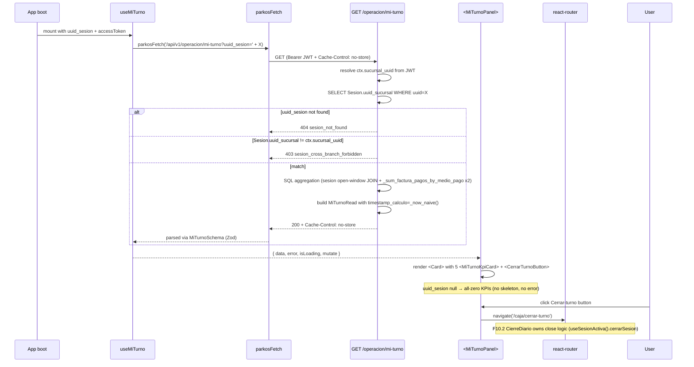

# Design: HU-F12.1 — Panel "Mi turno"

## Header

| Field | Value |
|---|---|
| Change | `fase-12-1-mi-turno` |
| Phase | 12 (sdd-design — Phase 4 of SDD cycle) |
| Inputs read | `proposal.md` (88 lines, 10 drift anchors); `specs/spec.md` (158 lines, REQ-OPS-184..190); `plan.md` lines 2348-2375; F11.2 archived `design.md` substrate (242 lines, 7 ADs); `~/.config/opencode/skills/{sdd-design,react}/SKILL.md` |
| Substrate verified | `backend/.../api/v1/operacion.py:42-97` (router prefix `/operacion`, no `/mi-turno` stub); `backend/.../models/L_S/sesion.py` (`Sesion.timestamp_apertura`, `timestamp_cierre`, `uuid_sucursal`, `uuid_usuario`, `valor_inicial_*`); `backend/.../models/L_E/ingreso.py:46-49` (`fecha_ingreso` column); `backend/.../models/A/salidas.py:32` (extends `AppendOnlyBase`); `backend/.../models/A/factura_pagos.py:40-94` (`uuid_sesion`, `medio_pago`, `valor`, `tipo_movimiento`); `backend/.../repo/arqueo.py:287-316` (`_sum_factura_pagos_by_medio_pago` helper signature); `backend/.../repo/session_cycle.py:46-48` (`_now_naive()` pattern); `apps/electron-sucursal/src/features/caja/pages/Dashboard.tsx:78` |
| Status | DRAFT — awaits sdd-tasks |
| Preflight | pace=auto, artifact=hybrid (OpenSpec + Engram), delivery=ask-on-risk, budget=2000 LOC, strict_tdd=true, test=vitest+playwright+testcontainers, author=`Parkos Dev <dev@parkos.local>` |

## Goals

- Ship `GET /operacion/mi-turno?uuid_sesion=X` returning the 7-field `MiTurnoRead` aggregate (REQ-OPS-184) over `prod.sesion` open-window temporal JOIN.
- Promote `<MiTurnoPanel />` to the Dashboard right sidebar above `<OcupacionPanel />` with 5 KPI cards + Cerrar-turno button (REQ-OPS-187).
- Reconcile FE Zod `MiTurnoSchema` to BE Pydantic `MiTurnoRead` (REQ-OPS-189, DA-F12.1-1 / DA-F12.1-9 gating).

## Non-Goals

- New writes to `ingreso`/`salidas`/`factura_pagos` (read-only aggregator, bi-temporal canon preserved).
- Historial multi-turno (F12.x backlog), per-day breakdown (F10.3 owns).
- New SUM helper — reuse `repo/arqueo.py::_sum_factura_pagos_by_medio_pago` (REQ-OPS-186).
- Additional i18n locales beyond es-CO.

## Architecture decisions (AD-1..AD-7)

### AD-1 — Append new endpoint to existing `api/v1/operacion.py` router (D1)

**Choice**: New `GET /operacion/mi-turno` handler appended to the existing `router = APIRouter(prefix="/operacion", tags=["operacion"])` at `backend/.../api/v1/operacion.py:95`. Handler signature: `@router.get("/mi-turno", response_model=MiTurnoRead, response_model_by_alias=False)` with `Response` injection for `Cache-Control: no-store`. Issuer guard `_ingreso_issuer_dep = requires_issuer("operador-", "admin-")` already in place — reuse verbatim (no new dep). Handler uses `TenantContext` via `get_tenant_ctx` to extract `ctx.sucursal_uuid`.

**File**: `backend/packages/parkos_core/src/parkos_core/api/v1/operacion.py` (MODIFY, +40 LOC). New Pydantic `MiTurnoRead` at `backend/.../schemas/operacion.py` (+25 LOC).

**Rejected**: New router file — violates F11.x precedent of one router per aggregate prefix (per F1.5/F1.8). No-Cache header absent — violates REQ-OPS-184.

### AD-2 — Tenant pin via server-side `Sesion.uuid_sucursal` resolution (D2)

**Choice**: Handler ignores any `uuid_sucursal` query/body field. Pipeline: (1) read `ctx.sucursal_uuid` from `TenantContext` (JWT-issuer-pinned, F1.x pattern via `app.dependency_overrides`); (2) `SELECT Sesion.uuid_sucursal WHERE Sesion.uuid = :uuid_sesion` — if `None` → 404 `sesion_not_found`; (3) compare resolved `uuid_sucursal` against `ctx.sucursal_uuid` — if mismatch → 403 `sesion_cross_branch_forbidden`. The derived branch scope `S_s` equals the resolved value (per REQ-OPS-186). No `X-Sesion-Context` header — operator JWT already carries the scope (F2.2 invariant).

**File**: same handler as AD-1 (no new dep).

**Rejected**: Header-based `X-Sesion-Context` — duplicates JWT scope and confuses multi-tenant semantics (KD-3). Trust query-string `uuid_sucursal` — violates REQ-OPS-185.

### AD-3 — SQL aggregation: Sesion open-window temporal JOIN + reuse `_sum_factura_pagos_by_medio_pago` (D3, Q1 resolved)

**Choice**: Helper `backend/.../repo/mi_turno.py::calcular_resumen_mi_turno(session, uuid_sesion)` returns `MiTurnoRead`. Pure SQL builder at `backend/.../app/sql/mi_turno_query.py` (~40 LOC) constructs:

```sql
SELECT
  COUNT(*) FILTER (WHERE i.uuid_sucursal = :S_s
                   AND i.fecha_ingreso >= :t_open
                   AND (:t_close IS NULL OR i.fecha_ingreso <= :t_close)) AS ingresos_count,
  COUNT(*) FILTER (WHERE s.uuid_sucursal = :S_s
                   AND s.fecha_salida >= :t_open
                   AND (:t_close IS NULL OR s.fecha_salida <= :t_close)) AS salidas_count
FROM prod.sesion
LEFT JOIN prod.ingreso i ON TRUE
LEFT JOIN prod.salidas  s ON TRUE
WHERE prod.sesion.uuid = :uuid_sesion
```

`total_cobrado_*_cop` reuses `repo/arqueo.py::_sum_factura_pagos_by_medio_pago(session, uuid_sesion=S, uuid_sucursal=None, fecha=None, medios_pago=(...))`. **Q1 resolved** — canonical medio_pago tuples (mirror F1.13 `calcular_esperado_sesion` line-by-line):
- `total_cobrado_efectivo_cop` → `medios_pago=("efectivo",)` (per `repo/arqueo.py:345`).
- `total_cobrado_datafono_cop` → `medios_pago=("tarjeta", "datafono")` (per `repo/arqueo.py:352` — both tarjeta and datafono classify as datafono-style POS PIN-pad payment distinct from efectivo).
- `timestamp_calculo = _now_naive()` per `repo/session_cycle.py:46-48` (Q2 resolved — naive UTC matches `DateTime(timezone=False)` columns; FE serializes via ISO 8601 in Zod `z.string()`).

**Files**: NEW `backend/.../repo/mi_turno.py` (~40 LOC), NEW `backend/.../app/sql/mi_turno_query.py` (~40 LOC).

**Rejected**: Add `uuid_sesion` FK on `ingreso`/`salidas` — violates ER.mmd 4FN canon (mutating `[L-E]`/`[A]` bi-temporal tables is forbidden; R-F12.1-1). New SUM helper — DRY violation; F1.13 helper covers both tuple shapes.

### AD-4 — `<MiTurnoPanel>` orchestrator + 5 `<MiTurnoKpiCard>` + `<CerrarTurnoButton>` (D4)

**Choice**: Three new components in `apps/electron-sucursal/src/features/operacion/components/`:
- `<MiTurnoPanel uuid_sesion: string | null>` (~120 LOC, orchestrator) — calls `useMiTurno(uuid_sesion)`; renders shadcn `Card` with header `t("miTurno.titulo")`, body grid of 5 `<MiTurnoKpiCard>` (ingresos / salidas / totalCobrado / efectivo / datafono), footer `<CerrarTurnoButton>`.
- `<MiTurnoKpiCard label: string; value: number | string>` (~40 LOC, shadcn `Card`) — semantic tokens only; `tabular-nums`; `aria-label={label}`; `data-testid={`mi-turno-kpi-${slug(label)}`}`.
- `<CerrarTurnoButton>` (~30 LOC, navigation only) — shadcn `Button` with `onClick={() => navigate("/caja/cerrar-turno")}`. NO `useSesionActiva().cerrarSesion` call (F10.2 owns that logic). Disabled when `uuid_sesion` is null.

Mount in `Dashboard.tsx` right sidebar ABOVE `<OcupacionPanel />` (per F4.3 location at `features/caja/components/OcupacionPanel.tsx`).

**Rejected**: Monolithic component — breaks F11.2 component-composition precedent. Reuse F10.2 close button — F10.2 button owns close logic; F12.1 only navigates.

### AD-5 — `useMiTurno` SWR with 15 s polling + 5 s deduping + 401 cleanup (D5)

**Choice**: SWR key: `uuid_sesion && accessToken ? '/api/v1/operacion/mi-turno?uuid_sesion=' + uuid_sesion : null`. Cache strategy: `refreshInterval: 15_000` (vs F11.x 30s — operator-live turn metrics justify 2x cadence per R-F12.1-4 mitigation note: `prod.sesion` partial unique index keeps cardinality to 1 active session per operator, so SUM cost is bounded), `dedupingInterval: 5_000`, `revalidateOnReconnect: true`, `shouldRetryOnError: (err) => err.status !== 401 && err.status !== 403 && err.status !== 404`. 401 mid-polling → `useAuthStore.getState().clear()` + `window.dispatchEvent(new Event('parkos:auth:cleared'))` (F2.2 invariant, F11.2 AD-3 precedent). Fetcher `parkosFetch<unknown>(url)` + `MiTurnoSchema.parse(raw)`; Zod throws → hook returns `{ error: ZodError }`.

**File**: NEW `apps/electron-sucursal/src/features/operacion/hooks/useMiTurno.ts` (~80 LOC).

**Rejected**: 30 s polling — violates REQ-OPS-188 (operator-live). WebSocket — deferred to v2. Optimistic UI — read-only aggregate, no client state.

### AD-6 — FE/BE schema lock via static key-set test (D6, DA-F12.1-1, DA-F12.1-9)

**Choice**: Zod `MiTurnoSchema` at `apps/electron-sucursal/src/lib/api/schemas/mi-turno.ts` (~25 LOC) with EXACTLY the 7 backend fields per REQ-OPS-189. Static key-set test `__tests__/mi-turno.test.ts` (~40 LOC) imports `MiTurnoSchema`, reads key set via `Object.keys(MiTurnoSchema.shape)`, and asserts equality against a fixture of the 7 BE Pydantic field names. Backend pytest `tests/unit/test_mi_turno_schema.py` does the same mirror against `MiTurnoRead.model_fields.keys()`. Both tests run in CI; mismatch breaks the build (defense-in-depth drift gate per F11.1/F11.2 precedent).

**Files**: NEW Zod schema (~25 LOC) + NEW key-set test (~40 LOC).

**Rejected**: `.passthrough()` Zod — defeats strict-against-drift defence (REQ-OPS-189 scenario). Runtime schema comparison only — drift detected at unit-test time, not at parse time.

### AD-7 — Test layering: pytest unit + testcontainers integration, vitest unit, Playwright `test.skip` (D7)

**Choice**:
- BE unit: `backend/.../tests/unit/test_mi_turno_schema.py` — Pydantic parse + default-zero assertion (REQ-OPS-184 scenario).
- BE integration: `backend/.../tests/integration/test_mi_turno_endpoint.py` (~80 LOC) — 5 scenarios: happy-path (mixed activity), zero-state (open session, no events), cross-branch 403, closed-session window excludes post-turn, `uuid_sesion` not found 404. Fixture `sesion_with_ingresos_y_pagos` added to `tests/integration/conftest.py` (mirrors F1.13 `sesion_with_ingresos_y_pagos` pattern).
- FE unit: `apps/electron-sucursal/src/features/operacion/__tests__/useMiTurno.test.ts` (~80 LOC, 4 scenarios: loading / zero / 15s polling cadence / 401 cleanup) + `__tests__/MiTurnoPanel.test.tsx` (~120 LOC, 5 scenarios: zero-state, non-zero, 401, 5xx, Cerrar-turno navigation) + `__tests__/mi-turno.test.ts` (~40 LOC, schema key-set lock).
- e2e: `apps/electron-sucursal/e2e/mi-turno.spec.ts` (~150 LOC, 2 scenarios: KPIs visible after login, Cerrar-turno navigates to `/caja/cerrar-turno`) — both wrapped in `test.skip("skip reason: sandbox F.6 — Playwright cannot launch real Electron", ...)` per F10.2/F11.x precedent.

**Rejected**: Mock-only e2e (no backend assertion) — contradicts F11.1 e2e S3 testcontainers precedent. Split into 4 e2e files — review fatigue.

## Data flow



## File changes

| File | Action | LOC | Description |
|---|---|---|---|
| `backend/.../api/v1/operacion.py` | MODIFY | +40 | Append `GET /mi-turno` handler with `Cache-Control: no-store`; add Pydantic `MiTurnoRead` import. |
| `backend/.../schemas/operacion.py` | MODIFY | +25 | Add `MiTurnoRead` class (7 fields per REQ-OPS-184). |
| `backend/.../repo/mi_turno.py` | NEW | ~40 | `calcular_resumen_mi_turno(session, uuid_sesion, ctx_sucursal_uuid)` returning `MiTurnoRead`. |
| `backend/.../app/sql/mi_turno_query.py` | NEW | ~40 | Pure SQL builder (Sesion open-window temporal JOIN). |
| `backend/.../tests/integration/conftest.py` | MODIFY | +60 | Add `sesion_with_ingresos_y_pagos` factory fixture (1 Sesion + 2 ingreso + 1 salida + 3 factura_pagos). |
| `backend/.../tests/unit/test_mi_turno_schema.py` | NEW | ~30 | Pydantic parse + default-zero + key-set lock test. |
| `backend/.../tests/integration/test_mi_turno_endpoint.py` | NEW | ~80 | 5 scenarios against testcontainers Postgres. |
| `apps/electron-sucursal/src/features/operacion/hooks/useMiTurno.ts` | NEW | ~80 | SWR hook with 15s polling + 401 cleanup. |
| `apps/electron-sucursal/src/features/operacion/types.ts` | NEW | ~30 | Shared TS types from BE `MiTurnoRead`. |
| `apps/electron-sucursal/src/lib/api/schemas/mi-turno.ts` | NEW | ~25 | Zod schema (7 fields + `strict()`). |
| `apps/electron-sucursal/src/lib/api/schemas/__tests__/mi-turno.test.ts` | NEW | ~40 | Schema parse + key-set lock test. |
| `apps/electron-sucursal/src/features/operacion/components/MiTurnoPanel.tsx` | NEW | ~120 | Orchestrator (Card + grid + footer button). |
| `apps/electron-sucursal/src/features/operacion/components/MiTurnoKpiCard.tsx` | NEW | ~40 | shadcn Card KPI cell. |
| `apps/electron-sucursal/src/features/operacion/components/CerrarTurnoButton.tsx` | NEW | ~30 | Navigation-only Button. |
| `apps/electron-sucursal/src/features/caja/pages/Dashboard.tsx` | MODIFY | +10 | Mount `<MiTurnoPanel uuid_sesion={sesion?.uuid} />` ABOVE `<OcupacionPanel />`. |
| `apps/electron-sucursal/src/renderer/i18n/locales/operacion.json` | MODIFY | +30 | Add 8 keys: `miTurno.titulo`, `miTurno.kpis.{ingresos,salidas,totalCobrado,efectivo,datafono}`, `miTurno.cerrarTurno`. |
| `apps/electron-sucursal/src/features/operacion/__tests__/useMiTurno.test.ts` | NEW | ~80 | 4 scenarios (loading / zero / 15s polling / 401 cleanup). |
| `apps/electron-sucursal/src/features/operacion/__tests__/MiTurnoPanel.test.tsx` | NEW | ~120 | 5 scenarios (zero / non-zero / 401 / 5xx / Cerrar-turno navigation). |
| `apps/electron-sucursal/e2e/mi-turno.spec.ts` | NEW | ~150 | 2 scenarios + `test.skip` per F10.2/F11.x precedent. |

**Forecast**: 14 NEW + 4 MODIFY = 18 files. Source ~485 LOC; tests ~500 LOC; total ~985 LOC (well under 2,000 LOC meta-budget).

## Test plan

| REQ-OPS | Scenario | Test file | Type |
|---|---|---|---|
| 184 | 7-field Pydantic shape + `Cache-Control: no-store` | `test_mi_turno_schema.py` + `test_mi_turno_endpoint.py` | pytest unit + integration |
| 184 | Happy path (3 ingresos + 2 salidas + 50k efectivo + 30k datafono) | `test_mi_turno_endpoint.py` | pytest integration |
| 184 | Zero-state (open sesion, no events → 200 with zeros) | `test_mi_turno_endpoint.py` | pytest integration |
| 185 | Cross-branch 403 `sesion_cross_branch_forbidden` | `test_mi_turno_endpoint.py` | pytest integration |
| 185 | Unknown `uuid_sesion` 404 `sesion_not_found` | `test_mi_turno_endpoint.py` | pytest integration |
| 186 | Closed-session window excludes post-turn (5 ingresos: 3 inside + 2 post-turn → count=3) | `test_mi_turno_endpoint.py` | pytest integration |
| 186 | medio_pago tuple breakdown (efectivo `("efectivo",)` + datafono `("tarjeta","datafono")`) | `test_mi_turno_endpoint.py` | pytest integration |
| 187 | `<MiTurnoPanel />` mounted above `<OcupacionPanel />` | `MiTurnoPanel.test.tsx` | RTL |
| 187 | Cerrar-turno click → `navigate('/caja/cerrar-turno')` only (no `cerrarSesion` call) | `MiTurnoPanel.test.tsx` | RTL |
| 187 | Zero state (uuid_sesion null → all zeros, no skeleton) | `MiTurnoPanel.test.tsx` | RTL |
| 188 | 15s polling cadence + 5s deduping | `useMiTurno.test.ts` | vitest unit |
| 188 | 401 mid-polling → `useAuthStore.clear()` + `parkos:auth:cleared` event | `useMiTurno.test.ts` | vitest unit |
| 189 | Zod key set matches Pydantic key set (drift gate) | `mi-turno.test.ts` (FE) + `test_mi_turno_schema.py` (BE) | vitest + pytest |
| 189 | Zod `strict()` rejects unknown fields | `mi-turno.test.ts` | vitest unit |
| 190 | FE e2e: KPIs visible after login + Cerrar-turno navigation (both `test.skip`) | `e2e/mi-turno.spec.ts` | playwright |

## Migration plan

None — read-only aggregate over existing tables (`prod.sesion`, `prod.ingreso`, `prod.salidas`, `prod.factura_pagos`). No schema change, no migration, no `[A]` row written. `python openspec/scripts/check_schema_match.py` exits `0` unchanged.

## Threat matrix

N/A — no routing, shell, subprocess, VCS/PR automation, executable-file classification, or process-integration boundary is added or modified. The change adds one read-only GET endpoint + one SWR-driven FE panel; auth + API + DB boundaries unchanged. Existing `requires_issuer("operador-", "admin-")` guard + JWT-pinned `TenantContext` cover the only new ingress.

## Risk acknowledgements

| ID | Severity | Mitigation in design |
|---|---|---|
| DA-F12.1-1 (BE/FE schema match) | High | AD-6: static key-set test in both pytest + vitest. |
| DA-F12.1-2 (tenant pin) | High | AD-2: server-side `Sesion.uuid_sucursal` resolution + 403 on mismatch. |
| DA-F12.1-3 (15s polling vs F11.x 30s) | Med | AD-5: partial unique index bounds SUM cardinality; `dedupingInterval: 5_000` cuts idle fetches. |
| DA-F12.1-4 (zero-state) | Med | AD-1: BE always 200 with zeros; AD-5: FE renders 0 without skeleton/error. |
| DA-F12.1-5 (Cerrar-turno button reuse) | Med | AD-4: button navigates only; F10.2 owns close logic. |
| DA-F12.1-6 (backend stub) | Low | AD-1: extend existing router; no new router file. |
| DA-F12.1-7 (i18n keys) | Low | AD-4: 8 keys added to `operacion.json` (es-CO only). |
| DA-F12.1-8 (test fixture) | Med | AD-7: `sesion_with_ingresos_y_pagos` factory fixture (F1.13 pattern). |
| DA-F12.1-9 (FE/BE drift) | High | AD-6: defense-in-depth key-set lock in both test pyramids. |
| DA-F12.1-10 (no `uuid_sesion` on ingreso/salidas) | High | AD-3: Sesion open-window temporal JOIN preserves bi-temporal canon. |
| **R-CARRY-1** (F11.x thresholds) | Low | Inherited F11.1/F11.2 thresholds carry forward without modification — F12.1 has no occupancy thresholds. |
| **REQ-OPS-173 letter** (F11.1) | Low | Unchanged. F12.1 adds REQ-OPS-184..190; REQ-OPS-173 untouched. |
| **REQ-OPS-177..183** (F11.2) | Low | Unchanged. F12.1 deltas `operations` domain; F11.2 entries remain authoritative. |
| **Q3 (query-vs-header for uuid_sesion)** | Low | Resolved in AD-2: query string for simplicity; matches existing `/operacion/ingresos?placa=X` precedent. Tradeoff: query params are URL-logged at proxy layer (no PII here — UUID only) — header alternative would force FE refactor and break F2.2 invariant. |
| **R-F12.1-1** (bi-temporal canon) | High | AD-3: open-window JOIN via `fecha_ingreso` / `fecha_salida` predicates; no column added to `[L-E]`/`[A]`. |
| **R-F12.1-2** (SUM helper reuse) | Med | AD-3: `_sum_factura_pagos_by_medio_pago` reused verbatim with canonical tuples. |
| **R-F12.1-3** (sandbox F.6 Playwright) | Low | AD-7: e2e `test.skip(...)` per F10.2/F11.x precedent; vitest unit tests cover same surface. |
| **R-F12.1-4** (15s polling load) | Med | AD-5: 1 active sesion per operator (partial unique index) bounds SUM cost. |